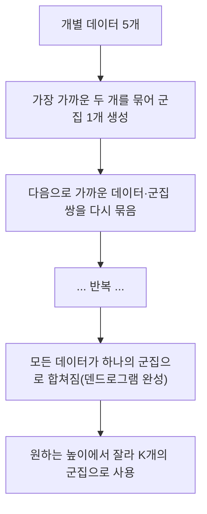
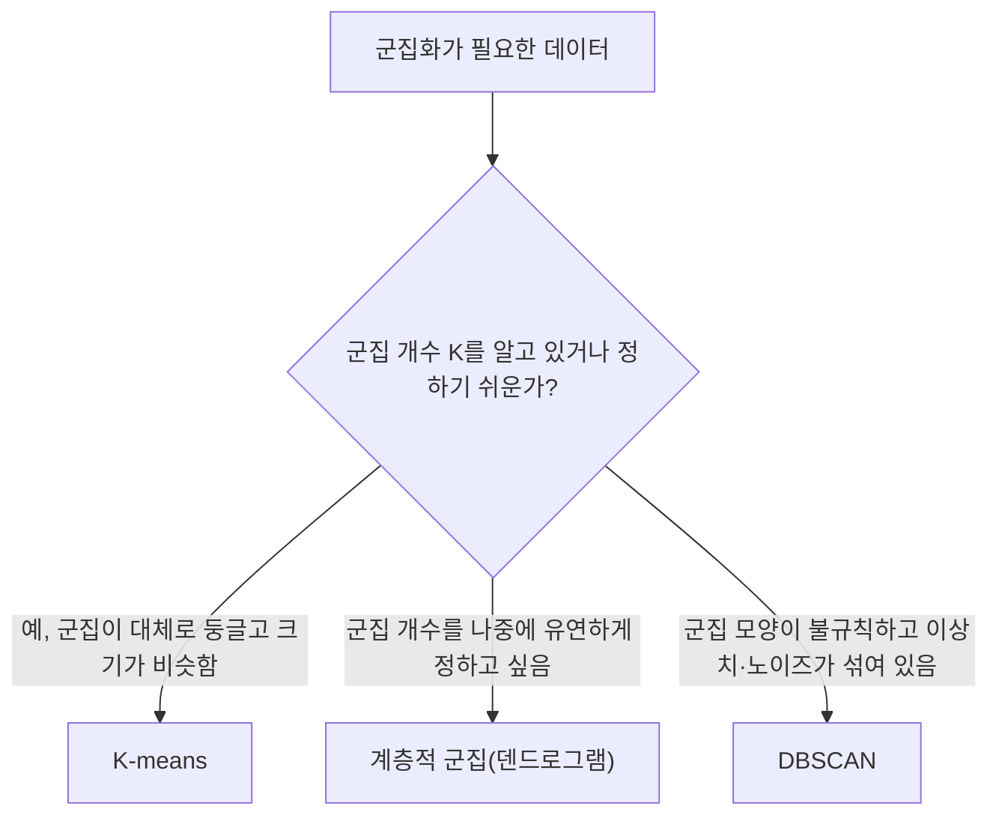

<Callout type="info">
  **이번 문서의 목표:** K-means 알고리즘을 실제 좌표로 1회 이상 반복 계산해 수렴시키고, 계층적 군집의 연결법 4가지와 DBSCAN의 핵심 파라미터를 비교하며, 실루엣 계수로 군집 품질을 수치로 해석할 수 있다.
</Callout>

## 비지도학습에서 군집이란

### 왜 필요한가

07편에서 다룬 지도학습(supervised learning)은 정답 레이블(label)이 있는 데이터로 학습했다. 그런데 현실에는 "이 고객이 어떤 유형인지" 미리 정답이 매겨져 있지 않은 데이터가 훨씬 많다. 이럴 때 데이터끼리 비슷한 것끼리 묶어 스스로 그룹을 찾아내는 작업이 **군집화**(clustering)이며, 정답 레이블 없이 데이터의 구조만으로 학습하는 **비지도학습**(unsupervised learning)의 대표적인 기법이다.

> **쉽게 말하면:** 군집화는 정답표 없이 데이터끼리 비슷한 정도만 보고 "끼리끼리" 묶는 작업이다.

이 문서에서는 대표적인 세 가지 군집 알고리즘, 즉 **K-means**(중심 기반), **계층적 군집**(hierarchical clustering, 거리 기반 병합), **DBSCAN**(밀도 기반)을 다룬다.

## K-means: 중심점을 기준으로 나누기

### 왜 필요한가

가장 직관적인 군집화 방법은 "각 그룹의 중심을 정하고, 데이터를 가장 가까운 중심에 배정한 뒤, 배정된 데이터로 중심을 다시 계산하는" 과정을 반복하는 것이다. 이 아이디어를 구현한 알고리즘이 **K-means**(K-평균)다.

> **쉽게 말하면:** K-means는 중심점 K개를 임의로 찍고, 가까운 데이터를 그 중심에 배정한 다음, 배정된 데이터의 평균으로 중심을 옮기는 과정을 더 이상 안 바뀔 때까지 반복하는 방법이다.

### 정의

- $K$: 미리 정해야 하는 군집(cluster)의 개수. K-means는 K를 스스로 찾지 않고 사용자가 지정해야 한다.
- **중심**(centroid): 한 군집에 속한 데이터들의 평균 좌표. 각 반복마다 새로 계산된다.
- **거리**(distance): 보통 유클리드 거리(Euclidean distance, 두 점을 잇는 직선 거리)를 사용해 각 데이터가 어느 중심에 더 가까운지 판단한다.

두 점 $(x_1, y_1)$과 $(x_2, y_2)$ 사이의 유클리드 거리는 다음과 같다.

$$
d = \sqrt{(x_1-x_2)^2 + (y_1-y_2)^2}
$$

- $d$: 두 점 사이의 거리
- $(x_1, y_1)$, $(x_2, y_2)$: 비교할 두 점의 좌표

### K-means 절차

<Steps>

**1단계. 군집 개수 K와 초기 중심 정하기**

몇 개의 군집으로 나눌지 K를 정하고, 데이터 중 K개를 무작위로 골라(또는 임의의 좌표로) 초기 중심으로 삼는다.

**2단계. 각 데이터를 가장 가까운 중심에 배정**

모든 데이터에 대해 각 중심까지의 거리를 계산하고, 거리가 가장 짧은 중심의 군집으로 배정한다.

**3단계. 중심을 다시 계산**

각 군집에 배정된 데이터들의 평균 좌표를 구해, 그 값을 새로운 중심으로 삼는다.

**4단계. 수렴할 때까지 2~3단계 반복**

새로 계산한 중심이 이전 중심과 같거나(또는 데이터의 군집 배정이 더 이상 바뀌지 않으면) 알고리즘을 멈춘다. 계속 바뀐다면 2단계로 돌아간다.

</Steps>

### 계산 예제: 2차원 좌표로 2회 반복 직접 계산

2차원 평면에 점 4개가 있다. $A(1,1)$, $B(2,1)$, $C(4,3)$, $D(5,4)$이며, $K=2$로 군집화하고 초기 중심은 $A$와 $D$로 잡는다(즉 $c_1=(1,1)$, $c_2=(5,4)$).

**1회차 배정**

각 점에서 $c_1=(1,1)$, $c_2=(5,4)$까지의 거리를 계산한다.

$$
d(A, c_1) = 0, \quad d(A, c_2) = \sqrt{(5-1)^2+(4-1)^2} = \sqrt{16+9} = 5
$$

$A$는 $c_1$에 더 가까우므로 군집 1에 배정된다.

$$
d(B, c_1) = \sqrt{(2-1)^2+(1-1)^2} = 1, \quad d(B, c_2) = \sqrt{(2-5)^2+(1-4)^2} = \sqrt{18} \approx 4.24
$$

$B$도 군집 1에 배정된다.

$$
d(C, c_1) = \sqrt{(4-1)^2+(3-1)^2} = \sqrt{13} \approx 3.61, \quad d(C, c_2) = \sqrt{(4-5)^2+(3-4)^2} = \sqrt{2} \approx 1.41
$$

$C$는 $c_2$에 더 가까우므로 군집 2에 배정된다.

$$
d(D, c_1) = 5, \quad d(D, c_2) = 0
$$

$D$는 군집 2에 배정된다. 따라서 1회차 배정 결과는 군집 1 = $\{A, B\}$, 군집 2 = $\{C, D\}$다.

**1회차 중심 재계산**

$$
c_1 = \left(\frac{1+2}{2}, \frac{1+1}{2}\right) = (1.5,\ 1)
$$

$$
c_2 = \left(\frac{4+5}{2}, \frac{3+4}{2}\right) = (4.5,\ 3.5)
$$

**2회차 배정**

새 중심 $c_1=(1.5,1)$, $c_2=(4.5,3.5)$로 다시 거리를 계산한다.

$$
d(A, c_1) = \sqrt{(1-1.5)^2+(1-1)^2} = 0.5, \quad d(A, c_2) = \sqrt{(1-4.5)^2+(1-3.5)^2} \approx 4.30
$$

$A$는 여전히 군집 1이다.

$$
d(B, c_1) = \sqrt{(2-1.5)^2+(1-1)^2} = 0.5, \quad d(B, c_2) = \sqrt{(2-4.5)^2+(1-3.5)^2} \approx 3.54
$$

$B$도 여전히 군집 1이다.

$$
d(C, c_1) = \sqrt{(4-1.5)^2+(3-1)^2} \approx 3.20, \quad d(C, c_2) = \sqrt{(4-4.5)^2+(3-3.5)^2} \approx 0.71
$$

$C$는 여전히 군집 2다.

$$
d(D, c_1) = \sqrt{(5-1.5)^2+(4-1)^2} \approx 4.61, \quad d(D, c_2) = \sqrt{(5-4.5)^2+(4-3.5)^2} \approx 0.71
$$

$D$도 여전히 군집 2다.

### 결과 해석: 수렴 확인

2회차에서도 배정 결과가 군집 1 = $\{A, B\}$, 군집 2 = $\{C, D\}$로 1회차와 완전히 같다. 배정이 더 이상 바뀌지 않으므로 알고리즘은 **수렴**(convergence, 더 이상 값이 바뀌지 않는 상태)했다고 판단하고 반복을 멈춘다. 최종 군집은 $\{A, B\}$와 $\{C, D\}$이며, 최종 중심은 $(1.5, 1)$과 $(4.5, 3.5)$다.

### K 값을 정하는 방법: 엘보우 기법

K-means는 K를 미리 정해야 하는데, 적절한 K를 찾는 대표적인 방법이 **엘보우 기법**(elbow method)이다. K를 1부터 늘려가며 각 군집 내 데이터와 중심 사이 거리 제곱의 합(군집 내 제곱합, WCSS: Within-Cluster Sum of Squares)을 계산해 그래프로 그리면, K가 커질수록 WCSS는 계속 줄어들지만 어느 지점부터는 줄어드는 속도가 급격히 완만해진다. 그 꺾이는 지점(팔꿈치 모양)의 K를 적절한 군집 수로 선택한다.

### 자주 틀리는 점

K-means는 초기 중심을 어디로 잡느냐에 따라 최종 결과가 달라질 수 있다(지역 최적해, local optimum에 빠질 위험). 그래서 실제로는 초기 중심을 여러 번 다르게 잡아 반복 실행한 뒤 가장 좋은 결과를 택하는 방식(예: k-means++ 초기화)을 함께 쓴다. 또한 K-means는 군집이 원형(구형)에 가깝고 크기가 비슷할 때 잘 작동하며, 길게 늘어진 모양이나 밀도가 크게 다른 군집, 이상치가 섞인 데이터에는 잘 맞지 않는다는 한계도 자주 출제된다.

## 계층적 군집: 가까운 것부터 순서대로 묶기

### 왜 필요한가

K-means는 군집 개수 K를 미리 정해야 하는 부담이 있다. 반면 **계층적 군집**(hierarchical clustering)은 가장 가까운 데이터(또는 군집)끼리 순서대로 묶어 나가면서, 나중에 원하는 개수만큼 잘라 쓸 수 있는 나무 구조를 만든다.

> **쉽게 말하면:** 계층적 군집은 가장 가까운 데이터 둘을 먼저 합치고, 그다음 가까운 것을 계속 합쳐 나가 마지막엔 모두가 하나로 합쳐지는 나무를 그리는 방법이다.

### 정의: 응집형과 덴드로그램

계층적 군집에는 개별 데이터에서 시작해 점점 큰 군집으로 합쳐 나가는 **응집형**(agglomerative, 상향식)과, 전체 데이터 하나의 큰 군집에서 시작해 점점 작게 쪼개 나가는 **분할형**(divisive, 하향식)이 있으며, 실무에서는 응집형이 훨씬 많이 쓰인다. 이 병합 과정을 나무 모양 그림으로 표현한 것을 **덴드로그램**(dendrogram)이라 하며, 덴드로그램의 특정 높이에서 가로로 잘라 원하는 개수의 군집을 얻을 수 있다.

### 정의: 연결법 4가지

두 군집 사이의 거리를 어떻게 정의하느냐에 따라 **연결법**(linkage method)이 달라지고, 결과로 만들어지는 군집의 모양도 달라진다.

| 연결법 | 두 군집 사이 거리 정의 | 특징 |
|---|---|---|
| 단일 연결법(single linkage) | 두 군집에서 가장 가까운 점 사이의 거리(최솟값) | 계산이 쉽지만 사슬처럼 길게 이어지는 연쇄 효과(chaining)가 생기기 쉬움 |
| 완전 연결법(complete linkage) | 두 군집에서 가장 먼 점 사이의 거리(최댓값) | 조밀하고 둥근 군집을 만들지만 이상치에 민감 |
| 평균 연결법(average linkage) | 두 군집의 모든 점 쌍 사이 거리의 평균 | 단일·완전 연결법의 중간 성격, 비교적 안정적 |
| 와드 연결법(Ward's method) | 두 군집을 합쳤을 때 군집 내 분산이 늘어나는 정도(증가분)가 최소가 되는 기준 | K-means와 비슷하게 크기가 고른 둥근 군집을 만드는 경향 |

### 자주 틀리는 점

단일 연결법은 "가장 가까운 점끼리만" 보므로, 두 군집 사이에 점들이 사슬처럼 이어져 있으면 실제로는 다른 성질의 데이터인데도 하나의 길쭉한 군집으로 합쳐지는 **연쇄 효과**가 나타나기 쉽다. 반대로 완전 연결법은 "가장 먼 점끼리"를 보므로 이상치 하나가 군집 전체의 거리 계산을 크게 왜곡할 수 있다. "연결법에 따라 결과가 달라지지 않는다"는 서술은 틀린 설명이다.

## DBSCAN: 밀도로 군집을 찾기

### 왜 필요한가

K-means와 계층적 군집은 모두 "거리가 가까우면 같은 군집"이라는 전제를 쓴다. 그런데 초승달 모양이나 나선 모양처럼 군집이 원형이 아닌 경우, 또는 데이터에 뚜렷한 이상치(노이즈)가 섞여 있는 경우에는 거리 기반 방법이 잘 맞지 않는다. 이런 상황에서는 "주변에 데이터가 촘촘하게 몰려 있는 정도(밀도)"를 기준으로 군집을 찾는 방법이 더 적합하다. 이 방식이 **DBSCAN**(Density-Based Spatial Clustering of Applications with Noise, 밀도 기반 군집)이다.

> **쉽게 말하면:** DBSCAN은 "내 주변 반경 안에 데이터가 충분히 많이 몰려 있으면 같은 무리"로 보고, 주변에 데이터가 거의 없는 점은 군집이 아니라 노이즈로 처리하는 방법이다.

### 정의: 두 가지 핵심 파라미터

- $\varepsilon$(엡실론, eps): 한 점을 중심으로 이웃을 찾을 반경(거리 기준).
- $\text{minPts}$(최소 이웃 수, min_samples): 반경 $\varepsilon$ 안에 이 개수 이상의 점이 있어야 그 점을 "밀집된 중심"으로 인정하는 기준값.

이 두 값을 기준으로 점은 세 가지로 구분된다.

- **핵심점**(core point): 반경 $\varepsilon$ 안에 자기 자신을 포함해 $\text{minPts}$개 이상의 점이 있는 점.
- **경계점**(border point): 자신은 핵심점 조건을 만족하지 못하지만, 핵심점의 이웃 반경 안에는 포함되는 점.
- **잡음점**(noise point): 핵심점도 경계점도 아닌 점. 어떤 군집에도 속하지 않는다.

### DBSCAN의 장단점

| 구분 | 내용 |
|---|---|
| 장점 | 군집 개수 K를 미리 정할 필요가 없다, 원형이 아닌 임의 모양의 군집도 찾을 수 있다, 이상치(잡음점)를 자연스럽게 걸러낸다 |
| 단점 | $\varepsilon$과 minPts 설정에 결과가 크게 좌우된다, 군집마다 밀도 차이가 크면 하나의 $\varepsilon$ 값으로 모두를 잘 잡아내기 어렵다, 고차원 데이터에서는 거리 개념 자체가 흐려져 성능이 떨어질 수 있다(16편의 차원의 저주 참고) |

### 자주 틀리는 점

DBSCAN은 K-means와 달리 **군집 개수를 미리 지정하지 않는다.** "DBSCAN도 K-means처럼 군집 개수 K를 사용자가 먼저 정해야 한다"는 서술은 틀렸다. 또한 DBSCAN에서 어떤 점이 잡음점으로 분류됐다고 해서 그 데이터가 틀렸거나 오류라는 뜻은 아니며, 단지 주변 밀도가 낮아 어떤 군집에도 속하지 않는다고 판단된 것뿐이다.

## 군집 품질 평가: 실루엣 계수

### 왜 필요한가

정답 레이블이 없는 군집화는 지도학습처럼 "정확도"를 계산할 수 없다. 그래서 "이 군집화 결과가 얼마나 잘 나뉘었는가"를 정답 없이 평가할 별도의 지표가 필요하다. 그중 가장 널리 쓰이는 것이 **실루엣 계수**(silhouette coefficient)다.

> **쉽게 말하면:** 실루엣 계수는 "내가 속한 군집 안 친구들과는 가깝고, 다른 군집과는 멀수록" 높은 점수를 주는 지표다.

### 정의

한 데이터 $i$에 대해 다음 두 값을 계산한다.

- $a(i)$: 데이터 $i$와 **같은 군집**에 속한 다른 모든 점들과의 평균 거리(군집 내 응집도).
- $b(i)$: 데이터 $i$가 속하지 않은 군집들 중, 평균 거리가 가장 작은 군집까지의 평균 거리(가장 가까운 다른 군집과의 거리).

실루엣 계수는 다음과 같이 정의한다.

$$
s(i) = \frac{b(i) - a(i)}{\max(a(i), b(i))}
$$

- $s(i)$: 데이터 $i$의 실루엣 계수. 범위는 $-1$부터 $1$까지다.
- $s(i)$가 1에 가까울수록 자기 군집에 잘 응집되어 있고 다른 군집과는 잘 분리되어 있다는 뜻이다.
- $s(i)$가 0에 가까우면 두 군집의 경계에 애매하게 걸쳐 있다는 뜻이고, 음수면 오히려 다른 군집에 더 가깝다는 뜻이라 잘못 배정됐을 가능성을 보여준다.

### 계산 예제

앞서 K-means 예제에서 얻은 군집 1 = $\{A(1,1), B(2,1)\}$, 군집 2 = $\{C(4,3), D(5,4)\}$를 그대로 사용해, 점 $B$의 실루엣 계수를 계산해 보자.

**1단계: $a(B)$ 계산 — 같은 군집(군집 1) 내 다른 점과의 거리**

군집 1에서 $B$ 외의 점은 $A$ 하나뿐이다.

$$
a(B) = d(B, A) = \sqrt{(2-1)^2+(1-1)^2} = 1
$$

**2단계: $b(B)$ 계산 — 가장 가까운 다른 군집(군집 2)과의 평균 거리**

$$
d(B, C) = \sqrt{(2-4)^2+(1-3)^2} = \sqrt{8} \approx 2.83
$$

$$
d(B, D) = \sqrt{(2-5)^2+(1-4)^2} = \sqrt{18} \approx 4.24
$$

$$
b(B) = \frac{2.83 + 4.24}{2} \approx 3.54
$$

**3단계: 실루엣 계수 계산**

$$
s(B) = \frac{3.54 - 1}{\max(1,\ 3.54)} = \frac{2.54}{3.54} \approx 0.717
$$

### 결과 해석

$s(B) \approx 0.717$은 1에 상당히 가까운 값이다. 이는 $B$가 자신이 속한 군집 1의 $A$와는 매우 가깝고(거리 1), 다른 군집인 군집 2와는 상당히 멀리 떨어져 있다(평균 거리 약 3.54)는 뜻이다. 즉 $B$는 지금의 군집 배정이 잘 이뤄진 점이라고 해석할 수 있다. 만약 모든 점의 실루엣 계수 평균이 낮다면(예: 0.2 이하), 지금의 K 값이나 군집 경계가 적절하지 않을 가능성을 의심하고 K를 바꾸거나 다른 알고리즘을 고려해야 한다.

### 자주 틀리는 점

실루엣 계수가 음수인 데이터는 "자신이 속한 군집보다 다른 군집에 더 가깝다"는 뜻이며, 이는 군집화 자체가 완전히 실패했다는 의미가 아니라 **그 데이터 하나의 배정이 애매하다**는 뜻으로 해석해야 한다. 전체 품질은 개별 점이 아니라 모든 점의 실루엣 계수 **평균**으로 판단한다.

## 세 군집 알고리즘 선택 기준

## 핵심 정리

- K-means는 초기 중심 설정 → 거리 기반 배정 → 중심 재계산을 배정이 바뀌지 않을 때까지 반복하며, K는 사용자가 미리 정해야 하고 초기값에 따라 결과가 달라질 수 있다.
- 계층적 군집은 가까운 데이터·군집부터 순서대로 병합해 덴드로그램을 만들며, 연결법(단일·완전·평균·와드)에 따라 군집 모양이 달라진다.
- DBSCAN은 반경 $\varepsilon$과 최소 이웃 수 minPts로 핵심점·경계점·잡음점을 구분하는 밀도 기반 방법으로, K를 미리 정할 필요가 없고 임의 모양의 군집과 이상치 탐지에 강하다.
- 실루엣 계수 $s(i) = (b(i)-a(i)) / \max(a(i), b(i))$는 군집 내 응집도와 군집 간 분리도를 함께 반영하며, 1에 가까울수록 좋은 군집화다.

## 마무리 복습

<Quiz
  questionNumber={1}
  question="K-means 알고리즘의 절차를 순서대로 바르게 나열한 것은?"
  options={['거리 계산 → 초기 중심 설정 → 수렴 판정 → 중심 재계산', '초기 중심 설정 → 가장 가까운 중심에 데이터 배정 → 군집 평균으로 중심 재계산 → 배정이 안 바뀔 때까지 반복', '군집 개수 K를 데이터로부터 자동으로 계산 → 배정 → 종료', '모든 점을 하나의 군집으로 병합 → 점점 작은 군집으로 분할']}
  correctAnswer={2}
  explanation="K-means는 초기 중심을 정한 뒤, 각 데이터를 가장 가까운 중심에 배정하고, 배정된 데이터의 평균으로 중심을 다시 계산하는 과정을 배정이 더 이상 바뀌지 않을 때까지 반복한다."
  optionExplanations={['거리 계산은 초기 중심을 정한 이후에 이뤄지므로 순서가 틀렸다', 'K-means의 표준 절차를 정확한 순서로 설명했다', 'K-means는 K를 자동으로 계산하지 않고 사용자가 미리 지정해야 하므로 틀렸다', '이는 계층적 군집(분할형)에 대한 설명이며 K-means와는 다르다']}
/>

<Quiz
  questionNumber={2}
  question="두 점 A(2,3)과 B(6,6) 사이의 유클리드 거리는?"
  options={['3', '5', '7', '9']}
  correctAnswer={2}
  explanation="유클리드 거리 공식에 대입하면 d = 제곱근((6-2)^2 + (6-3)^2) = 제곱근(16+9) = 제곱근(25) = 5다."
  optionExplanations={['제곱근(25)=5이므로 3은 계산 오류다', '제곱근(16+9)=제곱근(25)=5로 정확히 계산됐다', '좌표 차이를 제곱하지 않고 그냥 더한 값(4+3=7)과 혼동한 경우 나올 수 있는 오답이다', '제곱 계산을 잘못했을 때 나올 수 있는 값으로 정답이 아니다']}
/>

<Quiz
  questionNumber={3}
  question="계층적 군집의 연결법(linkage method) 중 두 군집에서 가장 가까운 점 사이의 거리를 기준으로 삼아 사슬처럼 길게 이어지는 연쇄 효과가 나타나기 쉬운 것은?"
  options={['단일 연결법(single linkage)', '완전 연결법(complete linkage)', '평균 연결법(average linkage)', '와드 연결법(Ward의 method)']}
  correctAnswer={1}
  explanation="단일 연결법은 두 군집에서 가장 가까운 점 사이의 거리(최솟값)만 보므로, 점들이 사슬처럼 이어져 있으면 서로 다른 성질의 데이터도 하나의 길쭉한 군집으로 묶이는 연쇄 효과가 나타나기 쉽다."
  optionExplanations={['최솟값 기준으로 인한 연쇄 효과가 단일 연결법의 대표적인 특징이므로 정답이다', '완전 연결법은 최댓값을 기준으로 하여 오히려 조밀한 군집을 만드는 경향이 있다', '평균 연결법은 모든 점 쌍의 평균을 사용해 단일·완전 연결법의 중간 성격을 가진다', '와드 연결법은 분산 증가량을 최소화하는 기준이라 연쇄 효과와는 거리가 멀다']}
/>

<Quiz
  questionNumber={4}
  question="DBSCAN에서 어떤 점 P가 반경 엡실론 안에 자기 자신을 포함해 minPts개 이상의 점을 갖고 있을 때, 이 점 P를 부르는 명칭은?"
  options={['경계점(border point)', '핵심점(core point)', '잡음점(noise point)', '중심점(centroid)']}
  correctAnswer={2}
  explanation="반경 엡실론 안에 minPts개 이상의 점을 가진 점은 핵심점으로 분류된다. 핵심점 조건은 만족하지 못하지만 핵심점의 이웃 반경에 포함되는 점은 경계점, 둘 다 아니면 잡음점이다."
  optionExplanations={['경계점은 스스로는 핵심점 조건을 만족하지 못하는 점을 가리키므로 틀렸다', '반경 안에 충분한 이웃을 가진 점이 핵심점의 정의와 정확히 일치한다', '잡음점은 핵심점도 경계점도 아닌, 어떤 군집에도 속하지 않는 점이다', '중심점(centroid)은 K-means에서 쓰는 개념으로 DBSCAN의 용어가 아니다']}
/>

<Quiz
  questionNumber={5}
  question="어떤 점의 실루엣 계수를 계산했더니 a(i)=2, b(i)=6이 나왔다. 이 점의 실루엣 계수와 해석으로 옳은 것은?"
  options={['s(i) = (6-2)/6 ≈ 0.667이며, 자기 군집에 잘 응집되고 다른 군집과 잘 분리된 편이다', 's(i) = (2-6)/6 ≈ -0.667이며, 군집화가 완전히 잘못되었다는 뜻이다', 's(i) = 2/6 ≈ 0.333이며, a(i)만 사용해 계산한다', 's(i) = 6/2 = 3이며, 값이 클수록 좋은 군집화다']}
  correctAnswer={1}
  explanation="실루엣 계수는 (b(i)-a(i))/max(a(i),b(i))로 계산한다. (6-2)/max(2,6) = 4/6 ≈ 0.667이며, 1에 가까운 양수이므로 같은 군집 내 응집도가 높고 다른 군집과는 잘 분리되어 있다고 해석한다."
  optionExplanations={['공식과 계산 결과, 해석 모두 정확하다', '분자의 부호를 반대로 계산했으며 이 경우 실제로는 양수가 나오므로 틀렸다', '실루엣 계수는 a(i)와 b(i)를 모두 사용하는 공식이므로 틀렸다', '실루엣 계수의 범위는 -1에서 1 사이이며 3이라는 값 자체가 나올 수 없다']}
/>

<Quiz
  questionNumber={6}
  question="K-means, 계층적 군집, DBSCAN에 대한 설명으로 옳지 않은 것은?"
  options={['K-means는 군집 개수 K를 사용자가 미리 정해야 한다', '계층적 군집은 덴드로그램을 활용해 나중에 원하는 군집 개수를 유연하게 정할 수 있다', 'DBSCAN은 군집 개수를 미리 지정해야 하며 초승달 모양의 군집은 찾을 수 없다', 'DBSCAN은 밀도가 낮은 점을 잡음점으로 분류해 이상치 탐지에도 활용할 수 있다']}
  correctAnswer={3}
  explanation="DBSCAN은 군집 개수를 미리 지정할 필요가 없으며, 밀도 기반 방식이기 때문에 원형이 아닌 초승달 모양 등 임의의 모양을 가진 군집도 찾아낼 수 있다는 것이 K-means 대비 핵심 장점이다."
  optionExplanations={['K-means가 K를 미리 정해야 한다는 설명은 옳으므로 이 문항의 정답이 아니다', '계층적 군집의 덴드로그램 활용 설명은 옳으므로 정답이 아니다', 'DBSCAN은 K를 지정할 필요가 없고 임의 모양의 군집도 찾을 수 있으므로 이 설명이 틀린 설명이며 정답이다', 'DBSCAN의 잡음점 분류와 이상치 탐지 활용은 옳은 설명이므로 정답이 아니다']}
/>

## 참고 자료

- [scikit-learn User Guide — Clustering](https://scikit-learn.org/stable/modules/clustering.html)
- [국가평생교육진흥원 독학학위제](https://bdes.nile.or.kr)
