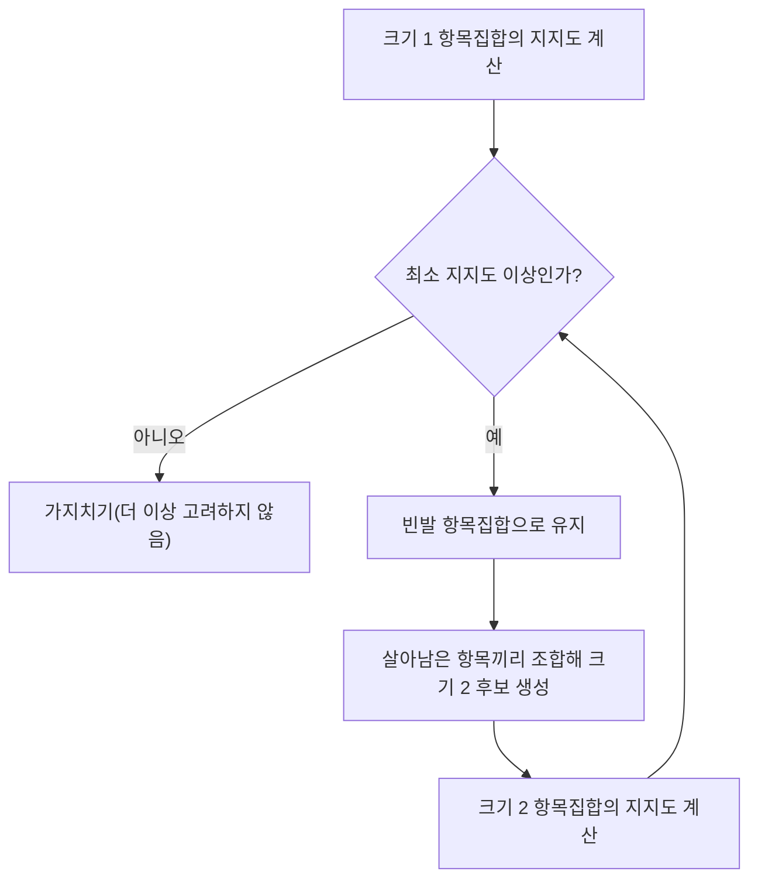

## 연관 규칙이란 무엇인가

### 정의: 항목집합과 규칙

- **항목**(item): 거래에 포함될 수 있는 개별 상품이나 요소(예: 빵, 우유, 기저귀).
- **항목집합**(itemset): 하나 이상의 항목을 묶은 집합(예: 빵과 기저귀를 묶은 \{빵, 기저귀\}).
- **거래**(transaction): 한 번의 구매에서 실제로 담긴 항목집합(예: 영수증 하나).
- **연관 규칙**: "항목집합 X를 사면 항목집합 Y도 함께 산다"는 형태의 문장으로, $X \Rightarrow Y$로 표기한다. $X$를 규칙의 **선행부**(antecedent), $Y$를 **후행부**(consequent)라 부른다.

## 규칙의 강도를 재는 세 가지 지표

### 계산용 거래 데이터

다음과 같이 5건의 거래가 있다고 하자.

| 거래 번호 | 구매 항목 |
|---|---|
| T1 | 빵, 우유 |
| T2 | 빵, 기저귀, 맥주, 달걀 |
| T3 | 우유, 기저귀, 맥주, 콜라 |
| T4 | 빵, 우유, 기저귀, 맥주 |
| T5 | 빵, 우유, 기저귀, 콜라 |

### 정의: 지지도

**지지도**(support)는 전체 거래 중 특정 항목집합이 포함된 거래의 비율이다.

$$
\text{support}(X) = \frac{X\text{를 포함한 거래 수}}{\text{전체 거래 수}}
$$

- $X$: 지지도를 구하려는 항목집합
- 지지도는 그 항목집합이 얼마나 "흔한" 조합인지를 나타내며, 지지도가 너무 낮은 조합은 우연히 한두 번 같이 팔린 것일 수 있어 최소 지지도(minimum support) 기준 이하는 분석에서 제외한다.

빵과 기저귀를 함께 산 거래는 T2, T4, T5로 3건이다.

$$
\text{support}(\{\text{빵, 기저귀}\}) = \frac{3}{5} = 0.6
$$

빵만 포함된 거래는 T1, T2, T4, T5로 4건이다.

$$
\text{support}(\{\text{빵}\}) = \frac{4}{5} = 0.8
$$

기저귀만 포함된 거래는 T2, T3, T4, T5로 4건이다.

$$
\text{support}(\{\text{기저귀}\}) = \frac{4}{5} = 0.8
$$

### 정의: 신뢰도

**신뢰도**(confidence)는 선행부 $X$를 포함한 거래 중에서, 후행부 $Y$까지 함께 포함한 거래의 비율이다. 즉 "X를 산 사람 중 몇 퍼센트가 Y도 샀는가"를 나타낸다.

$$
\text{confidence}(X \Rightarrow Y) = \frac{\text{support}(X \cup Y)}{\text{support}(X)}
$$

- $X \cup Y$: $X$와 $Y$를 모두 포함하는 항목집합(합집합)
- 신뢰도는 조건부확률 $P(Y \mid X)$(X가 일어났을 때 Y가 일어날 확률)와 같은 개념이다.

빵 -> 기저귀 규칙의 신뢰도를 구해 보자.

$$
\text{confidence}(\text{빵} \Rightarrow \text{기저귀}) = \frac{\text{support}(\{\text{빵, 기저귀}\})}{\text{support}(\{\text{빵}\})} = \frac{0.6}{0.8} = 0.75
$$

빵을 산 4건의 거래 중 3건에서 기저귀도 함께 샀으므로, 신뢰도 0.75(75퍼센트)는 이 계산과 정확히 일치한다.

### 정의: 향상도

신뢰도만으로는 함정이 있다. 만약 기저귀 자체가 원래 매우 인기 있는 상품이라 아무 조합과 묶어도 신뢰도가 높게 나온다면, 그 규칙이 "빵과 기저귀 사이의 진짜 관계" 때문인지 "기저귀가 원래 잘 팔려서"인지 구분할 수 없다. 이를 보정하기 위한 지표가 **향상도**(lift)다.

$$
\text{lift}(X \Rightarrow Y) = \frac{\text{confidence}(X \Rightarrow Y)}{\text{support}(Y)}
$$

- 향상도가 **1보다 크면**: $X$와 $Y$가 서로 양(positive)의 관계, 즉 $X$를 살 때 $Y$를 살 가능성이 우연(독립일 때의 기대치)보다 더 높아진다.
- 향상도가 **정확히 1이면**: $X$와 $Y$는 서로 아무 관계가 없다(통계적으로 독립).
- 향상도가 **1보다 작으면**: $X$와 $Y$가 서로 음(negative)의 관계, 즉 $X$를 살 때 오히려 $Y$를 살 가능성이 우연보다 더 낮아진다.

빵 -> 기저귀 규칙의 향상도를 계산해 보자.

$$
\text{lift}(\text{빵} \Rightarrow \text{기저귀}) = \frac{0.75}{0.8} = 0.9375
$$

### 결과 해석: 신뢰도가 높아도 향상도가 낮을 수 있다

빵 -> 기저귀 규칙은 신뢰도가 0.75로 꽤 높아 보이지만, 향상도는 0.9375로 **1보다 작다.** 이는 기저귀 자체의 지지도(0.8, 전체 거래의 80퍼센트에 등장)가 워낙 높아서, 빵을 사든 안 사든 원래 기저귀를 살 확률 자체가 높았기 때문이다. 즉 빵을 사는 것이 기저귀 구매 확률을 오히려 살짝 낮추는 방향(1보다 작으므로)이라, "빵과 기저귀는 함께 사는 경향이 있는 상품"이라고 결론 내리면 안 되는 사례다.

이번에는 맥주 -> 기저귀 규칙을 계산해 비교해 보자. 맥주를 포함한 거래는 T2, T3, T4로 3건이므로 $\text{support}(\{\text{맥주}\}) = 3/5 = 0.6$이다. 맥주와 기저귀를 함께 포함한 거래도 T2, T3, T4로 3건이다.

$$
\text{support}(\{\text{맥주, 기저귀}\}) = \frac{3}{5} = 0.6
$$

$$
\text{confidence}(\text{맥주} \Rightarrow \text{기저귀}) = \frac{0.6}{0.6} = 1.0
$$

$$
\text{lift}(\text{맥주} \Rightarrow \text{기저귀}) = \frac{1.0}{0.8} = 1.25
$$

맥주 -> 기저귀 규칙은 신뢰도가 1.0(맥주를 산 사람은 100퍼센트 기저귀도 샀다)이고, 향상도도 1.25로 **1보다 크다.** 이 규칙은 빵 -> 기저귀와 달리 "맥주와 기저귀가 실제로 함께 팔리는 경향이 우연보다 강하다"고 해석할 수 있는, 진짜 의미 있는 연관 규칙의 예다. 이것이 마케팅 사례로 자주 인용되는 "맥주와 기저귀" 이야기의 핵심 논리다.

### 자주 틀리는 점

"신뢰도가 높으면 무조건 의미 있는 규칙이다"는 틀린 생각이다. 신뢰도는 후행부 $Y$ 자체의 인기(지지도)를 반영하지 못하므로, 반드시 **향상도까지 함께 확인**해서 우연(독립일 때의 기댓값)보다 실제로 더 강한 연관이 있는지 검토해야 한다.

## Apriori와 FP-Growth: 항목집합을 찾는 방법

### 정의: Apriori의 핵심 원리

**Apriori 원리**(Apriori property)는 "어떤 항목집합이 빈발(자주 등장)하려면, 그 항목집합의 모든 부분집합도 반드시 빈발해야 한다"는 성질이다. 이를 뒤집어 말하면, **어떤 항목집합이 최소 지지도를 넘지 못해 빈발하지 않다면, 그 항목집합을 포함하는 더 큰 항목집합도 절대 빈발할 수 없다.** Apriori 알고리즘은 이 성질을 이용해, 크기 1인 항목집합부터 시작해 빈발하지 않는 조합을 가지치기(pruning)하며 단계적으로 크기를 늘려간다.

### 정의: FP-Growth의 접근

**FP-Growth**(Frequent Pattern Growth)는 Apriori처럼 후보 항목집합을 일일이 만들어 지지도를 재계산하는 대신, 전체 거래 데이터를 **FP-트리**(Frequent Pattern Tree, 등장 빈도가 높은 항목을 위쪽에 배치해 압축한 나무 구조)로 한 번만 변환한 뒤, 이 압축된 나무를 훑어 빈발 항목집합을 찾는다. 후보를 반복적으로 생성하고 원본 데이터를 여러 번 스캔해야 하는 Apriori보다, 거래 건수와 항목 종류가 많을 때 일반적으로 더 효율적이다.

### 두 알고리즘 비교

| 구분 | Apriori | FP-Growth |
|---|---|---|
| 기본 아이디어 | 부분집합이 빈발해야 전체도 빈발할 수 있다는 원리로 후보를 가지치기 | 거래 데이터를 압축한 트리 구조로 변환해 후보 생성을 생략 |
| 데이터 스캔 횟수 | 항목집합 크기를 늘릴 때마다 원본 데이터를 반복해서 스캔 | 트리를 만들 때 원본 데이터를 스캔한 이후로는 트리만 탐색 |
| 후보 생성 | 명시적으로 후보 항목집합을 생성한 뒤 지지도 계산 | 후보를 직접 생성하지 않고 트리 구조로 빈발 패턴을 도출 |
| 적합한 상황 | 항목 종류가 적거나 개념을 이해하기 쉬운 예제 | 거래 건수·항목 종류가 많은 대규모 데이터 |

### 자주 틀리는 점

Apriori 원리는 "부분집합이 흔하면 전체도 흔하다"가 아니라, 그 **역방향인 부정 명제**로 활용된다는 점에 유의해야 한다. 즉 "부분집합이 흔하지 않으면(빈발하지 않으면) 그 부분집합을 포함하는 더 큰 집합도 흔할 수 없다"는 논리로 후보를 걸러내는 것이지, "부분집합이 흔하다고 해서 그것을 포함한 더 큰 집합도 반드시 흔하다"는 뜻은 아니다.

## 연관 규칙의 활용과 한계

### 활용 사례

- **장바구니 분석**(market basket analysis): 마트·이커머스에서 함께 구매되는 상품을 찾아 매대 배치나 묶음 할인에 활용한다.
- **추천 시스템**: "이 상품을 담은 고객이 함께 담은 상품" 형태의 추천에 연관 규칙의 아이디어가 쓰인다.
- **웹 로그·클릭 분석**: 사용자가 어떤 페이지를 본 뒤 어떤 페이지로 이동하는지 패턴을 찾는 데도 같은 논리를 적용할 수 있다.

### 한계와 자주 틀리는 점

연관 규칙에서 찾아낸 "함께 팔린다"는 패턴은 **상관관계**(correlation)이지 **인과관계**(causation, 원인과 결과 관계)가 아니다. 맥주와 기저귀가 함께 잘 팔린다는 규칙이 나왔다고 해서 "맥주를 사면 기저귀를 사게 만드는 원인이 된다"고 해석하면 안 되며, 단지 두 상품을 사는 고객층이나 상황이 겹친다는 관찰에 불과하다.

## 핵심 정리

- 연관 규칙 $X \Rightarrow Y$는 지지도(전체에서 얼마나 흔한가), 신뢰도(X를 살 때 Y까지 살 조건부확률), 향상도(우연보다 얼마나 더 강한 관계인가)로 강도를 판단한다.
- 신뢰도가 높아도 후행부 자체의 지지도가 높으면 향상도가 1보다 작을 수 있으므로, 신뢰도만 보지 말고 반드시 향상도까지 함께 확인해야 한다.
- Apriori는 "부분집합이 빈발하지 않으면 전체도 빈발할 수 없다"는 원리로 후보를 가지치기하며, FP-Growth는 FP-트리로 데이터를 압축해 후보 생성을 생략한다.
- 연관 규칙이 찾아낸 패턴은 상관관계일 뿐 인과관계를 의미하지 않는다.

## 마무리 복습

<Quiz
  questionNumber={1}
  question={"전체 거래 10건 중 항목집합 {우유, 빵}을 포함한 거래가 4건일 때, 이 항목집합의 지지도는?"}
  options={["0.1","0.4","0.6","4"]}
  correctAnswer={2}
  explanation={"지지도는 전체 거래 수 대비 해당 항목집합을 포함한 거래 수의 비율이므로 4/10 = 0.4다."}
/>

<Quiz
  questionNumber={2}
  question={"support({빵})=0.8, support({빵, 기저귀})=0.6일 때 규칙 빵 → 기저귀의 신뢰도는?"}
  options={["0.48","0.6","0.75","1.33"]}
  correctAnswer={3}
  explanation={"신뢰도는 support(X∪Y)/support(X)로 계산하므로 0.6/0.8 = 0.75다."}
/>

<Quiz
  questionNumber={3}
  question={"규칙 A → B의 신뢰도가 0.75, support(B)가 0.5일 때 향상도(lift)와 그 해석으로 옳은 것은?"}
  options={["lift = 0.375이며, A와 B는 서로 무관하다","lift = 1.5이며, A를 살 때 B를 살 가능성이 우연보다 높다","lift = 1.5이며, A와 B는 서로 무관하다","lift = 0.667이며, A와 B는 음의 관계다"]}
  correctAnswer={2}
  explanation={"향상도는 confidence(A→B)/support(B)로 계산하므로 0.75/0.5 = 1.5다. 향상도가 1보다 크므로 A를 살 때 B를 살 가능성이 두 항목이 독립일 때의 기대치보다 높다고 해석한다."}
/>

## 참고 자료

- [scikit-learn User Guide — Supervised learning, Clustering, Dimensionality reduction](https://scikit-learn.org/stable/user_guide.html)
- [국가평생교육진흥원 독학학위제](https://bdes.nile.or.kr)
