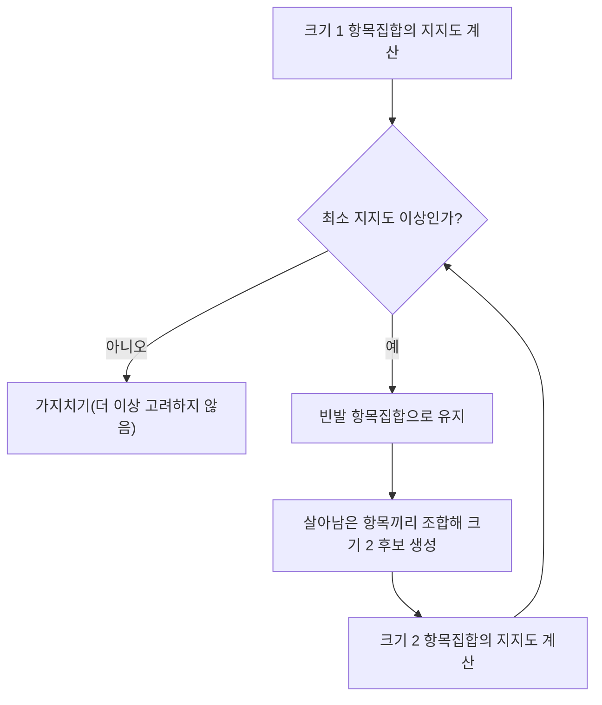

<Callout type="info">
  **이번 문서의 목표:** 거래 데이터에서 지지도·신뢰도·향상도를 실제 숫자로 계산해 규칙의 의미를 해석하고, Apriori와 FP-Growth의 차이, 연관 규칙이 활용되는 상황과 시험 출제 포인트를 설명할 수 있다.
</Callout>

## 연관 규칙이란 무엇인가

### 왜 필요한가

"기저귀를 산 고객이 맥주도 함께 산다"처럼, 대형마트의 거래 기록을 분석하다 보면 겉보기엔 관련 없어 보이는 상품들이 자주 함께 팔리는 패턴이 발견되곤 한다. 이런 패턴을 사람이 하나하나 눈으로 찾는 것은 상품 종류가 몇 개만 넘어가도 사실상 불가능하다. **연관 규칙**(association rule)은 대량의 거래 데이터에서 "무엇을 사면 무엇을 함께 사는 경향이 있는가"라는 규칙을 자동으로 찾아내는 비지도학습 기법이다.

> **쉽게 말하면:** 연관 규칙은 "A를 산 사람이 B도 같이 사더라"는 패턴을 거래 데이터에서 자동으로 찾아내는 기법이다.

### 정의: 항목집합과 규칙

- **항목**(item): 거래에 포함될 수 있는 개별 상품이나 요소(예: 빵, 우유, 기저귀).
- **항목집합**(itemset): 하나 이상의 항목을 묶은 집합(예: 빵과 기저귀를 묶은 \{빵, 기저귀\}).
- **거래**(transaction): 한 번의 구매에서 실제로 담긴 항목집합(예: 영수증 하나).
- **연관 규칙**: "항목집합 X를 사면 항목집합 Y도 함께 산다"는 형태의 문장으로, $X \Rightarrow Y$로 표기한다. $X$를 규칙의 **선행부**(antecedent), $Y$를 **후행부**(consequent)라 부른다.

## 규칙의 강도를 재는 세 가지 지표

### 왜 필요한가

거래 데이터에서 가능한 항목집합의 조합은 상품 종류가 늘어날수록 기하급수적으로 많아진다. 이 수많은 조합 중 "정말 의미 있는 규칙"만 골라내려면, 그 규칙이 얼마나 자주 나타나는지, 얼마나 믿을 만한지, 우연이 아닌지를 숫자로 판단할 기준이 필요하다. 그래서 연관 규칙은 **지지도**·**신뢰도**·**향상도** 세 지표를 함께 본다.

> **쉽게 말하면:** 지지도는 "이 조합이 전체에서 얼마나 자주 나오는가", 신뢰도는 "A를 산 사람 중 몇 퍼센트가 B도 샀는가", 향상도는 "A와 B가 우연히 같이 팔린 것보다 실제로 얼마나 더 자주 같이 팔렸는가"를 나타낸다.

### 계산용 거래 데이터

다음과 같이 5건의 거래가 있다고 하자.

| 거래 번호 | 구매 항목 |
|---|---|
| T1 | 빵, 우유 |
| T2 | 빵, 기저귀, 맥주, 달걀 |
| T3 | 우유, 기저귀, 맥주, 콜라 |
| T4 | 빵, 우유, 기저귀, 맥주 |
| T5 | 빵, 우유, 기저귀, 콜라 |

### 정의: 지지도

**지지도**(support)는 전체 거래 중 특정 항목집합이 포함된 거래의 비율이다.

$$
\text{support}(X) = \frac{X\text{를 포함한 거래 수}}{\text{전체 거래 수}}
$$

- $X$: 지지도를 구하려는 항목집합
- 지지도는 그 항목집합이 얼마나 "흔한" 조합인지를 나타내며, 지지도가 너무 낮은 조합은 우연히 한두 번 같이 팔린 것일 수 있어 최소 지지도(minimum support) 기준 이하는 분석에서 제외한다.

빵과 기저귀를 함께 산 거래는 T2, T4, T5로 3건이다.

$$
\text{support}(\{\text{빵, 기저귀}\}) = \frac{3}{5} = 0.6
$$

빵만 포함된 거래는 T1, T2, T4, T5로 4건이다.

$$
\text{support}(\{\text{빵}\}) = \frac{4}{5} = 0.8
$$

기저귀만 포함된 거래는 T2, T3, T4, T5로 4건이다.

$$
\text{support}(\{\text{기저귀}\}) = \frac{4}{5} = 0.8
$$

### 정의: 신뢰도

**신뢰도**(confidence)는 선행부 $X$를 포함한 거래 중에서, 후행부 $Y$까지 함께 포함한 거래의 비율이다. 즉 "X를 산 사람 중 몇 퍼센트가 Y도 샀는가"를 나타낸다.

$$
\text{confidence}(X \Rightarrow Y) = \frac{\text{support}(X \cup Y)}{\text{support}(X)}
$$

- $X \cup Y$: $X$와 $Y$를 모두 포함하는 항목집합(합집합)
- 신뢰도는 조건부확률 $P(Y \mid X)$(X가 일어났을 때 Y가 일어날 확률)와 같은 개념이다.

빵 -> 기저귀 규칙의 신뢰도를 구해 보자.

$$
\text{confidence}(\text{빵} \Rightarrow \text{기저귀}) = \frac{\text{support}(\{\text{빵, 기저귀}\})}{\text{support}(\{\text{빵}\})} = \frac{0.6}{0.8} = 0.75
$$

빵을 산 4건의 거래 중 3건에서 기저귀도 함께 샀으므로, 신뢰도 0.75(75퍼센트)는 이 계산과 정확히 일치한다.

### 정의: 향상도

신뢰도만으로는 함정이 있다. 만약 기저귀 자체가 원래 매우 인기 있는 상품이라 아무 조합과 묶어도 신뢰도가 높게 나온다면, 그 규칙이 "빵과 기저귀 사이의 진짜 관계" 때문인지 "기저귀가 원래 잘 팔려서"인지 구분할 수 없다. 이를 보정하기 위한 지표가 **향상도**(lift)다.

$$
\text{lift}(X \Rightarrow Y) = \frac{\text{confidence}(X \Rightarrow Y)}{\text{support}(Y)}
$$

- 향상도가 **1보다 크면**: $X$와 $Y$가 서로 양(positive)의 관계, 즉 $X$를 살 때 $Y$를 살 가능성이 우연(독립일 때의 기대치)보다 더 높아진다.
- 향상도가 **정확히 1이면**: $X$와 $Y$는 서로 아무 관계가 없다(통계적으로 독립).
- 향상도가 **1보다 작으면**: $X$와 $Y$가 서로 음(negative)의 관계, 즉 $X$를 살 때 오히려 $Y$를 살 가능성이 우연보다 더 낮아진다.

빵 -> 기저귀 규칙의 향상도를 계산해 보자.

$$
\text{lift}(\text{빵} \Rightarrow \text{기저귀}) = \frac{0.75}{0.8} = 0.9375
$$

### 결과 해석: 신뢰도가 높아도 향상도가 낮을 수 있다

빵 -> 기저귀 규칙은 신뢰도가 0.75로 꽤 높아 보이지만, 향상도는 0.9375로 **1보다 작다.** 이는 기저귀 자체의 지지도(0.8, 전체 거래의 80퍼센트에 등장)가 워낙 높아서, 빵을 사든 안 사든 원래 기저귀를 살 확률 자체가 높았기 때문이다. 즉 빵을 사는 것이 기저귀 구매 확률을 오히려 살짝 낮추는 방향(1보다 작으므로)이라, "빵과 기저귀는 함께 사는 경향이 있는 상품"이라고 결론 내리면 안 되는 사례다.

이번에는 맥주 -> 기저귀 규칙을 계산해 비교해 보자. 맥주를 포함한 거래는 T2, T3, T4로 3건이므로 $\text{support}(\{\text{맥주}\}) = 3/5 = 0.6$이다. 맥주와 기저귀를 함께 포함한 거래도 T2, T3, T4로 3건이다.

$$
\text{support}(\{\text{맥주, 기저귀}\}) = \frac{3}{5} = 0.6
$$

$$
\text{confidence}(\text{맥주} \Rightarrow \text{기저귀}) = \frac{0.6}{0.6} = 1.0
$$

$$
\text{lift}(\text{맥주} \Rightarrow \text{기저귀}) = \frac{1.0}{0.8} = 1.25
$$

맥주 -> 기저귀 규칙은 신뢰도가 1.0(맥주를 산 사람은 100퍼센트 기저귀도 샀다)이고, 향상도도 1.25로 **1보다 크다.** 이 규칙은 빵 -> 기저귀와 달리 "맥주와 기저귀가 실제로 함께 팔리는 경향이 우연보다 강하다"고 해석할 수 있는, 진짜 의미 있는 연관 규칙의 예다. 이것이 마케팅 사례로 자주 인용되는 "맥주와 기저귀" 이야기의 핵심 논리다.

### 자주 틀리는 점

"신뢰도가 높으면 무조건 의미 있는 규칙이다"는 틀린 생각이다. 신뢰도는 후행부 $Y$ 자체의 인기(지지도)를 반영하지 못하므로, 반드시 **향상도까지 함께 확인**해서 우연(독립일 때의 기댓값)보다 실제로 더 강한 연관이 있는지 검토해야 한다. 또한 향상도가 1보다 작다고 해서 그 규칙이 "틀렸다"는 뜻이 아니라, "두 항목이 서로 대체재 관계에 가깝다" 같은 다른 의미로 해석될 수 있다는 점도 함께 알아 둬야 한다.

## Apriori와 FP-Growth: 항목집합을 찾는 방법

### 왜 필요한가

항목 종류가 $n$개면 만들 수 있는 항목집합의 개수는 $2^n - 1$개(공집합 제외)로, $n$이 조금만 커져도 모든 조합의 지지도를 일일이 계산하는 것은 계산량이 폭발적으로 늘어나 현실적이지 않다. 그래서 불필요한 조합을 미리 걸러내는 효율적인 탐색 방법이 필요하며, 대표적인 것이 **Apriori**와 **FP-Growth**다.

> **쉽게 말하면:** Apriori는 "부분집합이 흔하지 않으면 그걸 포함한 큰 집합도 흔할 수 없다"는 규칙으로 후보를 미리 쳐내고, FP-Growth는 거래 데이터를 압축한 나무 구조를 만들어 후보 생성 자체를 건너뛴다.

### 정의: Apriori의 핵심 원리

**Apriori 원리**(Apriori property)는 "어떤 항목집합이 빈발(자주 등장)하려면, 그 항목집합의 모든 부분집합도 반드시 빈발해야 한다"는 성질이다. 이를 뒤집어 말하면, **어떤 항목집합이 최소 지지도를 넘지 못해 빈발하지 않다면, 그 항목집합을 포함하는 더 큰 항목집합도 절대 빈발할 수 없다.** Apriori 알고리즘은 이 성질을 이용해, 크기 1인 항목집합부터 시작해 빈발하지 않는 조합을 가지치기(pruning)하며 단계적으로 크기를 늘려간다.

### 정의: FP-Growth의 접근

**FP-Growth**(Frequent Pattern Growth)는 Apriori처럼 후보 항목집합을 일일이 만들어 지지도를 재계산하는 대신, 전체 거래 데이터를 **FP-트리**(Frequent Pattern Tree, 등장 빈도가 높은 항목을 위쪽에 배치해 압축한 나무 구조)로 한 번만 변환한 뒤, 이 압축된 나무를 훑어 빈발 항목집합을 찾는다. 후보를 반복적으로 생성하고 원본 데이터를 여러 번 스캔해야 하는 Apriori보다, 거래 건수와 항목 종류가 많을 때 일반적으로 더 효율적이다.

### 두 알고리즘 비교

| 구분 | Apriori | FP-Growth |
|---|---|---|
| 기본 아이디어 | 부분집합이 빈발해야 전체도 빈발할 수 있다는 원리로 후보를 가지치기 | 거래 데이터를 압축한 트리 구조로 변환해 후보 생성을 생략 |
| 데이터 스캔 횟수 | 항목집합 크기를 늘릴 때마다 원본 데이터를 반복해서 스캔 | 트리를 만들 때 원본 데이터를 스캔한 이후로는 트리만 탐색 |
| 후보 생성 | 명시적으로 후보 항목집합을 생성한 뒤 지지도 계산 | 후보를 직접 생성하지 않고 트리 구조로 빈발 패턴을 도출 |
| 적합한 상황 | 항목 종류가 적거나 개념을 이해하기 쉬운 예제 | 거래 건수·항목 종류가 많은 대규모 데이터 |

### 자주 틀리는 점

Apriori 원리는 "부분집합이 흔하면 전체도 흔하다"가 아니라, 그 **역방향인 부정 명제**로 활용된다는 점에 유의해야 한다. 즉 "부분집합이 흔하지 않으면(빈발하지 않으면) 그 부분집합을 포함하는 더 큰 집합도 흔할 수 없다"는 논리로 후보를 걸러내는 것이지, "부분집합이 흔하다고 해서 그것을 포함한 더 큰 집합도 반드시 흔하다"는 뜻은 아니다.

## 연관 규칙의 활용과 한계

### 활용 사례

- **장바구니 분석**(market basket analysis): 마트·이커머스에서 함께 구매되는 상품을 찾아 매대 배치나 묶음 할인에 활용한다.
- **추천 시스템**: "이 상품을 담은 고객이 함께 담은 상품" 형태의 추천에 연관 규칙의 아이디어가 쓰인다.
- **웹 로그·클릭 분석**: 사용자가 어떤 페이지를 본 뒤 어떤 페이지로 이동하는지 패턴을 찾는 데도 같은 논리를 적용할 수 있다.

### 한계와 자주 틀리는 점

연관 규칙에서 찾아낸 "함께 팔린다"는 패턴은 **상관관계**(correlation)이지 **인과관계**(causation, 원인과 결과 관계)가 아니다. 맥주와 기저귀가 함께 잘 팔린다는 규칙이 나왔다고 해서 "맥주를 사면 기저귀를 사게 만드는 원인이 된다"고 해석하면 안 되며, 단지 두 상품을 사는 고객층이나 상황이 겹친다는 관찰에 불과하다. 또한 최소 지지도·최소 신뢰도 기준을 너무 낮게 잡으면 우연히 몇 번 같이 팔린 조합까지 규칙으로 쏟아져 나와 실제로 쓸모없는 규칙이 지나치게 많아질 수 있다는 점도 실무에서 자주 지적되는 함정이다.

## 핵심 정리

- 연관 규칙 $X \Rightarrow Y$는 지지도(전체에서 얼마나 흔한가), 신뢰도(X를 살 때 Y까지 살 조건부확률), 향상도(우연보다 얼마나 더 강한 관계인가)로 강도를 판단한다.
- 신뢰도가 높아도 후행부 자체의 지지도가 높으면 향상도가 1보다 작을 수 있으므로, 신뢰도만 보지 말고 반드시 향상도까지 함께 확인해야 한다.
- Apriori는 "부분집합이 빈발하지 않으면 전체도 빈발할 수 없다"는 원리로 후보를 가지치기하며, FP-Growth는 FP-트리로 데이터를 압축해 후보 생성을 생략한다.
- 연관 규칙이 찾아낸 패턴은 상관관계일 뿐 인과관계를 의미하지 않는다.

## 마무리 복습

<Quiz
  questionNumber={1}
  question="전체 거래 10건 중 항목집합 {우유, 빵}을 포함한 거래가 4건일 때, 이 항목집합의 지지도는?"
  options={['0.1', '0.4', '0.6', '4']}
  correctAnswer={2}
  explanation="지지도는 전체 거래 수 대비 해당 항목집합을 포함한 거래 수의 비율이므로 4/10 = 0.4다."
  optionExplanations={['4/10=0.4이며 0.1은 잘못된 계산이다', '4건을 전체 10건으로 나눈 값과 정확히 일치한다', '0.6은 이 계산 결과와 일치하지 않는 값이다', '지지도는 비율(0~1 사이 값)로 표현하며 건수 그대로인 4는 지지도가 아니다']}
/>

<Quiz
  questionNumber={2}
  question="support({빵})=0.8, support({빵, 기저귀})=0.6일 때 규칙 빵 → 기저귀의 신뢰도는?"
  options={['0.48', '0.6', '0.75', '1.33']}
  correctAnswer={3}
  explanation="신뢰도는 support(X∪Y)/support(X)로 계산하므로 0.6/0.8 = 0.75다."
  optionExplanations={['0.6과 0.8을 곱한 값으로 신뢰도 계산 방식과 다르다', '이는 support({빵, 기저귀}) 값 자체이며 신뢰도가 아니다', '0.6을 0.8로 나눈 값과 정확히 일치한다', '분자와 분모를 반대로 나눴을 때 나올 수 있는 값으로 정답이 아니다']}
/>

<Quiz
  questionNumber={3}
  question="규칙 A → B의 신뢰도가 0.75, support(B)가 0.5일 때 향상도(lift)와 그 해석으로 옳은 것은?"
  options={['lift = 0.375이며, A와 B는 서로 무관하다', 'lift = 1.5이며, A를 살 때 B를 살 가능성이 우연보다 높다', 'lift = 1.5이며, A와 B는 서로 무관하다', 'lift = 0.667이며, A와 B는 음의 관계다']}
  correctAnswer={2}
  explanation="향상도는 confidence(A→B)/support(B)로 계산하므로 0.75/0.5 = 1.5다. 향상도가 1보다 크므로 A를 살 때 B를 살 가능성이 두 항목이 독립일 때의 기대치보다 높다고 해석한다."
  optionExplanations={['0.75와 0.5를 곱한 값이며 향상도 계산 공식과 다르다', '1.5라는 값과 1보다 크다는 해석(양의 관계) 모두 정확하다', '값 1.5는 맞지만 향상도가 1보다 크면 무관이 아니라 양의 관계로 해석해야 하므로 틀렸다', '분모와 분자를 반대로 나눴을 때 나오는 값이며 해석도 틀렸다']}
/>

<Quiz
  questionNumber={4}
  question="연관 규칙에서 향상도(lift)가 1보다 작다는 것이 의미하는 바로 가장 적절한 것은?"
  options={['선행부와 후행부가 통계적으로 완전히 독립이다', '선행부를 살 때 후행부를 살 가능성이 우연(독립)일 때보다 오히려 낮다', '이 규칙은 계산 오류이므로 무시해야 한다', '신뢰도가 반드시 0이라는 뜻이다']}
  correctAnswer={2}
  explanation="향상도가 1보다 작다는 것은 선행부를 구매했을 때 후행부를 구매할 확률이, 두 항목이 서로 무관하다고 가정했을 때의 기대 확률보다 오히려 낮다는 뜻으로, 두 항목이 음의 관계에 있음을 시사한다."
  optionExplanations={['완전히 독립인 경우는 향상도가 정확히 1일 때이므로 틀렸다', '향상도가 1보다 작을 때의 정확한 해석이다', '향상도가 1보다 작은 것은 계산 오류가 아니라 의미 있는 결과 중 하나다', '향상도가 1보다 작아도 신뢰도 자체는 0이 아닌 값을 가질 수 있으므로 틀렸다']}
/>

<Quiz
  questionNumber={5}
  question="Apriori 알고리즘의 핵심 원리(Apriori property)로 가장 적절한 것은?"
  options={['어떤 항목집합이 빈발하면 그 항목집합을 포함하는 모든 상위집합도 반드시 빈발하다', '어떤 항목집합의 부분집합이 빈발하지 않으면 그 항목집합을 포함하는 더 큰 집합도 빈발할 수 없다', 'FP-트리를 만들어 후보 생성을 생략하는 원리다', '항목 종류가 많을수록 지지도가 항상 높아진다는 원리다']}
  correctAnswer={2}
  explanation="Apriori 원리는 어떤 항목집합의 부분집합이 최소 지지도를 넘지 못해 빈발하지 않으면, 그 부분집합을 포함하는 더 큰 항목집합도 절대 빈발할 수 없다는 성질을 이용해 후보를 가지치기하는 원리다."
  optionExplanations={['이 방향은 반대이며 실제로 Apriori는 빈발하지 않는 부분집합을 이용해 상위집합을 걸러낸다', 'Apriori 원리를 후보 가지치기에 활용하는 방식과 정확히 일치한다', 'FP-트리로 후보 생성을 생략하는 것은 FP-Growth의 특징이지 Apriori가 아니다', '항목 종류와 지지도 사이에는 이런 일반적 관계가 성립하지 않는다']}
/>

<Quiz
  questionNumber={6}
  question="Apriori와 FP-Growth를 비교한 설명으로 옳지 않은 것은?"
  options={['Apriori는 항목집합 크기를 늘릴 때마다 원본 데이터를 반복해서 스캔하는 경향이 있다', 'FP-Growth는 거래 데이터를 트리 구조로 압축해 후보 생성 과정을 생략한다', 'Apriori와 FP-Growth 모두 항목 종류가 아무리 많아져도 계산 효율이 완전히 동일하다', '거래 건수와 항목 종류가 많을 때는 일반적으로 FP-Growth가 더 효율적인 경향이 있다']}
  correctAnswer={3}
  explanation="Apriori는 후보 생성과 반복적인 데이터 스캔 때문에 항목 종류가 많아질수록 계산량이 크게 늘어나는 반면, FP-Growth는 트리 구조를 활용해 이러한 부담을 줄이므로 두 알고리즘의 효율이 항상 동일하다는 설명은 틀렸다."
  optionExplanations={['Apriori의 반복적 데이터 스캔 특징에 대한 옳은 설명이므로 정답이 아니다', 'FP-Growth의 핵심 아이디어에 대한 옳은 설명이므로 정답이 아니다', '두 알고리즘의 계산 효율은 데이터 규모에 따라 다르게 나타나므로 이 설명이 틀렸고 정답이다', '대규모 데이터에서 FP-Growth가 더 효율적이라는 설명은 옳으므로 정답이 아니다']}
/>

<Quiz
  questionNumber={7}
  question="장바구니 분석에서 발견된 연관 규칙 '기저귀 → 맥주'의 향상도가 1.25로 나타났을 때 이 결과에 대한 해석으로 가장 적절한 것은?"
  options={['기저귀를 사는 것이 맥주 구매의 직접적인 원인이라고 결론지을 수 있다', '기저귀와 맥주는 함께 팔리는 경향이 우연(독립)보다 강하다는 상관관계를 보여줄 뿐, 인과관계를 증명하지는 않는다', '향상도가 1.25이므로 이 규칙은 통계적으로 무의미하다', '향상도만으로는 어떤 해석도 할 수 없고 반드시 실험을 통한 인과관계 검증이 선행되어야 발표할 수 있다']}
  correctAnswer={2}
  explanation="향상도 1.25는 기저귀와 맥주가 우연히 독립적으로 팔릴 때의 기대치보다 실제로 더 자주 함께 팔린다는 상관관계를 보여주는 것이지, 기저귀 구매가 맥주 구매를 유발한다는 인과관계를 증명하는 것은 아니다."
  optionExplanations={['연관 규칙은 상관관계를 보여줄 뿐이며 인과관계를 증명하지 않으므로 틀렸다', '향상도가 1보다 큰 상관관계를 정확히 해석했고 인과관계와 구분한 설명이 정확하다', '향상도 1.25는 1보다 크므로 오히려 의미 있는 양의 관계를 시사하는 값이다', '향상도 지표 자체로 상관관계 유무를 판단할 수 있으므로 이 설명은 지나치게 제한적이다']}
/>

## 참고 자료

- [scikit-learn User Guide — Supervised learning, Clustering, Dimensionality reduction](https://scikit-learn.org/stable/user_guide.html)
- [국가평생교육진흥원 독학학위제](https://bdes.nile.or.kr)
