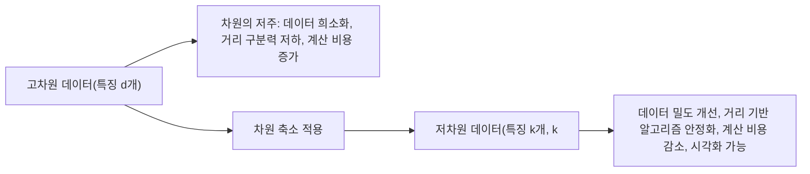

<Callout type="info">
  **이번 문서의 목표:** 차원이 늘어날수록 데이터 공간이 어떻게 희소해지고 거리 개념이 왜 무의미해지는지 실제 숫자로 계산해 설명하고, 차원 축소가 필요한 이유와 정보 손실 사이의 트레이드오프를 말할 수 있다.
</Callout>

## 차원이란 무엇이고 왜 문제가 되는가

### 왜 필요한가

머신러닝에서 하나의 데이터는 여러 개의 **특징**(feature, 06편에서 다룬 데이터의 속성)으로 표현된다. 예를 들어 고객 한 명을 "나이, 소득, 방문 횟수" 3개 특징으로 표현하면 3차원 공간의 점 하나가 된다. 그런데 실제 데이터에는 특징이 수십, 수백, 심지어 수만 개(예: 유전자 발현량, 이미지의 픽셀값)에 이르기도 한다. 특징이 하나 늘어날 때마다 데이터가 놓이는 공간의 차원(dimension)도 하나씩 늘어나는데, 직관과 다르게 **차원이 늘어날수록 데이터 분석이 오히려 더 어려워지는 여러 현상**이 나타난다. 이를 통틀어 **차원의 저주**(curse of dimensionality)라 부른다.

> **쉽게 말하면:** 차원의 저주는 "특징이 많아질수록 데이터가 텅 빈 공간에 듬성듬성 흩어지고, 가깝고 먼 것의 구분마저 흐려지는" 현상이다.

### 정의

**차원**(dimension)은 데이터 한 건을 표현하는 데 쓰이는 특징의 개수다. 특징이 $d$개면 데이터는 $d$차원 공간의 한 점으로 표현되고, 이 $d$를 흔히 **차원 수**라 부른다. 03편에서 다룬 벡터의 길이(원소 개수)가 바로 이 $d$에 해당한다.

## 첫 번째 문제: 데이터의 희소성

### 왜 필요한가

같은 개수의 데이터라도, 차원이 늘어나면 그 데이터를 담을 공간의 부피가 훨씬 빠르게 커진다. 공간은 넓어지는데 데이터 개수는 그대로라면, 데이터들 사이의 빈틈이 급격히 넓어질 수밖에 없다. 이 현상을 **희소성**(sparsity, 데이터가 듬성듬성 흩어져 있는 정도)이라 한다.

### 계산 예제: 한 변의 길이가 1인 정육면체의 "가장자리 껍질"

한 변의 길이가 1인 $d$차원 정육면체(하이퍼큐브, hypercube)를 생각해 보자. 이 정육면체의 각 변에서 가장자리로부터 폭 $\varepsilon = 0.1$(엡실론, 여기서는 가장자리 껍질의 두께)만큼을 "가장자리 껍질"로 보고, 그 껍질을 제외한 **중심부의 부피 비율**을 계산해 보자. 각 축 방향으로 가장자리 $\varepsilon$씩을 양쪽에서 잘라내면 중심부의 한 변의 길이는 $1 - 2\varepsilon = 0.8$이 되고, $d$차원에서 부피는 각 축의 길이를 $d$번 곱한 값이다.

$$
V_{\text{중심부}}(d) = (1 - 2\varepsilon)^d = 0.8^d
$$

- $V_{\text{중심부}}(d)$: $d$차원 정육면체에서 가장자리 껍질을 제외한 중심부의 부피 비율(전체 부피를 1로 뒀을 때)
- $0.8^d$: $0.8$을 $d$번 곱한 값

이 값을 차원 $d$별로 직접 계산하면 다음과 같다.

$$
V_{\text{중심부}}(1) = 0.8^1 = 0.8
$$

$$
V_{\text{중심부}}(5) = 0.8^5 \approx 0.328
$$

$$
V_{\text{중심부}}(10) = 0.8^{10} \approx 0.107
$$

$$
V_{\text{중심부}}(50) = 0.8^{50} \approx 0.0000014
$$

| 차원 $d$ | 중심부 부피 비율 | 가장자리 껍질 비율 |
|---|---|---|
| 1 | 0.8 | 0.2 |
| 5 | 약 0.328 | 약 0.672 |
| 10 | 약 0.107 | 약 0.893 |
| 50 | 약 0.0000014 | 약 0.9999986 |

### 결과 해석

차원이 1일 때는 전체 부피의 80퍼센트가 중심부에 남아 있지만, 차원이 50만 되어도 중심부에 남는 부피는 전체의 **0.0001퍼센트도 되지 않는다.** 다시 말해 차원이 조금만 커져도 정육면체의 부피는 거의 전부가 "가장자리 껍질"에 몰리고, 중심부는 사실상 텅 비게 된다. 이는 고차원 공간에서는 데이터가 아무리 많아도 공간 전체를 고르게 채우지 못하고, 특히 공간의 중심(전형적인 값 근처)에는 데이터가 거의 존재하지 않게 된다는 뜻이다. 그래서 저차원에서는 데이터 100개로도 충분했던 분석이, 차원이 늘어나면 같은 밀도를 유지하기 위해 **기하급수적으로 더 많은 데이터**가 필요해진다.

### 자주 틀리는 점

"데이터를 더 많이 모으면 차원의 저주를 항상 해결할 수 있다"는 생각은 절반만 맞다. 차원이 늘어날 때 필요한 데이터 양은 차원 수에 대해 **지수적으로**(exponentially) 증가하므로, 현실적으로 감당 가능한 수준을 빠르게 넘어선다. 그래서 데이터를 무한정 늘리는 것보다, 정말 필요한 특징만 추리거나 차원을 줄이는 접근(17편의 PCA·LDA)이 함께 필요하다.

## 두 번째 문제: 거리 개념의 붕괴

### 왜 필요한가

K-NN(12편), K-means(14편)처럼 "가까운 것"과 "먼 것"을 구분하는 거리 기반 알고리즘은 데이터 사이의 거리가 의미 있게 차이 날 때 잘 작동한다. 그런데 차원이 아주 커지면, 거리 기반 알고리즘이 의존하는 "가깝다·멀다"의 구분 자체가 흐려지는 현상이 나타난다. 이를 **거리 집중 현상**(distance concentration)이라 한다.

> **쉽게 말하면:** 차원이 아주 많아지면 모든 점들이 서로 "거의 비슷하게 멀어져서", 어느 점이 더 가까운지 구분하기 어려워진다.

### 계산 예제: 무작위 두 점 사이의 기댓값 거리

$0$과 $1$ 사이에서 균등하게(uniform) 무작위로 뽑은 좌표를 갖는 두 점을 $d$차원 공간에서 비교해 보자. 각 축에서 두 점의 좌표 차이의 제곱의 기댓값(평균적으로 기대되는 값)은 $1/6$이라는 것이 균등분포의 성질로 알려져 있다. $d$개의 축이 있으므로, 두 점 사이의 (제곱한) 거리의 기댓값은 각 축의 기여를 모두 더한 값이다.

$$
E[d^2_{\text{거리}}] = d \times \frac{1}{6}
$$

- $E[\cdot]$: 기댓값(평균적으로 기대되는 값)을 나타내는 기호
- $d$: 차원 수
- $1/6$: 각 축 하나에서 균등분포를 따르는 두 좌표 차이의 제곱의 기댓값

이 공식으로 차원별 거리의 기댓값(제곱근을 취한 값)을 계산해 보자.

$$
d=2: \quad \sqrt{2 \times \tfrac{1}{6}} = \sqrt{0.333} \approx 0.577
$$

$$
d=10: \quad \sqrt{10 \times \tfrac{1}{6}} = \sqrt{1.667} \approx 1.291
$$

$$
d=100: \quad \sqrt{100 \times \tfrac{1}{6}} = \sqrt{16.667} \approx 4.082
$$

### 결과 해석

차원이 커질수록 두 점 사이의 평균 거리(기댓값)는 계속 커진다는 것을 알 수 있다. 그런데 문제는 거리의 **절대적인 크기**가 아니라 거리들 사이의 **상대적인 차이**다. 통계적으로, 차원이 커질수록 가장 가까운 점까지의 거리와 가장 먼 점까지의 거리의 차이가 평균 거리에 비해 상대적으로 점점 작아진다는 사실이 알려져 있다. 즉 고차원에서는 "이 점이 저 점보다 확실히 더 가깝다"고 말할 수 있는 여지가 점점 줄어들고, 모든 점이 서로 "거의 똑같이 멀게" 느껴지는 상태에 가까워진다. 이렇게 되면 거리를 기준으로 이웃을 찾는 K-NN이나 군집 중심을 찾는 K-means 같은 알고리즘의 가정 자체가 흔들리게 된다.

### 자주 틀리는 점

"차원이 커지면 거리가 커지기만 할 뿐 문제는 없다"는 설명은 핵심을 놓친 것이다. 문제의 본질은 거리의 절댓값이 커지는 것 자체가 아니라, **거리들 사이의 상대적인 구분력이 사라진다**는 데 있다. 시험에서는 "고차원에서는 최근접 이웃과 최원접 이웃의 거리 차이가 상대적으로 작아져 거리 기반 알고리즘의 성능이 떨어질 수 있다"는 방향으로 이 현상을 설명하는 문장이 옳은 설명으로 나온다는 점을 기억해야 한다.

## 차원 축소가 필요한 이유

### 정의

**차원 축소**(dimensionality reduction)는 원래의 특징 개수 $d$를 더 적은 개수 $k$($k < d$)로 줄이면서도, 데이터가 갖고 있던 중요한 정보(패턴·분산·구조)는 최대한 보존하려는 기법이다. 대표적으로 17편에서 다룰 **PCA**(주성분분석, 분산을 최대한 보존하는 새로운 축을 찾는 방법)와 **LDA**(선형판별분석, 클래스 간 분리를 최대화하는 축을 찾는 방법)가 있다.

### 차원 축소의 효과

- **계산 비용 감소**: 특징이 줄어들면 모델 학습·예측에 필요한 연산량도 함께 줄어든다.
- **과적합 위험 완화**: 19편에서 다룰 과적합은 특징 수에 비해 데이터가 상대적으로 부족할 때 심해지기 쉬운데, 차원을 줄이면 이 비율이 개선된다.
- **시각화**: 사람은 2~3차원까지만 눈으로 볼 수 있으므로, 고차원 데이터를 2~3차원으로 축소하면 산점도 등으로 데이터 구조를 직접 관찰할 수 있다.
- **잡음(noise) 제거**: 예측에 별로 기여하지 않는 특징을 줄이면, 그 특징이 갖고 있던 잡음의 영향도 함께 줄어드는 효과가 있다.

### 정보 손실과 해석성의 트레이드오프

차원 축소는 공짜가 아니다. 원래 특징 $d$개를 $k$개로 줄이는 과정에서, 그 특징들이 갖고 있던 정보의 일부는 반드시 손실된다. 특히 PCA처럼 원래 특징들을 조합해 새로운 축을 만드는 방식은, 축소된 각 축이 "소득"이나 "나이"처럼 원래 갖고 있던 명확한 의미를 잃고 여러 특징이 뒤섞인 추상적인 값이 되어 **해석하기 어려워진다**는 대가를 치른다. 그래서 차원 축소는 "정보를 얼마나 유지하면서, 해석성과 계산 효율을 얼마나 얻을 것인가" 사이의 트레이드오프(trade-off, 하나를 얻으면 다른 하나를 어느 정도 포기해야 하는 관계)를 항상 고려해 적용해야 한다.

### 자주 틀리는 점

"차원 축소는 특징을 그냥 몇 개 골라서 버리는 것이다"는 정확한 설명이 아니다. 특징을 그대로 몇 개만 고르는 방법(특징 선택, feature selection)과, 여러 특징을 수학적으로 조합해 새로운 축을 만드는 방법(특징 추출, feature extraction, PCA가 대표적)은 서로 다른 접근이다. 차원 축소라는 큰 범주 안에 이 두 접근이 함께 포함된다는 점, 그리고 PCA는 특징을 "버리는" 것이 아니라 "재조합"하는 방식이라는 점을 구분해서 알아 둬야 한다.

## 핵심 정리

- 차원의 저주는 특징(차원) 수가 늘어날수록 데이터가 공간에 희소하게 흩어지고, 거리 기반 구분력이 약해지는 현상을 통칭한다.
- 한 변의 길이가 1인 정육면체에서 가장자리 폭 0.1을 제외한 중심부 부피는 $0.8^d$로 계산되며, 차원이 커질수록 이 값은 급격히 0에 가까워져 중심부가 사실상 텅 비게 된다.
- 균등분포를 따르는 두 점 사이 거리의 기댓값은 차원에 비례해 커지지만($d/6$의 제곱근), 거리들 사이의 상대적인 차이는 오히려 줄어들어 최근접·최원접 이웃 구분이 흐려진다.
- 차원 축소는 계산 비용 감소·과적합 완화·시각화·잡음 제거 등의 장점이 있지만, 정보 손실과 해석성 저하라는 트레이드오프를 동반한다.

## 마무리 복습

<Quiz
  questionNumber={1}
  question="한 변의 길이가 1인 d차원 정육면체에서 가장자리 폭 0.1을 제외한 중심부의 부피 비율을 나타내는 식으로 옳은 것은?"
  options={['0.1^d', '0.8^d', '0.9^d', '1 - 0.1d']}
  correctAnswer={2}
  explanation="각 축에서 양쪽 가장자리로 0.1씩 잘라내면 중심부의 한 변의 길이는 1 - 2×0.1 = 0.8이 되고, d차원 부피는 이 길이를 d번 곱한 0.8^d다."
  optionExplanations={['0.1은 가장자리 폭 자체이며 중심부 한 변의 길이(0.8)와 다르다', '1 - 2×0.1 = 0.8을 d번 곱한 식과 정확히 일치한다', '한쪽만 잘라낸 경우의 길이(0.9)를 사용한 값으로 양쪽을 모두 잘라내야 하므로 틀렸다', '부피는 곱셈으로 계산해야 하며 단순히 빼는 식은 부피 계산과 맞지 않는다']}
/>

<Quiz
  questionNumber={2}
  question="위 공식을 이용해 d=10일 때 중심부 부피 비율(0.8^10)을 계산한 값에 가장 가까운 것은?"
  options={['약 0.80', '약 0.33', '약 0.11', '약 0.01']}
  correctAnswer={3}
  explanation="0.8을 10번 곱하면 0.8^10 ≈ 0.107로, 보기 중 약 0.11에 가장 가깝다."
  optionExplanations={['0.80은 d=1일 때의 값이며 d=10에는 해당하지 않는다', '0.33은 대략 d=5일 때의 근사값(0.8^5≈0.328)에 가까운 값이다', '0.8^10≈0.107로 이 값이 가장 정확하게 근사한다', '0.01은 d=10보다 훨씬 큰 차원에서나 나올 수 있는 값이다']}
/>

<Quiz
  questionNumber={3}
  question="차원의 저주가 나타내는 현상에 대한 설명으로 가장 적절한 것은?"
  options={['차원이 늘어날수록 데이터가 공간을 더 촘촘하게 채워 분석이 쉬워진다', '차원이 늘어날수록 같은 밀도를 유지하기 위해 필요한 데이터 양이 지수적으로 증가한다', '차원이 늘어나도 필요한 데이터 양은 항상 일정하게 유지된다', '차원이 늘어나면 거리 기반 알고리즘의 성능이 항상 더 좋아진다']}
  correctAnswer={2}
  explanation="차원이 늘어나면 공간의 부피가 훨씬 빠르게 커지는 반면 데이터 개수는 그대로이므로, 같은 밀도를 유지하려면 필요한 데이터 양이 차원 수에 대해 지수적으로 늘어난다."
  optionExplanations={['차원이 늘어나면 오히려 데이터가 희소해져 공간을 채우기 더 어려워지므로 반대의 설명이다', '지수적으로 증가한다는 설명이 차원의 저주의 핵심 내용과 정확히 일치한다', '필요한 데이터 양은 차원에 따라 지수적으로 늘어나므로 일정하다는 설명은 틀렸다', '거리 기반 알고리즘은 오히려 고차원에서 거리 구분력이 떨어져 성능이 나빠지는 경향이 있다']}
/>

<Quiz
  questionNumber={4}
  question="0과 1 사이 균등분포에서 뽑은 두 점 사이 거리의 기댓값(제곱근 이전, E[d^2]=d/6) 공식을 이용할 때, 차원이 6에서 24로 4배 늘어나면 E[d^2]는 어떻게 변하는가?"
  options={['1/4로 줄어든다', '변화가 없다', '4배로 늘어난다', '16배로 늘어난다']}
  correctAnswer={3}
  explanation="E[d^2] = d/6 공식은 차원 d에 정비례하므로, d가 6에서 24로 4배가 되면 E[d^2]도 6/6=1에서 24/6=4로 정확히 4배가 된다."
  optionExplanations={['E[d^2]는 d에 정비례하므로 d가 늘어나면 값도 함께 늘어나야 하므로 틀렸다', 'd/6 공식에서 d가 4배가 되면 결과값도 반드시 달라지므로 틀렸다', 'd에 정비례하는 공식이므로 d가 4배가 되면 결과값도 정확히 4배가 된다', '제곱이나 지수 관계가 아니라 정비례 관계이므로 16배는 틀렸다']}
/>

<Quiz
  questionNumber={5}
  question="고차원 공간에서 나타나는 거리 집중 현상(distance concentration)에 대한 설명으로 가장 적절한 것은?"
  options={['차원이 커질수록 모든 점 사이의 거리가 정확히 같아진다', '차원이 커질수록 최근접 이웃과 최원접 이웃 사이 거리의 상대적 차이가 작아져 구분이 어려워지는 경향이 있다', '거리 집중 현상은 저차원에서만 나타나고 고차원에서는 사라진다', '거리 집중 현상은 K-means나 K-NN 같은 거리 기반 알고리즘과 무관하다']}
  correctAnswer={2}
  explanation="차원이 커질수록 두 점 사이 거리의 절대적 크기는 커지지만, 가장 가까운 점과 가장 먼 점 사이 거리의 상대적 차이는 점점 작아져 어느 점이 더 가까운지 구분하기 어려워진다."
  optionExplanations={['완전히 똑같아지는 것이 아니라 상대적 차이가 작아지는 경향을 보이는 것이므로 과장된 설명이다', '고차원에서 거리의 상대적 구분력이 약해진다는 설명이 거리 집중 현상의 핵심과 일치한다', '거리 집중 현상은 저차원이 아니라 고차원에서 두드러지게 나타나는 현상이므로 반대로 서술됐다', '거리 집중 현상은 거리 기반 알고리즘의 가정을 직접적으로 흔드는 문제이므로 무관하다는 설명은 틀렸다']}
/>

<Quiz
  questionNumber={6}
  question="차원 축소에 대한 설명으로 옳지 않은 것은?"
  options={['차원 축소는 계산 비용 감소, 과적합 위험 완화, 시각화 등의 장점을 가진다', '차원 축소 과정에서는 일반적으로 어느 정도의 정보 손실이 발생한다', 'PCA처럼 여러 특징을 조합해 새로운 축을 만드는 방식은 원래 특징의 해석성을 그대로 유지한다', '특징 선택과 특징 추출은 둘 다 차원 축소의 접근 방법에 포함될 수 있다']}
  correctAnswer={3}
  explanation="PCA처럼 여러 특징을 수학적으로 조합해 새로운 축을 만드는 방식(특징 추출)은 그 축이 원래 특징의 명확한 의미를 잃고 여러 특징이 뒤섞인 추상적인 값이 되어 오히려 해석성이 떨어진다."
  optionExplanations={['차원 축소의 장점에 대한 옳은 설명이므로 이 문항의 정답이 아니다', '차원 축소는 일반적으로 정보 손실을 동반한다는 옳은 설명이므로 정답이 아니다', 'PCA는 특징을 재조합하는 과정에서 오히려 해석성이 떨어지므로 이 설명이 틀렸고 정답이다', '특징 선택과 특징 추출 모두 차원 축소의 하위 접근이라는 설명은 옳으므로 정답이 아니다']}
/>

## 참고 자료

- [Dimensionality Reduction 강의 노트 (PCA, LDA)](https://web.pdx.edu/~arhodes/ml6.pdf)
- [scikit-learn User Guide — Supervised learning, Clustering, Dimensionality reduction](https://scikit-learn.org/stable/user_guide.html)
