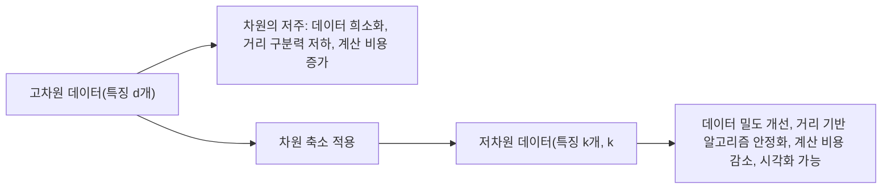

## 차원이란 무엇이고 왜 문제가 되는가

### 정의

**차원**(dimension)은 데이터 한 건을 표현하는 데 쓰이는 특징의 개수다. 특징이 $d$개면 데이터는 $d$차원 공간의 한 점으로 표현되고, 이 $d$를 흔히 **차원 수**라 부른다. 03편에서 다룬 벡터의 길이(원소 개수)가 바로 이 $d$에 해당한다.

## 첫 번째 문제: 데이터의 희소성

### 계산 예제: 한 변의 길이가 1인 정육면체의 "가장자리 껍질"

한 변의 길이가 1인 $d$차원 정육면체(하이퍼큐브, hypercube)를 생각해 보자. 이 정육면체의 각 변에서 가장자리로부터 폭 $\varepsilon = 0.1$(엡실론, 여기서는 가장자리 껍질의 두께)만큼을 "가장자리 껍질"로 보고, 그 껍질을 제외한 **중심부의 부피 비율**을 계산해 보자.

$$
V_{\text{중심부}}(d) = (1 - 2\varepsilon)^d = 0.8^d
$$

- $V_{\text{중심부}}(d)$: $d$차원 정육면체에서 가장자리 껍질을 제외한 중심부의 부피 비율(전체 부피를 1로 뒀을 때)
- $0.8^d$: $0.8$을 $d$번 곱한 값

이 값을 차원 $d$별로 직접 계산하면 다음과 같다.

$$
V_{\text{중심부}}(1) = 0.8^1 = 0.8
$$

$$
V_{\text{중심부}}(5) = 0.8^5 \approx 0.328
$$

$$
V_{\text{중심부}}(10) = 0.8^{10} \approx 0.107
$$

$$
V_{\text{중심부}}(50) = 0.8^{50} \approx 0.0000014
$$

| 차원 $d$ | 중심부 부피 비율 | 가장자리 껍질 비율 |
|---|---|---|
| 1 | 0.8 | 0.2 |
| 5 | 약 0.328 | 약 0.672 |
| 10 | 약 0.107 | 약 0.893 |
| 50 | 약 0.0000014 | 약 0.9999986 |

### 결과 해석

차원이 1일 때는 전체 부피의 80퍼센트가 중심부에 남아 있지만, 차원이 50만 되어도 중심부에 남는 부피는 전체의 **0.0001퍼센트도 되지 않는다.** 다시 말해 차원이 조금만 커져도 정육면체의 부피는 거의 전부가 "가장자리 껍질"에 몰리고, 중심부는 사실상 텅 비게 된다. 그래서 저차원에서는 데이터 100개로도 충분했던 분석이, 차원이 늘어나면 같은 밀도를 유지하기 위해 **기하급수적으로 더 많은 데이터**가 필요해진다.

### 자주 틀리는 점

"데이터를 더 많이 모으면 차원의 저주를 항상 해결할 수 있다"는 생각은 절반만 맞다. 차원이 늘어날 때 필요한 데이터 양은 차원 수에 대해 **지수적으로**(exponentially) 증가하므로, 현실적으로 감당 가능한 수준을 빠르게 넘어선다.

## 두 번째 문제: 거리 개념의 붕괴

### 계산 예제: 무작위 두 점 사이의 기댓값 거리

$0$과 $1$ 사이에서 균등하게(uniform) 무작위로 뽑은 좌표를 갖는 두 점을 $d$차원 공간에서 비교해 보자. 각 축에서 두 점의 좌표 차이의 제곱의 기댓값(평균적으로 기대되는 값)은 $1/6$이라는 것이 균등분포의 성질로 알려져 있다.

$$
E[d^2_{\text{거리}}] = d \times \frac{1}{6}
$$

- $E[\cdot]$: 기댓값(평균적으로 기대되는 값)을 나타내는 기호
- $d$: 차원 수
- $1/6$: 각 축 하나에서 균등분포를 따르는 두 좌표 차이의 제곱의 기댓값

이 공식으로 차원별 거리의 기댓값(제곱근을 취한 값)을 계산해 보자.

$$
d=2: \quad \sqrt{2 \times \tfrac{1}{6}} = \sqrt{0.333} \approx 0.577
$$

$$
d=10: \quad \sqrt{10 \times \tfrac{1}{6}} = \sqrt{1.667} \approx 1.291
$$

$$
d=100: \quad \sqrt{100 \times \tfrac{1}{6}} = \sqrt{16.667} \approx 4.082
$$

### 결과 해석

차원이 커질수록 두 점 사이의 평균 거리(기댓값)는 계속 커진다는 것을 알 수 있다. 그런데 문제는 거리의 **절대적인 크기**가 아니라 거리들 사이의 **상대적인 차이**다.

### 자주 틀리는 점

"차원이 커지면 거리가 커지기만 할 뿐 문제는 없다"는 설명은 핵심을 놓친 것이다. 문제의 본질은 거리의 절댓값이 커지는 것 자체가 아니라, **거리들 사이의 상대적인 구분력이 사라진다**는 데 있다.

## 차원 축소가 필요한 이유

### 정의

**차원 축소**(dimensionality reduction)는 원래의 특징 개수 $d$를 더 적은 개수 $k$($k < d$)로 줄이면서도, 데이터가 갖고 있던 중요한 정보(패턴·분산·구조)는 최대한 보존하려는 기법이다. 대표적으로 16편에서 다룰 **PCA**(주성분분석, 분산을 최대한 보존하는 새로운 축을 찾는 방법)와 **LDA**(선형판별분석, 클래스 간 분리를 최대화하는 축을 찾는 방법)가 있다.

### 차원 축소의 효과

```mermaid
flowchart LR
    A["고차원 데이터(특징 d개)"] --> B["차원의 저주: 데이터 희소화, 거리 구분력 저하, 계산 비용 증가"]
    A --> C["차원 축소 적용"]
    C --> D["저차원 데이터(특징 k개, k<d)"]
    D --> E["데이터 밀도 개선, 거리 기반 알고리즘 안정화, 계산 비용 감소, 시각화 가능"]
```

- **계산 비용 감소**: 특징이 줄어들면 모델 학습·예측에 필요한 연산량도 함께 줄어든다.
- **과적합 위험 완화**: 18편에서 다룰 과적합은 특징 수에 비해 데이터가 상대적으로 부족할 때 심해지기 쉬운데, 차원을 줄이면 이 비율이 개선된다.
- **시각화**: 사람은 2~3차원까지만 눈으로 볼 수 있으므로, 고차원 데이터를 2~3차원으로 축소하면 산점도 등으로 데이터 구조를 직접 관찰할 수 있다.
- **잡음(noise) 제거**: 예측에 별로 기여하지 않는 특징을 줄이면, 그 특징이 갖고 있던 잡음의 영향도 함께 줄어드는 효과가 있다.

### 정보 손실과 해석성의 트레이드오프

차원 축소는 공짜가 아니다. 원래 특징 $d$개를 $k$개로 줄이는 과정에서, 그 특징들이 갖고 있던 정보의 일부는 반드시 손실된다.

### 자주 틀리는 점

"차원 축소는 특징을 그냥 몇 개 골라서 버리는 것이다"는 정확한 설명이 아니다. 특징을 그대로 몇 개만 고르는 방법(특징 선택, feature selection)과, 여러 특징을 수학적으로 조합해 새로운 축을 만드는 방법(특징 추출, feature extraction, PCA가 대표적)은 서로 다른 접근이다.

## 핵심 정리

- 차원의 저주는 특징(차원) 수가 늘어날수록 데이터가 공간에 희소하게 흩어지고, 거리 기반 구분력이 약해지는 현상을 통칭한다.
- 한 변의 길이가 1인 정육면체에서 가장자리 폭 0.1을 제외한 중심부 부피는 $0.8^d$로 계산되며, 차원이 커질수록 이 값은 급격히 0에 가까워져 중심부가 사실상 텅 비게 된다.
- 균등분포를 따르는 두 점 사이 거리의 기댓값은 차원에 비례해 커지지만($d/6$의 제곱근), 거리들 사이의 상대적인 차이는 오히려 줄어들어 최근접·최원접 이웃 구분이 흐려진다.
- 차원 축소는 계산 비용 감소·과적합 완화·시각화·잡음 제거 등의 장점이 있지만, 정보 손실과 해석성 저하라는 트레이드오프를 동반한다.

## 마무리 복습

<Quiz
  questionNumber={1}
  question={"한 변의 길이가 1인 d차원 정육면체에서 가장자리 폭 0.1을 제외한 중심부의 부피 비율을 나타내는 식으로 옳은 것은?"}
  options={["0.1^d","0.8^d","0.9^d","1 - 0.1d"]}
  correctAnswer={2}
  explanation={"각 축에서 양쪽 가장자리로 0.1씩 잘라내면 중심부의 한 변의 길이는 1 - 2×0.1 = 0.8이 되고, d차원 부피는 이 길이를 d번 곱한 0.8^d다."}
/>

<Quiz
  questionNumber={2}
  question={"위 공식을 이용해 d=10일 때 중심부 부피 비율(0.8^10)을 계산한 값에 가장 가까운 것은?"}
  options={["약 0.80","약 0.33","약 0.11","약 0.01"]}
  correctAnswer={3}
  explanation={"0.8을 10번 곱하면 0.8^10 ≈ 0.107로, 보기 중 약 0.11에 가장 가깝다."}
/>

<Quiz
  questionNumber={3}
  question={"차원의 저주가 나타내는 현상에 대한 설명으로 가장 적절한 것은?"}
  options={["차원이 늘어날수록 데이터가 공간을 더 촘촘하게 채워 분석이 쉬워진다","차원이 늘어날수록 같은 밀도를 유지하기 위해 필요한 데이터 양이 지수적으로 증가한다","차원이 늘어나도 필요한 데이터 양은 항상 일정하게 유지된다","차원이 늘어나면 거리 기반 알고리즘의 성능이 항상 더 좋아진다"]}
  correctAnswer={2}
  explanation={"차원이 늘어나면 공간의 부피가 훨씬 빠르게 커지는 반면 데이터 개수는 그대로이므로, 같은 밀도를 유지하려면 필요한 데이터 양이 차원 수에 대해 지수적으로 늘어난다."}
/>

## 참고 자료

- [Dimensionality Reduction 강의 노트 (PCA, LDA)](https://web.pdx.edu/~arhodes/ml6.pdf)
- [scikit-learn User Guide — Supervised learning, Clustering, Dimensionality reduction](https://scikit-learn.org/stable/user_guide.html)
