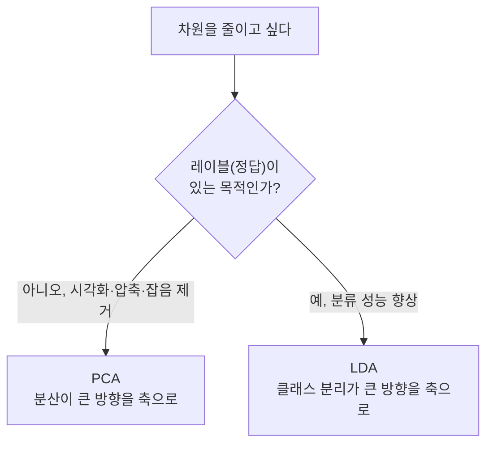

<Callout type="info">
  **이번 문서의 목표:** PCA가 "분산을 최대로 보존하는 새 축"을 어떻게 찾는지, LDA가 "클래스를 가장 잘 나누는 축"을 어떻게 찾는지 수식과 예시로 설명하고, 두 기법을 언제 각각 선택해야 하는지 비교할 수 있다.
</Callout>

## PCA는 왜 필요한가

16편에서 다룬 차원 저주(curse of dimensionality)를 다시 떠올려 보자. 특징(feature, 데이터를 설명하는 변수) 수가 늘어날수록 데이터 사이의 거리는 비슷비슷해지고, 필요한 데이터 양은 기하급수적으로 늘어난다. 그런데 특징을 그냥 몇 개 버리면 정보를 잃는다. 그래서 나온 아이디어가 "원래 특징을 몇 개 지우는 대신, 정보를 최대한 유지하면서 **더 적은 수의 새로운 축**으로 데이터를 다시 표현하자"는 것이다. 이 아이디어를 구체적인 계산 절차로 만든 것이 **주성분 분석**(PCA, Principal Component Analysis)이다.

> **쉽게 말하면:** PCA는 데이터가 가장 넓게 퍼져 있는 방향을 찾아, 그 방향을 새로운 좌표축으로 삼아 데이터를 압축하는 방법이다.

### 정의: 분산과 주성분

PCA를 이해하려면 먼저 **분산**(variance)이 무엇을 뜻하는지 짚어야 한다. 분산은 데이터가 평균으로부터 얼마나 퍼져 있는지를 나타내는 값이다. 분산이 크다는 것은 그 방향으로 데이터를 관찰했을 때 값이 서로 많이 다르다는 뜻이고, 이는 곧 "그 방향이 데이터를 구분하는 정보를 많이 담고 있다"는 뜻이다. 반대로 어떤 방향에서 모든 데이터가 거의 같은 값을 가진다면(분산이 0에 가깝다면), 그 방향은 데이터를 구분하는 데 거의 쓸모가 없다.

PCA는 이 논리를 그대로 이용한다. 원래 특징들의 조합으로 만들 수 있는 무수히 많은 방향(축) 중에서, **분산이 가장 큰 방향**을 첫 번째 축으로 잡는다. 이 축을 **제1주성분**(PC1, first principal component)이라 부른다. 그다음 첫 번째 축과 **직교**(orthogonal, 서로 수직이라 겹치는 정보가 없음)하면서 남은 분산이 가장 큰 방향을 제2주성분(PC2)으로 잡는다. 이 과정을 원하는 개수만큼 반복한다.

> **쉽게 말하면:** 주성분은 "데이터가 가장 많이 흩어져 보이는 순서대로 고른 새 좌표축"이다.

여기서 **직교**를 강조하는 이유가 있다. 두 축이 직교하면 한 축이 설명하는 정보와 다른 축이 설명하는 정보가 서로 겹치지 않는다(상관관계가 0이 된다). 만약 축들이 직교하지 않으면 같은 정보를 여러 축이 중복해서 담게 되어, "더 적은 축으로 압축한다"는 PCA의 목적 자체가 무너진다.

## PCA의 계산 절차

PCA는 다음 절차로 진행된다. 각 단계가 왜 필요한지 함께 짚는다.

<Steps>

### 1단계: 데이터 표준화

특징마다 단위와 스케일이 다르면(예: 키는 cm 단위로 100 단위, 몸무게는 kg 단위로 두 자리) 스케일이 큰 특징이 분산도 커 보여서 부당하게 주성분을 지배한다. 그래서 먼저 각 특징을 평균 0, 표준편차 1로 **표준화**(standardization)한다. 표준화의 계산 방법은 06편에서 다룬 스케일링과 같다.

### 2단계: 공분산 행렬 계산

**공분산**(covariance)은 두 특징이 함께 변하는 정도를 나타내는 값이다. 표준화된 데이터에서 모든 특징 쌍의 공분산을 표로 정리한 것이 **공분산 행렬**(covariance matrix, 03편에서 다룬 행렬 개념을 그대로 사용)이다. 특징이 $p$개면 공분산 행렬은 $p \times p$ 크기의 정사각행렬이 된다.

### 3단계: 고유값·고유벡터 계산

공분산 행렬에서 **고유벡터**(eigenvector)와 **고유값**(eigenvalue)을 구한다. 고유벡터는 "이 행렬이 나타내는 변환을 적용해도 방향이 바뀌지 않는 방향"이고, 고유값은 "그 방향으로 데이터가 얼마나 퍼져 있는지(분산의 크기)"를 뜻한다. 공분산 행렬의 고유벡터가 바로 주성분의 방향이고, 대응하는 고유값이 그 주성분이 설명하는 분산의 크기다.

### 4단계: 주성분 선택과 투영

고유값이 큰 순서대로 고유벡터를 정렬한 뒤, 원하는 개수(예: 상위 2개)만 골라 새 축으로 삼는다. 원래 데이터를 이 새 축에 **투영**(projection, 그림자를 드리우듯 낮은 차원으로 옮기는 것)하면 차원이 축소된 데이터가 나온다.

</Steps>

## 작은 예시로 감을 잡기

특징이 2개(공부 시간 $x_1$, 게임 시간 $x_2$)인 학생 5명의 표준화된 데이터가 있다고 하자.

| 학생 | $x_1$(공부, 표준화) | $x_2$(게임, 표준화) |
|---|---|---|
| A | 1.2 | -1.1 |
| B | 0.9 | -0.8 |
| C | 0.0 | 0.1 |
| D | -0.8 | 0.9 |
| E | -1.3 | 0.9 |

이 데이터를 산점도로 그리면 점들이 "공부 시간이 많으면 게임 시간이 적다"는 대각선 방향으로 길게 늘어선 모양이 된다. 이 경우 PCA가 찾는 제1주성분은 대략 이 대각선 방향(오른쪽 아래에서 왼쪽 위로, 즉 $x_1$이 커질수록 $x_2$가 작아지는 방향)이 된다. 제1주성분 하나만으로도 데이터가 퍼진 모양의 대부분을 설명할 수 있는데, 이는 두 특징이 강하게 반비례하는 상관관계를 가져서 사실상 "정보가 하나의 축에 몰려 있기" 때문이다. 이럴 때 두 번째 주성분(대각선과 직교하는 방향)이 설명하는 분산은 아주 작다.

### 설명된 분산 비율

실제로 몇 개의 주성분을 쓸지 정할 때는 **설명된 분산 비율**(explained variance ratio)을 본다. 고유값을 $\lambda_1, \lambda_2, \ldots, \lambda_p$라 하면, $k$번째 주성분이 설명하는 분산 비율은 다음과 같다.

$$
\text{설명된 분산 비율}_k = \frac{\lambda_k}{\lambda_1 + \lambda_2 + \cdots + \lambda_p}
$$

- $\lambda_k$ (람다 k): $k$번째 주성분의 고유값(그 축이 설명하는 분산의 크기)
- 분모: 모든 고유값의 합(전체 분산)

예를 들어 위 데이터에서 고유값이 $\lambda_1 = 1.8$, $\lambda_2 = 0.2$로 계산되었다고 하자.

$$
\text{PC1 설명 비율} = \frac{1.8}{1.8 + 0.2} = \frac{1.8}{2.0} = 0.9
$$

PC1 하나만으로 전체 분산의 90퍼센트를 설명한다는 뜻이므로, PC2를 버리고 PC1 하나만 남겨도 정보 손실이 크지 않다고 판단할 수 있다. 실무에서는 흔히 누적 설명 분산 비율이 80~95퍼센트가 되는 지점까지 주성분 개수를 선택한다.

### 자주 틀리는 점: 주성분은 원래 특징이 아니다

PCA를 처음 배울 때 가장 많이 하는 오해는 "주성분이 원래 특징 중 하나를 골라낸 것"이라고 생각하는 것이다. 그렇지 않다. 주성분은 원래 특징들의 **선형 결합**(03편에서 다룬 개념: 각 특징에 가중치를 곱해 더한 것)으로 만들어진 **새로운 축**이다. 위 예시에서 제1주성분은 "공부 시간"도 "게임 시간"도 아니고, 두 값을 적절한 비율로 섞은 새로운 변수다. 그래서 PCA로 축소된 축은 원래 특징처럼 직접적인 의미(단위)를 가지지 않아 해석이 어려워진다는 것이 PCA의 대표적인 단점이다.

## LDA는 왜 필요한가

PCA는 **레이블(정답, label)을 전혀 보지 않고** 오직 데이터가 퍼진 모양(분산)만으로 축을 정한다. 그런데 분류가 목적이라면, "데이터가 넓게 퍼진 방향"보다 "클래스(정답 범주)를 잘 구분하는 방향"이 더 유용할 수 있다. 예를 들어 두 클래스가 원래 좁게 뭉쳐 있어도 서로 겹치지 않는다면, 분류 입장에서는 그 방향이 훨씬 중요하다. 이런 상황을 위해 레이블 정보를 활용하는 차원 축소 기법이 **선형판별분석**(LDA, Linear Discriminant Analysis)이다.

> **쉽게 말하면:** LDA는 "클래스끼리는 최대한 멀리 떨어뜨리고, 같은 클래스끼리는 최대한 뭉치게 하는" 방향을 찾는 방법이다.

### 정의: 클래스 간 분산과 클래스 내 분산

LDA는 두 종류의 흩어짐 정도를 동시에 고려한다.

- **클래스 간 분산**(between-class variance): 서로 다른 클래스의 평균들이 얼마나 멀리 떨어져 있는지
- **클래스 내 분산**(within-class variance): 같은 클래스에 속한 데이터끼리 얼마나 퍼져 있는지(뭉쳐 있는 정도)

LDA는 이 둘의 비율을 최대화하는 방향을 찾는다. 개념을 단순화하면 다음과 같은 목적함수로 나타낼 수 있다.

$$
J(w) = \frac{\text{클래스 간 분산}}{\text{클래스 내 분산}}
$$

- $J(w)$ (제이, w에 대한 목적함수): 축 방향 $w$를 택했을 때의 "분리 정도" 점수
- $w$ (더블유): 데이터를 투영할 축의 방향 벡터

이 비율이 클수록 "클래스들은 서로 멀리 떨어져 있고, 각 클래스 내부는 촘촘히 뭉쳐 있다"는 뜻이므로 분류하기에 이상적인 축이다. LDA는 이 $J(w)$를 최대로 만드는 $w$를 찾는 최적화 문제를 풀어 축을 결정한다.

### 작은 예시로 감을 잡기

두 클래스(합격·불합격)를 시험 점수 하나($x_1$)로 구분하는 극단적인 1차원 예시를 보자.

| 학생 | 점수($x_1$) | 클래스 |
|---|---|---|
| A | 85 | 합격 |
| B | 90 | 합격 |
| C | 88 | 합격 |
| D | 40 | 불합격 |
| E | 45 | 불합격 |
| F | 42 | 불합격 |

합격 그룹의 평균은 $(85+90+88)/3 \approx 87.7$, 불합격 그룹의 평균은 $(40+45+42)/3 \approx 42.3$이다. 두 평균의 차이(클래스 간 분산에 해당하는 요소)는 약 45.4로 매우 크고, 각 그룹 내부의 점수는 몇 점 차이로 촘촘하다(클래스 내 분산이 작다). 이 경우 점수 축 하나만으로도 $J(w)$ 값이 매우 커서, 점수 축 자체가 이미 훌륭한 판별 축이 된다. 실제 데이터는 특징이 여러 개이므로 LDA는 이런 논리를 다차원으로 확장해 "가장 잘 나누는 새로운 합성 축"을 계산한다.

### 자주 틀리는 점: LDA는 지도학습이다

PCA와 LDA를 비교하는 문제에서 가장 자주 나오는 함정은 "둘 다 레이블 없이 동작한다"고 서술하는 보기다. **PCA는 레이블을 쓰지 않는 비지도(unsupervised) 기법**이지만, **LDA는 클래스 레이블을 반드시 알아야 계산할 수 있는 지도(supervised) 기법**이다. LDA가 축소할 수 있는 축의 최대 개수도 "클래스 수 − 1"로 제한된다는 점(예: 클래스가 3개면 LDA 축은 최대 2개)도 PCA와 다른 대표적인 차이다. PCA는 이런 제한이 없어 원하는 만큼(원래 특징 수 이하로) 축을 선택할 수 있다.

## PCA와 LDA 비교

| 구분 | PCA | LDA |
|---|---|---|
| 학습 유형 | 비지도(레이블 불필요) | 지도(레이블 필수) |
| 목표 | 분산 최대화(정보 보존) | 클래스 간 분리 최대화 |
| 축의 최대 개수 | 원래 특징 수까지 자유롭게 | 클래스 수 − 1개까지 |
| 대표 용도 | 시각화, 잡음 제거, 압축, 전처리 | 분류 전처리, 클래스 구분이 중요한 축소 |
| 축의 해석 | 원래 특징의 선형결합(직접 해석 어려움) | 원래 특징의 선형결합(직접 해석 어려움) |
| 대표 한계 | 레이블을 무시하므로 분류에 최선이 아닐 수 있음 | 클래스별 데이터가 정규분포와 비슷하다고 가정, 클래스 수 제약 |

실무에서는 두 기법을 배타적으로 고르기보다, 먼저 PCA로 잡음을 줄인 뒤 그 결과에 LDA를 적용해 분류 성능을 높이는 식으로 함께 쓰기도 한다. 시험에서는 "PCA는 레이블을 쓴다", "LDA는 비지도 기법이다"처럼 두 기법의 지도·비지도 성격을 뒤바꿔 놓은 오답 보기가 자주 나오므로 이 표의 첫 줄을 정확히 기억해 두어야 한다.

## 핵심 정리

- PCA는 레이블 없이 **분산이 가장 큰 직교 방향**을 순서대로 찾는 비지도 차원 축소 기법이며, 절차는 표준화 → 공분산 행렬 → 고유값·고유벡터 계산 → 상위 주성분 선택·투영이다.
- 설명된 분산 비율 $\lambda_k / \sum \lambda_i$로 주성분 몇 개를 남길지 판단한다.
- LDA는 클래스 레이블을 이용해 **클래스 간 분산 대 클래스 내 분산의 비율** $J(w)$를 최대화하는 축을 찾는 지도 차원 축소 기법이다.
- LDA가 만들 수 있는 축은 최대 "클래스 수 − 1"개로 제한되지만, PCA는 이런 제약이 없다.
- 두 기법 모두 새 축은 원래 특징의 선형결합이라 직접적인 해석은 어렵다는 공통 한계가 있다.

## 마무리 복습

<Quiz
  questionNumber={1}
  question="PCA에서 제1주성분(PC1)을 정의하는 기준으로 가장 옳은 것은?"
  options={['원본 데이터에서 값이 가장 큰 특징 하나를 그대로 선택한 축이다', '데이터의 분산이 가장 크게 나타나는 방향으로 잡은 새로운 축이다', '클래스 간 평균 차이가 가장 큰 방향으로 잡은 축이다', '결측치가 가장 적은 특징을 기준으로 잡은 축이다']}
  correctAnswer={2}
  explanation="PCA의 제1주성분은 데이터가 가장 넓게 퍼져 있는(분산이 가장 큰) 방향으로 정의되는 새로운 합성 축이다. 원래 특징을 그대로 고르는 것이 아니라 선형결합으로 새 축을 만든다."
  optionExplanations={['원본 특징을 그대로 고르는 것은 특징 선택이지 PCA가 아니다', '정답: 분산이 최대인 방향이 PC1의 정의다', '클래스 간 평균 차이를 극대화하는 것은 LDA의 기준이다', 'PCA는 결측치 개수가 아니라 분산 구조로 축을 정한다']}
/>

<Quiz
  questionNumber={2}
  question="공분산 행렬의 고유값(eigenvalue)이 PCA에서 의미하는 바로 가장 옳은 것은?"
  options={['해당 고유벡터 방향으로 데이터가 퍼져 있는 분산의 크기', '해당 방향에 속한 데이터 표본의 개수', '클래스 레이블과 특징 사이의 상관계수', '표준화 이전 원본 데이터의 평균값']}
  correctAnswer={1}
  explanation="공분산 행렬의 고유벡터는 주성분의 방향을, 고유값은 그 방향이 설명하는 분산의 크기를 나타낸다. 고유값이 클수록 그 축이 정보를 많이 담고 있다는 뜻이다."
  optionExplanations={['정답: 고유값은 해당 고유벡터 방향의 분산 크기를 나타낸다', '고유값은 표본 개수와 무관한 분산 관련 수치다', 'PCA는 레이블을 사용하지 않으므로 상관계수 개념이 아니다', '평균값은 표준화 단계에서 이미 0으로 맞춰진 별개의 값이다']}
/>

<Quiz
  questionNumber={3}
  question="어느 데이터에서 고유값이 λ1=6, λ2=3, λ3=1로 계산되었다. PC1과 PC2 두 개만 사용할 때 설명되는 누적 분산 비율은 얼마인가?"
  options={['30퍼센트', '60퍼센트', '90퍼센트', '100퍼센트']}
  correctAnswer={3}
  explanation="설명된 분산 비율은 (λ1+λ2)/(λ1+λ2+λ3)로 계산한다. (6+3)/(6+3+1) = 9/10 = 0.9, 즉 90퍼센트다."
  optionExplanations={['분모를 잘못 나누거나 λ1만 반영한 계산으로 보인다', 'λ1 하나만 반영한 비율(6/10=60퍼센트)과 혼동한 값이다', '정답: (6+3)/10 = 0.9, 즉 90퍼센트다', '고유값 3개를 모두 합쳐도 분모는 그대로 10이므로 100퍼센트가 될 수 없다']}
/>

<Quiz
  questionNumber={4}
  question="LDA(선형판별분석)에 대한 설명으로 옳지 않은 것은?"
  options={['클래스 레이블 정보를 이용해 축을 계산하는 지도학습 기법이다', '클래스 간 분산 대 클래스 내 분산의 비율을 최대화하는 방향을 찾는다', '레이블 없이도 동작하는 비지도 차원 축소 기법이라는 점이 PCA와의 핵심 차이다', '만들 수 있는 축의 최대 개수는 클래스 수에서 1을 뺀 값으로 제한된다']}
  correctAnswer={3}
  explanation="옳지 않은 것을 고르는 문제다. LDA는 클래스 레이블을 반드시 사용하는 지도학습 기법이며, 레이블을 쓰지 않는 것은 PCA다. 3번 보기는 PCA와 LDA의 지도·비지도 성격을 뒤바꾸어 서술했으므로 틀린 설명이다."
  optionExplanations={['옳은 설명이다(오답 후보 아님)', '옳은 설명이다. J(w)를 최대화하는 것이 LDA의 목적이다', '정답: 틀린 설명이다. 레이블 없이 동작하는 것은 PCA이며, LDA는 레이블이 반드시 필요한 지도학습 기법이다', '옳은 설명이다. LDA 축은 클래스 수 − 1개로 제한된다']}
/>

<Quiz
  questionNumber={5}
  question="세 개의 클래스(A, B, C)를 구분하기 위해 LDA를 적용할 때, 만들 수 있는 판별 축의 최대 개수는?"
  options={['1개', '2개', '3개', '제한 없음']}
  correctAnswer={2}
  explanation="LDA가 만들 수 있는 축의 최대 개수는 클래스 수에서 1을 뺀 값이다. 클래스가 3개이므로 3 − 1 = 2개가 최대다."
  optionExplanations={['클래스 수 − 1 계산에서 값을 잘못 뺀 결과다', '정답: 클래스 수(3) − 1 = 2개가 LDA 축의 최대 개수다', '클래스 수 자체를 축의 개수로 착각한 값이다', 'PCA는 제한이 없지만 LDA는 클래스 수 − 1이라는 제약이 있다']}
/>

<Quiz
  questionNumber={6}
  question="PCA와 LDA의 공통점으로 가장 옳은 것은?"
  options={['둘 다 새로운 축을 원래 특징들의 선형결합으로 만든다', '둘 다 반드시 클래스 레이블이 있어야 계산할 수 있다', '둘 다 만들 수 있는 축의 개수가 클래스 수 − 1로 제한된다', '둘 다 결측치를 자동으로 채워주는 기능을 포함한다']}
  correctAnswer={1}
  explanation="PCA와 LDA는 목적(분산 최대화 대 클래스 분리 최대화)과 레이블 사용 여부는 다르지만, 두 방법 모두 원래 특징들을 가중치로 조합한 선형결합으로 새로운 축을 만든다는 공통점이 있다."
  optionExplanations={['정답: 두 기법 모두 원래 특징의 선형결합으로 새 축을 구성한다', 'PCA는 레이블이 필요 없는 비지도 기법이므로 틀린 설명이다', '축 개수 제한(클래스 수 − 1)은 LDA에만 해당하고 PCA에는 없다', '결측치 처리는 PCA·LDA의 기능이 아니라 06편의 전처리 단계에서 다룬다']}
/>

## 참고 자료

- [Dimensionality Reduction 강의 노트 (PCA, LDA)](https://web.pdx.edu/~arhodes/ml6.pdf)
- [scikit-learn User Guide — Decomposition (PCA) and Discriminant Analysis](https://scikit-learn.org/stable/user_guide.html)
