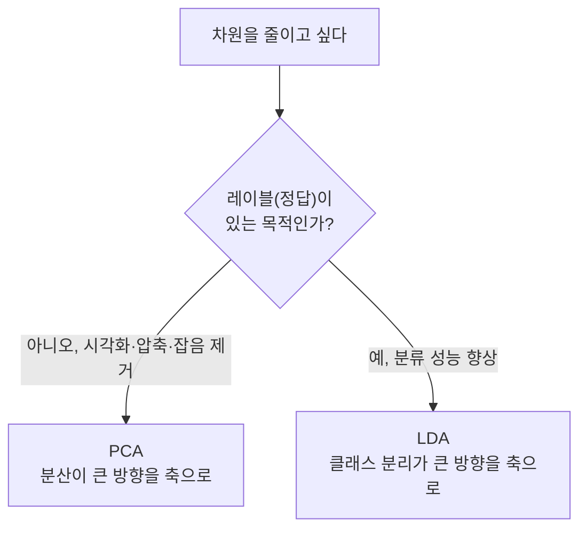

## PCA는 왜 필요한가

15편에서 다룬 차원 저주(curse of dimensionality)를 다시 떠올려 보자. 그래서 나온 아이디어가 "원래 특징을 몇 개 지우는 대신, 정보를 최대한 유지하면서 **더 적은 수의 새로운 축**으로 데이터를 다시 표현하자"는 것이다.

### 정의: 분산과 주성분

PCA를 이해하려면 먼저 **분산**(variance)이 무엇을 뜻하는지 짚어야 한다. 반대로 어떤 방향에서 모든 데이터가 거의 같은 값을 가진다면(분산이 0에 가깝다면), 그 방향은 데이터를 구분하는 데 거의 쓸모가 없다.

PCA는 이 논리를 그대로 이용한다. 원래 특징들의 조합으로 만들 수 있는 무수히 많은 방향(축) 중에서, **분산이 가장 큰 방향**을 첫 번째 축으로 잡는다.

여기서 **직교**를 강조하는 이유가 있다. 두 축이 직교하면 한 축이 설명하는 정보와 다른 축이 설명하는 정보가 서로 겹치지 않는다(상관관계가 0이 된다). 만약 축들이 직교하지 않으면 같은 정보를 여러 축이 중복해서 담게 되어, "더 적은 축으로 압축한다"는 PCA의 목적 자체가 무너진다.

## PCA의 계산 절차

PCA는 다음 절차로 진행된다. 각 단계가 왜 필요한지 함께 짚는다.

## 작은 예시로 감을 잡기

특징이 2개(공부 시간 $x_1$, 게임 시간 $x_2$)인 학생 5명의 표준화된 데이터가 있다고 하자.

| 학생 | $x_1$(공부, 표준화) | $x_2$(게임, 표준화) |
|---|---|---|
| A | 1.2 | -1.1 |
| B | 0.9 | -0.8 |
| C | 0.0 | 0.1 |
| D | -0.8 | 0.9 |
| E | -1.3 | 0.9 |

이 데이터를 산점도로 그리면 점들이 "공부 시간이 많으면 게임 시간이 적다"는 대각선 방향으로 길게 늘어선 모양이 된다. 이 경우 PCA가 찾는 제1주성분은 대략 이 대각선 방향(오른쪽 아래에서 왼쪽 위로, 즉 $x_1$이 커질수록 $x_2$가 작아지는 방향)이 된다.

### 설명된 분산 비율

실제로 몇 개의 주성분을 쓸지 정할 때는 **설명된 분산 비율**(explained variance ratio)을 본다. 고유값을 $\lambda_1, \lambda_2, \ldots, \lambda_p$라 하면, $k$번째 주성분이 설명하는 분산 비율은 다음과 같다.

$$
\text{설명된 분산 비율}_k = \frac{\lambda_k}{\lambda_1 + \lambda_2 + \cdots + \lambda_p}
$$

- $\lambda_k$ (람다 k): $k$번째 주성분의 고유값(그 축이 설명하는 분산의 크기)
- 분모: 모든 고유값의 합(전체 분산)

예를 들어 위 데이터에서 고유값이 $\lambda_1 = 1.8$, $\lambda_2 = 0.2$로 계산되었다고 하자.

$$
\text{PC1 설명 비율} = \frac{1.8}{1.8 + 0.2} = \frac{1.8}{2.0} = 0.9
$$

PC1 하나만으로 전체 분산의 90퍼센트를 설명한다는 뜻이므로, PC2를 버리고 PC1 하나만 남겨도 정보 손실이 크지 않다고 판단할 수 있다. 실무에서는 흔히 누적 설명 분산 비율이 80~95퍼센트가 되는 지점까지 주성분 개수를 선택한다.

### 자주 틀리는 점: 주성분은 원래 특징이 아니다

PCA를 처음 배울 때 가장 많이 하는 오해는 "주성분이 원래 특징 중 하나를 골라낸 것"이라고 생각하는 것이다. 주성분은 원래 특징들의 **선형 결합**(03편에서 다룬 개념: 각 특징에 가중치를 곱해 더한 것)으로 만들어진 **새로운 축**이다.

## LDA는 왜 필요한가

PCA는 **레이블(정답, label)을 전혀 보지 않고** 오직 데이터가 퍼진 모양(분산)만으로 축을 정한다. 그런데 분류가 목적이라면, "데이터가 넓게 퍼진 방향"보다 "클래스(정답 범주)를 잘 구분하는 방향"이 더 유용할 수 있다.

### 정의: 클래스 간 분산과 클래스 내 분산

LDA는 두 종류의 흩어짐 정도를 동시에 고려한다.

- **클래스 간 분산**(between-class variance): 서로 다른 클래스의 평균들이 얼마나 멀리 떨어져 있는지
- **클래스 내 분산**(within-class variance): 같은 클래스에 속한 데이터끼리 얼마나 퍼져 있는지(뭉쳐 있는 정도)

LDA는 이 둘의 비율을 최대화하는 방향을 찾는다. 개념을 단순화하면 다음과 같은 목적함수로 나타낼 수 있다.

$$
J(w) = \frac{\text{클래스 간 분산}}{\text{클래스 내 분산}}
$$

- $J(w)$ (제이, w에 대한 목적함수): 축 방향 $w$를 택했을 때의 "분리 정도" 점수
- $w$ (더블유): 데이터를 투영할 축의 방향 벡터

이 비율이 클수록 "클래스들은 서로 멀리 떨어져 있고, 각 클래스 내부는 촘촘히 뭉쳐 있다"는 뜻이므로 분류하기에 이상적인 축이다. LDA는 이 $J(w)$를 최대로 만드는 $w$를 찾는 최적화 문제를 풀어 축을 결정한다.

### 작은 예시로 감을 잡기

두 클래스(합격·불합격)를 시험 점수 하나($x_1$)로 구분하는 극단적인 1차원 예시를 보자.

| 학생 | 점수($x_1$) | 클래스 |
|---|---|---|
| A | 85 | 합격 |
| B | 90 | 합격 |
| C | 88 | 합격 |
| D | 40 | 불합격 |
| E | 45 | 불합격 |
| F | 42 | 불합격 |

합격 그룹의 평균은 $(85+90+88)/3 \approx 87.7$, 불합격 그룹의 평균은 $(40+45+42)/3 \approx 42.3$이다. 두 평균의 차이(클래스 간 분산에 해당하는 요소)는 약 45.4로 매우 크고, 각 그룹 내부의 점수는 몇 점 차이로 촘촘하다(클래스 내 분산이 작다).

### 자주 틀리는 점: LDA는 지도학습이다

PCA와 LDA를 비교하는 문제에서 가장 자주 나오는 함정은 "둘 다 레이블 없이 동작한다"고 서술하는 보기다. **PCA는 레이블을 쓰지 않는 비지도(unsupervised) 기법**이지만, **LDA는 클래스 레이블을 반드시 알아야 계산할 수 있는 지도(supervised) 기법**이다.

## PCA와 LDA 비교

```mermaid
flowchart TD
    A["차원을 줄이고 싶다"] --> B{"레이블(정답)이<br/>있는 목적인가?"}
    B -->|"아니오, 시각화·압축·잡음 제거"| C["PCA<br/>분산이 큰 방향을 축으로"]
    B -->|"예, 분류 성능 향상"| D["LDA<br/>클래스 분리가 큰 방향을 축으로"]
```

| 구분 | PCA | LDA |
|---|---|---|
| 학습 유형 | 비지도(레이블 불필요) | 지도(레이블 필수) |
| 목표 | 분산 최대화(정보 보존) | 클래스 간 분리 최대화 |
| 축의 최대 개수 | 원래 특징 수까지 자유롭게 | 클래스 수 − 1개까지 |
| 대표 용도 | 시각화, 잡음 제거, 압축, 전처리 | 분류 전처리, 클래스 구분이 중요한 축소 |
| 축의 해석 | 원래 특징의 선형결합(직접 해석 어려움) | 원래 특징의 선형결합(직접 해석 어려움) |
| 대표 한계 | 레이블을 무시하므로 분류에 최선이 아닐 수 있음 | 클래스별 데이터가 정규분포와 비슷하다고 가정, 클래스 수 제약 |

실무에서는 두 기법을 배타적으로 고르기보다, 먼저 PCA로 잡음을 줄인 뒤 그 결과에 LDA를 적용해 분류 성능을 높이는 식으로 함께 쓰기도 한다. 시험에서는 "PCA는 레이블을 쓴다", "LDA는 비지도 기법이다"처럼 두 기법의 지도·비지도 성격을 뒤바꿔 놓은 오답 보기가 자주 나오므로 이 표의 첫 줄을 정확히 기억해 두어야 한다.

## 핵심 정리

- PCA는 레이블 없이 **분산이 가장 큰 직교 방향**을 순서대로 찾는 비지도 차원 축소 기법이며, 절차는 표준화 → 공분산 행렬 → 고유값·고유벡터 계산 → 상위 주성분 선택·투영이다.
- 설명된 분산 비율 $\lambda_k / \sum \lambda_i$로 주성분 몇 개를 남길지 판단한다.
- LDA는 클래스 레이블을 이용해 **클래스 간 분산 대 클래스 내 분산의 비율** $J(w)$를 최대화하는 축을 찾는 지도 차원 축소 기법이다.
- LDA가 만들 수 있는 축은 최대 "클래스 수 − 1"개로 제한되지만, PCA는 이런 제약이 없다.
- 두 기법 모두 새 축은 원래 특징의 선형결합이라 직접적인 해석은 어렵다는 공통 한계가 있다.

## 마무리 복습

<Quiz
  questionNumber={1}
  question={"PCA에서 제1주성분(PC1)을 정의하는 기준으로 가장 옳은 것은?"}
  options={["원본 데이터에서 값이 가장 큰 특징 하나를 그대로 선택한 축이다","데이터의 분산이 가장 크게 나타나는 방향으로 잡은 새로운 축이다","클래스 간 평균 차이가 가장 큰 방향으로 잡은 축이다","결측치가 가장 적은 특징을 기준으로 잡은 축이다"]}
  correctAnswer={2}
  explanation={"PCA의 제1주성분은 데이터가 가장 넓게 퍼져 있는(분산이 가장 큰) 방향으로 정의되는 새로운 합성 축이다. 원래 특징을 그대로 고르는 것이 아니라 선형결합으로 새 축을 만든다."}
/>

<Quiz
  questionNumber={2}
  question={"공분산 행렬의 고유값(eigenvalue)이 PCA에서 의미하는 바로 가장 옳은 것은?"}
  options={["해당 고유벡터 방향으로 데이터가 퍼져 있는 분산의 크기","해당 방향에 속한 데이터 표본의 개수","클래스 레이블과 특징 사이의 상관계수","표준화 이전 원본 데이터의 평균값"]}
  correctAnswer={1}
  explanation={"공분산 행렬의 고유벡터는 주성분의 방향을, 고유값은 그 방향이 설명하는 분산의 크기를 나타낸다. 고유값이 클수록 그 축이 정보를 많이 담고 있다는 뜻이다."}
/>

<Quiz
  questionNumber={3}
  question={"어느 데이터에서 고유값이 λ1=6, λ2=3, λ3=1로 계산되었다. PC1과 PC2 두 개만 사용할 때 설명되는 누적 분산 비율은 얼마인가?"}
  options={["30퍼센트","60퍼센트","90퍼센트","100퍼센트"]}
  correctAnswer={3}
  explanation={"설명된 분산 비율은 (λ1+λ2)/(λ1+λ2+λ3)로 계산한다."}
/>

## 참고 자료

- [Dimensionality Reduction 강의 노트 (PCA, LDA)](https://web.pdx.edu/~arhodes/ml6.pdf)
- [scikit-learn User Guide — Decomposition (PCA) and Discriminant Analysis](https://scikit-learn.org/stable/user_guide.html)
