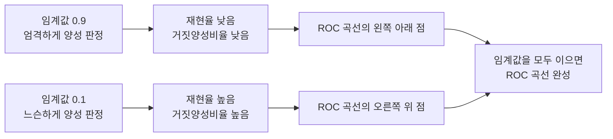

<Callout type="info">
  **이번 문서의 목표:** 혼동행렬 4칸의 의미를 정확히 구분하고, 같은 숫자 하나로 정확도·정밀도·재현율·특이도·F1을 모두 계산·해석하며, 불균형 데이터에서 지표를 어떻게 골라야 하는지, ROC 곡선과 AUC가 무엇을 보여주는지 설명할 수 있다.

</Callout>

## 모델을 만든 뒤에는 무엇을 봐야 하는가

06~13편에서 회귀·분류 모델을 여러 개 배웠다. 그런데 "모델을 만들었다"와 "그 모델이 좋다"는 서로 다른 이야기다. 모델의 성능을 객관적인 숫자로 재는 기준이 없으면, 두 모델 중 어느 쪽이 더 나은지 비교할 수도 없고 어디를 개선해야 할지도 알 수 없다. 이 기준을 만드는 작업이 **모델 평가**(model evaluation)이며, 그 출발점이 **혼동행렬**(confusion matrix)이다.

> **쉽게 말하면:** 혼동행렬은 "모델이 예측한 값"과 "실제 정답"을 교차로 정리해, 어디서 맞고 어디서 틀렸는지 한눈에 보여주는 표다.

### 정의: 혼동행렬의 4칸

이진 분류(결과가 양성·음성 둘 중 하나)를 기준으로, 혼동행렬은 다음 4칸으로 이루어진다.

| 구분 | 예측: 양성(Positive) | 예측: 음성(Negative) |
|---|---|---|
| 실제: 양성(Positive) | TP(True Positive, 참양성) | FN(False Negative, 거짓음성) |
| 실제: 음성(Negative) | FP(False Positive, 거짓양성) | TN(True Negative, 참음성) |

- **TP**: 실제 양성을 모델도 양성으로 맞게 예측
- **FN**: 실제 양성을 모델이 음성으로 잘못 예측(양성을 놓침)
- **FP**: 실제 음성을 모델이 양성으로 잘못 예측(잘못된 경보)
- **TN**: 실제 음성을 모델도 음성으로 맞게 예측

이름 규칙이 중요하다. 앞의 True/False는 "예측이 맞았는가"를, 뒤의 Positive/Negative는 "**모델이 무엇으로 예측했는가**"를 나타낸다. 즉 FN은 "모델이 틀렸고, (모델이) 음성으로 예측했다"는 뜻이며, 이름이 실제값이 아니라 **예측값 기준**으로 붙는다는 점을 헷갈리지 말아야 한다. "옳지 않은 것 고르기" 유형에서 이 이름 규칙을 거꾸로 뒤집어 놓는 함정이 자주 나온다.

> **쉽게 말하면:** 혼동행렬은 "실제로 맞았는가"(행)와 "무엇으로 예측했는가"(열)를 겹쳐놓은 2행 2열 채점표다.

## 예시: 200명의 스팸 메일 분류 결과

어느 스팸 필터를 200통의 메일에 적용해 다음 혼동행렬을 얻었다고 하자(스팸을 양성으로 정의).

| 구분 | 예측: 스팸(양성) | 예측: 정상(음성) | 합계 |
|---|---|---|---|
| 실제: 스팸(양성) | TP = 80 | FN = 20 | 100 |
| 실제: 정상(음성) | FP = 30 | TN = 70 | 100 |
| 합계 | 110 | 90 | 200 |

이 표의 숫자(TP=80, FN=20, FP=30, TN=70) 하나만으로 아래의 모든 지표를 계산한다. 실제 시험에서도 하나의 혼동행렬을 주고 여러 지표를 연쇄로 묻는 유형이 자주 나오므로, 이 표를 기준으로 끝까지 검산해 보자.

### 정확도

**정확도**(accuracy)는 전체 중 맞게 예측한 비율이다.

$$
\text{Accuracy} = \frac{TP + TN}{TP + FN + FP + TN}
$$

$$
\text{Accuracy} = \frac{80 + 70}{80 + 20 + 30 + 70} = \frac{150}{200} = 0.75
$$

200통 중 150통(75퍼센트)을 올바르게 판정했다는 뜻이다.

### 정밀도

**정밀도**(precision)는 모델이 **양성으로 예측한 것 중** 실제로 양성인 비율이다.

$$
\text{Precision} = \frac{TP}{TP + FP}
$$

$$
\text{Precision} = \frac{80}{80 + 30} = \frac{80}{110} \approx 0.727
$$

모델이 스팸이라고 판정한 110통 중 약 72.7퍼센트(80통)가 실제로도 스팸이었다는 뜻이다. 나머지 27.3퍼센트(30통)는 정상 메일을 스팸으로 잘못 분류한 FP다.

### 재현율

**재현율**(recall, 민감도sensitivity)은 **실제로 양성인 것 중** 모델이 양성으로 맞게 예측한 비율이다.

$$
\text{Recall} = \frac{TP}{TP + FN}
$$

$$
\text{Recall} = \frac{80}{80 + 20} = \frac{80}{100} = 0.8
$$

실제 스팸 100통 중 80퍼센트(80통)를 모델이 놓치지 않고 걸러냈다는 뜻이다. 나머지 20퍼센트(20통)는 스팸인데 정상으로 분류된 FN, 즉 받은편지함에 그대로 들어간 스팸이다.

### 정밀도와 재현율의 차이

두 지표 모두 분자가 TP지만 **분모**가 다르다.

| 지표 | 분모의 기준 | 질문 형태 |
|---|---|---|
| 정밀도 | 모델이 양성이라고 **예측한** 것(TP+FP) | 예측한 것 중 실제로 맞은 비율은? |
| 재현율 | 실제로 양성인 것(TP+FN) | 실제인 것 중 놓치지 않고 맞춘 비율은? |

스팸 필터에서 정밀도가 낮으면 정상 메일을 스팸으로 자주 오분류한다는 뜻이고(FP가 큼), 재현율이 낮으면 진짜 스팸을 자주 놓친다는 뜻이다(FN이 큼). 어느 쪽이 더 중요한지는 상황에 따라 다르다. 의료 진단처럼 양성(질병)을 놓치면 안 되는 상황은 재현율이 중요하고, 스팸 필터처럼 정상 메일을 오분류하면 곤란한 상황은 정밀도가 중요하다. "재현율이 정밀도보다 항상 중요하다"처럼 단정하는 보기는 틀린 설명이다.

### 특이도

**특이도**(specificity)는 **실제로 음성인 것 중** 모델이 음성으로 맞게 예측한 비율이다. 재현율이 양성 기준의 적중률이라면, 특이도는 음성 기준의 적중률이다.

$$
\text{Specificity} = \frac{TN}{TN + FP}
$$

$$
\text{Specificity} = \frac{70}{70 + 30} = \frac{70}{100} = 0.7
$$

실제 정상 메일 100통 중 70퍼센트(70통)를 모델이 정상으로 올바르게 남겨두었다는 뜻이다.

### F1 점수

정밀도와 재현율은 한쪽을 높이면 다른 쪽이 낮아지는 트레이드오프 관계에 있는 경우가 많다(예: 모든 메일을 스팸으로 판정하면 재현율은 1이 되지만 정밀도는 낮아진다). 두 지표를 동시에 반영하는 지표가 **F1 점수**이며, 정밀도와 재현율의 **조화평균**(harmonic mean, 산술평균과 달리 작은 값 쪽에 더 큰 비중을 두는 평균)으로 계산한다.

$$
F1 = 2 \times \frac{\text{Precision} \times \text{Recall}}{\text{Precision} + \text{Recall}}
$$

$$
F1 = 2 \times \frac{0.727 \times 0.8}{0.727 + 0.8} = 2 \times \frac{0.582}{1.527} \approx 0.762
$$

F1 점수가 산술평균이 아니라 조화평균인 이유가 있다. 예컨대 정밀도 1.0, 재현율 0.01처럼 한쪽이 극단적으로 낮으면 산술평균은 약 0.5로 높게 나와 착시를 일으키지만, 조화평균은 낮은 값에 끌려가 0.02에 가까운 값이 나온다. 즉 F1은 **두 지표 중 하나라도 나쁘면 전체 점수도 나빠지도록** 설계되어 있어, 한쪽만 좋은 모델을 우수하다고 착각하지 않게 해준다.

## 불균형 데이터에서 지표를 고르는 법

**데이터 불균형**(class imbalance)은 한 클래스의 표본 수가 다른 클래스보다 훨씬 많은 상황을 말한다. 예를 들어 사기 거래 탐지 데이터에서 정상 거래가 99.9퍼센트, 사기 거래가 0.1퍼센트라면, "모든 거래를 정상으로 예측"하는 엉터리 모델도 정확도가 99.9퍼센트로 나온다. 이처럼 **정확도는 불균형 데이터에서 모델 성능을 심각하게 과장**할 수 있다.

> **쉽게 말하면:** 정확도만 보면 "아무것도 안 하는" 모델이 만점처럼 보이는 착시가 생길 수 있다.

이런 상황에서는 소수 클래스(관심 대상, 위 예에서는 사기 거래)를 양성으로 두고, 정밀도·재현율·F1처럼 **TP를 분자로 삼는 지표**를 확인해야 한다. 정확도만 높고 재현율이 0에 가깝다면, 그 모델은 소수 클래스를 전혀 찾아내지 못하는 것이다. 시험에서는 "불균형 데이터에서는 정확도만으로 모델을 평가해도 충분하다"는 보기가 대표적인 오답으로 나온다.

## ROC 곡선과 AUC

지금까지의 지표는 모델이 "양성이다/아니다"를 이미 결정한 뒤의 결과를 평가했다. 그런데 대부분의 분류 모델(예: 10편의 로지스틱 회귀)은 실제로는 0과 1 사이의 **확률**을 출력하고, 이 확률이 특정 **임계값**(threshold, 보통 0.5)을 넘으면 양성으로 판정한다. 임계값을 낮추면 더 많은 사례를 양성으로 판정하게 되어 재현율은 오르지만 정밀도(또는 특이도)는 떨어질 수 있다.

**ROC 곡선**(Receiver Operating Characteristic curve)은 이 임계값을 0부터 1까지 전부 바꿔가며, 각 임계값에서의 **재현율**(참양성비율, y축)과 **1 − 특이도**(거짓양성비율, x축)를 좌표에 찍어 이은 곡선이다.

> **쉽게 말하면:** ROC 곡선은 "임계값을 바꿔가며 재현율과 오탐률이 어떻게 함께 움직이는지" 보여주는 그래프다.

- 곡선이 왼쪽 위 모서리(거짓양성비율 0, 재현율 1)에 가까울수록 좋은 모델이다.
- 대각선(왼쪽 아래에서 오른쪽 위로 이어지는 직선)은 무작위로 찍는 모델과 같은 성능을 뜻한다.

**AUC**(Area Under the Curve, 곡선 아래 면적)는 이 ROC 곡선 아래의 면적을 하나의 숫자로 요약한 지표다. AUC는 0.5(무작위 수준)에서 1(완벽한 분류) 사이의 값을 가지며, 1에 가까울수록 모델이 양성과 음성을 잘 구분한다는 뜻이다. AUC의 직관적인 의미는 "무작위로 뽑은 양성 표본 하나와 음성 표본 하나를 비교했을 때, 모델이 양성 표본에 더 높은 확률 점수를 매길 확률"이다.

ROC·AUC는 임계값 하나를 고정하지 않고 모델의 **전반적인 판별 능력**을 비교할 때 유용하다. 다만 데이터가 극도로 불균형할 때는 ROC·AUC가 실제보다 낙관적으로 보일 수 있어, 이런 경우 정밀도-재현율 곡선을 함께 참고하기도 한다는 점도 알아두면 좋다.

## 핵심 정리

- 혼동행렬의 이름(TP·FN·FP·TN)은 **예측값 기준**으로 붙는다. FN은 "모델이 틀렸고 음성으로 예측했다"는 뜻이다.
- 정확도 = $(TP+TN)/전체$, 정밀도 = $TP/(TP+FP)$, 재현율 = $TP/(TP+FN)$, 특이도 = $TN/(TN+FP)$, F1 = 정밀도와 재현율의 조화평균이다.
- 정밀도는 "예측 기준", 재현율은 "실제 기준"의 적중률이라는 점에서 서로 다르며, 상황에 따라 중요도가 달라진다.
- 데이터가 불균형할수록 정확도는 성능을 과장할 수 있으므로 정밀도·재현율·F1을 함께 봐야 한다.
- ROC 곡선은 임계값을 바꿔가며 재현율과 거짓양성비율의 관계를 보여주고, AUC는 그 곡선 아래 면적으로 모델의 전반적인 판별력을 요약한다.

## 마무리 복습

<Quiz
  questionNumber={1}
  question="혼동행렬에서 FN(False Negative)의 의미로 가장 옳은 것은?"
  options={['실제로 음성인데 모델이 양성으로 잘못 예측한 경우', '실제로 양성인데 모델이 음성으로 잘못 예측한 경우', '실제로 양성이고 모델도 양성으로 맞게 예측한 경우', '실제로 음성이고 모델도 음성으로 맞게 예측한 경우']}
  correctAnswer={2}
  explanation="FN은 실제로 양성인 사례를 모델이 음성으로 잘못 예측해 놓친 경우를 뜻한다. 이름의 앞부분(False)은 예측이 틀렸음을, 뒷부분(Negative)은 모델이 음성으로 예측했음을 나타낸다."
  optionExplanations={['이 설명은 FP(False Positive)에 해당한다', '정답: FN은 양성을 음성으로 잘못 예측해 놓친 경우다', '이 설명은 TP(True Positive)에 해당한다', '이 설명은 TN(True Negative)에 해당한다']}
/>

<Quiz
  questionNumber={2}
  question="어느 모델의 혼동행렬이 TP=80, FN=20, FP=30, TN=70이다. 이 모델의 정밀도는 얼마인가?"
  options={['약 0.700', '약 0.727', '약 0.762', '약 0.800']}
  correctAnswer={2}
  explanation="정밀도 = TP/(TP+FP) = 80/(80+30) = 80/110 ≈ 0.727이다."
  optionExplanations={['이 값은 특이도(TN/(TN+FP)=70/100=0.7)다', '정답: 80/110 ≈ 0.727이다', '이 값은 F1 점수(약 0.762)다', '이 값은 재현율(80/100=0.8)이다']}
/>

<Quiz
  questionNumber={3}
  question="같은 혼동행렬(TP=80, FN=20, FP=30, TN=70)에서 F1 점수를 계산한 값에 가장 가까운 것은? (정밀도 ≈0.727, 재현율=0.8 이용)"
  options={['약 0.700', '약 0.727', '약 0.762', '약 0.800']}
  correctAnswer={3}
  explanation="F1 = 2×(정밀도×재현율)/(정밀도+재현율) = 2×(0.727×0.8)/(0.727+0.8) = 2×0.582/1.527 ≈ 0.762다."
  optionExplanations={['특이도 값(0.7)과 혼동한 값이다', '정밀도 값 자체와 혼동한 값이다', '정답: 조화평균 공식을 대입하면 약 0.762가 된다', '재현율 값 자체와 혼동한 값이다']}
/>

<Quiz
  questionNumber={4}
  question="정상 거래 99.9퍼센트, 사기 거래 0.1퍼센트로 극도로 불균형한 데이터에서, 모든 거래를 정상으로만 예측하는 모델에 대한 설명으로 가장 옳은 것은?"
  options={['정확도가 매우 높게 나오지만 사기 거래에 대한 재현율은 0이다', '정확도와 재현율이 모두 낮게 나온다', '정밀도와 재현율이 모두 1에 가깝게 나온다', 'AUC가 항상 1이 되어 완벽한 모델로 평가된다']}
  correctAnswer={1}
  explanation="이 모델은 사기 거래(양성)를 하나도 잡아내지 못하므로 TP=0이 되어 재현율이 0이지만, 정상 거래 비율이 압도적으로 높아 정확도는 99.9퍼센트에 가깝게 나온다. 이것이 불균형 데이터에서 정확도만 보면 안 되는 이유다."
  optionExplanations={['정답: 정확도는 매우 높아 보이지만 사기 거래를 전혀 못 잡아 재현율은 0이다', '정확도는 오히려 매우 높게 나온다는 점이 틀렸다', 'TP가 0이므로 정밀도를 계산할 수 없거나 0에 가깝고 재현율도 0이다', 'AUC는 모델이 확률 점수로 클래스를 구분하는 능력을 보므로 이 설명과 무관하며 자동으로 1이 되지 않는다']}
/>

<Quiz
  questionNumber={5}
  question="ROC 곡선의 x축과 y축이 나타내는 값으로 옳은 것은?"
  options={['x축: 정밀도, y축: 재현율', 'x축: 거짓양성비율(1−특이도), y축: 재현율', 'x축: 재현율, y축: 정확도', 'x축: 임계값, y축: F1 점수']}
  correctAnswer={2}
  explanation="ROC 곡선은 임계값을 바꿔가며 x축에 거짓양성비율(1−특이도), y축에 재현율(참양성비율)을 찍어 이은 곡선이다."
  optionExplanations={['이 조합은 정밀도-재현율 곡선에 대한 설명이며 ROC와 다르다', '정답: ROC 곡선의 표준 정의다', '정확도는 ROC 곡선의 축으로 쓰이지 않는다', '임계값은 곡선을 그리는 매개변수일 뿐 축 자체는 아니다']}
/>

<Quiz
  questionNumber={6}
  question="AUC(Area Under the Curve) 값에 대한 해석으로 옳지 않은 것은?"
  options={['AUC가 0.5에 가까우면 모델이 무작위 추측과 비슷한 수준이라는 뜻이다', 'AUC가 1에 가까울수록 양성과 음성을 잘 구분한다는 뜻이다', 'AUC는 특정 임계값 하나를 고정했을 때의 정확도만을 나타낸다', 'AUC는 무작위로 뽑은 양성·음성 표본 쌍 중 모델이 양성에 더 높은 점수를 줄 확률로 해석할 수 있다']}
  correctAnswer={3}
  explanation="옳지 않은 것을 고르는 문제다. AUC는 임계값 하나를 고정한 값이 아니라 모든 임계값에 대한 ROC 곡선 아래 면적을 종합한 지표이므로, 특정 임계값의 정확도만 나타낸다는 설명은 틀렸다."
  optionExplanations={['옳은 설명이다(오답 후보 아님)', '옳은 설명이다(오답 후보 아님)', '정답: 틀린 설명이다. AUC는 임계값 전체를 아우르는 지표이지 하나의 임계값에서의 정확도가 아니다', '옳은 설명이다. AUC의 대표적인 확률적 해석이다']}
/>

## 참고 자료

- [scikit-learn Model Evaluation — Metrics and scoring](https://scikit-learn.org/stable/modules/model_evaluation.html)
- [scikit-learn User Guide](https://scikit-learn.org/stable/user_guide.html)
