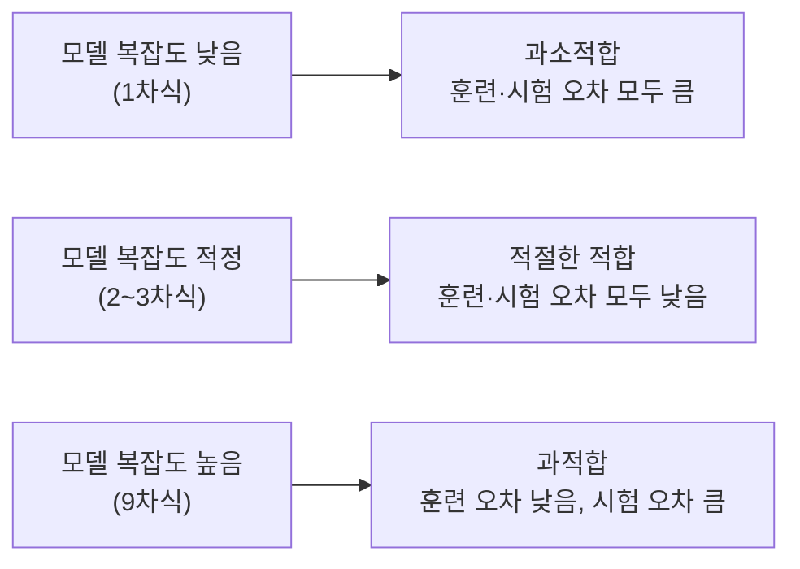
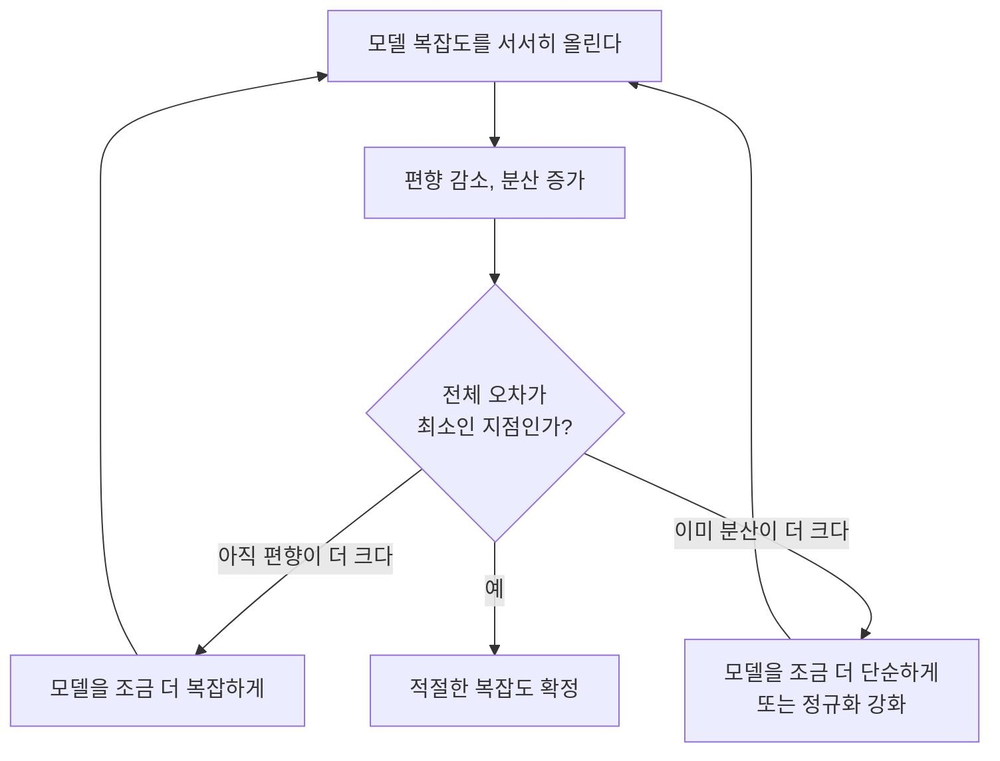

<Callout type="info">
  **이번 문서의 목표:** 과적합·과소적합을 구분하고 그 원인을 편향-분산 트레이드오프로 설명하며, 정규화가 왜 과적합을 억제하는지, k-폴드 교차검증이 왜 필요하고 어떻게 진행되는지 설명할 수 있다.
</Callout>

## 왜 "훈련 성능이 좋다"만으로는 안심할 수 없는가

08~13편에서 여러 모델을 학습시켰다. 모델을 학습시킬 때 쓰는 데이터를 **훈련 세트**(training set)라 부르는데, 훈련 세트에서 성능이 아주 좋다고 해서 그 모델이 실제로 좋은 모델이라고 단정할 수 없다. 모델이 훈련 데이터의 세세한 잡음(noise, 우연한 오차나 이상치)까지 통째로 외워버려서, 훈련 데이터에서는 완벽하지만 **한 번도 보지 못한 새 데이터**에서는 형편없이 틀리는 경우가 있기 때문이다. 이 현상을 **과적합**(overfitting)이라 한다.

> **쉽게 말하면:** 과적합은 문제집 정답을 통째로 암기해서 그 문제집은 100점이지만, 조금만 문제를 바꾸면 못 푸는 상태다.

반대로 모델이 너무 단순해서 훈련 데이터의 패턴조차 제대로 잡아내지 못하는 경우도 있다. 이를 **과소적합**(underfitting)이라 한다. 과소적합인 모델은 훈련 세트에서도, 새 데이터에서도 성능이 모두 나쁘다.

> **쉽게 말하면:** 과소적합은 공부를 너무 적게 해서 문제집조차 잘 못 푸는 상태다.

### 예시로 감을 잡기: 다항 회귀의 차수

08편에서 다룬 다항 회귀를 예로 들어보자. 데이터 점 10개가 완만한 곡선 모양으로 흩어져 있다고 하자.

- **1차식(직선)으로 적합**: 곡선 모양을 전혀 못 따라가서 훈련 오차도 크다. → 과소적합
- **2~3차식으로 적합**: 데이터의 전반적인 곡선 흐름을 잘 따라간다. → 적절한 적합
- **9차식으로 적합**: 곡선이 10개의 점 하나하나를 정확히 통과하도록 구불구불 휘어진다. 훈련 오차는 거의 0이지만, 점과 점 사이나 새로운 x값에서는 터무니없이 튀는 값을 예측한다. → 과적합

## 편향-분산 트레이드오프

과적합·과소적합이 왜 일어나는지를 이론적으로 설명하는 틀이 **편향-분산 트레이드오프**(bias-variance tradeoff)다.

### 정의: 편향과 분산

- **편향**(bias): 모델이 너무 단순한 가정을 세워서, 정답과 체계적으로 어긋나는 정도. 편향이 크면 모델이 데이터의 실제 패턴을 애초에 표현할 능력이 없다는 뜻이다.
- **분산**(variance): 훈련 데이터를 조금만 바꿔도(다른 표본을 뽑아도) 모델의 예측이 크게 흔들리는 정도. 분산이 크면 모델이 훈련 데이터 하나하나의 잡음까지 민감하게 따라간다는 뜻이다.

> **쉽게 말하면:** 편향은 "과녁의 중심에서 얼마나 벗어나 있는가"(정확성 부족), 분산은 "쏠 때마다 탄착점이 얼마나 들쭉날쭉한가"(일관성 부족)에 비유할 수 있다.

| 상황 | 편향 | 분산 | 대응 현상 |
|---|---|---|---|
| 1차식으로 곡선 데이터 적합 | 높음 | 낮음 | 과소적합 |
| 9차식으로 곡선 데이터 적합 | 낮음 | 높음 | 과적합 |
| 2–3차식으로 곡선 데이터 적합 | 적당 | 적당 | 적절한 적합 |

편향과 분산은 대개 한쪽을 줄이면 다른 쪽이 늘어나는 **트레이드오프**(tradeoff, 하나를 얻으면 다른 하나를 잃는 관계) 관계에 있다. 모델을 복잡하게 만들수록(예: 다항 차수를 올리거나, 트리 깊이를 늘리면) 편향은 줄지만 분산은 커지고, 모델을 단순하게 만들수록 분산은 줄지만 편향이 커진다. 그래서 모델 선택의 목표는 편향을 0으로, 분산을 0으로 만드는 것이 아니라 **둘의 합(전체 오차)이 최소가 되는 지점**을 찾는 것이다.

### 전체 오차의 구조

모델의 기대 오차(expected error)는 대략 다음 세 부분으로 나눌 수 있다.

$$
\text{전체 오차} = \text{편향}^2 + \text{분산} + \text{줄일 수 없는 오차}
$$

- 편향$^2$: 모델의 표현력 부족으로 생기는 체계적 오차
- 분산: 훈련 데이터가 바뀔 때 예측이 흔들리는 정도
- 줄일 수 없는 오차(irreducible error): 데이터 자체에 존재하는 잡음으로, 어떤 모델을 쓰든 없앨 수 없는 부분

### 자주 틀리는 점: 훈련 오차만으로는 판단할 수 없다

"훈련 오차가 낮으면 좋은 모델이다"는 대표적인 오해다. 훈련 오차만 보면 과적합된 모델(9차식)이 가장 좋아 보인다. 편향-분산을 제대로 판단하려면 반드시 **훈련 세트에 쓰이지 않은 데이터**에서의 오차(검증·시험 오차)를 함께 봐야 한다. 훈련 오차는 낮은데 검증 오차가 훨씬 높다면 그것이 바로 과적합(분산이 큰 상태)의 신호다.

## 정규화로 과적합 억제하기

09편에서 다룬 릿지·라쏘 회귀가 바로 편향-분산 트레이드오프를 실제로 조절하는 도구다. **정규화**(regularization)는 손실함수에 모델 파라미터의 크기에 대한 벌점을 추가해, 모델이 훈련 데이터를 지나치게 따라가지 않도록 억제한다.

$$
\text{정규화된 손실} = \text{원래 손실(MSE 등)} + \lambda \times \text{벌점항}
$$

- $\lambda$ (람다): 정규화 강도를 조절하는 하이퍼파라미터. 클수록 벌점을 무겁게 매겨 파라미터를 더 작게 억제한다.
- 벌점항: L2 정규화(릿지)는 파라미터 제곱의 합 $\sum \theta_j^2$, L1 정규화(라쏘)는 파라미터 절댓값의 합 $\sum |\theta_j|$을 쓴다(자세한 수식과 차이는 09편 참고).

$\lambda$를 키우면 파라미터가 0에 가깝게 눌려 모델이 단순해지므로 **분산은 줄고 편향은 늘어나는 방향**으로 움직인다. 반대로 $\lambda$가 0이면 정규화가 없는 원래 모델과 같아져 분산이 커질 위험이 그대로 남는다. 즉 정규화 강도 $\lambda$는 편향-분산 트레이드오프를 조절하는 손잡이 역할을 한다.

> **쉽게 말하면:** 정규화는 모델에게 "정답을 너무 억지로 끼워 맞추지 말라"고 페널티를 매기는 규칙이다.

## 데이터를 어떻게 나눠서 검증할 것인가

과적합 여부를 확인하려면 훈련에 쓰지 않은 데이터가 필요하다고 했다. 가장 단순한 방법은 데이터를 훈련 세트와 **시험 세트**(test set)로 한 번 나누는 것이다. 하지만 이 방법에는 문제가 있다.

- 데이터를 어떻게 나누느냐(어떤 표본이 훈련에, 어떤 표본이 시험에 들어가느냐)에 따라 성능 평가 결과가 운 좋게 또는 운 나쁘게 달라질 수 있다.
- 하이퍼파라미터를 조정하면서 시험 세트 성능을 계속 확인하면, 결국 시험 세트에도 암묵적으로 맞춰 조정하게 되어(시험 세트에 대한 과적합) 시험 세트가 더 이상 "보지 못한 데이터"의 역할을 못 하게 된다.

이 문제를 해결하는 방법이 **k-폴드 교차검증**(k-fold cross-validation)이다.

### k-폴드 교차검증의 절차

<Steps>

### 1단계: 데이터를 k개로 분할

전체 훈련 데이터를 크기가 거의 같은 $k$개의 조각(폴드, fold)으로 나눈다. 흔히 $k=5$ 또는 $k=10$을 쓴다.

### 2단계: k번 반복 학습·검증

$k$개 폴드 중 하나를 **검증 폴드**로 남겨두고, 나머지 $k-1$개 폴드로 모델을 학습한 뒤 남겨둔 검증 폴드로 성능을 측정한다. 이 과정을 검증 폴드를 바꿔가며 $k$번 반복한다. 즉 모든 폴드가 정확히 한 번씩은 검증 역할을 맡는다.

### 3단계: 평균으로 최종 성능 산출

$k$번의 검증에서 얻은 성능 점수(예: 정확도, F1)를 평균 내어 최종 성능으로 삼는다.

</Steps>

$$
\text{교차검증 점수} = \frac{1}{k}\sum_{i=1}^{k} \text{score}_i
$$

- $k$: 폴드 개수
- $\text{score}_i$: $i$번째 폴드를 검증용으로 썼을 때의 성능 점수

### 작은 예시: 5-폴드 교차검증

데이터 100개를 5개 폴드(각 20개)로 나누고 정확도를 측정했다고 하자.

| 반복 | 검증 폴드 | 훈련에 쓴 폴드 | 정확도 |
|---|---|---|---|
| 1회차 | 폴드 1 | 폴드 2·3·4·5 | 0.82 |
| 2회차 | 폴드 2 | 폴드 1·3·4·5 | 0.79 |
| 3회차 | 폴드 3 | 폴드 1·2·4·5 | 0.85 |
| 4회차 | 폴드 4 | 폴드 1·2·3·5 | 0.81 |
| 5회차 | 폴드 5 | 폴드 1·2·3·4 | 0.83 |

$$
\text{교차검증 점수} = \frac{0.82+0.79+0.85+0.81+0.83}{5} = \frac{4.10}{5} = 0.82
$$

평균 정확도 0.82를 최종 성능으로 보고하며, 5개 값이 0.79~0.85로 크게 벌어지지 않는다는 것은 이 모델의 성능이 어떤 데이터 분할을 쓰든 비교적 안정적이라는 뜻이다. 만약 폴드마다 정확도가 0.5~0.95처럼 크게 들쭉날쭉하다면, 이는 모델이 데이터 분할에 민감하다는(분산이 크다는) 또 다른 신호로 해석할 수 있다.

### 자주 틀리는 점: 교차검증은 시험 세트를 대신하지 않는다

k-폴드 교차검증은 **하이퍼파라미터를 고르거나 모델을 비교**하는 단계에서 쓰는 것이지, 최종 시험 세트를 아예 없애도 된다는 뜻이 아니다. 실무에서 흔히 쓰는 구조는 데이터를 먼저 훈련+검증용과 **최종 시험 세트**로 분리해 두고, 훈련+검증용 안에서만 k-폴드 교차검증으로 모델·하이퍼파라미터를 고른 뒤, 마지막에 단 한 번 최종 시험 세트로 성능을 확인하는 것이다. 이렇게 해야 최종 시험 세트가 끝까지 "한 번도 보지 못한 데이터"로 남는다.

## 핵심 정리

- 과적합은 훈련 데이터의 잡음까지 외워 새 데이터에서 성능이 떨어지는 상태, 과소적합은 모델이 너무 단순해 패턴조차 못 잡는 상태다.
- 편향은 모델의 표현력 부족에서 오는 체계적 오차, 분산은 훈련 데이터가 바뀔 때 예측이 흔들리는 정도이며, 둘은 대개 트레이드오프 관계다.
- 정규화는 손실함수에 파라미터 크기 벌점을 더해 $\lambda$로 편향-분산 균형을 조절하는 도구다.
- k-폴드 교차검증은 데이터를 $k$개 폴드로 나눠 매번 다른 폴드를 검증용으로 삼아 $k$번 학습·평가하고 평균을 낸다.
- 교차검증은 모델·하이퍼파라미터 선택 단계의 도구이며, 최종 성능 확인을 위한 별도의 시험 세트를 대체하지 않는다.

## 마무리 복습

<Quiz
  questionNumber={1}
  question="훈련 오차는 거의 0에 가깝지만 새로운 데이터에서는 오차가 크게 나타나는 현상을 가장 잘 설명하는 용어는?"
  options={['과소적합', '과적합', '정규화', '교차검증']}
  correctAnswer={2}
  explanation="훈련 데이터에서는 완벽에 가깝지만 새 데이터에서 성능이 크게 떨어지는 현상은 모델이 훈련 데이터의 잡음까지 외워버린 과적합의 전형적인 특징이다."
  optionExplanations={['과소적합은 훈련 데이터에서도 성능이 나쁜 상태이므로 설명과 반대다', '정답: 훈련 오차가 낮은데 시험 오차가 큰 것은 과적합의 정의에 해당한다', '정규화는 과적합을 억제하는 도구이지 현상 자체의 이름이 아니다', '교차검증은 성능을 평가하는 절차이지 현상의 이름이 아니다']}
/>

<Quiz
  questionNumber={2}
  question="편향(bias)과 분산(variance)에 대한 설명으로 옳은 것은?"
  options={['편향이 큰 모델은 데이터 분할이 바뀔 때마다 예측이 크게 흔들린다', '분산이 큰 모델은 대체로 모델이 너무 단순해서 발생한다', '모델을 복잡하게 만들수록 일반적으로 편향은 줄고 분산은 커진다', '편향과 분산은 항상 같은 방향으로 함께 증가하거나 감소한다']}
  correctAnswer={3}
  explanation="모델의 복잡도를 높이면 데이터의 세밀한 패턴까지 표현할 수 있어 편향(체계적 오차)은 줄어들지만, 그만큼 훈련 데이터의 잡음에도 민감해져 분산(예측의 흔들림)은 커지는 것이 일반적인 트레이드오프다."
  optionExplanations={['예측이 흔들리는 것은 분산에 대한 설명이며, 편향은 체계적으로 정답에서 벗어나는 정도를 뜻한다', '분산이 큰 모델은 대체로 너무 복잡해서(과적합) 발생하며, 단순한 모델은 오히려 편향이 크다', '정답: 복잡도를 높이면 편향은 감소, 분산은 증가하는 트레이드오프가 일반적이다', '편향과 분산은 대개 서로 반대 방향으로 움직이는 트레이드오프 관계다']}
/>

<Quiz
  questionNumber={3}
  question="릿지 회귀에서 정규화 강도 λ를 매우 크게 키울 때 나타나는 현상으로 가장 옳은 것은?"
  options={['모델 파라미터가 커져 분산이 늘어난다', '모델이 단순해지며 편향은 커지고 분산은 줄어드는 경향을 보인다', '훈련 오차와 시험 오차가 모두 항상 0에 가까워진다', 'λ는 편향-분산과는 무관한 값이다']}
  correctAnswer={2}
  explanation="λ를 키우면 벌점항의 영향이 커져 파라미터가 0에 가깝게 눌리고 모델이 단순해진다. 이는 분산을 줄이는 대신 편향을 늘리는 방향으로 편향-분산 트레이드오프를 이동시킨다."
  optionExplanations={['λ를 키우면 파라미터는 오히려 작아지는 방향으로 눌린다', '정답: λ가 커질수록 모델이 단순해져 편향은 늘고 분산은 줄어드는 경향을 보인다', 'λ가 지나치게 크면 오히려 과소적합이 되어 두 오차 모두 커질 수 있다', 'λ는 정규화 강도로 편향-분산 균형을 직접 조절하는 하이퍼파라미터다']}
/>

<Quiz
  questionNumber={4}
  question="5-폴드 교차검증에서 각 폴드의 정확도가 0.82, 0.79, 0.85, 0.81, 0.83으로 나왔다. 이 모델의 교차검증 점수(평균 정확도)는?"
  options={['0.79', '0.81', '0.82', '0.85']}
  correctAnswer={3}
  explanation="다섯 값을 더하면 0.82+0.79+0.85+0.81+0.83=4.10이고, 이를 5로 나누면 0.82가 된다."
  optionExplanations={['다섯 값 중 최솟값일 뿐 평균이 아니다', '값을 잘못 합산하거나 나눈 결과로 보인다', '정답: 합 4.10을 5로 나누면 0.82다', '다섯 값 중 최댓값일 뿐 평균이 아니다']}
/>

<Quiz
  questionNumber={5}
  question="k-폴드 교차검증에 대한 설명으로 옳지 않은 것은?"
  options={['데이터를 k개 폴드로 나누어 매번 검증 폴드를 바꿔가며 k번 학습·평가한다', '모든 폴드는 정확히 한 번씩 검증 폴드로 사용된다', '교차검증에서 좋은 점수가 나오면 최종 시험 세트 없이 바로 배포해도 된다', '폴드별 성능 점수가 서로 크게 다르면 모델이 데이터 분할에 민감하다는 신호로 볼 수 있다']}
  correctAnswer={3}
  explanation="옳지 않은 것을 고르는 문제다. 교차검증은 모델·하이퍼파라미터를 고르는 단계의 도구이며, 한 번도 쓰이지 않은 별도의 최종 시험 세트로 마지막 성능을 확인하는 절차를 대체하지 않는다."
  optionExplanations={['옳은 설명이다(오답 후보 아님)', '옳은 설명이다(오답 후보 아님)', '정답: 틀린 설명이다. 교차검증 점수가 좋아도 최종 확인을 위한 별도의 시험 세트가 필요하다', '옳은 설명이다. 폴드 간 점수 편차가 크면 분산이 크다는 신호로 해석할 수 있다']}
/>

<Quiz
  questionNumber={6}
  question="어느 데이터에 1차식(직선)을 적합했더니 훈련 오차와 시험 오차가 모두 크게 나타났다. 이 상황을 가장 잘 설명하는 것은?"
  options={['분산이 매우 커서 생기는 전형적인 과적합이다', '편향이 매우 커서 생기는 전형적인 과소적합이다', '정규화 강도 λ가 너무 작아서 생기는 현상이다', '교차검증 폴드 수 k를 늘리면 즉시 해결되는 문제다']}
  correctAnswer={2}
  explanation="훈련 오차와 시험 오차가 모두 크다는 것은 모델이 데이터의 패턴 자체를 제대로 표현하지 못하고 있다는 뜻으로, 편향이 큰 과소적합의 전형적인 특징이다. 모델을 더 복잡하게 만드는 방향(예: 다항 차수를 높이는 것)으로 해결해야 한다."
  optionExplanations={['과적합이라면 훈련 오차는 낮고 시험 오차만 큰 패턴이 나타나야 한다', '정답: 훈련·시험 오차가 모두 큰 것은 편향이 큰 과소적합의 특징이다', 'λ가 작다는 것은 정규화가 약하다는 뜻으로 오히려 과적합 쪽에 가까운 상황이다', '폴드 수를 늘리는 것은 평가 방법의 문제이지 모델이 너무 단순한 근본 원인을 해결하지 못한다']}
/>

## 참고 자료

- [scikit-learn Model Evaluation — Metrics and scoring](https://scikit-learn.org/stable/modules/model_evaluation.html)
- [대학 머신러닝 개론 강의노트 (평가 지표·혼동행렬·ROC, 과적합·정규화·교차검증)](https://scikit-learn.org/stable/user_guide.html)
