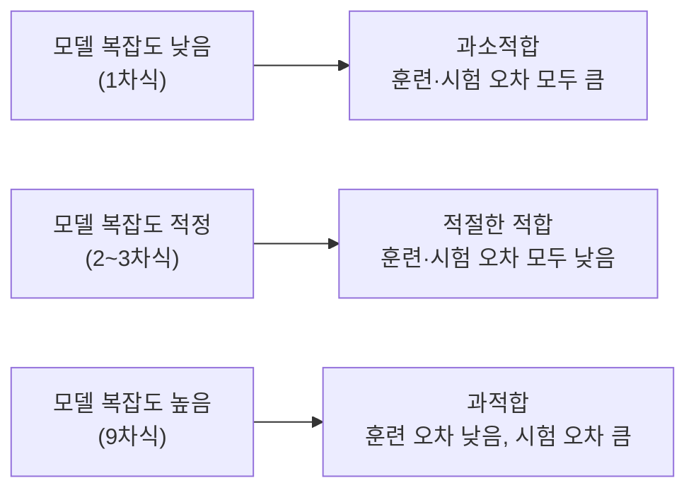
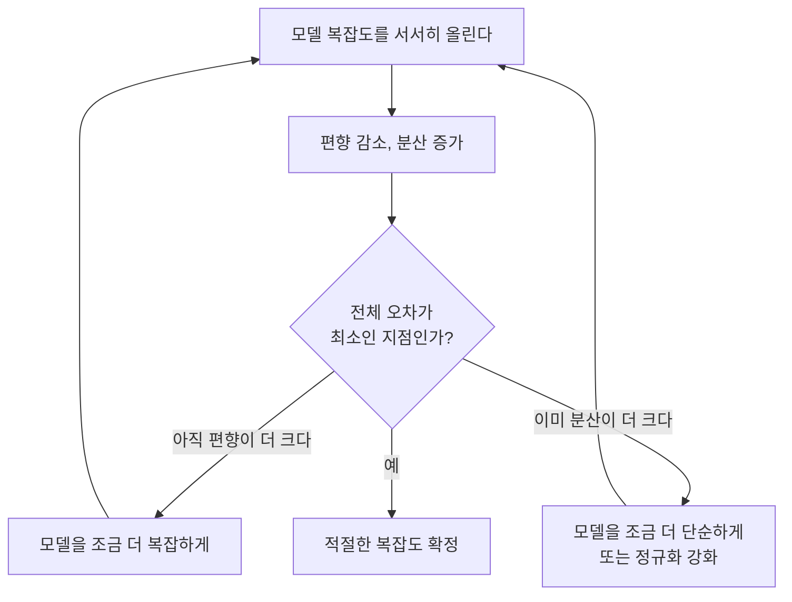

## 왜 "훈련 성능이 좋다"만으로는 안심할 수 없는가

07~12편에서 여러 모델을 학습시켰다. 모델을 학습시킬 때 쓰는 데이터를 **훈련 세트**(training set)라 부르는데, 훈련 세트에서 성능이 아주 좋다고 해서 그 모델이 실제로 좋은 모델이라고 단정할 수 없다.

반대로 모델이 너무 단순해서 훈련 데이터의 패턴조차 제대로 잡아내지 못하는 경우도 있다. 이를 **과소적합**(underfitting)이라 한다. 과소적합인 모델은 훈련 세트에서도, 새 데이터에서도 성능이 모두 나쁘다.

### 예시로 감을 잡기: 다항 회귀의 차수

07편에서 다룬 다항 회귀를 예로 들어보자. 데이터 점 10개가 완만한 곡선 모양으로 흩어져 있다고 하자.

- **1차식(직선)으로 적합**: 곡선 모양을 전혀 못 따라가서 훈련 오차도 크다. → 과소적합
- **2~3차식으로 적합**: 데이터의 전반적인 곡선 흐름을 잘 따라간다. → 적절한 적합
- **9차식으로 적합**: 곡선이 10개의 점 하나하나를 정확히 통과하도록 구불구불 휘어진다. 훈련 오차는 거의 0이지만, 점과 점 사이나 새로운 x값에서는 터무니없이 튀는 값을 예측한다. → 과적합

```mermaid
flowchart LR
    A["모델 복잡도 낮음<br/>(1차식)"] --> B["과소적합<br/>훈련·시험 오차 모두 큼"]
    C["모델 복잡도 적정<br/>(2~3차식)"] --> D["적절한 적합<br/>훈련·시험 오차 모두 낮음"]
    E["모델 복잡도 높음<br/>(9차식)"] --> F["과적합<br/>훈련 오차 낮음, 시험 오차 큼"]
```

## 편향-분산 트레이드오프

과적합·과소적합이 왜 일어나는지를 이론적으로 설명하는 틀이 **편향-분산 트레이드오프**(bias-variance tradeoff)다.

### 정의: 편향과 분산

- **편향**(bias): 모델이 너무 단순한 가정을 세워서, 정답과 체계적으로 어긋나는 정도. 편향이 크면 모델이 데이터의 실제 패턴을 애초에 표현할 능력이 없다는 뜻이다.
- **분산**(variance): 훈련 데이터를 조금만 바꿔도(다른 표본을 뽑아도) 모델의 예측이 크게 흔들리는 정도. 분산이 크면 모델이 훈련 데이터 하나하나의 잡음까지 민감하게 따라간다는 뜻이다.

| 상황 | 편향 | 분산 | 대응 현상 |
|---|---|---|---|
| 1차식으로 곡선 데이터 적합 | 높음 | 낮음 | 과소적합 |
| 9차식으로 곡선 데이터 적합 | 낮음 | 높음 | 과적합 |
| 2–3차식으로 곡선 데이터 적합 | 적당 | 적당 | 적절한 적합 |

편향과 분산은 대개 한쪽을 줄이면 다른 쪽이 늘어나는 **트레이드오프**(tradeoff, 하나를 얻으면 다른 하나를 잃는 관계) 관계에 있다. 그래서 모델 선택의 목표는 편향을 0으로, 분산을 0으로 만드는 것이 아니라 **둘의 합(전체 오차)이 최소가 되는 지점**을 찾는 것이다.

### 전체 오차의 구조

모델의 기대 오차(expected error)는 대략 다음 세 부분으로 나눌 수 있다.

$$
\text{전체 오차} = \text{편향}^2 + \text{분산} + \text{줄일 수 없는 오차}
$$

- 편향$^2$: 모델의 표현력 부족으로 생기는 체계적 오차
- 분산: 훈련 데이터가 바뀔 때 예측이 흔들리는 정도
- 줄일 수 없는 오차(irreducible error): 데이터 자체에 존재하는 잡음으로, 어떤 모델을 쓰든 없앨 수 없는 부분

```mermaid
flowchart TD
    A["모델 복잡도를 서서히 올린다"] --> B["편향 감소, 분산 증가"]
    B --> C{"전체 오차가<br/>최소인 지점인가?"}
    C -->|"아직 편향이 더 크다"| D["모델을 조금 더 복잡하게"]
    C -->|"이미 분산이 더 크다"| E["모델을 조금 더 단순하게<br/>또는 정규화 강화"]
    C -->|"예"| F["적절한 복잡도 확정"]
    D --> A
    E --> A
```

### 자주 틀리는 점: 훈련 오차만으로는 판단할 수 없다

"훈련 오차가 낮으면 좋은 모델이다"는 대표적인 오해다. 훈련 오차만 보면 과적합된 모델(9차식)이 가장 좋아 보인다.

## 정규화로 과적합 억제하기

08편에서 다룬 릿지·라쏘 회귀가 바로 편향-분산 트레이드오프를 실제로 조절하는 도구다. **정규화**(regularization)는 손실함수에 모델 파라미터의 크기에 대한 벌점을 추가해, 모델이 훈련 데이터를 지나치게 따라가지 않도록 억제한다.

$$
\text{정규화된 손실} = \text{원래 손실(MSE 등)} + \lambda \times \text{벌점항}
$$

- $\lambda$ (람다): 정규화 강도를 조절하는 하이퍼파라미터. 클수록 벌점을 무겁게 매겨 파라미터를 더 작게 억제한다.
- 벌점항: L2 정규화(릿지)는 파라미터 제곱의 합 $\sum \theta_j^2$, L1 정규화(라쏘)는 파라미터 절댓값의 합 $\sum |\theta_j|$을 쓴다(자세한 수식과 차이는 08편 참고).

$\lambda$를 키우면 파라미터가 0에 가깝게 눌려 모델이 단순해지므로 **분산은 줄고 편향은 늘어나는 방향**으로 움직인다. 반대로 $\lambda$가 0이면 정규화가 없는 원래 모델과 같아져 분산이 커질 위험이 그대로 남는다.

## 데이터를 어떻게 나눠서 검증할 것인가

과적합 여부를 확인하려면 훈련에 쓰지 않은 데이터가 필요하다고 했다. 가장 단순한 방법은 데이터를 훈련 세트와 **시험 세트**(test set)로 한 번 나누는 것이다. 하지만 이 방법에는 문제가 있다.

- 데이터를 어떻게 나누느냐(어떤 표본이 훈련에, 어떤 표본이 시험에 들어가느냐)에 따라 성능 평가 결과가 운 좋게 또는 운 나쁘게 달라질 수 있다.
- 하이퍼파라미터를 조정하면서 시험 세트 성능을 계속 확인하면, 결국 시험 세트에도 암묵적으로 맞춰 조정하게 되어(시험 세트에 대한 과적합) 시험 세트가 더 이상 "보지 못한 데이터"의 역할을 못 하게 된다.

이 문제를 해결하는 방법이 **k-폴드 교차검증**(k-fold cross-validation)이다.

### k-폴드 교차검증의 절차

$$
\text{교차검증 점수} = \frac{1}{k}\sum_{i=1}^{k} \text{score}_i
$$

- $k$: 폴드 개수
- $\text{score}_i$: $i$번째 폴드를 검증용으로 썼을 때의 성능 점수

### 작은 예시: 5-폴드 교차검증

데이터 100개를 5개 폴드(각 20개)로 나누고 정확도를 측정했다고 하자.

| 반복 | 검증 폴드 | 훈련에 쓴 폴드 | 정확도 |
|---|---|---|---|
| 1회차 | 폴드 1 | 폴드 2·3·4·5 | 0.82 |
| 2회차 | 폴드 2 | 폴드 1·3·4·5 | 0.79 |
| 3회차 | 폴드 3 | 폴드 1·2·4·5 | 0.85 |
| 4회차 | 폴드 4 | 폴드 1·2·3·5 | 0.81 |
| 5회차 | 폴드 5 | 폴드 1·2·3·4 | 0.83 |

$$
\text{교차검증 점수} = \frac{0.82+0.79+0.85+0.81+0.83}{5} = \frac{4.10}{5} = 0.82
$$

평균 정확도 0.82를 최종 성능으로 보고하며, 5개 값이 0.79~0.85로 크게 벌어지지 않는다는 것은 이 모델의 성능이 어떤 데이터 분할을 쓰든 비교적 안정적이라는 뜻이다. 만약 폴드마다 정확도가 0.5~0.95처럼 크게 들쭉날쭉하다면, 이는 모델이 데이터 분할에 민감하다는(분산이 크다는) 또 다른 신호로 해석할 수 있다.

### 자주 틀리는 점: 교차검증은 시험 세트를 대신하지 않는다

k-폴드 교차검증은 **하이퍼파라미터를 고르거나 모델을 비교**하는 단계에서 쓰는 것이지, 최종 시험 세트를 아예 없애도 된다는 뜻이 아니다. 실무에서 흔히 쓰는 구조는 데이터를 먼저 훈련+검증용과 **최종 시험 세트**로 분리해 두고, 훈련+검증용 안에서만 k-폴드 교차검증으로 모델·하이퍼파라미터를 고른 뒤, 마지막에 단 한 번 최종 시험 세트로 성능을 확인하는 것이다.

## 핵심 정리

- 과적합은 훈련 데이터의 잡음까지 외워 새 데이터에서 성능이 떨어지는 상태, 과소적합은 모델이 너무 단순해 패턴조차 못 잡는 상태다.
- 편향은 모델의 표현력 부족에서 오는 체계적 오차, 분산은 훈련 데이터가 바뀔 때 예측이 흔들리는 정도이며, 둘은 대개 트레이드오프 관계다.
- 정규화는 손실함수에 파라미터 크기 벌점을 더해 $\lambda$로 편향-분산 균형을 조절하는 도구다.
- k-폴드 교차검증은 데이터를 $k$개 폴드로 나눠 매번 다른 폴드를 검증용으로 삼아 $k$번 학습·평가하고 평균을 낸다.
- 교차검증은 모델·하이퍼파라미터 선택 단계의 도구이며, 최종 성능 확인을 위한 별도의 시험 세트를 대체하지 않는다.

## 마무리 복습

<Quiz
  questionNumber={1}
  question={"훈련 오차는 거의 0에 가깝지만 새로운 데이터에서는 오차가 크게 나타나는 현상을 가장 잘 설명하는 용어는?"}
  options={["과소적합","과적합","정규화","교차검증"]}
  correctAnswer={2}
  explanation={"훈련 데이터에서는 완벽에 가깝지만 새 데이터에서 성능이 크게 떨어지는 현상은 모델이 훈련 데이터의 잡음까지 외워버린 과적합의 전형적인 특징이다."}
/>

<Quiz
  questionNumber={2}
  question={"편향(bias)과 분산(variance)에 대한 설명으로 옳은 것은?"}
  options={["편향이 큰 모델은 데이터 분할이 바뀔 때마다 예측이 크게 흔들린다","분산이 큰 모델은 대체로 모델이 너무 단순해서 발생한다","모델을 복잡하게 만들수록 일반적으로 편향은 줄고 분산은 커진다","편향과 분산은 항상 같은 방향으로 함께 증가하거나 감소한다"]}
  correctAnswer={3}
  explanation={"모델의 복잡도를 높이면 데이터의 세밀한 패턴까지 표현할 수 있어 편향(체계적 오차)은 줄어들지만, 그만큼 훈련 데이터의 잡음에도 민감해져 분산(예측의 흔들림)은 커지는 것이 일반적인 트레이드오프다."}
/>

<Quiz
  questionNumber={3}
  question={"릿지 회귀에서 정규화 강도 λ를 매우 크게 키울 때 나타나는 현상으로 가장 옳은 것은?"}
  options={["모델 파라미터가 커져 분산이 늘어난다","모델이 단순해지며 편향은 커지고 분산은 줄어드는 경향을 보인다","훈련 오차와 시험 오차가 모두 항상 0에 가까워진다","λ는 편향-분산과는 무관한 값이다"]}
  correctAnswer={2}
  explanation={"λ를 키우면 벌점항의 영향이 커져 파라미터가 0에 가깝게 눌리고 모델이 단순해진다. 이는 분산을 줄이는 대신 편향을 늘리는 방향으로 편향-분산 트레이드오프를 이동시킨다."}
/>

## 참고 자료

- [scikit-learn Model Evaluation — Metrics and scoring](https://scikit-learn.org/stable/modules/model_evaluation.html)
- [대학 머신러닝 개론 강의노트 (평가 지표·혼동행렬·ROC, 과적합·정규화·교차검증)](https://scikit-learn.org/stable/user_guide.html)
