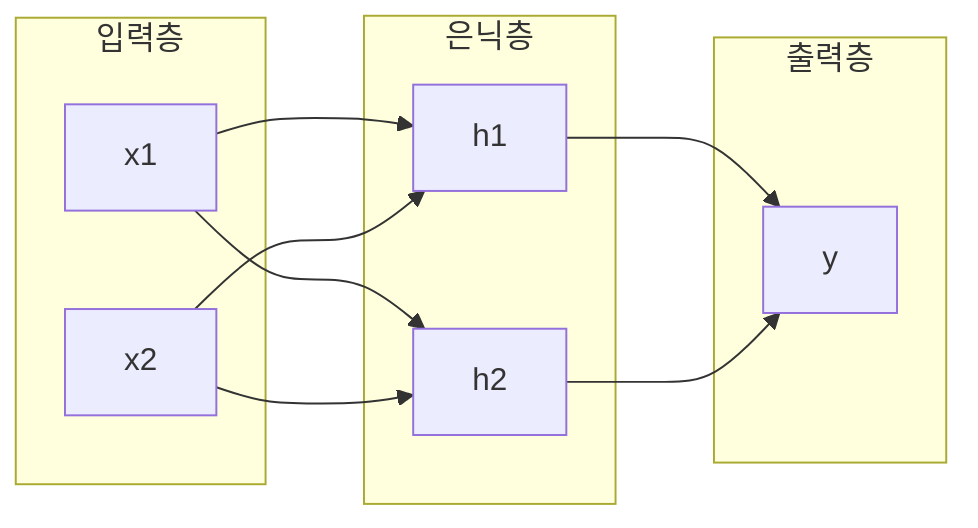

<Callout type="info">
  **이번 문서의 목표:** 퍼셉트론이 데이터를 어떻게 선형으로 나누는지, 왜 XOR 같은 문제는 퍼셉트론 하나로 풀 수 없는지, MLP의 은닉층·활성화함수가 이 한계를 어떻게 극복하는지, 역전파가 가중치를 어떤 방향으로 갱신하는지 숫자로 설명할 수 있다.
</Callout>

## 신경망은 왜 나왔는가

06~13편에서 배운 로지스틱 회귀·결정트리·SVM 같은 모델은 각자 정해진 방식으로 데이터를 나눈다. 그런데 사람의 뇌가 뉴런(neuron, 신경세포)을 연결해 정보를 처리하는 방식에서 착안해, "단순한 계산 단위를 여러 개 이어 붙이면 복잡한 패턴도 학습할 수 있지 않을까"라는 아이디어에서 출발한 모델이 **인공 신경망**(artificial neural network)이다. 그 가장 단순한 형태가 **퍼셉트론**(perceptron)이다.

> **쉽게 말하면:** 퍼셉트론은 여러 입력값에 각자 다른 중요도(가중치)를 매겨 더한 뒤, 그 합이 기준을 넘는지로 예/아니오를 결정하는 가장 단순한 인공 뉴런이다.

## 퍼셉트론의 구조와 계산

### 정의: 퍼셉트론

퍼셉트론은 입력 $x_1, x_2, \ldots, x_n$을 받아 각각에 **가중치**(weight) $w_1, w_2, \ldots, w_n$를 곱해 더하고, 여기에 **편향**(bias, 절편) $b$를 더한 뒤, 그 값이 0보다 큰지 여부로 최종 출력을 결정하는 계산 단위다.

$$
z = w_1 x_1 + w_2 x_2 + \cdots + w_n x_n + b
$$

- $z$: 가중합(weighted sum). 입력들을 가중치로 조합한 값
- $w_i$ (더블유 i): $i$번째 입력의 중요도를 나타내는 가중치. 클수록 그 입력이 결과에 큰 영향을 준다
- $b$ (비, bias): 가중합 전체를 위아래로 밀어 조정하는 편향(절편)

이 $z$ 값을 **활성화 함수**(activation function)에 넣어 최종 출력 $y$를 만든다. 퍼셉트론은 계단 함수(step function)를 활성화 함수로 쓴다.

$$
y = \begin{cases} 1 & (z > 0) \\ 0 & (z \le 0) \end{cases}
$$

> **쉽게 말하면:** 퍼셉트론은 "여러 증거(입력)에 각각 신뢰도(가중치)를 매겨 합산한 뒤, 합계가 기준선을 넘으면 참, 못 넘으면 거짓으로 판정하는" 간단한 투표 기계다.

### 작은 예시: AND 게이트를 학습한 퍼셉트론

입력이 둘 다 1일 때만 1을 출력하는 AND 논리 게이트를 퍼셉트론으로 만들어보자. 가중치 $w_1=1$, $w_2=1$, 편향 $b=-1.5$인 퍼셉트론이 있다고 하자.

| $x_1$ | $x_2$ | $z = w_1x_1+w_2x_2+b$ | 출력 $y$ |
|---|---|---|---|
| 0 | 0 | $0+0-1.5=-1.5$ | 0 |
| 0 | 1 | $0+1-1.5=-0.5$ | 0 |
| 1 | 0 | $1+0-1.5=-0.5$ | 0 |
| 1 | 1 | $1+1-1.5=0.5$ | 1 |

두 입력이 모두 1일 때만 $z>0$이 되어 출력이 1이 되므로, 이 가중치 조합이 AND 게이트를 정확히 표현한다. 이때 $z=0$이 되는 경계선(위 예시에서는 $x_1+x_2=1.5$)을 **결정 경계**(decision boundary)라 하며, 퍼셉트론의 결정 경계는 항상 **직선**(2차원 기준. 고차원에서는 평면 또는 초평면)이다.

### 퍼셉트론의 한계: XOR 문제

퍼셉트론의 결정 경계가 직선이라는 것은 곧 **선형적으로 분리 가능한**(linearly separable) 문제만 풀 수 있다는 뜻이다. 그런데 두 입력이 서로 다를 때만 1을 출력하는 XOR 게이트는 다음과 같은 데이터를 가진다.

| $x_1$ | $x_2$ | XOR 출력 |
|---|---|---|
| 0 | 0 | 0 |
| 0 | 1 | 1 |
| 1 | 0 | 1 |
| 1 | 1 | 0 |

이 네 점을 2차원 평면에 찍어보면 출력이 1인 점 두 개(0,1)와 (1,0)이 대각선 위에, 출력이 0인 점 두 개(0,0)와 (1,1)이 반대쪽 대각선 위에 있다. 어떤 직선을 그어도 이 두 그룹을 한 번에 나눌 수 없다. 즉 **XOR은 선형적으로 분리 불가능한 문제**이며, 퍼셉트론 하나로는 절대 풀 수 없다. 이 사실이 1960년대 말 신경망 연구가 한동안 침체되었던 이유이기도 하다.

> **쉽게 말하면:** 퍼셉트론 하나는 직선 하나로 세상을 두 편으로 가르는 것만 할 수 있는데, XOR은 직선 하나로 절대 갈라지지 않는 모양이다.

## MLP: 은닉층으로 XOR을 해결하다

퍼셉트론의 한계는 퍼셉트론을 **여러 층으로 쌓으면** 극복할 수 있다. 이렇게 여러 층의 퍼셉트론을 연결한 구조를 **다층 퍼셉트론**(MLP, Multi-Layer Perceptron)이라 한다.

### 정의: MLP의 구조

MLP는 세 종류의 층으로 이루어진다.

- **입력층**(input layer): 원본 데이터(특징)가 들어오는 층. 계산은 하지 않는다.
- **은닉층**(hidden layer): 입력층과 출력층 사이에 있는 층으로, 입력을 조합해 더 복잡한 패턴(특징)을 만들어낸다. 은닉층이 하나 이상 있어야 MLP라 부른다.
- **출력층**(output layer): 최종 예측값을 내놓는 층.

각 층의 뉴런은 이전 층의 모든 뉴런과 연결되며(완전연결, fully connected), 각 연결마다 고유한 가중치를 가진다.

### 왜 은닉층이 XOR을 풀 수 있게 하는가

직관적으로 은닉층은 원래 입력 공간을 **새로운 공간으로 변형**한다. 은닉층의 각 뉴런이 원래 입력에 대해 서로 다른 직선(결정 경계)을 하나씩 그어놓으면, 그 결과값들을 다시 조합하는 출력층은 "직선 여러 개를 합친 곡선 형태"의 경계를 표현할 수 있게 된다. 예컨대 은닉 뉴런 $h_1$이 "$x_1+x_2 > 0.5$인가"를, $h_2$가 "$x_1+x_2 > 1.5$인가"를 각각 판단하도록 학습되면, 출력층은 이 두 판단 결과를 조합해 "$h_1$은 참이고 $h_2$는 거짓인 경우만 1"이라는 식으로 XOR을 표현할 수 있다. 즉 은닉층이 하나 이상 있으면 직선 하나로는 안 되던 것을 "직선 여러 개의 조합(곡선에 가까운 경계)"으로 풀 수 있게 된다.

### 활성화 함수가 필요한 이유

MLP의 은닉층에서는 계단 함수 대신 매끄러운(미분 가능한) **활성화 함수**를 쓴다. 대표적으로 다음이 있다.

| 활성화 함수 | 수식 | 특징 |
|---|---|---|
| 시그모이드(sigmoid) | $\sigma(z) = \dfrac{1}{1+e^{-z}}$ | 출력이 0–1 사이, 10편의 로지스틱 함수와 동일 |
| ReLU(Rectified Linear Unit) | $\text{ReLU}(z) = \max(0, z)$ | 음수는 0, 양수는 그대로 통과, 계산이 간단 |
| 하이퍼볼릭탄젠트(tanh) | $\tanh(z) = \dfrac{e^z - e^{-z}}{e^z+e^{-z}}$ | 출력이 -1–1 사이 |

활성화 함수가 반드시 **비선형**(non-linear, 직선이 아닌)이어야 하는 이유가 있다. 만약 활성화 함수 없이(또는 선형 함수만) 층을 아무리 많이 쌓아도, 선형함수를 선형함수에 통과시킨 결과는 여전히 선형함수이므로 결국 하나의 퍼셉트론과 수학적으로 동일해진다. 즉 **비선형 활성화 함수가 있어야만** 여러 층을 쌓는 것이 실제로 더 복잡한 함수를 표현하는 의미를 가진다.

## 역전파: 가중치를 어떻게 학습시키는가

MLP가 구조적으로 복잡한 패턴을 표현할 수 있다는 것과, 그 가중치들을 실제로 좋은 값으로 **학습시키는 방법**은 별개의 문제다. 이 학습을 가능하게 하는 알고리즘이 **역전파**(backpropagation)다.

> **쉽게 말하면:** 역전파는 "최종 출력이 틀린 정도(오차)를 뒤에서부터 앞으로 되짚어가며, 각 가중치가 그 오차에 얼마나 책임이 있는지 계산해 조금씩 고쳐나가는" 절차다.

### 역전파의 두 단계

<Steps>

### 1단계: 순전파(forward propagation)

입력을 입력층부터 출력층 방향으로 통과시키며 각 층의 가중합과 활성화 함수 출력을 계산해, 최종 예측값을 얻는다. 이 예측값과 실제 정답의 차이로 **손실**(loss, 오차를 하나의 숫자로 나타낸 값)을 계산한다.

### 2단계: 역전파(backward propagation)

손실을 출력층에서 입력층 방향으로 거꾸로 전달하면서, **연쇄법칙**(chain rule, 합성함수를 미분할 때 각 단계의 미분을 곱해 나가는 규칙)을 이용해 각 가중치가 손실에 얼마나 영향을 미쳤는지(기울기, gradient)를 계산한다.

### 3단계: 가중치 갱신

계산된 기울기를 이용해 경사하강법(gradient descent)으로 가중치를 손실이 줄어드는 방향으로 조금씩 이동시킨다.

$$
w_{\text{new}} = w_{\text{old}} - \eta \times \frac{\partial L}{\partial w}
$$

- $w_{\text{new}}$, $w_{\text{old}}$: 갱신 후·갱신 전 가중치
- $\eta$ (에타): 학습률(learning rate). 한 번에 얼마나 크게 이동할지 정하는 값
- $\dfrac{\partial L}{\partial w}$ (편미분, L을 w로 미분): 이 가중치를 늘렸을 때 손실 $L$이 얼마나 늘어나는지를 나타내는 기울기

</Steps>

### 작은 숫자 예시로 갱신 방향 확인하기

아주 단순화해서, 출력층 가중치 하나 $w=0.5$가 있고, 이 가중치에 대한 손실의 기울기가 $\dfrac{\partial L}{\partial w}=0.8$로 계산되었으며 학습률 $\eta=0.1$이라고 하자.

$$
w_{\text{new}} = 0.5 - 0.1 \times 0.8 = 0.5 - 0.08 = 0.42
$$

기울기가 양수(0.8)라는 것은 "이 가중치를 더 키우면 손실이 커진다"는 뜻이므로, 가중치를 그 반대 방향인 음수 쪽으로(0.5에서 0.42로) 줄여서 손실을 낮춘다. 만약 기울기가 음수로 계산되었다면 가중치는 반대로 커지는 방향으로 갱신된다. 이 과정을 모든 가중치에 대해, 그리고 여러 번(에폭, epoch)에 걸쳐 반복하면 전체 손실이 점점 줄어드는 방향으로 신경망이 학습된다.

### 자주 틀리는 점: 역전파는 모델 구조가 아니라 학습 절차다

역전파를 "신경망의 한 층"이나 "신경망의 구조 일부"로 오해하는 경우가 있다. 역전파는 신경망 **구조**가 아니라, 이미 정해진 구조(입력층·은닉층·출력층과 각 가중치)에서 **기울기를 계산해 가중치를 학습시키는 절차**(알고리즘)다. 또한 역전파 자체가 가중치를 어느 방향으로 옮길지 결정하는 것이 아니라, "어느 방향으로 옮기면 손실이 줄어드는지"를 계산해주고, 실제로 옮기는 것은 경사하강법이 담당한다는 점도 구분해서 기억해야 한다.

## 신경망과 기존 알고리즘의 비교

| 구분 | 로지스틱 회귀(10편) | MLP(신경망) |
|---|---|---|
| 결정 경계 | 직선(선형) | 은닉층·활성화함수로 곡선 형태 표현 가능 |
| 특징 조합 | 사람이 다항식 등으로 직접 특징을 만들어야 함 | 은닉층이 스스로 특징 조합을 학습 |
| 해석 가능성 | 계수(가중치)의 의미를 비교적 직관적으로 해석 가능 | 은닉층의 가중치는 직접 해석하기 어려움 |
| 학습 방법 | 경사하강법으로 계수 직접 갱신 | 역전파로 기울기를 계산한 뒤 경사하강법으로 갱신 |
| 대표 한계 | 선형 분리 불가능한 문제(XOR 등)를 풀 수 없음 | 학습에 더 많은 데이터·계산량이 필요, 과적합 위험 |

이 과목의 범위는 신경망의 **정의·구조·역전파의 역할**까지이며, CNN·RNN 같은 딥러닝 아키텍처의 상세 구조나 프레임워크 구현은 다루지 않는다.

## 핵심 정리

- 퍼셉트론은 입력에 가중치를 곱해 더한 값 $z$가 0을 넘는지로 출력을 정하는 가장 단순한 인공 뉴런이며, 결정 경계가 직선(선형)이라 XOR처럼 선형 분리 불가능한 문제는 풀 수 없다.
- MLP는 입력층·은닉층·출력층으로 구성되며, 은닉층에서 비선형 활성화 함수(시그모이드·ReLU·tanh 등)를 써서 직선 여러 개를 조합한 복잡한 경계를 표현할 수 있다.
- 비선형 활성화 함수가 없으면 층을 아무리 쌓아도 결과는 여전히 선형 함수와 같아진다.
- 역전파는 손실을 출력층에서 입력층 방향으로 되짚어 연쇄법칙으로 각 가중치의 기울기를 계산하는 절차이며, 실제 가중치 갱신은 그 기울기를 이용한 경사하강법이 수행한다.
- 가중치 갱신식 $w_{\text{new}} = w_{\text{old}} - \eta \times \partial L/\partial w$에서 학습률 $\eta$는 한 번에 이동하는 폭을 정한다.

## 마무리 복습

<Quiz
  questionNumber={1}
  question="퍼셉트론이 XOR 문제를 풀 수 없는 근본적인 이유로 가장 옳은 것은?"
  options={['XOR 데이터의 표본 수가 너무 적기 때문이다', '퍼셉트론의 결정 경계가 직선이라 선형적으로 분리 불가능한 문제를 풀 수 없기 때문이다', '퍼셉트론은 가중치를 학습할 수 없는 구조이기 때문이다', 'XOR은 입력이 3개 이상일 때만 정의되는 문제이기 때문이다']}
  correctAnswer={2}
  explanation="퍼셉트론 하나의 결정 경계는 항상 직선(고차원에서는 초평면)이다. XOR의 데이터는 어떤 직선으로도 두 그룹으로 정확히 나눌 수 없는(선형 분리 불가능한) 배치이므로 퍼셉트론 하나로는 풀 수 없다."
  optionExplanations={['XOR 문제는 표본 수 4개로도 정의되며 개수는 근본 원인이 아니다', '정답: 직선 하나로는 XOR의 두 그룹을 나눌 수 없다는 것이 근본 원인이다', '퍼셉트론도 가중치를 학습할 수 있는 구조이며, 문제는 표현력(직선만 가능하다는 점)에 있다', 'XOR은 입력 2개(x1, x2)로 정의되는 문제다']}
/>

<Quiz
  questionNumber={2}
  question="가중치 w1=1, w2=1, 편향 b=-1.5인 퍼셉트론에 x1=1, x2=1을 입력했을 때의 출력은? (z가 0보다 크면 1, 아니면 0)"
  options={['z=-1.5이므로 출력 0', 'z=-0.5이므로 출력 0', 'z=0.5이므로 출력 1', 'z=1.5이므로 출력 1']}
  correctAnswer={3}
  explanation="z = w1x1+w2x2+b = 1×1+1×1+(-1.5) = 2-1.5 = 0.5다. z=0.5는 0보다 크므로 출력은 1이다."
  optionExplanations={['x1=0, x2=0을 대입한 경우의 z값이다', 'x1=0,x2=1 또는 x1=1,x2=0을 대입한 경우의 z값이다', '정답: 1+1-1.5=0.5이고 0보다 크므로 출력은 1이다', 'b를 더하지 않고 계산하는 등의 오류로 나온 값이다']}
/>

<Quiz
  questionNumber={3}
  question="MLP(다층 퍼셉트론)의 은닉층에서 비선형 활성화 함수를 반드시 사용해야 하는 이유로 가장 옳은 것은?"
  options={['계산 속도를 빠르게 하기 위해서다', '활성화 함수가 없으면 여러 층을 쌓아도 전체가 하나의 선형 함수와 동일해지기 때문이다', '입력값의 부호를 양수로만 맞추기 위해서다', '은닉층의 뉴런 개수를 줄이기 위해서다']}
  correctAnswer={2}
  explanation="선형 함수를 선형 함수에 통과시킨 결과는 여전히 선형 함수이므로, 비선형 활성화 함수 없이 층을 아무리 쌓아도 표현력은 퍼셉트론 하나와 같아진다. 비선형 활성화 함수가 있어야 여러 층을 쌓는 것이 실제로 의미를 가진다."
  optionExplanations={['활성화 함수의 목적은 속도 향상이 아니라 비선형 표현력 확보다', '정답: 비선형성이 없으면 다층 구조가 선형 모델과 동일해져 의미가 없어진다', 'ReLU 등 일부 함수는 음수를 0으로 만들지만, 이것이 비선형 함수를 쓰는 근본 이유는 아니다', '뉴런 개수는 활성화 함수 선택과 직접적인 관련이 없다']}
/>

<Quiz
  questionNumber={4}
  question="역전파(backpropagation)에 대한 설명으로 가장 옳은 것은?"
  options={['신경망의 구조를 이루는 하나의 층(layer)이다', '입력층에서 출력층 방향으로 예측값을 계산하는 과정이다', '손실을 출력층에서 입력층 방향으로 전달하며 연쇄법칙으로 각 가중치의 기울기를 계산하는 절차다', '학습률 η의 값을 자동으로 정해주는 별도의 알고리즘이다']}
  correctAnswer={3}
  explanation="역전파는 신경망의 구조가 아니라 학습 절차이며, 손실을 출력층에서 입력층 방향으로 거꾸로 전달하면서 연쇄법칙을 이용해 각 가중치가 손실에 미친 영향(기울기)을 계산한다."
  optionExplanations={['역전파는 층이 아니라 가중치를 학습시키는 절차(알고리즘)다', '이 설명은 순전파(forward propagation)에 해당한다', '정답: 역전파는 손실을 거꾸로 전달해 기울기를 계산하는 절차다', '학습률은 사람이 정하는 하이퍼파라미터이며 역전파가 자동으로 정해주지 않는다']}
/>

<Quiz
  questionNumber={5}
  question="가중치 w=0.5, 학습률 η=0.1, 이 가중치에 대한 손실의 기울기 ∂L/∂w=0.8일 때, 경사하강법으로 갱신한 새 가중치 값은?"
  options={['0.42', '0.50', '0.58', '1.30']}
  correctAnswer={1}
  explanation="w_new = w_old - η × ∂L/∂w = 0.5 - 0.1×0.8 = 0.5 - 0.08 = 0.42다."
  optionExplanations={['정답: 0.5-0.1×0.8=0.42다', '갱신을 하지 않은 원래 가중치 값이다', '부호를 반대로(더하기로) 계산한 값(0.5+0.08)이다', 'η와 기울기를 곱하지 않고 그대로 더한 값(0.5+0.1+0.8=1.4에 가까운 오류)이다']}
/>

<Quiz
  questionNumber={6}
  question="로지스틱 회귀와 MLP(다층 퍼셉트론)를 비교한 설명으로 옳지 않은 것은?"
  options={['로지스틱 회귀의 결정 경계는 직선(선형)이다', 'MLP는 은닉층을 통해 곡선 형태에 가까운 결정 경계를 표현할 수 있다', 'MLP의 은닉층 가중치는 로지스틱 회귀의 계수만큼 직관적으로 해석하기 쉽다', 'MLP는 역전파를 이용해 가중치에 대한 기울기를 계산하고 학습한다']}
  correctAnswer={3}
  explanation="옳지 않은 것을 고르는 문제다. 로지스틱 회귀의 계수는 각 특징이 결과에 미치는 영향을 비교적 직관적으로 해석할 수 있지만, MLP의 은닉층 가중치는 여러 층을 거쳐 조합되므로 직접적인 해석이 어렵다는 것이 대표적인 차이다."
  optionExplanations={['옳은 설명이다(오답 후보 아님)', '옳은 설명이다(오답 후보 아님)', '정답: 틀린 설명이다. MLP의 은닉층 가중치는 로지스틱 회귀 계수보다 해석이 훨씬 어렵다', '옳은 설명이다. 역전파로 기울기를 계산하고 경사하강법으로 갱신하는 것이 MLP의 학습 방식이다']}
/>

## 참고 자료

- [scikit-learn User Guide — Neural network models](https://scikit-learn.org/stable/user_guide.html)
- [deeplearningbook.org](https://www.deeplearningbook.org)
