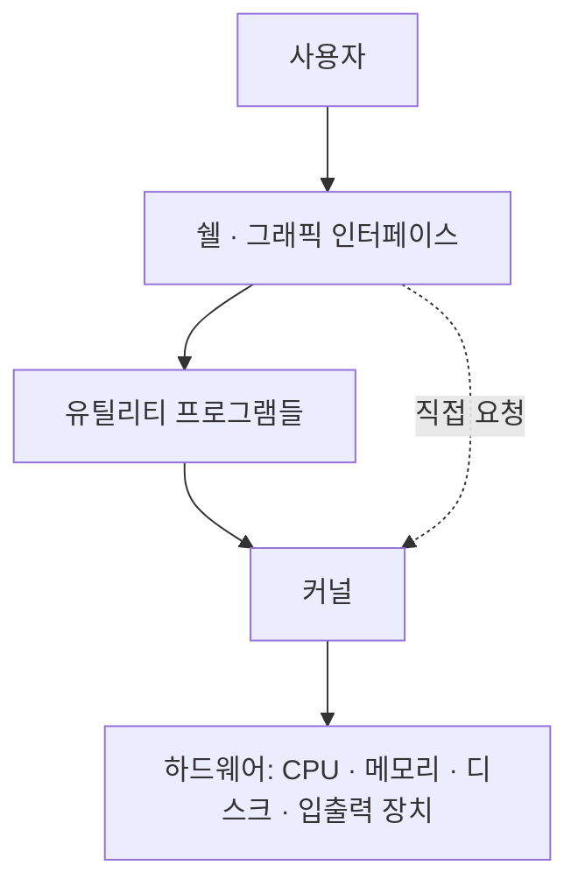
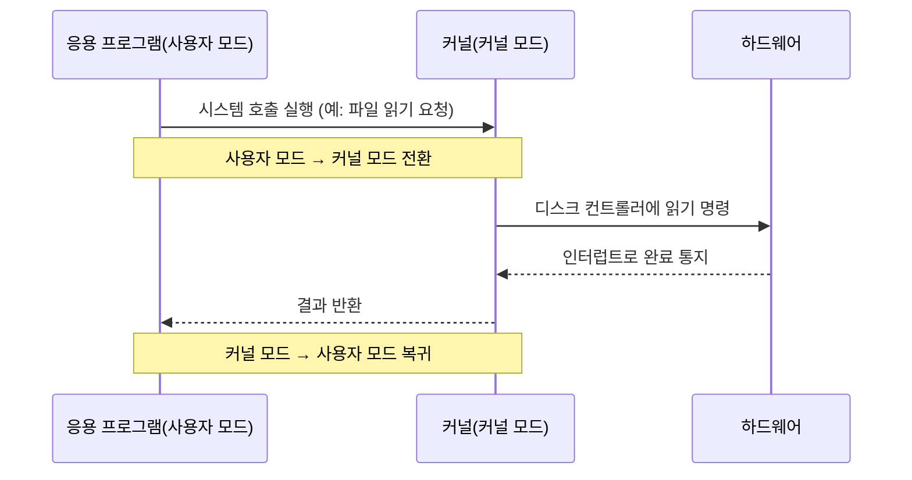

## 왜 운영체제 용어부터 정리하는가

독학사 2단계 운영체제 교재를 펼치면 첫 장부터 "커널(kernel)", "시스템 호출(system call)", "인터럽트(interrupt)", "다중프로그래밍" 같은 말이 아무 설명 없이 쏟아집니다. 이 과목은 1단계 교양 수준의 컴퓨터 사용 경험은 있다고 전제하지만, 컴퓨터공학 전공 수업(프로세스·메모리 계층·인터럽트를 다루는 컴퓨터구조 수업)은 듣지 않았다고 가정하고 설계되었습니다.

## 1. 운영체제란 무엇을 위해 존재하는가

**운영체제**(OS, Operating System)는 컴퓨터의 하드웨어(hardware, 실제 전자 회로와 기계 장치)와 그 위에서 돌아가는 응용 프로그램(application program) 사이에 끼어 앉아, 하드웨어 자원을 관리하고 응용 프로그램에게 편리한 실행 환경을 제공하는 소프트웨어입니다. 여기서 "자원(resource)"은 CPU(중앙처리장치, Central Processing Unit), 메모리(memory, 실행 중인 데이터를 담아 두는 공간), 디스크 같은 저장장치, 키보드·모니터 같은 입출력 장치를 통틀어 부르는 말입니다.

운영체제가 왜 필요한지는 "운영체제가 없다면 무슨 일이 벌어지는가"로 생각하면 명확해집니다. 컴퓨터 한 대에서 워드프로세서와 웹 브라우저를 동시에 켜 놓았다고 해 봅시다.

운영체제의 역할을 시험에서 자주 쓰는 표현으로 정리하면 다음 네 가지로 묶입니다.

| 역할 | 하는 일 | 관련 편 |
|------|---------|---------|
| 자원 관리자(resource manager) | CPU·메모리·디스크·입출력 장치를 누가 언제 얼마나 쓸지 배분 | 06–19편 전체 |
| 프로세스 관리 | 실행 중인 프로그램(프로세스)의 생성·상태 전이·종료를 관리 | 03, 06편 |
| 사용자 편의 제공 | 파일 시스템, 명령어 해석기(쉘) 등으로 사람이 쓰기 쉬운 인터페이스 제공 | 16, 17편 |
| 보호와 중재 | 프로그램끼리 서로의 메모리·자원을 침범하지 못하게 막고, 여러 사용자를 구분 | 20편 |

이 중 "자원 관리자"와 "프로세스 관리"가 독학사 2단계 출제 비중의 대부분을 차지합니다. 이 과목의 나머지 20개 편은 결국 이 두 역할을 CPU 관점(스케줄링), 메모리 관점(페이징·가상메모리), 저장장치 관점(파일 시스템·디스크 스케줄링)으로 하나씩 풀어 쓴 것이라고 생각하면 전체 그림이 잡힙니다.

## 2. 커널, 쉘, 유틸리티 — 운영체제의 세 층

"운영체제"라는 말을 들으면 흔히 윈도우(Windows)나 리눅스(Linux) 같은 하나의 프로그램을 떠올리기 쉽지만, 시험에서는 운영체제를 역할이 다른 세 개의 층으로 나눠서 묻습니다.

```mermaid
graph TD
  U[사용자] --> SH[쉘 · 그래픽 인터페이스]
  SH --> UT[유틸리티 프로그램들]
  UT --> K[커널]
  SH -.직접 요청.-> K
  K --> HW[하드웨어: CPU · 메모리 · 디스크 · 입출력 장치]
```

- **커널**(kernel, 알맹이): 운영체제의 가장 안쪽에서 하드웨어를 직접 제어하는 핵심 부분입니다. 프로세스 스케줄링, 메모리 할당, 파일 입출력, 장치 제어처럼 앞서 말한 "자원 관리자" 역할을 실제로 수행하는 코드가 커널입니다. 커널은 컴퓨터가 켜져 있는 동안 메모리에 항상 올라가 있으며, 사용자가 직접 눈으로 보거나 실행 파일처럼 클릭해서 켤 수 없습니다.
- **쉘**(shell, 껍데기): 사용자의 명령을 받아 커널에 전달하고 그 결과를 다시 보여 주는 창구입니다. 명령어를 타이핑하는 텍스트 창(명령줄 인터페이스)일 수도 있고, 아이콘을 클릭하는 그래픽 인터페이스(GUI, Graphical User Interface)일 수도 있습니다. 이름 그대로 커널을 감싸는 "껍데기"이며, 커널과 달리 쉘은 사용자가 다른 프로그램으로 바꿔 쓸 수도 있습니다.
- **유틸리티**(utility, 도구 프로그램): 파일 복사, 압축, 계산기처럼 특정 작업 하나를 해결해 주는 보조 프로그램입니다. 커널의 도움(시스템 호출)을 받아 동작하지만, 커널 자체는 아닙니다.

**자주 틀리는 점**: "운영체제 = 커널"이라고 단순화해서 외우면 "쉘을 바꾸면 운영체제가 바뀐 것이다" 같은 오답 보기에 걸립니다. 리눅스에서 bash를 zsh로 바꿔도 커널은 그대로이므로 운영체제의 핵심은 바뀌지 않은 것입니다.

이 세 층 중 커널 안쪽의 구체적인 구성 방식(모놀리식·마이크로커널·계층형)은 05편에서 비교표로 자세히 다룹니다. 여기서는 "커널 = 자원을 직접 관리하는 핵심부, 쉘 = 사용자 창구, 유틸리티 = 보조 도구"라는 3층 구분만 확실히 잡아 두면 됩니다.

## 3. 사용자 모드와 커널 모드 — 왜 응용 프로그램은 하드웨어를 직접 못 만지는가

만약 워드프로세서 같은 일반 응용 프로그램이 디스크 컨트롤러나 메모리 관리 회로를 아무 제한 없이 직접 건드릴 수 있다면 어떤 일이 벌어질까요? 프로그램에 버그가 하나만 있어도 다른 프로그램이 쓰고 있는 메모리를 실수로 지워 버리거나, 디스크에 저장된 다른 사용자의 파일을 훼손할 수 있습니다.

- **사용자 모드**(user mode): 응용 프로그램이 실행되는 모드입니다. 이 모드에서는 CPU가 메모리 접근 범위, 입출력 장치 제어 같은 "위험한" 명령을 실행하지 못하도록 제한합니다.
- **커널 모드**(kernel mode, 특권 모드라고도 함): 운영체제(커널)가 실행되는 모드입니다. 이 모드에서는 하드웨어 자원에 제한 없이 접근할 수 있습니다.

일반 응용 프로그램이 파일을 읽거나 화면에 글자를 출력하는 등 하드웨어 자원이 필요한 작업을 하려면, 직접 하드웨어를 만지는 대신 커널에게 "이 작업을 대신 해 달라"고 부탁해야 합니다. 이 부탁의 통로가 바로 **시스템 호출**(system call)입니다.

```mermaid
sequenceDiagram
  participant App as 응용 프로그램(사용자 모드)
  participant Kernel as 커널(커널 모드)
  participant HW as 하드웨어

  App->>Kernel: 시스템 호출 실행 (예: 파일 읽기 요청)
  Note over App,Kernel: 사용자 모드 → 커널 모드 전환
  Kernel->>HW: 디스크 컨트롤러에 읽기 명령
  HW-->>Kernel: 인터럽트로 완료 통지
  Kernel-->>App: 결과 반환
  Note over App,Kernel: 커널 모드 → 사용자 모드 복귀
```

**시스템 호출**은 응용 프로그램이 커널의 기능을 빌려 쓰기 위한 정해진 "요청 창구"입니다. 시스템 호출이 발생하면 CPU는 사용자 모드에서 커널 모드로 전환되고, 커널이 요청받은 작업을 대신 처리한 뒤 다시 사용자 모드로 돌아와 응용 프로그램에게 결과를 넘겨줍니다.

**자주 틀리는 점**: "시스템 호출은 사용자 프로그램이 직접 하드웨어를 제어하는 방법이다"라는 문장은 정반대로 틀렸습니다. 시스템 호출의 핵심은 "직접 제어하지 못하게 막으면서도 필요한 기능은 쓸 수 있게 해 주는 우회로"라는 점입니다.

## 4. 인터럽트 — 하드웨어가 CPU에게 말을 거는 방법

CPU는 기본적으로 정해진 순서대로 명령어를 하나씩 실행하는 장치입니다. CPU가 이런 사건을 알아채는 방법이 **인터럽트**(interrupt, 끼어들기)입니다.

인터럽트가 발생하면 CPU는 지금 실행하던 작업을 잠시 멈추고, 그 사건을 처리하는 전용 코드(인터럽트 서비스 루틴, ISR)로 실행 흐름을 옮깁니다. 처리가 끝나면 멈췄던 지점으로 되돌아와 원래 하던 작업을 계속합니다. 인터럽트는 발생 원인에 따라 크게 두 가지로 나눕니다.

| 구분 | 발생 원인 | 예시 |
|------|-----------|------|
| 하드웨어 인터럽트 | CPU 바깥의 장치가 신호를 보냄 | 키보드 입력, 디스크 읽기 완료, 타이머 만료 |
| 소프트웨어 인터럽트(트랩, trap) | 실행 중인 프로그램 자신이 발생시킴 | 시스템 호출, 0으로 나누기 같은 예외 상황 |

앞서 본 시스템 호출도 사실은 "소프트웨어 인터럽트"의 한 종류입니다. 응용 프로그램이 시스템 호출 명령을 실행하면 CPU 입장에서는 "지금 실행 흐름을 커널 코드로 넘겨라"는 트랩이 걸린 것이고, 이 트랩 처리 과정에서 사용자 모드 → 커널 모드 전환이 함께 일어납니다.

**타이머 인터럽트**(timer interrupt)는 특히 중요합니다. 이 원리는 07~08편의 CPU 스케줄링에서 "선점형(preemptive) 스케줄링"의 핵심 근거로 다시 나옵니다.

## 5. 운영체제의 유형 — 발전 순서로 보는 비교

운영체제는 컴퓨터 자원이 얼마나 귀했는지, 사용자가 응답을 얼마나 빨리 받아야 했는지에 따라 여러 방식으로 발전해 왔습니다. 독학사 시험에서는 아래 네 유형의 특징과 차이를 정면으로 비교하는 문항이 자주 나옵니다.

| 유형 | 핵심 아이디어 | CPU 활용 방식 | 사용자 응답 | 대표 예시·상황 |
|------|---------------|----------------|-------------|----------------|
| 일괄 처리(batch processing) | 비슷한 작업을 모아 한꺼번에 처리 | 작업을 순서대로 하나씩 처리, 중간에 사람 개입 없음 | 즉시 응답 없음(작업 종료 후 결과 확인) | 은행 야간 정산, 급여 계산 |
| 다중 프로그래밍(multiprogramming) | 여러 작업을 메모리에 동시에 올려 두고 CPU 유휴 시간을 줄임 | 한 작업이 입출력 대기 중이면 다른 작업에 CPU 배정 | 즉시 응답을 목표로 하지 않음 | 일괄 처리의 효율을 높인 개선형 |
| 시분할(time-sharing) | CPU 시간을 아주 짧은 단위로 쪼개 여러 사용자·작업이 번갈아 사용 | 타이머 인터럽트로 일정 시간마다 강제로 다음 작업에 CPU 양보 | 사람이 느끼기에 즉시 응답(대화형) | 여러 사용자가 동시에 접속하는 서버, 개인용 컴퓨터의 다중 작업 |
| 실시간(real-time) | 정해진 시간(데드라인) 안에 반드시 처리를 끝내야 함 | 시간 제약을 최우선 기준으로 스케줄링 | 응답 속도 자체가 정답·오답을 가르는 기준 | 항공기 제어, 공장 자동화 설비, 심박 측정기 |
| 분산(distributed) | 물리적으로 떨어진 여러 컴퓨터가 네트워크로 연결되어 하나의 시스템처럼 동작 | 작업을 여러 대의 컴퓨터에 나눠 처리 | 네트워크를 통해 협력 | 클라우드 서버 군집, 여러 지점을 연결한 업무 시스템 |

이 표에서 시험이 특히 좋아하는 함정은 **다중 프로그래밍과 시분할을 같은 것으로 착각하는 것**입니다. 즉 시분할은 다중 프로그래밍의 개념을 바탕으로 하되, **타이머 기반의 강제 선점**이라는 조건이 하나 더 추가된 방식입니다.

또 하나 자주 나오는 함정은 **실시간 시스템의 "빠름"을 오해하는 것**입니다. 실시간 시스템은 무조건 빨리 처리하는 시스템이 아니라, "정해진 데드라인을 반드시 지키는" 시스템입니다.

## 6. 시험에서 자주 쓰는 용어 정리

아래 용어들은 이번 편에서 다루지 않았지만 뒤 편에서 설명 없이 등장하는 기본 용어입니다. 여기서 미리 뜻만 짚어 두고, 자세한 내용은 각 편에서 다룹니다.

| 용어 | 짧은 뜻 | 자세히 다루는 편 |
|------|---------|-------------------|
| 프로세스(process) | 실행 중인 프로그램의 인스턴스 | 03, 06편 |
| 스레드(thread) | 프로세스 내부의 더 작은 실행 흐름 단위 | 04, 09편 |
| PCB(Process Control Block) | 프로세스 정보를 담는 운영체제 내부 자료구조 | 03, 06편 |
| 스케줄링(scheduling) | 여러 프로세스 중 CPU를 누구에게 줄지 정하는 규칙 | 07, 08편 |
| 임계구역(critical section) | 동시에 여러 프로세스가 접근하면 문제가 생기는 코드 영역 | 04, 10편 |
| 교착상태(deadlock) | 여러 프로세스가 서로 자원을 기다리며 영원히 멈추는 상태 | 11편 |
| 가상메모리(virtual memory) | 실제 메모리보다 큰 주소 공간을 프로세스에 제공하는 기법 | 14편 |

## 핵심 정리

- 운영체제는 하드웨어와 응용 프로그램 사이에서 자원을 관리하고 편리한 실행 환경을 제공하는 소프트웨어다.
- 커널(핵심·자원 관리), 쉘(사용자 창구), 유틸리티(보조 도구)는 서로 다른 층이며, 쉘을 바꿔도 커널은 그대로다.
- 사용자 모드는 하드웨어 직접 접근이 제한된 모드, 커널 모드는 제한이 없는 모드이며, 시스템 호출이 그 경계를 넘는 통로다.
- 인터럽트는 CPU 바깥(하드웨어) 또는 프로그램 자신(소프트웨어, 트랩)이 CPU의 실행 흐름에 끼어드는 메커니즘이며, 시스템 호출은 소프트웨어 인터럽트의 한 종류다.
- 운영체제 유형은 일괄 처리 → 다중 프로그래밍 → 시분할 → 실시간 → 분산 순으로 발전했으며, 시분할과 다중 프로그래밍, 실시간과 "빠른 처리"를 혼동하지 않아야 한다.

## 마무리 복습

<Quiz
  questionNumber={1}
  question={"커널, 쉘, 유틸리티의 관계를 설명한 것으로 가장 적절한 것은?"}
  options={["쉘을 다른 프로그램으로 바꾸면 커널도 함께 바뀐다.","커널은 사용자가 필요할 때 실행 파일을 더블클릭해서 켜는 프로그램이다.","커널은 하드웨어를 직접 관리하고, 쉘은 사용자와 커널을 잇는 창구 역할을 한다.","유틸리티는 커널의 도움 없이 하드웨어를 직접 제어한다."]}
  correctAnswer={3}
  explanation={"커널은 자원 관리를 직접 담당하는 핵심부이고, 쉘은 사용자의 명령을 받아 커널에 전달하는 창구다. 쉘을 바꿔도 커널은 그대로이며, 유틸리티도 하드웨어 자원이 필요하면 결국 커널의 시스템 호출을 거쳐야 한다."}
/>

<Quiz
  questionNumber={2}
  question={"사용자 모드와 커널 모드에 대한 설명으로 옳지 않은 것은?"}
  options={["사용자 모드에서는 하드웨어 접근이 제한된다.","커널 모드에서는 하드웨어 자원에 제한 없이 접근할 수 있다.","시스템 호출은 사용자 모드에서 커널 모드로 전환되는 계기가 된다.","시스템 호출은 응용 프로그램이 하드웨어를 직접 제어하게 해 주는 방법이다."]}
  correctAnswer={4}
  explanation={"시스템 호출의 핵심은 응용 프로그램이 하드웨어를 직접 제어하지 못하도록 막으면서도, 필요한 기능을 커널에게 대신 부탁할 수 있게 해 주는 통로라는 점이다. 응용 프로그램이 직접 하드웨어를 제어하게 해 준다는 설명은 옳지 않다."}
/>

<Quiz
  questionNumber={3}
  question={"인터럽트에 대한 설명으로 가장 적절한 것은?"}
  options={["인터럽트는 하드웨어 장치가 신호를 보내는 경우로만 한정된다.","시스템 호출은 소프트웨어 인터럽트(트랩)의 한 종류로 볼 수 있다.","타이머 인터럽트는 사용자가 직접 눌러서 발생시키는 인터럽트다.","CPU는 인터럽트가 발생해도 실행 중이던 작업의 위치를 기억할 필요가 없다."]}
  correctAnswer={2}
  explanation={"시스템 호출은 프로그램 자신이 커널 기능을 요청하기 위해 스스로 거는 소프트웨어 인터럽트(트랩)의 대표적인 예다."}
/>

## 참고 자료

- [국가평생교육진흥원 독학학위제 - 과목별 평가영역](https://bdes.nile.or.kr/nile/study/nStudy2_1.do)
- [KOCW 운영체제 강의자료 - Introduction](http://contents.kocw.or.kr/KOCW/document/2013/kyungsung/yangheejae/os01.pdf)
