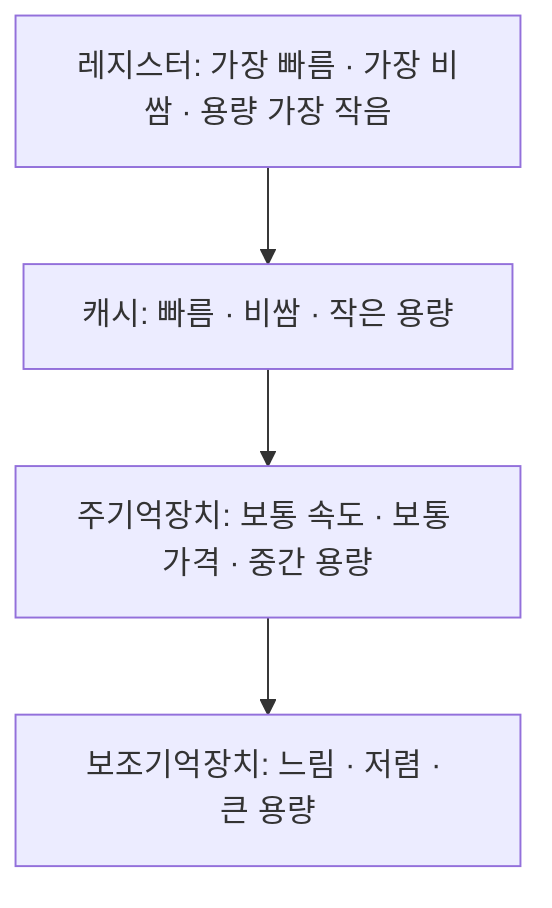

<Callout type="info">
  **이번 문서의 목표:** 이 파일을 다 읽으면 CPU가 명령어를 어떤 순서로 실행하는지, 레지스터·캐시·주기억장치·보조기억장치가 왜 계층을 이루는지, DMA가 왜 필요한지를 설명할 수 있고, 뒤에 나오는 스케줄링·메모리 관리 편의 그림을 하드웨어 동작으로 바로 연결해 이해할 수 있다.
</Callout>

## 왜 운영체제 과목에서 하드웨어를 배우는가

01편에서 운영체제는 "하드웨어와 응용 프로그램 사이에서 자원을 관리하는 소프트웨어"라고 정의했습니다. 그런데 정작 그 하드웨어가 어떻게 동작하는지 모르면, "CPU 스케줄링"이 왜 필요한지, "메모리 계층"이 왜 존재하는지, "인터럽트"가 실제로 CPU 안에서 무슨 일을 일으키는지를 암기 항목으로만 받아들이게 됩니다. 독학사 2단계는 컴퓨터공학 전공 수업을 전제하지 않으므로, 이 편에서 운영체제를 이해하는 데 꼭 필요한 최소한의 하드웨어 동작 원리를 짚고 넘어갑니다.

> **쉽게 말하면:** 이 편은 운영체제라는 "관리사무소"가 관리하는 "건물 설비(하드웨어)"의 배선도를 보는 시간입니다.

## 1. CPU와 명령어 실행 흐름

**CPU**(Central Processing Unit, 중앙처리장치)는 컴퓨터에서 명령어를 실제로 실행하는 장치입니다. CPU는 메모리에 저장된 명령어를 하나씩 가져와(fetch, 인출), 그 명령어가 무슨 뜻인지 해석하고(decode, 해독), 실제로 그 동작을 수행하는(execute, 실행) 과정을 끊임없이 반복합니다. 이 세 단계를 묶어 **명령어 사이클**(instruction cycle)이라고 부릅니다.

명령어 사이클이 계속 반복되려면 CPU는 "다음에 실행할 명령어가 메모리 어디에 있는지"를 항상 기억하고 있어야 합니다. 이 위치를 저장하는 것이 다음 절에서 다루는 프로그램 카운터입니다.

CPU 내부에는 산술·논리 연산을 수행하는 **ALU**(Arithmetic Logic Unit, 산술논리연산장치)와, 명령어 사이클의 순서를 통제하는 **제어장치**(control unit)가 있습니다. ALU가 실제 계산(더하기, 비교하기 등)을 하는 부품이라면, 제어장치는 "지금 인출 단계인지, 해독 단계인지, 실행 단계인지"를 판단해 각 부품에 신호를 보내는 지휘자 역할을 합니다.

> **쉽게 말하면:** CPU는 요리사입니다. 레시피(명령어)를 한 줄씩 읽고(인출), 그 줄이 무슨 재료를 얼마나 넣으라는 뜻인지 파악하고(해독), 실제로 손을 움직여 재료를 넣습니다(실행). 이 과정을 레시피 마지막 줄까지 반복합니다.

## 2. 레지스터 — CPU 안의 초고속 저장 공간

**레지스터**(register)는 CPU 내부에 있는 아주 작지만 매우 빠른 저장 공간입니다. CPU가 연산을 하려면 데이터를 어딘가에 잠깐씩 담아 두어야 하는데, 그 자리가 레지스터입니다. 운영체제와 관련해 특히 중요한 레지스터 몇 가지를 짚어 보면 다음과 같습니다.

| 레지스터 | 담는 내용 | 왜 중요한가 |
|----------|-----------|--------------|
| 프로그램 카운터(PC, Program Counter) | 다음에 실행할 명령어의 메모리 주소 | 문맥 교환(03편) 시 반드시 저장·복원해야 하는 핵심 값 |
| 명령어 레지스터(IR, Instruction Register) | 현재 해독·실행 중인 명령어 자체 | 명령어 사이클의 해독 단계에서 사용 |
| 스택 포인터(SP, Stack Pointer) | 현재 사용 중인 스택 영역의 맨 위 주소 | 함수 호출, 인터럽트 처리 시 임시 데이터 저장 위치 |
| 상태 레지스터(Status Register, 플래그 레지스터) | 연산 결과의 상태(0인지, 음수인지, 오버플로가 났는지 등)와 현재 모드(사용자/커널) | 조건 분기, 모드 전환 판단에 사용 |

이 중 **프로그램 카운터**는 03편의 문맥 교환(context switch)을 이해하는 데 결정적입니다. 운영체제가 실행 중인 프로세스를 잠시 멈추고 다른 프로세스로 CPU를 넘길 때, "멈춘 프로세스가 어디까지 실행했는지"를 잃어버리면 나중에 이어서 실행할 수 없습니다. 그래서 프로그램 카운터를 비롯한 레지스터 값들을 PCB(Process Control Block, 03편에서 다룸)에 고스란히 저장해 두었다가, 나중에 그 프로세스에게 다시 CPU가 배정되면 저장해 둔 값을 레지스터에 그대로 복원합니다.

> **쉽게 말하면:** 프로그램 카운터는 "책갈피"입니다. 책(프로그램)을 읽다가 다른 일(다른 프로세스 실행)로 잠깐 넘어가야 할 때, 어디까지 읽었는지 책갈피를 꽂아 두어야 나중에 이어서 읽을 수 있습니다.

## 3. 메모리 계층 — 왜 저장 장치는 한 종류가 아닌가

컴퓨터에는 레지스터, 캐시(cache), 주기억장치(main memory, 흔히 RAM), 보조기억장치(secondary storage, 하드디스크나 SSD) 등 여러 종류의 저장 장치가 함께 존재합니다. 이렇게 여러 종류를 함께 쓰는 이유는 "빠른 저장 장치일수록 비싸고 용량이 작다"는 물리적 제약 때문입니다. 만약 모든 데이터를 레지스터만큼 빠른 장치에 담으려면 컴퓨터 한 대 가격이 감당할 수 없을 만큼 비싸집니다. 반대로 모든 데이터를 하드디스크처럼 느린 장치에만 담으면 CPU가 매번 데이터를 기다리느라 성능이 크게 떨어집니다. 그래서 "자주 쓰는 데이터는 빠르고 비싼 곳에, 가끔 쓰는 데이터는 느리고 싼 곳에" 나누어 담는 계층 구조를 씁니다.

- **캐시**(cache): CPU와 주기억장치 사이에 위치하며, 주기억장치보다 훨씬 빠르지만 훨씬 작은 저장 공간입니다. CPU가 최근에 쓴 데이터나 곧 다시 쓸 가능성이 높은 데이터를 미리 담아 두어, 매번 느린 주기억장치까지 가지 않고도 빠르게 데이터를 가져올 수 있게 합니다.
- **주기억장치**(main memory): 실행 중인 프로그램의 명령어와 데이터가 올라가는 공간입니다. 흔히 RAM(Random Access Memory)이라고 부르며, 전원이 꺼지면 내용이 사라지는 휘발성(volatile) 저장 장치입니다.
- **보조기억장치**(secondary storage): 하드디스크(HDD), SSD처럼 전원이 꺼져도 내용이 유지되는 비휘발성(non-volatile) 저장 장치입니다. 용량은 크지만 CPU가 직접 연산에 쓰기에는 느립니다.

이 개념은 12~15편의 메모리 관리·가상메모리·페이지 교체를 이해하는 전제가 됩니다. 가상메모리가 "주기억장치보다 큰 프로그램을 어떻게 실행하는가"를 다루는 기법이라는 것도, 결국 "주기억장치는 빠르지만 작고, 보조기억장치는 느리지만 크다"는 이 계층 구조에서 출발합니다.

> **쉽게 말하면:** 메모리 계층은 책상 위 필기구함(레지스터), 책상 서랍(캐시), 방 안 책장(주기억장치), 지하 창고(보조기억장치)에 비유할 수 있습니다. 지금 당장 쓰는 펜은 필기구함에, 자주 보는 책은 책장에, 가끔 보는 자료는 창고에 두는 것이 효율적입니다.

## 4. 인터럽트를 하드웨어 관점에서 다시 보기

01편에서 인터럽트를 "CPU에게 끼어드는 신호"로 소개했습니다. 이번에는 그 신호가 하드웨어적으로 어떻게 전달되는지를 봅니다. CPU는 명령어 사이클의 매 실행 단계가 끝날 때마다 "지금 인터럽트가 걸려 있는가"를 확인하는 절차를 거칩니다. 인터럽트가 걸려 있으면 CPU는 다음과 같은 순서로 처리합니다.

1. 현재 실행 중이던 명령어까지는 마무리한다.
2. 지금까지의 실행 상태(프로그램 카운터를 포함한 레지스터 값)를 저장한다.
3. 인터럽트의 원인에 해당하는 처리 코드(인터럽트 서비스 루틴, ISR)로 실행 흐름을 옮긴다.
4. ISR 실행이 끝나면 저장해 둔 상태를 복원해 원래 실행하던 지점으로 되돌아간다.

이 절차는 앞서 본 문맥 교환과 매우 닮아 있습니다. 실제로 운영체제가 프로세스 간에 CPU를 넘기는 문맥 교환은, 타이머 인터럽트라는 하드웨어 신호를 계기로 커널이 개입해 일어나는 경우가 많습니다. 즉 인터럽트는 "CPU가 지금 하던 일을 멈추고 다른 코드로 옮겨 가는 하드웨어적 메커니즘"이고, 문맥 교환은 그 메커니즘을 이용해 운영체제가 "어느 프로세스에게 CPU를 줄지" 결정하는 소프트웨어적 절차입니다.

## 5. 입출력 장치와 DMA — CPU를 어떻게 자유롭게 하는가

키보드, 모니터, 디스크 같은 **입출력 장치**(I/O device)는 CPU나 메모리에 비해 속도가 훨씬 느립니다. 만약 디스크에서 큰 파일을 읽어 올 때 CPU가 한 바이트씩 직접 옮겨야 한다면, 그동안 CPU는 다른 어떤 일도 하지 못하고 느린 디스크 속도에 맞춰 기다려야 합니다. 이런 비효율을 줄이기 위한 방법들을 표로 비교합니다.

| 방식 | 동작 방식 | CPU 부담 |
|------|-----------|-----------|
| 프로그램된 입출력(programmed I/O) | CPU가 입출력 장치의 상태를 계속 확인(polling)하며 데이터를 직접 주고받음 | 매우 큼 — 입출력이 끝날 때까지 CPU가 다른 일을 못함 |
| 인터럽트 기반 입출력(interrupt-driven I/O) | CPU가 입출력 장치에 요청만 걸어 두고 다른 작업을 하다가, 장치가 끝나면 인터럽트로 알림 | 중간 — 대기 시간은 줄지만 데이터 전송 자체는 여전히 CPU가 관여 |
| DMA(Direct Memory Access) | DMA 컨트롤러라는 별도 하드웨어가 CPU 대신 메모리와 입출력 장치 사이의 데이터 전송을 直접 처리하고, 전송이 끝나면 CPU에 인터럽트로 알림 | 가장 작음 — CPU는 전송 시작만 지시하고 그 사이 다른 계산을 계속할 수 있음 |

**DMA**(Direct Memory Access, 직접 메모리 접근)는 CPU를 거치지 않고 입출력 장치와 주기억장치가 데이터를 직접 주고받게 해 주는 하드웨어입니다. CPU는 "이 디스크의 이 위치에서 이만큼의 데이터를 이 메모리 주소로 옮겨라"라고 DMA 컨트롤러에 지시만 내린 뒤, 실제 전송이 끝날 때까지 다른 프로세스의 계산을 계속 수행할 수 있습니다. 전송이 끝나면 DMA 컨트롤러가 인터럽트를 걸어 CPU에게 완료를 알립니다.

> **쉽게 말하면:** 프로그램된 입출력은 "택배가 올 때까지 문 앞에서 계속 지키고 서 있는 것", 인터럽트 기반 입출력은 "택배가 오면 초인종을 눌러 달라고 하고 그동안 다른 일을 하는 것", DMA는 "아예 관리실(DMA 컨트롤러)에 택배를 대신 받아 집 안까지 옮겨 달라고 맡기고, 다 옮겨진 후에만 알림을 받는 것"입니다.

18편의 "입출력 시스템과 인터럽트 처리"에서는 이 세 방식과 버퍼링·스풀링을 더 자세히 다룹니다. 여기서는 "왜 DMA가 CPU 부담을 가장 크게 줄이는가"라는 원리만 확실히 잡아 두면 충분합니다.

## 6. 지금까지의 개념이 뒤 편과 어떻게 연결되는가

| 이번 편의 개념 | 뒤에서 다시 쓰이는 곳 |
|----------------|------------------------|
| 명령어 사이클, 프로그램 카운터 | 03편 문맥 교환, PCB 구성 요소 |
| 상태 레지스터(모드 표시) | 01편 사용자/커널 모드, 20편 보호 |
| 메모리 계층(캐시-주기억장치-보조기억장치) | 12–15편 메모리 관리, 가상메모리, 페이지 교체 |
| 인터럽트 처리 절차 | 07–08편 선점형 스케줄링의 근거 |
| DMA, 입출력 방식 | 18편 입출력 시스템, 19편 디스크 스케줄링 |

## 핵심 정리

- CPU는 인출-해독-실행의 명령어 사이클을 반복하며, ALU는 계산을, 제어장치는 흐름 통제를 담당한다.
- 프로그램 카운터는 다음 실행할 명령어의 위치를 담는 레지스터로, 문맥 교환 시 반드시 저장·복원해야 하는 값이다.
- 메모리는 레지스터-캐시-주기억장치-보조기억장치 순으로 빠르고 비싼 것에서 느리고 저렴한 것으로 계층을 이룬다.
- 인터럽트는 현재 실행을 멈추고 상태를 저장한 뒤 처리 코드로 옮겨 가는 하드웨어 메커니즘이며, 타이머 인터럽트는 선점형 스케줄링의 근거가 된다.
- DMA는 CPU를 거치지 않고 메모리와 입출력 장치가 직접 데이터를 주고받게 해 CPU 부담을 크게 줄인다.

## 마무리 복습

<Quiz
  questionNumber={1}
  question="CPU의 명령어 사이클 순서로 옳은 것은?"
  options={['해독 → 인출 → 실행', '인출 → 해독 → 실행', '실행 → 인출 → 해독', '인출 → 실행 → 해독']}
  correctAnswer={2}
  explanation="CPU는 메모리에서 명령어를 가져오는 인출, 그 의미를 파악하는 해독, 실제로 수행하는 실행 순서를 반복한다."
  optionExplanations={['해독은 인출 이후에 이루어지므로 순서가 틀렸다.', '정답. 인출 → 해독 → 실행이 명령어 사이클의 순서다.', '실행은 인출·해독 이후에 이루어져야 하므로 순서가 틀렸다.', '실행은 해독까지 끝난 뒤에 이루어져야 하므로 순서가 틀렸다.']}
/>

<Quiz
  questionNumber={2}
  question="프로그램 카운터(PC)에 대한 설명으로 가장 적절한 것은?"
  options={['현재 연산 결과가 음수인지 여부를 저장한다.', '다음에 실행할 명령어의 메모리 주소를 저장한다.', '스택의 맨 위 주소를 저장한다.', '입출력 장치의 상태를 저장한다.']}
  correctAnswer={2}
  explanation="프로그램 카운터는 다음에 실행할 명령어의 메모리 주소를 담는 레지스터이며, 문맥 교환 시 반드시 저장·복원해야 하는 값이다."
  optionExplanations={['이는 상태 레지스터(플래그 레지스터)에 대한 설명이다.', '정답. 프로그램 카운터는 다음 실행할 명령어의 위치를 가리킨다.', '이는 스택 포인터에 대한 설명이다.', '이는 입출력 장치 상태 레지스터에 대한 설명으로 PC와 무관하다.']}
/>

<Quiz
  questionNumber={3}
  question="메모리 계층에 대한 설명으로 옳지 않은 것은?"
  options={['캐시는 주기억장치보다 빠르지만 용량은 더 작다.', '보조기억장치는 전원이 꺼져도 데이터가 유지되는 비휘발성 저장 장치다.', '레지스터는 계층 중 가장 느리지만 가장 큰 용량을 가진다.', '빠른 저장 장치일수록 일반적으로 더 비싸고 용량이 작다.']}
  correctAnswer={3}
  explanation="레지스터는 계층 중 가장 빠르지만 가장 작은 용량을 가지므로, 가장 느리고 가장 큰 용량이라는 설명은 옳지 않다."
  optionExplanations={['옳은 설명이다. 캐시는 주기억장치보다 빠르고 작다.', '옳은 설명이다. 보조기억장치는 비휘발성이다.', '옳지 않은 설명이므로 정답이다. 레지스터는 가장 빠르지만 용량은 가장 작다.', '옳은 설명이다. 속도와 가격·용량은 반비례 경향을 보인다.']}
/>

<Quiz
  questionNumber={4}
  question="DMA(Direct Memory Access)에 대한 설명으로 가장 적절한 것은?"
  options={['CPU가 입출력 장치의 상태를 계속 확인(polling)하며 데이터를 직접 옮기는 방식이다.', 'DMA 컨트롤러가 CPU를 거치지 않고 메모리와 입출력 장치 사이의 데이터 전송을 처리한다.', 'DMA를 사용하면 인터럽트가 전혀 발생하지 않는다.', 'DMA는 CPU 내부의 레지스터 중 하나를 가리키는 이름이다.']}
  correctAnswer={2}
  explanation="DMA는 CPU 대신 메모리와 입출력 장치 사이의 데이터 전송을 처리하는 별도의 하드웨어이며, 전송이 끝나면 인터럽트로 CPU에 완료를 알린다."
  optionExplanations={['이는 프로그램된 입출력(programmed I/O)에 대한 설명이다.', '정답. DMA 컨트롤러가 CPU 대신 데이터 전송을 담당해 CPU 부담을 줄인다.', 'DMA도 전송 완료 시점에는 인터럽트를 이용해 CPU에 알린다.', 'DMA는 레지스터가 아니라 별도의 하드웨어 컨트롤러다.']}
/>

<Quiz
  questionNumber={5}
  question="입출력 방식을 CPU 부담이 큰 순서대로 나열한 것으로 옳은 것은?"
  options={['DMA > 인터럽트 기반 입출력 > 프로그램된 입출력', '프로그램된 입출력 > 인터럽트 기반 입출력 > DMA', '인터럽트 기반 입출력 > DMA > 프로그램된 입출력', '프로그램된 입출력 > DMA > 인터럽트 기반 입출력']}
  correctAnswer={2}
  explanation="CPU가 직접 상태를 확인하며 데이터를 옮기는 프로그램된 입출력이 부담이 가장 크고, 인터럽트로 대기 시간을 줄인 인터럽트 기반 입출력이 그다음이며, 전송 자체를 별도 하드웨어에 맡기는 DMA가 부담이 가장 작다."
  optionExplanations={['순서가 반대다. DMA가 부담이 가장 작다.', '정답. 프로그램된 입출력이 가장 부담이 크고 DMA가 가장 작다.', '프로그램된 입출력이 가장 부담이 크므로 순서가 틀렸다.', '인터럽트 기반 입출력이 DMA보다 부담이 크므로 순서가 틀렸다.']}
/>

## 참고 자료

- [KOCW 운영체제 강의자료 - Introduction](http://contents.kocw.or.kr/KOCW/document/2013/kyungsung/yangheejae/os01.pdf)
- [운영체제 개론 KOCW 자료](http://contents.kocw.or.kr/KOCW/document/2016/cup/byunsangseon/1.pdf)
