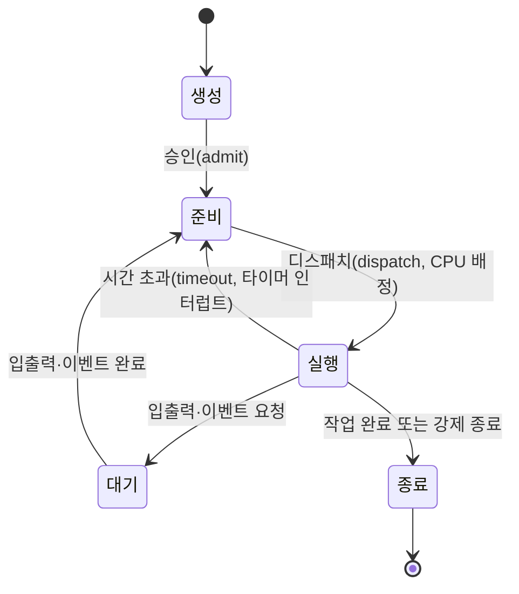
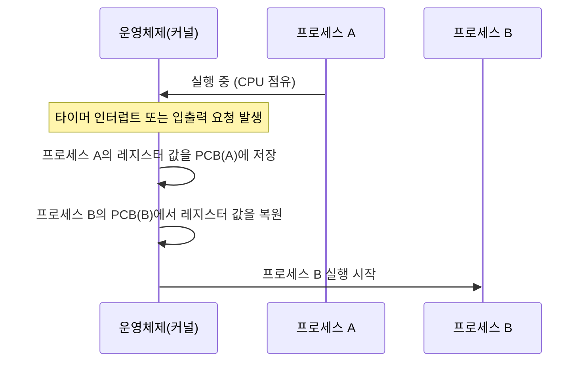
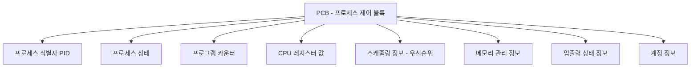

<Callout type="info">
  **이번 문서의 목표:** 이 파일을 다 읽으면 "프로그램"과 "프로세스"가 왜 다른 말인지 정면으로 구분할 수 있고, 프로세스가 생성부터 종료까지 어떤 상태를 거치는지 상태 전이도로 그릴 수 있으며, PCB와 문맥 교환이라는 용어로 그 전이가 실제로 어떻게 일어나는지 설명할 수 있다.
</Callout>

## 왜 "프로세스"라는 개념이 따로 필요한가

컴퓨터에 설치된 워드프로세서 아이콘을 두 번 클릭하면 창이 하나 뜹니다. 같은 아이콘을 한 번 더 클릭하면 또 다른 창이 뜹니다. 두 창은 같은 프로그램에서 시작했지만, 한쪽 창에 글자를 입력해도 다른 쪽 창에는 아무 영향이 없습니다. 이 둘을 구분하지 못하면 "왜 같은 프로그램인데 서로 다른 결과를 내는가"를 설명할 수 없습니다. 운영체제는 이 둘을 구분하기 위해 "프로그램"과 "프로세스"라는 서로 다른 용어를 씁니다.

> **쉽게 말하면:** 프로그램은 "요리 레시피"이고, 프로세스는 "그 레시피를 보고 지금 실제로 요리하고 있는 한 사람"입니다. 같은 레시피를 보고 두 사람이 각자 요리를 시작하면, 서로의 냄비(메모리 공간)를 침범하지 않는 별개의 요리가 두 개 만들어집니다.

## 1. 프로그램 vs 프로세스 — 정면 대조

**프로그램**(program)은 디스크에 파일 형태로 저장되어 있는, 아직 실행되지 않은 명령어와 데이터의 묶음입니다. 실행되기 전까지는 그저 저장 장치에 놓인 정적인(static) 데이터일 뿐입니다.

**프로세스**(process)는 프로그램이 실행되어 CPU와 메모리 자원을 할당받고, 실제로 동작하고 있는 상태를 말합니다. 프로세스는 흔히 "실행 중인 프로그램의 인스턴스(instance, 하나의 구체적인 실체)"라고 정의합니다. 같은 프로그램이라도 실행할 때마다 새로운 프로세스가 만들어지므로, 워드프로세서 아이콘을 두 번 클릭하면 프로그램은 하나지만 프로세스는 두 개가 생깁니다.

| 구분 | 프로그램(program) | 프로세스(process) |
|------|---------------------|----------------------|
| 상태 | 디스크에 저장된 정적인 파일 | CPU·메모리를 할당받아 실행 중인 동적인 실체 |
| 개수 | 하나의 실행 파일 | 같은 프로그램에서 여러 개 생성 가능 |
| 자원 소유 | 자원을 소유하지 않음 | CPU 시간, 메모리 공간, 열린 파일 등 자원을 소유 |
| 생명 주기 | 삭제하지 않는 한 계속 존재 | 생성되어 실행되다가 종료되면 사라짐 |
| 예시 | 하드디스크에 있는 word.exe 파일 | word.exe를 두 번 실행해 뜬 두 개의 창(작업) |

**자주 틀리는 점**: "프로그램을 실행하면 프로세스가 된다"는 방향은 맞지만, "프로세스를 저장하면 프로그램이 된다"는 표현은 성립하지 않습니다. 프로세스는 실행 중에 계속 변하는 상태(레지스터 값, 지금까지 처리한 데이터)를 가지고 있어서, 이를 그대로 디스크 파일로 되돌릴 수 없습니다. 또한 "프로세스는 프로그램과 완전히 같은 것을 가리키는 다른 이름일 뿐이다"라는 보기도 자주 오답으로 나오는데, 앞서 본 대로 하나의 프로그램에서 여러 프로세스가 나올 수 있다는 점에서 둘은 명백히 다른 개념입니다.

이 구분은 04편에서 "스레드"라는 개념을 배울 때 다시 확장됩니다. 미리 방향만 짚어 두면, 프로세스는 "운영체제가 자원을 배분하는 단위"이고 스레드는 "그 프로세스 안에서 실제로 실행 흐름이 나뉘는 단위"입니다. 자세한 비교는 04편에서 다룹니다.

## 2. 프로세스가 가지는 것 — 프로세스의 구성

프로세스가 프로그램과 다른 결정적인 이유는, 프로세스는 실행되기 위해 다음과 같은 자원을 실제로 소유하기 때문입니다.

- **코드 영역**(text segment): 실행할 명령어들이 담긴 부분. 여러 프로세스가 같은 프로그램에서 시작했다면 이 부분은 서로 같을 수 있습니다.
- **데이터 영역**(data segment): 전역 변수처럼 프로그램 실행 내내 유지되는 데이터가 담긴 부분.
- **힙**(heap): 실행 도중 필요에 따라 늘어나거나 줄어드는 동적 메모리 공간.
- **스택**(stack): 함수 호출 정보, 지역 변수처럼 일시적으로 쌓였다가 사라지는 데이터가 담긴 부분.
- **CPU 레지스터 값**: 02편에서 다룬 프로그램 카운터, 스택 포인터 등 지금 이 프로세스가 어디까지 실행했는지를 나타내는 값.

같은 프로그램에서 두 개의 프로세스를 만들면 코드 영역의 명령어 내용은 같아도, 데이터 영역·힙·스택·레지스터 값은 각 프로세스마다 독립적으로 존재합니다. 이 독립성 덕분에 한 창에 입력한 내용이 다른 창에 영향을 주지 않는 것입니다.

## 3. 프로세스 상태 — 프로세스는 항상 실행 중이 아니다

프로세스는 생성된 순간부터 종료될 때까지 계속 CPU를 붙잡고 실행되는 것이 아닙니다. CPU는 한 번에 하나의 프로세스만 실행할 수 있는데(한 개의 코어를 기준으로), 시스템에는 보통 수십 개 이상의 프로세스가 동시에 존재합니다. 그래서 각 프로세스는 자신의 상황에 따라 여러 **상태**(state)를 오갑니다. 독학사 시험에서 자주 묻는 다섯 가지 기본 상태는 다음과 같습니다.

| 상태 | 뜻 |
|------|-----|
| 생성(new) | 프로세스가 막 만들어지는 중이며 아직 실행 준비가 끝나지 않은 상태 |
| 준비(ready) | 실행할 준비는 끝났지만 CPU를 아직 배정받지 못해 대기 중인 상태 |
| 실행(running) | CPU를 배정받아 실제로 명령어를 처리하고 있는 상태 |
| 대기(waiting, block) | 입출력 완료나 특정 사건 발생을 기다리며 CPU를 쓸 수 없는 상태 |
| 종료(terminated) | 실행을 마치고 운영체제가 자원을 회수하는 상태 |

이 다섯 상태 사이의 이동을 그림으로 그리면 다음과 같습니다.

이 그림에서 특히 시험이 좋아하는 화살표는 두 개입니다.

1. **실행 → 준비**(시간 초과): 이 화살표는 07~08편에서 배우는 **선점형(preemptive) 스케줄링**의 근거입니다. 프로세스가 스스로 CPU를 내놓지 않아도, 타이머 인터럽트(01, 02편에서 다룸)가 걸리면 운영체제가 강제로 그 프로세스를 준비 상태로 되돌리고 다른 프로세스에게 CPU를 넘길 수 있습니다.
2. **실행 → 대기 → 준비**(입출력 요청과 완료): 이 화살표는 "실행 중이던 프로세스가 갑자기 대기 상태로 빠지는 이유는 무엇인가"를 묻는 문제의 핵심입니다. 정답은 언제나 "입출력 요청처럼 당장 CPU로는 처리할 수 없는 사건을 기다려야 하기 때문"입니다.

**자주 틀리는 점**: "대기 상태의 프로세스는 준비 상태를 거치지 않고 곧바로 실행 상태가 된다"는 문장은 틀렸습니다. 대기 중이던 프로세스는 기다리던 사건(예: 입출력 완료)이 끝나면 반드시 준비 상태로 먼저 돌아가 다시 CPU를 배정받을 순서를 기다려야 합니다. 대기에서 바로 실행으로 건너뛰는 화살표는 존재하지 않습니다.

> **쉽게 말하면:** 준비 상태는 "병원 대기실에 앉아 순서를 기다리는 것", 실행 상태는 "진료실에서 실제로 진료받는 것", 대기 상태는 "진료 중 검사 결과가 나올 때까지 따로 기다리는 것"입니다. 검사 결과가 나왔다고 곧바로 진료실로 들어가는 것이 아니라, 다시 대기실(준비 상태)에서 순서를 기다려야 합니다.

## 4. 문맥 교환 — 프로세스를 바꿔 끼우는 절차

한 프로세스가 실행되다가 다른 프로세스로 CPU가 넘어갈 때, 운영체제는 지금 실행 중이던 프로세스의 상태(프로그램 카운터를 포함한 모든 레지스터 값)를 어딘가에 저장해 두어야 나중에 다시 그 프로세스를 이어서 실행할 수 있습니다. 이렇게 실행 중이던 프로세스의 상태를 저장하고, 다음에 실행할 프로세스의 저장된 상태를 CPU에 복원하는 과정을 **문맥 교환**(context switch)이라고 합니다.

문맥 교환은 공짜로 일어나지 않습니다. 레지스터 값을 저장하고 복원하는 시간 자체는 실제로 유용한 계산을 하지 않는 **오버헤드**(overhead, 부가적으로 드는 비용)입니다. 그래서 문맥 교환이 너무 자주 일어나면(예: 타이머 인터럽트 간격을 지나치게 짧게 잡으면) 오히려 시스템 전체의 처리량이 떨어질 수 있습니다. 이 트레이드오프(trade-off, 하나를 얻으려면 다른 하나를 희생해야 하는 관계)는 07편의 스케줄링 성능 지표에서 다시 다룹니다.

## 5. PCB — 프로세스의 신분증

문맥 교환이 가능하려면, 각 프로세스의 상태 정보를 저장해 둘 장소가 있어야 합니다. 그 장소가 **PCB**(Process Control Block, 프로세스 제어 블록)입니다. 운영체제는 프로세스를 하나 만들 때마다 그 프로세스 전용 PCB를 함께 만들고, 프로세스가 종료될 때까지 이 PCB를 통해 프로세스를 관리합니다.

PCB에 담기는 주요 정보는 다음과 같습니다.

| PCB 구성 요소 | 담는 내용 |
|----------------|-----------|
| 프로세스 식별자(PID, Process ID) | 이 프로세스를 다른 프로세스와 구분하는 고유 번호 |
| 프로세스 상태 | 지금 생성·준비·실행·대기·종료 중 어느 상태인지 |
| 프로그램 카운터 | 다음에 실행할 명령어의 주소(문맥 교환 시 저장·복원의 핵심) |
| CPU 레지스터 값 | 스택 포인터, 범용 레지스터 등 문맥 교환 시 함께 저장·복원할 값들 |
| CPU 스케줄링 정보 | 우선순위, 스케줄링 큐에서의 위치 등 07–08편에서 쓰이는 정보 |
| 메모리 관리 정보 | 이 프로세스에게 할당된 메모리 영역의 위치와 범위(12–15편에서 다루는 페이지 테이블 등) |
| 입출력 상태 정보 | 이 프로세스가 열어 둔 파일 목록, 사용 중인 입출력 장치 목록 |
| 계정 정보 | 사용한 CPU 시간, 실행 시작 시각 등 |

> **쉽게 말하면:** PCB는 병원의 "환자 차트"입니다. 환자(프로세스)가 진료실을 나갔다가 다시 들어와도, 차트를 보면 어디까지 진료했는지, 어떤 검사를 예약했는지 이어서 알 수 있습니다. 운영체제도 PCB를 보고 "이 프로세스를 어디서부터 이어서 실행해야 하는가"를 판단합니다.

06편의 "프로세스 관리와 PCB의 모든 것"에서는 PCB를 이용한 프로세스 생성·종료 절차와 좀비·고아 프로세스 개념을 더 깊이 다룹니다. 여기서는 "PCB = 프로세스마다 하나씩 존재하는, 그 프로세스의 모든 상태 정보를 담은 자료구조"라는 감각만 확실히 잡아 두면 됩니다.

## 6. 명령어로 프로세스를 들여다보는 것은 다른 과목에서

지금까지는 운영체제 내부에서 프로세스가 어떻게 관리되는지를 다뤘습니다. 실제 리눅스(Linux) 시스템에서 `ps` 명령으로 지금 떠 있는 프로세스 목록을 확인하거나, `kill` 명령으로 특정 프로세스를 강제로 종료하는 것처럼 **명령어 수준**의 사용법은 이 과목의 출제 범위를 벗어납니다. 프로세스 개념과 부모-자식 관계, 좀비·고아 프로세스, `ps`·`kill`·`nice` 같은 명령어와 시그널 번호까지 다루는 자세한 내용은 이 사이트의 **리눅스마스터 2급 1차 13편**(프로세스의 개념)과 **14편**(프로세스 관리 명령어와 시그널)에서 확인할 수 있습니다. 독학사 2단계 운영체제 시험에서는 "프로세스가 상태를 어떻게 전이하는가", "PCB에 무엇이 담기는가" 같은 개념·원리 문제가 중심이라는 점만 기억해 두면 됩니다.

## 핵심 정리

- 프로그램은 디스크에 저장된 정적인 파일이고, 프로세스는 그 프로그램이 실행되어 자원을 할당받은 동적인 실체다. 하나의 프로그램에서 여러 프로세스가 생성될 수 있다.
- 프로세스는 생성 → 준비 → 실행 → 대기 → 종료의 상태를 거치며, 실행에서 준비로의 전이는 타이머 인터럽트(선점), 실행에서 대기로의 전이는 입출력 요청이 계기가 된다.
- 대기 상태에서는 곧바로 실행 상태로 갈 수 없고 반드시 준비 상태를 거쳐야 한다.
- 문맥 교환은 실행 중이던 프로세스의 레지스터 값을 저장하고 다음 프로세스의 값을 복원하는 절차이며, 그 자체로 오버헤드(비용)를 발생시킨다.
- PCB는 프로세스마다 하나씩 존재하며 PID, 상태, 프로그램 카운터, 레지스터 값, 스케줄링·메모리·입출력·계정 정보를 담아 문맥 교환과 프로세스 관리의 기반이 된다.

## 마무리 복습

<Quiz
  questionNumber={1}
  question="프로그램과 프로세스의 차이에 대한 설명으로 가장 적절한 것은?"
  options={['프로그램과 프로세스는 같은 대상을 가리키는 다른 이름일 뿐이다.', '프로세스는 디스크에 저장된 정적인 파일이고, 프로그램은 실행 중인 동적인 실체다.', '하나의 프로그램을 두 번 실행하면 두 개의 프로세스가 생길 수 있다.', '프로세스를 저장 장치에 저장하면 그대로 프로그램이 된다.']}
  correctAnswer={3}
  explanation="프로그램은 디스크에 저장된 정적인 파일이고, 프로세스는 그 프로그램이 실행되어 자원을 할당받은 동적인 실체이므로, 같은 프로그램을 여러 번 실행하면 여러 개의 독립된 프로세스가 생길 수 있다."
  optionExplanations={['프로세스는 실행 중인 동적인 실체이고 프로그램은 정적인 파일이므로 두 용어는 서로 다른 대상을 가리킨다.', '정적인 파일과 동적인 실체의 설명이 서로 뒤바뀌었다.', '정답. 같은 프로그램에서 여러 개의 독립된 프로세스가 생성될 수 있다.', '프로세스는 실행 중 계속 변하는 상태를 가지고 있어 그대로 파일로 되돌릴 수 없다.']}
/>

<Quiz
  questionNumber={2}
  question="프로세스 상태 전이도에서 실행(running) 상태의 프로세스가 대기(waiting) 상태로 전이되는 계기로 가장 적절한 것은?"
  options={['타이머 인터럽트로 인한 시간 초과', '입출력 요청과 같이 당장 처리할 수 없는 사건이 발생', '운영체제의 디스패처가 CPU를 배정', '프로세스가 생성 직후 승인을 받음']}
  correctAnswer={2}
  explanation="실행 중이던 프로세스가 입출력 요청처럼 CPU만으로는 처리할 수 없는 사건을 기다려야 할 때 대기 상태로 전이된다."
  optionExplanations={['타이머 인터럽트로 인한 시간 초과는 실행에서 준비 상태로의 전이를 일으킨다.', '정답. 입출력 요청 등 사건 대기가 실행에서 대기로의 전이 계기다.', '디스패치는 준비에서 실행으로의 전이를 일으키는 절차다.', '승인은 생성에서 준비 상태로의 전이를 일으킨다.']}
/>

<Quiz
  questionNumber={3}
  question="프로세스 상태 전이에 대한 설명으로 옳지 않은 것은?"
  options={['대기 상태의 프로세스가 사건 완료 후 곧바로 실행 상태가 된다.', '준비 상태의 프로세스는 디스패치를 통해 실행 상태가 될 수 있다.', '실행 상태의 프로세스는 시간 초과로 다시 준비 상태가 될 수 있다.', '생성 상태의 프로세스는 승인을 거쳐 준비 상태가 된다.']}
  correctAnswer={1}
  explanation="대기 상태의 프로세스는 기다리던 사건이 끝나면 반드시 준비 상태를 거쳐야 하며, 곧바로 실행 상태로 전이되는 화살표는 존재하지 않는다."
  optionExplanations={['옳지 않은 설명이므로 정답이다. 대기 상태는 반드시 준비 상태를 거친 뒤에야 실행 상태가 될 수 있다.', '옳은 설명이다. 디스패치는 준비에서 실행으로의 전이다.', '옳은 설명이다. 시간 초과는 실행에서 준비로의 전이다.', '옳은 설명이다. 승인은 생성에서 준비로의 전이다.']}
/>

<Quiz
  questionNumber={4}
  question="문맥 교환(context switch)에 대한 설명으로 가장 적절한 것은?"
  options={['문맥 교환은 실행 시간이 전혀 걸리지 않는 순간적인 절차다.', '문맥 교환은 실행 중이던 프로세스의 레지스터 값을 저장하고 다음 프로세스의 값을 복원하는 절차다.', '문맥 교환은 프로세스가 종료될 때만 발생한다.', '문맥 교환이 자주 일어날수록 시스템 처리량이 항상 좋아진다.']}
  correctAnswer={2}
  explanation="문맥 교환은 실행 중이던 프로세스의 프로그램 카운터를 포함한 레지스터 값을 PCB에 저장하고, 다음에 실행할 프로세스의 저장된 값을 복원하는 절차다."
  optionExplanations={['문맥 교환도 레지스터 저장·복원에 실제 시간이 걸리는 오버헤드를 발생시킨다.', '정답. 문맥 교환은 레지스터 값의 저장과 복원으로 이루어진다.', '문맥 교환은 시간 초과나 입출력 대기 등 다양한 상황에서 발생하며 종료 시에만 일어나는 것이 아니다.', '문맥 교환이 지나치게 자주 일어나면 오버헤드가 커져 오히려 처리량이 떨어질 수 있다.']}
/>

<Quiz
  questionNumber={5}
  question="PCB(Process Control Block)에 담기는 정보로 가장 거리가 먼 것은?"
  options={['프로세스 식별자(PID)', '프로그램 카운터 값', '이 프로세스가 실행되고 있는 하드디스크의 총 용량', 'CPU 스케줄링 우선순위 정보']}
  correctAnswer={3}
  explanation="하드디스크의 총 용량은 시스템 전체의 하드웨어 사양이지 특정 프로세스의 상태 정보가 아니므로 PCB에 담기는 정보로 적절하지 않다."
  optionExplanations={['PID는 프로세스를 구분하는 고유 번호로 PCB에 담긴다.', '프로그램 카운터는 문맥 교환 시 저장·복원되는 핵심 값으로 PCB에 담긴다.', '정답. 디스크 총 용량은 프로세스 개별 정보가 아니라 시스템 하드웨어 사양이다.', '스케줄링 우선순위는 PCB에 담기는 스케줄링 정보다.']}
/>

## 참고 자료

- [KOCW 운영체제 강의자료 - Introduction](http://contents.kocw.or.kr/KOCW/document/2013/kyungsung/yangheejae/os01.pdf)
- [운영체제 개론 KOCW 자료](http://contents.kocw.or.kr/KOCW/document/2016/cup/byunsangseon/1.pdf)
