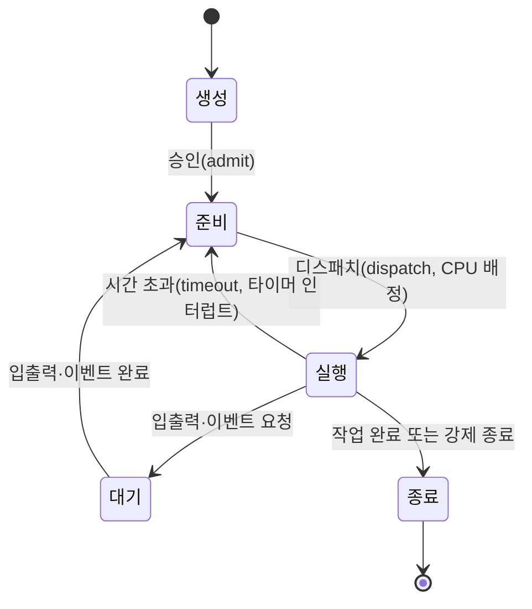
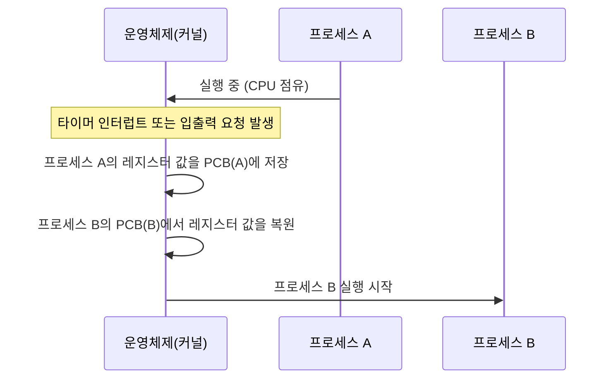
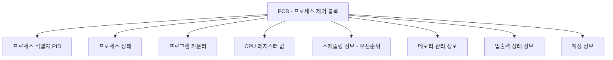

## 왜 "프로세스"라는 개념이 따로 필요한가

컴퓨터에 설치된 워드프로세서 아이콘을 두 번 클릭하면 창이 하나 뜹니다. 이 둘을 구분하지 못하면 "왜 같은 프로그램인데 서로 다른 결과를 내는가"를 설명할 수 없습니다.

## 1. 프로그램 vs 프로세스 — 정면 대조

**프로그램**(program)은 디스크에 파일 형태로 저장되어 있는, 아직 실행되지 않은 명령어와 데이터의 묶음입니다. 실행되기 전까지는 그저 저장 장치에 놓인 정적인(static) 데이터일 뿐입니다.

**프로세스**(process)는 프로그램이 실행되어 CPU와 메모리 자원을 할당받고, 실제로 동작하고 있는 상태를 말합니다. 프로세스는 흔히 "실행 중인 프로그램의 인스턴스(instance, 하나의 구체적인 실체)"라고 정의합니다.

| 구분 | 프로그램(program) | 프로세스(process) |
|------|---------------------|----------------------|
| 상태 | 디스크에 저장된 정적인 파일 | CPU·메모리를 할당받아 실행 중인 동적인 실체 |
| 개수 | 하나의 실행 파일 | 같은 프로그램에서 여러 개 생성 가능 |
| 자원 소유 | 자원을 소유하지 않음 | CPU 시간, 메모리 공간, 열린 파일 등 자원을 소유 |
| 생명 주기 | 삭제하지 않는 한 계속 존재 | 생성되어 실행되다가 종료되면 사라짐 |
| 예시 | 하드디스크에 있는 word.exe 파일 | word.exe를 두 번 실행해 뜬 두 개의 창(작업) |

**자주 틀리는 점**: "프로그램을 실행하면 프로세스가 된다"는 방향은 맞지만, "프로세스를 저장하면 프로그램이 된다"는 표현은 성립하지 않습니다. 프로세스는 실행 중에 계속 변하는 상태(레지스터 값, 지금까지 처리한 데이터)를 가지고 있어서, 이를 그대로 디스크 파일로 되돌릴 수 없습니다.

이 구분은 04편에서 "스레드"라는 개념을 배울 때 다시 확장됩니다. 미리 방향만 짚어 두면, 프로세스는 "운영체제가 자원을 배분하는 단위"이고 스레드는 "그 프로세스 안에서 실제로 실행 흐름이 나뉘는 단위"입니다. 자세한 비교는 04편에서 다룹니다.

## 2. 프로세스가 가지는 것 — 프로세스의 구성

프로세스가 프로그램과 다른 결정적인 이유는, 프로세스는 실행되기 위해 다음과 같은 자원을 실제로 소유하기 때문입니다.

- **코드 영역**(text segment): 실행할 명령어들이 담긴 부분. 여러 프로세스가 같은 프로그램에서 시작했다면 이 부분은 서로 같을 수 있습니다.
- **데이터 영역**(data segment): 전역 변수처럼 프로그램 실행 내내 유지되는 데이터가 담긴 부분.
- **힙**(heap): 실행 도중 필요에 따라 늘어나거나 줄어드는 동적 메모리 공간.
- **스택**(stack): 함수 호출 정보, 지역 변수처럼 일시적으로 쌓였다가 사라지는 데이터가 담긴 부분.
- **CPU 레지스터 값**: 02편에서 다룬 프로그램 카운터, 스택 포인터 등 지금 이 프로세스가 어디까지 실행했는지를 나타내는 값.

같은 프로그램에서 두 개의 프로세스를 만들면 코드 영역의 명령어 내용은 같아도, 데이터 영역·힙·스택·레지스터 값은 각 프로세스마다 독립적으로 존재합니다. 이 독립성 덕분에 한 창에 입력한 내용이 다른 창에 영향을 주지 않는 것입니다.

## 3. 프로세스 상태 — 프로세스는 항상 실행 중이 아니다

프로세스는 생성된 순간부터 종료될 때까지 계속 CPU를 붙잡고 실행되는 것이 아닙니다. 그래서 각 프로세스는 자신의 상황에 따라 여러 **상태**(state)를 오갑니다.

| 상태 | 뜻 |
|------|-----|
| 생성(new) | 프로세스가 막 만들어지는 중이며 아직 실행 준비가 끝나지 않은 상태 |
| 준비(ready) | 실행할 준비는 끝났지만 CPU를 아직 배정받지 못해 대기 중인 상태 |
| 실행(running) | CPU를 배정받아 실제로 명령어를 처리하고 있는 상태 |
| 대기(waiting, block) | 입출력 완료나 특정 사건 발생을 기다리며 CPU를 쓸 수 없는 상태 |
| 종료(terminated) | 실행을 마치고 운영체제가 자원을 회수하는 상태 |

이 다섯 상태 사이의 이동을 그림으로 그리면 다음과 같습니다.

```mermaid
stateDiagram-v2
  [*] --> 생성
  생성 --> 준비 : 승인(admit)
  준비 --> 실행 : 디스패치(dispatch, CPU 배정)
  실행 --> 준비 : 시간 초과(timeout, 타이머 인터럽트)
  실행 --> 대기 : 입출력·이벤트 요청
  대기 --> 준비 : 입출력·이벤트 완료
  실행 --> 종료 : 작업 완료 또는 강제 종료
  종료 --> [*]
```

이 그림에서 특히 시험이 좋아하는 화살표는 두 개입니다.

1. **실행 → 준비**(시간 초과): 이 화살표는 07~08편에서 배우는 **선점형(preemptive) 스케줄링**의 근거입니다. 프로세스가 스스로 CPU를 내놓지 않아도, 타이머 인터럽트(01, 02편에서 다룸)가 걸리면 운영체제가 강제로 그 프로세스를 준비 상태로 되돌리고 다른 프로세스에게 CPU를 넘길 수 있습니다.
2. **실행 → 대기 → 준비**(입출력 요청과 완료): 이 화살표는 "실행 중이던 프로세스가 갑자기 대기 상태로 빠지는 이유는 무엇인가"를 묻는 문제의 핵심입니다. 정답은 언제나 "입출력 요청처럼 당장 CPU로는 처리할 수 없는 사건을 기다려야 하기 때문"입니다.

**자주 틀리는 점**: "대기 상태의 프로세스는 준비 상태를 거치지 않고 곧바로 실행 상태가 된다"는 문장은 틀렸습니다. 대기 중이던 프로세스는 기다리던 사건(예: 입출력 완료)이 끝나면 반드시 준비 상태로 먼저 돌아가 다시 CPU를 배정받을 순서를 기다려야 합니다.

## 4. 문맥 교환 — 프로세스를 바꿔 끼우는 절차

한 프로세스가 실행되다가 다른 프로세스로 CPU가 넘어갈 때, 운영체제는 지금 실행 중이던 프로세스의 상태(프로그램 카운터를 포함한 모든 레지스터 값)를 어딘가에 저장해 두어야 나중에 다시 그 프로세스를 이어서 실행할 수 있습니다. 이렇게 실행 중이던 프로세스의 상태를 저장하고, 다음에 실행할 프로세스의 저장된 상태를 CPU에 복원하는 과정을 **문맥 교환**(context switch)이라고 합니다.

```mermaid
sequenceDiagram
  participant OS as 운영체제(커널)
  participant P1 as 프로세스 A
  participant P2 as 프로세스 B

  P1->>OS: 실행 중 (CPU 점유)
  Note over OS: 타이머 인터럽트 또는 입출력 요청 발생
  OS->>OS: 프로세스 A의 레지스터 값을 PCB(A)에 저장
  OS->>OS: 프로세스 B의 PCB(B)에서 레지스터 값을 복원
  OS->>P2: 프로세스 B 실행 시작
```

문맥 교환은 공짜로 일어나지 않습니다. 레지스터 값을 저장하고 복원하는 시간 자체는 실제로 유용한 계산을 하지 않는 **오버헤드**(overhead, 부가적으로 드는 비용)입니다.

## 5. PCB — 프로세스의 신분증

문맥 교환이 가능하려면, 각 프로세스의 상태 정보를 저장해 둘 장소가 있어야 합니다. 그 장소가 **PCB**(Process Control Block, 프로세스 제어 블록)입니다.

PCB에 담기는 주요 정보는 다음과 같습니다.

| PCB 구성 요소 | 담는 내용 |
|----------------|-----------|
| 프로세스 식별자(PID, Process ID) | 이 프로세스를 다른 프로세스와 구분하는 고유 번호 |
| 프로세스 상태 | 지금 생성·준비·실행·대기·종료 중 어느 상태인지 |
| 프로그램 카운터 | 다음에 실행할 명령어의 주소(문맥 교환 시 저장·복원의 핵심) |
| CPU 레지스터 값 | 스택 포인터, 범용 레지스터 등 문맥 교환 시 함께 저장·복원할 값들 |
| CPU 스케줄링 정보 | 우선순위, 스케줄링 큐에서의 위치 등 07–08편에서 쓰이는 정보 |
| 메모리 관리 정보 | 이 프로세스에게 할당된 메모리 영역의 위치와 범위(12–15편에서 다루는 페이지 테이블 등) |
| 입출력 상태 정보 | 이 프로세스가 열어 둔 파일 목록, 사용 중인 입출력 장치 목록 |
| 계정 정보 | 사용한 CPU 시간, 실행 시작 시각 등 |

```mermaid
graph TD
  PCB[PCB - 프로세스 제어 블록] --> PID[프로세스 식별자 PID]
  PCB --> ST[프로세스 상태]
  PCB --> PC[프로그램 카운터]
  PCB --> REG[CPU 레지스터 값]
  PCB --> SCHED[스케줄링 정보 - 우선순위]
  PCB --> MEM[메모리 관리 정보]
  PCB --> IO[입출력 상태 정보]
  PCB --> ACC[계정 정보]
```

06편의 "프로세스 관리와 PCB의 모든 것"에서는 PCB를 이용한 프로세스 생성·종료 절차와 좀비·고아 프로세스 개념을 더 깊이 다룹니다. 여기서는 "PCB = 프로세스마다 하나씩 존재하는, 그 프로세스의 모든 상태 정보를 담은 자료구조"라는 감각만 확실히 잡아 두면 됩니다.

## 6. 명령어로 프로세스를 들여다보는 것은 다른 과목에서

지금까지는 운영체제 내부에서 프로세스가 어떻게 관리되는지를 다뤘습니다. 실제 리눅스(Linux) 시스템에서 `ps` 명령으로 지금 떠 있는 프로세스 목록을 확인하거나, `kill` 명령으로 특정 프로세스를 강제로 종료하는 것처럼 **명령어 수준**의 사용법은 이 과목의 출제 범위를 벗어납니다.

## 핵심 정리

- 프로그램은 디스크에 저장된 정적인 파일이고, 프로세스는 그 프로그램이 실행되어 자원을 할당받은 동적인 실체다. 하나의 프로그램에서 여러 프로세스가 생성될 수 있다.
- 프로세스는 생성 → 준비 → 실행 → 대기 → 종료의 상태를 거치며, 실행에서 준비로의 전이는 타이머 인터럽트(선점), 실행에서 대기로의 전이는 입출력 요청이 계기가 된다.
- 대기 상태에서는 곧바로 실행 상태로 갈 수 없고 반드시 준비 상태를 거쳐야 한다.
- 문맥 교환은 실행 중이던 프로세스의 레지스터 값을 저장하고 다음 프로세스의 값을 복원하는 절차이며, 그 자체로 오버헤드(비용)를 발생시킨다.
- PCB는 프로세스마다 하나씩 존재하며 PID, 상태, 프로그램 카운터, 레지스터 값, 스케줄링·메모리·입출력·계정 정보를 담아 문맥 교환과 프로세스 관리의 기반이 된다.

## 마무리 복습

<Quiz
  questionNumber={1}
  question={"프로그램과 프로세스의 차이에 대한 설명으로 가장 적절한 것은?"}
  options={["프로그램과 프로세스는 같은 대상을 가리키는 다른 이름일 뿐이다.","프로세스는 디스크에 저장된 정적인 파일이고, 프로그램은 실행 중인 동적인 실체다.","하나의 프로그램을 두 번 실행하면 두 개의 프로세스가 생길 수 있다.","프로세스를 저장 장치에 저장하면 그대로 프로그램이 된다."]}
  correctAnswer={3}
  explanation={"프로그램은 디스크에 저장된 정적인 파일이고, 프로세스는 그 프로그램이 실행되어 자원을 할당받은 동적인 실체이므로, 같은 프로그램을 여러 번 실행하면 여러 개의 독립된 프로세스가 생길 수 있다."}
/>

<Quiz
  questionNumber={2}
  question={"프로세스 상태 전이도에서 실행(running) 상태의 프로세스가 대기(waiting) 상태로 전이되는 계기로 가장 적절한 것은?"}
  options={["타이머 인터럽트로 인한 시간 초과","입출력 요청과 같이 당장 처리할 수 없는 사건이 발생","운영체제의 디스패처가 CPU를 배정","프로세스가 생성 직후 승인을 받음"]}
  correctAnswer={2}
  explanation={"실행 중이던 프로세스가 입출력 요청처럼 CPU만으로는 처리할 수 없는 사건을 기다려야 할 때 대기 상태로 전이된다."}
/>

<Quiz
  questionNumber={3}
  question={"프로세스 상태 전이에 대한 설명으로 옳지 않은 것은?"}
  options={["대기 상태의 프로세스가 사건 완료 후 곧바로 실행 상태가 된다.","준비 상태의 프로세스는 디스패치를 통해 실행 상태가 될 수 있다.","실행 상태의 프로세스는 시간 초과로 다시 준비 상태가 될 수 있다.","생성 상태의 프로세스는 승인을 거쳐 준비 상태가 된다."]}
  correctAnswer={1}
  explanation={"대기 상태의 프로세스는 기다리던 사건이 끝나면 반드시 준비 상태를 거쳐야 하며, 곧바로 실행 상태로 전이되는 화살표는 존재하지 않는다."}
/>

## 참고 자료

- [KOCW 운영체제 강의자료 - Introduction](http://contents.kocw.or.kr/KOCW/document/2013/kyungsung/yangheejae/os01.pdf)
- [운영체제 개론 KOCW 자료](http://contents.kocw.or.kr/KOCW/document/2016/cup/byunsangseon/1.pdf)
