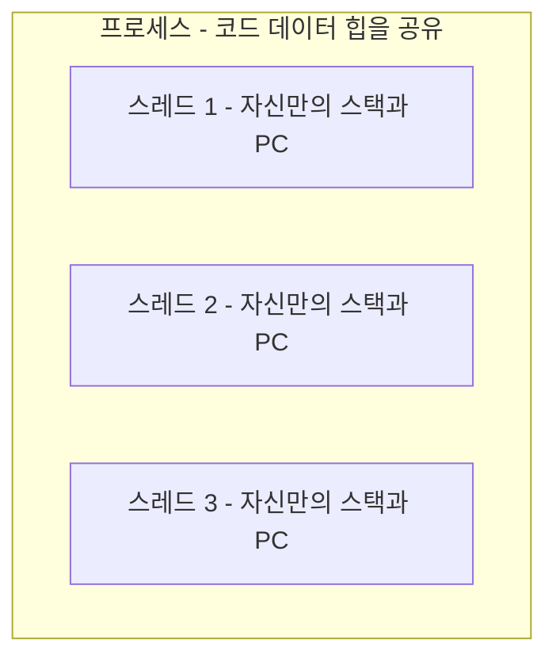
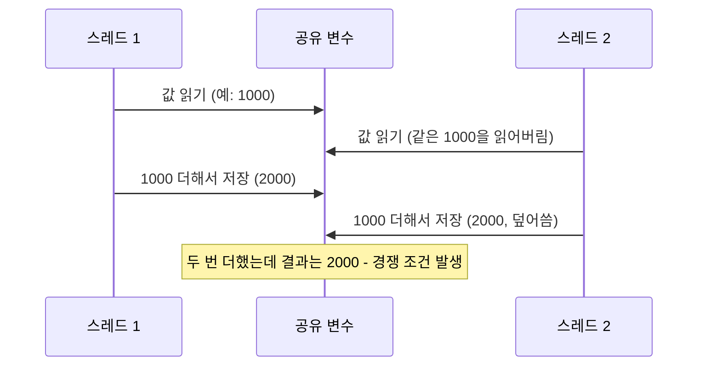

<Callout type="info">
  **이번 문서의 목표:** 이 파일을 다 읽으면 프로세스·프로그램·스레드 세 개념을 정확히 구분해 설명할 수 있고, 사용자 스레드와 커널 스레드의 차이를 말할 수 있으며, 임계구역·세마포어·모니터라는 용어와 기호를 뒤 편에서 처음 보지 않고 읽어낼 수 있다.
</Callout>

## 왜 프로세스만으로는 부족한가

03편에서 프로세스는 코드·데이터·힙·스택과 레지스터 값을 독립적으로 가진 실행 단위라고 배웠습니다. 그런데 워드프로세서 하나가 "화면에 글자를 그리는 일"과 "맞춤법을 실시간으로 검사하는 일"을 동시에 하고 있다고 해 봅시다. 이 두 작업을 완전히 별개의 프로세스로 만들면, 프로세스마다 메모리 공간이 독립적이라서 "지금 화면에 어떤 문서가 열려 있는지" 같은 정보를 서로 공유하기가 번거롭고 느립니다. 이런 상황을 위해 운영체제는 프로세스보다 더 작은 실행 단위인 **스레드**(thread)를 제공합니다.

> **쉽게 말하면:** 프로세스가 "직원 한 명에게 배정된 사무실 한 칸(독립된 자원)"이라면, 스레드는 "그 사무실 안에서 동시에 여러 일을 처리하는 직원의 여러 손"입니다. 손(스레드)들은 같은 사무실(프로세스의 메모리 공간)을 공유하기 때문에 서로 자료를 주고받기 쉽습니다.

## 1. 스레드란 무엇인가

**스레드**(thread, 실 가닥)는 프로세스 내부에서 실제로 명령어를 실행해 나가는 흐름의 단위입니다. 하나의 프로세스는 하나 이상의 스레드를 가질 수 있으며, 같은 프로세스에 속한 스레드들은 그 프로세스의 코드 영역·데이터 영역·힙을 함께 공유합니다. 반면 각 스레드는 자신만의 **스택**과 **레지스터 값**(특히 프로그램 카운터)은 따로 가집니다. 스레드마다 "지금 어디를 실행하고 있는지"는 달라야 하므로, 이 부분만은 스레드별로 독립적이어야 하기 때문입니다.

이 그림에서 스레드 1, 2, 3은 같은 프로세스 영역 안에 함께 있습니다. 즉 세 스레드는 같은 데이터(예: 지금 열려 있는 문서 내용)를 동시에 읽고 쓸 수 있습니다. 이 "공유"라는 성질이 스레드의 가장 큰 장점이자, 뒤에서 다룰 문제(경쟁 조건)의 근원이기도 합니다.

## 2. 프로세스 vs 스레드 — 왜 스레드를 쓰는가

| 구분 | 프로세스(process) | 스레드(thread) |
|------|---------------------|-------------------|
| 메모리 공간 | 프로세스마다 독립된 코드·데이터·힙·스택 | 같은 프로세스 안의 스레드는 코드·데이터·힙을 공유, 스택만 독립 |
| 생성 비용 | 새로운 메모리 공간을 전부 마련해야 해서 비교적 무거움 | 스택과 레지스터만 새로 준비하면 되어 비교적 가벼움 |
| 문맥 교환 비용 | 메모리 관리 정보까지 모두 교체해야 해서 비교적 큼 | 같은 프로세스 내 스레드 간 교환은 상대적으로 작음 |
| 자원 소유 | 자원(메모리, 열린 파일 등)을 직접 소유하는 단위 | 자원은 소속된 프로세스의 것을 공유, 소유 주체가 아님 |
| 데이터 공유 | 다른 프로세스와 자료를 나누려면 IPC(09편에서 다룸)가 필요 | 같은 프로세스 내 스레드끼리는 전역 변수 등을 직접 공유 |
| 하나가 멎으면 | 다른 프로세스에는 영향이 없음(독립적) | 같은 프로세스의 다른 스레드에도 영향을 줄 수 있음 |

**자주 틀리는 점**: "스레드는 프로세스와 완전히 독립된 자원을 가진다"는 설명은 틀렸습니다. 스레드는 스택과 레지스터 값만 독립적일 뿐, 코드·데이터·힙은 소속 프로세스의 것을 그대로 공유합니다. 또한 "여러 스레드를 쓰면 프로세스를 여러 개 만드는 것보다 항상 무조건 안전하다"는 것도 오해입니다. 자원을 공유한다는 것은 편리함과 동시에 여러 스레드가 같은 데이터를 동시에 건드릴 위험(경쟁 조건)을 함께 가져온다는 뜻이기 때문입니다. 이 위험은 이번 편의 뒷부분과 10편에서 자세히 다룹니다.

이제 03편의 프로그램-프로세스 구분과 이번 절의 프로세스-스레드 구분을 하나로 이으면, 독학사 시험이 좋아하는 3단 비교가 완성됩니다.

| 구분 | 프로그램 | 프로세스 | 스레드 |
|------|----------|-----------|--------|
| 정체 | 디스크에 저장된 정적인 파일 | 실행 중인 프로그램의 동적인 인스턴스 | 프로세스 내부의 실행 흐름 단위 |
| 자원 | 자원을 소유하지 않음 | 코드·데이터·힙·스택·레지스터를 독립적으로 소유 | 스택·레지스터만 독립, 나머지는 소속 프로세스와 공유 |
| 개수 관계 | 실행 시마다 새 프로세스로 이어짐 | 하나의 프로그램에서 여러 개 생성 가능 | 하나의 프로세스 안에 여러 개 존재 가능 |
| 비유 | 레시피 | 레시피를 보고 요리하는 한 사람 | 그 사람의 여러 손(동시에 여러 동작 수행) |

## 3. 사용자 스레드와 커널 스레드 — 누가 스레드를 관리하는가

스레드를 누가 만들고 스케줄링하는지에 따라 두 가지로 나눕니다.

- **사용자 스레드**(user-level thread): 커널의 개입 없이, 사용자 영역의 스레드 라이브러리가 직접 스레드를 만들고 관리합니다. 스레드 전환이 커널 모드로 넘어가지 않고 사용자 모드 안에서 이루어지므로 생성과 전환이 빠릅니다. 다만 커널은 이 스레드들의 존재를 모르기 때문에, 그중 하나가 입출력 요청으로 대기 상태에 들어가면 커널 입장에서는 "프로세스 전체"가 대기 상태에 들어간 것으로 보여 같은 프로세스의 다른 사용자 스레드까지 함께 멈출 수 있습니다.
- **커널 스레드**(kernel-level thread): 커널이 직접 스레드의 존재를 인식하고 스케줄링합니다. 스레드 하나가 대기 상태에 들어가도 커널이 같은 프로세스의 다른 스레드에게 CPU를 넘길 수 있습니다. 다만 스레드를 만들거나 전환할 때마다 커널 모드로 전환해야 하므로 사용자 스레드보다 상대적으로 비용이 큽니다.

| 구분 | 사용자 스레드 | 커널 스레드 |
|------|----------------|--------------|
| 관리 주체 | 사용자 영역의 라이브러리 | 운영체제 커널 |
| 생성·전환 속도 | 빠름(커널 모드 전환 불필요) | 상대적으로 느림(커널 모드 전환 필요) |
| 한 스레드의 대기가 전체에 주는 영향 | 같은 프로세스의 다른 스레드까지 대기 상태로 보일 수 있음 | 다른 스레드는 영향받지 않고 계속 실행 가능 |
| 커널의 인식 여부 | 커널은 스레드 단위를 모르고 프로세스 단위로만 인식 | 커널이 스레드 단위까지 직접 인식 |

> **쉽게 말하면:** 사용자 스레드는 "한 사무실 안에서 팀장(스레드 라이브러리)이 알아서 직원들 업무를 나누는 것"이고, 커널 스레드는 "회사 전체의 인사팀(커널)이 각 직원의 업무 배정까지 직접 관리하는 것"입니다. 팀장 선에서 끝나면 빠르지만, 팀장이 다루는 직원 한 명이 외부 미팅(입출력 대기)으로 자리를 비우면 인사팀은 그 사무실 전체가 비어 있는 줄 알 수 있습니다.

두 방식을 섞어서 쓰는 **다대다 모델**처럼 사용자 스레드 여러 개를 커널 스레드 여러 개에 적절히 대응시키는 방식도 있지만, 독학사 2단계에서는 위 두 기본 개념의 차이를 정확히 구분하는 것이 우선입니다. 스레드를 활용한 실제 통신·동시성 문제는 09편의 "스레드, IPC, 그리고 동시성의 구조"에서 이어서 다룹니다.

## 4. 임계구역 — 공유 자원을 둘러싼 위험 지대

스레드(또는 프로세스)가 같은 데이터를 공유한다는 것은, 여러 실행 흐름이 동시에 그 데이터를 건드릴 수 있다는 뜻입니다. 이때 여러 실행 흐름이 동시에 접근하면 결과가 꼬여 버리는 코드 영역을 **임계구역**(critical section)이라고 부릅니다.

예를 들어 두 스레드가 같은 변수 `공유잔액`(공동 계좌 잔액이라고 생각해도 됩니다)에 각각 1000원씩 더하는 코드를 동시에 실행한다고 해 봅시다. 겉보기에는 최종적으로 2000원이 늘어야 할 것 같지만, 두 스레드가 "값을 읽고 → 계산하고 → 다시 저장하는" 세 단계를 서로 겹쳐서 실행하면 한쪽의 결과가 다른 쪽에 덮어써져 1000원만 늘어나는 경우가 생길 수 있습니다. 이렇게 실행 순서(타이밍)에 따라 결과가 달라지는 상황을 **경쟁 조건**(race condition)이라고 부릅니다.

> **쉽게 말하면:** 임계구역은 "화장실 한 칸"입니다. 여러 사람(스레드)이 동시에 들어가려고 하면 문제가 생기므로, 한 번에 한 사람만 들어가게 해야 합니다. 경쟁 조건은 "누가 먼저 들어갔는지에 따라 결과(줄 서는 순서)가 뒤죽박죽되는 상황"입니다.

이 문제를 해결하려면 "임계구역에는 한 번에 하나의 실행 흐름만 들어갈 수 있게" 만들어야 하는데, 이를 **상호배제**(mutual exclusion)라고 부릅니다. 상호배제를 구현하는 구체적인 도구가 다음 절의 세마포어와 모니터이며, 임계구역 문제 자체의 요구 조건(상호배제·진행·유한 대기)은 10편에서 정식으로 다룹니다. 여기서는 "동시에 접근하면 위험한 코드 구간 = 임계구역"이라는 용어와 그림만 확실히 잡아 둡니다.

## 5. 세마포어와 모니터 — 기호와 표현 방식 미리 읽기

임계구역을 안전하게 지키는 대표적인 두 도구가 세마포어와 모니터입니다. 아직 원리를 배우지 않았지만, 뒤 편에서 처음 보고 당황하지 않도록 기호와 표현 방식만 먼저 익혀 둡니다.

**세마포어**(semaphore, 원래는 철도의 신호기를 뜻하는 말)는 정수 값 하나와, 그 값을 안전하게 바꾸는 두 개의 연산으로 이루어진 동기화 도구입니다.

| 표기 | 다른 표기 | 뜻 |
|------|-----------|-----|
| `P(S)` | `wait(S)`, `down(S)` | 세마포어 S의 값을 확인해 자원을 쓸 수 있으면 값을 하나 줄이고 진행, 없으면 대기 |
| `V(S)` | `signal(S)`, `up(S)` | 자원 사용이 끝났음을 알리며 세마포어 S의 값을 하나 늘림 |

세마포어 값이 화장실 칸의 "빈 칸 수"라고 생각하면, `P(S)`는 "빈 칸이 있으면 들어가고 빈 칸 수를 하나 줄이는 것", `V(S)`는 "나오면서 빈 칸 수를 하나 늘려 주는 것"에 해당합니다. 값이 0이면 더는 들어갈 칸이 없다는 뜻이므로 다음 사람은 대기해야 합니다.

**모니터**(monitor)는 세마포어보다 더 높은 수준에서, 공유 자원과 그 자원을 다루는 연산들을 하나의 캡슐 안에 묶어 두는 동기화 도구입니다. 모니터 안에서는 한 번에 하나의 실행 흐름만 들어갈 수 있도록 자동으로 관리되며, 특정 조건이 만족될 때까지 기다리게 하는 **조건변수**(condition variable)라는 도구를 함께 씁니다. 조건변수에는 `wait()`(조건이 만족될 때까지 대기)와 `signal()`(조건을 기다리던 다른 실행 흐름을 깨움) 두 연산이 있습니다.

> **쉽게 말하면:** 세마포어는 "화장실 앞에 놓인 빈 칸 수 표시판과, 그 표시판 숫자를 직접 바꾸는 규칙"이고, 모니터는 "화장실 전체 운영을 대신 맡아 주는 관리인이 있어서 이용자는 문만 두드리면(연산을 호출하면) 알아서 순서를 정리해 주는 방식"입니다.

세마포어와 모니터가 실제로 어떻게 임계구역 문제를 해결하는지, 두 방식의 장단점이 무엇인지는 10편의 "임계구역과 프로세스 동기화"에서 예제와 함께 자세히 다룹니다. 이번 편에서는 `P`/`V`(또는 `wait`/`signal`) 기호, 그리고 모니터의 조건변수라는 이름을 낯설지 않게 만드는 것이 목표입니다.

## 핵심 정리

- 스레드는 프로세스 내부의 실행 흐름 단위로, 같은 프로세스의 스레드들은 코드·데이터·힙을 공유하고 스택과 레지스터 값(프로그램 카운터 포함)만 독립적으로 가진다.
- 프로그램(정적 파일) → 프로세스(자원을 독립적으로 소유하는 실행 단위) → 스레드(프로세스 내부의 실행 흐름 단위) 순으로 단위가 세분화된다.
- 사용자 스레드는 커널 개입 없이 빠르지만 하나의 대기가 전체 프로세스에 영향을 줄 수 있고, 커널 스레드는 커널이 직접 관리해 스레드 단위로 유연하지만 전환 비용이 더 크다.
- 임계구역은 동시에 접근하면 결과가 꼬이는 코드 구간이며, 그로 인해 실행 순서에 따라 결과가 달라지는 현상을 경쟁 조건이라 부른다.
- 세마포어는 `P(wait)`/`V(signal)` 연산으로 자원 접근을 통제하고, 모니터는 자원과 연산을 캡슐화하고 조건변수의 `wait()`/`signal()`로 대기·깨움을 처리한다.

## 마무리 복습

<Quiz
  questionNumber={1}
  question="프로세스와 스레드의 관계에 대한 설명으로 가장 적절한 것은?"
  options={['같은 프로세스에 속한 스레드들은 코드·데이터·힙을 공유하고 스택은 독립적으로 가진다.', '스레드는 프로세스와 완전히 독립된 메모리 공간을 각각 새로 할당받는다.', '하나의 프로세스는 반드시 하나의 스레드만 가질 수 있다.', '스레드는 프로세스보다 상위 개념으로, 여러 프로세스를 포함한다.']}
  correctAnswer={1}
  explanation="같은 프로세스에 속한 스레드들은 코드·데이터·힙 영역을 함께 공유하고, 스택과 레지스터 값만 스레드마다 독립적으로 가진다."
  optionExplanations={['정답. 스레드는 소속 프로세스의 코드·데이터·힙을 공유하고 스택·레지스터만 독립적이다.', '스레드는 스택과 레지스터만 독립적일 뿐 코드·데이터·힙은 소속 프로세스와 공유한다.', '하나의 프로세스는 여러 개의 스레드를 가질 수 있다.', '스레드는 프로세스 내부의 더 작은 단위이지 프로세스를 포함하는 상위 개념이 아니다.']}
/>

<Quiz
  questionNumber={2}
  question="사용자 스레드와 커널 스레드를 비교한 설명으로 옳지 않은 것은?"
  options={['사용자 스레드는 생성과 전환 시 커널 모드로 전환할 필요가 없어 상대적으로 빠르다.', '커널 스레드는 스레드 하나가 대기 상태에 들어가도 같은 프로세스의 다른 스레드가 계속 실행될 수 있다.', '사용자 스레드는 한 스레드의 입출력 대기가 같은 프로세스의 다른 스레드까지 대기하게 만들 수 있다.', '커널 스레드는 커널의 개입이 전혀 없이 사용자 영역에서만 관리된다.']}
  correctAnswer={4}
  explanation="커널 스레드는 커널이 직접 스레드의 존재를 인식하고 관리하는 방식이므로, 커널의 개입이 전혀 없다는 설명은 옳지 않다."
  optionExplanations={['옳은 설명이다. 사용자 스레드는 커널 모드 전환이 필요 없어 빠르다.', '옳은 설명이다. 커널이 스레드 단위를 인식하므로 다른 스레드는 계속 실행될 수 있다.', '옳은 설명이다. 커널이 사용자 스레드의 존재를 모르기 때문에 발생하는 한계다.', '옳지 않은 설명이므로 정답이다. 커널 스레드는 커널이 직접 관리하는 방식이다.']}
/>

<Quiz
  questionNumber={3}
  question="임계구역(critical section)과 경쟁 조건(race condition)에 대한 설명으로 가장 적절한 것은?"
  options={['임계구역은 여러 실행 흐름이 동시에 접근해도 항상 안전한 코드 구간을 뜻한다.', '경쟁 조건은 실행 순서(타이밍)에 따라 공유 데이터의 최종 결과가 달라지는 현상이다.', '경쟁 조건은 한 프로세스 내부의 스레드 사이에서는 절대 발생하지 않는다.', '임계구역 문제는 상호배제 없이도 항상 자연스럽게 해결된다.']}
  correctAnswer={2}
  explanation="경쟁 조건은 여러 실행 흐름이 공유 데이터를 동시에 건드릴 때, 실행되는 순서에 따라 최종 결과가 달라지는 현상을 말한다."
  optionExplanations={['임계구역은 반대로 동시에 접근하면 문제가 생기는 위험한 코드 구간이다.', '정답. 경쟁 조건은 타이밍에 따라 결과가 달라지는 현상이다.', '같은 프로세스 내부의 스레드도 데이터를 공유하므로 경쟁 조건이 발생할 수 있다.', '임계구역 문제를 해결하려면 상호배제를 보장하는 별도의 장치(세마포어, 모니터 등)가 필요하다.']}
/>

<Quiz
  questionNumber={4}
  question="세마포어(semaphore)의 연산에 대한 설명으로 옳지 않은 것은?"
  options={['P(S) 연산은 wait(S)라고도 부르며 자원을 쓸 수 없으면 대기시킨다.', 'V(S) 연산은 signal(S)라고도 부르며 세마포어 값을 하나 늘린다.', 'P(S) 연산이 성공하면 세마포어의 값은 하나 줄어든다.', 'V(S) 연산은 임계구역에 들어가기 전에 항상 먼저 호출해야 하는 연산이다.']}
  correctAnswer={4}
  explanation="V(S)는 자원 사용이 끝났음을 알리는 연산으로 임계구역을 나올 때 호출하는 것이며, 임계구역에 들어가기 전에 먼저 호출하는 것은 P(S)다."
  optionExplanations={['옳은 설명이다. P(S)는 wait(S)라고도 부르며 자원이 없으면 대기시킨다.', '옳은 설명이다. V(S)는 signal(S)라고도 부르며 값을 늘린다.', '옳은 설명이다. P(S)가 성공하면 세마포어 값이 하나 줄어든다.', '옳지 않은 설명이므로 정답이다. 임계구역 진입 전에는 P(S)를, 나올 때는 V(S)를 호출한다.']}
/>

<Quiz
  questionNumber={5}
  question="모니터(monitor)와 조건변수(condition variable)에 대한 설명으로 가장 적절한 것은?"
  options={['모니터는 공유 자원과 그 자원을 다루는 연산을 하나의 캡슐 안에 묶어 관리한다.', '조건변수의 wait() 연산은 조건과 무관하게 즉시 다음 코드로 진행시킨다.', '모니터 안에서는 여러 실행 흐름이 동시에 자유롭게 진입할 수 있다.', '모니터는 세마포어보다 하위 수준의 도구로 P V 연산만으로 이루어진다.']}
  correctAnswer={1}
  explanation="모니터는 공유 자원과 그것을 다루는 연산들을 하나의 캡슐 안에 묶어, 한 번에 하나의 실행 흐름만 들어가도록 자동으로 관리하는 동기화 도구다."
  optionExplanations={['정답. 모니터는 자원과 연산을 캡슐화해 관리하는 동기화 도구다.', 'wait()는 특정 조건이 만족될 때까지 실행 흐름을 대기시키는 연산이다.', '모니터는 한 번에 하나의 실행 흐름만 내부에 들어갈 수 있도록 자동으로 통제한다.', '모니터는 세마포어보다 더 높은 수준에서 자원과 연산을 캡슐화한 도구이며 P V 연산 자체를 쓰지 않는다.']}
/>

## 참고 자료

- [KOCW 운영체제 강의자료 - 스케줄링/동기화/가상메모리](http://contents.kocw.or.kr/document/lec/2011_2/chungbuk/LeeJongyun_01.pdf)
- [운영체제_Study 저장소 README](https://github.com/yonghwankim-dev/OperatingSystem_Study/blob/main/README.md)
