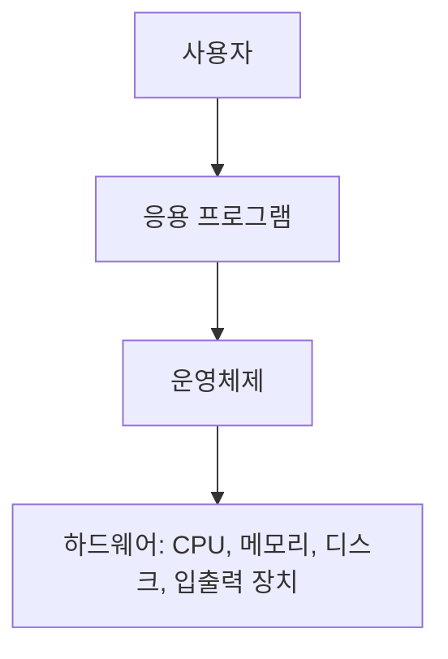

<Callout type="info">
  **이번 문서의 목표:** 이 파일을 다 읽으면 운영체제(OS, Operating System)가 왜 필요하고 무슨 일을 하는지, 커널 구조 세 가지와 시스템 운영 방식 네 가지를 서로 비교해 옳고 그름을 가려낼 수 있다.
</Callout>

## 운영체제는 왜 필요한가

컴퓨터에는 CPU(Central Processing Unit, 중앙처리장치) 하나(또는 여러 개)와 메모리, 디스크, 키보드, 네트워크 카드 같은 자원(resource)이 있다. 그런데 사용자는 워드 프로세서도 켜고, 음악도 듣고, 인터넷 브라우저도 동시에 쓰고 싶어 한다. 문제는 이 모든 프로그램이 각자 "내가 CPU를 쓰겠다", "내가 메모리 이 영역을 쓰겠다"고 제멋대로 요구하면 서로 충돌해서 컴퓨터가 멈추거나 죽어버린다는 점이다.

운영체제(OS, Operating System)는 이 충돌을 막고 자원을 안전하고 효율적으로 나눠주는 **자원 관리자**(resource manager)다. 동시에 사용자와 응용 프로그램이 하드웨어를 직접 건드리지 않고도 편하게 쓸 수 있도록 창구 역할을 하는 **사용자 인터페이스 제공자**이기도 하다. 이 두 역할 — 자원 관리와 사용 편의 제공 — 을 하나로 묶어 "운영체제는 하드웨어와 사용자 사이의 중개자"라고 표현한다.

> **쉽게 말하면:** 운영체제는 컴퓨터 자원을 여러 프로그램에게 공평하고 안전하게 나눠주는 관리자다.

이 관계를 계층으로 그리면 다음과 같다.

사용자는 응용 프로그램(워드, 브라우저)을 쓰고, 응용 프로그램은 운영체제가 제공하는 창구(시스템 호출)를 통해서만 하드웨어에 접근한다. 시스템 호출(system call)은 응용 프로그램이 운영체제에게 "이 파일 좀 열어줘", "메모리 좀 더 줘" 같은 서비스를 요청하는 공식 통로다. 이 개념은 1편에서 이미 다뤘으므로 여기서는 "운영체제가 이 통로의 관리자"라는 점만 기억하면 된다.

## 운영체제의 4대 기능

운영체제가 실제로 하는 일을 크게 넷으로 나눌 수 있다.

| 기능 | 무엇을 관리하는가 | 대표 예시 |
|------|------|------|
| 프로세스 관리 | CPU를 어떤 프로세스에게 언제 줄지 | CPU 스케줄링(07–08편) |
| 메모리 관리 | 프로그램을 메모리 어디에 올릴지, 부족하면 어떻게 할지 | 페이징, 가상메모리(12–15편) |
| 파일 관리 | 디스크에 파일을 어떻게 저장·검색할지 | 파일 할당 방식(16–17편) |
| 입출력 관리 | 키보드·디스크·네트워크 장치를 어떻게 제어할지 | 인터럽트, DMA(18편) |

여기에 더해 여러 사용자·프로세스가 서로의 자원을 침범하지 못하게 막는 **보호(protection)와 보안(security)** 기능도 있다(20편에서 다룬다). 이 네 가지 기능은 각각 독립된 주제가 아니라 서로 얽혀 있다. 예를 들어 프로세스 관리에서 다루는 프로세스 하나는 메모리 관리가 할당해 준 메모리 공간 위에서 돌아가고, 파일을 열려면 입출력 관리가 디스크를 제어해야 한다.

## 커널 구조: 운영체제를 어떻게 짜는가

운영체제의 핵심 부분을 커널(kernel)이라 부른다는 것은 1편에서 배웠다. 그런데 이 커널을 "어떻게 설계하느냐"에 따라 세 가지 구조로 나뉜다. 이 구조 비교는 독학사 시험에서 "장단점이 옳게 짝지어진 것"을 묻는 단골 유형이다.

### 모놀리식 커널 (monolithic kernel)

프로세스 관리, 메모리 관리, 파일 시스템, 디바이스 드라이버까지 모든 기능을 **하나의 큰 프로그램 덩어리**로 만들어 커널 공간에 몰아넣은 구조다. 초창기 유닉스(UNIX)와 리눅스(Linux)가 이 방식을 쓴다.

- 장점: 모든 모듈이 같은 주소 공간에 있어서 함수 호출만으로 바로 통신하므로 **속도가 빠르다**.
- 단점: 한 모듈(예: 디바이스 드라이버 하나)에 결함이 있으면 커널 전체가 죽을 수 있다. 구조가 거대해질수록 **유지보수가 어렵다**.

### 계층형 커널 (layered kernel)

커널을 여러 계층(layer)으로 나누고, 각 계층은 자기 바로 아래 계층의 서비스만 이용하도록 규칙을 정한 구조다. 예를 들어 최하위 계층은 하드웨어 제어, 그 위는 CPU 스케줄링, 그 위는 메모리 관리, 이런 식으로 쌓아 올린다.

- 장점: 계층별로 역할이 분리되어 있어 **설계와 디버깅이 모놀리식보다 쉽다**. 특정 계층만 교체·수정할 수 있다.
- 단점: 요청이 여러 계층을 거쳐야 처리되므로 **모놀리식보다 느리다**. 계층을 정확히 나누는 설계 자체가 어렵다.

### 마이크로커널 (microkernel)

커널에는 프로세스 간 통신(IPC, Inter-Process Communication)과 최소한의 메모리·스케줄링 기능만 남기고, 파일 시스템이나 디바이스 드라이버 같은 나머지 기능은 커널 밖의 **사용자 공간(user space) 서버**로 빼낸 구조다.

- 장점: 커널 자체가 작아서 **안정성과 보안성이 높다**. 서버 하나가 죽어도 커널 전체가 죽지 않고 재시작할 수 있다. 새 기능을 추가할 때 커널을 건드리지 않아도 된다.
- 단점: 커널과 사용자 공간 서버 사이를 메시지로 주고받아야 하므로 **통신 오버헤드(overhead, 부가 비용)가 커서 모놀리식보다 느리다**.

세 구조를 표로 정리한다.

| 구분 | 모놀리식 커널 | 계층형 커널 | 마이크로커널 |
|------|------|------|------|
| 기능 배치 | 전부 커널 공간 | 계층별로 커널 공간 분리 | 최소 기능만 커널, 나머지는 사용자 공간 |
| 속도 | 빠름 | 중간 | 느림(IPC 오버헤드) |
| 안정성 | 낮음(한 모듈 결함이 전체 영향) | 중간 | 높음(서버 격리) |
| 확장·유지보수 | 어려움 | 비교적 쉬움 | 쉬움(서버 단위 교체) |
| 대표 예 | 초기 UNIX, 리눅스 | 초기 계층형 OS 설계(예: THE 운영체제) | Mach, QNX (개념적으로) |

> **자주 틀리는 점:** "마이크로커널은 커널이 작으니까 무조건 빠르다"고 착각하기 쉽다. 실제로는 정반대다. 기능이 커널 밖에 있어서 요청마다 메시지를 주고받아야 하므로 **속도는 오히려 모놀리식보다 느리다.** 마이크로커널의 장점은 속도가 아니라 **안정성·보안성**이다.

## 시스템 운영 방식: 배치·다중프로그래밍·시분할

커널 구조가 "안을 어떻게 짜는가"라면, 이번엔 "CPU를 여러 작업에게 어떤 방식으로 굴리는가"의 역사적 발전을 본다. 이 흐름을 알아야 다음 편의 CPU 스케줄링이 왜 필요한지 이해된다.

### 일괄 처리 시스템 (batch processing system)

초창기 컴퓨터는 한 번에 작업(job) 하나만 실행했다. 사용자가 프로그램과 데이터를 카드에 담아 제출하면, 운영자가 이를 모아(batch, 묶음) 순서대로 하나씩 실행시켰다. 작업 하나가 끝날 때까지 CPU는 그 작업에만 매여 있었다.

- 문제점: 작업 하나가 입출력을 기다리는 동안(예: 디스크 읽기) CPU는 아무것도 안 하고 **놀았다(idle, 유휴 상태)**. CPU 이용률이 매우 낮았다.

### 다중 프로그래밍 시스템 (multiprogramming system)

이 유휴 시간을 없애기 위해, 메모리에 **여러 작업을 동시에 올려놓고** 한 작업이 입출력을 기다리는 동안 CPU를 다른 작업에게 넘기는 방식이 등장했다. CPU가 노는 시간을 최소화해서 **처리량**(throughput, 단위 시간당 처리하는 작업 수)을 높이는 것이 목표다.

- 다중 프로그래밍이 가능하려면 여러 작업을 메모리에 동시에 올려야 하므로, 이때부터 메모리 관리와 프로세스 보호가 중요한 문제로 떠올랐다.

### 시분할 시스템 (time-sharing system)

다중 프로그래밍에서 한 걸음 더 나아가, CPU 시간을 아주 짧은 단위(시간 할당량, time quantum)로 잘라 여러 사용자·프로세스에게 **돌아가며** 배분하는 방식이다. 각 사용자는 자신만의 컴퓨터를 쓰는 것처럼 느끼지만, 실제로는 CPU가 매우 빠르게 여러 프로세스를 오가며 처리한다. 오늘날 우리가 쓰는 PC·서버 운영체제(윈도우, 리눅스)가 모두 이 방식이다.

- 목표가 "처리량"에서 "응답 시간(response time, 요청부터 첫 반응까지 걸리는 시간)"으로 바뀐 것이 다중 프로그래밍과의 핵심 차이다. 시분할 시스템은 8편에서 배울 라운드 로빈(Round Robin) 스케줄링과 직결된다.

### 세 방식 비교

| 구분 | 일괄 처리 | 다중 프로그래밍 | 시분할 |
|------|------|------|------|
| 메모리 내 작업 수 | 1개 | 여러 개 | 여러 개 |
| CPU 유휴 시간 | 많음 | 적음 | 매우 적음 |
| 목표 | 작업 순서대로 완료 | 처리량 극대화 | 응답 시간 단축, 공평한 분배 |
| 사용자 상호작용 | 없음(제출 후 대기) | 거의 없음 | 실시간 상호작용 |
| 대표 예 | 초기 메인프레임 | 초기 유닉스 | 현대 PC·서버 OS |

> **비유:** 일괄 처리는 은행 창구에서 번호표 없이 한 사람이 볼일을 완전히 끝낼 때까지 다음 사람이 기다리는 것과 같다. 다중 프로그래밍은 그 사람이 서류를 뒤적이는 동안(입출력 대기) 옆 창구 직원이 다른 손님을 처리하는 것이고, 시분할은 한 직원이 여러 손님 사이를 아주 짧은 간격으로 왔다 갔다 하며 "동시에 응대받는 느낌"을 주는 것이다.

## 시스템 구성 관점의 분류

운영체제는 CPU 개수와 컴퓨터 배치 형태에 따라서도 나뉜다. 시험에서 이름과 정의를 헷갈리게 짝지어 놓는 경우가 많아 정리해 둔다.

| 구분 | 정의 | 핵심 특징 |
|------|------|------|
| 단일 처리 시스템 | CPU가 1개뿐인 시스템 | 한 순간에 하나의 명령만 실행 |
| 다중 처리 시스템(multiprocessing) | CPU가 2개 이상, 같은 메모리를 공유 | 처리 성능·신뢰성 향상, CPU 간 부하 분산 |
| 분산 시스템(distributed system) | 물리적으로 떨어진 여러 컴퓨터가 네트워크로 연결 | 각 컴퓨터가 독립된 메모리를 가짐(출제기준상 개요 수준만) |
| 실시간 시스템(real-time system) | 정해진 시간 안에 반드시 응답해야 하는 시스템 | 경성(hard) 실시간은 시간 초과 시 치명적 오류로 간주 |

독학사 2단계 출제기준은 분산·실시간 시스템의 구현 세부사항까지 요구하지 않는다. 이름과 한 줄 정의, 그리고 다중 처리 시스템이 "CPU 여러 개가 메모리를 공유한다"는 점만 정확히 기억하면 된다.

## 핵심 정리

- 운영체제는 하드웨어 자원을 관리하고 사용자에게 편의를 제공하는 중개자이며, 프로세스·메모리·파일·입출력 관리와 보호가 4대 핵심 기능이다.
- 커널 구조는 모놀리식(빠르지만 불안정)·계층형(설계 용이, 중간 속도)·마이크로커널(안정적이지만 느림) 세 가지로 나뉘며, 속도와 안정성은 서로 상충 관계다.
- 시스템 운영 방식은 일괄 처리 → 다중 프로그래밍 → 시분할 순서로 발전했고, 목표가 "CPU 유휴 시간 제거"에서 "응답 시간 단축"으로 옮겨갔다.
- 다중 처리 시스템은 CPU 여러 개가 메모리를 공유하는 구조로, 물리적으로 분리된 분산 시스템과 구별해야 한다.

## 마무리 복습

<Quiz
  questionNumber={1}
  question="운영체제의 4대 핵심 기능에 해당하지 않는 것은?"
  options={['프로세스 관리', '메모리 관리', '컴파일러 최적화', '파일 관리']}
  correctAnswer={3}
  explanation="운영체제의 핵심 기능은 프로세스 관리, 메모리 관리, 파일 관리, 입출력 관리 네 가지다. 컴파일러 최적화는 프로그래밍 언어 처리기의 역할이지 운영체제의 기능이 아니다."
  optionExplanations={['프로세스 관리는 CPU 스케줄링을 포함하는 핵심 기능이다.', '메모리 관리는 프로그램을 메모리에 배치하는 핵심 기능이다.', '컴파일러 최적화는 운영체제가 아니라 언어 처리기(컴파일러)의 역할이므로 이것이 정답이다.', '파일 관리는 디스크에 데이터를 저장·검색하는 핵심 기능이다.']}
/>

<Quiz
  questionNumber={2}
  question="마이크로커널 구조에 대한 설명으로 옳은 것은?"
  options={['모든 기능을 커널 공간에 두어 속도가 가장 빠르다', '커널을 최소화하고 나머지 기능을 사용자 공간 서버로 분리해 안정성을 높인다', '계층을 나누어 아래 계층만 이용하도록 강제하는 구조다', '커널이 없는 운영체제 구조를 말한다']}
  correctAnswer={2}
  explanation="마이크로커널은 프로세스 간 통신과 최소한의 스케줄링·메모리 기능만 커널에 남기고, 파일 시스템·드라이버 등은 사용자 공간 서버로 분리한다. 이 덕분에 한 서버가 죽어도 커널 전체가 죽지 않아 안정성이 높지만, 서버와 통신하는 오버헤드 때문에 속도는 모놀리식보다 느리다."
  optionExplanations={['이는 모놀리식 커널에 대한 설명이다. 마이크로커널은 오히려 통신 오버헤드로 속도가 느리다.', '정답이다. 최소 커널과 사용자 공간 서버 분리가 마이크로커널의 핵심 정의다.', '이는 계층형 커널에 대한 설명이다.', '마이크로커널도 엄연히 커널이 존재하며, 다만 그 크기가 최소화되어 있을 뿐이다.']}
/>

<Quiz
  questionNumber={3}
  question="다중 프로그래밍 시스템이 일괄 처리 시스템보다 CPU 이용률이 높은 이유로 옳은 것은?"
  options={['작업을 순서대로 하나씩만 실행하기 때문이다', '한 작업이 입출력을 기다리는 동안 다른 작업에 CPU를 넘길 수 있기 때문이다', '메모리에 작업을 하나만 올리기 때문이다', '사용자와 실시간으로 상호작용하기 때문이다']}
  correctAnswer={2}
  explanation="다중 프로그래밍은 여러 작업을 메모리에 동시에 올려두고, 한 작업이 입출력 대기 상태에 들어가면 CPU를 유휴 상태로 두지 않고 다른 작업에게 넘긴다. 이로써 CPU 이용률과 처리량이 높아진다."
  optionExplanations={['이는 일괄 처리 시스템의 특징이며, CPU 이용률이 낮은 원인이다.', '정답이다. 입출력 대기 시간에 다른 작업으로 CPU를 전환하는 것이 다중 프로그래밍의 핵심 아이디어다.', '메모리에 작업을 하나만 올리는 것은 일괄 처리 시스템의 특징이다.', '실시간 상호작용은 시분할 시스템의 특징이며, CPU 이용률 향상의 직접적 이유가 아니다.']}
/>

<Quiz
  questionNumber={4}
  question="시분할 시스템이 다중 프로그래밍 시스템과 구별되는 핵심 목표는?"
  options={['처리량 극대화', '응답 시간 단축과 여러 사용자에 대한 공평한 CPU 분배', '메모리 사용량 최소화', '디스크 접근 속도 향상']}
  correctAnswer={2}
  explanation="다중 프로그래밍의 목표가 CPU 유휴 시간을 줄여 처리량을 높이는 것이라면, 시분할 시스템은 CPU 시간을 잘게 쪼개 여러 사용자·프로세스에게 번갈아 배분함으로써 응답 시간을 줄이고 공평성을 확보하는 것이 목표다."
  optionExplanations={['처리량 극대화는 다중 프로그래밍의 목표에 가깝다.', '정답이다. 시분할 시스템은 시간 할당량 단위로 CPU를 나눠 응답 시간과 공평성을 확보한다.', '메모리 사용량 최소화는 시분할 시스템의 핵심 목표가 아니다.', '디스크 접근 속도 향상은 디스크 스케줄링(19편)의 주제이지 시분할 시스템의 정의와 무관하다.']}
/>

<Quiz
  questionNumber={5}
  question="계층형 커널 구조의 단점으로 가장 적절한 것은?"
  options={['커널 결함이 시스템 전체를 즉시 마비시킨다', '요청이 여러 계층을 거쳐 처리되어 모놀리식 커널보다 속도가 느리다', '사용자 공간에 별도 서버를 두어야 해서 통신 비용이 크다', '계층 구조 자체가 존재하지 않아 설계가 불가능하다']}
  correctAnswer={2}
  explanation="계층형 커널은 각 계층이 바로 아래 계층의 서비스만 이용하도록 제한하므로 요청이 여러 계층을 순차적으로 거쳐야 한다. 이 때문에 모든 기능이 한 공간에 있어 함수 호출로 바로 처리되는 모놀리식 커널보다 속도가 느리다."
  optionExplanations={['이는 모놀리식 커널의 단점에 가깝다. 계층형은 오히려 결함을 계층 단위로 격리하기 쉽다.', '정답이다. 계층을 거치는 처리 과정 자체가 오버헤드를 만든다.', '사용자 공간 서버 분리는 마이크로커널의 특징이지 계층형 커널의 단점이 아니다.', '계층형 커널은 계층 구조가 있기 때문에 설계와 디버깅이 오히려 쉬워지는 것이 장점이다.']}
/>

<Quiz
  questionNumber={6}
  question="다중 처리 시스템(multiprocessing system)에 대한 설명으로 옳은 것은?"
  options={['물리적으로 떨어진 여러 컴퓨터가 네트워크로 연결된 구조다', '한 시스템에 CPU가 2개 이상 있으며 메모리를 공유한다', 'CPU는 하나이지만 여러 프로세스를 시간 단위로 번갈아 실행한다', '정해진 시간 안에 반드시 응답해야 하는 시스템이다']}
  correctAnswer={2}
  explanation="다중 처리 시스템은 하나의 시스템 안에 CPU(또는 코어)가 2개 이상 존재하고, 이들이 같은 메모리 공간을 공유하며 작업을 나눠 처리하는 구조다. 이는 물리적으로 분리된 컴퓨터가 연결된 분산 시스템과 명확히 구별된다."
  optionExplanations={['이는 분산 시스템에 대한 설명이다.', '정답이다. CPU 여러 개가 메모리를 공유하는 것이 다중 처리 시스템의 정의다.', '이는 단일 CPU 기반 시분할 시스템에 대한 설명이다.', '이는 실시간 시스템에 대한 설명이다.']}
/>

## 참고 자료

- [운영체제 공룡책 목차 정리](https://responsibility.tistory.com/171)
- [KOCW 운영체제 강의자료 - Introduction](http://contents.kocw.or.kr/KOCW/document/2013/kyungsung/yangheejae/os01.pdf)
- [국가평생교육진흥원 과목별 평가영역](https://bdes.nile.or.kr/nile/study/nStudy2_1.do)
