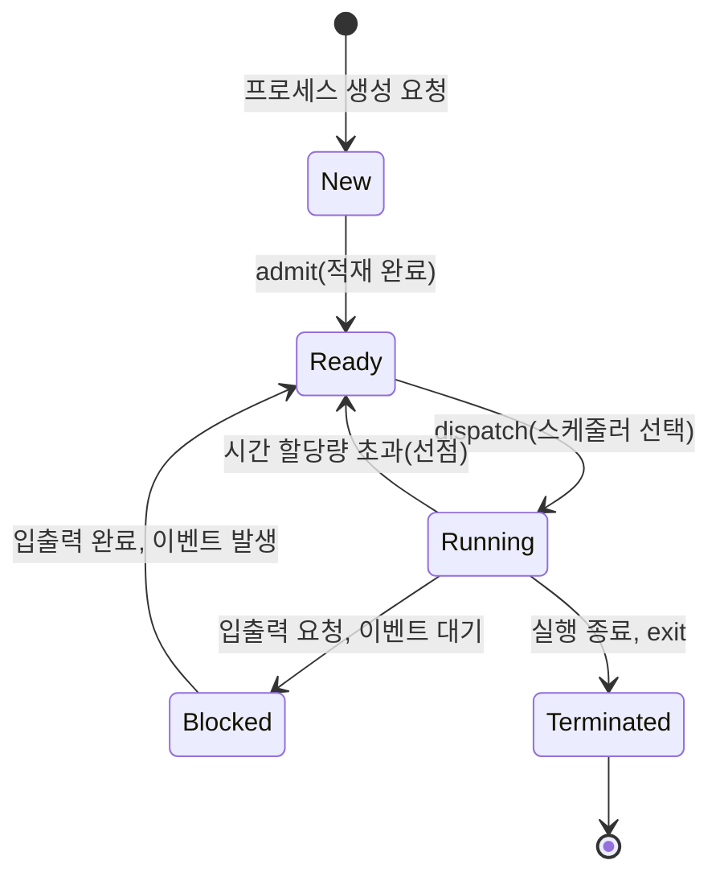
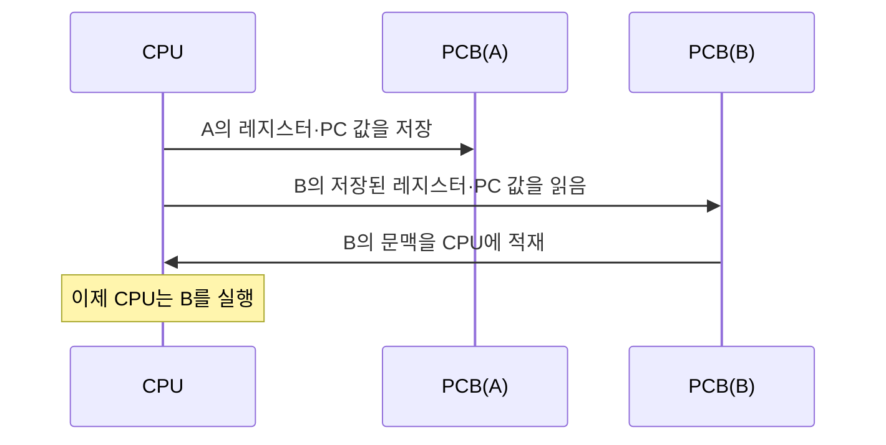

<Callout type="info">
  **이번 문서의 목표:** 이 파일을 다 읽으면 프로세스가 생성부터 종료까지 거치는 상태와 PCB(Process Control Block)의 각 구성 요소, 문맥 전환의 비용, 좀비·고아 프로세스의 발생 원인을 구분해 설명할 수 있다.
</Callout>

## 프로세스란 무엇인가 — 프로그램과의 차이부터

3편에서 프로그램(program)과 프로세스(process)의 차이를 간단히 배웠다. 여기서 다시 짚고 넘어가면, **프로그램은 디스크에 저장된 정적인 실행 파일**이고, **프로세스는 그 프로그램이 메모리에 올라가 실행 중인 동적인 상태**다. 같은 프로그램(예: 메모장 실행 파일)을 두 번 실행하면 두 개의 서로 다른 프로세스가 생긴다 — 각자 독립된 메모리 공간과 자원을 가지기 때문이다.

> **쉽게 말하면:** 프로그램은 요리 레시피이고, 프로세스는 그 레시피대로 실제로 요리하고 있는 행위다. 같은 레시피로 여러 사람이 동시에 요리하면 각각 별개의 요리(프로세스)가 된다.

프로세스는 실행에 필요한 다음 요소들을 갖는다.

- **텍스트 영역(text segment)**: 실행할 명령어 코드
- **데이터 영역(data segment)**: 전역 변수
- **힙(heap)**: 실행 중 동적으로 할당되는 메모리
- **스택(stack)**: 함수 호출 정보, 지역 변수

이 메모리 구조 자체는 12편(메모리 관리)에서 더 깊이 다룬다. 이번 편에서는 "프로세스가 이런 자원을 갖고 운영체제에 의해 관리되는 하나의 실행 단위"라는 점만 기억하면 된다.

## 프로세스 상태와 상태 전이도

프로세스는 실행되는 동안 계속 같은 상태에 머무르지 않는다. CPU를 얻었다가 뺏겼다가, 입출력을 기다렸다가 다시 실행되는 식으로 상태가 바뀐다. 독학사 시험에서 상태 전이도는 각 화살표가 무엇을 의미하는지 정확히 짝지을 수 있어야 풀리는 문제가 많다.

기본 5상태 모델은 다음과 같다.

- **생성(new)**: 프로세스가 막 만들어지는 중. 아직 준비 큐에 들어가지 못한 상태.
- **준비(ready)**: CPU만 배정받으면 바로 실행할 수 있는 상태. 준비 큐(ready queue)에서 대기.
- **실행(running)**: CPU를 실제로 배정받아 명령어를 처리 중인 상태. 한 CPU에서는 한 순간에 하나의 프로세스만 이 상태가 될 수 있다.
- **대기(blocked, waiting)**: 입출력 완료 같은 이벤트를 기다리는 상태. CPU가 주어져도 당장 실행할 수 없다.
- **종료(terminated)**: 실행을 마치고 자원을 반납하는 상태.

이 그림에서 시험에 자주 나오는 함정 화살표 두 개를 짚는다.

1. **준비 → 실행 (dispatch)**: 스케줄러(scheduler)가 준비 큐에서 하나를 골라 CPU를 배정하는 것. "디스패치(dispatch)"라는 용어가 바로 이 화살표를 가리킨다.
2. **실행 → 준비 (선점, preemption)**: 실행 중이던 프로세스가 스스로 끝낸 게 아니라 **시간 할당량이 다 되거나 더 높은 우선순위 프로세스가 나타나서 강제로 CPU를 빼앗기는 것**. 이는 7~8편에서 다룰 선점형 스케줄링과 직결된다.

> **자주 틀리는 점:** "대기 → 실행"으로 바로 가는 화살표가 있다고 착각하기 쉽다. 실제로는 대기 상태의 프로세스는 이벤트가 끝나도 **바로 실행되지 않고 반드시 준비 상태를 거친다.** CPU가 비어있지 않을 수도 있기 때문이다.

## PCB: 프로세스의 신분증

운영체제는 시스템에 수십, 수백 개의 프로세스가 동시에 떠 있어도 각각을 구별하고 관리해야 한다. 이를 위해 프로세스마다 하나씩 만들어지는 자료구조가 **PCB**(Process Control Block, 프로세스 제어 블록)다. PCB는 그 프로세스에 관한 모든 정보를 담은, 말하자면 "프로세스의 신분증이자 이력서"다.

> **쉽게 말하면:** PCB는 프로세스 하나하나를 식별하고 되살리는 데 필요한 정보를 모두 담은 카드다.

PCB의 주요 구성 요소는 다음과 같다.

| 구성 요소 | 담는 내용 |
|------|------|
| 프로세스 ID(PID) | 프로세스를 구별하는 고유 번호 |
| 프로세스 상태 | 준비·실행·대기 등 현재 상태 |
| 프로그램 카운터(PC) | 다음에 실행할 명령어의 주소 |
| CPU 레지스터 값 | 누산기, 인덱스 레지스터 등 CPU 내부 저장값의 스냅샷 |
| CPU 스케줄링 정보 | 우선순위, 스케줄링 큐 포인터 |
| 메모리 관리 정보 | 페이지 테이블, 세그먼트 테이블 등 주소 변환 정보(12–13편) |
| 계정 정보 | CPU 사용 시간, 프로세스 번호, 자원 사용 한도 |
| 입출력 상태 정보 | 할당된 입출력 장치 목록, 열려 있는 파일 목록 |

프로그램 카운터(PC, Program Counter)는 "이 프로세스가 다음에 실행할 명령어가 메모리 몇 번지에 있는가"를 가리키는 레지스터다. 프로세스가 CPU를 빼앗겼다가 나중에 다시 CPU를 받았을 때, 이 PC 값 덕분에 **중단된 지점부터 정확히 이어서 실행**할 수 있다. PCB가 없으면 프로세스를 잠깐 멈췄다가 재개하는 일 자체가 불가능하다.

## 문맥 교환: PCB를 갈아 끼우는 순간

문맥 교환(context switching)은 CPU가 프로세스 A를 실행하다가 프로세스 B로 넘어갈 때, **A의 실행 상태(문맥, context)를 A의 PCB에 저장하고, B의 PCB에 저장돼 있던 문맥을 CPU 레지스터로 복원**하는 과정이다.

> **쉽게 말하면:** 문맥 교환은 읽던 책에 책갈피를 꽂고(저장), 다른 책의 책갈피가 꽂힌 곳부터 다시 읽기 시작하는(복원) 것과 같다.

문맥 교환은 공짜가 아니다. 레지스터를 저장·복원하는 시간, 캐시(cache) 적중률이 떨어지는 부수 효과 등이 모두 **오버헤드**(overhead, 부가 비용)다. 이 시간 동안 CPU는 어느 프로세스의 실제 작업도 처리하지 못하므로, 문맥 교환이 너무 잦으면 시스템 전체 처리량이 떨어진다. 이 개념은 8편에서 시간 할당량을 너무 짧게 잡으면 안 되는 이유로 다시 등장한다.

## 프로세스 생성과 종료

프로세스는 다른 프로세스에 의해 만들어진다. 이미 실행 중인 프로세스를 **부모 프로세스(parent process)**, 그로부터 새로 생성된 프로세스를 **자식 프로세스**(child process)라 부른다. 유닉스 계열에서는 `fork()`라는 시스템 호출로 부모가 자기 자신의 복사본을 자식으로 만들고, 이후 `exec()`로 자식이 실행할 새 프로그램을 덮어씌우는 방식을 쓴다. 부모는 자식이 끝나기를 기다리기 위해 `wait()`를 호출한다.

프로세스가 종료될 때는 `exit()` 시스템 호출을 통해 자신이 쓰던 자원(메모리, 열린 파일 등)을 운영체제에 반납한다. 그런데 이 종료 과정에서 부모와 자식 사이의 타이밍 문제로 두 가지 특이한 상태가 생길 수 있다.

### 좀비 프로세스 (zombie process)

자식 프로세스가 `exit()`를 호출해 실행은 끝났지만, **부모가 아직 `wait()`를 호출하지 않아 그 종료 상태 값이 회수되지 않은 상태**다. 이 자식은 실제로는 아무 작업도 하지 않지만, 종료 코드를 담은 PCB 일부가 남아 있어 "죽었지만 완전히 사라지지 않은" 좀비 상태로 프로세스 테이블에 남는다.

### 고아 프로세스 (orphan process)

반대로 **부모 프로세스가 자식보다 먼저 종료되어 버린 경우**, 남겨진 자식 프로세스를 고아 프로세스라 한다. 유닉스 계열 운영체제는 고아가 생기면 보통 시스템의 최상위 프로세스(예: `init` 또는 그 후속 프로세스)가 새로운 부모로 이 고아를 입양해 나중에 `wait()`를 대신 처리해 준다.

| 구분 | 발생 원인 | 상태 |
|------|------|------|
| 좀비 프로세스 | 자식은 종료했지만 부모가 wait()를 호출하지 않음 | 종료 상태 값이 남아 프로세스 테이블 차지 |
| 고아 프로세스 | 부모가 자식보다 먼저 종료 | 최상위 프로세스가 새 부모로 입양 |

> **자주 틀리는 점:** 좀비 프로세스를 "메모리를 계속 차지하며 CPU를 쓰는 프로세스"로 오해하기 쉽다. 실제로는 좀비 프로세스는 **CPU도 메모리(코드·데이터 영역)도 쓰지 않는다.** 오직 프로세스 테이블에 있는 PCB의 극히 일부(PID, 종료 상태)만 남아 있을 뿐이며, 부모가 `wait()`를 호출하면 이 PCB마저 사라진다. 좀비 프로세스가 대량으로 쌓이면 PID 자원이 고갈되는 문제가 생길 수 있다는 점이 시험 포인트다.

## 핵심 정리

- 프로그램은 정적 파일, 프로세스는 실행 중인 동적 인스턴스이며, 같은 프로그램도 여러 프로세스로 동시에 존재할 수 있다.
- 프로세스는 생성 → 준비 → 실행 → (대기 ↔ 준비) → 종료의 상태를 거치며, 대기 상태는 반드시 준비 상태를 거쳐야 실행으로 갈 수 있다.
- PCB는 PID, 상태, 프로그램 카운터, 레지스터 값, 스케줄링·메모리·입출력 정보를 담은 프로세스의 신분증이며, 문맥 교환 시 이 정보를 저장·복원한다.
- 문맥 교환은 오버헤드를 유발하므로 너무 잦으면 시스템 처리량이 떨어진다.
- 좀비 프로세스는 자식 종료 후 부모의 wait() 누락, 고아 프로세스는 부모가 자식보다 먼저 종료된 경우 발생한다.

## 마무리 복습

<Quiz
  questionNumber={1}
  question="프로그램과 프로세스의 차이에 대한 설명으로 옳은 것은?"
  options={['프로그램과 프로세스는 완전히 같은 개념이다', '프로그램은 디스크의 정적 실행 파일이고, 프로세스는 그것이 메모리에서 실행 중인 동적 상태다', '프로세스는 항상 하나의 프로그램에서 하나만 만들어질 수 있다', '프로그램은 실행 중에만 존재하고 프로세스는 디스크에 저장된다']}
  correctAnswer={2}
  explanation="프로그램은 디스크에 저장된 정적인 실행 파일이며, 프로세스는 그 프로그램이 메모리에 적재되어 실행되고 있는 동적인 상태를 말한다. 같은 프로그램을 여러 번 실행하면 여러 개의 독립된 프로세스가 만들어진다."
  optionExplanations={['프로그램은 정적 파일, 프로세스는 동적 실행 인스턴스로 명확히 구분된다.', '정답이다. 정적 파일과 동적 실행 상태의 구분이 핵심이다.', '같은 프로그램에서 여러 개의 프로세스가 동시에 생성될 수 있다(예: 메모장을 두 번 실행).', '반대로 설명되어 있다. 프로그램이 디스크에 저장되고, 프로세스가 실행 중인 상태다.']}
/>

<Quiz
  questionNumber={2}
  question="프로세스 상태 전이도에서 실행(running) 상태의 프로세스가 준비(ready) 상태로 돌아가는 경우로 옳은 것은?"
  options={['입출력을 요청했을 때', '시간 할당량이 초과되어 선점당했을 때', '프로세스가 정상적으로 종료되었을 때', '프로세스가 처음 생성되었을 때']}
  correctAnswer={2}
  explanation="실행 중이던 프로세스가 시간 할당량을 다 쓰거나 더 높은 우선순위 프로세스가 나타나 CPU를 강제로 빼앗기는 것을 선점(preemption)이라 하며, 이때 프로세스는 실행 상태에서 준비 상태로 돌아간다."
  optionExplanations={['입출력을 요청하면 실행 상태에서 대기(blocked) 상태로 전이된다.', '정답이다. 이것이 실행에서 준비로 돌아가는 유일한 경로인 선점이다.', '정상 종료는 실행 상태에서 종료(terminated) 상태로 전이된다.', '프로세스 생성은 생성(new) 상태에서 시작되는 것으로, 실행 상태와 무관하다.']}
/>

<Quiz
  questionNumber={3}
  question="PCB(Process Control Block)에 포함되지 않는 정보는?"
  options={['프로그램 카운터 값', 'CPU 레지스터 값', '프로세스가 사용할 컴파일러의 소스 코드 전문', '입출력 장치 할당 상태']}
  correctAnswer={3}
  explanation="PCB에는 PID, 프로세스 상태, 프로그램 카운터, CPU 레지스터 값, 스케줄링 정보, 메모리 관리 정보, 계정 정보, 입출력 상태 정보가 담긴다. 컴파일러의 소스 코드 전문은 PCB의 구성 요소가 아니다."
  optionExplanations={['프로그램 카운터는 PCB의 핵심 구성 요소로, 다음 실행할 명령어 주소를 담는다.', 'CPU 레지스터 값은 문맥 교환 시 저장·복원되는 핵심 정보다.', '정답이다. 소스 코드 전문은 PCB가 아니라 프로그램 자체(텍스트 영역)에 해당하며 PCB의 구성 요소가 아니다.', '입출력 상태 정보는 PCB에 담기는 항목 중 하나다.']}
/>

<Quiz
  questionNumber={4}
  question="문맥 교환(context switching)에 대한 설명으로 옳지 않은 것은?"
  options={['CPU 레지스터 값을 PCB에 저장하고 다른 프로세스의 값을 복원하는 과정이다', '문맥 교환이 잦을수록 시스템 처리량이 향상된다', '문맥 교환 중에는 실제 프로세스 작업이 진행되지 않아 오버헤드로 간주된다', '캐시 적중률 저하 등 부수 효과가 발생할 수 있다']}
  correctAnswer={2}
  explanation="문맥 교환은 그 자체로 실제 작업을 처리하지 않는 오버헤드이므로, 문맥 교환이 잦아질수록 오히려 시스템 처리량이 떨어진다. 이는 옳지 않은 설명이므로 정답이다."
  optionExplanations={['이는 문맥 교환의 정확한 정의이며 옳은 설명이다.', '정답이다. 문맥 교환은 오버헤드이므로 잦을수록 처리량이 오히려 떨어진다. 옳지 않은 설명을 찾는 문제이므로 이것이 답이다.', '문맥 교환 시간 동안은 어떤 프로세스의 실제 작업도 처리되지 않으므로 옳은 설명이다.', '문맥 교환으로 캐시 내용이 바뀌면서 캐시 적중률이 떨어지는 부수 효과가 실제로 발생하므로 옳은 설명이다.']}
/>

<Quiz
  questionNumber={5}
  question="자식 프로세스는 종료(exit)했지만 부모 프로세스가 wait()를 호출하지 않아 종료 상태 값이 남아 있는 프로세스를 무엇이라 하는가?"
  options={['고아 프로세스', '좀비 프로세스', '데몬 프로세스', '스레드']}
  correctAnswer={2}
  explanation="자식이 실행을 마쳤지만 부모가 wait()로 종료 상태를 회수하지 않아 프로세스 테이블에 종료 상태 값만 남아 있는 상태를 좀비 프로세스라 한다."
  optionExplanations={['고아 프로세스는 부모가 자식보다 먼저 종료된 경우이므로 이 문제 상황과 다르다.', '정답이다. 자식 종료 후 부모의 wait() 누락이 좀비 프로세스의 정의다.', '데몬 프로세스는 백그라운드에서 지속적으로 실행되는 프로세스로 이 문제와 무관한 개념이다.', '스레드는 프로세스 내부의 실행 흐름 단위로, 종료 상태 회수와 무관한 개념이다.']}
/>

<Quiz
  questionNumber={6}
  question="좀비 프로세스에 대한 설명으로 옳지 않은 것은?"
  options={['CPU를 지속적으로 점유하며 계속 실행 중인 상태이다', '부모가 wait()를 호출하면 프로세스 테이블에서 사라진다', '프로세스 테이블에 PID와 종료 상태 등 일부 정보만 남아 있다', '대량으로 쌓이면 PID 자원 고갈 문제를 일으킬 수 있다']}
  correctAnswer={1}
  explanation="좀비 프로세스는 이미 실행을 마친 상태이므로 CPU를 점유하거나 실제 작업을 수행하지 않는다. 프로세스 테이블에 PID와 종료 상태 등 극히 일부 정보만 남아 있을 뿐이다. 이 설명이 옳지 않으므로 정답이다."
  optionExplanations={['정답이다. 좀비 프로세스는 이미 종료되어 CPU를 전혀 쓰지 않으므로 이 설명은 옳지 않다.', '부모가 wait()를 호출해 종료 상태를 회수하면 좀비의 PCB 잔여 정보가 제거되므로 옳은 설명이다.', '좀비 프로세스는 PID와 종료 상태 같은 최소 정보만 프로세스 테이블에 남기므로 옳은 설명이다.', '좀비 프로세스가 회수되지 않고 쌓이면 새 프로세스에 할당할 PID가 부족해질 수 있으므로 옳은 설명이다.']}
/>

## 참고 자료

- [KOCW 운영체제 강의자료 - Introduction](http://contents.kocw.or.kr/KOCW/document/2013/kyungsung/yangheejae/os01.pdf)
- [운영체제_Study 저장소 README](https://github.com/yonghwankim-dev/OperatingSystem_Study/blob/main/README.md)
- [한국방송통신대학교 출판문화원 운영체제](https://press.knou.ac.kr/goods/ebookView.do?condCmdtCode=9788920045691&condLscValue=201)
