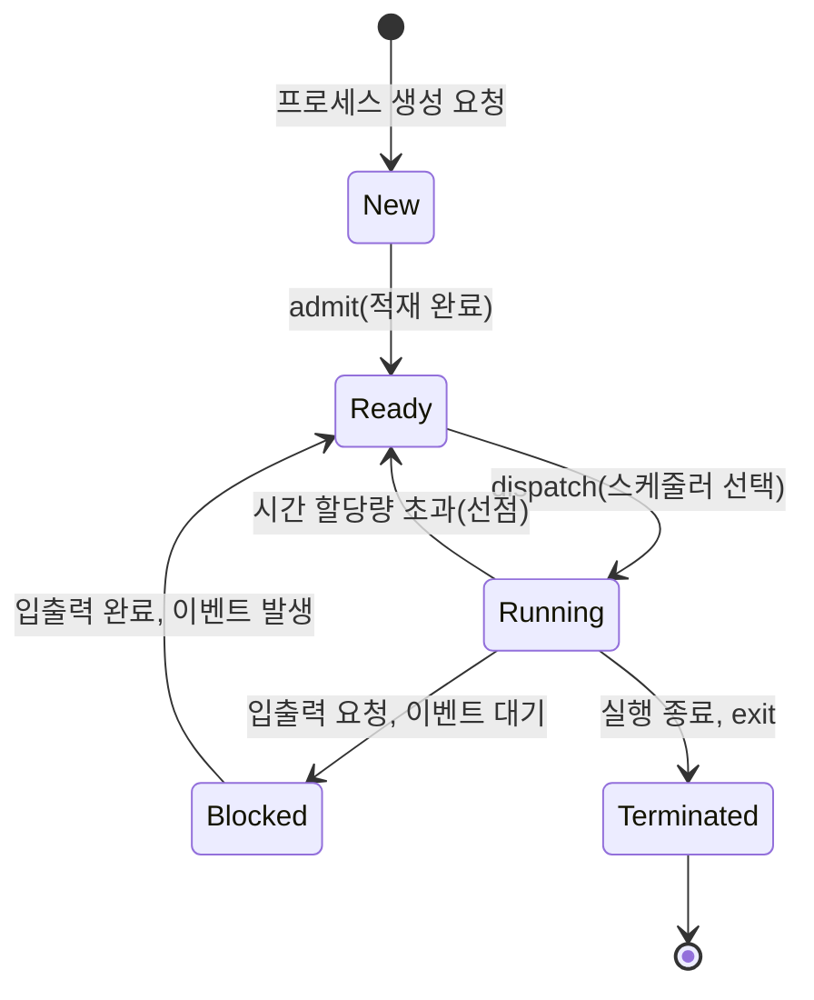
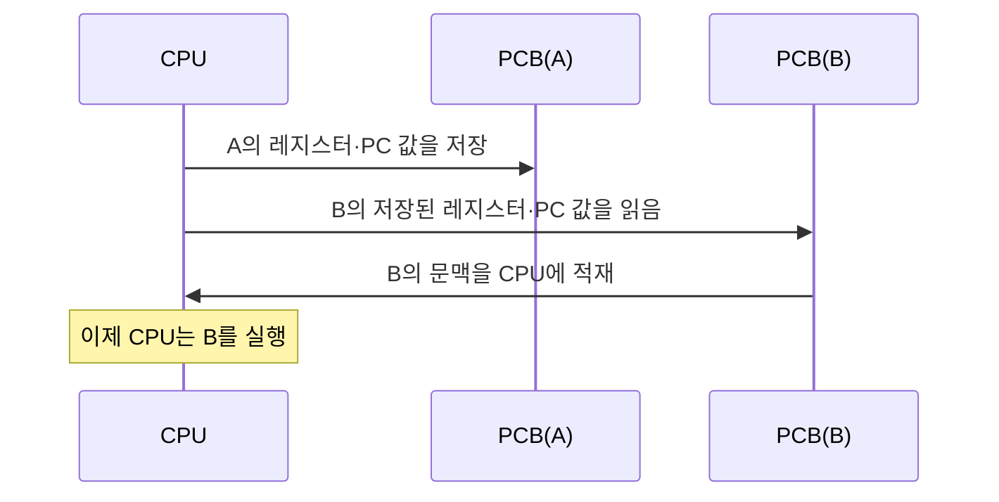

## 프로세스란 무엇인가 — 프로그램과의 차이부터

3편에서 프로그램(program)과 프로세스(process)의 차이를 간단히 배웠다. 여기서 다시 짚고 넘어가면, **프로그램은 디스크에 저장된 정적인 실행 파일**이고, **프로세스는 그 프로그램이 메모리에 올라가 실행 중인 동적인 상태**다.

프로세스는 실행에 필요한 다음 요소들을 갖는다.

- **텍스트 영역(text segment)**: 실행할 명령어 코드
- **데이터 영역(data segment)**: 전역 변수
- **힙(heap)**: 실행 중 동적으로 할당되는 메모리
- **스택(stack)**: 함수 호출 정보, 지역 변수

이 메모리 구조 자체는 12편(메모리 관리)에서 더 깊이 다룬다.

## 프로세스 상태와 상태 전이도

프로세스는 실행되는 동안 계속 같은 상태에 머무르지 않는다. CPU를 얻었다가 뺏겼다가, 입출력을 기다렸다가 다시 실행되는 식으로 상태가 바뀐다. 독학사 시험에서 상태 전이도는 각 화살표가 무엇을 의미하는지 정확히 짝지을 수 있어야 풀리는 문제가 많다.

기본 5상태 모델은 다음과 같다.

- **생성(new)**: 프로세스가 막 만들어지는 중. 아직 준비 큐에 들어가지 못한 상태.
- **준비(ready)**: CPU만 배정받으면 바로 실행할 수 있는 상태. 준비 큐(ready queue)에서 대기.
- **실행(running)**: CPU를 실제로 배정받아 명령어를 처리 중인 상태. 한 CPU에서는 한 순간에 하나의 프로세스만 이 상태가 될 수 있다.
- **대기(blocked, waiting)**: 입출력 완료 같은 이벤트를 기다리는 상태. CPU가 주어져도 당장 실행할 수 없다.
- **종료(terminated)**: 실행을 마치고 자원을 반납하는 상태.

```mermaid
stateDiagram-v2
    [*] --> New: 프로세스 생성 요청
    New --> Ready: admit(적재 완료)
    Ready --> Running: dispatch(스케줄러 선택)
    Running --> Ready: 시간 할당량 초과(선점)
    Running --> Blocked: 입출력 요청, 이벤트 대기
    Blocked --> Ready: 입출력 완료, 이벤트 발생
    Running --> Terminated: 실행 종료, exit
    Terminated --> [*]
```

이 그림에서 시험에 자주 나오는 함정 화살표 두 개를 짚는다.

1. **준비 → 실행 (dispatch)**: 스케줄러(scheduler)가 준비 큐에서 하나를 골라 CPU를 배정하는 것. "디스패치(dispatch)"라는 용어가 바로 이 화살표를 가리킨다.
2. **실행 → 준비 (선점, preemption)**: 실행 중이던 프로세스가 스스로 끝낸 게 아니라 **시간 할당량이 다 되거나 더 높은 우선순위 프로세스가 나타나서 강제로 CPU를 빼앗기는 것**. 이는 7~8편에서 다룰 선점형 스케줄링과 직결된다.

> **자주 틀리는 점:** "대기 → 실행"으로 바로 가는 화살표가 있다고 착각하기 쉽다. 실제로는 대기 상태의 프로세스는 이벤트가 끝나도 **바로 실행되지 않고 반드시 준비 상태를 거친다.** CPU가 비어있지 않을 수도 있기 때문이다.

## PCB: 프로세스의 신분증

운영체제는 시스템에 수십, 수백 개의 프로세스가 동시에 떠 있어도 각각을 구별하고 관리해야 한다. 이를 위해 프로세스마다 하나씩 만들어지는 자료구조가 **PCB**(Process Control Block, 프로세스 제어 블록)다. PCB는 그 프로세스에 관한 모든 정보를 담은, 말하자면 "프로세스의 신분증이자 이력서"다.

PCB의 주요 구성 요소는 다음과 같다.

| 구성 요소 | 담는 내용 |
|------|------|
| 프로세스 ID(PID) | 프로세스를 구별하는 고유 번호 |
| 프로세스 상태 | 준비·실행·대기 등 현재 상태 |
| 프로그램 카운터(PC) | 다음에 실행할 명령어의 주소 |
| CPU 레지스터 값 | 누산기, 인덱스 레지스터 등 CPU 내부 저장값의 스냅샷 |
| CPU 스케줄링 정보 | 우선순위, 스케줄링 큐 포인터 |
| 메모리 관리 정보 | 페이지 테이블, 세그먼트 테이블 등 주소 변환 정보(12–13편) |
| 계정 정보 | CPU 사용 시간, 프로세스 번호, 자원 사용 한도 |
| 입출력 상태 정보 | 할당된 입출력 장치 목록, 열려 있는 파일 목록 |

프로그램 카운터(PC, Program Counter)는 "이 프로세스가 다음에 실행할 명령어가 메모리 몇 번지에 있는가"를 가리키는 레지스터다. 프로세스가 CPU를 빼앗겼다가 나중에 다시 CPU를 받았을 때, 이 PC 값 덕분에 **중단된 지점부터 정확히 이어서 실행**할 수 있다.

## 문맥 교환: PCB를 갈아 끼우는 순간

문맥 교환(context switching)은 CPU가 프로세스 A를 실행하다가 프로세스 B로 넘어갈 때, **A의 실행 상태(문맥, context)를 A의 PCB에 저장하고, B의 PCB에 저장돼 있던 문맥을 CPU 레지스터로 복원**하는 과정이다.

```mermaid
sequenceDiagram
    participant CPU
    participant PCB_A as PCB(A)
    participant PCB_B as PCB(B)
    CPU->>PCB_A: A의 레지스터·PC 값을 저장
    CPU->>PCB_B: B의 저장된 레지스터·PC 값을 읽음
    PCB_B->>CPU: B의 문맥을 CPU에 적재
    Note over CPU: 이제 CPU는 B를 실행
```

문맥 교환은 공짜가 아니다. 레지스터를 저장·복원하는 시간, 캐시(cache) 적중률이 떨어지는 부수 효과 등이 모두 **오버헤드**(overhead, 부가 비용)다.

## 프로세스 생성과 종료

프로세스는 다른 프로세스에 의해 만들어진다. 이미 실행 중인 프로세스를 **부모 프로세스(parent process)**, 그로부터 새로 생성된 프로세스를 **자식 프로세스**(child process)라 부른다.

프로세스가 종료될 때는 `exit()` 시스템 호출을 통해 자신이 쓰던 자원(메모리, 열린 파일 등)을 운영체제에 반납한다. 그런데 이 종료 과정에서 부모와 자식 사이의 타이밍 문제로 두 가지 특이한 상태가 생길 수 있다.

### 좀비 프로세스 (zombie process)

자식 프로세스가 `exit()`를 호출해 실행은 끝났지만, **부모가 아직 `wait()`를 호출하지 않아 그 종료 상태 값이 회수되지 않은 상태**다. 이 자식은 실제로는 아무 작업도 하지 않지만, 종료 코드를 담은 PCB 일부가 남아 있어 "죽었지만 완전히 사라지지 않은" 좀비 상태로 프로세스 테이블에 남는다.

### 고아 프로세스 (orphan process)

반대로 **부모 프로세스가 자식보다 먼저 종료되어 버린 경우**, 남겨진 자식 프로세스를 고아 프로세스라 한다. 유닉스 계열 운영체제는 고아가 생기면 보통 시스템의 최상위 프로세스(예: `init` 또는 그 후속 프로세스)가 새로운 부모로 이 고아를 입양해 나중에 `wait()`를 대신 처리해 준다.

| 구분 | 발생 원인 | 상태 |
|------|------|------|
| 좀비 프로세스 | 자식은 종료했지만 부모가 wait()를 호출하지 않음 | 종료 상태 값이 남아 프로세스 테이블 차지 |
| 고아 프로세스 | 부모가 자식보다 먼저 종료 | 최상위 프로세스가 새 부모로 입양 |

> **자주 틀리는 점:** 좀비 프로세스를 "메모리를 계속 차지하며 CPU를 쓰는 프로세스"로 오해하기 쉽다. 실제로는 좀비 프로세스는 **CPU도 메모리(코드·데이터 영역)도 쓰지 않는다.** 오직 프로세스 테이블에 있는 PCB의 극히 일부(PID, 종료 상태)만 남아 있을 뿐이며, 부모가 `wait()`를 호출하면 이 PCB마저 사라진다. 좀비 프로세스가 대량으로 쌓이면 PID 자원이 고갈되는 문제가 생길 수 있다는 점이 시험 포인트다.

## 핵심 정리

- 프로그램은 정적 파일, 프로세스는 실행 중인 동적 인스턴스이며, 같은 프로그램도 여러 프로세스로 동시에 존재할 수 있다.
- 프로세스는 생성 → 준비 → 실행 → (대기 ↔ 준비) → 종료의 상태를 거치며, 대기 상태는 반드시 준비 상태를 거쳐야 실행으로 갈 수 있다.
- PCB는 PID, 상태, 프로그램 카운터, 레지스터 값, 스케줄링·메모리·입출력 정보를 담은 프로세스의 신분증이며, 문맥 교환 시 이 정보를 저장·복원한다.
- 문맥 교환은 오버헤드를 유발하므로 너무 잦으면 시스템 처리량이 떨어진다.
- 좀비 프로세스는 자식 종료 후 부모의 wait() 누락, 고아 프로세스는 부모가 자식보다 먼저 종료된 경우 발생한다.

## 마무리 복습

<Quiz
  questionNumber={1}
  question={"프로그램과 프로세스의 차이에 대한 설명으로 옳은 것은?"}
  options={["프로그램과 프로세스는 완전히 같은 개념이다","프로그램은 디스크의 정적 실행 파일이고, 프로세스는 그것이 메모리에서 실행 중인 동적 상태다","프로세스는 항상 하나의 프로그램에서 하나만 만들어질 수 있다","프로그램은 실행 중에만 존재하고 프로세스는 디스크에 저장된다"]}
  correctAnswer={2}
  explanation={"프로그램은 디스크에 저장된 정적인 실행 파일이며, 프로세스는 그 프로그램이 메모리에 적재되어 실행되고 있는 동적인 상태를 말한다. 같은 프로그램을 여러 번 실행하면 여러 개의 독립된 프로세스가 만들어진다."}
/>

<Quiz
  questionNumber={2}
  question={"프로세스 상태 전이도에서 실행(running) 상태의 프로세스가 준비(ready) 상태로 돌아가는 경우로 옳은 것은?"}
  options={["입출력을 요청했을 때","시간 할당량이 초과되어 선점당했을 때","프로세스가 정상적으로 종료되었을 때","프로세스가 처음 생성되었을 때"]}
  correctAnswer={2}
  explanation={"실행 중이던 프로세스가 시간 할당량을 다 쓰거나 더 높은 우선순위 프로세스가 나타나 CPU를 강제로 빼앗기는 것을 선점(preemption)이라 하며, 이때 프로세스는 실행 상태에서 준비 상태로 돌아간다."}
/>

<Quiz
  questionNumber={3}
  question={"PCB(Process Control Block)에 포함되지 않는 정보는?"}
  options={["프로그램 카운터 값","CPU 레지스터 값","프로세스가 사용할 컴파일러의 소스 코드 전문","입출력 장치 할당 상태"]}
  correctAnswer={3}
  explanation={"PCB에는 PID, 프로세스 상태, 프로그램 카운터, CPU 레지스터 값, 스케줄링 정보, 메모리 관리 정보, 계정 정보, 입출력 상태 정보가 담긴다. 컴파일러의 소스 코드 전문은 PCB의 구성 요소가 아니다."}
/>

## 참고 자료

- [KOCW 운영체제 강의자료 - Introduction](http://contents.kocw.or.kr/KOCW/document/2013/kyungsung/yangheejae/os01.pdf)
- [운영체제_Study 저장소 README](https://github.com/yonghwankim-dev/OperatingSystem_Study/blob/main/README.md)
- [한국방송통신대학교 출판문화원 운영체제](https://press.knou.ac.kr/goods/ebookView.do?condCmdtCode=9788920045691&condLscValue=201)
