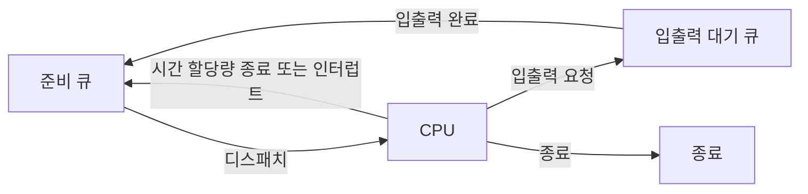

<Callout type="info">
  **이번 문서의 목표:** 이 파일을 다 읽으면 CPU 스케줄링이 왜 필요한지, 무엇을 기준으로 스케줄링 알고리즘의 좋고 나쁨을 평가하는지, 선점형과 비선점형이 어떻게 다른지를 설명하고 다음 편의 계산 문제에 들어갈 준비를 마칠 수 있다.
</Callout>

## CPU 스케줄링은 왜 필요한가

5편에서 다중 프로그래밍과 시분할 시스템을 배우며 "메모리에 여러 프로세스를 동시에 올려놓고 CPU를 번갈아 준다"고 했다. 그런데 CPU는 한 순간에 하나의 프로세스만 실행할 수 있다. 준비 큐(ready queue)에 프로세스가 5개 있다면, 이 중 **어떤 프로세스에게 먼저, 얼마 동안 CPU를 줄 것인가**를 결정하는 규칙이 필요하다. 이 결정을 내리는 운영체제의 구성 요소를 **CPU 스케줄러**(scheduler)라 하고, 그 규칙을 **CPU 스케줄링 알고리즘**이라 한다.

> **쉽게 말하면:** CPU 스케줄링은 손님이 여러 명 대기 중인 창구에서 "다음 손님을 어떤 순서로, 얼마나 오래 응대할지" 정하는 규칙이다.

6편에서 배운 프로세스 상태도를 다시 떠올려 보자. 프로세스는 준비(ready) 상태의 큐에서 기다리다가, 스케줄러가 선택하면 실행(running) 상태로 넘어간다. 이 "선택하는 행위"를 **디스패치**(dispatch)라 하고, 이를 담당하는 운영체제 모듈을 **디스패처**(dispatcher)라 한다. 스케줄러가 "누구를 다음에 실행할지 결정"하는 정책 담당자라면, 디스패처는 그 결정에 따라 "실제로 CPU를 넘기는 작업(문맥 교환, 사용자 모드 전환, 프로그램 재개)"을 수행하는 실행 담당자다.

디스패처가 하나의 프로세스에서 다른 프로세스로 CPU 제어권을 넘기는 데 걸리는 시간을 **디스패치 지연**(dispatch latency)이라 한다. 이 지연 시간 자체도 순수한 오버헤드이므로, 스케줄링 정책을 설계할 때는 "얼마나 자주 스케줄링 결정을 내리는가"도 함께 고려해야 한다. 너무 자주 바꾸면 디스패치 지연이 누적되어 손해다.

## 스케줄링 평가 기준 (성능 지표)

어떤 스케줄링 알고리즘이 "좋다"는 것을 판단하려면 기준이 있어야 한다. 독학사 시험에서는 이 다섯 가지 지표의 정의와, "값이 클수록 좋은지 작을수록 좋은지"를 정확히 구분하는 문제가 자주 나온다.

| 지표 | 정의 | 좋은 방향 |
|------|------|------|
| CPU 이용률(CPU utilization) | CPU가 놀지 않고 일하는 시간의 비율 | 높을수록 좋음 |
| 처리량(throughput) | 단위 시간당 완료되는 프로세스 개수 | 높을수록 좋음 |
| 반환 시간(turnaround time) | 프로세스가 시스템에 들어온 순간부터 완료될 때까지 걸린 총 시간 | 낮을수록 좋음 |
| 대기 시간(waiting time) | 프로세스가 준비 큐에서 실제로 대기한 시간의 합 | 낮을수록 좋음 |
| 응답 시간(response time) | 요청이 들어온 후 첫 응답(첫 실행 시작)까지 걸린 시간 | 낮을수록 좋음 |

이 다섯 지표 중 다음 편의 계산 문제에서 실제로 손으로 구하게 될 것은 **반환 시간과 대기 시간**이다. 정의를 수식으로 정리하면 다음과 같다.

$$
\text{반환 시간} = \text{완료 시각} - \text{도착 시각}
$$

- 완료 시각: 프로세스가 CPU에서 마지막 실행을 끝내고 종료된 시각
- 도착 시각: 프로세스가 준비 큐에 처음 들어온 시각

$$
\text{대기 시간} = \text{반환 시간} - \text{실행(버스트) 시간}
$$

- 실행 시간(burst time, CPU 버스트 시간): 그 프로세스가 CPU를 실제로 사용해야 하는 총 시간
- 즉 대기 시간은 "전체 걸린 시간에서 실제로 일한 시간을 뺀 나머지", 곧 순수하게 기다리기만 한 시간이다

> **자주 틀리는 점:** 대기 시간을 "준비 큐에 처음 들어가서부터 처음 실행되기까지의 시간"으로만 생각하기 쉽다. 그러나 라운드 로빈처럼 한 프로세스가 여러 번 끊겼다가 재개되는 스케줄링에서는, **중간에 실행이 끊기고 다시 준비 큐로 돌아가 기다린 시간까지 전부 합산**해야 정확한 대기 시간이 된다. 그래서 실무적으로는 위 공식(반환 시간 − 실행 시간)으로 한 번에 구하는 것이 실수를 줄이는 방법이다.

이 지표들 사이에는 트레이드오프(trade-off, 상충 관계)가 있다. 예를 들어 CPU 이용률과 처리량을 극대화하는 정책은 짧은 작업을 이것저것 자주 스케줄링해야 할 수 있는데, 이는 개별 프로세스의 응답 시간을 들쭉날쭉하게 만들 수 있다. "모든 지표를 동시에 최고로 만드는 완벽한 알고리즘은 없다"는 것이 8편에서 여러 알고리즘을 비교하는 이유다.

## 선점형 스케줄링과 비선점형 스케줄링

CPU 스케줄링 결정은 다음 네 가지 상황에서 일어날 수 있다.

1. 프로세스가 실행 상태에서 대기 상태로 바뀔 때(예: 입출력 요청)
2. 프로세스가 실행 상태에서 종료될 때
3. 프로세스가 실행 상태에서 준비 상태로 바뀔 때(예: 인터럽트 발생)
4. 프로세스가 대기 상태에서 준비 상태로 바뀔 때(예: 입출력 완료)

이 중 1번과 2번만 허용하는 스케줄링을 **비선점형**(non-preemptive), 3번과 4번까지 허용하는 스케줄링을 **선점형**(preemptive)이라 한다.

### 비선점형 스케줄링 (non-preemptive scheduling)

한 프로세스가 CPU를 잡으면, **그 프로세스가 스스로 CPU를 반납(종료 또는 입출력 요청)할 때까지** 다른 프로세스가 끼어들 수 없다. 6편의 상태 전이도에서 "실행 → 준비"로 가는 화살표(선점)가 아예 일어나지 않는 방식이다.

- 장점: 문맥 교환이 자주 일어나지 않아 오버헤드가 적다. 구현이 단순하다.
- 단점: 실행 시간이 긴 프로세스 하나가 CPU를 오래 붙잡으면, 뒤에 대기하는 짧은 프로세스들이 한없이 기다려야 한다.

### 선점형 스케줄링 (preemptive scheduling)

더 우선순위가 높은 프로세스가 나타나거나 시간 할당량이 끝나면, **실행 중이던 프로세스라도 강제로 CPU를 빼앗아 다른 프로세스에게 줄 수 있다.** 현대의 시분할 시스템은 거의 대부분 선점형이다.

- 장점: 응답 시간을 짧게 유지할 수 있어 대화형(interactive) 시스템에 적합하다. 중요한 작업을 빠르게 처리할 수 있다.
- 단점: 문맥 교환이 자주 일어나 오버헤드가 커진다. 여러 프로세스가 동시에 공유 자원에 접근하다 중간에 끊기면 데이터 일관성 문제(경쟁 조건, race condition)가 발생할 수 있다 — 이 문제는 9~10편의 동기화 주제로 이어진다.

| 구분 | 비선점형 | 선점형 |
|------|------|------|
| CPU 반납 시점 | 프로세스 스스로 종료·대기 상태 진입 시 | 더 급한 프로세스 등장, 시간 할당량 만료 시 강제 |
| 문맥 교환 빈도 | 적음 | 많음 |
| 오버헤드 | 낮음 | 높음 |
| 응답성 | 낮음(긴 작업이 짧은 작업을 막을 수 있음) | 높음 |
| 대표 알고리즘(다음 편) | FCFS, 비선점 SJF, 비선점 우선순위 | SRTF, RR, 선점 우선순위 |

> **비유:** 비선점형은 한 사람이 발표를 끝까지 마치고 나서야 다음 사람이 발표를 시작할 수 있는 세미나이고, 선점형은 사회자가 "시간 다 됐습니다, 다음 분!"이라고 중간에 끊고 순서를 넘기는 세미나다.

## 스케줄링 큐와 다단계 관점

준비 큐(ready queue)는 CPU를 기다리는 프로세스들의 대기 줄이다. 입출력을 기다리는 프로세스들은 각 장치별 **대기 큐**(device queue, 또는 waiting queue)에 따로 들어간다. 프로세스는 일생 동안 준비 큐와 여러 대기 큐 사이를 오간다.

이 그림은 6편의 상태 전이도를 큐 중심으로 다시 그린 것이다. 스케줄러는 이 그림에서 "준비 큐 → CPU" 화살표가 일어날 때마다 누구를 보낼지 결정하는 주체다. 이 결정 방식이 무엇이냐에 따라 다음 편에서 배울 FCFS, SJF, SRTF, RR, 우선순위, HRRN 같은 이름이 붙는다.

## 스케줄러의 세 종류(장기·중기·단기)

시스템에 따라 스케줄링 결정을 내리는 계층이 여러 개로 나뉘기도 한다. 독학사 시험에서는 이름과 역할을 정의 수준으로 구분할 수 있으면 충분하다.

- **장기 스케줄러(long-term scheduler, job scheduler)**: 디스크에 대기 중인 작업 중 어떤 것을 메모리에 적재해 준비 큐에 넣을지 결정한다. 메모리에 올라가는 프로세스 수(다중 프로그래밍 정도)를 조절한다. 상대적으로 드물게 호출된다.
- **단기 스케줄러(short-term scheduler, CPU scheduler)**: 준비 큐의 프로세스 중 누구에게 다음 CPU를 줄지 결정한다. 매우 자주(밀리초 단위로) 호출되므로 속도가 빨라야 한다. 8편에서 다루는 알고리즘들이 바로 이 단기 스케줄러의 정책이다.
- **중기 스케줄러(medium-term scheduler)**: 메모리가 부족해지면 일부 프로세스를 통째로 디스크로 내보냈다가(스와핑, swapping) 나중에 다시 불러들이는 결정을 담당한다. 다중 프로그래밍 정도를 완화해 시스템 부하를 조절한다.

| 스케줄러 | 대상 전이 | 호출 빈도 |
|------|------|------|
| 장기 스케줄러 | 생성 → 준비(적재) | 드묾(초·분 단위) |
| 중기 스케줄러 | 준비/대기 ↔ 스왑아웃 | 중간 |
| 단기 스케줄러 | 준비 → 실행(디스패치) | 매우 잦음(밀리초 단위) |

## 핵심 정리

- CPU 스케줄러는 준비 큐에서 다음에 실행할 프로세스를 결정하고, 디스패처는 그 결정을 실제 문맥 교환으로 수행하며 이때 걸리는 시간이 디스패치 지연이다.
- 평가 지표는 CPU 이용률·처리량(높을수록 좋음), 반환 시간·대기 시간·응답 시간(낮을수록 좋음)이며, 반환 시간 = 완료 시각 − 도착 시각, 대기 시간 = 반환 시간 − 실행 시간이다.
- 비선점형은 프로세스가 스스로 CPU를 반납할 때까지 기다리고, 선점형은 시간 할당량 만료나 우선순위 역전 시 강제로 CPU를 빼앗을 수 있다.
- 모든 지표를 동시에 최적화하는 알고리즘은 없으며, 이 상충 관계가 다음 편에서 여러 알고리즘을 비교하는 이유다.
- 장기·중기·단기 스케줄러는 각각 다중 프로그래밍 정도 조절, 스와핑, CPU 배정이라는 서로 다른 층위의 결정을 담당한다.

## 마무리 복습

<Quiz
  questionNumber={1}
  question="CPU 스케줄링 평가 지표 중 값이 클수록 바람직한 것으로 옳게 묶인 것은?"
  options={['대기 시간, 반환 시간', 'CPU 이용률, 처리량', '응답 시간, 대기 시간', '반환 시간, 응답 시간']}
  correctAnswer={2}
  explanation="CPU 이용률과 처리량은 값이 클수록 좋은 지표다. 반면 반환 시간, 대기 시간, 응답 시간은 값이 작을수록 좋은 지표다."
  optionExplanations={['대기 시간과 반환 시간은 둘 다 작을수록 좋은 지표다.', '정답이다. CPU 이용률과 처리량은 높을수록 시스템 성능이 좋다고 평가된다.', '응답 시간과 대기 시간은 둘 다 작을수록 좋은 지표다.', '반환 시간과 응답 시간은 둘 다 작을수록 좋은 지표다.']}
/>

<Quiz
  questionNumber={2}
  question="프로세스의 도착 시각이 0, 실행(버스트) 시간이 5, 완료 시각이 12일 때 이 프로세스의 대기 시간은?"
  options={['5', '7', '12', '17']}
  correctAnswer={2}
  explanation="반환 시간은 완료 시각에서 도착 시각을 뺀 값이므로 12 − 0 = 12다. 대기 시간은 반환 시간에서 실행 시간을 뺀 값이므로 12 − 5 = 7이다."
  optionExplanations={['5는 실행 시간 자체이며 대기 시간이 아니다.', '정답이다. 반환 시간 12에서 실행 시간 5를 뺀 7이 대기 시간이다.', '12는 완료 시각이며 반환 시간과 혼동한 값이다.', '17은 완료 시각과 실행 시간을 더한 잘못된 계산 결과다.']}
/>

<Quiz
  questionNumber={3}
  question="비선점형(non-preemptive) 스케줄링에 대한 설명으로 옳은 것은?"
  options={['시간 할당량이 끝나면 강제로 다른 프로세스에게 CPU를 넘긴다', '더 우선순위가 높은 프로세스가 나타나면 즉시 CPU를 빼앗는다', '실행 중인 프로세스가 스스로 종료하거나 입출력을 요청할 때까지 CPU를 유지한다', '실행 상태에서 준비 상태로 전이하는 화살표가 자주 발생한다']}
  correctAnswer={3}
  explanation="비선점형 스케줄링에서는 프로세스가 CPU를 잡으면 스스로 종료하거나 입출력을 요청해 대기 상태로 들어갈 때까지 다른 프로세스가 끼어들 수 없다. 실행에서 준비로 강제 전이되는 선점이 일어나지 않는다."
  optionExplanations={['시간 할당량 만료에 따른 강제 전환은 선점형 스케줄링의 특징이다.', '우선순위 역전에 따른 즉시 선점은 선점형 스케줄링의 특징이다.', '정답이다. 스스로 CPU를 반납할 때까지 기다리는 것이 비선점형의 정의다.', '실행에서 준비로의 전이(선점)는 비선점형에서는 일어나지 않는다.']}
/>

<Quiz
  questionNumber={4}
  question="선점형 스케줄링의 단점으로 가장 적절한 것은?"
  options={['긴 작업이 짧은 작업을 오래 막아 응답성이 나빠진다', '문맥 교환이 잦아져 오버헤드가 커지고 공유 자원 접근 시 데이터 일관성 문제가 생길 수 있다', '구현이 매우 복잡해 어떤 시스템에도 적용할 수 없다', '입출력 요청이 있는 프로세스를 처리할 수 없다']}
  correctAnswer={2}
  explanation="선점형 스케줄링은 실행 중인 프로세스라도 강제로 CPU를 빼앗을 수 있어 문맥 교환이 잦아지고 그만큼 오버헤드가 커진다. 또한 실행이 중간에 끊기면서 공유 자원에 접근하던 프로세스가 일관성 문제(경쟁 조건)를 유발할 수 있다."
  optionExplanations={['이는 비선점형 스케줄링의 단점이다. 선점형은 오히려 응답성을 높인다.', '정답이다. 잦은 문맥 교환에 따른 오버헤드와 동기화 문제가 선점형의 대표적 단점이다.', '선점형은 현대 시분할 시스템 대부분에서 실제로 널리 쓰이고 있다.', '입출력 요청은 선점형·비선점형 모두에서 정상적으로 처리되는 상황이다.']}
/>

<Quiz
  questionNumber={5}
  question="준비 큐의 프로세스 중 다음에 CPU를 배정받을 프로세스를 선택하고 실제로 문맥 교환을 수행해 CPU 제어권을 넘기는 운영체제 구성 요소를 각각 옳게 짝지은 것은?"
  options={['스케줄러 - 디스패처', '디스패처 - 스케줄러', 'PCB - 스케줄러', '스케줄러 - PCB']}
  correctAnswer={1}
  explanation="스케줄러는 정책을 세워 다음에 실행할 프로세스를 선택하는 결정 주체이고, 디스패처는 그 결정에 따라 실제 문맥 교환을 수행해 CPU 제어권을 넘기는 실행 주체다."
  optionExplanations={['정답이다. 선택은 스케줄러가, 실제 전환은 디스패처가 담당한다.', '역할이 뒤바뀌어 있다. 디스패처는 선택이 아니라 전환을 수행한다.', 'PCB는 프로세스 정보를 담는 자료구조일 뿐 선택이나 전환을 수행하는 주체가 아니다.', 'PCB는 결정을 수행하는 주체가 아니라 정보를 담는 자료구조다.']}
/>

<Quiz
  questionNumber={6}
  question="장기 스케줄러(long-term scheduler)의 역할로 옳은 것은?"
  options={['준비 큐의 프로세스 중 다음에 CPU를 받을 프로세스를 밀리초 단위로 결정한다', '디스크에 대기 중인 작업 중 어떤 것을 메모리에 적재해 준비 큐에 넣을지 결정한다', '메모리가 부족할 때 프로세스를 디스크로 스와핑아웃할지 결정한다', '문맥 교환 시 레지스터 값을 저장·복원한다']}
  correctAnswer={2}
  explanation="장기 스케줄러는 디스크에 있는 작업 중 어떤 것을 메모리에 올려 준비 큐에 넣을지 결정함으로써 시스템의 다중 프로그래밍 정도를 조절한다. 상대적으로 드물게 호출된다."
  optionExplanations={['이는 단기 스케줄러의 역할이며 매우 자주 호출된다.', '정답이다. 작업을 메모리에 적재할지 결정하는 것이 장기 스케줄러의 정의다.', '이는 중기 스케줄러의 역할이다.', '이는 디스패처가 수행하는 문맥 교환 작업이다.']}
/>

## 참고 자료

- [KOCW 운영체제 강의자료 - 스케줄링/동기화/가상메모리](http://contents.kocw.or.kr/document/lec/2011_2/chungbuk/LeeJongyun_01.pdf)
- [길벗 운영체제 도서 정보](https://www.gilbut.co.kr/book/view?bookcode=BN004335)
- [국가평생교육진흥원 과목별 평가영역](https://bdes.nile.or.kr/nile/study/nStudy2_1.do)
