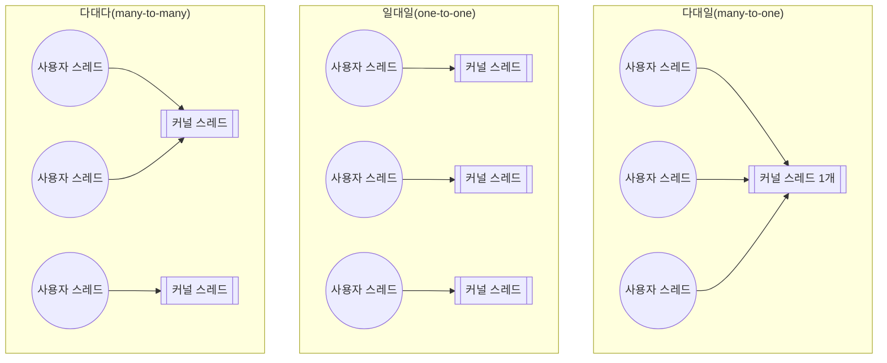
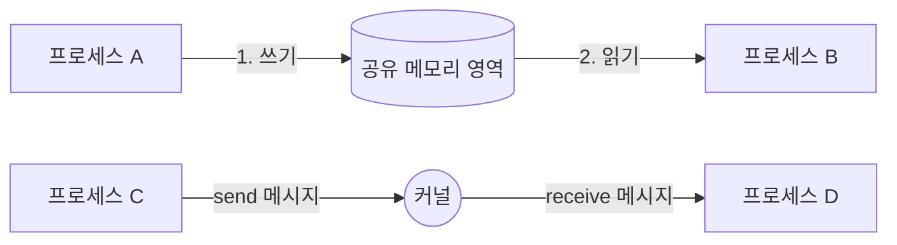

<Callout type="info">
  **이번 문서의 목표:** 이 파일을 다 읽으면 스레드 모델(다대일·일대일·다대다)을 구분하고, 공유 메모리 방식과 메시지 전달 방식의 IPC(Inter-Process Communication, 프로세스 간 통신)를 비교하며, "경쟁 조건"이 왜 생기는지 변수 값을 직접 추적해 설명할 수 있다.
</Callout>

## 왜 프로세스 하나로는 부족한가

06편에서 프로세스(process)는 "실행 중인 프로그램"이며, 운영체제가 PCB(Process Control Block, 프로세스 제어 블록)로 그 상태를 관리한다고 배웠습니다. 그런데 프로세스 하나를 새로 만드는 일은 생각보다 비쌉니다. 운영체제는 새 프로세스를 위해 독립된 주소 공간(메모리 영역), 파일 디스크립터 테이블, PCB를 통째로 새로 준비해야 하고, 프로세스 사이에는 메모리가 격리되어 있어서 데이터를 주고받으려면 운영체제를 거쳐야 합니다.

그런데 워드 프로세서가 "화면을 그리는 일"과 "맞춤법을 검사하는 일"을 동시에 하고 싶다면 어떨까요. 이 두 작업은 같은 문서 데이터를 공유해야 하는데, 완전히 분리된 프로세스 두 개로 만들면 데이터를 주고받는 비용이 매번 발생합니다. 이런 상황을 위해 운영체제는 프로세스보다 더 가벼운 실행 단위인 **스레드**(thread)를 제공합니다.

> **쉽게 말하면:** 프로세스가 "집 한 채"라면, 스레드는 그 집 안에서 함께 사는 "가족 구성원"입니다. 가족은 같은 집(주소 공간)을 공유하지만, 각자 따로 움직이며(개별 실행 흐름) 할 일을 합니다.

## 1. 스레드란 무엇인가 — 프로세스와의 관계

**스레드**(thread, 실 가닥이라는 뜻)는 프로세스 내부에서 독립적으로 실행되는 하나의 흐름입니다. 04편에서 스레드의 이름만 먼저 소개했는데, 여기서는 스레드가 프로세스와 정확히 무엇을 공유하고 무엇을 따로 갖는지 짚습니다.

| 구성 요소 | 프로세스 단위(공유되지 않음) | 스레드 단위(각 스레드가 개별로 가짐) |
|-----------|------------------------------|--------------------------------------|
| 코드(텍스트) 영역 | 같은 프로세스의 스레드끼리 공유 | – |
| 데이터·힙(heap) 영역 | 같은 프로세스의 스레드끼리 공유 | – |
| 열린 파일, 소켓 등 자원 | 같은 프로세스의 스레드끼리 공유 | – |
| 프로그램 카운터(PC) | – | 스레드마다 별도 |
| 레지스터 값 | – | 스레드마다 별도 |
| 스택(stack) | – | 스레드마다 별도 |

**자주 틀리는 점**: "스레드는 스택도 공유한다"는 진술은 틀렸습니다. 스택을 공유하면 함수 호출 정보(지역 변수, 복귀 주소)가 서로 뒤섞여 각 스레드가 독립적으로 실행될 수 없습니다. 스레드가 독립적으로 실행되려면 최소한 PC·레지스터·스택은 자신만의 것이어야 합니다.

이렇게 코드와 데이터를 공유하기 때문에 스레드를 새로 만드는 비용은 프로세스를 새로 만드는 비용보다 훨씬 쌉니다. 문맥 전환(context switching, 06편)도 마찬가지입니다. 같은 프로세스 안의 스레드끼리 전환할 때는 주소 공간을 바꿀 필요가 없어, 다른 프로세스로 전환하는 것보다 빠릅니다.

## 2. 사용자 스레드와 커널 스레드 — 누가 스케줄링하는가

04편에서 사용자 스레드(user thread)와 커널 스레드(kernel thread)라는 이름만 소개했습니다. 둘의 차이는 **누가 스레드의 존재를 알고 스케줄링하느냐**입니다.

- **사용자 스레드**: 커널(kernel, 운영체제의 핵심 부분) 개입 없이 사용자 영역의 스레드 라이브러리가 만들고 스케줄링합니다. 운영체제 입장에서는 프로세스 하나만 보일 뿐, 그 안에 스레드가 몇 개 있는지 모릅니다. 생성·전환이 빠르지만, 스레드 하나가 시스템 호출(system call, 01편)로 블로킹(blocking, 작업이 끝날 때까지 멈추는 것)되면 커널은 프로세스 전체가 멈춘 것으로 착각해 같은 프로세스의 다른 스레드까지 함께 멈춥니다.
- **커널 스레드**: 커널이 직접 존재를 알고 스케줄링하는 스레드입니다. 스레드 하나가 블로킹되어도 커널이 같은 프로세스의 다른 스레드를 계속 실행할 수 있고, 멀티코어 환경에서 여러 스레드를 실제로 동시에 서로 다른 코어에 배정할 수 있습니다. 다만 스레드를 만들거나 전환할 때마다 커널을 거쳐야 하므로 사용자 스레드보다 느립니다.

### 다중 스레드 매핑 모델

사용자 스레드와 커널 스레드를 몇 대 몇으로 연결하느냐에 따라 세 가지 모델로 나뉩니다.



| 모델 | 특징 | 약점 |
|------|------|------|
| 다대일 | 여러 사용자 스레드를 커널 스레드 1개에 매핑. 생성·전환이 매우 빠름 | 커널 스레드가 하나뿐이라 진짜 병렬 실행 불가, 하나가 블로킹되면 전부 정지 |
| 일대일 | 사용자 스레드 하나마다 커널 스레드 하나. 진짜 병렬 실행 가능, 블로킹 문제 없음 | 스레드가 많아질수록 커널 스레드 생성 부담 증가 |
| 다대다 | 사용자 스레드 여러 개를 그보다 적거나 같은 수의 커널 스레드에 유연하게 매핑 | 구현이 복잡함 |

**자주 틀리는 점**: "다대일 모델은 멀티코어에서 스레드를 병렬로 실행할 수 있다"는 오답 보기가 자주 나옵니다. 다대일은 커널이 보는 실행 단위가 커널 스레드 1개뿐이므로, 사용자 스레드가 아무리 많아도 한 번에 하나만 실행됩니다.

## 3. IPC — 프로세스 사이에 데이터를 주고받는 두 가지 길

**IPC**(Inter-Process Communication, 프로세스 간 통신)는 서로 독립된 메모리 공간을 가진 프로세스들이 데이터를 주고받는 방법입니다. 스레드는 같은 프로세스 안에서 메모리를 공유하니 IPC가 필요 없지만, 프로세스는 메모리가 격리되어 있어서 반드시 운영체제가 마련한 통로를 거쳐야 합니다. 이 통로는 크게 두 가지로 나뉩니다.



### 공유 메모리(shared memory) 방식

운영체제가 두 프로세스의 주소 공간 일부를 같은 물리 메모리에 매핑해 줍니다. 이후에는 두 프로세스가 마치 자기 자신의 변수를 읽고 쓰듯 그 영역에 접근합니다.

- **장점**: 한 번 매핑을 설정하고 나면 데이터를 주고받을 때마다 커널을 거치지 않으므로 속도가 빠릅니다.
- **단점**: 여러 프로세스가 같은 영역을 동시에 건드릴 수 있으므로, 순서를 맞추는 책임(동기화)이 전부 프로그래머 몫입니다. 이 동기화 문제는 10편에서 본격적으로 다룹니다.

### 메시지 전달(message passing) 방식

프로세스가 커널이 관리하는 통로(메시지 큐, 파이프, 소켓 등)를 통해 `send`·`receive` 형태로 데이터를 주고받습니다.

- **장점**: 커널이 순서와 전달을 보장해 주므로 프로그래머가 직접 동기화를 신경 쓸 부담이 적고, 같은 컴퓨터 안이든 네트워크로 떨어진 다른 컴퓨터든 같은 방식으로 쓸 수 있습니다.
- **단점**: 메시지를 보낼 때마다 커널을 거쳐야 하므로(시스템 호출 발생) 공유 메모리보다 느립니다.

| 비교 항목 | 공유 메모리 | 메시지 전달 |
|-----------|-------------|--------------|
| 통신 속도 | 빠름(커널 개입은 설정 시 1회) | 상대적으로 느림(매번 커널 개입) |
| 동기화 책임 | 프로그래머(응용 프로그램) | 대부분 커널이 관리 |
| 원거리(네트워크) 통신 | 부적합 | 적합 |
| 대표 예 | POSIX 공유 메모리, 매핑된 파일 | 파이프, 메시지 큐, 소켓 |

## 4. 경쟁 조건 — 값으로 직접 확인하기

**경쟁 조건**(race condition)은 두 개 이상의 실행 흐름(프로세스 또는 스레드)이 같은 데이터를 동시에 건드릴 때, 실행 순서(타이밍)에 따라 결과가 달라지는 상황을 말합니다. "경쟁"이라는 이름은 누가 먼저 그 데이터에 접근하느냐에 따라 최종 값이 바뀐다는 뜻에서 붙었습니다.

> **쉽게 말하면:** 두 사람이 같은 통장 잔액을 동시에 고쳐 쓰면, 나중에 저장한 사람의 값이 앞사람의 작업을 지워버릴 수 있습니다.

은행 계좌 잔액이 `balance = 1000`원이고, 스레드 A는 500원을 입금하고 스레드 B는 300원을 출금한다고 합시다. 두 스레드 모두 이 작업을 다음 세 단계(고수준 코드 한 줄이 실제로는 여러 개의 기계어 명령으로 쪼개진다는 뜻입니다)로 수행합니다.

```
1단계: register = balance   (메모리에서 값을 읽어 레지스터에 저장)
2단계: register = register ± 금액   (레지스터에서 계산)
3단계: balance = register   (레지스터 값을 다시 메모리에 저장)
```

두 스레드가 순서대로(교차 없이) 실행되면 결과는 `1000 + 500 - 300 = 1200`원이 되어야 정상입니다. 하지만 스케줄러가 두 스레드를 다음과 같이 교차 실행시킨다고 해봅시다.

| 시각 | 실행 스레드 | 동작 | register 값 | balance 값 |
|------|-------------|------|--------------|-------------|
| t1 | A | register = balance | 1000 | 1000 |
| t2 | A | register = register + 500 | 1500 | 1000 |
| t3 | B | register = balance | 1000 | 1000 |
| t4 | B | register = register - 300 | 700 | 1000 |
| t5 | A | balance = register | 1500 | **1500** |
| t6 | B | balance = register | 700 | **700** |

t5에서 A가 계산한 1500원이 저장되지만, t6에서 B가 t3에서 이미 읽어 두었던 (A의 입금이 반영되기 전) 1000원을 기준으로 계산한 700원이 그대로 덮어씁니다. 최종 잔액은 700원이 되어, A가 입금한 500원이 통째로 사라집니다. 정상적인 답 1200원과 완전히 다른 값이 나온 이유는 **B가 balance를 읽은 시점(t3)이 A가 balance에 새 값을 쓴 시점(t5)보다 앞섰기 때문**입니다.

### 결과 해석

이 예시가 보여주는 핵심은 "코드 한 줄이 원자적(atomic, 더 이상 쪼개지지 않고 한 번에 실행됨)이라고 착각하면 안 된다"는 것입니다. `balance += 500` 같은 한 줄짜리 코드도 실제로는 읽기·계산·쓰기 세 단계로 나뉘고, 그 사이에 다른 스레드가 끼어들 여지가 생깁니다. 이렇게 여러 실행 흐름이 함께 접근하면 안 되는 코드 영역을 **임계 구역**(critical section)이라고 부르며, 이를 안전하게 보호하는 방법은 10편에서 다룹니다.

**자주 틀리는 점**: 경쟁 조건은 "프로그램에 버그가 있어서" 생기는 것이 아니라, 여러 실행 흐름이 공유 데이터에 접근하는 순서를 운영체제가 보장해 주지 않기 때문에 생깁니다. 코드 자체는 각 스레드 입장에서 틀린 곳이 없습니다.

## 핵심 정리

- 스레드는 코드·데이터·자원은 프로세스와 공유하고, PC·레지스터·스택만 개별로 가진 실행 흐름이다.
- 사용자 스레드는 커널이 모르는 스레드(빠르지만 블로킹에 취약), 커널 스레드는 커널이 직접 관리하는 스레드(느리지만 병렬 실행 가능)다.
- 다대일·일대일·다대다 모델은 사용자 스레드와 커널 스레드를 연결하는 비율이 다르며, 병렬성과 오버헤드가 서로 반대로 움직인다.
- IPC는 공유 메모리(빠르지만 동기화는 프로그래머 책임)와 메시지 전달(느리지만 커널이 순서를 보장)로 나뉜다.
- 경쟁 조건은 공유 데이터를 읽고-계산하고-쓰는 세 단계 사이에 다른 실행 흐름이 끼어들어, 실행 순서에 따라 결과가 달라지는 현상이다.

## 마무리 복습

<Quiz
  questionNumber={1}
  question="프로세스 내의 여러 스레드가 공통으로 공유하는 자원으로 옳은 것은?"
  options={['프로그램 카운터(PC)', '레지스터 값', '코드(텍스트) 영역', '스택']}
  correctAnswer={3}
  explanation="같은 프로세스에 속한 스레드들은 코드 영역, 데이터·힙 영역, 열린 파일 같은 자원을 공유한다. PC, 레지스터, 스택은 스레드마다 개별로 갖는다."
  optionExplanations={['PC는 스레드마다 독립적으로 가지는 값으로, 각 스레드가 다음에 실행할 명령의 위치를 따로 기록한다.', '레지스터도 스레드마다 독립적이어서 스레드 전환 시 저장·복원 대상이 된다.', '정답. 코드 영역은 프로세스 단위로 하나만 존재하며 모든 스레드가 함께 사용한다.', '스택은 함수 호출 정보를 담기 때문에 스레드마다 독립적이어야 각자 다른 흐름을 실행할 수 있다.']}
/>

<Quiz
  questionNumber={2}
  question="다대일(many-to-one) 스레드 모델의 특징으로 옳지 않은 것은?"
  options={['사용자 스레드 생성과 전환이 빠르다.', '멀티코어 환경에서 사용자 스레드들을 서로 다른 코어에서 동시에 실행할 수 있다.', '커널이 사용자 스레드의 존재를 알지 못한다.', '한 사용자 스레드가 블로킹되면 같은 프로세스의 다른 사용자 스레드도 함께 멈춘다.']}
  correctAnswer={2}
  explanation="다대일 모델은 여러 사용자 스레드를 커널 스레드 단 하나에 매핑하므로, 커널이 실제로 스케줄링하는 단위는 하나뿐이다. 따라서 사용자 스레드들은 멀티코어라도 동시에 실행될 수 없다."
  optionExplanations={['옳은 설명이다. 사용자 영역 라이브러리가 관리하므로 커널 개입 없이 빠르게 생성·전환된다.', '옳지 않은 설명이므로 정답이다. 커널 스레드가 하나뿐이므로 병렬 실행이 불가능하다.', '옳은 설명이다. 커널은 프로세스 하나만 인식하고 그 안의 사용자 스레드 개수는 모른다.', '옳은 설명이다. 커널 입장에서는 프로세스 전체가 블로킹된 것으로 보인다.']}
/>

<Quiz
  questionNumber={3}
  question="공유 메모리 방식과 메시지 전달 방식을 비교한 설명으로 옳은 것은?"
  options={['메시지 전달 방식은 동기화 책임을 전적으로 응용 프로그램이 진다.', '공유 메모리 방식은 커널 개입 없이 데이터를 주고받아 속도가 빠르지만 동기화는 프로그래머가 책임진다.', '공유 메모리 방식은 네트워크로 떨어진 프로세스 간 통신에 더 적합하다.', '메시지 전달 방식은 매핑 설정 이후 커널을 거치지 않는다.']}
  correctAnswer={2}
  explanation="공유 메모리는 매핑 이후 커널 개입 없이 직접 접근하므로 빠르지만, 동시 접근을 안전하게 조율하는 책임은 프로그래머에게 있다."
  optionExplanations={['메시지 전달 방식은 커널이 send·receive 순서를 관리해 동기화 부담을 상당 부분 줄여준다.', '정답. 공유 메모리는 속도가 빠른 대신 동기화를 직접 구현해야 한다.', '공유 메모리는 같은 컴퓨터 안에서만 가능하며, 원거리 통신에는 메시지 전달(소켓 등)이 적합하다.', '메시지 전달은 매번 send·receive 시스템 호출을 통해 커널을 거친다.']}
/>

<Quiz
  questionNumber={4}
  question="잔액 balance = 1000일 때 스레드 A(+500)와 스레드 B(-300)가 '읽기 → 계산 → 쓰기' 세 단계로 나뉘어 실행되다가, A가 읽은 뒤 B가 읽고, B가 먼저 쓰고 이어서 A가 쓰는 순서로 교차 실행되었다. 최종 balance 값은?"
  options={['1200', '700', '1500', '1000']}
  correctAnswer={3}
  explanation="A와 B 모두 balance가 1000일 때 값을 읽는다. B가 700을 계산해 먼저 저장하지만, 이어서 A가 자신이 읽었던 1000을 기준으로 계산한 1500을 그대로 덮어써 최종 값은 1500이 된다."
  optionExplanations={['1200은 두 연산이 교차 없이 순서대로 실행되었을 때만 나오는 정상적인 결과다.', '700은 B가 나중에 쓸 때 나오는 값이지만, 이 문제에서는 A가 마지막에 덮어쓴다.', '정답. A가 마지막에 자신이 읽은 1000을 기준으로 계산한 1500을 저장해 B의 계산 결과를 지운다.', '1000은 어느 스레드도 계산을 반영하지 못한 경우의 값으로, 이 시나리오에는 해당하지 않는다.']}
/>

<Quiz
  questionNumber={5}
  question="경쟁 조건(race condition)이 발생하는 근본적인 원인으로 가장 적절한 것은?"
  options={['프로그램 코드에 문법 오류가 있기 때문이다.', '공유 데이터에 대한 접근이 원자적으로 보장되지 않아 실행 순서에 따라 결과가 달라지기 때문이다.', 'CPU 클록 속도가 스레드마다 다르기 때문이다.', '커널 스레드 수가 사용자 스레드 수보다 적기 때문이다.']}
  correctAnswer={2}
  explanation="경쟁 조건은 여러 실행 흐름이 공유 데이터를 읽고-계산하고-쓰는 과정이 하나의 원자적 동작으로 보장되지 않아, 그 사이에 다른 흐름이 끼어들 때 발생한다."
  optionExplanations={['각 스레드의 코드 자체는 문법적으로 정상이며, 문제는 실행 순서의 겹침에서 발생한다.', '정답. 읽기-계산-쓰기가 쪼개질 수 있고 그 사이 다른 실행 흐름이 개입하기 때문에 결과가 타이밍에 따라 달라진다.', 'CPU 클록 속도 차이는 경쟁 조건의 직접적 원인이 아니다.', '스레드 매핑 비율은 경쟁 조건의 발생 여부와 직접적인 관련이 없다.']}
/>

## 참고 자료

- [운영체제_Study 저장소 README](https://github.com/yonghwankim-dev/OperatingSystem_Study/blob/main/README.md)
- [국가평생교육진흥원 독학학위제 - 과목별 평가영역](https://bdes.nile.or.kr/nile/study/nStudy2_1.do)
