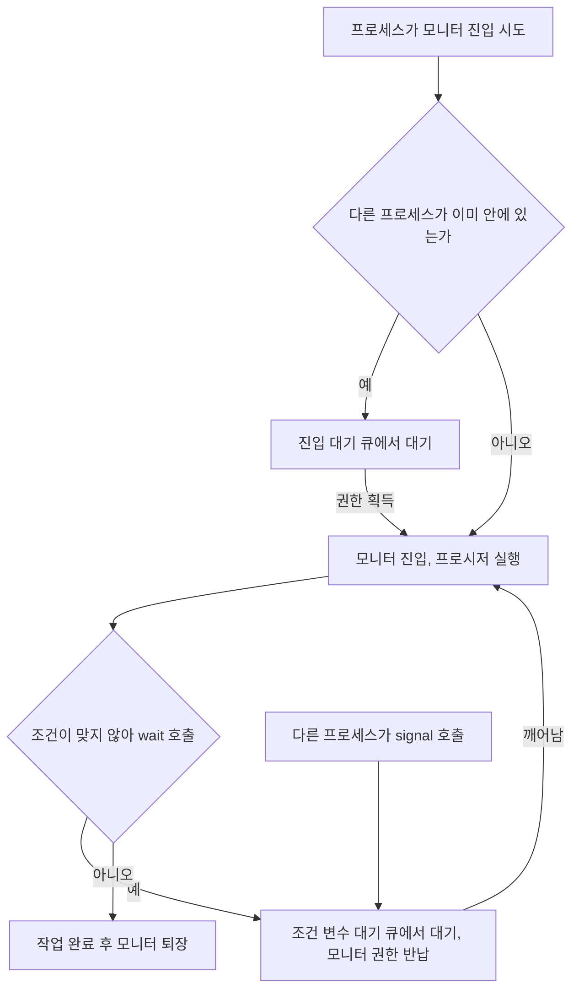

<Callout type="info">
  **이번 문서의 목표:** 이 파일을 다 읽으면 임계 구역 문제의 세 조건을 말할 수 있고, 세마포어의 P·V 연산이 일으키는 값 변화를 직접 계산하며, 세마포어·뮤텍스·모니터의 차이를 "옳지 않은 것 고르기" 유형에서 구분할 수 있다.
</Callout>

## 왜 규칙이 필요한가

09편에서 은행 잔액 예시로 경쟁 조건(race condition)을 직접 값으로 확인했습니다. 문제의 원인은 `balance = balance ± 금액` 같은 코드가 "읽기 → 계산 → 쓰기"라는 여러 단계로 쪼개지고, 그 사이에 다른 스레드가 끼어들 수 있다는 데 있었습니다. 이렇게 여러 실행 흐름이 동시에 실행되면 안 되는 코드 구간을 **임계 구역**(critical section)이라 부르고, 임계 구역을 안전하게 지키는 규칙을 만드는 문제를 **임계 구역 문제**(critical-section problem)라고 합니다.

> **쉽게 말하면:** 화장실 문에 잠금장치가 없으면 두 사람이 동시에 들어갈 수 있습니다. 임계 구역 문제는 "잠금장치를 어떻게 설계해야 안전하면서도 불편하지 않은가"를 푸는 문제입니다.

## 1. 임계 구역 문제의 3조건

임계 구역 문제를 올바르게 해결하는 규칙은 다음 세 조건을 **모두** 만족해야 합니다. 시험에서는 이 세 조건의 이름과 뜻을 서로 바꿔치기한 오답이 자주 나옵니다.

1. **상호 배제**(mutual exclusion): 한 프로세스(또는 스레드)가 임계 구역에서 실행 중이면, 다른 어떤 프로세스도 같은 임계 구역에 들어갈 수 없다.
2. **진행**(progress): 임계 구역이 비어 있고 들어가고 싶어 하는 프로세스가 있다면, 그 프로세스가 임계 구역에 들어가는 결정은 무한정 미뤄지지 않는다. 즉, 임계 구역에 들어가지 않는 프로세스들이 이 결정을 방해할 수 없다.
3. **한정 대기**(bounded waiting): 한 프로세스가 임계 구역에 들어가려고 요청한 뒤, 다른 프로세스들이 먼저 들어가는 횟수에 한계가 있어야 한다. 즉, 어떤 프로세스가 영원히 순서를 못 받는 **기아**(starvation) 상태가 되면 안 된다.

> **쉽게 말하면:** 상호 배제는 "동시에 한 명만", 진행은 "빈 화장실 앞에서 아무도 안 들어가고 서로 눈치만 보는 상황이 없어야 함", 한정 대기는 "새치기가 무한정 반복되어 한 사람이 영원히 못 들어가면 안 됨"입니다.

**자주 틀리는 점**: "상호 배제만 만족하면 임계 구역 문제가 해결된다"는 진술은 틀렸습니다. 상호 배제만 지키고 진행이나 한정 대기를 어기는 알고리즘도 만들 수 있는데(예: 무조건 프로세스 P1을 우선시하는 규칙), 이는 P2를 영원히 굶길 수 있으므로 올바른 해결책이 아닙니다.

## 2. 피터슨 알고리즘 — 소프트웨어만으로 푸는 방법

**피터슨 알고리즘**(Peterson's algorithm)은 특별한 하드웨어 명령 없이, 오직 두 프로세스가 공유하는 변수만으로 임계 구역 문제의 3조건을 모두 만족시키는 고전적인 소프트웨어 해법입니다. 두 프로세스 P0, P1이 있다고 할 때 다음 두 공유 변수를 씁니다.

- `turn`: 지금 누구 차례인지 나타내는 변수(0 또는 1).
- `flag[2]`: 각 프로세스가 "나는 임계 구역에 들어가고 싶다"는 의사를 표시하는 배열. `flag[i] = true`면 Pi가 들어가고 싶다는 뜻입니다.

프로세스 Pi(i는 0 또는 1, j는 반대편 프로세스 번호)의 코드는 다음과 같습니다.

```
flag[i] = true;        // "나 들어가고 싶다"고 표시
turn = j;               // 양보한다: 일단 상대방에게 차례를 넘김
while (flag[j] && turn == j) {
    // 상대방도 원하고, 지금이 상대방 차례라면 대기
}
// ---- 임계 구역 ----
flag[i] = false;        // 임계 구역을 나오며 의사 표시를 해제
```

이 알고리즘이 3조건을 만족하는 이유를 하나씩 확인해 보겠습니다.

- **상호 배제**: 두 프로세스가 동시에 임계 구역에 들어가려면 `turn`이 0과 1을 동시에 가리켜야 하는데, `turn`은 변수 하나이므로 한 값만 가질 수 있습니다. 따라서 반드시 한쪽만 대기 조건을 벗어나 먼저 들어갑니다.
- **진행**: 상대방이 임계 구역에 관심이 없다면(`flag[j] == false`) 대기 조건이 거짓이 되어 곧바로 진입할 수 있습니다.
- **한정 대기**: 한 프로세스가 임계 구역에서 나올 때마다 `flag`를 false로 바꾸고 `turn`을 상대에게 넘기므로, 대기 중인 프로세스는 상대방이 한 번 더 들어가면 반드시 자기 차례를 받습니다(최대 한 번만 새치기당함).

**자주 틀리는 점**: 피터슨 알고리즘은 이론적으로는 3조건을 만족하지만, 오늘날 대부분의 CPU가 사용하는 명령어 재배열(reordering) 최적화 환경에서는 추가 조치 없이는 정확히 동작하지 않을 수 있다는 점이 시험 지문에 언급되기도 합니다. 다만 독학사 수준에서는 "소프트웨어만으로 3조건을 만족시키는 대표적 해법"이라는 위치를 아는 것이 핵심입니다.

## 3. 세마포어 — 정수 하나로 순서를 통제하기

**세마포어**(semaphore, 철도의 신호기라는 뜻)는 정수형 변수 하나와, 그 변수를 안전하게 바꾸는 두 연산 `P`와 `V`로 이루어진 동기화 도구입니다. 값을 직접 읽고 쓰지 못하게 하고 오직 이 두 연산으로만 접근하게 만들어, 여러 프로세스가 동시에 값을 바꾸다 생기는 문제(이 역시 경쟁 조건입니다)를 막습니다.

- `P(S)` (Proberen, 네덜란드어로 "시도하다" — 흔히 `wait`라고도 부름): 세마포어 값을 1 감소시킨 뒤, 값이 음수면 그 프로세스는 대기한다.
- `V(S)` (Verhogen, 네덜란드어로 "증가시키다" — 흔히 `signal`이라고도 부름): 세마포어 값을 1 증가시키고, 대기 중인 프로세스가 있으면 하나를 깨운다.

의사코드로 쓰면 다음과 같습니다.

```
P(S): S = S - 1; if (S < 0) 대기;
V(S): S = S + 1; if (대기 중인 프로세스가 있으면) 하나를 깨움;
```

### 이진 세마포어로 상호 배제 구현하기 — 값 추적

세마포어 값을 0 또는 1만 쓰는 것을 **이진 세마포어**(binary semaphore)라 하고, 상호 배제에 그대로 쓸 수 있습니다. 세마포어 `S = 1`(임계 구역이 비어 있다는 뜻)에서 시작해, 프로세스 A와 B가 순서대로 임계 구역에 접근하는 과정을 표로 추적해 보겠습니다.

| 순서 | 동작 | S 값 변화 | 상태 |
|------|------|-----------|------|
| 0 | 초기값 | S = 1 | 임계 구역 비어 있음 |
| 1 | A가 `P(S)` 호출 | S = 1 - 1 = 0 | S ≥ 0이므로 A는 대기하지 않고 즉시 임계 구역 진입 |
| 2 | B가 `P(S)` 호출 | S = 0 - 1 = -1 | S < 0이므로 B는 대기 상태로 전환 |
| 3 | A가 임계 구역 작업을 마치고 `V(S)` 호출 | S = -1 + 1 = 0 | 대기 중인 프로세스(B)가 있으므로 B를 깨움 |
| 4 | B가 임계 구역 진입 후 작업, `V(S)` 호출 | S = 0 + 1 = 1 | 대기자가 없으므로 값만 증가, 임계 구역 다시 비어 있음 |

**결과 해석**: S 값이 음수라는 것은 곧 "그 절댓값만큼의 프로세스가 대기 중"이라는 뜻입니다. 2단계에서 S = -1이 된 순간, 대기자 수가 1명이라는 사실을 값 자체가 보여줍니다. 이 값의 부호와 크기가 세마포어의 핵심 아이디어입니다.

### 카운팅 세마포어

값을 0/1로 제한하지 않고 N까지 쓰는 것을 **카운팅 세마포어**(counting semaphore)라 하며, 동시에 접근을 허용할 자원의 개수가 N개일 때 씁니다. 예를 들어 프린터가 3대 있다면 `S = 3`에서 시작해, `P` 연산으로 프린터를 하나씩 빌리고 `V` 연산으로 반납합니다. 넷째 요청이 오면 S는 -1이 되어 그 프로세스는 프린터가 반납될 때까지 대기합니다.

**자주 틀리는 점**: "세마포어 값은 항상 0 이상이다"라는 진술은 틀렸습니다. 대기 중인 프로세스가 있을 때는 값이 음수가 될 수 있습니다(정의 방식에 따라 값 자체를 음수로 두지 않고 별도의 대기 큐 길이로 표현하는 구현도 있지만, 앞서 본 것처럼 값을 그대로 감소시키는 정의도 널리 쓰입니다).

## 4. 뮤텍스 vs 세마포어 vs 모니터 — 셋의 경계

이 세 용어는 "동기화 도구"라는 큰 범주 안에서 서로 목적과 형태가 다릅니다. 시험에서 이 셋을 서로 바꿔치기하는 문제가 자주 나오므로 표로 정리합니다.

| 항목 | 뮤텍스(mutex) | 세마포어(semaphore) | 모니터(monitor) |
|------|----------------|----------------------|-------------------|
| 값의 범위 | 잠김/열림 두 상태(이진 세마포어와 비슷) | 정수(0/1 또는 N까지) | 값이 아니라 언어 차원의 구조 |
| 소유 개념 | 있음(잠근 스레드만 풀 수 있음) | 없음(다른 프로세스가 V를 호출해도 됨) | 모니터 진입 자체가 자동으로 상호 배제됨 |
| 구현 위치 | 주로 상호 배제 전용 락(lock) | 상호 배제 + 순서 제어(신호) 모두 가능 | 프로그래밍 언어 또는 라이브러리가 제공하는 고수준 구조 |
| 사용 방식 | `lock()` / `unlock()` | `P()` / `V()` | 모니터 내부 프로시저 호출만으로 자동 보호 |

**뮤텍스**(mutex, mutual exclusion의 줄임말)는 오직 상호 배제만을 위한 잠금 장치로, "이 락을 잠근 스레드만 풀 수 있다"는 소유 개념이 있습니다. 반면 세마포어는 P를 호출한 프로세스와 V를 호출한 프로세스가 달라도 되므로, 상호 배제뿐 아니라 "이 작업이 끝났다"는 신호를 다른 프로세스에게 보내는 용도로도 씁니다.

**모니터**(monitor)는 공유 데이터와 그 데이터를 다루는 프로시저(절차)를 하나의 캡슐 안에 묶고, 그 캡슐에 한 번에 한 프로세스만 들어가도록 프로그래밍 언어 차원에서 자동으로 보장하는 고수준 동기화 구조입니다. 프로그래머가 직접 `P`·`V`를 호출하지 않아도 되어 실수(예: `V` 호출을 깜빡함)를 줄여 줍니다.

### 조건 변수 — 모니터 안에서 순서를 기다리는 방법

모니터에 진입한 프로세스가 "지금은 조건이 안 맞으니 다른 프로세스가 그 조건을 만들 때까지 기다리고 싶다"고 할 때 쓰는 것이 **조건 변수**(condition variable)입니다. 조건 변수는 두 연산을 제공합니다.

- `wait()`: 호출한 프로세스를 그 조건 변수의 대기 큐에 넣고, 모니터에 대한 배타적 권한을 잠시 내려놓는다.
- `signal()`: 그 조건 변수의 대기 큐에서 기다리던 프로세스 하나를 깨운다. 대기자가 없으면 아무 효과가 없다.

**자주 틀리는 점**: 세마포어의 `V`는 신호를 "저장"해 두는 효과가 있어, 나중에 `P`를 호출하는 프로세스가 이미 쌓인 신호를 받을 수 있습니다. 반면 조건 변수의 `signal()`은 그 순간 대기 중인 프로세스가 없으면 신호가 그냥 사라집니다. 이 차이 때문에 모니터를 쓸 때는 조건을 조건문(`while`)으로 다시 확인하는 습관이 필요합니다.



## 핵심 정리

- 임계 구역 문제의 3조건은 상호 배제, 진행, 한정 대기이며 셋 다 만족해야 올바른 해법이다.
- 피터슨 알고리즘은 `turn`과 `flag[]`만으로 3조건을 만족시키는 소프트웨어 해법이다.
- 세마포어는 정수값과 P(감소, 음수면 대기)·V(증가, 대기자 깨움) 연산으로 이루어지며, 이진 세마포어는 상호 배제, 카운팅 세마포어는 자원 개수 제어에 쓰인다.
- 뮤텍스는 소유 개념이 있는 상호 배제 전용 락, 세마포어는 소유 개념 없이 신호 용도로도 쓸 수 있는 정수, 모니터는 언어 차원에서 자동으로 상호 배제를 보장하는 고수준 구조다.
- 조건 변수는 모니터 안에서 조건이 맞을 때까지 대기(`wait`)하고 깨우는(`signal`) 도구이며, 신호를 저장하지 않는다는 점이 세마포어와 다르다.

## 마무리 복습

<Quiz
  questionNumber={1}
  question="임계 구역 문제의 3조건에 해당하지 않는 것은?"
  options={['상호 배제', '진행', '한정 대기', '공정한 CPU 시간 배분']}
  correctAnswer={4}
  explanation="임계 구역 문제의 3조건은 상호 배제, 진행, 한정 대기다. 공정한 CPU 시간 배분은 CPU 스케줄링(07~08편)의 평가 기준에 해당하는 개념이지 임계 구역 문제의 조건이 아니다."
  optionExplanations={['상호 배제는 한 프로세스가 임계 구역에 있으면 다른 프로세스는 들어갈 수 없다는 조건으로, 3조건에 포함된다.', '진행은 임계 구역이 비어 있을 때 진입 결정이 무한정 미뤄지지 않아야 한다는 조건으로, 3조건에 포함된다.', '한정 대기는 새치기 횟수에 한계가 있어야 한다는 조건으로, 3조건에 포함된다.', '정답. 공정한 CPU 시간 배분은 스케줄링의 평가 기준이며 임계 구역 문제의 조건이 아니다.']}
/>

<Quiz
  questionNumber={2}
  question="세마포어 S = 2에서 시작해 P(S), P(S), P(S) 연산이 순서대로 호출되었을 때 S의 최종 값과 대기 중인 프로세스 수로 옳은 것은?"
  options={['S = -1, 대기 0명', 'S = -1, 대기 1명', 'S = 1, 대기 0명', 'S = 2, 대기 1명']}
  correctAnswer={2}
  explanation="P(S)는 호출될 때마다 S를 1씩 감소시킨다. 2에서 시작해 세 번 감소하면 2-1-1-1 = -1이 되고, S가 음수라는 것은 그 절댓값만큼 프로세스가 대기 중이라는 뜻이므로 대기자는 1명이다."
  optionExplanations={['S 값 계산은 맞지만 음수 값의 절댓값이 곧 대기자 수이므로 대기 0명은 틀렸다.', '정답. S = 2-1-1-1 = -1이며, 절댓값 1만큼 즉 1개의 프로세스가 대기 중이다.', 'P(S)를 세 번 호출했으므로 S는 반드시 1만큼씩 세 번 감소해야 한다.', '초기값 그대로이거나 계산이 되지 않은 값이다.']}
/>

<Quiz
  questionNumber={3}
  question="뮤텍스(mutex)와 세마포어(semaphore)의 차이에 대한 설명으로 옳은 것은?"
  options={['뮤텍스는 정수 값을 가지며 P·V 연산으로 조작한다.', '세마포어는 잠근 프로세스만 풀 수 있다는 소유 개념이 있다.', '뮤텍스는 소유 개념이 있어 잠근 스레드만 풀 수 있지만, 세마포어는 다른 프로세스가 V를 호출해도 된다.', '모니터는 P·V 연산을 프로그래머가 직접 호출해야 하는 저수준 도구다.']}
  correctAnswer={3}
  explanation="뮤텍스는 lock을 건 스레드만 unlock할 수 있는 소유 개념이 있는 상호 배제 전용 도구이고, 세마포어는 소유 개념 없이 P와 V를 서로 다른 프로세스가 호출해도 되어 신호 전달 용도로도 쓰인다."
  optionExplanations={['정수 값과 P·V 연산은 세마포어의 특징이지 뮤텍스의 특징이 아니다.', '소유 개념은 세마포어가 아니라 뮤텍스의 특징이다.', '정답. 뮤텍스는 소유 개념이 있고, 세마포어는 소유 개념이 없어 신호 용도로도 활용된다.', '모니터는 언어 차원에서 자동으로 상호 배제를 보장하는 고수준 구조로, 프로그래머가 P·V를 직접 호출할 필요가 없다.']}
/>

<Quiz
  questionNumber={4}
  question="피터슨 알고리즘에서 프로세스 P0가 임계 구역에 진입하기 위해 대기하는 조건 'flag[1] && turn == 1'이 참인 상황에 대한 설명으로 옳은 것은?"
  options={['P1이 임계 구역에 관심이 없고 지금은 P0 차례다.', 'P1이 임계 구역에 들어가고 싶어 하며 지금 차례도 P1이다.', 'P0와 P1 둘 다 임계 구역에 관심이 없다.', 'turn 값이 무효화되어 어느 프로세스도 진입할 수 없다.']}
  correctAnswer={2}
  explanation="flag[1]이 참이면 P1이 진입을 원한다는 뜻이고, turn == 1이면 지금 순서가 P1에게 양보된 상태다. 두 조건이 모두 참이므로 P0는 대기하고 P1이 먼저 진입한다."
  optionExplanations={['flag[1]이 참이므로 P1은 관심이 없는 상태가 아니다.', '정답. flag[1]이 참(P1이 원함)이고 turn == 1(P1 차례)이므로 P0가 대기해야 하는 상황이다.', 'flag[1]이 참이므로 적어도 P1은 임계 구역에 관심이 있는 상태다.', 'turn은 항상 0 또는 1의 유효한 값을 가지며 무효화되는 개념이 없다.']}
/>

<Quiz
  questionNumber={5}
  question="모니터의 조건 변수(condition variable)에서 signal() 호출 시점에 대기 중인 프로세스가 하나도 없다면 어떻게 되는가?"
  options={['신호가 저장되어 있다가 나중에 wait()를 호출하는 프로세스가 즉시 깨어난다.', '신호는 아무 효과 없이 사라진다.', '모니터 전체가 잠기며 오류가 발생한다.', '가장 먼저 모니터에 진입 대기 중인 프로세스가 대신 깨어난다.']}
  correctAnswer={2}
  explanation="조건 변수의 signal()은 세마포어의 V와 달리 신호를 저장하지 않는다. 호출 시점에 그 조건 변수를 기다리는 프로세스가 없으면 신호는 아무 효과 없이 사라진다."
  optionExplanations={['신호를 저장했다가 나중에 전달하는 것은 세마포어 V 연산의 특징이며, 조건 변수는 이렇게 동작하지 않는다.', '정답. 조건 변수의 signal은 그 순간 대기자가 없으면 신호가 그냥 사라진다.', 'signal 호출 자체는 오류를 일으키지 않는다.', '조건 변수 대기 큐와 모니터 진입 대기 큐는 서로 다른 큐이며 signal이 진입 대기자를 깨우지 않는다.']}
/>

## 참고 자료

- [KOCW 운영체제 강의자료 - 스케줄링/동기화/가상메모리](http://contents.kocw.or.kr/document/lec/2011_2/chungbuk/LeeJongyun_01.pdf)
- [국가평생교육진흥원 독학학위제 - 과목별 평가영역](https://bdes.nile.or.kr/nile/study/nStudy2_1.do)
