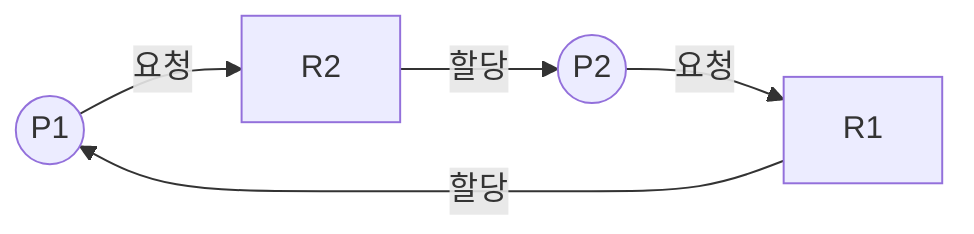

<Callout type="info">
  **이번 문서의 목표:** 이 파일을 다 읽으면 교착상태 4조건을 자원할당 그래프로 설명하고, 예방·회피·탐지·복구 네 전략을 구분하며, 은행원 알고리즘의 Allocation·Max·Need·Available 행렬을 직접 계산해 안전 순서(safe sequence)를 구할 수 있다.
</Callout>

## 왜 이런 상황이 생기는가

10편에서 세마포어의 `P` 연산은 자원이 없으면 프로세스를 대기시킨다고 배웠습니다. 그런데 프로세스 A가 자원 1을 갖고 자원 2를 기다리는 동시에, 프로세스 B가 자원 2를 갖고 자원 1을 기다린다면 어떻게 될까요. A는 B가 자원 2를 놓아주기를, B는 A가 자원 1을 놓아주기를 서로 무한정 기다리게 됩니다. 이렇게 두 개 이상의 프로세스가 서로가 가진 자원을 기다리며 아무도 더 진행하지 못하는 상태를 **교착상태**(deadlock)라고 합니다.

> **쉽게 말하면:** 교차로에서 네 대의 차가 각자 상대방이 먼저 빠지기를 기다리며 서로 물려 꼼짝 못 하는 상황과 같습니다.

## 1. 교착상태의 4조건

다음 네 조건이 **동시에** 성립할 때만 교착상태가 발생할 수 있습니다. 하나라도 깨지면 교착상태는 일어나지 않으므로, 이 조건들은 뒤에 나올 예방(prevention) 전략의 기반이 됩니다.

1. **상호 배제**(mutual exclusion): 자원은 한 번에 한 프로세스만 사용할 수 있다. (자원 자체의 성질)
2. **점유와 대기**(hold and wait): 프로세스가 이미 자원을 하나 이상 가진 채로, 다른 자원을 추가로 기다린다.
3. **비선점**(no preemption): 프로세스가 가진 자원은 그 프로세스가 스스로 반납하기 전까지 다른 프로세스나 운영체제가 강제로 빼앗을 수 없다.
4. **순환 대기**(circular wait): 프로세스 P1은 P2가 가진 자원을 기다리고, P2는 P3이 가진 자원을 기다리고, ... 마지막 Pn은 다시 P1이 가진 자원을 기다리는, 원 모양의 대기 관계가 존재한다.

**자주 틀리는 점**: "교착상태는 3조건만 만족해도 발생할 수 있다"는 진술은 틀렸습니다. 네 조건은 각각 독립적이며, 넷 중 하나라도 성립하지 않으면 교착상태는 원리적으로 발생할 수 없습니다.

## 2. 자원할당 그래프로 교착상태 확인하기

**자원할당 그래프**(resource-allocation graph)는 프로세스와 자원을 노드로, 요청·할당 관계를 화살표로 그린 그림입니다.

- 프로세스 → 자원 화살표: 그 프로세스가 자원을 **요청**했지만 아직 못 받음(요청 간선)
- 자원 → 프로세스 화살표: 그 자원이 이미 그 프로세스에 **할당**됨(할당 간선)

이 그림에서 P1 → R2 → P2 → R1 → P1으로 화살표를 따라가면 다시 P1로 돌아오는 **순환**(cycle)이 만들어집니다. 자원마다 인스턴스(사용 가능한 개수)가 1개뿐이라면, 그래프에 순환이 존재하는 것은 곧 교착상태가 발생했다는 뜻과 같습니다.

**자주 틀리는 점**: 자원 종류마다 인스턴스가 여러 개(예: 프린터 2대)인 경우에는 그래프에 순환이 있어도 반드시 교착상태인 것은 아닙니다. 이 경우는 순환이 있어도 다른 프로세스가 자원을 반납해 순환을 빠져나갈 여지가 있을 수 있기 때문입니다. "순환이 있으면 무조건 교착상태다"는 자원 인스턴스가 1개씩일 때만 참인 명제입니다.

## 3. 교착상태를 다루는 네 가지 전략

| 전략 | 핵심 아이디어 | 장점 | 단점 |
|------|----------------|------|------|
| 예방(prevention) | 4조건 중 하나를 아예 성립하지 못하게 시스템을 설계 | 교착상태가 원천적으로 발생하지 않음 | 자원 활용률이 낮아지거나 구현 제약이 큼 |
| 회피(avoidance) | 요청이 들어올 때마다 미리 시뮬레이션해 안전한 상태만 허용 | 자원을 예방보다 유연하게 씀 | 프로세스마다 최대 요구량을 미리 알아야 함 |
| 탐지(detection) | 교착상태 발생을 막지 않고, 주기적으로 검사해 발견 | 자원 제약이 가장 적음 | 탐지 알고리즘 실행 비용, 복구 비용 발생 |
| 복구(recovery) | 이미 발생한 교착상태를 프로세스 종료나 자원 선점으로 풀어냄 | 탐지 이후 실질적으로 해소 | 프로세스 강제 종료로 작업 손실 발생 가능 |

### 예방 — 4조건 중 하나를 깬다

- 상호 배제를 없애기: 공유 가능한 자원(읽기 전용 파일 등)으로 바꾸면 상호 배제 자체가 필요 없어지지만, 프린터처럼 원래 공유가 불가능한 자원에는 적용할 수 없습니다.
- 점유와 대기를 없애기: 프로세스가 필요한 자원을 **한 번에 전부** 요청하게 하거나, 자원이 없으면 아무것도 갖지 않은 상태에서만 요청하게 합니다. 다만 자원을 미리 다 확보해야 하므로 활용률이 떨어집니다.
- 비선점을 없애기: 이미 자원을 가진 프로세스가 다른 자원을 기다리게 되면, 가진 자원을 강제로 반납시킵니다.
- 순환 대기를 없애기: 모든 자원 종류에 고유한 번호를 매기고, 프로세스는 항상 번호가 **증가하는 순서**로만 자원을 요청하게 합니다. 번호가 오름차순이라는 규칙이 있으면 원 모양의 대기 관계 자체가 만들어질 수 없습니다.

### 회피 — 은행원 알고리즘

**회피**(avoidance)는 자원을 요청할 때마다 "이 요청을 들어줘도 시스템이 안전한 상태를 유지할 수 있는가"를 미리 계산해 보고, 안전할 때만 허용하는 전략입니다. 가장 대표적인 알고리즘이 다음 절에서 다룰 **은행원 알고리즘**(banker's algorithm)입니다.

### 탐지와 복구

탐지는 자원할당 그래프를 단순화한 대기 그래프에서 순환을 찾거나, 은행원 알고리즘과 비슷한 방식으로 현재 상태가 안전한지 주기적으로 검사하는 방법입니다. 교착상태를 발견하면 복구 단계로 넘어가는데, 복구는 크게 두 가지입니다.

- **프로세스 종료**: 교착상태에 얽힌 프로세스를 전부 종료하거나, 순환이 끊어질 때까지 하나씩 종료합니다.
- **자원 선점**: 프로세스로부터 자원을 강제로 빼앗아 다른 프로세스에 준 뒤, 자원을 빼앗긴 프로세스는 나중에 다시 시작합니다.

## 4. 은행원 알고리즘 — 행렬로 직접 계산하기

**은행원 알고리즘**(banker's algorithm)이라는 이름은 은행이 대출을 내줄 때, 모든 고객이 최대한도까지 대출을 요청해도 은행이 파산하지 않을 자금 여유가 있는지 미리 확인하는 방식에 빗댄 것입니다. 프로세스 5개(P0~P4), 자원 종류 3가지(A, B, C)가 있는 다음 상황으로 직접 계산해 보겠습니다.

- **Allocation**(할당): 각 프로세스가 **현재 갖고 있는** 자원의 수
- **Max**(최대 요구): 각 프로세스가 작업을 마치기까지 **최대로 필요할 수 있는** 자원의 수
- **Available**(가용): 시스템에 **지금 남아 있는** 자원의 수
- **Need**(추가 필요량): 각 프로세스가 **앞으로 더** 요청할 수 있는 최대량. `Need = Max - Allocation`

| 프로세스 | Allocation (A, B, C) | Max (A, B, C) | Need = Max - Allocation |
|----------|------------------------|-----------------|---------------------------|
| P0 | 0, 1, 0 | 7, 5, 3 | 7, 4, 3 |
| P1 | 2, 0, 0 | 3, 2, 2 | 1, 2, 2 |
| P2 | 3, 0, 2 | 9, 0, 2 | 6, 0, 0 |
| P3 | 2, 1, 1 | 2, 2, 2 | 0, 1, 1 |
| P4 | 0, 0, 2 | 4, 3, 3 | 4, 3, 1 |

**Available = (3, 3, 2)** (시스템 전체 자원 A 10개, B 5개, C 7개 중 이미 Allocation으로 나간 합계 A=7, B=2, C=5를 빼면 남는 값입니다)

> **쉽게 말하면:** Need는 "이 프로세스가 끝까지 일하려면 지금 가진 것 말고 얼마가 더 필요한가"이고, Available은 "은행 금고에 지금 당장 빌려줄 수 있는 돈"입니다.

### 안전 검사 알고리즘 — 한 단계씩 진행

**안전 순서**(safe sequence)란, 모든 프로세스를 어떤 순서로 나열했을 때 각 프로세스의 Need가 그 시점의 Available 이하가 되어 순서대로 전부 완료시킬 수 있는 나열을 말합니다. 순서를 찾는 규칙은 "지금 Available로 Need를 채워 줄 수 있는 프로세스를 하나 골라 완료시키고, 그 프로세스가 가졌던 Allocation을 Available에 돌려받는다"를 모든 프로세스가 끝날 때까지 반복하는 것입니다.

**1단계**: Available = (3, 3, 2)에서 Need ≤ Available을 만족하는 프로세스를 찾습니다.

- P0의 Need (7, 4, 3) ≤ (3, 3, 2)? A값부터 7 > 3이므로 불만족.
- P1의 Need (1, 2, 2) ≤ (3, 3, 2)? 1≤3, 2≤3, 2≤2 모두 만족. **P1 선택.**

P1을 완료시키면 P1의 Allocation (2, 0, 0)이 Available로 돌아옵니다.

$$
\text{Available} = (3, 3, 2) + (2, 0, 0) = (5, 3, 2)
$$

**2단계**: 새 Available = (5, 3, 2)에서 다시 찾습니다.

- P0의 Need (7, 4, 3) ≤ (5, 3, 2)? 7 > 5이므로 불만족.
- P2의 Need (6, 0, 0) ≤ (5, 3, 2)? 6 > 5이므로 불만족.
- P3의 Need (0, 1, 1) ≤ (5, 3, 2)? 모두 만족. **P3 선택.**

$$
\text{Available} = (5, 3, 2) + (2, 1, 1) = (7, 4, 3)
$$

**3단계**: 새 Available = (7, 4, 3)에서 찾습니다.

- P0의 Need (7, 4, 3) ≤ (7, 4, 3)? 모두 등호로 만족. **P0도 가능하지만, P4도 확인해 봅니다.**
- P4의 Need (4, 3, 1) ≤ (7, 4, 3)? 모두 만족. **P4 선택.** (P0을 먼저 선택해도 결과는 안전하지만, 여기서는 표준 예시 순서를 따라 P4를 먼저 봅니다)

$$
\text{Available} = (7, 4, 3) + (0, 0, 2) = (7, 4, 5)
$$

**4단계**: 새 Available = (7, 4, 5)에서 P0의 Need (7, 4, 3) ≤ (7, 4, 5)? 모두 만족. **P0 선택.**

$$
\text{Available} = (7, 4, 5) + (0, 1, 0) = (7, 5, 5)
$$

**5단계**: 마지막 남은 P2의 Need (6, 0, 0) ≤ (7, 5, 5)? 모두 만족. **P2 선택.**

$$
\text{Available} = (7, 5, 5) + (3, 0, 2) = (10, 5, 7)
$$

### 결과 해석

다섯 프로세스를 모두 완료시킬 수 있었으므로, **P1 → P3 → P4 → P0 → P2** 순서는 안전 순서입니다. 이 순서가 하나라도 존재하면 현재 상태는 **안전 상태**(safe state)이고, 안전 상태에서는 어떤 순서로 자원을 내주더라도 결국 교착상태 없이 모든 프로세스를 끝낼 수 있다는 것이 은행원 알고리즘의 핵심 결론입니다. 반대로 어떤 순서로도 다음 프로세스를 찾을 수 없는 막다른 상황이 오면 그 상태는 **불안전 상태**(unsafe state)이며, 불안전 상태가 항상 교착상태인 것은 아니지만 교착상태로 이어질 위험이 있습니다.

실제 시험에서는 이 표가 주어지고 "P2가 자원 (1, 0, 2)를 추가로 요청했을 때 즉시 허용해도 안전한가"를 묻는 유형이 나옵니다. 이때는 요청량이 Need 이하인지, 요청량이 Available 이하인지 먼저 확인한 뒤, 임시로 Available·Allocation·Need를 갱신하고 위와 같은 안전 검사를 다시 수행해 안전 순서가 존재하는지 확인해야 합니다.

**자주 틀리는 점**: "Available이 Need보다 작으면 그 프로세스는 영원히 대기해야 한다"는 진술은 틀렸습니다. 다른 프로세스가 먼저 완료되어 자원을 반납하면 Available이 늘어나 나중에는 조건을 만족할 수 있습니다. 은행원 알고리즘은 이렇게 **순서를 바꿔가며** 안전 순서가 하나라도 존재하는지를 검사하는 것이 핵심입니다.

## 핵심 정리

- 교착상태 4조건은 상호 배제, 점유와 대기, 비선점, 순환 대기이며 넷이 모두 성립해야 교착상태가 발생한다.
- 자원 인스턴스가 1개씩일 때 자원할당 그래프의 순환은 곧 교착상태를 의미하지만, 인스턴스가 여러 개면 순환이 있어도 교착상태가 아닐 수 있다.
- 예방은 4조건 중 하나를 깨서 원천 차단, 회피는 요청마다 안전성을 미리 계산, 탐지는 발생을 허용하고 주기적으로 찾아냄, 복구는 프로세스 종료·자원 선점으로 해소한다.
- 은행원 알고리즘은 `Need = Max - Allocation`을 구하고, Available로 Need를 만족하는 프로세스를 차례로 완료시켜 자원을 회수하는 과정을 반복해 안전 순서를 찾는다.
- 안전 순서가 하나라도 존재하면 안전 상태이며, 안전 상태에서는 교착상태 없이 모든 프로세스를 완료시킬 수 있다.

## 마무리 복습

<Quiz
  questionNumber={1}
  question="교착상태의 4조건에 해당하지 않는 것은?"
  options={['상호 배제', '순환 대기', '기아 상태 방지', '점유와 대기']}
  correctAnswer={3}
  explanation="교착상태의 4조건은 상호 배제, 점유와 대기, 비선점, 순환 대기다. 기아 상태 방지는 임계 구역 문제의 한정 대기 조건이나 스케줄링에서 다뤄지는 개념으로 교착상태의 4조건이 아니다."
  optionExplanations={['상호 배제는 자원이 한 번에 한 프로세스만 사용 가능하다는 4조건 중 하나다.', '순환 대기는 프로세스들이 원 모양으로 자원을 기다리는 4조건 중 하나다.', '정답. 기아 상태 방지는 교착상태의 4조건이 아니라 임계 구역 문제나 스케줄링에서 다루는 별개의 개념이다.', '점유와 대기는 자원을 가진 채 다른 자원을 기다린다는 4조건 중 하나다.']}
/>

<Quiz
  questionNumber={2}
  question="자원할당 그래프에서 순환(cycle)이 존재할 때의 설명으로 옳은 것은?"
  options={['자원 종류마다 인스턴스가 1개씩이면 순환은 곧 교착상태를 의미한다.', '자원 인스턴스 개수와 무관하게 순환이 있으면 항상 교착상태다.', '순환이 없어도 교착상태가 발생할 수 있다.', '순환은 예방 전략이 실패했을 때만 생긴다.']}
  correctAnswer={1}
  explanation="자원마다 인스턴스가 1개씩인 경우에는 순환의 존재가 곧 교착상태의 존재와 동치다. 인스턴스가 여러 개인 경우에는 순환이 있어도 다른 프로세스의 자원 반납으로 교착상태를 피할 수 있다."
  optionExplanations={['정답. 인스턴스가 1개씩인 자원할당 그래프에서는 순환이 곧 교착상태를 의미한다.', '인스턴스가 여러 개인 자원은 순환이 있어도 교착상태가 아닐 수 있다.', '순환 대기(4조건 중 하나)가 성립하지 않으면 정의상 교착상태가 발생할 수 없다.', '순환은 특정 전략의 성패와 무관하게 프로세스들의 요청·할당 관계에 따라 자연적으로 나타나는 그래프 구조다.']}
/>

<Quiz
  questionNumber={3}
  question="교착상태 처리 전략 중 '회피(avoidance)'에 대한 설명으로 가장 적절한 것은?"
  options={['4조건 중 하나가 아예 성립하지 못하도록 시스템을 설계한다.', '자원 요청이 들어올 때마다 안전 상태 유지 여부를 미리 계산해 허용 여부를 결정한다.', '교착상태 발생을 막지 않고 주기적으로 검사해 발견한다.', '이미 발생한 교착상태를 프로세스 종료로 해소한다.']}
  correctAnswer={2}
  explanation="회피는 은행원 알고리즘처럼 매 요청마다 그 요청을 들어줬을 때도 안전 순서가 존재하는지 시뮬레이션해 보고, 안전한 경우에만 자원을 할당하는 전략이다."
  optionExplanations={['이는 예방(prevention) 전략에 대한 설명이다.', '정답. 회피는 매 요청마다 안전성을 계산해 허용 여부를 결정하는 전략이다.', '이는 탐지(detection) 전략에 대한 설명이다.', '이는 복구(recovery) 전략에 대한 설명이다.']}
/>

<Quiz
  questionNumber={4}
  question="Allocation이 (1, 0, 2), Max가 (5, 2, 3)인 프로세스 Pk의 Need 값으로 옳은 것은?"
  options={['(4, 2, 1)', '(6, 2, 5)', '(4, 2, 5)', '(5, 2, 3)']}
  correctAnswer={1}
  explanation="Need는 Max에서 Allocation을 뺀 값이다. (5,2,3) - (1,0,2) = (5-1, 2-0, 3-2) = (4, 2, 1)이다."
  optionExplanations={['정답. Need = Max - Allocation = (5-1, 2-0, 3-2) = (4, 2, 1)이다.', 'Max와 Allocation을 더한 값이며 Need 계산식이 아니다.', '세 번째 항목의 뺄셈이 잘못되었다. 3-2=1이어야 한다.', 'Max 값을 그대로 옮긴 것으로 Allocation을 빼지 않은 값이다.']}
/>

<Quiz
  questionNumber={5}
  question="본문의 은행원 알고리즘 예시에서 Available = (3, 3, 2)일 때 가장 먼저 안전 순서에 들어갈 수 있는 프로세스는?"
  options={['P0 (Need 7,4,3)', 'P1 (Need 1,2,2)', 'P2 (Need 6,0,0)', 'P4 (Need 4,3,1)']}
  correctAnswer={2}
  explanation="Available (3,3,2)와 각 프로세스의 Need를 비교하면 P1의 Need (1,2,2)만 모든 항목에서 Available 이하이므로 P1이 가장 먼저 완료될 수 있다."
  optionExplanations={['P0의 Need (7,4,3)은 A값 7이 Available의 3보다 커서 즉시 완료할 수 없다.', '정답. P1의 Need (1,2,2)는 (3,3,2)의 모든 항목 이하이므로 가장 먼저 자원을 받아 완료할 수 있다.', 'P2의 Need (6,0,0)은 A값 6이 Available의 3보다 커서 즉시 완료할 수 없다.', 'P4의 Need (4,3,1)은 A값 4가 Available의 3보다 커서 즉시 완료할 수 없다.']}
/>

<Quiz
  questionNumber={6}
  question="안전 상태(safe state)와 교착상태(deadlock)의 관계에 대한 설명으로 옳은 것은?"
  options={['안전 상태는 항상 교착상태와 같은 뜻이다.', '불안전 상태는 반드시 교착상태로 이어진다.', '안전 상태이면 어떤 순서로 자원을 배분해도 결국 모든 프로세스를 완료할 수 있다.', '안전 순서가 여러 개 존재하면 그 상태는 불안전 상태다.']}
  correctAnswer={3}
  explanation="안전 상태는 적어도 하나의 안전 순서가 존재해 모든 프로세스를 순서대로 완료시킬 수 있는 상태를 말한다. 안전 순서가 존재하는 한 교착상태 없이 시스템을 끝까지 진행할 수 있다."
  optionExplanations={['안전 상태와 교착상태는 반대되는 개념에 가깝다. 안전 상태는 교착상태를 피할 수 있음을 보장하는 상태다.', '불안전 상태는 교착상태로 이어질 위험이 있는 상태일 뿐, 반드시 교착상태가 되는 것은 아니다.', '정답. 안전 순서가 하나라도 존재하면 그 순서를 따라 모든 프로세스를 교착상태 없이 완료시킬 수 있다.', '안전 순서가 여러 개 존재하는 것은 오히려 더 안전한 상태를 뜻하며 불안전 상태와는 무관하다.']}
/>

## 참고 자료

- [KOCW 운영체제 강의자료 - Introduction](http://contents.kocw.or.kr/KOCW/document/2013/kyungsung/yangheejae/os01.pdf)
- [국가평생교육진흥원 독학학위제 - 과목별 평가영역](https://bdes.nile.or.kr/nile/study/nStudy2_1.do)
