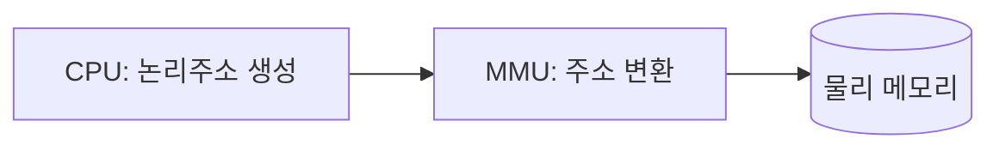

<Callout type="info">
  **이번 문서의 목표:** 이 파일을 다 읽으면 논리주소와 물리주소의 차이를 설명하고, 같은 빈 공간 목록에 대해 최초·최적·최악 적합 결과가 왜 달라지는지 직접 계산하며, 베이스 레지스터를 이용한 주소 변환을 숫자로 수행할 수 있다.
</Callout>

## 왜 주소를 두 번 매기는가

06편에서 프로세스는 실행되려면 메모리에 올라가 있어야 한다고 배웠습니다. 그런데 프로그램을 작성할 때는 그 프로그램이 메모리의 몇 번지에 올라갈지 미리 알 수 없습니다. 같은 프로그램이 어떤 때는 메모리의 0번지에, 어떤 때는 5000번지에 올라갈 수도 있기 때문입니다. 만약 프로그램 코드 안에 "물리적으로 실제 메모리의 5000번지에 있는 값을 읽어라" 같은 고정된 번지를 직접 박아 넣으면, 그 프로그램은 딱 한 번, 정확히 그 번지에 배치될 때만 동작하게 됩니다.

이 문제를 풀기 위해 운영체제는 프로그램이 사용하는 주소와 실제 메모리 하드웨어의 주소를 분리합니다.

> **쉽게 말하면:** 이사할 때마다 집 안 가구 배치(방 안에서 "왼쪽 서랍 두 번째 칸"이라는 상대적 위치)는 그대로 두고, 건물 전체 주소(도로명 주소)만 바꿔 주는 것과 같습니다.

## 1. 논리주소와 물리주소

- **논리주소**(logical address, 가상 주소라고도 함): CPU가 생성하고 프로그램이 실행 중에 실제로 다루는 주소. 프로세스마다 0번지부터 시작하는 자신만의 주소 체계를 가집니다.
- **물리주소**(physical address): 메모리 하드웨어(RAM) 자체의 실제 번지. 메모리 장치가 데이터를 읽고 쓸 때 기준으로 삼는 진짜 위치입니다.

논리주소를 물리주소로 바꿔주는 장치를 **MMU**(Memory Management Unit, 메모리 관리 장치)라고 합니다. MMU는 CPU와 메모리 사이에 위치한 하드웨어로, 프로세스가 내놓은 논리주소를 실제 물리주소로 실시간 변환합니다.

**자주 틀리는 점**: "논리주소와 물리주소는 항상 같은 값이다"라는 진술은 틀렸습니다. 컴파일 시점 바인딩처럼 아주 예외적인 경우를 빼면, 프로세스가 실행 중에 메모리 어디에 배치될지 미리 정해지지 않으므로 두 주소는 대부분 다른 값을 가집니다.

## 2. 연속 할당 — 최초·최적·최악 적합 비교

**연속 할당**(contiguous allocation)은 프로세스 하나를 메모리의 연속된 한 덩어리 공간에 통째로 올리는 방식입니다. 운영체제는 사용 가능한 빈 공간(hole, 홀)들의 목록을 관리하다가, 새 프로세스가 들어오면 그 목록에서 공간을 골라 배정합니다. 어떤 빈 공간을 고르느냐에 따라 세 가지 전략이 있습니다.

- **최초 적합**(first-fit): 목록을 처음부터 순서대로 훑다가, **처음으로** 요청 크기보다 크거나 같은 빈 공간을 만나면 즉시 그 자리에 배정합니다.
- **최적 적합**(best-fit): 목록 전체를 확인해서, 요청 크기보다 크거나 같은 빈 공간 중 **가장 작은** 것을 골라 배정합니다. 남는 자투리를 최소화하려는 전략입니다.
- **최악 적합**(worst-fit): 목록 전체를 확인해서, **가장 큰** 빈 공간을 골라 배정합니다. 자투리를 크게 남겨서 나중에라도 재사용하기 쉽게 하려는 전략입니다.

### 같은 빈 공간 목록으로 세 전략을 직접 계산

빈 공간 목록이 크기 순서 없이 다음과 같이 주어졌다고 합시다(단위: KB).

$$
H_1 = 100,\ H_2 = 500,\ H_3 = 200,\ H_4 = 300,\ H_5 = 600
$$

이 순서로 프로세스 요청이 **212, 417, 112, 426**KB 순서로 들어옵니다. 세 전략 모두 이 동일한 초기 목록과 동일한 요청 순서에서 출발합니다.

#### 최초 적합(first-fit)

| 요청 | 검사 순서와 결과 | 배정된 홀 | 남는 크기 |
|------|-------------------|-----------|-----------|
| 212 | H1(100, 부족) → H2(500, 충분) | H2 | 500 − 212 = 288 |
| 417 | H1(100) → H2(288, 부족) → H3(200) → H4(300) → H5(600, 충분) | H5 | 600 − 417 = 183 |
| 112 | H1(100, 부족) → H2(288, 충분) | H2 | 288 − 112 = 176 |
| 426 | H1(100) → H2(176) → H3(200) → H4(300) → H5(183) — **모두 부족** | 배정 실패 | – |

최초 적합은 앞의 세 요청은 처리했지만, 네 번째 요청(426KB)을 담을 수 있는 홀이 하나도 남지 않아 **실패**합니다.

#### 최적 적합(best-fit)

| 요청 | 요청 크기 이상인 홀 중 가장 작은 것 | 배정된 홀 | 남는 크기 |
|------|--------------------------------------|-----------|-----------|
| 212 | \{H2=500, H4=300, H5=600\} 중 최소 = H4(300) | H4 | 300 − 212 = 88 |
| 417 | \{H2=500, H5=600\} 중 최소 = H2(500) | H2 | 500 − 417 = 83 |
| 112 | \{H3=200, H5=600\} 중 최소 = H3(200) | H3 | 200 − 112 = 88 |
| 426 | \{H5=600\} 중 최소 = H5(600) | H5 | 600 − 426 = 174 |

최적 적합은 네 요청을 **모두 성공**시킵니다. 남는 자투리(88, 83, 88, 174)는 작지만 어쨌든 요청을 다 처리했습니다.

#### 최악 적합(worst-fit)

| 요청 | 가장 큰 홀 | 배정된 홀 | 남는 크기 |
|------|------------|-----------|-----------|
| 212 | \{100,500,200,300,600\} 중 최대 = H5(600) | H5 | 600 − 212 = 388 |
| 417 | \{100,500,200,300,388\} 중 최대 = H2(500) | H2 | 500 − 417 = 83 |
| 112 | \{100,83,200,300,388\} 중 최대 = H5(388) | H5 | 388 − 112 = 276 |
| 426 | \{100,83,200,300,276\} 중 최대 = H4(300) — **300 < 426, 부족** | 배정 실패 | – |

최악 적합도 네 번째 요청에서 **실패**합니다.

### 결과 해석

같은 초기 조건에서 최적 적합만 네 요청을 모두 성공시켰습니다. 이 결과가 "최적 적합이 항상 가장 좋다"는 뜻은 아닙니다. 최적 적합은 매번 목록 전체를 뒤져야 해서 속도가 느리고, 자투리를 아주 작게 남기는 특성 때문에 나중에 그 자투리들이 어떤 요청에도 못 쓰이는 **작은 조각들만 잔뜩 남는 경향**이 있습니다. 반대로 최초 적합은 검사 속도가 가장 빠르지만, 이번 계산처럼 앞쪽 홀을 서둘러 채우다가 뒤쪽 큰 요청을 놓치는 경우가 생깁니다.

**자주 틀리는 점**: "최악 적합은 이름 그대로 항상 성능이 가장 나쁘다"고 단정하는 것은 틀렸습니다. 최악 적합은 큰 덩어리를 우선 쓰기 때문에 중간 크기의 자투리를 남겨 향후 재사용 가능성을 높이려는 의도가 있는 전략이며, 상황에 따라 최초 적합보다 나은 결과를 낼 수도 있습니다. 실제 성능은 요청 크기 분포에 따라 달라집니다.

## 3. 외부 단편화와 내부 단편화

연속 할당은 두 종류의 낭비를 만들어 냅니다.

- **외부 단편화**(external fragmentation): 빈 공간의 총합은 충분한데, 그 공간이 여러 조각으로 흩어져 있어서 요청 크기만큼 **연속된** 한 덩어리를 만들 수 없는 상태. 위 예시에서 최초 적합·최악 적합이 마지막 요청(426KB)을 실패시킨 이유가 바로 이것입니다. 흩어진 조각(176, 200, 300, 183 등)을 다 더하면 426보다 크지만, 연속된 하나의 덩어리가 아니므로 쓸 수 없습니다.
- **내부 단편화**(internal fragmentation): 프로세스에 배정한 공간이 실제 필요량보다 커서, 그 안에 아무도 못 쓰는 자투리가 남는 상태. 예를 들어 212KB를 요청했는데 시스템이 고정된 크기 단위(예: 256KB 블록)로만 배정한다면, 실제로는 44KB가 그 프로세스 내부에 낭비됩니다.

| 구분 | 외부 단편화 | 내부 단편화 |
|------|--------------|--------------|
| 발생 위치 | 프로세스들 사이의 빈 공간 | 프로세스에 배정된 공간 내부 |
| 원인 | 가변 크기 연속 할당에서 홀이 조각남 | 고정 크기 단위로만 배정 |
| 해결 방향 | 압축(compaction)으로 빈 공간을 한곳에 모으거나, 페이징처럼 비연속 할당으로 전환 | 배정 단위를 요청 크기에 최대한 맞춤 |

**자주 틀리는 점**: 외부 단편화와 내부 단편화를 반대로 설명하는 오답이 잦습니다. "낭비되는 공간이 프로세스 경계 안쪽에 있는가(내부), 프로세스들 사이에 흩어져 있는가(외부)"로 구분하면 헷갈리지 않습니다.

## 4. 주소 변환 — 베이스·리미트 레지스터로 계산하기

연속 할당에서 가장 단순한 주소 변환 방식은 **베이스 레지스터**(base register, 재배치 레지스터)와 **리미트 레지스터**(limit register)를 쓰는 것입니다.

- **베이스 레지스터**: 그 프로세스가 배정받은 메모리 영역의 시작 물리주소를 담습니다.
- **리미트 레지스터**: 그 프로세스가 쓸 수 있는 논리주소의 최대 범위(크기)를 담습니다.

CPU가 논리주소 `L`을 생성하면, MMU는 다음 순서로 물리주소를 계산합니다.

1. `L < 리미트`인지 검사합니다. 만약 `L ≥ 리미트`라면, 그 프로세스가 자신의 영역을 벗어난 주소를 요청한 것이므로 **주소 경계 오류**(트랩, trap)를 발생시켜 접근을 막습니다.
2. 검사를 통과하면 물리주소를 `물리주소 = 베이스 + L`로 계산합니다.

$$
\text{물리주소} = \text{베이스} + L \quad (\text{단, } 0 \le L < \text{리미트})
$$

- $L$: CPU가 생성한 논리주소(프로세스 관점의 상대 번지)
- 베이스: 이 프로세스가 배정받은 물리 메모리의 시작 번지
- 리미트: 이 프로세스에 허용된 논리주소 공간의 크기

### 숫자로 직접 계산

어떤 프로세스의 베이스 레지스터 값이 `300000`, 리미트 레지스터 값이 `120000`이라고 합시다. 이 프로세스가 실행 중 논리주소 `346`을 생성했다면 다음과 같이 계산합니다.

**1단계 (경계 검사)**: $346 < 120000$이므로 통과합니다.

**2단계 (주소 계산)**:

$$
\text{물리주소} = 300000 + 346 = 300346
$$

만약 이 프로세스가 논리주소 `125000`을 생성했다면 어떻게 될까요. $125000 \geq 120000$(리미트)이므로 1단계에서 걸러져 물리주소 계산 자체가 일어나지 않고 트랩이 발생합니다. 이 검사 덕분에 한 프로세스가 실수로(또는 악의적으로) 다른 프로세스의 메모리 영역을 침범하는 것을 막을 수 있습니다.

### 비트로 표현한 주소 공간 크기

논리주소를 몇 비트로 표현하느냐는 그 프로세스가 쓸 수 있는 최대 주소 공간의 크기를 결정합니다. 예를 들어 논리주소를 16비트로 표현하는 시스템이라면, 표현 가능한 주소의 개수는 다음과 같습니다.

$$
2^{16} = 65536
$$

즉 이 프로세스는 0번지부터 65535번지까지, 총 65536바이트(= 64KB) 크기의 논리주소 공간을 가질 수 있습니다. 만약 물리 메모리 주소가 24비트로 표현된다면 물리 메모리 전체 크기는 다음과 같습니다.

$$
2^{24} = 16777216 \text{바이트} = 16\text{MB}
$$

논리주소가 16비트(0~65535)인 프로세스가 물리 메모리 24비트(0~16777215) 공간의 어느 위치에 배치되든, 베이스 레지스터 하나만 그 위치에 맞게 설정하면 위에서 계산한 덧셈 공식이 그대로 적용됩니다. 이것이 바로 "프로그램 코드 자체는 배치 위치와 무관하게 그대로 두고, 레지스터 값만 바꿔 재배치를 처리한다"는 앞서 말한 아이디어가 하드웨어 수준에서 구현되는 방식입니다.

**자주 틀리는 점**: "리미트 레지스터는 물리주소의 범위를 담는다"는 진술은 틀렸습니다. 리미트 레지스터는 **논리주소**의 최대 범위(그 프로세스에 허용된 크기)를 담으며, 검사는 물리주소로 변환하기 **전에** 논리주소 자체를 대상으로 이루어집니다.

## 5. 메모리 할당 전략 — 비연속 할당으로 가는 이유

연속 할당은 구현이 단순하고 주소 변환도 덧셈 한 번으로 끝나 빠르지만, 앞서 본 것처럼 외부 단편화 문제를 근본적으로 피할 수 없습니다. 흩어진 빈 공간을 한곳으로 모으는 **압축**(compaction)으로 완화할 수는 있지만, 압축은 메모리에 있는 프로세스들을 실제로 옮겨야 하므로 비용이 큽니다.

이 문제를 근본적으로 해결하는 방향이 프로세스를 반드시 연속된 한 덩어리로 올리지 않고, 여러 조각으로 나누어 흩어진 빈 공간에도 나눠 담는 **비연속 할당**(non-contiguous allocation)입니다. 대표적인 두 방식인 **페이징**(paging)과 **세그멘테이션**(segmentation)은 다음 13편에서 페이지 테이블 구조와 함께 자세히 다룹니다. 여기서는 "연속 할당의 외부 단편화 문제를 피하기 위해 프로세스를 여러 조각으로 나눠 배치하는 방향"이라는 위치만 기억해 두면 됩니다.

## 핵심 정리

- 논리주소는 프로세스가 다루는 상대적 주소, 물리주소는 실제 메모리 하드웨어의 번지이며, MMU가 둘을 변환한다.
- 같은 빈 공간 목록과 같은 요청 순서에서도 최초·최적·최악 적합은 서로 다른 결과를 낸다. 이번 계산에서는 최적 적합만 네 요청을 모두 성공시켰다.
- 외부 단편화는 프로세스들 사이 공간이 조각나 생기고, 내부 단편화는 배정된 공간 내부에 남는 자투리에서 생긴다.
- 베이스·리미트 레지스터 방식은 `물리주소 = 베이스 + 논리주소`(단, 논리주소 < 리미트)로 계산하며, 리미트를 넘는 논리주소는 트랩으로 차단한다.
- 연속 할당의 외부 단편화 문제를 피하기 위해 프로세스를 여러 조각으로 나눠 배치하는 방향이 비연속 할당(페이징·세그멘테이션)이며, 자세한 내용은 13편에서 다룬다.

## 마무리 복습

<Quiz
  questionNumber={1}
  question="논리주소와 물리주소에 대한 설명으로 옳은 것은?"
  options={['물리주소는 프로세스가 다루는 상대적 주소이고, 논리주소는 메모리 하드웨어의 실제 번지다.', 'MMU는 논리주소를 물리주소로 실시간 변환하는 하드웨어 장치다.', '논리주소와 물리주소는 항상 같은 값을 가진다.', '리미트 레지스터는 물리주소의 최대 범위를 담는다.']}
  correctAnswer={2}
  explanation="MMU(Memory Management Unit)는 CPU가 생성한 논리주소를 실제 메모리 하드웨어의 물리주소로 실시간 변환하는 하드웨어 장치다."
  optionExplanations={['설명이 뒤바뀌었다. 논리주소가 프로세스의 상대적 주소, 물리주소가 하드웨어의 실제 번지다.', '정답. MMU는 논리주소를 물리주소로 변환하는 하드웨어 장치다.', '프로세스가 메모리 어디에 배치되는지는 실행마다 다를 수 있어 두 주소는 대체로 다르다.', '리미트 레지스터는 물리주소가 아니라 논리주소의 최대 허용 범위를 담는다.']}
/>

<Quiz
  questionNumber={2}
  question="빈 공간 목록 100, 500, 200, 300, 600(KB)에 212KB 요청이 들어올 때, 최초 적합(first-fit)이 배정하는 홀은?"
  options={['크기 100인 홀', '크기 500인 홀', '크기 200인 홀', '크기 300인 홀']}
  correctAnswer={2}
  explanation="최초 적합은 목록을 처음부터 순서대로 확인해 처음으로 요청 크기 이상인 홀에 배정한다. 100은 212보다 작아 건너뛰고, 다음인 500이 212 이상이므로 그 자리에 배정한다."
  optionExplanations={['100은 212보다 작아 배정할 수 없다.', '정답. 첫 번째로 212 이상인 홀은 크기 500인 홀이다.', '순서상 500이 200보다 먼저 검사되므로 200에 배정되지 않는다.', '순서상 500이 300보다 먼저 검사되므로 300에 배정되지 않는다.']}
/>

<Quiz
  questionNumber={3}
  question="같은 조건(홀 100, 500, 200, 300, 600 / 요청 212, 417, 112, 426)에서 최적 적합(best-fit)과 최초 적합(first-fit)의 결과를 비교한 설명으로 옳은 것은?"
  options={['두 전략 모두 네 요청을 성공시킨다.', '최초 적합은 네 요청을 모두 성공시키지만 최적 적합은 실패한다.', '최적 적합은 네 요청을 모두 성공시키지만 최초 적합은 마지막 요청(426KB)에서 실패한다.', '두 전략 모두 세 번째 요청(112KB)에서 실패한다.']}
  correctAnswer={3}
  explanation="최적 적합은 매 요청마다 가장 작은 적합 홀을 골라 자투리를 최소화해 네 요청을 모두 성공시키지만, 최초 적합은 앞쪽 홀을 먼저 채우다가 마지막 426KB 요청을 담을 연속된 홀이 남지 않아 실패한다."
  optionExplanations={['최초 적합은 마지막 요청에서 실패하므로 두 전략의 결과가 다르다.', '설명이 반대다. 최적 적합이 성공하고 최초 적합이 실패한다.', '정답. 최적 적합은 모두 성공, 최초 적합은 426KB 요청에서 실패한다.', '112KB 요청은 두 전략 모두 성공적으로 배정된다.']}
/>

<Quiz
  questionNumber={4}
  question="외부 단편화(external fragmentation)에 대한 설명으로 가장 적절한 것은?"
  options={['프로세스에 배정된 공간 내부에 남는 자투리 공간이다.', '빈 공간의 총합은 충분하지만 조각나 있어 요청 크기만큼 연속된 공간을 만들 수 없는 상태다.', '고정 크기 배정 단위 때문에 발생하는 낭비다.', '페이지 테이블 크기가 커서 발생하는 낭비다.']}
  correctAnswer={2}
  explanation="외부 단편화는 빈 공간들의 합은 요청을 채우기에 충분하지만, 그 공간들이 여러 조각으로 흩어져 있어 연속된 한 덩어리로 배정할 수 없을 때 발생한다."
  optionExplanations={['이는 내부 단편화에 대한 설명이다.', '정답. 외부 단편화는 흩어진 빈 공간 때문에 연속 배정이 불가능한 상태다.', '고정 크기 배정 단위로 인한 낭비는 내부 단편화의 원인이다.', '페이지 테이블 크기 문제는 13편에서 다루는 별개의 주제다.']}
/>

<Quiz
  questionNumber={5}
  question="베이스 레지스터 값이 300000, 리미트 레지스터 값이 120000인 프로세스가 논리주소 500을 생성했을 때 물리주소는?"
  options={['500', '300000', '300500', '419500']}
  correctAnswer={3}
  explanation="먼저 논리주소 500이 리미트 120000보다 작으므로 경계 검사를 통과한다. 물리주소 = 베이스 + 논리주소 = 300000 + 500 = 300500이다."
  optionExplanations={['논리주소 그 자체이며 베이스 값이 더해지지 않았다.', '베이스 값만 남고 논리주소가 더해지지 않았다.', '정답. 300000 + 500 = 300500이다.', '리미트 값을 더한 계산으로, 공식과 맞지 않는 값이다.']}
/>

<Quiz
  questionNumber={6}
  question="베이스 300000, 리미트 120000인 프로세스가 논리주소 150000을 생성했을 때 어떤 일이 일어나는가?"
  options={['물리주소 450000으로 정상 변환된다.', '150000 ≥ 120000이므로 경계 오류(트랩)가 발생해 접근이 차단된다.', '리미트 값이 자동으로 늘어나 변환이 이루어진다.', '베이스 값이 0으로 초기화된 뒤 다시 계산된다.']}
  correctAnswer={2}
  explanation="MMU는 물리주소를 계산하기 전에 논리주소가 리미트보다 작은지 먼저 검사한다. 150000은 리미트 120000보다 크므로 검사에서 걸려 경계 오류(트랩)가 발생하고 물리주소 계산 자체가 일어나지 않는다."
  optionExplanations={['경계 검사를 통과하지 못했으므로 물리주소 계산 자체가 수행되지 않는다.', '정답. 논리주소가 리미트 이상이면 경계 검사에서 걸려 트랩이 발생한다.', '리미트 값은 그 프로세스에 허용된 고정 범위이며 요청에 따라 자동으로 늘어나지 않는다.', '경계 오류 발생 시 베이스 값이 초기화되는 절차는 존재하지 않는다.']}
/>

## 참고 자료

- [KOCW 운영체제 강의자료 - Introduction](http://contents.kocw.or.kr/KOCW/document/2013/kyungsung/yangheejae/os01.pdf)
- [국가평생교육진흥원 독학학위제 - 과목별 평가영역](https://bdes.nile.or.kr/nile/study/nStudy2_1.do)
