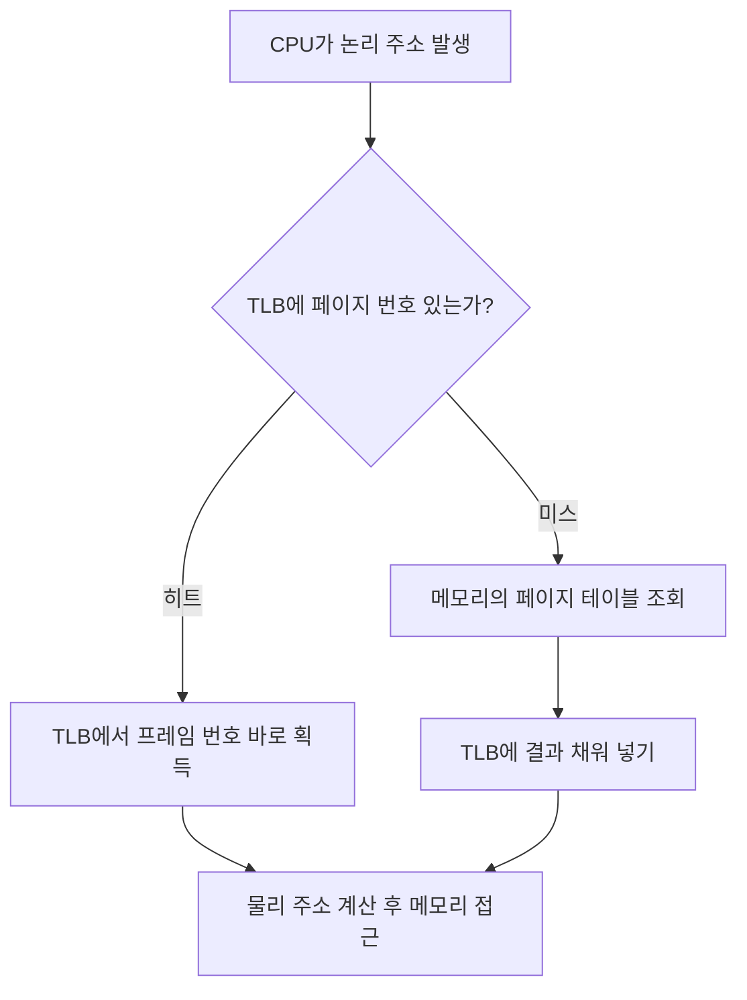

<Callout type="info">
  **이번 문서의 목표:** 이 파일을 다 읽으면 페이징과 세그먼테이션의 주소 변환 과정을 직접 손으로 계산하고, 내부·외부 단편화의 발생 위치와 해결책을 구분해 설명할 수 있다.
</Callout>

## 왜 메모리를 통째로 쓰지 않고 나누는가

12편에서 연속 할당(contiguous allocation) 방식을 다뤘다. 프로세스 하나에 물리 메모리의 연속된 한 덩어리를 통째로 배정하는 방식인데, 이 방식은 프로세스가 종료·생성을 반복하면 메모리 여기저기에 작은 빈 조각들이 흩어지는 **외부 단편화**(external fragmentation)를 만든다. 빈 공간의 총합은 충분한데, 그 공간이 조각조각 나뉘어 있어서 큰 프로세스 하나가 들어갈 자리가 없는 상황이다.

> **쉽게 말하면:** 외부 단편화는 "빈 방은 많은데 한 사람이 누울 만큼 이어진 빈 방이 없는" 상황이다.

이 문제를 근본적으로 없애는 방법은 프로세스를 연속된 한 덩어리로 두지 않고, **작은 조각으로 잘라서** 물리 메모리의 빈 곳 아무 데나 흩어 넣는 것이다. 이 조각내기 전략이 **페이징**(paging)과 **세그먼테이션**(segmentation)이다.

## 페이징 — 같은 크기로 자른다

### 페이지와 프레임

> **쉽게 말하면:** 페이징은 프로세스도, 메모리도 똑같은 크기의 블록으로 미리 잘라 놓고 블록 단위로 짝짓는 방식이다.

**페이징**(paging)은 프로세스의 논리 주소 공간을 **페이지**(page)라는 고정 크기 블록으로 나누고, 물리 메모리도 같은 크기의 **프레임**(frame)으로 나눈 뒤, 페이지를 프레임에 하나씩 배정하는 메모리 관리 기법이다. 페이지 크기는 보통 4KB(킬로바이트, kilobyte) 단위를 쓰며, 페이지와 프레임의 크기는 반드시 같다 — 크기가 다르면 짝지을 수 없기 때문이다.

핵심은 **한 프로세스의 페이지들이 물리 메모리에서 연속해 있을 필요가 없다**는 점이다. 프로세스 A의 페이지 0번은 프레임 5번에, 페이지 1번은 프레임 2번에, 페이지 2번은 프레임 9번에 흩어져 들어가도 상관없다. 어디에 있는지는 **페이지 테이블**(page table)이 기억한다.

### 페이지 테이블과 주소 변환

**페이지 테이블**은 "페이지 번호 → 프레임 번호"를 기록한 표로, 프로세스마다 하나씩 가진다. CPU가 만들어내는 주소는 **논리 주소**(logical address, 가상 주소)이고, 이를 실제 메모리 위치인 **물리 주소**(physical address)로 바꾸는 과정이 **주소 변환**(address translation)이다.

논리 주소는 두 부분으로 나뉜다.

$$
\text{논리 주소} = (p, d)
$$

- $p$: 페이지 번호(page number). 페이지 테이블에서 어느 행을 찾을지 지정한다.
- $d$: 페이지 내 변위(offset, 오프셋). 그 페이지 안에서 몇 번째 바이트인지를 나타낸다.

변환 절차는 다음과 같다.

<Steps>

1. 논리 주소를 페이지 번호 $p$와 변위 $d$로 쪼갠다. 페이지 크기가 $2^n$바이트면 하위 $n$비트가 $d$, 나머지 상위 비트가 $p$다.
2. 페이지 테이블에서 $p$번 행을 찾아 대응하는 프레임 번호 $f$를 읽는다.
3. 물리 주소 = $f \times (\text{프레임 크기}) + d$ 로 계산한다.

</Steps>

**작은 예시로 직접 계산해 보자.** 페이지(=프레임) 크기가 1,024바이트(2^10, 즉 하위 10비트가 변위)이고, 페이지 테이블이 다음과 같다고 하자.

| 페이지 번호 | 프레임 번호 |
|---|---|
| 0 | 6 |
| 1 | 2 |
| 2 | 9 |

논리 주소 3,072를 물리 주소로 바꿔 보자.

$$
p = \lfloor 3072 / 1024 \rfloor = 3,\quad d = 3072 \bmod 1024 = 0
$$

- $\lfloor \rfloor$ (floor, 바닥 함수): 소수점 이하를 버리고 정수로 내림한다는 뜻.
- $\bmod$ (모듈로, 나머지 연산): 나눈 나머지를 구한다.

여기서 문제가 생긴다. 이 프로세스의 페이지 테이블에는 0, 1, 2번 페이지만 있고 3번 페이지는 없다. 즉 논리 주소 3,072는 이 프로세스가 할당받은 범위를 벗어난 **잘못된 주소**이며, 하드웨어는 이때 **트랩**(trap, 프로세스 실행 중 발생하는 예외 신호로 운영체제에 제어를 넘긴다)을 발생시켜 프로세스를 강제 종료하거나 예외를 처리한다.

이번엔 논리 주소 2,050을 계산해 보자.

$$
p = \lfloor 2050 / 1024 \rfloor = 2,\quad d = 2050 \bmod 1024 = 2
$$

페이지 2번은 프레임 9번에 있으므로,

$$
\text{물리 주소} = 9 \times 1024 + 2 = 9218
$$

**결과 해석:** 논리 주소 2,050이 실제로는 물리 메모리의 9,218번 위치에 저장되어 있다는 뜻이다. 프로세스 입장에서는 자신이 0번지부터 연속된 메모리를 쓰는 것처럼 보이지만, 실제로는 하드웨어가 매번 이 변환을 몰래 수행해 준다. 이것이 **가상화**(virtualization)의 핵심 아이디어다 — 프로세스에게는 실제와 다른 단순한 그림을 보여주고, 진짜 배치는 운영체제와 하드웨어가 관리한다.

### 내부 단편화 — 페이징의 대가

페이징은 외부 단편화를 없애지만 새로운 문제를 만든다. 프로세스의 마지막 페이지는 딱 맞게 채워지지 않는 경우가 대부분이다. 예를 들어 프로세스 크기가 2,555바이트이고 페이지 크기가 1,024바이트면 페이지 3개(3,072바이트)가 필요한데, 마지막 페이지는 2,555 − 2,048 = 507바이트만 쓰고 나머지 517바이트는 그 프레임 안에서 아무도 쓰지 않는 채로 낭비된다. 이렇게 **할당된 블록 내부에서** 생기는 낭비를 **내부 단편화**(internal fragmentation)라 한다.

> **자주 틀리는 점:** 외부 단편화와 내부 단편화를 헷갈리기 쉽다. 외부 단편화는 "블록과 블록 사이" 빈 공간이 조각나는 문제이고, 내부 단편화는 "블록 하나 안"에서 남는 공간의 문제다. 페이징은 외부 단편화를 없애는 대신 내부 단편화를 얻는 트레이드오프(trade-off, 하나를 얻으면 다른 하나를 잃는 관계)를 가진다.

### TLB — 페이지 테이블 조회를 빠르게

페이지 테이블은 보통 메모리(RAM)에 저장된다. 그런데 주소 하나를 변환할 때마다 메모리에 있는 페이지 테이블을 읽어야 한다면, 실제 데이터에 접근하기 전에 **메모리 접근이 한 번 더** 필요해져 속도가 절반으로 떨어진다.

이를 해결하기 위해 CPU 안에 **TLB**(Translation Lookaside Buffer, 변환 색인 버퍼)라는 작고 빠른 **캐시**(cache, 자주 쓰는 데이터를 가까이 복사해 두어 다시 찾을 때 빠르게 꺼내 쓰게 하는 저장소)를 둔다. TLB는 최근에 쓴 "페이지 번호 → 프레임 번호" 짝을 몇십~몇백 개 저장해 두고, 주소 변환 요청이 오면 메모리의 페이지 테이블보다 먼저 TLB를 뒤진다.

- **TLB 히트**(TLB hit): 찾는 페이지 번호가 TLB에 있는 경우. 곧바로 프레임 번호를 얻어 물리 주소를 계산한다.
- **TLB 미스**(TLB miss): TLB에 없는 경우. 메모리의 페이지 테이블까지 가서 프레임 번호를 찾은 뒤, 다음에 또 쓸 것에 대비해 TLB에도 채워 넣는다.

TLB가 잘 작동하는 이유는 **지역성**(locality, 최근 쓴 데이터·근처 데이터를 곧 다시 쓰는 경향)이다. 지역성의 구체적 내용은 14편에서 요구 페이징과 함께 자세히 다룬다.

## 세그먼테이션 — 의미 단위로 자른다

### 세그먼트란 무엇인가

> **쉽게 말하면:** 세그먼테이션은 프로그램을 "코드", "데이터", "스택"처럼 의미 있는 덩어리로 자르는 방식이다.

페이징은 프로세스를 기계적으로 똑같은 크기로 자른다. 하지만 프로그래머가 실제로 프로그램을 생각하는 단위는 함수, 배열, 스택처럼 **크기가 제각각인 의미 단위**다. **세그먼테이션**(segmentation)은 프로세스의 주소 공간을 이런 논리적 단위인 **세그먼트**(segment)로 나누는 방식이다. 각 세그먼트는 코드 세그먼트, 데이터 세그먼트, 스택 세그먼트처럼 역할이 다르고 크기도 서로 다르다.

세그먼테이션의 논리 주소는 (세그먼트 번호, 변위) 쌍으로 구성된다.

$$
\text{논리 주소} = (s, d)
$$

- $s$: 세그먼트 번호. **세그먼트 테이블**(segment table)에서 몇 번째 항목인지 지정한다.
- $d$: 세그먼트 시작점에서부터의 변위.

세그먼트 테이블의 각 항목은 그 세그먼트의 **기준 주소**(base, 물리 메모리에서 시작 위치)와 **한계**(limit, 세그먼트의 길이)를 담는다. 변환 시 $d$가 $\text{limit}$보다 크면 잘못된 접근이므로 트랩이 발생하고, 정상이면 물리 주소는 $\text{base} + d$ 로 계산된다.

### 페이징과 세그먼테이션 비교

| 구분 | 페이징 | 세그먼테이션 |
|---|---|---|
| 분할 기준 | 물리적으로 고정된 크기 | 논리적 의미 단위(코드·데이터·스택) |
| 블록 크기 | 모두 동일 | 세그먼트마다 다름 |
| 표 | 페이지 테이블(페이지 번호 → 프레임) | 세그먼트 테이블(세그먼트 번호 → 기준·한계) |
| 주요 단편화 | 내부 단편화 | 외부 단편화 |
| 보호·공유 단위 | 부자연스러움(페이지가 의미와 무관) | 자연스러움(세그먼트 자체가 의미 단위) |
| 사용자 관점 | 사용자는 분할을 의식하지 않음 | 사용자가 세그먼트 구조를 설계에 반영 가능 |

세그먼테이션은 크기가 제각각인 블록을 물리 메모리에 배치하므로, 12편에서 다룬 연속 할당과 마찬가지로 **외부 단편화**가 다시 발생한다. 즉 페이징과 세그먼테이션은 "내부 단편화 vs 외부 단편화"라는 대칭적인 트레이드오프 관계에 있다.

> **비유:** 페이징은 이삿짐을 전부 똑같은 규격 상자에 나눠 담는 것과 같다(상자마다 남는 공간이 생긴다 = 내부 단편화). 세그먼테이션은 짐을 종류별(책, 옷, 그릇)로만 나눠 담는 것과 같다(창고에 상자 크기가 제각각이라 빈틈이 생긴다 = 외부 단편화).

### 세그먼테이션의 장점 — 보호와 공유

세그먼트는 의미 단위이기 때문에 **보호**(protection)와 **공유**(sharing)를 자연스럽게 적용할 수 있다. 예를 들어 코드 세그먼트는 "읽기·실행만 가능, 쓰기 금지"로 표시해 실수로 코드를 덮어쓰는 버그를 막을 수 있고, 여러 프로세스가 같은 라이브러리 코드를 쓸 때 그 코드 세그먼트 하나만 공유하고 각자의 데이터 세그먼트는 따로 두는 식으로 메모리를 절약할 수 있다. 반면 페이지 단위 보호는 페이지 하나에 코드와 데이터가 걸쳐 있을 수 있어 이런 의미 기반 보호를 걸기 어렵다.

## 핵심 정리

- 페이징은 고정 크기 블록(페이지·프레임)으로 나눠 **외부 단편화**를 없애지만 **내부 단편화**를 남긴다.
- 논리 주소는 (페이지 번호, 변위)로 나뉘고, 페이지 테이블에서 프레임 번호를 찾아 물리 주소 = 프레임 번호 × 프레임 크기 + 변위로 계산한다.
- TLB는 페이지 테이블 조회를 캐싱해 주소 변환 속도를 높인다. TLB 히트면 즉시, TLB 미스면 메모리의 페이지 테이블까지 가야 한다.
- 세그먼테이션은 의미 단위(가변 크기)로 나눠 보호·공유에 유리하지만 **외부 단편화**가 다시 발생한다.
- 현대 운영체제는 둘을 결합한 **세그먼트-페이징**(세그먼트를 다시 페이지로 나눔) 방식을 많이 쓴다.

## 마무리 복습

<Quiz
  questionNumber={1}
  question="페이징 기법에서 물리 메모리를 나누는 고정 크기 블록의 이름은 무엇인가?"
  options={['세그먼트', '프레임', '섹터', '블록 그룹']}
  correctAnswer={2}
  explanation="페이징에서 논리 주소 공간을 나눈 블록은 페이지, 물리 메모리를 나눈 같은 크기의 블록은 프레임이라 부른다."
  optionExplanations={['세그먼트는 세그먼테이션에서 쓰는 가변 크기 논리 단위로 페이징의 물리 블록 명칭이 아니다', '정답. 페이지와 짝을 이루는 물리 메모리의 고정 크기 블록이다', '섹터는 디스크 저장 장치의 물리적 단위이며 메모리 페이징과는 다른 개념이다', '블록 그룹은 파일 시스템에서 쓰이는 용어로 페이징의 물리 블록 명칭이 아니다']}
/>

<Quiz
  questionNumber={2}
  question="페이지 크기가 1024바이트이고 논리 주소가 5000일 때, 페이지 번호와 변위는 각각 얼마인가?"
  options={['페이지 번호 4, 변위 904', '페이지 번호 5, 변위 0', '페이지 번호 4, 변위 1000', '페이지 번호 3, 변위 904']}
  correctAnswer={1}
  explanation="페이지 번호는 5000을 1024로 나눈 몫, 변위는 나머지다. 5000 나누기 1024는 몫 4, 나머지 904이므로(1024×4=4096, 5000−4096=904) 페이지 번호 4, 변위 904가 정답이다."
  optionExplanations={['정답. 몫 4, 나머지 904로 정확히 계산된 값이다', '5000을 1024로 나눈 몫은 5가 아니라 4이므로 나눗셈 계산이 틀렸다', '변위 계산에서 1024×4=4096을 빼는 과정을 누락해 904 대신 1000으로 잘못 계산한 경우다', '몫을 4가 아닌 3으로 잘못 계산한 경우다']}
/>

<Quiz
  questionNumber={3}
  question="페이징과 세그먼테이션의 단편화 특성을 비교한 설명으로 옳은 것은?"
  options={['페이징은 외부 단편화, 세그먼테이션은 내부 단편화가 주로 발생한다', '페이징은 내부 단편화, 세그먼테이션은 외부 단편화가 주로 발생한다', '두 기법 모두 내부 단편화만 발생하고 외부 단편화는 발생하지 않는다', '두 기법 모두 외부 단편화만 발생하고 내부 단편화는 발생하지 않는다']}
  correctAnswer={2}
  explanation="페이징은 고정 크기 블록의 마지막 조각이 다 채워지지 않아 내부 단편화가 생기고, 세그먼테이션은 가변 크기 블록을 배치하다 보니 빈틈이 생겨 외부 단편화가 생긴다."
  optionExplanations={['페이징과 세그먼테이션의 단편화 종류가 서로 뒤바뀐 설명이다', '정답. 고정 크기(페이징)는 내부, 가변 크기(세그먼테이션)는 외부 단편화가 특징이다', '세그먼테이션에서는 외부 단편화가 주로 발생하므로 이 설명은 틀렸다', '페이징에서는 내부 단편화가 주로 발생하므로 이 설명은 틀렸다']}
/>

<Quiz
  questionNumber={4}
  question="TLB(Translation Lookaside Buffer)에 대한 설명으로 옳지 않은 것은?"
  options={['CPU 내부에 위치한 작고 빠른 캐시다', '최근 사용한 페이지 번호와 프레임 번호의 짝을 저장한다', 'TLB 미스가 발생하면 메모리의 페이지 테이블을 다시 조회해야 한다', 'TLB는 항상 프로세스마다 무한한 크기를 가져 미스가 발생하지 않는다']}
  correctAnswer={4}
  explanation="TLB는 하드웨어 캐시로 크기가 제한적이라 미스가 발생할 수 있다. '항상 무한한 크기'라는 설명은 옳지 않은 것을 고르라는 문항의 정답이다."
  optionExplanations={['TLB는 실제로 CPU 내부의 작고 빠른 캐시이므로 옳은 설명이다', 'TLB의 실제 저장 내용에 대한 옳은 설명이다', 'TLB 미스 시 동작에 대한 옳은 설명이다', '정답. TLB는 크기가 제한된 하드웨어 캐시이므로 미스가 발생할 수 있다는 사실과 모순된다']}
/>

<Quiz
  questionNumber={5}
  question="세그먼테이션이 페이징보다 보호(protection)와 공유(sharing) 측면에서 유리한 근본적인 이유는?"
  options={['세그먼트가 항상 페이지보다 크기가 작기 때문이다', '세그먼트가 코드·데이터처럼 의미 있는 논리 단위로 나뉘기 때문이다', '세그먼트 테이블이 페이지 테이블보다 접근 속도가 빠르기 때문이다', '세그먼테이션은 내부 단편화가 없어 메모리 낭비가 없기 때문이다']}
  correctAnswer={2}
  explanation="세그먼트는 코드, 데이터, 스택처럼 프로그래머가 다루는 의미 단위와 일치하므로, 세그먼트 단위로 읽기·쓰기 권한이나 공유 여부를 자연스럽게 지정할 수 있다."
  optionExplanations={['크기의 크고 작음은 보호·공유와 직접적인 관련이 없다', '정답. 의미 단위로 나뉘어 있어 권한 부여와 공유 설정이 논리적으로 맞아떨어진다', '접근 속도는 보호·공유 유리함의 근거가 아니다', '세그먼테이션은 오히려 외부 단편화가 발생하므로 이 설명은 틀렸다']}
/>

<Quiz
  questionNumber={6}
  question="세그먼트 테이블의 항목이 기준 주소(base) 1000, 한계(limit) 500을 가질 때, 변위(offset) 600으로 접근하면 어떤 일이 발생하는가?"
  options={['물리 주소 1600으로 정상 변환된다', '한계를 초과했으므로 트랩이 발생해 잘못된 접근으로 처리된다', '자동으로 다음 세그먼트로 넘어가 이어서 접근한다', '변위가 자동으로 0으로 초기화되어 물리 주소 1000이 반환된다']}
  correctAnswer={2}
  explanation="변위 600이 한계 500을 초과하므로 이는 세그먼트 범위를 벗어난 잘못된 접근이며, 하드웨어가 트랩을 발생시켜 운영체제에 예외 처리를 넘긴다."
  optionExplanations={['변위가 한계를 초과했으므로 정상 변환되지 않고 트랩이 발생해야 한다', '정답. 한계 초과는 잘못된 주소 접근이므로 트랩으로 처리된다', '세그먼트 경계를 넘으면 다음 세그먼트로 자동 연결되지 않는다', '변위를 임의로 초기화하는 동작은 존재하지 않는다']}
/>

## 참고 자료

- [국가평생교육진흥원 과목별 평가영역](https://bdes.nile.or.kr/nile/study/nStudy2_1.do)
- [KOCW 운영체제 강의자료 - 스케줄링/동기화/가상메모리](http://contents.kocw.or.kr/document/lec/2011_2/chungbuk/LeeJongyun_01.pdf)
