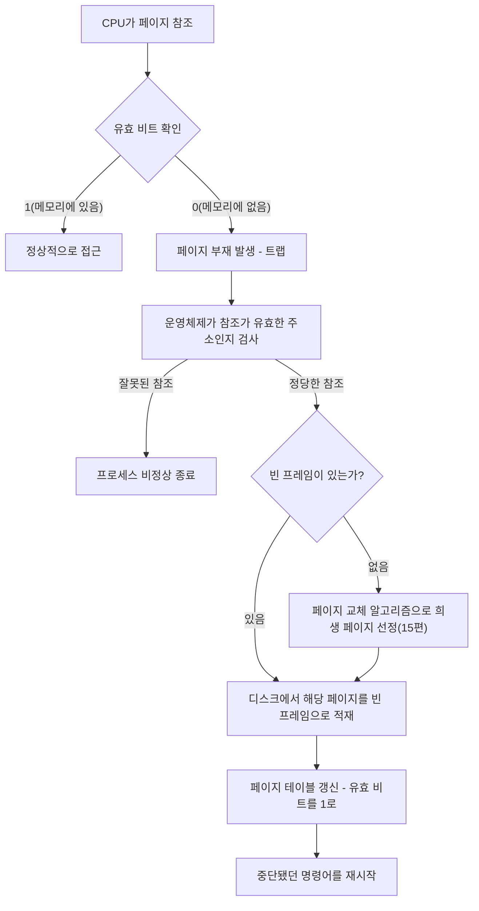

<Callout type="info">
  **이번 문서의 목표:** 이 파일을 다 읽으면 가상메모리가 실제 물리 메모리보다 큰 주소 공간을 어떻게 흉내 내는지, 요구 페이징에서 페이지 부재가 처리되는 전체 순서를 설명할 수 있다.
</Callout>

## 왜 물리 메모리보다 큰 프로그램을 실행할 수 있는가

13편에서 페이징을 배웠다. 페이징의 전제는 "프로세스의 모든 페이지가 시작 전에 물리 메모리(프레임)에 다 올라가 있다"는 것이었다. 그런데 실제로는 이상한 일이 자주 벌어진다. 4GB(기가바이트, gigabyte)짜리 프로그램을 물리 메모리가 2GB뿐인 컴퓨터에서 실행하는 경우다. 어떻게 이게 가능할까?

> **쉽게 말하면:** 가상메모리는 "지금 당장 필요한 부분만 메모리에 올려 두고, 나머지는 필요할 때 가져오면 된다"는 아이디어다.

**가상메모리**(virtual memory)는 프로세스에게 실제 물리 메모리 크기와 무관하게, 훨씬 크고 연속된 주소 공간을 쓰는 것처럼 보이게 하는 기법이다. 핵심 관찰은 "프로그램은 실행되는 매 순간 자신의 전체 코드·데이터를 다 쓰지 않는다"는 것이다. 예외 처리 코드, 잘 안 쓰는 기능, 초기화 후 다시 안 쓰는 변수들은 대부분의 실행 시간 동안 메모리에 없어도 된다. 그래서 **지금 실제로 쓰는 페이지만** 물리 메모리에 올려 두고, 나머지는 디스크의 **스왑 영역**(swap area, 페이지를 임시로 보관하는 디스크 공간)에 놓아둔다.

## 요구 페이징 — 필요할 때 가져온다

### 개념과 동작 원리

**요구 페이징**(demand paging)은 프로세스를 실행할 때 모든 페이지를 한꺼번에 메모리에 올리지 않고, 그 페이지가 실제로 **참조**(reference, CPU가 특정 주소를 읽거나 쓰려고 접근하는 것)될 때 비로소 메모리로 가져오는 방식이다. "요구가 있을 때(demand) 페이징한다"는 이름 그대로다.

이를 구현하려면 페이지 테이블에 한 가지 정보가 추가로 필요하다. 바로 **유효 비트**(valid bit, 또는 present bit)다. 페이지 테이블의 각 항목에 이 비트를 두어, 그 페이지가 현재 물리 메모리(프레임)에 실제로 올라와 있으면 1(유효), 디스크에만 있고 메모리엔 없으면 0(무효)으로 표시한다.

### 페이지 부재 처리 절차

CPU가 유효 비트가 0인 페이지를 참조하면 **페이지 부재**(page fault)라는 예외가 발생한다. 이름과 달리 이것은 오류가 아니라, "이 페이지를 디스크에서 가져와야 한다"는 정상적인 신호다.

<Steps>

1. CPU가 어떤 논리 주소를 참조한다.
2. 페이지 테이블을 찾아보니 유효 비트가 0이다 → **페이지 부재 트랩**(page fault trap) 발생, 제어권이 운영체제로 넘어간다.
3. 운영체제는 이 참조가 프로세스가 정당하게 쓸 수 있는 주소인지 확인한다. 아니라면 **세그멘테이션 오류**(segmentation fault) 등으로 프로세스를 강제 종료한다.
4. 정당한 참조라면 빈 프레임을 찾는다. 빈 프레임이 없으면 **페이지 교체**(page replacement, 15편에서 FIFO·LRU·OPT로 상세히 다룬다)로 내보낼 페이지를 고른다.
5. 디스크의 스왑 영역에서 필요한 페이지를 그 프레임으로 읽어 들인다(디스크 입출력이라 상대적으로 느리다).
6. 페이지 테이블의 유효 비트를 1로 바꾸고, 프레임 번호를 채워 넣는다.
7. 페이지 부재를 일으켰던 그 명령어를 처음부터 다시 실행한다. 이번엔 유효 비트가 1이므로 정상적으로 진행된다.

</Steps>

> **자주 틀리는 점:** 페이지 부재가 발생한 명령어는 "이어서" 실행되는 게 아니라 **처음부터 재시작**된다. 명령어 하나가 메모리 접근을 여러 번 하는 경우(예: `A = B + C`처럼 두 개의 값을 읽어야 하는 연산)를 대비해 하드웨어가 명령어 실행 전체를 되돌릴 수 있게 설계되어 있어야 한다.

### 페이지 부재율과 유효 접근 시간

시험에서는 페이지 부재가 성능에 미치는 영향을 수치로 묻는다. **유효 접근 시간**(Effective Access Time, EAT)은 페이지 부재를 고려한 평균 메모리 접근 시간이다.

$$
EAT = (1 - p) \times m_a + p \times m_f
$$

- $p$: 페이지 부재율(page fault rate). 메모리 참조 100번 중 몇 번이 페이지 부재인지의 비율(0에서 1 사이 값).
- $m_a$: 메모리 접근 시간(memory access time, 페이지 부재 없이 정상적으로 메모리에 접근하는 데 걸리는 시간).
- $m_f$: 페이지 부재 처리 시간(page fault service time, 디스크 입출력을 포함해 페이지를 가져오고 재개하기까지 걸리는 시간).

**작은 예시로 계산해 보자.** 메모리 접근 시간이 100나노초(ns), 페이지 부재 처리 시간이 8밀리초(ms, 1ms = 1,000,000ns), 페이지 부재율이 0.001(0.1퍼센트)이라 하자.

$$
EAT = (1 - 0.001) \times 100 + 0.001 \times 8{,}000{,}000
$$

$$
EAT = 99.9 + 8000 = 8099.9 \text{ 나노초}
$$

**결과 해석:** 페이지 부재 확률이 겨우 0.1퍼센트에 불과한데도, 정상 접근(약 100ns)보다 80배 느린 결과(약 8,100ns)가 나왔다. 이는 디스크 입출력이 메모리 접근보다 수만 배 느리기 때문이다. 그래서 운영체제는 페이지 부재율을 낮추는 것 — 즉 15편에서 다룰 좋은 페이지 교체 알고리즘 선택 — 이 성능에 결정적이라는 사실을 이 계산이 보여준다.

## 지역성의 원리 — 왜 요구 페이징이 실제로 잘 작동하는가

요구 페이징이 그럴듯한 이론에 그치지 않고 실전에서 잘 작동하는 이유는 프로그램 실행 패턴에 있는 **지역성의 원리**(principle of locality) 덕분이다.

> **쉽게 말하면:** 프로그램은 한 번에 조금씩, 그것도 최근에 쓴 곳 근처만 반복해서 건드리는 경향이 있다.

지역성은 두 종류로 나뉜다.

- **시간 지역성**(temporal locality): 최근에 참조한 주소는 가까운 미래에 또 참조될 가능성이 높다. 예: 반복문(loop) 안의 변수는 반복될 때마다 계속 다시 쓰인다.
- **공간 지역성**(spatial locality): 어떤 주소를 참조했다면, 그 주변 주소도 곧 참조될 가능성이 높다. 예: 배열(array)을 처음부터 끝까지 순서대로 훑는 경우, 인접한 주소들이 연달아 참조된다.

지역성이 있기 때문에 프로세스가 실제로 참조하는 페이지의 집합은 전체 주소 공간에 비해 작은 부분에 몰려 있고, 이 작은 부분만 메모리에 올려 둬도 대부분의 참조가 무리 없이 처리된다. 지역성이 없다면 매 참조마다 새로운 페이지를 가져와야 해서 요구 페이징의 이득이 사라진다.

## 작업 집합과 스래싱

### 작업 집합

**작업 집합**(working set)은 어떤 프로세스가 최근 일정 시간(윈도우, window) 동안 실제로 참조한 페이지들의 집합이다. 지역성 덕분에 이 집합의 크기는 프로세스 전체 크기보다 훨씬 작게 유지된다. 운영체제가 각 프로세스의 작업 집합 크기만큼은 프레임을 보장해 주면, 그 프로세스는 페이지 부재를 자주 겪지 않고 원활히 실행된다.

### 스래싱 — 너무 적은 프레임의 대가

> **쉽게 말하면:** 스래싱은 컴퓨터가 실제 일은 안 하고 페이지를 들여오고 내보내는 데만 시간을 다 쓰는 상태다.

**스래싱**(thrashing)은 프로세스에 할당된 프레임 수가 그 프로세스의 작업 집합 크기보다 작아서, 방금 내보낸 페이지를 곧바로 다시 불러오는 일이 반복되며 CPU 이용률이 오히려 급격히 떨어지는 현상이다. 여러 프로세스를 동시에 실행하려고 다중프로그래밍(multiprogramming) 정도를 높이면, 프로세스당 배정 가능한 프레임 수가 줄어들어 각 프로세스가 작업 집합을 유지하지 못하고 페이지 부재를 계속 일으킨다. 페이지 부재가 늘면 디스크 입출력 대기가 늘고, CPU는 놀게 되며, 운영체제는 "CPU가 논다"고 오판해 다중프로그래밍 정도를 더 높이는 악순환에 빠진다.

이 악순환을 끊는 방법은 다중프로그래밍 정도를 오히려 **낮추는** 것이다. 운영체제는 각 프로세스의 작업 집합 크기를 추정해, 전체 프레임 합이 부족하면 일부 프로세스를 통째로 스왑 아웃(swap out, 디스크로 내보냄)시켜 남은 프로세스들이 각자 충분한 프레임을 갖도록 조정한다.

> **비유:** 스래싱은 사무실 책상이 너무 좁아 서류를 펼 공간이 없어서, 서류 하나를 꺼내면 다른 서류를 치우고 그 서류를 다시 쓰려면 방금 치운 서류를 또 꺼내는 일을 반복하는 것과 같다. 실제 업무(계산)는 하나도 진행되지 않고 서류 넣었다 뺐다(디스크 입출력)만 반복된다.

## 핵심 정리

- 가상메모리는 실제 물리 메모리 크기보다 큰 주소 공간을 프로세스에게 제공하는 기법이며, 요구 페이징으로 구현된다.
- 요구 페이징은 페이지 테이블의 유효 비트로 "메모리에 있는지"를 표시하고, 없으면 페이지 부재 트랩을 일으켜 디스크에서 가져온다.
- 유효 접근 시간(EAT) 공식 $EAT = (1-p)m_a + p \cdot m_f$ 로, 아주 작은 페이지 부재율도 평균 접근 시간을 크게 늘릴 수 있음을 확인했다.
- 시간 지역성·공간 지역성 덕분에 요구 페이징이 실전에서 효율적으로 작동한다.
- 프레임이 작업 집합보다 부족하면 스래싱이 발생하며, 해법은 다중프로그래밍 정도를 낮추는 것이다.

## 마무리 복습

<Quiz
  questionNumber={1}
  question="요구 페이징(demand paging)에 대한 설명으로 가장 적절한 것은?"
  options={['프로세스 실행 전에 모든 페이지를 미리 메모리에 적재한다', '페이지가 실제로 참조될 때 비로소 메모리로 가져온다', '페이지 테이블 없이 세그먼트만으로 주소를 변환한다', '항상 프로세스 전체를 디스크에서 한 번에 스왑 인한다']}
  correctAnswer={2}
  explanation="요구 페이징은 이름 그대로 요구(참조)가 있을 때 그 페이지만 메모리로 가져오는 방식이다."
  optionExplanations={['모든 페이지를 미리 적재하는 것은 순수 페이징의 전제이며 요구 페이징의 목적과 반대다', '정답. 참조 시점에 필요한 페이지만 가져오는 것이 요구 페이징의 핵심이다', '요구 페이징은 페이지 테이블의 유효 비트를 활용하는 페이징 기반 기법이다', '요구 페이징은 페이지 단위로 필요한 것만 가져오지 프로세스 전체를 한 번에 옮기지 않는다']}
/>

<Quiz
  questionNumber={2}
  question="페이지 테이블의 유효 비트(valid bit)가 0으로 설정된 페이지를 CPU가 참조했을 때 가장 먼저 발생하는 일은?"
  options={['해당 주소의 데이터가 자동으로 0으로 초기화된다', '페이지 부재 트랩이 발생해 운영체제로 제어권이 넘어간다', '프로세스가 즉시 강제 종료된다', '아무 일도 일어나지 않고 다음 명령어로 넘어간다']}
  correctAnswer={2}
  explanation="유효 비트가 0인 페이지 참조는 그 페이지가 메모리에 없다는 뜻이며, 하드웨어가 즉시 페이지 부재 트랩을 발생시켜 운영체제가 페이지를 가져오는 절차를 시작하게 한다."
  optionExplanations={['유효 비트 0은 데이터 초기화와 무관하며 메모리 부재를 의미할 뿐이다', '정답. 페이지 부재 트랩이 먼저 발생하고 이후 운영체제가 처리 절차를 진행한다', '정당한 참조라면 종료가 아니라 페이지를 가져와 계속 실행한다', '유효 비트가 0이면 반드시 페이지 부재 트랩이라는 예외적 처리가 필요하다']}
/>

<Quiz
  questionNumber={3}
  question="메모리 접근 시간이 200나노초, 페이지 부재 처리 시간이 10밀리초, 페이지 부재율이 0.002일 때 유효 접근 시간(EAT)에 가장 가까운 값은?"
  options={['약 200.4나노초', '약 20,199.6나노초', '약 10,000,000나노초', '약 400나노초']}
  correctAnswer={2}
  explanation="EAT = (1-0.002)×200 + 0.002×10,000,000(10ms를 나노초로 환산) = 199.6 + 20,000 = 20,199.6나노초다."
  optionExplanations={['페이지 부재 처리 시간을 반영하지 않은 정상 접근 시간만 계산한 값이다', '정답. 공식에 정확히 대입하면 약 20,199.6나노초가 나온다', '부재율을 곱하지 않고 부재 처리 시간 전체를 그대로 쓴 잘못된 계산이다', '단순히 접근 시간을 두 배로 계산한 값으로 공식을 적용하지 않았다']}
/>

<Quiz
  questionNumber={4}
  question="시간 지역성(temporal locality)과 공간 지역성(spatial locality)을 올바르게 짝지은 것은?"
  options={['시간 지역성은 인접한 주소가 곧 참조되는 경향, 공간 지역성은 최근 참조한 주소가 다시 참조되는 경향이다', '시간 지역성은 최근 참조한 주소가 다시 참조되는 경향, 공간 지역성은 인접한 주소가 곧 참조되는 경향이다', '두 지역성 모두 배열을 순차적으로 접근하는 경우에만 적용된다', '두 지역성 모두 반복문 안의 변수 참조에만 적용된다']}
  correctAnswer={2}
  explanation="시간 지역성은 시간 축에서 같은 주소를 반복 참조하는 경향(예: 반복문 변수)이고, 공간 지역성은 공간(주소) 축에서 인접한 주소를 잇달아 참조하는 경향(예: 배열 순회)이다."
  optionExplanations={['시간 지역성과 공간 지역성의 정의가 서로 뒤바뀐 설명이다', '정답. 시간 축과 공간 축의 정의를 정확히 짝지었다', '공간 지역성이 배열 순회의 대표 사례이지만 시간 지역성은 반복문 변수 재참조 등 다른 상황에도 적용된다', '반복문 변수 재참조는 시간 지역성의 사례이며 공간 지역성은 다른 상황에도 적용된다']}
/>

<Quiz
  questionNumber={5}
  question="작업 집합(working set)의 개념을 가장 정확히 설명한 것은?"
  options={['프로세스가 생성될 때 할당받는 최대 프레임 수', '프로세스가 최근 일정 시간 동안 실제로 참조한 페이지들의 집합', '디스크에 존재하는 모든 페이지의 목록', '운영체제가 관리하는 전체 프레임 목록']}
  correctAnswer={2}
  explanation="작업 집합은 최근 윈도우 시간 동안 실제로 참조된 페이지들의 모임으로, 지역성 덕분에 전체 프로세스 크기보다 작게 유지된다."
  optionExplanations={['작업 집합은 프레임 할당량이 아니라 실제 참조된 페이지의 집합을 뜻한다', '정답. 최근 참조된 페이지의 집합이라는 정의가 정확하다', '디스크에 있는 전체 페이지 목록은 작업 집합과 무관하다', '전체 프레임 목록은 시스템 전역 자원이며 프로세스별 작업 집합과는 다른 개념이다']}
/>

<Quiz
  questionNumber={6}
  question="스래싱(thrashing)이 발생했을 때 나타나는 현상과 그 해결책으로 옳은 것은?"
  options={['CPU 이용률이 급락하며, 해결책은 다중프로그래밍 정도를 낮추는 것이다', 'CPU 이용률이 급증하며, 해결책은 다중프로그래밍 정도를 높이는 것이다', '디스크 입출력이 사라지며, 해결책은 페이지 크기를 줄이는 것이다', '페이지 부재가 전혀 발생하지 않으며, 해결책이 필요 없다']}
  correctAnswer={1}
  explanation="스래싱은 프레임 부족으로 페이지 부재가 급증해 CPU가 실제 연산 대신 디스크 입출력 대기로 시간을 보내는 현상이며, 다중프로그래밍 정도를 낮춰 프로세스당 프레임을 늘리는 것이 해결책이다."
  optionExplanations={['정답. CPU 이용률 급락과 다중프로그래밍 정도 완화라는 원인-해결 관계를 정확히 짚었다', '다중프로그래밍 정도를 높이는 것은 스래싱의 원인이지 해결책이 아니며 CPU 이용률도 급락한다', '스래싱은 오히려 디스크 입출력이 폭증하는 현상이다', '스래싱은 페이지 부재가 급증하는 상태이므로 이 설명은 사실과 반대다']}
/>

## 참고 자료

- [KOCW 운영체제 강의자료 - Introduction](http://contents.kocw.or.kr/KOCW/document/2013/kyungsung/yangheejae/os01.pdf)
- [운영체제_Study 저장소 README](https://github.com/yonghwankim-dev/OperatingSystem_Study/blob/main/README.md)
