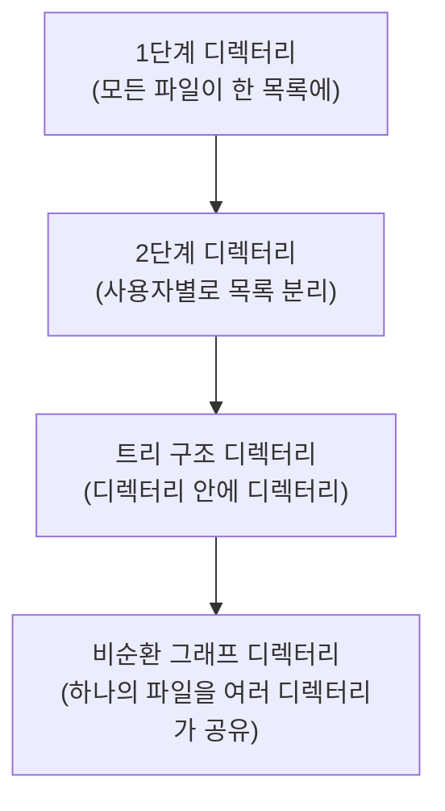
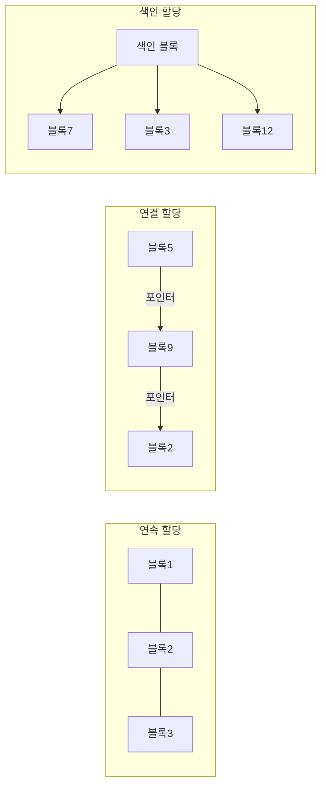

<Callout type="info">
  **이번 문서의 목표:** 이 파일을 다 읽으면 파일이 운영체제 안에서 어떤 정보로 관리되는지, 디렉터리 구조의 종류와 파일 할당 방식의 큰 갈래를 구분해 설명할 수 있다.
</Callout>

## 왜 파일이라는 추상화가 필요한가

지금까지 12~15편에서는 프로세스가 실행되는 동안 쓰는 메모리를 다뤘다. 그런데 메모리는 전원이 꺼지면 내용이 사라지는 **휘발성**(volatile) 저장장치다. 프로그램의 결과물이나 데이터를 전원이 꺼져도 남기려면 디스크 같은 **비휘발성**(non-volatile) 저장장치에 저장해야 한다.

문제는 디스크 자체는 그저 "몇 번 섹터(sector, 디스크를 나누는 최소 저장 단위)에 어떤 비트가 있다"는 물리적 정보만 가지고 있다는 점이다. 사용자나 프로그램이 매번 "몇 번 섹터부터 몇 번 섹터까지 읽어라"고 지정하는 것은 너무 번거롭고 위험하다. 그래서 운영체제는 디스크의 물리적 배치를 감추고, 사용자에게는 **파일**(file)이라는 논리적 단위로 데이터를 다루게 해준다.

> **쉽게 말하면:** 파일 시스템은 "디스크의 복잡한 물리적 위치"를 몰라도 "이름으로 데이터를 저장하고 불러올 수 있게" 해주는 껍데기다.

## 파일 — 이름을 가진 데이터 묶음

### 정의와 속성

**파일**(file)은 이름을 가진, 관련된 정보의 논리적 집합이다. 운영체제는 파일 하나하나를 관리하기 위해 각 파일마다 다음과 같은 **속성**(attribute)을 함께 저장한다.

| 속성 | 의미 |
|---|---|
| 이름(name) | 사람이 읽을 수 있는 형태로 붙인 파일의 식별자 |
| 식별자(identifier) | 파일 시스템 내부에서 파일을 구분하는 고유 번호(사람이 보는 이름과 별개) |
| 유형(type) | 텍스트, 실행 파일, 이미지 등 파일이 담은 데이터의 종류 |
| 위치(location) | 이 파일의 데이터가 디스크의 어느 블록들에 있는지 |
| 크기(size) | 현재 파일의 바이트 수 |
| 보호 정보(protection) | 누가 읽고·쓰고·실행할 수 있는지에 대한 접근 권한 |
| 시간·소유자 정보 | 생성 시각, 최종 수정 시각, 소유자 등 |

이 속성들을 저장해 두는 자료구조가 **FCB**(File Control Block, 파일 제어 블록)다. FCB는 파일마다 하나씩 존재하며, 디스크에 저장되어 있다가 파일이 열릴 때 메모리로 옮겨져 빠르게 참조된다. 6편에서 다룬 **PCB**(Process Control Block, 프로세스 제어 블록)가 프로세스의 신상정보를 담는 것과 정확히 같은 역할을, FCB는 파일에 대해 수행한다고 생각하면 이해가 쉽다.

> **비유:** FCB는 도서관 책마다 붙어 있는 "청구기호 카드"와 같다. 책 표지의 제목(파일 이름)만으로는 그 책이 서가 몇 번째 칸에 꽂혀 있는지(위치) 알 수 없지만, 카드에는 청구기호와 대출 가능 여부(권한), 등록일(생성 시각)까지 다 적혀 있다.

### 파일 연산

운영체제는 파일에 대해 기본적으로 다음과 같은 연산을 시스템 호출(system call, 01편에서 다룬 운영체제 기능 요청 창구)로 제공한다.

- **생성**(create): 새 파일을 만들고 FCB를 초기화한다.
- **열기**(open): 파일의 FCB를 디스크에서 메모리로 가져와 이후 접근을 준비한다.
- **읽기**(read) · **쓰기**(write): 파일 안의 특정 위치에서 데이터를 읽거나 쓴다.
- **위치 찾기**(seek): 다음 읽기·쓰기를 시작할 위치(파일 포인터)를 옮긴다.
- **닫기**(close): 메모리에 있던 FCB 정보를 정리하고 필요하면 디스크에 반영한다.
- **삭제**(delete): 파일과 그 공간 정보를 제거한다.

## 디렉터리 — 파일을 정리하는 목차

### 디렉터리의 역할

디스크에 파일이 수천, 수만 개 쌓이면 이름만으로 찾기가 힘들어진다. **디렉터리**(directory, 폴더)는 파일들을 이름별로 묶어 관리하는 자료구조로, 파일 이름과 그 파일의 FCB 위치(또는 FCB 자체)를 짝지어 저장한다. 디렉터리도 사실 하나의 특수한 파일이다 — "파일 이름과 위치의 목록"이라는 내용을 담은 파일인 셈이다.

### 디렉터리 구조의 종류

디렉터리를 어떻게 조직하느냐에 따라 다음과 같이 나뉜다.

- **1단계 디렉터리**(single-level directory): 시스템 전체에 디렉터리가 하나뿐이라 모든 파일이 같은 목록 안에 있다. 구조가 가장 단순하지만, 사용자가 늘어나면 **파일 이름이 겹치는 문제**(name collision)가 필연적으로 발생한다.
- **2단계 디렉터리**(two-level directory): 사용자마다 자신만의 디렉터리를 하나씩 갖는다. 사용자 간 이름 충돌은 해결되지만, 한 사용자가 자신의 파일을 다시 세부 주제별로 나눌 방법이 없다.
- **트리 구조 디렉터리**(tree-structured directory): 디렉터리 안에 또 다른 디렉터리(하위 디렉터리, subdirectory)를 만들 수 있어, 사용자가 원하는 만큼 계층을 깊게 만들 수 있다. 현재 대부분의 운영체제(윈도우 탐색기, 리눅스 파일 시스템)가 이 구조를 쓴다.
- **비순환 그래프 디렉터리**(acyclic-graph directory): 트리 구조에 더해 **같은 파일을 여러 디렉터리가 동시에 가리킬 수 있게**(공유, sharing) 한 구조다. 단, 사이클(순환 참조)이 생기면 무한히 자기 자신을 참조하는 구조적 오류가 되므로 "비순환"이라는 제약을 둔다.

### 경로명 — 파일의 주소

트리 구조에서 특정 파일을 가리키는 방법은 두 가지다.

- **절대 경로**(absolute path): 최상위 디렉터리(루트, root)부터 시작해 전체 경로를 다 적는 방식. 어디서 실행하든 항상 같은 파일을 가리킨다.
- **상대 경로**(relative path): 현재 작업 중인 디렉터리(현재 디렉터리, current directory)를 기준으로 적는 방식. 짧게 쓸 수 있지만 현재 위치가 바뀌면 가리키는 파일도 달라진다.

> **자주 틀리는 점:** 절대 경로는 항상 루트에서 출발하므로 프로그램을 어느 디렉터리에서 실행하든 결과가 같지만, 상대 경로는 "지금 어디서 실행했는가"에 따라 다른 파일을 가리킬 수 있다는 점이 시험에서 자주 지적된다.

## 파일 할당 방식 — 디스크 공간을 어떻게 나눠주는가

### 왜 할당 방식이 필요한가

파일 하나의 데이터는 디스크의 여러 **블록**(block, 디스크를 일정 크기로 나눈 저장 단위)에 나뉘어 저장된다. **파일 할당 방식**(file allocation method)은 "이 파일이 어떤 블록들을 쓰고 있는지"를 기록하고 관리하는 방법을 말한다. 이 개요 편에서는 세 가지 큰 갈래를 짚고, 세부 계산과 비교는 17편에서 이어간다.

- **연속 할당**(contiguous allocation): 파일에게 디스크에서 **연속된** 블록들을 통째로 배정한다. 12편에서 다룬 메모리의 연속 할당과 같은 개념을 디스크에 적용한 것이다. 접근이 빠르지만 외부 단편화가 생긴다.
- **연결 할당**(linked allocation): 각 블록이 다음 블록의 위치를 가리키는 **포인터**(pointer, 다른 데이터의 위치를 저장하는 값)를 갖는 방식으로, 블록들이 디스크 전체에 흩어져 있어도 연결 고리를 따라가면 전체 파일을 읽을 수 있다. 외부 단편화가 없지만 순차 접근만 효율적이고, 포인터가 손상되면 그 뒤 블록을 모두 잃는다.
- **색인 할당**(indexed allocation): 파일마다 하나의 **색인 블록**(index block)을 두어, 그 안에 이 파일이 쓰는 모든 블록의 위치를 목록으로 모아 둔다. 임의 접근(random access, 순서에 상관없이 원하는 위치로 바로 접근)이 빠르고 외부 단편화도 없지만, 색인 블록 자체를 저장할 추가 공간이 필요하다.

세 방식의 세부 구조, 대표적으로 쓰이는 **i-node**(색인 할당을 구현하는 자료구조) 구성, 그리고 방식 간 성능·단편화 비교표는 17편에서 자세히 다룬다.

## 핵심 정리

- 파일은 이름을 가진 논리적 데이터 집합이며, 이름·위치·크기·보호 정보 등의 속성은 FCB(File Control Block)에 저장된다.
- 디렉터리는 파일 이름과 위치를 짝지은 특수한 파일로, 1단계 → 2단계 → 트리 구조 → 비순환 그래프 구조로 발전해 왔다.
- 절대 경로는 루트부터, 상대 경로는 현재 디렉터리부터 시작하며 실행 위치에 따라 결과가 달라질 수 있는 쪽은 상대 경로다.
- 파일 할당 방식은 크게 연속 할당, 연결 할당, 색인 할당으로 나뉘며 각각 접근 속도와 단편화 특성이 다르다.
- 세부 계산과 i-node 구조, 할당 방식 비교표는 17편에서 이어진다.

## 마무리 복습

<Quiz
  questionNumber={1}
  question="FCB(File Control Block)에 대한 설명으로 가장 적절한 것은?"
  options={['프로세스의 실행 상태를 저장하는 자료구조다', '파일의 이름·위치·크기·보호 정보 등 속성을 저장하는 자료구조다', '디스크의 물리적 섹터 배치만을 기록하는 하드웨어 장치다', 'CPU 스케줄링에 사용되는 준비 큐의 항목이다']}
  correctAnswer={2}
  explanation="FCB는 파일마다 하나씩 존재하며 이름, 위치, 크기, 보호 정보 등 파일의 속성을 저장하는 자료구조로, PCB가 프로세스 정보를 담는 것과 대응되는 개념이다."
  optionExplanations={['프로세스의 실행 상태를 저장하는 것은 PCB(Process Control Block)다', '정답. FCB는 파일의 속성 정보를 담는 자료구조다', 'FCB는 소프트웨어 자료구조이며 하드웨어 장치가 아니다', '준비 큐는 CPU 스케줄링에서 프로세스를 관리하는 자료구조이며 FCB와는 다른 개념이다']}
/>

<Quiz
  questionNumber={2}
  question="트리 구조 디렉터리(tree-structured directory)의 특징으로 옳은 것은?"
  options={['시스템 전체에 디렉터리가 단 하나만 존재한다', '사용자마다 디렉터리 하나씩만 허용되고 하위 디렉터리를 만들 수 없다', '디렉터리 안에 하위 디렉터리를 만들어 계층을 원하는 만큼 깊게 구성할 수 있다', '같은 파일을 여러 디렉터리가 동시에 가리키는 것이 구조적으로 항상 금지된다']}
  correctAnswer={3}
  explanation="트리 구조 디렉터리는 디렉터리 안에 또 다른 하위 디렉터리를 자유롭게 만들 수 있어 사용자가 원하는 깊이로 파일을 조직할 수 있다."
  optionExplanations={['디렉터리가 단 하나뿐인 것은 1단계 디렉터리의 특징이다', '하위 디렉터리를 만들 수 없는 것은 2단계 디렉터리의 한계이며 트리 구조와는 다르다', '정답. 계층적으로 하위 디렉터리를 구성할 수 있다는 점이 트리 구조의 핵심이다', '여러 디렉터리가 파일을 공유하는 것은 비순환 그래프 디렉터리에서 가능하며 트리 구조 자체가 이를 금지하지는 않지만 이 선택지의 핵심 오류는 트리 구조의 특징을 묻는 문항의 정답이 아니라는 점이다']}
/>

<Quiz
  questionNumber={3}
  question="절대 경로(absolute path)와 상대 경로(relative path)에 대한 설명으로 옳지 않은 것은?"
  options={['절대 경로는 루트 디렉터리부터 시작해 전체 경로를 표기한다', '상대 경로는 현재 작업 디렉터리를 기준으로 표기한다', '상대 경로는 실행 위치가 달라져도 항상 같은 파일을 가리킨다', '절대 경로는 실행 위치와 무관하게 항상 같은 파일을 가리킨다']}
  correctAnswer={3}
  explanation="상대 경로는 현재 디렉터리를 기준으로 하므로, 프로그램을 실행하는 위치가 달라지면 같은 상대 경로 표기라도 서로 다른 파일을 가리킬 수 있다. 이것이 옳지 않은 것을 고르는 문항의 정답이다."
  optionExplanations={['절대 경로의 정의에 대한 옳은 설명이다', '상대 경로의 정의에 대한 옳은 설명이다', '정답. 상대 경로는 현재 디렉터리에 의존하므로 실행 위치가 바뀌면 다른 파일을 가리킬 수 있다', '절대 경로의 특성에 대한 옳은 설명이다']}
/>

<Quiz
  questionNumber={4}
  question="파일 할당 방식 중 연속 할당(contiguous allocation)의 특징으로 옳은 것은?"
  options={['디스크의 연속된 블록을 통째로 배정하며 외부 단편화가 발생할 수 있다', '각 블록이 다음 블록을 가리키는 포인터로 연결되어 흩어진 블록도 사용 가능하다', '파일마다 색인 블록을 두어 임의 접근을 빠르게 한다', '단편화가 전혀 발생하지 않는 유일한 할당 방식이다']}
  correctAnswer={1}
  explanation="연속 할당은 메모리의 연속 할당과 마찬가지로 디스크에서 연속된 블록들을 배정하는 방식으로, 파일들이 생성·삭제를 반복하면 외부 단편화가 발생할 수 있다."
  optionExplanations={['정답. 연속된 블록 배정과 외부 단편화 발생 가능성이 연속 할당의 핵심 특징이다', '포인터로 블록을 연결하는 방식은 연결 할당에 대한 설명이다', '색인 블록을 사용하는 방식은 색인 할당에 대한 설명이다', '연속 할당은 오히려 단편화(특히 외부 단편화)가 발생하기 쉬운 방식이다']}
/>

<Quiz
  questionNumber={5}
  question="파일 할당 방식 중 연결 할당(linked allocation)의 단점으로 가장 적절한 것은?"
  options={['임의 접근이 매우 빠르지만 색인 블록을 위한 추가 공간이 필요하다', '외부 단편화가 심하게 발생해 디스크 공간 활용도가 떨어진다', '포인터가 손상되면 그 이후 연결된 블록의 데이터를 모두 잃을 위험이 있다', '연속된 블록만 사용할 수 있어 디스크 공간을 유연하게 쓸 수 없다']}
  correctAnswer={3}
  explanation="연결 할당은 각 블록이 다음 블록을 가리키는 포인터로 이어지는 구조이므로, 중간의 포인터 하나가 손상되면 그 뒤로 연결된 블록들에 접근할 방법이 사라진다."
  optionExplanations={['임의 접근이 빠르고 색인 블록이 필요한 것은 색인 할당의 특징이다', '외부 단편화는 연속 할당에서 주로 발생하는 문제이며 연결 할당은 이 문제에서 비교적 자유롭다', '정답. 포인터 손상 시 이후 블록 전체에 접근할 수 없게 되는 것이 연결 할당의 대표적 약점이다', '연속된 블록만 쓰는 것은 연속 할당의 특징이며 연결 할당은 오히려 흩어진 블록을 자유롭게 사용한다']}
/>

<Quiz
  questionNumber={6}
  question="디렉터리(directory) 자체에 대한 설명으로 가장 정확한 것은?"
  options={['디렉터리는 하드웨어로 구현된 디스크 컨트롤러의 일부다', '디렉터리는 파일 이름과 그 위치 정보를 짝지어 저장하는 특수한 파일이다', '디렉터리는 프로세스의 상태 전이를 기록하는 자료구조다', '디렉터리는 오직 1단계 구조로만 구현할 수 있다']}
  correctAnswer={2}
  explanation="디렉터리는 파일 이름과 FCB 위치(혹은 FCB 자체)를 짝지은 목록을 담고 있는, 사실상 하나의 특수한 파일이다."
  optionExplanations={['디렉터리는 소프트웨어적인 자료구조이며 디스크 컨트롤러 하드웨어와는 다른 개념이다', '정답. 디렉터리는 파일 이름과 위치를 매핑한 정보를 담은 특수한 파일이라는 설명이 정확하다', '프로세스 상태 전이는 PCB와 프로세스 상태도가 다루는 영역이며 디렉터리와는 무관하다', '디렉터리는 1단계뿐 아니라 2단계, 트리 구조, 비순환 그래프 구조 등 다양하게 구현될 수 있다']}
/>

## 참고 자료

- [한국방송통신대학교 출판문화원 운영체제](https://press.knou.ac.kr/goods/ebookView.do?condCmdtCode=9788920045691&condLscValue=201)
- [운영체제 공룡책 목차 정리](https://responsibility.tistory.com/171)
