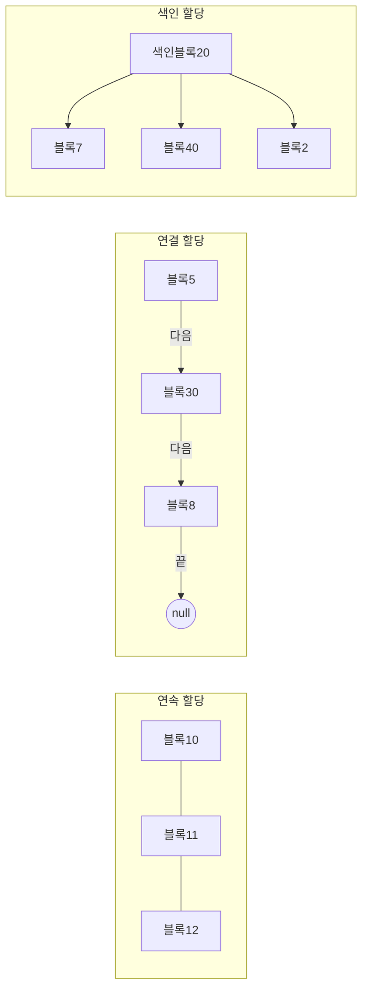
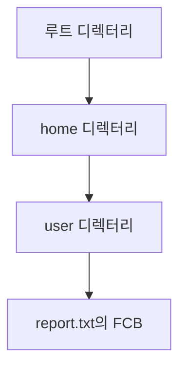

## 왜 "어떻게 저장할지"를 따로 배우는가

16편에서는 파일이 무엇이고 디렉터리가 어떤 구조로 파일을 묶는지를 다뤘습니다. 하지만 디렉터리 항목은 "이 파일이 어디에 있다"는 이름표일 뿐, 실제로 디스크의 어느 블록에 파일 내용이 담기는지는 **파일 할당 방식**(file allocation method)이 결정합니다.

## 1. 연속 할당 — 나란히 붙여 저장하기

**연속 할당**(contiguous allocation)은 파일에 필요한 블록 수만큼을 디스크에서 **연속된 위치**로 통째로 확보하는 방식입니다. 디렉터리 항목에는 시작 블록 번호와 길이(블록 수)만 저장하면 되므로 구조가 가장 단순합니다.

- **장점**: 순차 접근(sequential access, 처음부터 순서대로 읽기)과 직접 접근(direct access, 임의의 위치로 바로 이동해 읽기) 모두 빠릅니다. n번째 블록의 위치는 시작 블록 + n으로 한 번의 계산(덧셈)만으로 구해집니다.
- **단점**: 파일이 커지면 뒤에 다른 파일이 이미 자리 잡고 있어 확장이 어렵고, 파일을 생성·삭제하다 보면 디스크 곳곳에 자잘한 빈 공간이 남는 **외부 단편화**(external fragmentation, 12편에서 다룬 개념과 동일)가 발생합니다. 새 파일을 만들 때 몇 블록이 필요한지 미리 알아야 한다는 제약도 있습니다.

## 2. 연결 할당 — 다음 블록의 주소를 이어 붙이기

**연결 할당**(linked allocation)은 각 블록의 끝부분에 **다음 블록의 번호를 가리키는 포인터**를 저장해, 디스크 전체에 흩어진 블록들을 사슬(chain)처럼 잇는 방식입니다. 디렉터리 항목에는 첫 블록과 마지막 블록 번호만 있으면 됩니다.

- **장점**: 파일이 필요할 때마다 빈 블록 하나씩을 가져와 사슬 끝에 붙이면 되므로 외부 단편화가 없고, 파일 크기를 미리 알 필요도 없습니다.
- **단점**: n번째 블록을 읽으려면 처음 블록부터 포인터를 n−1번 따라가야 하므로 **직접 접근이 느립니다**(순차 접근만 효율적). 포인터 저장에 블록 일부를 써야 해 순수 데이터 공간이 줄고, 포인터 하나가 손상되면 그 뒤 블록을 모두 잃는 신뢰성 문제도 있습니다. 이를 보완한 것이 **FAT**(File Allocation Table, 파일 할당 표) 방식으로, 포인터를 블록 안이 아니라 디스크 한쪽의 별도 표에 모아 관리해 포인터 손상 위험을 줄입니다.

## 3. 색인 할당 — 블록 주소를 한곳에 모으기

**색인 할당**(indexed allocation)은 파일마다 **색인 블록**(index block)을 하나 따로 두고, 그 안에 파일을 구성하는 모든 블록의 번호를 모아 적어 두는 방식입니다. 디렉터리 항목은 이 색인 블록의 번호 하나만 가리킵니다.

- **장점**: 색인 블록만 먼저 읽으면 모든 블록 주소를 알 수 있어 **직접 접근이 빠르고**, 외부 단편화도 없습니다.
- **단점**: 아주 작은 파일도 색인 블록 하나를 통째로 써야 해 공간이 낭비되고, 파일이 아주 커서 블록 번호가 색인 블록 하나에 다 안 들어가면 **다단계 색인**(색인 블록이 다른 색인 블록을 가리키는 구조)이 필요해져 접근 단계가 늘어납니다.

```mermaid
graph LR
  subgraph 연속 할당
    C1[블록10] --- C2[블록11] --- C3[블록12]
  end
  subgraph 연결 할당
    L1[블록5] -->|다음| L2[블록30]
    L2 -->|다음| L3[블록8]
    L3 -->|끝| L4((null))
  end
  subgraph 색인 할당
    I0[색인블록20] --> I1[블록7]
    I0 --> I2[블록40]
    I0 --> I3[블록2]
  end
```

**자주 틀리는 점**: "연결 할당은 외부 단편화가 없다"와 "연속 할당은 외부 단편화가 없다"를 헷갈리는 문제가 많습니다. 외부 단편화가 없는 쪽은 연결·색인 할당이고, 연속 할당만 외부 단편화가 발생한다는 점을 정확히 짝지어야 합니다.

## 세 방식 비교표

| 기준 | 연속 할당 | 연결 할당 | 색인 할당 |
|------|-----------|-----------|-----------|
| 디렉터리 저장 정보 | 시작 블록, 길이 | 시작 블록, 끝 블록 | 색인 블록 번호 |
| 직접 접근 | 빠름(계산 한 번) | 느림(포인터 순회) | 빠름(색인만 먼저 읽음) |
| 외부 단편화 | 발생함 | 없음 | 없음 |
| 파일 크기 확장 | 어려움 | 쉬움 | 쉬움(색인 블록 한도 내) |
| 오버헤드 | 거의 없음 | 블록마다 포인터 공간 | 색인 블록 자체가 공간 차지 |

## n번째 블록 접근 단계 수 계산 예시

시험에서는 "파일의 5번째 블록에 접근하려면 디스크 접근이 몇 번 필요한가"를 묻는 유형이 나옵니다. 각 방식에서 디스크 접근 횟수를 정리하면 다음과 같습니다(색인 블록 자체를 읽는 것도 디스크 접근 1회로 셉니다).

| 방식 | 5번째 블록 접근에 필요한 디스크 접근 횟수 | 이유 |
|------|----------------------------------------|------|
| 연속 할당 | 1회 | 시작 주소에 4를 더해 바로 접근 |
| 연결 할당 | 5회 | 1→2→3→4→5번째 블록까지 포인터를 순서대로 따라감 |
| 색인 할당 | 2회 | 색인 블록 1회 + 색인이 가리키는 5번째 블록 1회 |

**자주 틀리는 점**: 연결 할당에서 "5번째 블록"에 접근할 때 몇 번을 세는지 실수하기 쉽습니다. 첫 블록을 1번째로 세면, 1번째 블록을 읽는 것 자체가 1회이므로 5번째 블록까지 총 5회 접근이 필요합니다(첫 블록 접근 1회 + 다음 포인터를 따라가는 4회로 계산해도 결과는 같습니다).

## 4. 파일 제어 블록(FCB) — 파일 하나의 신상 정보

**파일 제어 블록**(FCB, File Control Block)은 운영체제가 파일 하나를 관리하기 위해 유지하는 자료구조로, 디렉터리 항목이 가리키는 실체입니다. 06편에서 다룬 PCB(프로세스 제어 블록)가 프로세스의 신상 정보를 담듯, FCB는 파일의 신상 정보를 담습니다.

FCB에는 보통 다음과 같은 정보가 들어갑니다.

- 파일 이름과 식별자
- 파일 유형(텍스트, 실행 파일 등)
- 저장 위치(할당 방식에 따른 시작 블록 또는 색인 블록 번호)
- 파일 크기
- 접근 권한(20편에서 다룰 소유자·그룹·읽기/쓰기/실행 권한)
- 생성·수정·접근 시각

## 5. 디렉터리 탐색 — 경로를 따라 FCB까지 가기

파일을 열 때 운영체제는 경로(path)를 한 단계씩 해석하며 최종 FCB까지 찾아갑니다. 예를 들어 `/home/user/report.txt`와 같은 절대 경로(absolute path, 루트에서 시작하는 경로)가 주어지면, 루트 디렉터리부터 시작해 `home` 항목을 찾아 그 디렉터리를 열고, 그 안에서 다시 `user`를 찾는 과정을 파일을 발견할 때까지 반복합니다.

```mermaid
graph TD
  Root[루트 디렉터리] --> Home[home 디렉터리]
  Home --> User[user 디렉터리]
  User --> File[report.txt의 FCB]
```

디렉터리 구조가 트리(계층) 형태이면 이런 순차 탐색이 자연스럽지만, 탐색 단계가 많을수록 디스크 접근 횟수가 늘어나므로 자주 쓰는 디렉터리 정보를 메모리에 캐시하는 최적화가 함께 쓰입니다.

## 핵심 정리

- 연속 할당은 접근이 빠르지만 외부 단편화와 확장의 어려움이 있고, 연결 할당은 단편화가 없지만 직접 접근이 느리다.
- 색인 할당은 색인 블록을 한 번 더 읽는 대신 직접 접근을 빠르게 유지하며 외부 단편화도 없다.
- n번째 블록 접근 횟수는 연속 1회, 연결 n회, 색인 2회(색인 블록 포함)로 계산한다.
- FCB는 파일 하나의 이름·위치·크기·권한·시각을 담는 자료구조로, PCB의 파일 버전이다.
- 디렉터리 탐색은 경로를 한 단계씩 해석해 최종 FCB에 도달하는 과정이며, 절대 경로와 상대 경로로 나뉜다.

## 마무리 복습

<Quiz
  questionNumber={1}
  question={"파일 할당 방식 중 디스크 공간에 외부 단편화가 발생할 수 있는 방식은?"}
  options={["연속 할당","연결 할당","색인 할당","FAT 방식"]}
  correctAnswer={1}
  explanation={"연속 할당은 파일마다 연속된 블록을 통째로 확보하므로 생성·삭제가 반복되면 디스크 곳곳에 사용하지 못하는 자잘한 빈 공간, 즉 외부 단편화가 남는다."}
/>

<Quiz
  questionNumber={2}
  question={"연결 할당(linked allocation)의 단점으로 가장 적절한 것은?"}
  options={["파일 생성 전 크기를 미리 알아야 한다","직접 접근을 위해 앞 블록의 포인터를 순서대로 따라가야 한다","디스크에 외부 단편화가 발생한다","색인 블록이 별도로 필요해 공간을 낭비한다"]}
  correctAnswer={2}
  explanation={"연결 할당은 각 블록이 다음 블록의 포인터만 가지고 있으므로, n번째 블록에 접근하려면 첫 블록부터 포인터를 순서대로 따라가야 해 직접 접근 성능이 떨어진다."}
/>

<Quiz
  questionNumber={3}
  question={"어떤 파일이 색인 할당 방식으로 저장되어 있을 때, 이 파일의 7번째 블록에 접근하기 위해 필요한 디스크 접근 횟수는? (색인 블록은 한 단계이며 다단계 색인은 아니다)"}
  options={["1회","2회","7회","8회"]}
  correctAnswer={2}
  explanation={"색인 할당은 먼저 색인 블록을 읽어 각 블록의 위치를 확인한 뒤(1회), 색인이 가리키는 목표 블록으로 바로 이동해 읽으므로(1회) 총 2회의 디스크 접근이 필요하다."}
/>

## 참고 자료

- [운영체제_Study 저장소 README](https://github.com/yonghwankim-dev/OperatingSystem_Study/blob/main/README.md)
- [국가평생교육진흥원 독학학위제 - 과목별 평가영역](https://bdes.nile.or.kr/nile/study/nStudy2_1.do)
