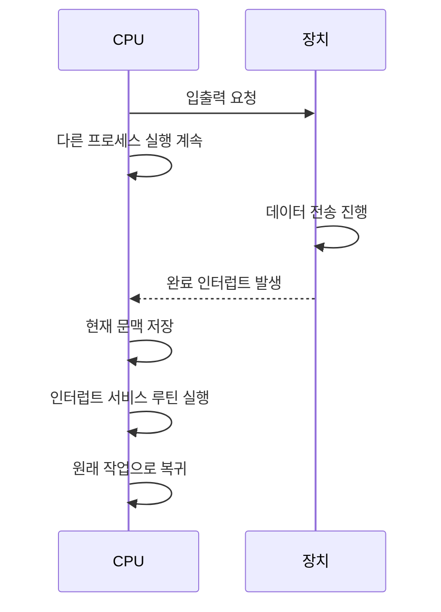

<Callout type="info">
  **이번 문서의 목표:** 이 파일을 다 읽으면 프로그램된 I/O, 인터럽트 기반 I/O, DMA를 CPU 개입 정도 기준으로 비교하고, 버퍼링과 스풀링이 왜 필요한지 설명할 수 있다.
</Callout>

## 왜 입출력이 골칫거리인가

CPU는 초당 수십억 번 연산을 처리하지만, 키보드·디스크·프린터 같은 **입출력 장치**(I/O device)는 이보다 훨씬 느립니다. 예를 들어 하드디스크의 데이터 접근 속도는 CPU 레지스터 접근 속도보다 자릿수가 몇 단계나 차이 날 정도로 느립니다. 이 속도 차이를 그대로 두면, CPU가 입출력이 끝나기를 마냥 기다리며 아무 일도 못 하는 시간이 생겨 시스템 전체 성능이 떨어집니다. 이 편에서 다루는 네 가지 전략(프로그램된 I/O, 인터럽트 기반 I/O, DMA, 버퍼링·스풀링)은 모두 "느린 장치와 빠른 CPU 사이의 속도 차이를 어떻게 흡수할 것인가"라는 하나의 문제에 대한 서로 다른 해법입니다.

> **쉽게 말하면:** 빠른 요리사(CPU)와 느린 배달원(I/O 장치) 사이에서, 요리사가 배달이 끝날 때까지 손 놓고 기다릴지, 다른 요리를 하다가 배달 완료 알림을 받을지, 아예 배달을 대신할 조수를 둘지 정하는 문제입니다.

## 1. 프로그램된 I/O — CPU가 계속 확인하기

**프로그램된 I/O**(programmed I/O)는 CPU가 입출력 장치의 상태 레지스터를 반복적으로 읽어(polling, 폴링) "작업이 끝났는가"를 계속 확인하는 방식입니다. 장치가 준비되었다는 신호가 뜰 때까지 CPU는 다른 일을 하지 못하고 이 확인 루프에 묶여 있습니다.

- **장점**: 구현이 단순하고, 인터럽트를 처리하는 부가 회로나 절차가 필요 없습니다.
- **단점**: CPU가 입출력이 끝날 때까지 다른 작업을 전혀 못 하는 **바쁜 대기**(busy waiting)가 발생해 CPU 자원을 크게 낭비합니다.

**자주 틀리는 점**: 폴링(polling)과 인터럽트(interrupt)를 반대로 외우는 경우가 많습니다. 폴링은 CPU가 능동적으로 "다 됐나요?"라고 계속 묻는 방식이고, 인터럽트는 장치가 CPU에게 "다 됐어요"라고 먼저 알리는 방식입니다.

## 2. 인터럽트 기반 I/O — 장치가 먼저 알려주기

**인터럽트 기반 I/O**(interrupt-driven I/O)는 CPU가 입출력 요청만 내린 뒤 다른 프로세스의 작업을 계속 수행하다가, 장치가 작업을 끝내면 **인터럽트**(interrupt, 02편에서 다룬 CPU에 대한 신호)를 걸어 CPU의 주의를 끄는 방식입니다. CPU는 인터럽트가 들어오면 현재 하던 작업의 문맥을 저장하고(06편의 문맥 교환과 유사한 절차), 인터럽트 서비스 루틴(ISR, Interrupt Service Routine)을 실행해 입출력 완료 처리를 한 뒤 원래 작업으로 돌아갑니다.

- **장점**: CPU가 바쁜 대기 없이 다른 작업을 계속 수행할 수 있어 자원 활용률이 높습니다.
- **단점**: 인터럽트가 자주 발생하면(예: 디스크에서 데이터를 한 바이트씩 옮길 때마다 인터럽트가 걸리면) 인터럽트를 처리하는 오버헤드(문맥 저장·복원 비용) 자체가 누적되어 부담이 됩니다.

## 3. DMA — 아예 전송을 떠맡기기

인터럽트 기반 I/O도 데이터를 한 단위(워드나 바이트)씩 옮길 때마다 CPU가 개입해야 한다는 한계가 있습니다. **DMA**(Direct Memory Access, 직접 메모리 접근)는 이 한계를 넘기 위해, CPU와 별도로 존재하는 **DMA 컨트롤러**(DMA controller)라는 전용 하드웨어에게 대량의 데이터 전송을 통째로 맡기는 방식입니다.

DMA의 동작 순서는 다음과 같습니다.

<Steps>

### 1. CPU가 DMA 컨트롤러에 작업 지시

CPU는 전송할 데이터의 시작 주소, 크기, 방향(읽기/쓰기)을 DMA 컨트롤러의 레지스터에 설정해 지시만 내립니다.

### 2. DMA 컨트롤러가 버스를 이용해 직접 전송

DMA 컨트롤러가 CPU를 거치지 않고 메모리와 장치 사이에서 시스템 버스를 통해 데이터를 직접 주고받습니다. 이 동안 CPU는 완전히 자유롭게 다른 연산을 수행할 수 있습니다.

### 3. 전송 완료 시 인터럽트로 통보

지정된 양의 전송이 모두 끝나면 DMA 컨트롤러가 CPU에 인터럽트를 걸어 작업이 끝났음을 알립니다.

</Steps>

> **쉽게 말하면:** 인터럽트 기반 I/O가 "택배가 한 상자 도착할 때마다 나를 불러 줘"라면, DMA는 "트럭 한 대 분량을 다 옮기고 나서 딱 한 번만 나를 불러 줘"입니다.

**자주 틀리는 점**: DMA가 CPU를 완전히 대체한다고 오해하는 경우가 있습니다. DMA는 데이터 **전송**만 대신할 뿐, 전송을 시작하라는 지시와 완료 후 처리는 여전히 CPU(운영체제)가 담당합니다. 또한 DMA 전송 중에는 DMA 컨트롤러가 버스를 점유하므로, CPU가 같은 버스를 통해 메모리에 접근하려 할 때 잠깐 대기해야 하는 **사이클 훔치기**(cycle stealing)가 발생할 수 있습니다.

## 세 방식 비교표

| 기준 | 프로그램된 I/O | 인터럽트 기반 I/O | DMA |
|------|---------------|-------------------|-----|
| CPU 개입 정도 | 완료까지 계속 확인(바쁜 대기) | 요청·완료 처리 시에만 개입 | 시작 지시·완료 처리 시에만 개입 |
| 전송 단위당 CPU 개입 | 매 확인마다 | 매 전송 단위마다 인터럽트 | 대량 전송 완료 후 1회 인터럽트 |
| 적합한 상황 | 아주 단순하거나 드문 입출력 | 소량·간헐적 입출력 | 디스크 등 대량 데이터 전송 |

## 4. 버퍼링과 스풀링 — 속도 차이를 완충하기

DMA로 전송 자체를 대신 시켜도, 장치가 데이터를 만들어 내는 속도와 CPU(또는 다른 프로세스)가 그 데이터를 소비하는 속도는 여전히 다를 수 있습니다. 이 속도 차이를 흡수하는 두 기법이 버퍼링과 스풀링입니다.

- **버퍼링**(buffering): 입출력 데이터를 메모리의 임시 공간인 **버퍼**(buffer)에 잠시 모아 두었다가 한꺼번에 처리하는 기법입니다. 예를 들어 네트워크에서 데이터가 조금씩 도착해도, 버퍼에 어느 정도 쌓일 때까지 기다렸다가 한 번에 처리하면 처리 효율이 올라갑니다. 버퍼가 하나면 채우는 동안 비우지 못하지만, 두 개를 번갈아 쓰는 **이중 버퍼링**(double buffering)을 쓰면 한쪽을 채우는 동안 다른 쪽을 비울 수 있어 끊김이 줄어듭니다.
- **스풀링**(spooling, Simultaneous Peripheral Operations On-Line의 약자): 프린터처럼 **한 번에 하나의 작업만 처리할 수 있는 장치**(비공유 장치)를 여러 프로세스가 동시에 요청할 때, 각 프로세스의 출력을 디스크의 임시 공간(스풀 공간)에 큐 형태로 저장해 두었다가 장치가 순서대로 꺼내 처리하게 하는 기법입니다.

> **쉽게 말하면:** 버퍼링은 물을 한 컵씩 마시지 않고 정수기 물통에 모아 뒀다가 마시는 것이고, 스풀링은 프린터 한 대를 여러 사람이 쓸 때 출력 요청을 대기열에 순서대로 쌓아 두는 것입니다.

**자주 틀리는 점**: 버퍼링과 스풀링을 같은 개념으로 착각하기 쉽습니다. 버퍼링은 **속도 차이**를 메우기 위한 임시 저장이고, 스풀링은 **여러 프로세스가 하나의 비공유 장치를 순서대로 쓰게** 하기 위한 큐잉(대기열)이라는 목적의 차이가 있습니다. 스풀링은 보통 디스크 공간을 이용하므로 버퍼링보다 저장 용량이 큽니다.

## 핵심 정리

- 프로그램된 I/O는 CPU가 계속 상태를 확인하는 바쁜 대기 방식으로 CPU 자원을 낭비한다.
- 인터럽트 기반 I/O는 장치가 완료를 알릴 때만 CPU가 개입해 자원 활용률을 높인다.
- DMA는 대량 데이터 전송 자체를 전용 컨트롤러에 맡기고, CPU는 시작 지시와 완료 처리만 담당한다.
- 버퍼링은 속도 차이를 흡수하기 위한 임시 저장, 스풀링은 비공유 장치를 여러 프로세스가 순서대로 쓰게 하는 큐잉이다.
- DMA 전송 중에는 버스를 DMA 컨트롤러가 점유해 CPU의 버스 접근이 잠깐 지연되는 사이클 훔치기가 발생할 수 있다.

## 마무리 복습

<Quiz
  questionNumber={1}
  question="CPU가 입출력 장치의 상태를 반복적으로 확인하며 완료를 기다리는 방식은?"
  options={['인터럽트 기반 I/O', 'DMA', '프로그램된 I/O', '스풀링']}
  correctAnswer={3}
  explanation="프로그램된 I/O(폴링)는 CPU가 장치의 상태 레지스터를 계속 확인하며 완료를 기다리는 바쁜 대기 방식이다."
  optionExplanations={['인터럽트 기반 I/O는 장치가 먼저 CPU에 신호를 보내는 방식이다.', 'DMA는 데이터 전송 자체를 전용 컨트롤러에 맡기는 방식이다.', '정답. 프로그램된 I/O가 CPU의 반복 확인(폴링) 방식이다.', '스풀링은 비공유 장치의 출력 요청을 큐로 관리하는 기법이다.']}
/>

<Quiz
  questionNumber={2}
  question="DMA(Direct Memory Access)에 대한 설명으로 가장 적절한 것은?"
  options={['CPU가 데이터를 한 바이트씩 직접 옮기는 방식이다.', 'DMA 컨트롤러가 CPU를 거치지 않고 메모리와 장치 사이의 데이터 전송을 담당한다.', 'DMA는 인터럽트를 전혀 사용하지 않는다.', 'DMA는 프로세스 간 통신을 담당하는 기법이다.']}
  correctAnswer={2}
  explanation="DMA는 CPU가 전송을 지시만 하면, 별도의 DMA 컨트롤러가 CPU 개입 없이 메모리와 장치 사이의 데이터 전송을 직접 수행하는 방식이다."
  optionExplanations={['DMA의 핵심은 CPU가 아니라 DMA 컨트롤러가 전송을 담당한다는 점이다.', '정답. DMA 컨트롤러가 CPU 없이 직접 전송을 수행한다.', 'DMA도 전송 완료 시점에는 CPU에 인터럽트를 걸어 알린다.', '프로세스 간 통신(IPC)은 09편에서 다룬 별개의 주제다.']}
/>

<Quiz
  questionNumber={3}
  question="DMA 전송 중 DMA 컨트롤러가 시스템 버스를 점유해 CPU의 버스 접근이 일시적으로 지연되는 현상을 무엇이라 하는가?"
  options={['바쁜 대기', '사이클 훔치기', '이중 버퍼링', '문맥 교환']}
  correctAnswer={2}
  explanation="DMA 컨트롤러가 버스를 사용하는 동안 CPU가 같은 버스로 메모리에 접근하려면 잠깐 기다려야 하는데, 이를 사이클 훔치기라고 한다."
  optionExplanations={['바쁜 대기는 프로그램된 I/O에서 CPU가 계속 확인하며 기다리는 현상이다.', '정답. DMA 컨트롤러가 버스 사이클을 잠깐씩 가져가는 현상을 사이클 훔치기라 한다.', '이중 버퍼링은 두 개의 버퍼를 번갈아 사용하는 버퍼링 기법이다.', '문맥 교환은 프로세스 전환 시 레지스터 상태를 저장·복원하는 절차다.']}
/>

<Quiz
  questionNumber={4}
  question="프린터처럼 한 번에 하나의 작업만 처리할 수 있는 장치를 여러 프로세스가 동시에 요청할 때, 각 출력 요청을 디스크에 큐 형태로 저장했다가 순서대로 처리하는 기법은?"
  options={['버퍼링', '스풀링', '인터럽트', 'DMA']}
  correctAnswer={2}
  explanation="스풀링은 비공유 장치를 여러 프로세스가 동시에 쓰려 할 때, 출력 요청을 디스크의 스풀 공간에 큐로 저장해 순서대로 처리하게 하는 기법이다."
  optionExplanations={['버퍼링은 속도 차이를 메우기 위한 임시 저장 기법으로 여러 프로세스의 순서 관리와는 다른 목적이다.', '정답. 비공유 장치의 출력 요청을 큐로 관리하는 기법이 스풀링이다.', '인터럽트는 장치가 CPU에 완료를 알리는 신호 방식이다.', 'DMA는 데이터 전송을 전용 컨트롤러에 맡기는 방식이다.']}
/>

<Quiz
  questionNumber={5}
  question="다음 중 입출력 방식에 대한 설명으로 옳지 않은 것은?"
  options={['인터럽트 기반 I/O는 완료 시점에만 CPU가 개입하므로 프로그램된 I/O보다 CPU 활용률이 높다.', 'DMA는 CPU의 시작 지시와 완료 처리 개입 없이 모든 과정을 완전히 독립적으로 수행한다.', '이중 버퍼링은 한쪽 버퍼를 채우는 동안 다른 쪽 버퍼를 비울 수 있어 끊김을 줄인다.', '폴링 방식은 장치 상태를 반복 확인하므로 CPU 자원을 낭비할 수 있다.']}
  correctAnswer={2}
  explanation="DMA도 전송을 시작하라는 지시와 전송 완료 후의 처리는 CPU(운영체제)가 담당한다. 완전히 독립적으로 모든 과정을 수행한다는 설명은 옳지 않다."
  optionExplanations={['옳은 설명이다. 인터럽트 기반 I/O는 완료 시에만 개입하므로 활용률이 더 높다.', '정답. DMA도 시작 지시와 완료 처리에는 CPU 개입이 필요하므로 옳지 않은 설명이다.', '옳은 설명이다. 이중 버퍼링의 정확한 동작 방식이다.', '옳은 설명이다. 폴링의 대표적인 단점이다.']}
/>

<Quiz
  questionNumber={6}
  question="버퍼링(buffering)과 스풀링(spooling)의 차이에 대한 설명으로 가장 적절한 것은?"
  options={['버퍼링은 여러 프로세스의 출력 순서를 관리하고, 스풀링은 속도 차이를 흡수한다.', '버퍼링은 속도 차이를 흡수하는 임시 저장이고, 스풀링은 비공유 장치를 여러 프로세스가 순서대로 쓰게 하는 큐잉이다.', '버퍼링과 스풀링은 완전히 동일한 개념으로 시험에서 구분하지 않는다.', '스풀링은 항상 메모리만 사용하고 디스크는 사용하지 않는다.']}
  correctAnswer={2}
  explanation="버퍼링은 속도 차이를 메우기 위한 임시 저장 기법이고, 스풀링은 비공유 장치를 여러 프로세스가 순서대로 이용하도록 요청을 큐로 관리하는 기법으로 목적이 다르다."
  optionExplanations={['버퍼링과 스풀링의 역할이 서로 바뀌어 설명되었다.', '정답. 목적의 차이(속도 흡수 대 순서 관리)를 정확히 짚었다.', '두 개념은 목적이 다르므로 동일하다고 볼 수 없다.', '스풀링은 보통 디스크의 별도 공간(스풀 공간)을 사용한다.']}
/>

## 참고 자료

- [KOCW 운영체제 강의자료 - Introduction](http://contents.kocw.or.kr/KOCW/document/2013/kyungsung/yangheejae/os01.pdf)
- [국가평생교육진흥원 독학학위제 - 과목별 평가영역](https://bdes.nile.or.kr/nile/study/nStudy2_1.do)
