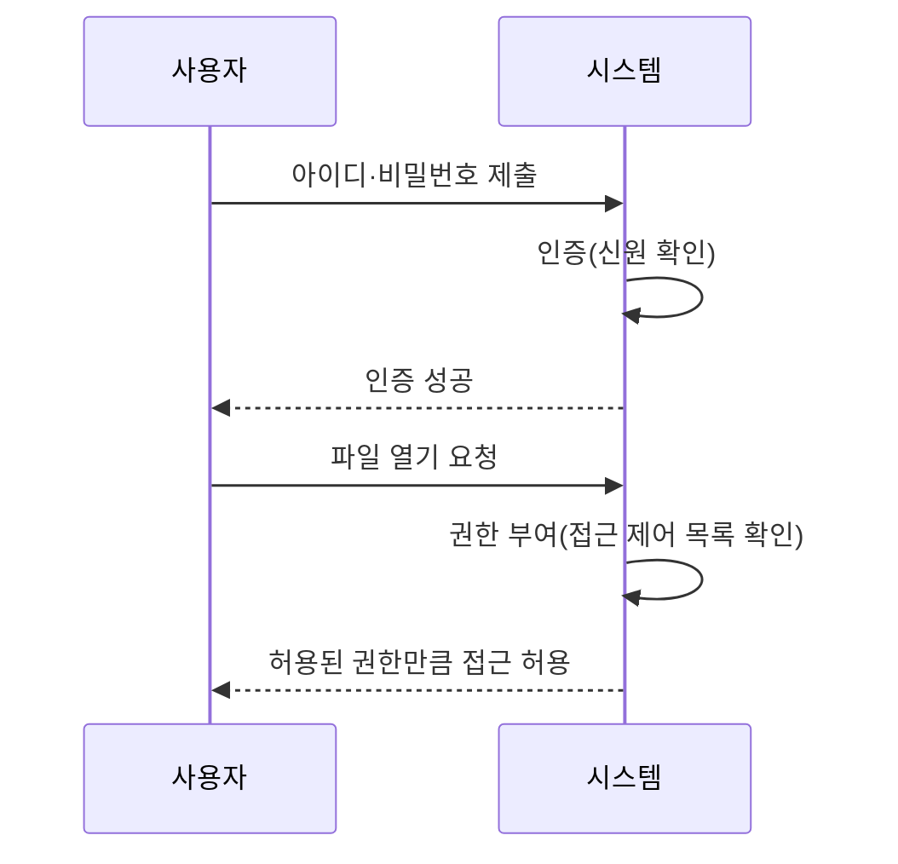

<Callout type="info">
  **이번 문서의 목표:** 이 파일을 다 읽으면 접근 제어 목록과 권한 비트의 동작 방식을 설명하고, 인증(authentication)과 권한 부여(authorization)를 명확히 구분하며, 대표적인 보안 위협의 이름과 특징을 말할 수 있다.
</Callout>

## 왜 보호와 보안을 마지막에 배우는가

지금까지 이 시리즈는 운영체제가 프로세스(06편)와 메모리(12~15편), 파일(16~17편)을 **효율적으로** 관리하는 방법을 다뤘습니다. 하지만 여러 사용자와 프로세스가 자원을 공유하는 순간, "효율적으로 나눠 쓴다"만으로는 부족해집니다. 어떤 프로세스가 다른 프로세스의 메모리를 함부로 들여다보거나, 권한이 없는 사용자가 남의 파일을 지울 수 있다면 시스템 전체가 위험해집니다. **보호**(protection)는 이런 상황을 막기 위해 운영체제 내부에서 자원에 대한 접근을 통제하는 메커니즘이고, **보안**(security)은 내부뿐 아니라 외부의 침입·변조 시도까지 포함해 시스템 전체를 안전하게 지키는 더 넓은 개념입니다.

> **쉽게 말하면:** 보호는 아파트 각 세대의 현관문 잠금장치(누가 어느 방에 들어갈 수 있는가)이고, 보안은 그 잠금장치를 포함해 단지 전체의 외부 침입 대비(CCTV, 경비실, 외벽)까지 아우르는 개념입니다.

## 1. 접근 제어 — 누가 무엇을 할 수 있는가

**접근 제어**(access control)는 어떤 주체(사용자나 프로세스)가 어떤 객체(파일, 메모리 영역, 장치)에 대해 어떤 연산(읽기, 쓰기, 실행)을 할 수 있는지를 정하는 규칙입니다. 이를 표 형태로 정리한 것이 **접근 행렬**(access matrix)로, 행은 주체, 열은 객체, 각 칸은 그 주체가 그 객체에 대해 가진 권한을 나타냅니다.

| 주체 \ 객체 | 파일 A | 파일 B | 프린터 |
|-------------|--------|--------|--------|
| 사용자 갑 | 읽기, 쓰기 | 읽기 | 사용 |
| 사용자 을 | 읽기 | 없음 | 사용 |

접근 행렬은 개념을 이해하기엔 좋지만 객체와 주체가 많아지면 행렬 대부분이 빈칸(권한 없음)이 되어 저장 공간이 낭비됩니다. 그래서 실제 시스템은 두 가지 방식으로 이 행렬을 압축해 구현합니다.

- **접근 제어 목록**(ACL, Access Control List): 행렬을 **열(객체) 기준**으로 쪼개, 각 객체마다 "누가 어떤 권한을 갖는가"의 목록을 붙입니다. "이 파일에 접근할 수 있는 사람은 누구인가"를 확인하기 쉽습니다.
- **권한 리스트**(capability list): 행렬을 **행(주체) 기준**으로 쪼개, 각 주체마다 "내가 어떤 객체에 어떤 권한을 갖는가"의 목록(권한, capability)을 지니게 합니다. "이 사용자가 무엇을 할 수 있는가"를 확인하기 쉽습니다.

> **쉽게 말하면:** ACL은 건물 각 방문에 "출입 가능자 명단"을 붙여 두는 방식이고, capability list는 각 사람에게 "출입 가능한 방 목록이 적힌 열쇠 꾸러미"를 쥐여 주는 방식입니다.

**자주 틀리는 점**: ACL과 capability list를 반대로 외우는 경우가 많습니다. **객체 기준으로 정리되면 ACL, 주체 기준으로 정리되면 capability list**라는 축을 명확히 구분해야 합니다.

## 2. 유닉스 계열의 파일 권한 모델

많은 운영체제 교재는 접근 제어의 실제 예로 유닉스(Unix) 계열의 권한 비트를 듭니다. 파일마다 **소유자**(owner), **그룹**(group), **기타**(others) 세 부류에 대해 각각 **읽기(r), 쓰기(w), 실행(x)** 권한을 부여합니다.

```
-rwxr-xr--
```

이 표기를 왼쪽부터 해석하면 다음과 같습니다.

1. 첫 글자 `-`는 파일 종류(일반 파일이면 `-`, 디렉터리면 `d`).
2. 다음 세 글자 `rwx`는 소유자 권한 — 읽기·쓰기·실행 모두 허용.
3. 다음 세 글자 `r-x`는 그룹 권한 — 읽기·실행은 허용하지만 쓰기는 금지(`-`).
4. 마지막 세 글자 `r--`는 기타 사용자 권한 — 읽기만 허용.

**자주 틀리는 점**: 권한 비트의 순서(소유자 → 그룹 → 기타)를 헷갈리면 "어떤 자리의 `-`가 어떤 권한이 없다는 뜻인지"를 잘못 읽습니다. 항상 앞의 세 자리부터 소유자, 그룹, 기타 순서로 3개씩 끊어 읽어야 합니다.

## 3. 인증과 권한 부여 — 다른 질문에 답하는 두 단계

시험에서 자주 헷갈리게 나오는 두 용어를 구분합니다.

- **인증**(authentication): "당신은 정말 그 사람이 맞습니까?"에 답하는 절차. 비밀번호, 생체 인식(지문·홍채), 보안 카드 등으로 신원을 확인합니다.
- **권한 부여**(authorization): 신원이 확인된 뒤, "그 사람은 무엇을 할 수 있습니까?"에 답하는 절차. 접근 제어 목록이나 권한 리스트를 확인해 실제 허용 범위를 결정합니다.

> **쉽게 말하면:** 인증은 회사 정문에서 사원증으로 "이 사람이 우리 직원이 맞다"를 확인하는 것이고, 권한 부여는 그 직원이 회사 안에서 "어느 층, 어느 방까지 들어갈 수 있는가"를 정하는 것입니다.



**자주 틀리는 점**: 로그인에 성공했다고 해서 모든 자원에 접근할 수 있는 것은 아닙니다. 인증(로그인 성공)과 권한 부여(그 자원에 대한 접근 허용 여부)는 **별개의 단계**이며, 인증에 성공해도 특정 파일에 대한 권한이 없으면 접근이 거부됩니다.

## 4. 대표적인 보안 위협

운영체제가 마주하는 대표적인 위협을 구분해 정리합니다. 이 위협들은 스스로 실행되는 방식과 확산 방식의 차이로 구분됩니다.

| 위협 | 실행 방식 | 확산 방식 |
|------|-----------|-----------|
| 바이러스(virus) | 정상 프로그램(숙주)에 코드를 몰래 삽입 | 숙주 프로그램이 실행될 때 함께 실행되며 다른 파일에 전파 |
| 웜(worm) | 독립적으로 실행되는 프로그램 | 숙주 없이 스스로 네트워크를 통해 다른 시스템으로 복제·확산 |
| 트로이 목마(Trojan horse) | 유용한 프로그램으로 위장 | 사용자가 직접 실행해야 동작하며 스스로 전파되지는 않음 |

이 외에도 사람의 심리를 이용해 정보를 캐내는 **사회공학**(social engineering, 예: 피싱 이메일로 비밀번호를 입력하게 유도)이나, 정상 요청을 대량으로 보내 서비스를 마비시키는 **서비스 거부 공격**(DoS, Denial of Service)도 운영체제·네트워크 보안에서 함께 다루는 위협입니다.

**자주 틀리는 점**: 바이러스와 웜을 같은 것으로 착각하기 쉽습니다. 핵심 차이는 **숙주 프로그램이 필요한가**입니다. 바이러스는 다른 프로그램에 기생해야 하지만, 웜은 독립적으로 실행되고 스스로 네트워크를 타고 퍼집니다.

## 핵심 정리

- 접근 행렬을 열(객체) 기준으로 쪼갠 것이 ACL, 행(주체) 기준으로 쪼갠 것이 capability list다.
- 유닉스 권한 비트는 소유자·그룹·기타 순서로 각각 읽기·쓰기·실행 3비트씩 표현한다.
- 인증은 "누구인지 확인", 권한 부여는 "무엇을 할 수 있는지 결정"으로 서로 다른 단계다.
- 바이러스는 숙주 프로그램이 필요하지만, 웜은 독립적으로 실행되며 스스로 확산된다.
- 트로이 목마는 유용한 프로그램으로 위장하지만 스스로 전파되지는 않는다는 점에서 웜과 다르다.

## 마무리 복습

<Quiz
  questionNumber={1}
  question="접근 행렬을 객체(파일) 기준으로 쪼개, 각 객체마다 접근 가능한 주체와 권한의 목록을 붙이는 방식은?"
  options={['권한 리스트(capability list)', '접근 제어 목록(ACL)', '인증 목록', '접근 행렬']}
  correctAnswer={2}
  explanation="접근 제어 목록(ACL)은 접근 행렬을 객체(열) 기준으로 쪼개, 각 객체에 접근 가능한 주체와 권한의 목록을 붙이는 방식이다."
  optionExplanations={['권한 리스트는 주체(행) 기준으로 쪼개는 방식이다.', '정답. ACL은 객체 기준으로 정리된 접근 제어 방식이다.', '인증 목록은 이 편에서 정의한 표준 용어가 아니다.', '접근 행렬은 ACL과 capability list로 나뉘기 전의 원본 개념이다.']}
/>

<Quiz
  questionNumber={2}
  question="유닉스 파일 권한 표기 `-rwxr-xr--`에서 그룹(group) 사용자에게 허용된 권한으로 옳은 것은?"
  options={['읽기, 쓰기, 실행 모두 허용', '읽기와 실행만 허용, 쓰기는 금지', '읽기만 허용', '아무 권한도 없음']}
  correctAnswer={2}
  explanation="네 번째~여섯 번째 글자인 r-x가 그룹 권한을 나타내며, 읽기(r)와 실행(x)은 허용되지만 쓰기(w) 자리는 -로 금지되어 있다."
  optionExplanations={['모든 권한이 허용된 것은 앞의 세 글자(소유자)에 해당한다.', '정답. 그룹 권한은 r-x로 읽기와 실행만 허용된다.', '읽기만 허용된 것은 마지막 세 글자(기타)에 해당한다.', '그룹에게는 읽기와 실행 권한이 부여되어 있다.']}
/>

<Quiz
  questionNumber={3}
  question="사용자가 아이디와 비밀번호로 로그인에 성공한 직후 벌어지는 절차를 무엇이라 하는가?"
  options={['인증(authentication)이 완료된 것이며, 이후 권한 부여(authorization) 단계에서 실제 접근 가능 범위가 결정된다.', '권한 부여가 완료되어 모든 자원에 접근할 수 있다.', '인증과 권한 부여가 동시에 끝나 별도 확인이 필요 없다.', '접근 제어 목록이 즉시 삭제된다.']}
  correctAnswer={1}
  explanation="로그인 성공은 신원을 확인하는 인증 단계의 완료를 뜻할 뿐이며, 특정 자원에 대한 실제 접근 허용 여부는 이후 권한 부여 단계에서 별도로 결정된다."
  optionExplanations={['정답. 인증과 권한 부여를 순서대로 정확히 구분한 설명이다.', '로그인 성공이 모든 자원에 대한 접근을 자동으로 허용하지는 않는다.', '인증과 권한 부여는 서로 다른 목적을 가진 별개의 단계다.', '접근 제어 목록은 로그인과 무관하게 계속 유지·관리되는 자료구조다.']}
/>

<Quiz
  questionNumber={4}
  question="숙주 프로그램 없이 독립적으로 실행되며 스스로 네트워크를 통해 다른 시스템으로 확산되는 악성 프로그램은?"
  options={['바이러스', '웜', '트로이 목마', '접근 제어 목록']}
  correctAnswer={2}
  explanation="웜은 숙주 프로그램이 필요 없이 독립적으로 실행되고, 스스로 네트워크를 통해 다른 시스템으로 복제·확산되는 악성 프로그램이다."
  optionExplanations={['바이러스는 숙주 프로그램에 기생해야 실행되고 전파된다.', '정답. 웜은 독립 실행과 자가 확산이 특징이다.', '트로이 목마는 유용한 프로그램으로 위장할 뿐 스스로 전파되지 않는다.', '접근 제어 목록은 악성 프로그램이 아니라 보호 메커니즘이다.']}
/>

<Quiz
  questionNumber={5}
  question="보호(protection)와 보안(security)의 관계에 대한 설명으로 옳지 않은 것은?"
  options={['보호는 시스템 내부에서 자원에 대한 접근을 통제하는 메커니즘을 가리킨다.', '보안은 외부 침입이나 변조 시도까지 포함하는 더 넓은 개념이다.', '보호와 보안은 완전히 동일한 범위를 다루므로 구분할 필요가 없다.', '접근 제어 목록이나 권한 비트는 보호 메커니즘의 예로 볼 수 있다.']}
  correctAnswer={3}
  explanation="보호는 시스템 내부의 접근 통제에 초점을 두고, 보안은 외부의 침입·변조 시도까지 포함하는 더 넓은 개념이므로 두 개념은 범위가 다르다. 완전히 동일하다는 설명은 옳지 않다."
  optionExplanations={['옳은 설명이다. 보호의 정의와 일치한다.', '옳은 설명이다. 보안이 보호보다 넓은 개념임을 정확히 설명했다.', '정답. 두 개념은 범위가 다르므로 동일하다는 설명은 옳지 않다.', '옳은 설명이다. ACL과 권한 비트는 대표적인 보호 메커니즘이다.']}
/>

<Quiz
  questionNumber={6}
  question="바이러스(virus)와 웜(worm)을 구분하는 가장 핵심적인 기준은?"
  options={['공격 대상이 서버인지 개인 컴퓨터인지', '숙주 프로그램이 필요한지 여부', '피해 규모의 크기', '발견된 연도']}
  correctAnswer={2}
  explanation="바이러스는 다른 정상 프로그램(숙주)에 기생해야 실행·전파되지만, 웜은 숙주 없이 독립적으로 실행되고 확산된다는 점이 두 위협을 구분하는 핵심 기준이다."
  optionExplanations={['공격 대상의 종류는 바이러스와 웜을 구분하는 정의상의 기준이 아니다.', '정답. 숙주 프로그램의 필요 여부가 핵심 구분 기준이다.', '피해 규모는 상황마다 달라 구분 기준이 될 수 없다.', '발견 연도는 정의와 무관한 기준이다.']}
/>

## 참고 자료

- [국가평생교육진흥원 독학학위제 - 과목별 평가영역](https://bdes.nile.or.kr/nile/study/nStudy2_1.do)
- [NIST Computer Security Resource Center](https://csrc.nist.gov)
