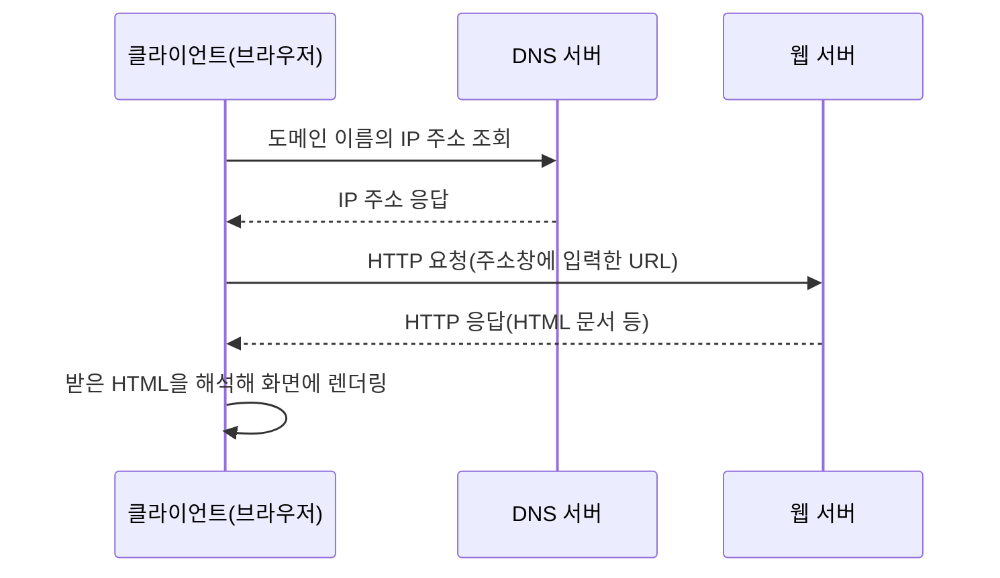

<Callout type="info">
  **이번 문서의 목표:** 이 문서를 다 읽으면 인터넷과 WWW의 관계, URL의 구성 요소, 클라이언트-서버 구조, HTTP 요청·응답의 흐름을 정확한 용어로 설명하고 관련 시험 문항을 풀 수 있다.
</Callout>

## 왜 이 편부터 시작하는가

이 과목은 HTML·CSS·JavaScript 문법을 다루지만, 그 문법이 실제로 "어디서, 누구에게, 어떻게" 전달되는지 모르면 폼(form)이 서버로 데이터를 보내는 과정이나 웹 페이지가 뜨는 순서를 이해할 수 없다. 웹 프로그래밍의 모든 코드는 결국 **인터넷이라는 통신망 위에서 클라이언트와 서버가 정보를 주고받는 과정**의 일부다. 그래서 본격적으로 태그와 문법을 배우기 전에, 이 통신 구조를 먼저 정확한 용어로 잡아 둔다. 독학사 시험에서도 이 부분은 "다음 중 옳은 것은?" 형태로 개념 정의를 정확히 구분하는 문제로 자주 나온다.

## 인터넷과 WWW의 관계

> **쉽게 말하면:** 인터넷은 전 세계 컴퓨터를 연결하는 통신망 자체이고, WWW(월드와이드웹)는 그 통신망 위에서 동작하는 여러 서비스 중 하나다.

**인터넷**(Internet)은 전 세계의 컴퓨터 네트워크를 서로 연결한 거대한 통신망이다. TCP/IP(Transmission Control Protocol/Internet Protocol, 전송 제어 프로토콜/인터넷 프로토콜)라는 공통 규약을 따르는 모든 장치가 여기에 연결되어 서로 데이터를 주고받는다. 인터넷 위에서는 이메일, 파일 전송, 웹 접속 등 여러 서비스가 동시에 돌아간다.

**WWW**(World Wide Web, 월드와이드웹)는 이 인터넷이라는 통신망 위에서 동작하는 서비스 중 하나로, 문서(웹 페이지)들이 **하이퍼링크**(hyperlink, 문서와 문서를 연결하는 링크)로 서로 연결된 거대한 정보 공간을 뜻한다. 즉 "인터넷에 접속한다"는 표현과 "웹을 이용한다"는 표현이 일상에서는 섞여 쓰이지만, 엄밀히는 인터넷이 더 큰 개념이고 WWW는 그 위에 얹힌 하나의 응용 서비스다. 이메일(email)도 인터넷 위의 서비스지만 WWW는 아니다.

> **자주 틀리는 점:** "인터넷 = WWW"로 착각하는 문항이 자주 나온다. 인터넷은 통신망 인프라, WWW는 그 위의 하이퍼텍스트 문서 서비스라는 **포함 관계**(WWW ⊂ 인터넷)를 명확히 구분해야 한다.

WWW를 가능하게 만드는 세 가지 핵심 기술은 다음과 같다.

| 기술 | 역할 | 이 과목에서 다루는 위치 |
|------|------|------------------------|
| HTML(HyperText Markup Language, 하이퍼텍스트 마크업 언어) | 문서의 구조와 내용을 표시 | 03편부터 |
| URL(Uniform Resource Locator, 통합 자원 지시자) | 자원(문서·이미지 등)의 위치를 지정 | 이 편에서 정리 |
| HTTP(HyperText Transfer Protocol, 하이퍼텍스트 전송 프로토콜) | 클라이언트와 서버가 문서를 주고받는 통신 규약 | 이 편에서 정리 |

이 세 가지가 합쳐져 "브라우저 주소창에 URL을 입력하면 HTTP로 요청이 전달되고, 서버가 HTML 문서를 응답으로 돌려준다"는 흐름이 완성된다.

## URL의 구성 요소

**URL**(Uniform Resource Locator, 통합 자원 지시자)은 인터넷에 있는 자원(웹 페이지, 이미지, 파일 등)의 위치를 표시하는 표준화된 문자열이다. 예를 들어 다음 URL을 조각내 보자.

```text
https://www.example.com:443/products/index.html?category=book&sort=price#reviews
```

| 구성 요소 | 값 | 의미 |
|-----------|-----|------|
| 스킴(scheme, 프로토콜) | `https` | 어떤 통신 규약을 쓸지 지정. `http`, `https`, `ftp` 등 |
| 호스트(host) | `www.example.com` | 자원이 있는 서버의 이름(도메인) |
| 포트(port) | `443` | 서버 안에서 어떤 프로그램(서비스)이 응답할지 구분하는 번호. 생략하면 스킴의 기본 포트(http는 80, https는 443)를 쓴다 |
| 경로(path) | `/products/index.html` | 서버 안에서 그 자원이 있는 위치(폴더·파일 구조) |
| 쿼리 스트링(query string) | `category=book&sort=price` | `?` 뒤에 오는 추가 정보. `키=값` 쌍을 `&`로 연결해 서버에 조건을 전달 |
| 프래그먼트(fragment, 조각 식별자) | `reviews` | `#` 뒤에 오는 문서 내부의 특정 위치(앵커) 표시. 서버로 전송되지 않고 브라우저 안에서만 쓰인다 |

> **쉽게 말하면:** URL은 "어떤 방법으로(스킴), 어느 집(호스트·포트)에서, 어떤 방(경로) 물건을, 어떤 조건(쿼리)으로 가져올지" 적어 놓은 주소다.

### 도메인과 IP 주소의 관계

컴퓨터끼리는 실제로 숫자로 된 **IP 주소**(Internet Protocol address)로 서로를 찾는다. IPv4(Internet Protocol version 4) 주소는 `192.168.0.1`처럼 0부터 255 사이의 숫자 네 덩어리를 마침표로 구분해 쓴다. 하지만 사람이 IP 주소를 전부 외우기는 어렵기 때문에, `www.example.com`처럼 사람이 읽기 쉬운 문자열인 **도메인 이름**(domain name)을 대신 쓴다.

이 도메인 이름을 실제 IP 주소로 바꿔주는 것이 **DNS**(Domain Name System, 도메인 네임 시스템)다. DNS는 전화번호부처럼 "이 도메인 이름에 해당하는 IP 주소가 무엇인지" 찾아주는 분산 데이터베이스 시스템이라고 이해하면 된다. 브라우저에 `www.example.com`을 입력하면, 브라우저는 먼저 DNS 서버에 "이 도메인의 IP 주소가 뭐야?"라고 물어보고, 그 답으로 받은 IP 주소로 실제 접속을 시도한다.

> **비유:** 도메인 이름은 사람 이름, IP 주소는 주민등록번호와 비슷하다. 사람들끼리는 이름으로 부르지만, 우편 시스템(네트워크)은 결국 고유 번호(IP 주소)로 배달지를 찾는다. DNS는 이름과 번호를 연결해 주는 주민등록 시스템 역할을 한다.

## 클라이언트-서버 구조

> **쉽게 말하면:** 클라이언트는 요청하는 쪽(주로 웹 브라우저), 서버는 그 요청을 받아 처리하고 응답을 돌려주는 쪽이다.

웹은 **클라이언트-서버 구조**(client-server architecture)로 동작한다.

- **클라이언트**(client): 서비스를 요청하는 프로그램. 웹에서는 주로 크롬·엣지 같은 **웹 브라우저**(web browser)가 클라이언트 역할을 한다. 사용자가 URL을 입력하거나 링크를 클릭하면, 브라우저가 해당 자원을 요청하는 주체가 된다.
- **서버**(server): 요청을 받아 처리한 뒤 결과(자원)를 돌려주는 프로그램. **웹 서버**(web server)는 HTML 문서나 이미지 같은 파일을 보관하고 있다가 클라이언트의 요청에 맞춰 응답한다.

이 구조의 핵심은 **역할 분리**다. 클라이언트는 "무엇을 보여줄지" 표현하는 데 집중하고, 서버는 "데이터를 어떻게 관리하고 처리할지"에 집중한다. 하나의 서버는 동시에 수많은 클라이언트의 요청을 받아 처리할 수 있다는 점도 시험에서 자주 묻는 특징이다.



이 흐름에서 브라우저가 HTML 문서를 받아 해석하고 화면에 그리는 과정을 **렌더링**(rendering)이라고 부른다. 렌더링 자체는 이후 CSS 편에서 더 자세히 다루지만, 지금은 "서버는 문서를 주고, 클라이언트가 그 문서를 읽어서 화면에 그린다"는 순서만 기억하면 된다.

## HTTP 요청과 응답의 흐름

**HTTP**(HyperText Transfer Protocol, 하이퍼텍스트 전송 프로토콜)는 클라이언트와 서버가 자원을 주고받을 때 지키는 통신 규약(프로토콜)이다. HTTP 통신은 항상 클라이언트가 먼저 **요청**(request)을 보내고, 서버가 그에 대한 **응답**(response)을 돌려주는 **요청-응답 모델**(request-response model)로 이뤄진다.

### 요청 메시지의 구조

HTTP 요청은 크게 세 부분으로 이뤄진다.

1. **요청 라인**(request line): 어떤 방식(메서드)으로, 어떤 경로의 자원을, 어떤 버전의 HTTP로 요청하는지 한 줄로 표시. 예: `GET /index.html HTTP/1.1`
2. **헤더**(header): 요청에 대한 부가 정보. 예를 들어 브라우저 종류, 허용하는 언어 등을 담은 `키: 값` 쌍의 목록
3. **본문**(body): 서버로 실제 데이터를 전달할 때 담는 내용. `GET` 요청은 보통 본문이 없고, 폼을 제출하는 `POST` 요청은 입력한 값이 본문에 담긴다

**HTTP 메서드**(method)는 요청의 종류를 나타내며, 시험에서 자주 등장하는 것은 다음 두 가지다.

| 메서드 | 용도 | 특징 |
|--------|------|------|
| GET | 자원을 조회(읽기)할 때 | 요청 데이터가 URL의 쿼리 스트링에 노출됨. 데이터 길이 제한이 있고 브라우저 기록에 남는다 |
| POST | 자원을 생성·변경하거나 폼 데이터를 제출할 때 | 요청 데이터가 본문에 담겨 URL에 노출되지 않음. 길이 제한이 사실상 없다 |

> **자주 틀리는 점:** "GET은 조회 전용, POST는 등록·변경 전용"이라고 절대적으로 외우면 함정에 걸린다. 실제로는 관례(convention)에 가깝고, 05편(폼)에서 다시 보겠지만 시험에서는 "GET은 URL에 값이 노출된다", "POST는 본문에 담겨 노출되지 않는다"는 **차이점 위주**로 출제된다.

### 응답 메시지의 구조와 상태 코드

서버는 요청을 처리한 뒤 **상태 줄**(status line), **헤더**, **본문**으로 이뤄진 응답을 돌려준다. 상태 줄에는 요청 처리 결과를 세 자리 숫자로 나타내는 **상태 코드**(status code)가 담긴다.

| 상태 코드 범위 | 의미 | 대표 예시 |
|----------------|------|-----------|
| 1xx | 정보성 응답(처리 중) | 100 Continue |
| 2xx | 성공 | 200 OK(요청 정상 처리) |
| 3xx | 리다이렉션(다른 위치로 이동 안내) | 301 Moved Permanently |
| 4xx | 클라이언트 오류(요청 자체의 문제) | 404 Not Found(자원 없음) |
| 5xx | 서버 오류(서버 쪽 문제) | 500 Internal Server Error |

상태 코드의 첫 자리 숫자가 그룹을 결정한다는 점이 핵심이다. 예를 들어 "존재하지 않는 페이지에 접속하면 뜨는 코드"는 404이고, "요청은 문제없이 처리됐다"는 200이다. `4`로 시작하면 클라이언트(요청을 보낸 쪽)의 실수, `5`로 시작하면 서버 쪽의 문제라는 구분을 기억해 두면 문제를 빠르게 풀 수 있다.

> **쉽게 말하면:** 상태 코드는 서버가 클라이언트에게 보내는 "결과 통지표"다. 200번대는 성공, 400번대는 요청한 사람의 실수, 500번대는 서버 자신의 문제다.

### 전체 흐름 정리

주소창에 URL을 입력했을 때부터 화면이 뜨기까지의 전체 과정을 순서대로 정리하면 다음과 같다.

<Steps>
1. 브라우저가 입력된 URL을 스킴·호스트·경로 등으로 분석한다
2. 호스트(도메인 이름)를 DNS에 물어 IP 주소를 알아낸다
3. 알아낸 IP 주소의 서버에 TCP 연결을 맺고, HTTP 요청(요청 라인·헤더·본문)을 보낸다
4. 서버가 요청받은 경로의 자원을 찾아 처리한다
5. 서버가 상태 코드와 함께 응답(헤더·본문)을 돌려보낸다
6. 브라우저가 응답 본문(HTML 등)을 해석해 화면에 렌더링한다
</Steps>

이 순서를 정확히 아는지 묻는 문제는 "다음 중 웹 페이지 요청 순서로 옳은 것은?"과 같은 형태로 자주 나온다. DNS 조회가 HTTP 요청보다 먼저 일어난다는 점, 그리고 클라이언트가 항상 먼저 요청을 보내야 서버가 응답할 수 있다는 점(서버가 먼저 데이터를 밀어 보내지 않는다는 점)을 기억해 두자.

## 핵심 정리

- 인터넷은 전 세계 컴퓨터를 연결하는 통신망이고, WWW는 그 위에서 동작하는 하이퍼텍스트 문서 서비스다. WWW는 인터넷의 부분집합이다.
- URL은 스킴·호스트·포트·경로·쿼리 스트링·프래그먼트로 구성되며, 각 조각이 자원의 위치를 정확히 지정한다.
- 도메인 이름은 사람이 읽기 쉬운 이름이고, DNS가 이를 실제 통신에 쓰이는 IP 주소로 변환해 준다.
- 웹은 클라이언트(요청하는 쪽, 주로 브라우저)와 서버(응답하는 쪽)로 역할이 나뉜 클라이언트-서버 구조로 동작한다.
- HTTP는 클라이언트가 요청을 보내고 서버가 응답을 돌려주는 요청-응답 모델이며, 응답의 상태 코드 첫 자리로 성공(2xx)·클라이언트 오류(4xx)·서버 오류(5xx)를 구분한다.

## 마무리 복습

<Quiz
  questionNumber={1}
  question="인터넷과 WWW(월드와이드웹)의 관계에 대한 설명으로 가장 옳은 것은?"
  options={['인터넷과 WWW는 완전히 동일한 개념이다', 'WWW는 인터넷이라는 통신망 위에서 동작하는 하이퍼텍스트 문서 서비스다', '인터넷은 WWW 위에서 동작하는 하위 서비스다', 'WWW는 이메일 전송을 위한 프로토콜이다']}
  correctAnswer={2}
  explanation="인터넷은 전 세계 컴퓨터를 연결하는 통신망 인프라이고, WWW는 그 위에서 동작하는 하이퍼텍스트 문서 서비스다. WWW는 인터넷이라는 더 큰 개념의 부분집합이다."
  optionExplanations={['인터넷은 통신망 자체, WWW는 그 위의 서비스이므로 동일하지 않다', '정답. WWW는 인터넷 위에서 동작하는 응용 서비스 중 하나다', '포함 관계가 반대로 서술되어 있다', 'WWW는 이메일 프로토콜이 아니라 하이퍼링크로 연결된 문서 서비스다']}
/>

<Quiz
  questionNumber={2}
  question="URL 'https://shop.example.com:443/items/list.html?page=2#top'에서 쿼리 스트링에 해당하는 부분은?"
  options={['shop.example.com', '/items/list.html', 'page=2', 'top']}
  correctAnswer={3}
  explanation="쿼리 스트링은 물음표(?) 뒤에 오는 키=값 형태의 추가 정보로, 이 URL에서는 page=2가 이에 해당한다."
  optionExplanations={['이 부분은 호스트(도메인)다', '이 부분은 경로다', '정답. 물음표 뒤의 키=값 부분이 쿼리 스트링이다', '이 부분은 샵(#) 뒤의 프래그먼트로 문서 내부 위치를 가리킨다']}
/>

<Quiz
  questionNumber={3}
  question="DNS(Domain Name System)의 역할로 가장 옳은 것은?"
  options={['HTML 문서를 압축해서 전송한다', '도메인 이름을 실제 통신에 쓰이는 IP 주소로 변환해 준다', 'HTTP 요청의 메서드를 GET에서 POST로 바꿔 준다', '웹 브라우저의 렌더링 속도를 높여 준다']}
  correctAnswer={2}
  explanation="DNS는 사람이 읽기 쉬운 도메인 이름을 실제 네트워크 통신에 필요한 IP 주소로 변환해 주는 분산 데이터베이스 시스템이다."
  optionExplanations={['DNS는 문서 압축과 무관하다', '정답. 도메인 이름을 IP 주소로 바꿔 주는 것이 DNS의 핵심 역할이다', 'DNS는 HTTP 메서드를 다루지 않는다', 'DNS는 렌더링 속도가 아니라 주소 해석을 담당한다']}
/>

<Quiz
  questionNumber={4}
  question="웹의 클라이언트-서버 구조에 대한 설명으로 옳지 않은 것은?"
  options={['클라이언트는 주로 웹 브라우저이며 자원을 요청하는 쪽이다', '서버는 요청을 받아 처리한 뒤 응답을 돌려주는 쪽이다', '하나의 서버는 동시에 여러 클라이언트의 요청을 처리할 수 없다', '클라이언트와 서버는 역할이 분리되어 있다']}
  correctAnswer={3}
  explanation="옳지 않은 것을 고르는 문제다. 하나의 서버는 동시에 다수의 클라이언트 요청을 받아 처리할 수 있는 것이 일반적인 웹 서버의 특징이므로, 이 진술은 옳지 않다."
  optionExplanations={['옳은 진술이다. 브라우저가 대표적인 클라이언트다', '옳은 진술이다. 서버는 요청을 처리해 응답을 돌려준다', '정답. 실제로는 하나의 서버가 다수의 클라이언트 요청을 동시에 처리할 수 있으므로 옳지 않은 진술이다', '옳은 진술이다. 요청 담당과 응답 담당으로 역할이 나뉜다']}
/>

<Quiz
  questionNumber={5}
  question="HTTP 요청 메서드 중 GET과 POST의 차이에 대한 설명으로 가장 옳은 것은?"
  options={['GET은 요청 데이터가 URL에 노출되고, POST는 본문에 담겨 노출되지 않는다', 'GET과 POST는 완전히 동일한 방식으로 데이터를 전달한다', 'POST는 조회 전용이고 GET은 데이터 등록 전용이다', 'GET 요청에는 항상 본문이 필수로 포함된다']}
  correctAnswer={1}
  explanation="GET 요청은 데이터가 URL의 쿼리 스트링 형태로 노출되며 길이 제한이 있지만, POST 요청은 데이터를 본문에 담아 전달하므로 URL에 노출되지 않는다."
  optionExplanations={['정답. GET은 URL 노출, POST는 본문 전달이라는 것이 핵심 차이다', '두 메서드는 데이터를 담는 위치와 특성이 다르다', '용도가 반대로 서술되어 있다. 관례상 GET은 조회, POST는 등록·변경에 가깝다', 'GET 요청은 보통 본문이 없다']}
/>

<Quiz
  questionNumber={6}
  question="HTTP 상태 코드 '404'가 속한 그룹과 그 의미로 옳은 것은?"
  options={['2xx, 요청이 정상 처리됨', '3xx, 다른 위치로 리다이렉션됨', '4xx, 클라이언트가 요청한 자원을 찾을 수 없음', '5xx, 서버 내부에서 오류가 발생함']}
  correctAnswer={3}
  explanation="404는 4xx 그룹에 속하며, 클라이언트가 요청한 자원을 서버에서 찾을 수 없을 때(Not Found) 반환되는 상태 코드다."
  optionExplanations={['2xx는 200처럼 성공을 나타내는 그룹이며 404와 다르다', '3xx는 301처럼 리다이렉션을 나타내는 그룹이며 404와 다르다', '정답. 404는 클라이언트 오류 그룹(4xx)의 Not Found를 의미한다', '5xx는 500처럼 서버 오류를 나타내는 그룹이며 404는 4xx다']}
/>

<Quiz
  questionNumber={7}
  question="브라우저 주소창에 URL을 입력했을 때 일어나는 처리 순서로 가장 옳은 것은?"
  options={['HTTP 요청 전송 → DNS로 IP 주소 조회 → 서버 응답 수신 → 렌더링', 'DNS로 IP 주소 조회 → HTTP 요청 전송 → 서버 응답 수신 → 렌더링', '렌더링 → DNS로 IP 주소 조회 → HTTP 요청 전송 → 서버 응답 수신', '서버 응답 수신 → HTTP 요청 전송 → DNS로 IP 주소 조회 → 렌더링']}
  correctAnswer={2}
  explanation="브라우저는 먼저 도메인 이름의 IP 주소를 DNS로 조회한 뒤, 그 IP 주소로 HTTP 요청을 보내고, 서버의 응답을 받아 마지막으로 화면에 렌더링한다."
  optionExplanations={['IP 주소를 알아야 요청을 보낼 수 있으므로 DNS 조회가 먼저다', '정답. DNS 조회, 요청 전송, 응답 수신, 렌더링 순서가 옳다', '렌더링은 응답을 받은 뒤 가장 마지막에 일어난다', '요청을 보내야 응답을 받을 수 있으므로 순서가 뒤바뀌었다']}
/>

## 참고 자료

- [국가평생교육진흥원 독학학위제 시험안내](https://bdes.nile.or.kr/nile/exam/nExam2_1.do)
- [MDN Web Docs - HTTP](https://developer.mozilla.org/en-US/docs/Web/HTTP)
