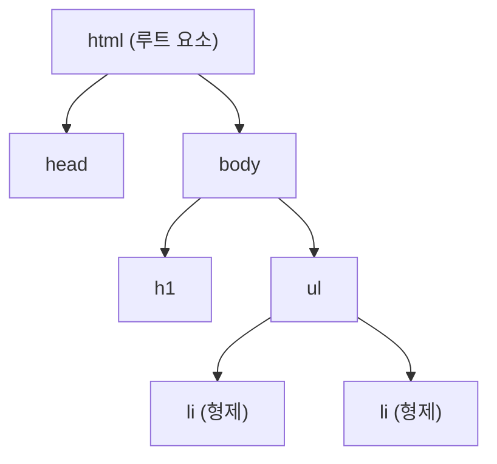

<Callout type="info">
  **이번 문서의 목표:** 이 문서를 다 읽으면 태그·요소·속성을 정확히 구분해 부르고, 블록 요소와 인라인 요소를 구별하며, 이 책의 코드 예제를 읽는 규칙을 이해할 수 있다.
</Callout>

## 왜 용어부터 정리하는가

본격적으로 HTML 태그를 배우기 전에 이 편에서 용어를 먼저 정리하는 이유가 있다. 독학사 시험은 "다음 중 요소(element)에 대한 설명으로 옳은 것은?"처럼 **용어 자체의 정의**를 정확히 구분하는 문제를 자주 낸다. 많은 입문자가 "태그"와 "요소"를 같은 말로 섞어 쓰는데, 시험에서는 이 둘의 미묘한 차이를 구분하지 못하면 틀리게 설계된 보기가 나온다. 이 편에서 그 차이를 확실히 잡고 넘어간다.

## 태그·요소·속성의 구분

> **쉽게 말하면:** 태그는 부호, 요소는 그 부호로 감싸인 완성된 덩어리, 속성은 그 덩어리에 붙이는 추가 정보표다.

다음 코드 한 줄을 예로 들어 세 용어를 구분해 보자.

```html
<a href="https://example.com">예시 링크</a>
```

- **태그**(tag): 꺾쇠 괄호로 감싸인 표시 그 자체를 말한다. 위 예에서 `<a href="https://example.com">`은 **여는 태그**(opening tag)이고, `</a>`는 **닫는 태그**(closing tag)다. 태그는 "이제부터 이런 종류의 내용이 시작된다/끝난다"는 표시일 뿐이다.
- **요소**(element): 여는 태그부터 닫는 태그까지, 그 사이의 내용을 모두 포함한 전체 덩어리를 말한다. 위 예에서는 `<a href="https://example.com">예시 링크</a>` 전체가 하나의 요소, 정확히는 `a` 요소(앵커 요소, anchor element)다.
- **속성**(attribute): 여는 태그 안에 `이름="값"` 형태로 적어, 그 요소에 대한 추가 정보를 지정하는 것이다. 위 예에서 `href="https://example.com"`이 속성이며, `href`가 **속성 이름**(attribute name), `"https://example.com"`이 **속성 값**(attribute value)이다.

> **자주 틀리는 점:** "`<a>` 태그"라는 표현과 "`a` 요소"라는 표현을 같은 뜻으로 흔히 섞어 쓰지만, 엄밀히는 `<a>`만 떼어 놓으면 여는 태그이고 닫는 태그까지 합친 전체가 요소다. 시험 지문에서 "이 요소의 속성은?"이라고 물으면 태그 안의 `이름="값"` 부분을 찾아야 하고, "이 요소의 내용은?"이라고 물으면 여는 태그와 닫는 태그 사이의 텍스트를 찾아야 한다.

### 속성 값 표기 규칙

속성 값은 큰따옴표(`"`)로 감싸는 것이 표준 권장 방식이며, 작은따옴표(`'`)도 허용되지만 한 문서 안에서는 통일해서 쓰는 것이 좋다. 값에 공백이 없는 일부 경우 따옴표를 생략할 수도 있지만, 시험 문항의 코드 예제는 대부분 큰따옴표로 감싼 표준 형태로 출제되므로 그 형태를 기본으로 익혀 둔다.

### 빈 요소(empty element)

모든 요소가 여는 태그와 닫는 태그의 쌍으로 이뤄지는 것은 아니다. 내용을 담지 않고 태그 하나로 끝나는 요소를 **빈 요소**(empty element, 혹은 self-closing element)라고 부른다. 대표적으로 줄바꿈을 나타내는 `<br>`, 이미지를 삽입하는 ``, 가로줄을 그리는 `<hr>` 등이 있다. 이 요소들은 닫는 태그가 없다(`</br>`처럼 쓰지 않는다).

## 블록 요소와 인라인 요소

> **쉽게 말하면:** 블록 요소는 항상 새 줄에서 시작해 가로 폭을 꽉 채우는 상자, 인라인 요소는 줄 안에서 필요한 만큼만 자리를 차지하는 조각이다.

HTML 요소는 화면에 배치되는 기본 방식에 따라 크게 두 가지로 나뉜다. 이 구분은 03편 이후 태그를 하나씩 배울 때, 그리고 07편 CSS의 `display` 속성을 이해할 때 계속 등장하는 감각이므로 지금 확실히 잡아 둔다.

- **블록 요소**(block-level element): 항상 새로운 줄에서 시작하고, 별다른 지정이 없으면 가로 폭 전체(부모 요소의 너비만큼)를 차지한다. 문단을 나타내는 `p`, 제목을 나타내는 `h1`부터 `h6`, 목록을 나타내는 `ul`·`ol` 등이 대표적이다.
- **인라인 요소**(inline element): 줄바꿈 없이 앞뒤 내용과 같은 줄에 이어서 배치되며, 내용의 길이만큼만 폭을 차지한다. 글자를 강조하는 `strong`, 링크를 나타내는 `a`, 줄바꿈만 있는 `span` 등이 대표적이다.

다음 예제로 차이를 직접 확인해 보자.

<CodePlayground
  template="static"
  activeFile="/index.html"
  files={{
    '/index.html': `<p>이것은 <strong>블록 요소인 p</strong> 안에 있는 문장입니다.</p>
<p>다음 문장에는 <a href="#">인라인 요소인 a</a>가 포함되어 있습니다.</p>
<div style="background:#eef;">이것은 블록 요소인 div입니다. 폭을 꽉 채웁니다.</div>
<span style="background:#fee;">이것은 인라인 요소인 span입니다.</span>
<span style="background:#efe;">바로 옆에 붙어서 표시됩니다.</span>`,
  }}
  label="블록 요소(p, div)는 새 줄에서 시작해 폭을 꽉 채우고, 인라인 요소(a, span)는 줄 안에서 이어 붙는다"
/>

위 결과를 보면 두 개의 `div`는 각각 새 줄에서 시작해 가로 폭 전체를 차지하지만, 두 개의 `span`은 같은 줄에 나란히 붙어서 표시된다. 이 차이는 태그 자체의 성질이지 임의로 정하는 것이 아니며, CSS로 `display` 속성을 바꾸면 이 기본 성질을 다른 값으로 바꿀 수 있다는 점은 07편에서 다룬다.

> **자주 틀리는 점:** "인라인 요소는 항상 크기를 지정할 수 없다"고 단정하는 보기가 나오면 주의해야 한다. 정확히는 인라인 요소는 기본적으로 `width`·`height` 속성이 적용되지 않는 경우가 많다는 CSS 단계의 이야기이며, 이 편에서는 "줄바꿈 여부와 차지하는 폭"이라는 배치 방식의 차이만 정리해 둔다.

## 문서 구조 관련 용어

HTML 문서 전체를 가리킬 때 자주 쓰는 용어들을 미리 정리해 둔다. 이 용어들의 실제 태그는 03편에서 배우지만, 개념만 먼저 짚는다.

- **문서**(document): 하나의 HTML 파일 전체를 가리킨다. 브라우저 창(혹은 탭) 하나에 표시되는 완결된 단위다.
- **루트 요소**(root element): 문서 전체를 감싸는 가장 바깥쪽 요소. HTML 문서에서는 `html` 요소가 이에 해당한다.
- **자식 요소**(child element)와 **부모 요소**(parent element): 어떤 요소 안에 포함된 요소를 자식, 그것을 포함한 바깥 요소를 부모라고 부른다. 예를 들어 `ul` 안에 `li`가 있다면, `li`는 `ul`의 자식 요소이고 `ul`은 `li`의 부모 요소다.
- **형제 요소**(sibling element): 같은 부모를 공유하는 요소끼리를 형제 요소라고 부른다. 예를 들어 같은 `ul` 안에 있는 여러 `li`들은 서로 형제 요소다.
- **중첩**(nesting): 요소 안에 다른 요소를 넣는 것을 중첩이라고 한다. HTML 문서는 요소가 요소를 감싸는 형태로 계속 중첩되어 트리(tree, 나무) 모양의 구조를 이룬다.

이 부모-자식-형제 관계는 이후 DOM(Document Object Model, 문서 객체 모델)을 다루는 09편에서 요소를 탐색하는 기준으로 그대로 다시 쓰인다. 지금 이 용어에 익숙해 두면 그때 훨씬 수월하다.



위 그림에서 `head`와 `body`는 `html`의 자식이자 서로 형제 관계이고, 두 `li`는 같은 `ul`을 부모로 공유하는 형제 관계다.

## 코드 예제를 읽는 기본 규칙

이 과목의 시험 문항, 그리고 이 문서 시리즈의 코드 예제를 읽을 때 알아 두면 좋은 표기 관습이 있다.

1. **줄바꿈과 들여쓰기는 브라우저 렌더링에 영향을 주지 않는다.** HTML은 코드를 여러 줄로 나누거나 들여써도, 그 자체만으로는 화면에 표시되는 결과가 달라지지 않는다. 들여쓰기는 순전히 사람이 구조를 알아보기 쉽게 하기 위한 것이다(단, 텍스트 사이의 공백이 여러 칸이면 브라우저는 이를 한 칸으로 줄여서 표시한다는 점은 별개의 규칙이다).
2. **주석은 화면에 나타나지 않는다.** `<!-- 이것은 주석입니다 -->` 형태로 쓰며, 코드에 설명을 남기거나 특정 부분을 일시적으로 숨길 때 쓴다. 이 문법은 다음 편에서 다시 다룬다.
3. **속성 순서는 대부분 결과에 영향을 주지 않는다.** 한 태그 안에 여러 속성이 있을 때 ``과 ``는 대부분의 경우 같은 결과를 낸다. 다만 시험 지문에서는 표준적인 순서(예: `src`를 먼저)로 출제되는 경우가 많다.
4. **대소문자 구분.** 태그 이름과 속성 이름은 관례상 소문자로 쓴다. HTML은 태그 이름의 대소문자를 구분하지 않지만(즉 `<DIV>`와 `<div>`를 같은 것으로 처리하지만), 이 책과 실제 현업 관례, 그리고 시험 출제 코드는 모두 **소문자**를 표준으로 삼는다.
5. **코드블록과 실제 렌더링 결과의 구분.** 이 문서 시리즈에서 회색 배경의 코드블록은 "코드 자체"를 보여주는 것이고, 그 아래에 실행 결과를 별도로 보여줄 때는 "브라우저에 실제로 그려지는 화면"을 뜻한다. 시험 문항도 "다음 코드의 출력 결과는?"이라는 형태로 이 둘을 구분해서 묻는다.

> **쉽게 말하면:** 코드를 예쁘게 들여쓰는 것은 사람을 위한 습관이지, 브라우저에게 지시하는 문법이 아니다. 브라우저가 실제로 보는 것은 태그와 텍스트뿐이다.

## 핵심 정리

- 태그는 꺾쇠 괄호로 감싼 표시, 요소는 여는 태그부터 닫는 태그까지 포함한 전체 덩어리, 속성은 여는 태그 안에 추가 정보를 붙이는 이름-값 쌍이다.
- 닫는 태그 없이 태그 하나로 끝나는 요소를 빈 요소라고 하며, `br`·`img`·`hr` 등이 있다.
- 블록 요소는 새 줄에서 시작해 폭을 꽉 채우고, 인라인 요소는 줄 안에서 필요한 만큼만 자리를 차지한다.
- HTML 문서는 부모-자식-형제 관계로 요소가 중첩된 트리 구조를 이룬다. 이 감각은 이후 DOM을 다룰 때도 그대로 쓰인다.
- 들여쓰기·줄바꿈·속성 순서는 대부분 렌더링 결과에 영향을 주지 않으며, 태그·속성 이름은 소문자로 쓰는 것이 관례다.

## 마무리 복습

<Quiz
  questionNumber={1}
  question="a 요소의 여는 태그 안에 적힌 href='https://example.com'과 같이, 이름과 값의 쌍으로 이루어진 부분을 부르는 정확한 용어는?"
  options={['요소(element)', '속성(attribute)', '노드(node)', '주석(comment)']}
  correctAnswer={2}
  explanation="여는 태그 안에 이름=값 형태로 추가 정보를 지정하는 href='https://example.com' 부분은 속성이라고 부른다."
  optionExplanations={['요소는 여는 태그부터 닫는 태그까지 전체를 가리키는 더 큰 단위다', '정답. 태그 안의 이름=값 형태 정보는 속성이라고 부른다', '노드는 이 문서에서 다루는 용어가 아니며 DOM 편에서 다른 의미로 쓰인다', '주석은 눈에 보이지 않는 설명글로 이 부분과 관련이 없다']}
/>

<Quiz
  questionNumber={2}
  question="HTML에서 요소(element)에 대한 설명으로 가장 옳은 것은?"
  options={['꺾쇠 괄호로 감싸인 표시 부호 하나만을 가리킨다', '여는 태그부터 닫는 태그까지, 그 사이의 내용을 모두 포함한 전체 단위를 가리킨다', '태그 안에 적는 이름과 값의 쌍을 가리킨다', 'CSS로 지정하는 색상 값을 가리킨다']}
  correctAnswer={2}
  explanation="요소는 여는 태그와 닫는 태그, 그리고 그 사이의 내용을 모두 포함하는 전체 단위를 가리키는 용어다."
  optionExplanations={['이는 태그 자체에 대한 설명이며 요소보다 좁은 개념이다', '정답. 여는 태그부터 닫는 태그까지 포함한 전체가 요소다', '이는 속성에 대한 설명이다', '이는 CSS 값에 대한 설명으로 요소의 정의와 무관하다']}
/>

<Quiz
  questionNumber={3}
  question="다음 중 닫는 태그가 없는 빈 요소(empty element)는?"
  options={['p', 'div', 'img', 'span']}
  correctAnswer={3}
  explanation="img는 이미지를 삽입하는 요소로 내용을 담지 않고 태그 하나로 끝나는 빈 요소이며, 닫는 태그를 따로 쓰지 않는다."
  optionExplanations={['p는 문단을 감싸는 요소로 여는 태그와 닫는 태그가 모두 필요하다', 'div는 영역을 감싸는 요소로 여는 태그와 닫는 태그가 모두 필요하다', '정답. img는 닫는 태그 없이 태그 하나로 끝나는 빈 요소다', 'span은 인라인 영역을 감싸는 요소로 여는 태그와 닫는 태그가 모두 필요하다']}
/>

<Quiz
  questionNumber={4}
  question="블록 요소(block-level element)와 인라인 요소(inline element)의 기본적인 배치 차이로 가장 옳은 것은?"
  options={['블록 요소는 항상 새 줄에서 시작해 폭 전체를 차지하고, 인라인 요소는 줄 안에서 필요한 만큼만 자리를 차지한다', '인라인 요소는 항상 새 줄에서 시작하고, 블록 요소는 줄 안에서 이어 붙는다', '블록 요소와 인라인 요소는 배치 방식에 차이가 없다', '인라인 요소만 화면에 표시되고 블록 요소는 항상 숨겨진다']}
  correctAnswer={1}
  explanation="블록 요소는 새 줄에서 시작해 기본적으로 부모의 가로 폭 전체를 차지하고, 인라인 요소는 줄바꿈 없이 내용의 길이만큼만 자리를 차지한다."
  optionExplanations={['정답. 새 줄 시작 여부와 차지하는 폭이 두 요소의 핵심 차이다', '설명이 반대로 서술되어 있다', '두 요소는 기본 배치 방식이 분명히 다르다', '블록 요소도 정상적으로 화면에 표시되며 숨겨지지 않는다']}
/>

<Quiz
  questionNumber={5}
  question="HTML 문서에서 'ul' 요소 안에 있는 여러 개의 'li' 요소들은 서로 어떤 관계인가?"
  options={['부모 요소 관계', '자식 요소 관계', '형제 요소 관계', '루트 요소 관계']}
  correctAnswer={3}
  explanation="같은 부모(ul)를 공유하는 여러 li 요소들은 서로 형제 요소 관계에 있다."
  optionExplanations={['부모 요소는 ul이지 li들끼리의 관계를 설명하지 않는다', '자식 요소 관계는 ul과 li 사이의 관계이지 li들끼리의 관계가 아니다', '정답. 같은 부모를 공유하는 요소들은 형제 요소 관계다', '루트 요소는 문서 전체를 감싸는 가장 바깥 요소(html)를 가리키는 용어다']}
/>

<Quiz
  questionNumber={6}
  question="HTML 코드의 들여쓰기와 줄바꿈에 대한 설명으로 가장 옳은 것은?"
  options={['들여쓰기와 줄바꿈은 브라우저가 화면에 그리는 결과를 직접 바꾸는 문법이다', '들여쓰기와 줄바꿈은 사람이 구조를 보기 쉽게 하기 위한 것으로 그 자체는 렌더링 결과에 영향을 주지 않는다', '들여쓰기가 없으면 브라우저는 문서를 렌더링할 수 없다', '줄바꿈은 항상 br 요소와 동일한 효과를 낸다']}
  correctAnswer={2}
  explanation="HTML 코드의 들여쓰기와 줄바꿈은 사람이 문서 구조를 알아보기 쉽게 하기 위한 관습이며, 그 자체만으로는 브라우저의 렌더링 결과를 바꾸지 않는다."
  optionExplanations={['들여쓰기와 줄바꿈 자체는 화면 렌더링에 직접적인 영향을 주지 않는다', '정답. 들여쓰기와 줄바꿈은 사람을 위한 관습이며 렌더링 결과와 무관하다', '들여쓰기가 없어도 브라우저는 문제없이 문서를 렌더링한다', '코드의 줄바꿈은 br 요소와 다르며, br 요소를 명시적으로 써야 화면에 줄바꿈이 나타난다']}
/>

## 참고 자료

- [MDN Web Docs - HTML](https://developer.mozilla.org/en-US/docs/Web/HTML)
- [WHATWG HTML Standard](https://html.spec.whatwg.org/)
