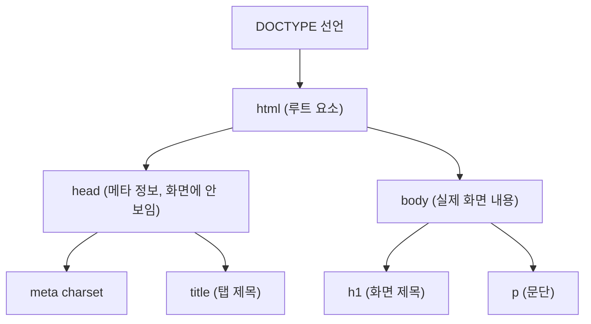

<Callout type="info">
  **이번 문서의 목표:** 이 문서를 다 읽으면 HTML 문서의 뼈대(doctype, html, head, body)를 직접 쓸 수 있고, 제목·문단·목록·링크 태그를 올바른 상황에 쓰며, 주석과 엔티티의 용도를 정확히 구분할 수 있다.
</Callout>

## 왜 문서의 뼈대부터 배우는가

01편에서 서버가 HTML 문서를 응답으로 돌려준다고 했다. 그렇다면 그 문서 자체는 어떤 최소한의 형식을 갖춰야 브라우저가 "이건 HTML 문서구나"라고 알아보고 올바르게 해석할까? 이 편에서는 모든 HTML 문서가 반드시 갖춰야 하는 뼈대와, 그 안에서 가장 기본이 되는 텍스트·목록·링크 태그를 정리한다. 독학사 시험에서는 "다음 중 HTML 문서 구조로 옳은 것은?"처럼 뼈대의 순서와 각 부분의 역할을 묻는 문제, 그리고 특정 태그의 용도를 다른 태그와 구분하는 문제가 꾸준히 나온다.

## 문서 타입 선언(doctype)

HTML 문서의 맨 첫 줄에는 항상 다음과 같은 선언이 온다.

```html
<!DOCTYPE html>
```

이를 **doctype**(document type declaration, 문서 타입 선언)이라고 부른다. 태그처럼 생겼지만 실제로는 요소가 아니라, 브라우저에게 "이 문서는 최신 HTML 표준을 따른다"고 알려주는 지시문이다. 과거(HTML 4 시절)에는 doctype 선언이 길고 복잡했지만, 현재 표준인 HTML5부터는 `<!DOCTYPE html>` 한 줄로 단순화됐다.

> **쉽게 말하면:** doctype은 문서의 첫머리에 붙이는 "이 문서는 HTML5 표준으로 작성됐다"는 신분증 같은 선언이다.

doctype이 없거나 잘못되면 일부 구형 브라우저가 **호환 모드**(quirks mode, 쿼크 모드)로 문서를 해석해 레이아웃이 예상과 다르게 깨질 수 있다. 시험에서는 "doctype은 무엇을 위한 선언인가"를 정의 그대로 묻는 문제가 나오므로, "브라우저에게 문서 표준을 알려주는 선언"이라는 표현을 정확히 기억해 둔다.

## html, head, body — 문서의 3단 구조

doctype 다음에는 문서 전체를 감싸는 **html 요소**가 오고, 그 안에 **head 요소**와 **body 요소**가 순서대로 온다.

```html
<!DOCTYPE html>
<html lang="ko">
  <head>
    <meta charset="UTF-8">
    <title>문서 제목</title>
  </head>
  <body>
    <h1>화면에 보이는 내용</h1>
    <p>이 부분이 브라우저 화면에 실제로 나타난다.</p>
  </body>
</html>
```

| 요소 | 역할 | 화면에 보이는가 |
|------|------|------------------|
| html | 문서 전체를 감싸는 루트 요소. `lang` 속성으로 문서의 주 언어를 지정(예: `lang="ko"`는 한국어) | 요소 자체는 보이지 않음 |
| head | 문서에 대한 메타 정보(제목, 문자 인코딩, 외부 CSS·JS 연결 등)를 담는 곳 | 보이지 않음 |
| body | 브라우저 화면에 실제로 표시되는 모든 내용을 담는 곳 | 보임 |

`head` 안에서 자주 쓰는 요소도 함께 짚어 둔다.

- `meta charset="UTF-8"`: 문서가 어떤 **문자 인코딩**(character encoding, 문자를 컴퓨터가 저장하는 방식)을 쓰는지 지정한다. UTF-8은 한글을 포함한 전 세계 문자를 깨짐 없이 표현할 수 있는 가장 널리 쓰이는 인코딩이다. 이 지정이 빠지거나 실제 파일 인코딩과 다르면 한글이 깨져 보이는 원인이 된다.
- `title`: 브라우저 탭에 표시되는 문서의 제목을 지정한다. 화면 본문(body)에 나타나는 것이 아니라 탭이나 즐겨찾기 목록에 나타난다는 점이 시험에서 자주 헷갈리는 포인트다.

> **자주 틀리는 점:** `title` 요소와 실제 화면 제목(주로 `h1`으로 표시하는 큰 제목)을 혼동하는 문항이 나온다. `title`은 탭·검색 결과에 쓰이는 문서 메타 정보이고, 화면 안에 보이는 큰 제목은 `body` 안의 `h1` 등을 따로 써야 한다.



## 제목과 문단 태그

**제목 태그**(heading)는 `h1`부터 `h6`까지 여섯 단계로 나뉘며, 숫자가 작을수록 더 중요하고 큰 제목을 의미한다. `h1`은 문서에서 가장 중요한 최상위 제목, `h6`은 가장 하위 제목이다.

```html
<h1>가장 큰 제목</h1>
<h2>그다음 단계 제목</h2>
<h3>더 작은 단계 제목</h3>
```

> **쉽게 말하면:** h1부터 h6는 책의 목차처럼 "대제목-중제목-소제목" 단계를 나타내는 것이지, 단순히 글자를 크게 보이려고 쓰는 태그가 아니다.

**자주 틀리는 점**은 제목 태그를 단지 "글씨를 크게 하려고" 쓰는 것으로 오해하는 것이다. 실제로 제목 태그는 문서의 **의미 구조**(semantic structure, 시맨틱 구조)를 나타낸다. 글자 크기만 키우고 싶다면 CSS로 크기를 조절해야 하며, 문서의 위계를 나타내려면 반드시 제목 태그를 순서대로(단계를 건너뛰지 않고) 써야 한다는 점이 11편(웹 표준과 접근성)에서 다시 강조된다.

**문단 태그**(paragraph) `p`는 하나의 문단(단락)을 감싸는 블록 요소다.

```html
<p>이것은 첫 번째 문단입니다.</p>
<p>이것은 두 번째 문단입니다. p 요소는 앞뒤로 자동으로 여백이 생긴다.</p>
```

## 목록 태그

HTML에서 목록은 크게 세 종류로 나뉜다.

| 종류 | 감싸는 태그 | 항목 태그 | 특징 |
|------|-------------|-----------|------|
| 순서 없는 목록(unordered list) | `ul` | `li` | 항목 앞에 기호(글머리 기호)가 붙음. 순서가 중요하지 않은 목록 |
| 순서 있는 목록(ordered list) | `ol` | `li` | 항목 앞에 번호가 자동으로 매겨짐. 순서가 중요한 목록 |
| 정의 목록(description list) | `dl` | `dt`(용어)·`dd`(설명) | 용어와 그 설명을 짝지어 나열 |

```html
<ul>
  <li>사과</li>
  <li>바나나</li>
</ul>

<ol>
  <li>재료를 준비한다</li>
  <li>끓는 물에 넣는다</li>
</ol>

<dl>
  <dt>HTML</dt>
  <dd>웹 문서의 구조를 표시하는 마크업 언어</dd>
</dl>
```

`ul`과 `ol`은 둘 다 항목을 감싸는 `li`(list item, 목록 항목) 태그를 똑같이 쓰지만, 부모 태그가 `ul`이냐 `ol`이냐에 따라 기호가 붙는지 번호가 붙는지가 결정된다는 점이 시험에서 자주 출제된다. `dl`은 `li`를 쓰지 않고 `dt`와 `dd`라는 별도의 태그 쌍을 쓴다는 차이도 함께 기억해 둔다.

목록은 서로 중첩될 수도 있다. `li` 요소 안에 또 다른 `ul`이나 `ol`을 넣으면 하위 목록을 표현할 수 있다.

```html
<ul>
  <li>과일
    <ul>
      <li>사과</li>
      <li>바나나</li>
    </ul>
  </li>
  <li>채소</li>
</ul>
```

## 링크 태그

**링크**(하이퍼링크)는 `a`(anchor, 앵커) 요소로 만든다. 필수 속성은 이동할 대상을 지정하는 `href`(hypertext reference, 하이퍼텍스트 참조)다.

```html
<a href="https://example.com">외부 사이트로 이동</a>
<a href="about.html">같은 서버 안의 다른 페이지로 이동(상대 경로)</a>
<a href="#section2">같은 문서 안의 특정 위치로 이동(프래그먼트)</a>
```

`href`의 값에는 세 가지 형태가 올 수 있다.

- **절대 경로**(absolute path, 절대 URL): `https://example.com`처럼 스킴과 호스트를 포함한 완전한 주소. 다른 도메인의 자원을 가리킬 때 쓴다.
- **상대 경로**(relative path): `about.html`이나 `../images/logo.png`처럼 현재 문서를 기준으로 한 위치. 같은 사이트 안의 다른 문서를 가리킬 때 자주 쓴다.
- **프래그먼트만 있는 경로**: `#section2`처럼 `#`으로 시작하면 같은 문서 안에서 `id="section2"`인 요소로 스크롤 이동한다.

> **자주 틀리는 점:** `href` 없이 `<a>이동</a>`만 쓰면 문법적으로는 오류가 아니지만 실제로 클릭해도 아무 곳으로도 이동하지 않는 링크가 된다. `a` 요소가 "링크처럼 보이는 것"과 "실제로 이동 기능이 있는 것"은 `href` 속성이 있느냐 없느냐로 갈린다는 점이 시험 함정으로 자주 등장한다.

다음 예제로 절대 경로와 프래그먼트 링크가 실제로 어떻게 동작하는지 확인해 보자.

<CodePlayground
  template="static"
  activeFile="/index.html"
  files={{
    '/index.html': `<a href="#section2">2번 구역으로 바로 이동</a>

<h2 id="section1">1번 구역</h2>
<p>여기는 문서의 앞부분입니다. 위 링크를 누르면 아래 2번 구역으로 이동합니다.</p>

<h2 id="section2">2번 구역</h2>
<p>href 값이 샵(#)으로 시작하면 같은 문서 안의 id가 일치하는 요소로 이동합니다.</p>`,
  }}
  label="href가 샵(#)으로 시작하는 프래그먼트 링크는 같은 문서 안의 id 요소로 스크롤 이동한다"
/>

## 주석

**주석**(comment)은 코드 안에 남기는 설명으로, 브라우저 화면에는 나타나지 않는다.

```html
<!-- 이 부분은 헤더 영역입니다 -->
<header>
  <h1>사이트 제목</h1>
</header>
<!-- 헤더 영역 끝 -->
```

주석은 `<!--`로 시작해서 `-->`로 끝나며, 그 사이에 어떤 텍스트가 오든 브라우저는 이를 무시하고 화면에 표시하지 않는다. 개발 중에 특정 코드를 잠시 비활성화하고 싶을 때(임시로 화면에서 빼고 싶을 때) 주석으로 감싸는 용도로도 자주 쓰인다.

## 엔티티

**엔티티**(character entity, 문자 엔티티)는 HTML 문법에서 특별한 의미로 쓰이는 기호(`<`, `>`, `&` 등)를 **화면에 문자 그대로 보여주고 싶을 때** 쓰는 특수한 표기법이다.

| 엔티티 | 화면에 표시되는 문자 | 왜 필요한가 |
|--------|----------------------|-------------|
| `&lt;` | `<` | `<`를 그대로 쓰면 브라우저가 새 태그가 시작된 것으로 오해한다 |
| `&gt;` | `>` | 태그를 닫는 기호로 오해할 수 있어 그대로 쓰기 어렵다 |
| `&amp;` | `&` | `&`로 시작하는 문자열은 엔티티 표기로 해석될 수 있다 |
| `&quot;` | `"` | 속성 값을 감싼 큰따옴표와 헷갈리지 않게 문자로 표시할 때 쓴다 |
| `&nbsp;` | (줄바꿈되지 않는 공백) | 여러 칸의 공백을 화면에 그대로 유지하고 싶을 때 쓴다(일반 공백은 여러 칸이 한 칸으로 줄어든다) |

예를 들어 화면에 "5는 3보다 크다"는 뜻으로 부등호 기호를 그대로 보여주고 싶다면 다음과 같이 쓴다.

```html
<p>5 &gt; 3 은 참입니다.</p>
```

만약 여기서 `&gt;` 대신 실제 `>`를 그대로 썼다면 큰 문제는 없었겠지만, 반대로 `<`를 그대로 쓰면 브라우저는 그 뒤를 태그 이름으로 해석하려 시도해 문서 구조가 깨질 수 있다. 그래서 본문에 꺾쇠 기호나 앰퍼샌드를 그대로 보여줘야 할 때는 엔티티를 쓰는 습관을 들이는 것이 안전하다.

> **쉽게 말하면:** 엔티티는 "이 기호는 태그가 아니라 그냥 글자로 보여 달라"고 브라우저에게 부탁하는 암호 같은 표기법이다.

## 문서의 계층 구조 정리

지금까지 배운 태그를 모두 합쳐 하나의 완전한 문서로 정리하면 다음과 같다.

```html
<!DOCTYPE html>
<html lang="ko">
  <head>
    <meta charset="UTF-8">
    <title>나의 첫 문서</title>
  </head>
  <body>
    <!-- 화면에 보이는 영역 시작 -->
    <h1>독학사 웹 프로그래밍</h1>
    <p>이 과목은 HTML, CSS, JavaScript &amp; 웹 표준을 다룹니다.</p>
    <ul>
      <li>HTML: 구조</li>
      <li>CSS: 표현</li>
      <li>JavaScript: 동작</li>
    </ul>
    <a href="#top">맨 위로</a>
    <!-- 화면에 보이는 영역 끝 -->
  </body>
</html>
```

이 구조를 트리로 그리면 doctype 아래 html이 오고, html 아래 head와 body가 나란히 오며, body 아래에 다시 여러 요소가 중첩되는 형태다. 02편에서 정리한 부모-자식-형제 관계가 실제 문서에서 그대로 적용된다는 점을 확인할 수 있다.

## 핵심 정리

- doctype은 브라우저에게 문서가 HTML5 표준을 따른다고 알리는 선언이며, 항상 문서 맨 앞에 온다.
- html은 문서 전체를 감싸는 루트 요소, head는 화면에 보이지 않는 메타 정보, body는 실제 화면에 보이는 내용을 담는다.
- 제목 태그(h1–h6)는 글자 크기가 아니라 문서의 의미 구조(위계)를 나타내는 태그다.
- ul/ol은 li를 공유하지만 기호냐 번호냐로 구분되고, dl은 dt·dd 쌍으로 용어와 설명을 나타낸다.
- a 요소는 href 속성이 있어야 실제 이동 기능을 하며, href 값은 절대 경로·상대 경로·프래그먼트 세 형태를 가질 수 있다.
- 주석은 화면에 보이지 않는 설명, 엔티티는 특수 기호를 문자 그대로 화면에 보여줄 때 쓰는 표기법이다.

## 마무리 복습

<Quiz
  questionNumber={1}
  question="HTML5 문서에서 doctype 선언의 목적으로 가장 옳은 것은?"
  options={['문서에 사용된 프로그래밍 언어의 종류를 지정한다', '브라우저에게 이 문서가 HTML5 표준을 따른다고 알려준다', '문서의 글자 크기 기본값을 지정한다', '문서를 서버에 업로드하는 경로를 지정한다']}
  correctAnswer={2}
  explanation="doctype은 문서 맨 앞에 오는 선언으로, 브라우저에게 이 문서가 최신 HTML 표준을 따른다는 것을 알려주는 역할을 한다."
  optionExplanations={['doctype은 프로그래밍 언어가 아니라 문서 표준 버전을 알리는 선언이다', '정답. doctype은 브라우저에게 문서 표준을 알려주는 선언이다', '글자 크기는 CSS가 담당하며 doctype과 무관하다', 'doctype은 업로드 경로와 관련이 없다']}
/>

<Quiz
  questionNumber={2}
  question="head 요소와 body 요소의 차이에 대한 설명으로 가장 옳은 것은?"
  options={['head는 화면에 보이는 내용, body는 보이지 않는 메타 정보를 담는다', 'head는 보이지 않는 메타 정보, body는 화면에 보이는 실제 내용을 담는다', 'head와 body는 둘 다 화면에 동일하게 보인다', 'head는 문서 맨 아래, body는 문서 맨 위에 위치해야 한다']}
  correctAnswer={2}
  explanation="head는 문자 인코딩, 제목, 외부 자원 연결 같은 메타 정보를 담아 화면에는 보이지 않고, body는 실제로 화면에 표시되는 모든 내용을 담는다."
  optionExplanations={['역할이 반대로 서술되어 있다', '정답. head는 메타 정보, body는 실제 화면 내용을 담는다', 'head 안의 정보는 화면에 직접 표시되지 않는다', 'head가 body보다 먼저(위에) 오는 것이 올바른 순서다']}
/>

<Quiz
  questionNumber={3}
  question="제목 태그(h1–h6)에 대한 설명으로 옳지 않은 것은?"
  options={['숫자가 작을수록 더 상위 단계의 제목을 나타낸다', '문서의 의미 구조(위계)를 나타내는 용도로 쓰인다', '단순히 글자를 크게 보이게 하려는 목적으로만 사용해야 한다', 'h1은 문서에서 가장 중요한 최상위 제목을 나타낸다']}
  correctAnswer={3}
  explanation="옳지 않은 것을 고르는 문제다. 제목 태그는 글자 크기를 위한 것이 아니라 문서의 의미적 위계를 나타내는 태그이며, 단순히 크기 조절 목적으로만 써서는 안 된다."
  optionExplanations={['옳은 진술이다. h1이 가장 상위, h6이 가장 하위다', '옳은 진술이다. 제목 태그는 의미 구조를 나타낸다', '정답. 제목 태그를 글자 크기 목적으로만 쓰는 것은 잘못된 사용법이며, 크기 조절은 CSS로 해야 한다', '옳은 진술이다. h1은 최상위 제목이다']}
/>

<Quiz
  questionNumber={4}
  question="ul 요소와 ol 요소의 차이로 가장 옳은 것은?"
  options={['ul은 li를 쓰지 않고 dt를 쓴다', 'ul은 항목에 기호가 붙고, ol은 항목에 번호가 자동으로 매겨진다', 'ol은 순서가 중요하지 않은 목록에 쓰고, ul은 순서가 중요한 목록에 쓴다', 'ul과 ol은 완전히 같은 방식으로 동작해 구분할 필요가 없다']}
  correctAnswer={2}
  explanation="ul(순서 없는 목록)은 항목 앞에 글머리 기호가 붙고, ol(순서 있는 목록)은 항목 앞에 번호가 자동으로 매겨진다는 점이 핵심 차이다."
  optionExplanations={['ul도 li를 항목 태그로 쓴다. dt는 dl(정의 목록)에서 쓰는 태그다', '정답. 기호냐 번호냐가 ul과 ol의 핵심 차이다', '용도가 반대로 서술되어 있다', '기호 표시와 번호 매김이라는 분명한 차이가 있다']}
/>

<Quiz
  questionNumber={5}
  question="a 요소에 대한 설명으로 가장 옳은 것은?"
  options={['href 속성이 없어도 클릭하면 항상 다른 페이지로 이동한다', 'href 속성 값이 샵(#)으로 시작하면 같은 문서 안의 해당 id 요소로 이동한다', 'href 속성에는 절대 경로만 쓸 수 있고 상대 경로는 쓸 수 없다', 'a 요소는 블록 요소이므로 항상 새 줄에서 시작한다']}
  correctAnswer={2}
  explanation="href 값이 샵(#)으로 시작하는 프래그먼트 형태이면, 같은 문서 안에서 그 값과 일치하는 id를 가진 요소 위치로 스크롤 이동한다."
  optionExplanations={['href 속성이 없으면 실제 이동 기능이 동작하지 않는다', '정답. 샵으로 시작하는 href는 같은 문서 안의 프래그먼트 이동을 의미한다', '절대 경로와 상대 경로 모두 href 값으로 쓸 수 있다', 'a 요소는 대표적인 인라인 요소로, 기본적으로 새 줄에서 시작하지 않는다']}
/>

<Quiz
  questionNumber={6}
  question="HTML 문서에서 부등호 기호(꺾쇠 괄호)를 화면에 문자 그대로 표시하고 싶을 때 사용하는 방법으로 가장 옳은 것은?"
  options={['CSS의 color 속성을 사용한다', '주석(comment) 문법으로 감싼다', '엔티티(entity) 표기법을 사용한다', 'title 요소 안에 적는다']}
  correctAnswer={3}
  explanation="부등호처럼 HTML 문법에서 특별한 의미로 쓰이는 기호를 화면에 문자 그대로 보여주려면 엔티티 표기법(예: 왼쪽 꺾쇠에 해당하는 엔티티)을 사용해야 한다."
  optionExplanations={['color 속성은 색상을 지정하는 것으로 기호 표시와 무관하다', '주석은 화면에 아예 보이지 않게 만드는 것으로 목적이 다르다', '정답. 엔티티 표기법이 특수 기호를 문자 그대로 표시하는 방법이다', 'title은 탭 제목을 지정하는 곳으로 본문 표시와 무관하다']}
/>

<Quiz
  questionNumber={7}
  question="다음 중 HTML 문서 뼈대의 올바른 중첩 순서로 가장 옳은 것은?"
  options={['head와 body는 각각 독립된 문서이며 html 요소가 필요 없다', 'html 요소 아래에 head와 body가 나란히 오고, head 안에 title과 meta가 온다', 'body 요소 안에 head 요소가 포함되는 형태로 중첩된다', 'title 요소는 body 안에 위치해야 화면 제목으로 표시된다']}
  correctAnswer={2}
  explanation="문서 전체를 감싸는 html 요소 아래에 head와 body가 형제 관계로 나란히 오고, head 안에 title, meta 같은 메타 정보 태그가 위치하는 것이 표준 구조다."
  optionExplanations={['head와 body는 html 요소 아래에 함께 있어야 하는 하나의 문서 구성 요소다', '정답. html 아래 head와 body, head 안에 title·meta가 오는 구조가 표준이다', 'body가 head를 포함하는 것이 아니라 둘은 html의 형제 요소다', 'title은 head 안에 위치하며 화면(body)이 아닌 브라우저 탭에 표시된다']}
/>

## 참고 자료

- [WHATWG HTML Standard](https://html.spec.whatwg.org/)
- [MDN Web Docs - HTML](https://developer.mozilla.org/en-US/docs/Web/HTML)

더 깊은 실습형 예제와 태그별 세부 설명은 이 사이트의 [HTML 기초](/web/html/html_fundamentals/01_what-is-html-and-setup) 과목을 참고한다. 이 편에서는 독학사 2단계 출제기준에 맞춘 핵심만 다룬다.
