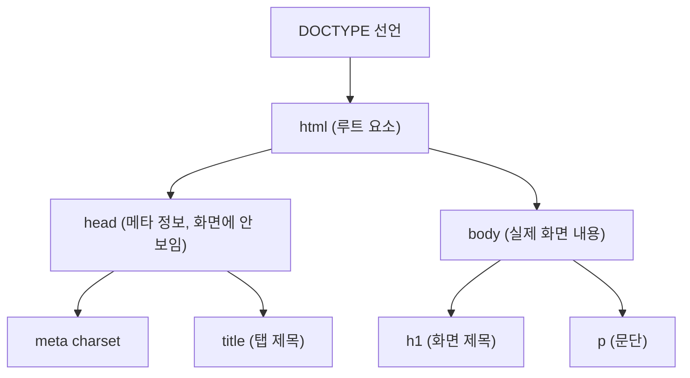

## 왜 문서의 뼈대부터 배우는가

01편에서 서버가 HTML 문서를 응답으로 돌려준다고 했다. 그렇다면 그 문서 자체는 어떤 최소한의 형식을 갖춰야 브라우저가 "이건 HTML 문서구나"라고 알아보고 올바르게 해석할까?

## 문서 타입 선언(doctype)

HTML 문서의 맨 첫 줄에는 항상 다음과 같은 선언이 온다.

```html
<!DOCTYPE html>
```

이를 **doctype**(document type declaration, 문서 타입 선언)이라고 부른다. 과거(HTML 4 시절)에는 doctype 선언이 길고 복잡했지만, 현재 표준인 HTML5부터는 `<!DOCTYPE html>` 한 줄로 단순화됐다.

doctype이 없거나 잘못되면 일부 구형 브라우저가 **호환 모드**(quirks mode, 쿼크 모드)로 문서를 해석해 레이아웃이 예상과 다르게 깨질 수 있다. 시험에서는 "doctype은 무엇을 위한 선언인가"를 정의 그대로 묻는 문제가 나오므로, "브라우저에게 문서 표준을 알려주는 선언"이라는 표현을 정확히 기억해 둔다.

## html, head, body — 문서의 3단 구조

doctype 다음에는 문서 전체를 감싸는 **html 요소**가 오고, 그 안에 **head 요소**와 **body 요소**가 순서대로 온다.

```html
<!DOCTYPE html>
<html lang="ko">
  <head>
    <meta charset="UTF-8">
    <title>문서 제목</title>
  </head>
  <body>
    <h1>화면에 보이는 내용</h1>
    <p>이 부분이 브라우저 화면에 실제로 나타난다.</p>
  </body>
</html>
```

| 요소 | 역할 | 화면에 보이는가 |
|------|------|------------------|
| html | 문서 전체를 감싸는 루트 요소. `lang` 속성으로 문서의 주 언어를 지정(예: `lang="ko"`는 한국어) | 요소 자체는 보이지 않음 |
| head | 문서에 대한 메타 정보(제목, 문자 인코딩, 외부 CSS·JS 연결 등)를 담는 곳 | 보이지 않음 |
| body | 브라우저 화면에 실제로 표시되는 모든 내용을 담는 곳 | 보임 |

`head` 안에서 자주 쓰는 요소도 함께 짚어 둔다.

- `meta charset="UTF-8"`: 문서가 어떤 **문자 인코딩**(character encoding, 문자를 컴퓨터가 저장하는 방식)을 쓰는지 지정한다. UTF-8은 한글을 포함한 전 세계 문자를 깨짐 없이 표현할 수 있는 가장 널리 쓰이는 인코딩이다. 이 지정이 빠지거나 실제 파일 인코딩과 다르면 한글이 깨져 보이는 원인이 된다.
- `title`: 브라우저 탭에 표시되는 문서의 제목을 지정한다. 화면 본문(body)에 나타나는 것이 아니라 탭이나 즐겨찾기 목록에 나타난다는 점이 시험에서 자주 헷갈리는 포인트다.

> **자주 틀리는 점:** `title` 요소와 실제 화면 제목(주로 `h1`으로 표시하는 큰 제목)을 혼동하는 문항이 나온다. `title`은 탭·검색 결과에 쓰이는 문서 메타 정보이고, 화면 안에 보이는 큰 제목은 `body` 안의 `h1` 등을 따로 써야 한다.


```mermaid
flowchart TD
    doctype["DOCTYPE 선언"] --> html["html (루트 요소)"]
    html --> head["head (메타 정보, 화면에 안 보임)"]
    html --> body["body (실제 화면 내용)"]
    head --> meta["meta charset"]
    head --> title["title (탭 제목)"]
    body --> h1["h1 (화면 제목)"]
    body --> p["p (문단)"]
```

## 제목과 문단 태그

**제목 태그**(heading)는 `h1`부터 `h6`까지 여섯 단계로 나뉘며, 숫자가 작을수록 더 중요하고 큰 제목을 의미한다. `h1`은 문서에서 가장 중요한 최상위 제목, `h6`은 가장 하위 제목이다.

```html
<h1>가장 큰 제목</h1>
<h2>그다음 단계 제목</h2>
<h3>더 작은 단계 제목</h3>
```

**자주 틀리는 점**은 제목 태그를 단지 "글씨를 크게 하려고" 쓰는 것으로 오해하는 것이다. 실제로 제목 태그는 문서의 **의미 구조**(semantic structure, 시맨틱 구조)를 나타낸다.

**문단 태그**(paragraph) `p`는 하나의 문단(단락)을 감싸는 블록 요소다.

```html
<p>이것은 첫 번째 문단입니다.</p>
<p>이것은 두 번째 문단입니다. p 요소는 앞뒤로 자동으로 여백이 생긴다.</p>
```

## 목록 태그

HTML에서 목록은 크게 세 종류로 나뉜다.

| 종류 | 감싸는 태그 | 항목 태그 | 특징 |
|------|-------------|-----------|------|
| 순서 없는 목록(unordered list) | `ul` | `li` | 항목 앞에 기호(글머리 기호)가 붙음. 순서가 중요하지 않은 목록 |
| 순서 있는 목록(ordered list) | `ol` | `li` | 항목 앞에 번호가 자동으로 매겨짐. 순서가 중요한 목록 |
| 정의 목록(description list) | `dl` | `dt`(용어)·`dd`(설명) | 용어와 그 설명을 짝지어 나열 |

```html
<ul>
  <li>사과</li>
  <li>바나나</li>
</ul>

<ol>
  <li>재료를 준비한다</li>
  <li>끓는 물에 넣는다</li>
</ol>

<dl>
  <dt>HTML</dt>
  <dd>웹 문서의 구조를 표시하는 마크업 언어</dd>
</dl>
```

`ul`과 `ol`은 둘 다 항목을 감싸는 `li`(list item, 목록 항목) 태그를 똑같이 쓰지만, 부모 태그가 `ul`이냐 `ol`이냐에 따라 기호가 붙는지 번호가 붙는지가 결정된다는 점이 시험에서 자주 출제된다. `dl`은 `li`를 쓰지 않고 `dt`와 `dd`라는 별도의 태그 쌍을 쓴다는 차이도 함께 기억해 둔다.

목록은 서로 중첩될 수도 있다. `li` 요소 안에 또 다른 `ul`이나 `ol`을 넣으면 하위 목록을 표현할 수 있다.

```html
<ul>
  <li>과일
    <ul>
      <li>사과</li>
      <li>바나나</li>
    </ul>
  </li>
  <li>채소</li>
</ul>
```

## 링크 태그

**링크**(하이퍼링크)는 `a`(anchor, 앵커) 요소로 만든다. 필수 속성은 이동할 대상을 지정하는 `href`(hypertext reference, 하이퍼텍스트 참조)다.

```html
<a href="https://example.com">외부 사이트로 이동</a>
<a href="about.html">같은 서버 안의 다른 페이지로 이동(상대 경로)</a>
<a href="#section2">같은 문서 안의 특정 위치로 이동(프래그먼트)</a>
```

`href`의 값에는 세 가지 형태가 올 수 있다.

- **절대 경로**(absolute path, 절대 URL): `https://example.com`처럼 스킴과 호스트를 포함한 완전한 주소. 다른 도메인의 자원을 가리킬 때 쓴다.
- **상대 경로**(relative path): `about.html`이나 `../images/logo.png`처럼 현재 문서를 기준으로 한 위치. 같은 사이트 안의 다른 문서를 가리킬 때 자주 쓴다.
- **프래그먼트만 있는 경로**: `#section2`처럼 `#`으로 시작하면 같은 문서 안에서 `id="section2"`인 요소로 스크롤 이동한다.

> **자주 틀리는 점:** `href` 없이 `<a>이동</a>`만 쓰면 문법적으로는 오류가 아니지만 실제로 클릭해도 아무 곳으로도 이동하지 않는 링크가 된다. `a` 요소가 "링크처럼 보이는 것"과 "실제로 이동 기능이 있는 것"은 `href` 속성이 있느냐 없느냐로 갈린다는 점이 시험 함정으로 자주 등장한다.

다음 예제로 절대 경로와 프래그먼트 링크가 실제로 어떻게 동작하는지 확인해 보자.

## 주석

**주석**(comment)은 코드 안에 남기는 설명으로, 브라우저 화면에는 나타나지 않는다.

```html
<!-- 이 부분은 헤더 영역입니다 -->
<header>
  <h1>사이트 제목</h1>
</header>
<!-- 헤더 영역 끝 -->
```

주석은 `<!--`로 시작해서 `-->`로 끝나며, 그 사이에 어떤 텍스트가 오든 브라우저는 이를 무시하고 화면에 표시하지 않는다. 개발 중에 특정 코드를 잠시 비활성화하고 싶을 때(임시로 화면에서 빼고 싶을 때) 주석으로 감싸는 용도로도 자주 쓰인다.

## 엔티티

**엔티티**(character entity, 문자 엔티티)는 HTML 문법에서 특별한 의미로 쓰이는 기호(`<`, `>`, `&` 등)를 **화면에 문자 그대로 보여주고 싶을 때** 쓰는 특수한 표기법이다.

| 엔티티 | 화면에 표시되는 문자 | 왜 필요한가 |
|--------|----------------------|-------------|
| `&lt;` | `<` | `<`를 그대로 쓰면 브라우저가 새 태그가 시작된 것으로 오해한다 |
| `&gt;` | `>` | 태그를 닫는 기호로 오해할 수 있어 그대로 쓰기 어렵다 |
| `&amp;` | `&` | `&`로 시작하는 문자열은 엔티티 표기로 해석될 수 있다 |
| `&quot;` | `"` | 속성 값을 감싼 큰따옴표와 헷갈리지 않게 문자로 표시할 때 쓴다 |
| `&nbsp;` | (줄바꿈되지 않는 공백) | 여러 칸의 공백을 화면에 그대로 유지하고 싶을 때 쓴다(일반 공백은 여러 칸이 한 칸으로 줄어든다) |

예를 들어 화면에 "5는 3보다 크다"는 뜻으로 부등호 기호를 그대로 보여주고 싶다면 다음과 같이 쓴다.

```html
<p>5 &gt; 3 은 참입니다.</p>
```

만약 여기서 `&gt;` 대신 실제 `>`를 그대로 썼다면 큰 문제는 없었겠지만, 반대로 `<`를 그대로 쓰면 브라우저는 그 뒤를 태그 이름으로 해석하려 시도해 문서 구조가 깨질 수 있다. 그래서 본문에 꺾쇠 기호나 앰퍼샌드를 그대로 보여줘야 할 때는 엔티티를 쓰는 습관을 들이는 것이 안전하다.

## 문서의 계층 구조 정리

지금까지 배운 태그를 모두 합쳐 하나의 완전한 문서로 정리하면 다음과 같다.

```html
<!DOCTYPE html>
<html lang="ko">
  <head>
    <meta charset="UTF-8">
    <title>나의 첫 문서</title>
  </head>
  <body>
    <!-- 화면에 보이는 영역 시작 -->
    <h1>독학사 웹 프로그래밍</h1>
    <p>이 과목은 HTML, CSS, JavaScript &amp; 웹 표준을 다룹니다.</p>
    <ul>
      <li>HTML: 구조</li>
      <li>CSS: 표현</li>
      <li>JavaScript: 동작</li>
    </ul>
    <a href="#top">맨 위로</a>
    <!-- 화면에 보이는 영역 끝 -->
  </body>
</html>
```

이 구조를 트리로 그리면 doctype 아래 html이 오고, html 아래 head와 body가 나란히 오며, body 아래에 다시 여러 요소가 중첩되는 형태다. 02편에서 정리한 부모-자식-형제 관계가 실제 문서에서 그대로 적용된다는 점을 확인할 수 있다.

## 핵심 정리

- doctype은 브라우저에게 문서가 HTML5 표준을 따른다고 알리는 선언이며, 항상 문서 맨 앞에 온다.
- html은 문서 전체를 감싸는 루트 요소, head는 화면에 보이지 않는 메타 정보, body는 실제 화면에 보이는 내용을 담는다.
- 제목 태그(h1–h6)는 글자 크기가 아니라 문서의 의미 구조(위계)를 나타내는 태그다.
- ul/ol은 li를 공유하지만 기호냐 번호냐로 구분되고, dl은 dt·dd 쌍으로 용어와 설명을 나타낸다.
- a 요소는 href 속성이 있어야 실제 이동 기능을 하며, href 값은 절대 경로·상대 경로·프래그먼트 세 형태를 가질 수 있다.
- 주석은 화면에 보이지 않는 설명, 엔티티는 특수 기호를 문자 그대로 화면에 보여줄 때 쓰는 표기법이다.

## 마무리 복습

<Quiz
  questionNumber={1}
  question={"HTML5 문서에서 doctype 선언의 목적으로 가장 옳은 것은?"}
  options={["문서에 사용된 프로그래밍 언어의 종류를 지정한다","브라우저에게 이 문서가 HTML5 표준을 따른다고 알려준다","문서의 글자 크기 기본값을 지정한다","문서를 서버에 업로드하는 경로를 지정한다"]}
  correctAnswer={2}
  explanation={"doctype은 문서 맨 앞에 오는 선언으로, 브라우저에게 이 문서가 최신 HTML 표준을 따른다는 것을 알려주는 역할을 한다."}
/>

<Quiz
  questionNumber={2}
  question={"head 요소와 body 요소의 차이에 대한 설명으로 가장 옳은 것은?"}
  options={["head는 화면에 보이는 내용, body는 보이지 않는 메타 정보를 담는다","head는 보이지 않는 메타 정보, body는 화면에 보이는 실제 내용을 담는다","head와 body는 둘 다 화면에 동일하게 보인다","head는 문서 맨 아래, body는 문서 맨 위에 위치해야 한다"]}
  correctAnswer={2}
  explanation={"head는 문자 인코딩, 제목, 외부 자원 연결 같은 메타 정보를 담아 화면에는 보이지 않고, body는 실제로 화면에 표시되는 모든 내용을 담는다."}
/>

<Quiz
  questionNumber={3}
  question={"제목 태그(h1–h6)에 대한 설명으로 옳지 않은 것은?"}
  options={["숫자가 작을수록 더 상위 단계의 제목을 나타낸다","문서의 의미 구조(위계)를 나타내는 용도로 쓰인다","단순히 글자를 크게 보이게 하려는 목적으로만 사용해야 한다","h1은 문서에서 가장 중요한 최상위 제목을 나타낸다"]}
  correctAnswer={3}
  explanation={"옳지 않은 것을 고르는 문제다. 제목 태그는 글자 크기를 위한 것이 아니라 문서의 의미적 위계를 나타내는 태그이며, 단순히 크기 조절 목적으로만 써서는 안 된다."}
/>

## 참고 자료

- [WHATWG HTML Standard](https://html.spec.whatwg.org/)
- [MDN Web Docs - HTML](https://developer.mozilla.org/en-US/docs/Web/HTML)

더 깊은 예시형 예제와 태그별 세부 설명은 이 사이트의 [HTML 기초](/web/html/html_fundamentals/01_what-is-html-and-setup) 과목을 참고한다. 이 편에서는 독학사 2단계 출제기준에 맞춘 핵심만 다룬다.
