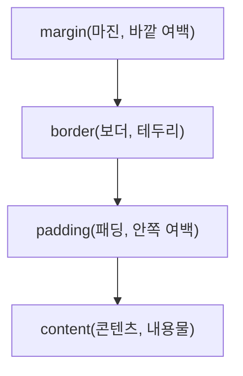

<Callout type="info">
  **이번 문서의 목표:** 이 문서를 다 읽으면 모든 HTML 요소가 가지는 박스 모델의 네 영역을 구분해 너비·높이를 계산하고, `box-sizing`이 그 계산을 어떻게 바꾸는지 설명하며, `display` 값에 따른 배치 차이와 `position`의 네 가지 값, `float`의 기본 동작과 한계를 판별할 수 있게 됩니다.
</Callout>

## 박스 모델(box model) — 모든 요소는 상자다

> **쉽게 말하면:** 브라우저는 모든 HTML 요소를 내용물, 안쪽 여백, 테두리, 바깥쪽 여백이 겹겹이 둘러싼 네모난 상자로 취급합니다.

06편에서 CSS로 색과 글꼴을 바꾸는 법을 다뤘다면, 이번에는 그 요소가 화면에서 **얼마나 큰 자리를 차지하고 다른 요소와 어떤 간격을 두는지**를 결정하는 박스 모델(box model)을 다룹니다. CSS에서는 `p`든 `div`든 `img`든 상관없이 모든 요소가 예외 없이 이 박스 구조를 따릅니다.

박스는 안쪽에서 바깥쪽으로 네 겹입니다.



| 영역 | 이름(영단어) | 역할 |
|------|-------------|------|
| content | content(콘텐츠) | 글자·이미지 등 실제 내용물이 표시되는 영역 |
| padding | padding(패딩, 안쪽 여백) | 내용물과 테두리 사이의 간격. 배경색이 칠해진다 |
| border | border(보더, 테두리) | 패딩을 둘러싸는 선 |
| margin | margin(마진, 바깥 여백) | 테두리 바깥, 다른 요소와의 간격. 배경색이 칠해지지 않고 투명하다 |

```css
.box {
  width: 200px;
  padding: 20px;
  border: 5px solid black;
  margin: 10px;
}
```

**패딩과 마진의 차이**를 헷갈리면 안 됩니다. 패딩은 "상자 안쪽" 여백이라 상자의 배경색이 패딩 영역까지 함께 칠해지지만, 마진은 "상자 바깥쪽" 여백이라 배경색이 전혀 칠해지지 않는 투명한 간격입니다. 요소 자신을 꾸미는 여백이면 패딩, 다른 요소와 거리를 두는 여백이면 마진이라고 구분하면 실수가 줄어듭니다.

### 박스의 실제 크기 계산하기

<Callout type="warning">
  **자주 틀리는 점(가장 많이 나오는 계산 문제):** `width: 200px`이라고 쓰면 화면에 보이는 상자 전체 폭이 200px일 것 같지만, 기본 계산 방식에서는 그렇지 않습니다.
</Callout>

CSS의 기본 박스 계산 방식(`box-sizing: content-box`, 즉 지정하지 않았을 때의 기본값)에서 `width`·`height`는 **content 영역만의 크기**입니다. 그래서 화면에 실제로 차지하는 전체 너비는 content에 좌우 패딩과 좌우 테두리를 더해야 나옵니다.

$$
\text{전체 너비} = \text{width} + \text{padding-left} + \text{padding-right} + \text{border-left} + \text{border-right}
$$

- $\text{width}$: content 영역에 지정한 너비
- $\text{padding-left, padding-right}$: 좌우 안쪽 여백
- $\text{border-left, border-right}$: 좌우 테두리 두께
- 마진은 이 계산에 포함되지 않는다(요소 자신의 크기가 아니라 다른 요소와의 거리이기 때문)

위 `.box` 예시로 실제 계산을 해보면 다음과 같습니다.

$$
\text{전체 너비} = 200 + 20 + 20 + 5 + 5 = 250\text{px}
$$

`width: 200px`이라고 썼는데 실제로는 250px 자리를 차지한다는 뜻입니다. "패딩이나 테두리를 추가했더니 레이아웃이 예상보다 넓어졌다"는 흔한 실무 혼란이 바로 이 계산 방식 때문에 생깁니다.

이 혼란을 해결하기 위해 `box-sizing: border-box`를 지정하면 계산 기준이 바뀝니다. `border-box`에서는 `width`·`height`가 **패딩과 테두리까지 포함한 전체 크기**를 뜻하게 되어, 패딩·테두리를 늘려도 전체 크기는 그대로 유지되고 대신 content 영역이 그만큼 줄어듭니다.

```css
.box {
  box-sizing: border-box;
  width: 200px;
  padding: 20px;
  border: 5px solid black;
}
/* 전체 너비는 그대로 200px, content 영역이 150px로 줄어든다 */
```

| box-sizing 값 | width가 의미하는 범위 | 전체 너비 공식 |
|----------------|------------------------|----------------|
| `content-box`(기본값) | content 영역만 | width + padding + border |
| `border-box` | content + padding + border | width(그대로) |

<CodePlayground
  template="static"
  activeFile="/styles.css"
  label="box-sizing 값을 content-box와 border-box로 바꿔가며 상자의 실제 크기 변화를 관찰하세요"
  files={{
    '/index.html': `<link rel="stylesheet" href="styles.css" />
<div class="box">width 200px 상자</div>
<div class="ruler">이 자(ruler)는 250px 너비입니다</div>`,
    '/styles.css': `.box {
  box-sizing: content-box;
  width: 200px;
  padding: 20px;
  border: 5px solid black;
  background: lightyellow;
}
.ruler {
  width: 250px;
  height: 4px;
  background: red;
  margin-top: 8px;
}`,
  }}
/>

### 마진 병합(margin collapsing)

세로로 인접한 두 블록 요소의 위아래 마진이 겹치는 지점에서는, 두 마진이 더해지지 않고 **둘 중 더 큰 값 하나만** 적용되는 현상이 있습니다. 이를 마진 병합(margin collapsing)이라고 부릅니다.

```html
<p style="margin-bottom: 30px;">첫 번째 문단</p>
<p style="margin-top: 20px;">두 번째 문단</p>
```

두 문단 사이의 간격은 30 + 20 = 50px이 아니라, 둘 중 더 큰 값인 **30px**입니다. 이 현상은 세로 방향 마진에서만 일어나고 가로 방향 마진에서는 일어나지 않으며, 두 요소 사이에 패딩이나 테두리가 끼어 있으면 병합이 일어나지 않는다는 조건도 함께 기억해 둘 필요가 있습니다.

## display 속성 — 요소가 배치되는 방식

> **쉽게 말하면:** display는 "이 요소가 한 줄을 통째로 차지할지, 내용물만큼만 차지할지"를 정하는 가장 기본적인 배치 스위치입니다.

02편에서 "블록·인라인 감각"을 언급했는데, 이 감각을 실제로 만들어내는 CSS 속성이 `display`입니다.

| display 값 | 특징 |
|------------|------|
| `block` | 가로 폭 전체를 차지하며 항상 새 줄에서 시작. `width`·`height`·상하 마진 모두 적용됨 |
| `inline` | 내용물 크기만큼만 차지하며 줄 안에 흐름. `width`·`height` 지정이 무시되고 상하 마진도 적용 안 됨 |
| `inline-block` | 줄 안에 흐르면서도 `width`·`height`·상하 마진이 모두 적용됨 |
| `none` | 화면에서 완전히 사라짐(공간조차 차지하지 않음) |

`div`, `p`, `h1`~`h6`, `ul`, `li` 등은 브라우저 기본 스타일에서 `display: block`이고, `span`, `a`, `strong`, `img` 등은 기본이 `display: inline`입니다. 다만 이는 **기본값일 뿐 CSS로 얼마든지 바꿀 수 있는 값**입니다. "`div`는 항상 블록 요소다"라는 진술은, `display`를 바꾸지 않은 기본 상태를 전제로 할 때만 참이라는 점에 주의해야 합니다.

`inline`과 `inline-block`의 차이가 시험에서 자주 다뤄집니다. 둘 다 줄 안에서 다른 요소와 나란히 흐르지만, `inline`은 `width`·`height`를 지정해도 무시되고 위아래 마진도 적용되지 않는 반면, `inline-block`은 줄 안에 흐르면서도 `width`·`height`·상하 마진을 블록 요소처럼 온전히 적용받습니다. 네비게이션 메뉴의 항목들을 가로로 나란히 배치하면서도 각 항목에 정확한 크기와 위아래 여백을 주고 싶을 때 `inline-block`이 자주 쓰이는 이유가 여기에 있습니다.

`display: none`과 자주 헷갈리는 것이 `visibility: hidden`입니다. 이 둘은 시험에서 짝을 지어 "차이를 설명하라"는 형태로 자주 나옵니다.

| 속성 | 화면 표시 | 차지하는 공간 |
|------|-----------|----------------|
| `display: none` | 보이지 않음 | 공간도 사라짐(레이아웃에서 완전히 제외) |
| `visibility: hidden` | 보이지 않음 | 공간은 그대로 남음(투명하게 비어 있는 자리 유지) |

## position 속성 — 흐름을 벗어난 배치

> **쉽게 말하면:** position은 "이 요소를 원래 자리에 둘지, 아니면 다른 기준점에 딱 붙여 놓을지"를 정합니다.

기본적으로 HTML 요소들은 문서에 작성된 순서대로 위에서 아래로, 왼쪽에서 오른쪽으로 배치됩니다. 이를 **일반 흐름**(normal flow)이라고 부릅니다. `position` 속성은 이 흐름을 다양한 방식으로 벗어나게 합니다.

| position 값 | 기준점 | 흐름에서 벗어나는가 |
|--------------|--------|------------------------|
| `static`(기본값) | 없음(일반 흐름을 그대로 따름) | 벗어나지 않음 |
| `relative` | 자기 자신의 원래 위치 | 벗어나지 않음(원래 자리는 그대로 비워둔 채 시각적으로만 이동) |
| `absolute` | 가장 가까운 `position`이 지정된 조상 요소(없으면 문서 전체) | 완전히 벗어남(원래 자리가 비워지지 않고 다른 요소가 채움) |
| `fixed` | 브라우저 화면(viewport, 뷰포트) | 완전히 벗어남(스크롤해도 화면에 고정) |
| `sticky` | 스크롤 위치에 따라 일반 흐름과 고정 사이를 전환 | 조건부로 벗어남 |

`relative`와 `absolute`의 관계가 실전에서 가장 중요합니다. `position: absolute`가 걸린 요소는 `top`·`right`·`bottom`·`left` 값의 기준점을 찾을 때, 조상 요소 중 `position`이 `static`이 아닌(즉 `relative`, `absolute`, `fixed`, `sticky` 중 하나가 지정된) 가장 가까운 요소를 찾아 그 요소의 안쪽 모서리를 기준으로 삼습니다. 그런 조상이 하나도 없으면 문서 전체(정확히는 초기 컨테이닝 블록)를 기준으로 삼습니다.

```html
<div style="position: relative; width: 300px; height: 200px; border: 1px solid gray;">
  <span style="position: absolute; top: 10px; right: 10px;">배지</span>
</div>
```

이 예시에서 "배지"는 `div`가 `position: relative`로 기준점 역할을 하고 있으므로, 문서 전체가 아니라 이 `div`의 오른쪽 위 모서리에서 10px씩 떨어진 자리에 위치합니다. 만약 `div`에 `position: relative`를 빼먹으면, "배지"는 가장 가까운 `position` 지정 조상을 찾다가 결국 문서 전체를 기준으로 삼아 화면 전혀 다른 위치에 나타납니다. 이 원리 때문에 "`absolute`를 쓸 요소의 부모에는 `relative`를 걸어 기준점을 만들어 둔다"는 것이 정석적인 사용 패턴으로 굳어져 있습니다.

`fixed`는 조상이 무엇이든 상관없이 항상 브라우저 화면(뷰포트) 자체를 기준으로 삼기 때문에, 스크롤을 아무리 내려도 화면의 같은 자리에 계속 떠 있습니다. 헤더를 화면 위에 고정하거나 "맨 위로" 버튼을 화면 오른쪽 아래에 항상 띄워 두는 데 쓰입니다. `sticky`는 이 둘의 중간으로, 평소에는 일반 흐름을 따르다가 스크롤이 특정 지점에 도달하면 그 자리에서 `fixed`처럼 멈춰 붙는 동작을 합니다.

## float 속성 — 텍스트를 감싸는 오래된 배치 도구

> **쉽게 말하면:** float는 원래 "글이 이미지를 옆으로 감싸 흐르게" 만들기 위해 태어난 속성입니다.

```css
img.thumbnail {
  float: left;
  margin-right: 10px;
}
```

`float: left`를 준 이미지는 원래 자리에서 왼쪽으로 최대한 밀리고, 그 뒤에 오는 텍스트는 이미지의 오른쪽 남은 공간을 따라 자연스럽게 감싸며 흐릅니다. 신문 지면에서 사진 옆으로 기사 본문이 흐르는 모습을 떠올리면 정확합니다.

문제는 `float`가 요소를 **일반 흐름에서 완전히 빼내면서도 `position: absolute`처럼 부모가 그 크기를 무시하게 만든다**는 점입니다. 부모 요소 안의 자식이 전부 `float`로 떠 있으면, 부모는 "내용물이 없다"고 착각해 높이가 0으로 찌그러지는 현상이 생깁니다. 이를 **부모 요소 높이 무너짐** 문제라고 부르며, 과거에는 이를 해결하기 위해 `clear` 속성을 가진 빈 요소를 추가하거나 `overflow: hidden`을 부모에 걸어 우회하는 방법(clearfix, 클리어픽스)을 썼습니다.

```css
.clearfix::after {
  content: "";
  display: block;
  clear: both;
}
```

오늘날 실무에서는 여러 칼럼을 나란히 배치하는 용도로는 `float` 대신 `display: flex`나 `display: grid`를 사용하는 것이 표준입니다. 다만 독학사 시험은 오래전부터 있던 개념도 폭넓게 다루므로, `float`의 기본 동작과 부모 높이 무너짐 현상, `clear` 속성의 역할은 출제 범위 안에서 정확히 알아 둘 필요가 있습니다. `clear` 속성은 `left`·`right`·`both` 값을 받아 "이 요소는 지정한 방향에 떠 있는 요소가 있으면 그 아래로 내려가서 배치되라"는 뜻입니다.

<Callout type="warning">
  **자주 틀리는 점:** `float`가 걸린 요소는 `display` 값이 자동으로 `block`처럼 동작하도록 계산됩니다. 즉 원래 `inline`이던 `span`이나 `img`에 `float`를 걸면 `width`·`height` 지정이 더 이상 무시되지 않고 정상적으로 적용됩니다. "float와 display는 서로 무관한 속성이다"는 진술은 이 상호작용을 놓친 틀린 설명입니다.
</Callout>

## 핵심 정리

- 모든 요소는 content-padding-border-margin 네 겹의 박스이며, 패딩은 배경이 칠해지는 안쪽 여백, 마진은 투명한 바깥 여백이다.
- 기본값(`content-box`)에서 전체 너비는 width + 좌우 padding + 좌우 border의 합이며, `border-box`는 width 자체가 이 합을 뜻하도록 계산 기준을 바꾼다.
- 세로로 인접한 블록 요소의 마진은 더해지지 않고 더 큰 값 하나로 병합된다(마진 병합).
- `display`는 block(줄 전체 차지)·inline(내용물 크기, width/height 무시)·inline-block(줄 안에 흐르며 크기 지정 가능)·none(공간까지 제거)으로 나뉜다. `visibility: hidden`은 보이지 않되 공간은 남긴다.
- `position`의 `relative`는 원래 자리를 유지한 채 이동, `absolute`는 가장 가까운 static이 아닌 조상 기준으로 흐름을 이탈, `fixed`는 뷰포트 기준 고정, `sticky`는 스크롤에 따라 전환된다.
- `float`는 텍스트를 감싸는 배치를 만들지만 부모 높이 무너짐을 유발할 수 있어 `clear`나 clearfix로 대응하며, 오늘날은 다단 레이아웃에 flex·grid를 더 권장한다.

## 마무리 복습

<Quiz
  questionNumber={1}
  question="박스 모델에서 패딩(padding)과 마진(margin)의 차이로 옳은 것은?"
  options={['패딩은 바깥 여백이고 마진은 안쪽 여백이다', '패딩은 배경색이 칠해지는 안쪽 여백이고, 마진은 배경색이 칠해지지 않는 바깥 여백이다', '패딩과 마진은 항상 같은 값으로 계산된다', '패딩은 content 영역 안에 포함되어 별도로 존재하지 않는다']}
  correctAnswer={2}
  explanation="패딩은 content와 border 사이의 안쪽 여백으로 배경색이 함께 칠해지고, 마진은 border 바깥의 여백으로 투명하게 처리되어 다른 요소와의 거리를 만든다."
  optionExplanations={['설명이 정반대로 뒤바뀌어 있다', '정답 — 배경색 적용 여부가 핵심 차이다', '패딩과 마진은 독립적으로 지정하는 서로 다른 값이다', '패딩은 content 바깥의 별도 영역으로 박스 모델의 한 겹을 차지한다']}
/>

<Quiz
  questionNumber={2}
  question="box-sizing: content-box인 요소에 width: 200px, padding: 20px, border: 5px solid black을 지정했을 때 화면에 실제로 차지하는 전체 너비는? (좌우 기준)"
  options={['200px', '220px', '250px', '450px']}
  correctAnswer={3}
  explanation="content-box에서 전체 너비는 width에 좌우 padding과 좌우 border를 더한 값이므로 200 + 20 + 20 + 5 + 5 = 250px이다."
  optionExplanations={['패딩과 테두리를 더하지 않은 content 영역만의 값이다', '패딩만 더하고 테두리를 빠뜨린 계산이다', '정답 — 좌우 패딩 40과 좌우 테두리 10을 모두 더한 값이다', '좌우가 아니라 사방을 모두 중복해서 더한 잘못된 계산이다']}
/>

<Quiz
  questionNumber={3}
  question="box-sizing: border-box로 바꾸면 width 속성의 의미가 어떻게 달라지는가?"
  options={['width가 padding과 border를 제외한 content만을 뜻하게 된다', 'width가 padding과 border를 포함한 전체 크기를 뜻하게 되어, 늘어난 만큼 content 영역이 줄어든다', 'width 속성 자체가 무시되고 항상 자동 계산된다', 'margin까지 포함한 크기로 계산 기준이 바뀐다']}
  correctAnswer={2}
  explanation="border-box에서는 width가 content+padding+border를 합친 전체 크기를 뜻하게 되므로, 패딩·테두리가 늘어나도 전체 크기는 유지되고 content 영역이 대신 줄어든다."
  optionExplanations={['그 설명은 기본값인 content-box의 동작이다', '정답 — 전체 크기 고정, content 영역이 가변적으로 줄어드는 방식이다', 'width 속성은 여전히 유효하게 적용된다', 'margin은 어느 box-sizing 값에서도 너비 계산에 포함되지 않는다']}
/>

<Quiz
  questionNumber={4}
  question="세로로 인접한 두 문단에 각각 margin-bottom: 30px, margin-top: 20px를 지정했을 때 두 문단 사이의 실제 간격은? (마진 병합 가정)"
  options={['50px', '30px', '20px', '0px']}
  correctAnswer={2}
  explanation="세로 방향으로 인접한 블록 요소의 마진은 더해지지 않고 둘 중 더 큰 값 하나로 병합되므로, 30과 20 중 더 큰 30px이 실제 간격이 된다."
  optionExplanations={['두 값을 단순히 합산한 값으로 마진 병합 규칙을 적용하지 않은 계산이다', '정답 — 더 큰 값인 30px로 병합된다', '더 작은 값을 고른 것으로 병합 규칙과 반대다', '병합은 간격이 0이 되는 것이 아니라 더 큰 값이 남는 것이다']}
/>

<Quiz
  questionNumber={5}
  question="display: inline과 display: inline-block의 차이로 옳은 것은?"
  options={['둘 다 width와 height 지정이 무시된다', 'inline은 width·height 지정이 무시되지만, inline-block은 줄 안에 흐르면서도 width·height·상하 마진이 적용된다', 'inline-block은 항상 새 줄에서 시작한다', 'inline은 상하 마진이 정상 적용되고 inline-block은 무시된다']}
  correctAnswer={2}
  explanation="inline은 width·height 지정과 상하 마진이 무시되지만, inline-block은 줄 안에서 흐르는 성질은 유지하면서도 블록 요소처럼 width·height·상하 마진이 온전히 적용된다."
  optionExplanations={['inline-block은 width·height가 정상적으로 적용된다', '정답 — inline-block이 두 특성을 모두 갖는 것이 핵심 차이다', '두 값 모두 줄 안에 흐르며 새 줄에서 시작하지 않는다', '설명이 정반대로 뒤바뀌어 있다']}
/>

<Quiz
  questionNumber={6}
  question="display: none과 visibility: hidden의 차이로 옳은 것은?"
  options={['둘 다 요소가 차지하던 공간을 그대로 남긴다', 'display: none은 공간까지 제거하고, visibility: hidden은 공간은 남긴 채 보이지 않게만 한다', 'display: none은 화면에는 보이지만 클릭만 안 되게 한다', '두 속성은 완전히 동일하게 동작하는 별칭 관계다']}
  correctAnswer={2}
  explanation="display: none은 레이아웃에서 요소를 완전히 제외해 공간조차 남기지 않지만, visibility: hidden은 보이지 않게만 하고 원래 차지하던 공간은 그대로 유지한다."
  optionExplanations={['display: none은 공간을 제거하므로 옳지 않다', '정답 — 공간 유지 여부가 핵심 차이다', 'display: none은 화면에 아예 표시되지 않는다', '두 속성은 화면 표시와 공간 유지 방식이 서로 다르다']}
/>

<Quiz
  questionNumber={7}
  question="position: absolute가 지정된 요소는 어떤 기준점을 따라 위치가 결정되는가?"
  options={['항상 브라우저 화면(뷰포트)을 기준으로 삼는다', '가장 가까운 조상 중 position이 static이 아닌 요소를 찾아 그 요소를 기준으로 삼으며, 없으면 문서 전체를 기준으로 삼는다', '부모 요소가 아니라 형제 요소를 기준으로 삼는다', '항상 자기 자신의 원래 위치를 기준으로 삼는다']}
  correctAnswer={2}
  explanation="absolute는 가장 가까운 position이 static이 아닌(relative, absolute, fixed, sticky 중 하나인) 조상을 찾아 그 안쪽 모서리를 기준점으로 삼고, 그런 조상이 없으면 문서 전체를 기준으로 삼는다."
  optionExplanations={['뷰포트를 항상 기준으로 삼는 것은 fixed의 동작이다', '정답 — static이 아닌 가장 가까운 조상 기준이 핵심 규칙이다', '형제 요소가 아니라 조상 요소를 기준으로 탐색한다', '원래 자리를 기준으로 이동만 하는 것은 relative의 동작이다']}
/>

<Quiz
  questionNumber={8}
  question="자식 요소를 전부 float로 띄운 부모 요소에서 흔히 발생하는 현상과 그 대응으로 옳은 것은?"
  options={['부모 요소의 높이가 0으로 찌그러지며, clear 속성을 이용한 clearfix 등으로 대응한다', '부모 요소의 높이가 자동으로 두 배로 늘어난다', 'float는 부모 요소의 높이 계산에 아무 영향을 주지 않는다', '자식 요소가 전부 화면에서 사라진다']}
  correctAnswer={1}
  explanation="float로 뜬 자식만 있는 부모는 내용물이 없다고 계산되어 높이가 0이 되는 문제가 생기며, clear 속성을 활용한 clearfix 기법 등으로 부모 높이를 되살린다."
  optionExplanations={['정답 — 부모 높이 무너짐과 clearfix 대응이 핵심이다', '높이가 늘어나는 것이 아니라 0으로 찌그러지는 것이 문제다', 'float는 부모의 높이 계산 방식에 직접 영향을 준다', '자식 요소 자체는 화면에 그대로 보이며 사라지지 않는다']}
/>

## 참고 자료

- [W3C CSS Specifications](https://www.w3.org/Style/CSS/specs.en.html)
- [MDN Web Docs - CSS](https://developer.mozilla.org/en-US/docs/Web/CSS)
