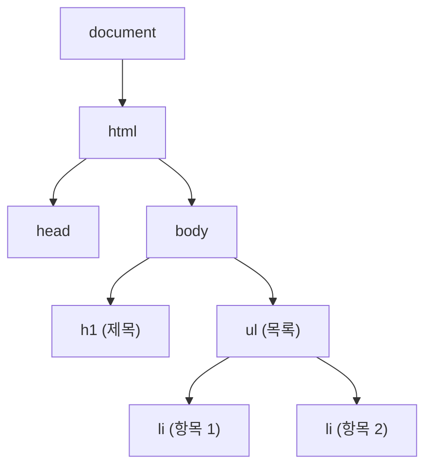
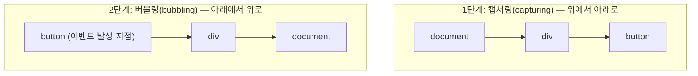

<Callout type="info">
  **이번 문서의 목표:** 이 파일을 다 읽으면 배열·객체를 만들고 값을 꺼내 쓸 수 있고, `document`로 HTML 요소를 찾아 내용·속성·스타일을 바꿀 수 있으며, 버튼 클릭 같은 이벤트를 등록해 정적인 페이지를 동적으로 반응하게 만드는 원리를 코드의 실행 결과로 설명할 수 있다.
</Callout>

## 왜 배열·객체·DOM·이벤트를 한 편에 묶었는가

08편에서 변수·자료형·조건·반복 같은 JavaScript(자바스크립트, 웹 브라우저와 여러 런타임에서 실행되는 프로그래밍 언어)의 기초 문법을 익혔습니다. 하지만 값 하나짜리 변수와 `if`·`for`만으로는 실제 웹 페이지를 움직일 수 없습니다. 여러 개의 값을 묶어 관리하려면 **배열**(array)과 **객체**(object)가 필요하고, 그 값들을 화면의 실제 HTML 요소에 반영하려면 **DOM**(Document Object Model, 문서 객체 모델)을 다뤄야 하며, 사용자의 클릭이나 입력에 반응하게 하려면 **이벤트**(event)를 등록해야 합니다. 이 네 가지는 독학사 2단계 시험에서 JavaScript 파트 중 가장 출제 비중이 높은 영역이므로, 이 편에서는 짧은 코드를 직접 실행해 보고 그 결과를 예측하는 연습에 집중합니다.

> **쉽게 말하면:** 08편이 "단어와 문장을 만드는 법"이었다면, 이 편은 그 문장으로 "여러 개를 목록으로 정리하고(배열·객체), 화면에 실제로 써 붙이고(DOM), 누가 건드리면 반응하게(이벤트) 만드는 법"입니다.

## 1. 배열 — 순서가 있는 값의 목록

**배열**(array)은 여러 개의 값을 순서대로 저장하는 자료구조입니다. 대괄호(`[`와 `]`)로 값을 감싸고 쉼표로 구분해 만듭니다. 배열 안의 각 값을 **요소**(element)라 부르고, 각 요소의 위치를 나타내는 번호를 **인덱스**(index)라 합니다. JavaScript의 인덱스는 0부터 시작합니다.

```js
const 과일 = ["사과", "바나나", "포도"];
console.log(과일[0]); // 사과
console.log(과일[2]); // 포도
console.log(과일.length); // 3
```

```text
사과
포도
3
```

- `과일[0]`은 첫 번째 요소인 "사과"를 가리킵니다. 인덱스가 0부터 시작하므로 세 번째 요소인 "포도"는 `과일[2]`로 접근합니다.
- `length`(길이)는 배열에 들어 있는 요소의 개수를 알려 주는 속성(property, 객체가 가진 값)입니다.

**자주 틀리는 점**: 배열 길이가 3이면 인덱스는 0, 1, 2까지만 존재합니다. `과일[3]`처럼 존재하지 않는 인덱스에 접근하면 오류가 아니라 `undefined`(정의되지 않음을 뜻하는 특수 값)가 나온다는 점, 그리고 "배열 길이만큼 인덱스가 있다"고 착각해 마지막 인덱스를 `length`로 잘못 쓰는 실수를 시험에서 자주 다룹니다.

### 배열의 주요 메서드

**메서드**(method)는 객체나 배열에 속한 함수를 말합니다. 배열은 요소를 추가·삭제·변형하는 다양한 메서드를 제공합니다.

| 메서드 | 역할 | 원본 배열 변경 여부 |
|--------|------|----------------------|
| `push(값)` | 배열 맨 뒤에 요소 추가 | 변경함 |
| `pop()` | 배열 맨 뒤 요소 제거 후 반환 | 변경함 |
| `shift()` | 배열 맨 앞 요소 제거 후 반환 | 변경함 |
| `unshift(값)` | 배열 맨 앞에 요소 추가 | 변경함 |
| `indexOf(값)` | 값이 있는 인덱스 반환(없으면 -1) | 변경하지 않음 |
| `map(함수)` | 각 요소를 함수로 변형한 새 배열 반환 | 변경하지 않음 |
| `filter(함수)` | 조건을 만족하는 요소만 모은 새 배열 반환 | 변경하지 않음 |
| `forEach(함수)` | 각 요소마다 함수를 실행(반환값 없음) | 변경하지 않음 |

```js
const 숫자들 = [1, 2, 3, 4, 5];

const 두배 = 숫자들.map((n) => n * 2);
console.log(두배); // [2, 4, 6, 8, 10]

const 짝수만 = 숫자들.filter((n) => n % 2 === 0);
console.log(짝수만); // [2, 4]

숫자들.push(6);
console.log(숫자들); // [1, 2, 3, 4, 5, 6]
```

```text
[ 2, 4, 6, 8, 10 ]
[ 2, 4 ]
[ 1, 2, 3, 4, 5, 6 ]
```

`map`과 `filter`는 원본 배열(`숫자들`)을 그대로 두고 **새로운 배열**을 만들어 반환합니다. 반면 `push`는 원본 배열 자체를 바꿉니다. 이 차이(원본을 바꾸는가, 새 배열을 만드는가)는 시험에서 코드를 실행한 뒤 원본 배열의 상태를 묻는 문제로 자주 나옵니다.

> **쉽게 말하면:** `map`·`filter`는 원본 서류를 복사해서 다른 종이에 새로 쓰는 작업이고, `push`·`pop`은 원본 서류 자체에 줄을 추가하거나 지우는 작업입니다.

## 2. 객체 — 이름과 값의 짝

**객체**(object)는 `키(key)`와 `값(value)`의 짝을 중괄호(`{`와 `}`) 안에 여러 개 모아 놓은 자료구조입니다. 배열이 "순서"로 값을 구분한다면, 객체는 "이름"으로 값을 구분합니다.

```js
const 학생 = {
  이름: "김독학",
  나이: 25,
  합격여부: false,
};

console.log(학생.이름); // 김독학
console.log(학생["나이"]); // 25
학생.합격여부 = true;
console.log(학생.합격여부); // true
```

```text
김독학
25
true
```

객체의 속성에 접근하는 방법은 두 가지입니다.

- **점 표기법**(dot notation): `학생.이름`처럼 점 뒤에 키 이름을 직접 씁니다. 키 이름을 미리 알고 있을 때 사용합니다.
- **대괄호 표기법**(bracket notation): `학생["나이"]`처럼 대괄호 안에 문자열로 키를 씁니다. 키 이름이 변수에 담겨 있거나 공백·특수문자가 포함된 키일 때 반드시 이 방식을 씁니다.

```js
const 키이름 = "이름";
console.log(학생[키이름]); // 김독학 (변수에 담긴 키 이름 사용)
```

```text
김독학
```

**자주 틀리는 점**: 점 표기법에서는 `학생.키이름`처럼 쓰면 "키이름"이라는 글자 그대로의 속성을 찾으려 하기 때문에 `undefined`가 나옵니다. 변수에 담긴 키 이름으로 접근하려면 반드시 대괄호 표기법을 써야 한다는 점이 시험에서 자주 나오는 함정입니다.

### 객체와 배열의 조합

실제 데이터는 객체 배열(배열 안에 객체가 여러 개 들어 있는 형태)로 표현되는 경우가 많습니다.

```js
const 학생목록 = [
  { 이름: "김독학", 점수: 88 },
  { 이름: "이자격", 점수: 72 },
  { 이름: "박취득", 점수: 95 },
];

const 이름만 = 학생목록.map((학생) => 학생.이름);
console.log(이름만); // ["김독학", "이자격", "박취득"]

const 합격자 = 학생목록.filter((학생) => 학생.점수 >= 80);
console.log(합격자.length); // 2
```

```text
[ '김독학', '이자격', '박취득' ]
2
```

`map`의 콜백 함수 `(학생) => 학생.이름`은 배열의 각 요소(객체 하나하나)를 받아 그 객체의 `이름` 속성만 뽑아 새 배열을 만듭니다. 이렇게 배열과 객체를 함께 다루는 코드는 09편 이후 DOM 조작과도 자연스럽게 이어집니다.

## 3. DOM — 문서를 객체로 표현한 트리

**DOM**(Document Object Model, 문서 객체 모델)은 브라우저가 HTML 문서를 읽어 들여 만드는, 프로그램(JavaScript)이 조작할 수 있는 형태의 자료구조입니다. "Document"는 문서, "Object"는 객체, "Model"은 모형이라는 뜻으로, 풀어 쓰면 "HTML 문서를 객체로 표현한 모형"이 됩니다. HTML 문서의 각 태그는 DOM에서 하나의 **노드**(node)가 되고, 이 노드들은 부모-자식 관계를 가진 **트리**(tree) 구조로 연결됩니다.



이 트리 구조 덕분에 JavaScript는 `document`(현재 열려 있는 HTML 문서를 나타내는 전역 객체)를 시작점으로 삼아 특정 요소를 찾아가거나, 부모·자식·형제 관계를 따라 이동할 수 있습니다.

> **쉽게 말하면:** DOM은 HTML 문서를 가계도(족보)처럼 그려 놓은 지도입니다. `document`는 이 가계도의 맨 위 뿌리이고, 각 태그는 가계도 안의 한 사람(노드)입니다.

### 요소 찾기 — 선택자 메서드

DOM에서 원하는 요소를 찾는 대표적인 메서드는 다음과 같습니다.

| 메서드 | 찾는 기준 | 반환값 |
|--------|-----------|--------|
| `getElementById(id)` | id 속성값 | 요소 하나(없으면 null) |
| `getElementsByClassName(클래스명)` | class 속성값 | 요소 모음(HTMLCollection) |
| `querySelector(선택자)` | CSS 선택자 | 처음 일치하는 요소 하나(없으면 null) |
| `querySelectorAll(선택자)` | CSS 선택자 | 일치하는 모든 요소 모음(NodeList) |

`querySelector`와 `querySelectorAll`은 06편에서 배운 CSS 선택자 문법(`#아이디`, `.클래스`, `태그명`)을 그대로 사용할 수 있어 활용도가 가장 높습니다.

<CodePlayground
  template="vanilla"
  activeFile="/index.js"
  showConsole
  label="DOM 요소 찾기와 내용 바꾸기 — 실행 결과를 예측해 보세요"
  files={{
    '/index.html': `<div id="app">
  <h1 id="제목">원래 제목</h1>
  <p class="설명">첫 번째 문단</p>
  <p class="설명">두 번째 문단</p>
</div>`,
    '/index.js': `// (A) id로 요소 하나 찾기
const 제목요소 = document.getElementById("제목");
console.log("찾은 태그:", 제목요소.tagName); // H1

// (B) 클래스로 요소 여러 개 찾기
const 설명들 = document.querySelectorAll(".설명");
console.log("설명 개수:", 설명들.length); // 2

// (C) 텍스트 내용 바꾸기
제목요소.textContent = "수정된 제목";
console.log("바뀐 제목:", document.getElementById("제목").textContent);

// (D) 스타일 바꾸기
제목요소.style.color = "blue";
console.log("적용된 색상:", 제목요소.style.color);`,
  }}
/>

`textContent`(텍스트 내용)는 요소 안의 글자를 읽거나 바꿀 때 쓰는 속성이고, `style`(스타일)은 해당 요소에 인라인 CSS를 직접 적용할 때 쓰는 속성입니다. `제목요소.style.color = "blue"`는 06·07편에서 다룬 CSS 속성 `color`를 JavaScript에서 낙타 표기법(camelCase, 여러 단어를 붙여 쓰되 각 단어의 첫 글자를 대문자로 쓰는 방식) 없이 그대로 쓸 수 있는 예이지만, `background-color`처럼 하이픈이 들어간 CSS 속성은 `backgroundColor`처럼 하이픈을 없애고 다음 글자를 대문자로 바꿔 써야 합니다.

**자주 틀리는 점**: `getElementsByClassName`과 `querySelectorAll`이 반환하는 값은 배열이 아니라 각각 HTMLCollection과 NodeList라는 배열과 비슷하게 생긴(유사 배열, array-like) 객체입니다. `length`나 인덱스 접근(`[0]`)은 가능하지만, `map`·`filter` 같은 배열 메서드를 곧바로 쓸 수 없어 오류가 나는 경우가 시험에 나옵니다(단, `querySelectorAll`이 반환하는 NodeList는 `forEach`는 예외적으로 지원합니다).

### 요소 만들고 붙이기

DOM은 이미 있는 요소를 찾아 바꾸는 것뿐 아니라, 새 요소를 아예 만들어서 문서에 끼워 넣을 수도 있습니다.

<CodePlayground
  template="vanilla"
  activeFile="/index.js"
  showConsole
  label="새 요소 생성과 삽입"
  files={{
    '/index.html': `<div id="app">
  <ul id="목록"></ul>
</div>`,
    '/index.js': `const 목록 = document.getElementById("목록");

const 항목이름들 = ["HTML", "CSS", "JavaScript"];

항목이름들.forEach((이름) => {
  const 새항목 = document.createElement("li"); // (A) 새 li 요소 생성
  새항목.textContent = 이름;                     // (B) 텍스트 채우기
  목록.appendChild(새항목);                       // (C) 목록의 자식으로 추가
});

console.log("최종 항목 수:", 목록.children.length); // 3`,
  }}
/>

`createElement(태그명)`은 아직 문서 어디에도 붙어 있지 않은, 메모리 위에만 존재하는 새 요소를 만듭니다. `appendChild(자식요소)`는 그 요소를 특정 부모 요소의 맨 마지막 자식으로 실제 문서에 연결합니다. 이 두 단계(생성 → 삽입)를 거쳐야 화면에 실제로 나타난다는 점이 중요합니다. "만들기만 하면 자동으로 화면에 나타난다"고 착각하는 것이 시험에서 다루는 대표적인 오해입니다.

## 4. 이벤트 — 사용자의 동작에 반응하기

**이벤트**(event)는 클릭, 키보드 입력, 마우스 이동, 페이지 로딩 완료처럼 브라우저 안에서 일어나는 "사건"을 말합니다. JavaScript는 특정 요소에 이벤트가 발생했을 때 실행할 함수를 미리 등록해 둘 수 있으며, 이 함수를 **이벤트 핸들러**(event handler) 또는 **이벤트 리스너**(event listener)라 부릅니다.

```js
button.addEventListener("click", function () {
  console.log("버튼이 클릭되었습니다");
});
```

`addEventListener`(이벤트 리스너 추가)는 첫 번째 인자로 이벤트의 종류(이벤트 타입)를, 두 번째 인자로 그 이벤트가 발생했을 때 실행할 함수를 받습니다. 대표적인 이벤트 타입은 다음과 같습니다.

| 이벤트 타입 | 발생 시점 |
|-------------|-----------|
| `click` | 요소를 마우스로 클릭했을 때 |
| `input` | 입력창의 값이 바뀔 때마다(글자 하나 칠 때마다) |
| `change` | 입력창·선택 상자 등의 값이 확정(포커스를 잃을 때 등)될 때 |
| `submit` | 폼이 제출될 때 |
| `keydown` | 키보드 키를 눌렀을 때 |
| `DOMContentLoaded` | HTML 문서를 다 읽어 DOM 트리 구성이 끝났을 때 |

<CodePlayground
  template="vanilla"
  activeFile="/index.js"
  showConsole
  label="클릭 이벤트로 카운터 만들기 — 버튼을 눌러 콘솔을 확인하세요"
  files={{
    '/index.html': `<div id="app">
  <button id="증가버튼">클릭</button>
  <p id="결과">클릭 횟수: 0</p>
</div>`,
    '/index.js': `let 클릭횟수 = 0;
const 버튼 = document.getElementById("증가버튼");
const 결과 = document.getElementById("결과");

버튼.addEventListener("click", function () {
  클릭횟수 = 클릭횟수 + 1;
  결과.textContent = "클릭 횟수: " + 클릭횟수;
  console.log("현재 클릭 횟수:", 클릭횟수);
});

console.log("초기 클릭 횟수:", 클릭횟수); // 0 (버튼을 누르기 전)`,
  }}
/>

콘솔에는 페이지가 로드되자마자 "초기 클릭 횟수: 0"이 먼저 찍힙니다. `addEventListener`로 등록한 함수(클릭 시 실행할 함수)는 등록하는 시점에 바로 실행되는 것이 아니라, 실제로 클릭 이벤트가 **발생할 때** 실행됩니다. 이 "등록"과 "실행"의 시점 차이를 구분하지 못하는 것이 초보자가 가장 흔히 헷갈리는 지점이며, 시험에서도 "이 코드에서 콘솔에 즉시 출력되는 값은 무엇인가"를 묻는 형태로 자주 나옵니다.

### 이벤트 객체와 기본 동작 제어

이벤트 핸들러 함수는 첫 번째 매개변수로 **이벤트 객체**(event object)를 자동으로 전달받습니다. 이 객체 안에는 어떤 요소에서 이벤트가 발생했는지(`target`), 어떤 종류의 이벤트인지(`type`) 등의 정보가 들어 있습니다.

```js
form.addEventListener("submit", function (이벤트) {
  이벤트.preventDefault(); // 폼의 기본 제출 동작(페이지 새로고침)을 막음
  console.log("제출이 가로채졌습니다");
});
```

`preventDefault()`(기본 동작 방지)는 이벤트가 원래 브라우저에서 일으키는 기본 동작(폼 제출 시 페이지가 새로고침되는 것, 링크 클릭 시 페이지가 이동하는 것 등)을 막는 메서드입니다. 이 메서드를 호출하지 않으면 폼 제출 이벤트 핸들러 안에서 아무리 검증 로직을 짜도, 검증에 실패했을 때 페이지가 그냥 새로고침되어 버려 검증이 무의미해집니다.

### 이벤트 흐름 — 캡처링과 버블링

하나의 요소를 클릭했을 때, 그 요소를 감싸고 있는 부모 요소들에도 클릭 이벤트가 전달됩니다. 이 전달 과정을 **이벤트 흐름**(event flow)이라 하며, 두 단계로 나뉩니다.



- **캡처링**(capturing): 최상위 조상 요소(`document`)에서 시작해 실제 이벤트가 발생한 요소까지 아래로 내려가며 전달되는 단계입니다.
- **타깃**(target) 단계: 실제로 이벤트가 발생한 요소에 도달한 단계입니다.
- **버블링**(bubbling): 이벤트가 발생한 요소에서 다시 위로, 부모 요소를 거쳐 최상위까지 거품처럼 올라가며 전달되는 단계입니다.

`addEventListener`는 기본적으로 **버블링** 단계에서 이벤트를 감지합니다. 즉 자식 요소를 클릭해도 그 부모 요소에 등록된 클릭 이벤트 핸들러가 함께 실행됩니다.

<CodePlayground
  template="vanilla"
  activeFile="/index.js"
  showConsole
  label="이벤트 버블링 — 안쪽 버튼을 클릭하면 바깥쪽도 반응한다"
  files={{
    '/index.html': `<div id="바깥">
  <button id="안쪽버튼">클릭</button>
</div>`,
    '/index.js': `const 바깥 = document.getElementById("바깥");
const 안쪽버튼 = document.getElementById("안쪽버튼");

바깥.addEventListener("click", function () {
  console.log("2. 바깥 div의 핸들러 실행 (버블링으로 전달됨)");
});

안쪽버튼.addEventListener("click", function () {
  console.log("1. 버튼의 핸들러 실행");
});`,
  }}
/>

안쪽 버튼을 클릭하면 콘솔에는 "1. 버튼의 핸들러 실행"이 먼저 찍히고, 이어서 "2. 바깥 div의 핸들러 실행"이 찍힙니다. 이벤트가 버튼(타깃)에서 먼저 처리된 뒤, 버블링을 통해 부모인 `바깥` div로 전달되기 때문입니다. 이 순서를 반대로(부모가 먼저 실행된다고) 암기하는 것이 시험에서 자주 나오는 오답 함정입니다.

## 핵심 정리

- 배열은 순서(인덱스)로, 객체는 이름(키)으로 값을 구분하는 자료구조이며, `map`·`filter`는 원본을 바꾸지 않고 새 배열을 반환하는 반면 `push`·`pop`은 원본 배열 자체를 바꾼다.
- DOM은 HTML 문서를 트리 구조의 객체로 표현한 것으로, `getElementById`·`querySelector` 등으로 요소를 찾고 `textContent`·`style`로 내용과 스타일을 바꾼다.
- `createElement`로 만든 요소는 `appendChild` 등으로 실제 문서에 삽입해야만 화면에 나타난다.
- `addEventListener`로 등록한 이벤트 핸들러는 등록 시점이 아니라 실제 이벤트가 발생하는 시점에 실행되며, `preventDefault()`로 기본 동작을 막을 수 있다.
- 이벤트는 캡처링(위→아래) 후 타깃에 도달하고, 다시 버블링(아래→위)으로 전달되며, `addEventListener`는 기본적으로 버블링 단계에서 동작한다.

## 마무리 복습

<Quiz
  questionNumber={1}
  question="다음 코드를 실행했을 때 콘솔에 출력되는 결과로 옳은 것은? const 배열 = [1, 2, 3]; const 결과 = 배열.map(function(n) { return n * 10; }); console.log(결과, 배열);"
  options={['[10, 20, 30] [1, 2, 3]', '[10, 20, 30] [10, 20, 30]', '[1, 2, 3] [10, 20, 30]', '[1, 2, 3] [1, 2, 3]']}
  correctAnswer={1}
  explanation="map은 원본 배열을 변경하지 않고 각 요소를 변형한 새로운 배열을 반환한다. 따라서 결과는 [10, 20, 30]이고 원본 배열은 그대로 [1, 2, 3]이다."
  optionExplanations={['정답. map은 새 배열을 반환하고 원본은 그대로 유지된다.', 'map이 원본 배열도 함께 바꾼다고 잘못 이해한 경우다.', '결과와 원본의 값을 서로 반대로 착각한 경우다.', 'map이 아무 동작도 하지 않는다고 잘못 이해한 경우다.']}
/>

<Quiz
  questionNumber={2}
  question="객체 속성에 접근하는 방법에 대한 설명으로 옳지 않은 것은?"
  options={['점 표기법은 키 이름을 미리 알고 있을 때 사용한다.', '대괄호 표기법은 변수에 담긴 키 이름으로 접근할 때 사용한다.', '점 표기법으로 변수에 담긴 키 이름을 사용하면 그 변수의 값에 해당하는 속성을 찾는다.', '대괄호 표기법 안에는 문자열 형태의 키를 넣어야 한다.']}
  correctAnswer={3}
  explanation="점 표기법에서 변수 이름을 그대로 쓰면, 그 변수의 값이 아니라 변수 이름 그 자체를 글자로 된 속성 이름으로 취급해 찾는다. 즉 학생.키이름은 변수 키이름의 값을 참조하지 않고 키이름이라는 이름의 속성을 찾으려 한다."
  optionExplanations={['옳은 설명이다. 키 이름을 이미 알고 있을 때는 점 표기법이 간단하다.', '옳은 설명이다. 변수에 담긴 키 이름은 대괄호 표기법으로만 접근할 수 있다.', '옳지 않은 설명이므로 정답이다. 점 표기법은 변수의 값이 아니라 글자 그대로의 이름을 속성으로 찾는다.', '옳은 설명이다. 대괄호 안에는 문자열(또는 문자열로 평가되는 변수)이 들어가야 한다.']}
/>

<Quiz
  questionNumber={3}
  question="document.querySelectorAll 메서드에 .item 클래스 선택자를 넣어 호출했을 때 그 반환값에 대한 설명으로 가장 적절한 것은?"
  options={['일반 배열을 반환하므로 map, filter를 바로 사용할 수 있다.', 'NodeList를 반환하며 length와 forEach는 사용할 수 있지만 배열 자체는 아니다.', '조건에 맞는 요소가 여러 개면 오류가 발생한다.', '조건에 맞는 요소 중 첫 번째 요소 하나만 반환한다.']}
  correctAnswer={2}
  explanation="querySelectorAll은 조건에 맞는 모든 요소를 NodeList라는 유사 배열 객체로 반환한다. length 접근과 forEach 메서드는 지원하지만 map, filter 같은 배열 전용 메서드는 바로 사용할 수 없다."
  optionExplanations={['NodeList는 배열이 아니므로 map, filter를 바로 사용할 수 없다.', '정답. NodeList는 length와 forEach는 지원하는 유사 배열 객체다.', '여러 개의 요소가 일치해도 오류 없이 모두 NodeList에 담긴다.', '첫 번째 요소 하나만 반환하는 것은 querySelector이며, querySelectorAll은 모든 일치 요소를 반환한다.']}
/>

<Quiz
  questionNumber={4}
  question="document.createElement로 새 li 요소를 만든 직후의 상태에 대한 설명으로 옳은 것은?"
  options={['생성 즉시 화면에 나타난다.', 'appendChild 등으로 문서에 삽입해야 화면에 나타난다.', '생성과 동시에 자동으로 ul의 자식이 된다.', '별도의 삽입 없이 CSS만 적용하면 화면에 나타난다.']}
  correctAnswer={2}
  explanation="createElement는 메모리 위에만 새 요소를 만들 뿐 문서 어디에도 연결하지 않는다. appendChild 같은 메서드로 특정 부모 요소의 자식으로 실제 삽입해야만 화면에 나타난다."
  optionExplanations={['생성만으로는 화면에 나타나지 않는다.', '정답. 생성과 삽입은 별개의 단계이며 삽입까지 해야 화면에 반영된다.', '자동으로 특정 부모의 자식이 되지 않으며, appendChild 등으로 명시적으로 연결해야 한다.', 'CSS 적용 여부와 무관하게, 문서에 삽입되지 않은 요소는 애초에 화면에 존재하지 않는다.']}
/>

<Quiz
  questionNumber={5}
  question="다음 중 addEventListener와 이벤트 핸들러 실행 시점에 대한 설명으로 옳은 것은?"
  options={['addEventListener를 호출하는 즉시 등록한 함수가 실행된다.', '등록한 함수는 실제로 해당 이벤트가 발생하는 시점에 실행된다.', 'addEventListener는 클릭 이벤트에서만 사용할 수 있다.', '이벤트 핸들러 함수는 매개변수를 받을 수 없다.']}
  correctAnswer={2}
  explanation="addEventListener는 이벤트가 발생했을 때 실행할 함수를 미리 등록해 두는 것일 뿐, 등록하는 순간에는 함수가 실행되지 않는다. 실제 실행은 해당 이벤트(예: 클릭)가 발생하는 시점에 이루어진다."
  optionExplanations={['등록 시점에는 함수가 실행되지 않고, 이벤트가 실제로 발생할 때 실행된다.', '정답. 이벤트 발생 시점에 등록된 함수가 실행된다.', 'click 외에도 input, change, submit, keydown 등 다양한 이벤트 타입에 사용할 수 있다.', '이벤트 핸들러 함수는 이벤트 객체를 첫 번째 매개변수로 자동 전달받을 수 있다.']}
/>

<Quiz
  questionNumber={6}
  question="이벤트 흐름(캡처링과 버블링)에 대한 설명으로 옳지 않은 것은?"
  options={['캡처링은 최상위 조상에서 실제 이벤트 발생 요소로 내려가는 단계다.', '버블링은 이벤트 발생 요소에서 상위 조상으로 올라가는 단계다.', 'addEventListener는 기본적으로 버블링 단계에서 이벤트를 감지한다.', '자식 요소를 클릭해도 부모 요소에 등록된 클릭 핸들러는 절대 실행되지 않는다.']}
  correctAnswer={4}
  explanation="자식 요소에서 발생한 클릭 이벤트는 버블링을 통해 부모 요소로 전달되므로, 부모에 등록된 클릭 핸들러도 함께 실행된다. 실행 순서는 자식(타깃)의 핸들러가 먼저, 부모의 핸들러가 그다음이다."
  optionExplanations={['옳은 설명이다. 캡처링은 위에서 아래로 진행되는 단계다.', '옳은 설명이다. 버블링은 아래에서 위로 진행되는 단계다.', '옳은 설명이다. addEventListener는 기본값으로 버블링 단계에서 동작한다.', '옳지 않은 설명이므로 정답이다. 버블링 때문에 부모의 핸들러도 함께 실행된다.']}
/>

## 참고 자료

- [MDN Web Docs - JavaScript](https://developer.mozilla.org/en-US/docs/Web/JavaScript)
- [MDN Web Docs - DOM](https://developer.mozilla.org/en-US/docs/Web/API/Document_Object_Model)
- [MDN Web Docs - Web APIs / Events](https://developer.mozilla.org/en-US/docs/Web/API/Event)
