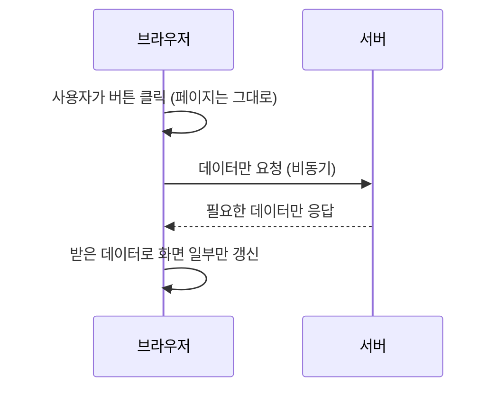

<Callout type="info">
  **이번 문서의 목표:** 이 파일을 다 읽으면 XML 문서의 구조를 HTML과 비교해 설명할 수 있고, Ajax가 왜 필요한지, 비동기 통신이 무엇인지, `XMLHttpRequest`와 `fetch`가 대략 어떤 흐름으로 동작하는지 시험에 나오는 수준으로 설명할 수 있다.
</Callout>

## 왜 XML과 Ajax를 함께 다루는가

09편까지는 브라우저 안에서 완결되는 HTML·CSS·JavaScript를 다뤘습니다. 하지만 실제 웹 페이지는 대부분 서버와 데이터를 주고받으며 동작합니다. **XML**(Extensible Markup Language, 확장 가능한 마크업 언어)은 이런 데이터를 태그 형태로 표현하는 오래된 표준 방식이고, **Ajax**(Asynchronous JavaScript and XML, 비동기 자바스크립트와 XML)는 그 데이터를 페이지 전체를 새로고침하지 않고 주고받는 기법입니다. 이름에서 보듯 Ajax는 원래 XML과 함께 등장했기 때문에 이 두 개념은 역사적으로도, 출제 범위상으로도 한 편에 묶입니다. 독학사 2단계에서는 두 개념 모두 실무 수준의 깊은 활용이 아니라 "이것이 왜 필요하고 어떻게 동작하는가"를 개념으로 이해했는지를 확인하는 수준으로 출제됩니다.

> **쉽게 말하면:** XML은 데이터를 담는 "규격화된 상자"이고, Ajax는 그 상자를 페이지를 새로 열지 않고도 서버에서 몰래 받아 오는 "심부름꾼"입니다.

## 1. XML — 태그로 데이터를 표현하는 언어

### HTML과 XML의 차이

HTML(HyperText Markup Language, 하이퍼텍스트 마크업 언어)과 XML은 둘 다 태그를 사용하는 마크업 언어이지만 목적이 다릅니다. HTML은 "이 글자를 어떻게 보여줄 것인가"(표현, presentation)를 위한 언어이고, XML은 "이 데이터가 무엇을 의미하는가"(구조, structure)를 표현하기 위한 언어입니다.

| 구분 | HTML | XML |
|------|------|-----|
| 목적 | 문서의 표현·구조 | 데이터의 구조·의미 |
| 태그 종류 | 미리 정해진 태그만 사용(`h1`, `p`, `div` 등) | 사용자가 태그 이름을 직접 정의 |
| 태그 대소문자 | 구분하지 않음 | 엄격히 구분함 |
| 닫는 태그 생략 | 일부 태그(`br`, `img`)는 생략 가능 | 예외 없이 모든 태그를 닫아야 함 |
| 오류에 대한 관용도 | 문법이 틀려도 브라우저가 최대한 보정해서 표시 | 문법이 하나라도 틀리면 파싱 자체가 실패 |

**자주 틀리는 점**: "XML도 마크업 언어니까 HTML처럼 태그를 대충 닫아도 되고 대소문자를 안 맞춰도 된다"고 착각하는 경우가 많습니다. XML은 **정형식**(well-formed, 문법 규칙을 정확히 지킨 형식)이 아니면 파서가 아예 데이터를 읽지 못하고 오류를 냅니다.

### XML 문서의 기본 구조

```xml
<?xml version="1.0" encoding="UTF-8"?>
<학생목록>
  <학생 id="1">
    <이름>김독학</이름>
    <점수>88</점수>
  </학생>
  <학생 id="2">
    <이름>이자격</이름>
    <점수>72</점수>
  </학생>
</학생목록>
```

```text
파싱 결과(트리 구조로 해석됨):
학생목록 (루트 요소)
 ├ 학생 (id=1)
 │  ├ 이름: 김독학
 │  └ 점수: 88
 └ 학생 (id=2)
    ├ 이름: 이자격
    └ 점수: 72
```

이 예제로 XML 문서의 핵심 규칙을 확인할 수 있습니다.

- **선언부**: `<?xml version="1.0" encoding="UTF-8"?>`는 이 문서가 XML 1.0 규격을 따르며 UTF-8 문자 인코딩(글자를 컴퓨터가 저장하는 방식)을 사용한다고 밝히는 줄입니다. 생략할 수 있지만 대부분 문서 맨 앞에 명시합니다.
- **루트 요소**(root element): XML 문서는 반드시 **하나의** 최상위 태그로 전체를 감싸야 합니다. 위 예제에서는 `학생목록`이 루트 요소이며, 그 안의 모든 `학생` 태그를 감쌉니다. 루트 요소가 없거나 최상위 태그가 둘 이상이면 정형식 오류입니다.
- **태그의 짝**: `<이름>김독학</이름>`처럼 여는 태그와 닫는 태그가 정확히 짝을 이뤄야 합니다.
- **속성**(attribute): `<학생 id="1">`의 `id="1"`처럼 태그 안에 추가 정보를 붙일 수 있습니다. 속성값은 반드시 따옴표로 감싸야 합니다.
- **사용자 정의 태그**: `학생목록`, `학생`, `이름`, `점수`는 모두 이 문서를 만든 사람이 임의로 정한 이름입니다. HTML의 `h1`, `p`처럼 미리 정해진 태그가 아닙니다.

> **쉽게 말하면:** XML 문서는 회사의 조직도와 같습니다. 맨 위에 회사(루트 요소) 하나가 있고, 그 아래 부서(자식 요소)들이 있으며, 각 부서 이름은 회사가 마음대로 지을 수 있습니다. 다만 조직도에 "짝이 안 맞는 상자"가 있으면 안 됩니다.

### 정형식 규칙 위반의 예

```xml
<학생목록>
  <학생>
    <이름>김독학
    <점수>88</점수>
  </학생>
</학생목록>
```

```text
파싱 오류: <이름> 태그가 </이름>으로 닫히지 않았습니다.
정형식(well-formed) 규칙 위반으로 이 문서 전체를 읽을 수 없습니다.
```

이름 태그가 닫히지 않았기 때문에 파서는 이 태그가 어디까지 이어지는지 알 수 없어 문서 전체 해석에 실패합니다. HTML이었다면 브라우저가 어느 정도 보정해서라도 화면에 표시했겠지만, XML은 이런 관용을 허용하지 않는다는 점이 두 언어의 가장 큰 차이입니다.

## 2. Ajax — 페이지를 새로고침하지 않고 서버와 통신하기

### Ajax가 필요한 이유

전통적인 웹 페이지는 사용자가 링크를 클릭하거나 폼을 제출할 때마다 서버에 새 HTML 페이지 전체를 요청하고, 브라우저가 화면 전체를 다시 그렸습니다. 이 방식은 게시판 댓글 하나를 등록하기 위해서도 페이지 전체(헤더, 메뉴, 다른 게시글 목록까지)를 통째로 다시 받아야 해서 느리고 비효율적입니다.

**Ajax**(비동기 자바스크립트와 XML)는 이 문제를 해결하기 위해 등장한 기법으로, 필요한 데이터만 서버에 요청해서 받아 오고, 그 데이터로 페이지의 **일부분만** JavaScript로 바꿔치기합니다. 페이지 전체를 다시 불러오지 않으므로 사용자 입장에서는 화면이 깜빡이지 않고 부드럽게 갱신되는 것처럼 보입니다.



> **쉽게 말하면:** 전통적인 방식이 "질문 하나 바꾸려고 시험지 전체를 새로 나눠주는 것"이라면, Ajax는 "그 질문이 적힌 종이 한 장만 슬쩍 바꿔치기하는 것"입니다.

### 동기와 비동기

Ajax의 이름에 들어 있는 "**비동기**(asynchronous)"라는 말을 정확히 이해하는 것이 중요합니다.

- **동기**(synchronous) 방식: 어떤 작업(예: 서버에 데이터 요청)이 끝날 때까지 다음 코드가 실행되지 않고 기다립니다. 마치 전화 통화처럼, 상대가 응답할 때까지 다른 일을 할 수 없습니다.
- **비동기**(asynchronous) 방식: 작업을 요청해 놓고 응답을 기다리는 동안에도 다른 코드(예: 사용자 클릭 처리, 화면 갱신)를 계속 실행할 수 있습니다. 마치 문자 메시지를 보내 놓고 답장이 올 때까지 다른 일을 하는 것과 같습니다. 응답이 도착하면 미리 등록해 둔 함수(콜백 함수 등)가 그때 실행됩니다.

만약 Ajax 요청이 동기 방식이었다면, 서버 응답이 오는 동안 브라우저 전체가 멈춰서 사용자가 아무 것도 클릭할 수 없게 됩니다. Ajax가 비동기 방식을 쓰는 이유가 바로 이 "응답을 기다리는 동안 화면이 멈추지 않게 하기 위함"입니다.

### XMLHttpRequest — Ajax의 원조 방식

Ajax를 구현하는 전통적인 방법은 브라우저가 제공하는 `XMLHttpRequest`(XML 요청 객체, 줄여서 XHR이라 부름)를 사용하는 것입니다. 이름에 XML이 들어 있지만 실제로는 XML뿐 아니라 JSON, 텍스트 등 어떤 형식의 데이터도 주고받을 수 있습니다.

```js
const xhr = new XMLHttpRequest(); // (A) 요청 객체 생성

xhr.open("GET", "/api/students", true); // (B) 요청 방식·주소·비동기 여부 설정

xhr.onload = function () {
  // (D) 응답이 도착했을 때 실행될 함수 등록
  if (xhr.status === 200) {
    console.log("응답 데이터:", xhr.responseText);
  } else {
    console.log("요청 실패:", xhr.status);
  }
};

xhr.send(); // (C) 실제 요청 전송
```

```text
(요청을 보내는 시점에는 아직 응답이 없으므로 콘솔에 아무것도 찍히지 않는다)
응답 데이터: [{"이름":"김독학","점수":88}, ...]  ← 서버 응답이 도착한 뒤에야 출력
```

`open` 메서드의 세 번째 인자 `true`는 이 요청을 **비동기**로 처리하겠다는 뜻입니다. `send()`를 호출한 직후 바로 다음 줄로 실행이 넘어가며, 실제 응답 데이터는 한참 뒤에 `onload`에 등록해 둔 함수가 실행될 때 비로소 사용할 수 있습니다. `xhr.status`는 HTTP 상태 코드(01편에서 다룬, 서버가 응답에 붙이는 세 자리 숫자)로, 200은 성공을 의미합니다.

**자주 틀리는 점**: `send()`를 호출한 바로 다음 줄에서 `xhr.responseText`(응답으로 받은 텍스트)를 곧바로 읽으려는 코드를 보여 주고 "이 코드가 정상 동작하는가"를 묻는 문제가 자주 나옵니다. 비동기 요청이므로 `send()` 직후에는 아직 서버 응답이 도착하지 않았을 가능성이 높고, 이때 `responseText`를 읽으면 빈 문자열이거나 이전 상태의 값이 나옵니다. 응답은 반드시 `onload` 같은 콜백 함수 안에서 처리해야 합니다.

### fetch — 최신 방식의 등장

최근에는 `XMLHttpRequest`보다 더 간결한 문법을 제공하는 `fetch`(가져오다, 브라우저가 제공하는 최신 비동기 요청 함수)를 함께 사용합니다. 시험 범위에서는 `fetch`가 `XMLHttpRequest`의 대안으로 등장했다는 점, 그리고 결과값을 다루는 방식이 **프라미스**(Promise, 비동기 작업의 결과를 나중에 받기로 약속하는 객체) 기반이라는 점만 개념으로 알아 두면 충분합니다.

```js
fetch("/api/students") // (A) 요청을 보내고 Promise를 즉시 반환
  .then(function (응답) {
    return 응답.json(); // (B) 응답 본문을 JSON으로 변환 (이 역시 비동기)
  })
  .then(function (데이터) {
    console.log("받은 데이터:", 데이터); // (C) 변환이 끝난 뒤 실제 데이터 사용
  });

console.log("요청을 보냈습니다"); // (D) fetch 완료를 기다리지 않고 즉시 실행됨
```

```text
요청을 보냈습니다
받은 데이터: [{이름: '김독학', 점수: 88}, ...]
```

`fetch`가 `XMLHttpRequest`보다 먼저 시작되었는데도 콘솔에는 "요청을 보냈습니다"가 먼저 찍히고, 실제 데이터는 그다음에 찍힙니다. 이는 `fetch(...).then(...)` 부분이 비동기로 처리되어 응답이 도착하기 전까지는 `.then` 안의 코드가 실행되지 않고, 그사이 `console.log("요청을 보냈습니다")`처럼 그 아래에 있는 동기 코드가 먼저 실행되기 때문입니다. 이 실행 순서(동기 코드가 먼저, 비동기 콜백이 나중)는 Ajax 전체를 관통하는 핵심 원리이므로 어떤 방식(`XMLHttpRequest`든 `fetch`든)을 쓰든 동일하게 적용됩니다.

> **쉽게 말하면:** `fetch`로 심부름을 보내 놓고, 심부름꾼이 돌아오길 기다리지 않고 하던 일을 계속하다가, 심부름꾼이 돌아오면(응답이 도착하면) 그제서야 가져온 물건(데이터)을 확인하는 것입니다.

## 3. XML에서 JSON으로 — 요즘 데이터 형식의 흐름

Ajax라는 이름에는 XML이 들어 있지만, 실제로 오늘날 서버와 브라우저가 주고받는 데이터는 **JSON**(JavaScript Object Notation, 자바스크립트 객체 표기법)인 경우가 훨씬 많습니다. 시험에서도 이 흐름(왜 XML에서 JSON으로 무게중심이 옮겨 갔는지)을 개념적으로 물을 수 있습니다.

| 구분 | XML | JSON |
|------|-----|------|
| 형태 | 태그로 감싼 구조 | 중괄호·대괄호로 감싼 키-값 구조 |
| 같은 데이터의 길이 | 여는 태그·닫는 태그가 반복되어 상대적으로 김 | 태그 반복이 없어 상대적으로 짧음 |
| JavaScript와의 궁합 | 별도의 파싱 절차 필요 | JavaScript 객체 문법과 거의 같아 변환이 간단함 |
| 사람이 읽기 | 문서형 데이터(문서, 설정 파일 등)에 적합 | 단순 데이터 교환에 적합 |

```xml
<학생>
  <이름>김독학</이름>
  <점수>88</점수>
</학생>
```

```json
{ "이름": "김독학", "점수": 88 }
```

같은 정보를 표현하는데도 JSON 쪽이 여는 태그·닫는 태그 반복이 없어 더 짧고, JavaScript의 객체 리터럴 문법(02편에서 배운 것과 유사한 형태)과 거의 똑같아 `JSON.parse()`(문자열을 JavaScript 객체로 변환) 한 번으로 바로 사용할 수 있습니다. 이런 이유로 오늘날 Ajax 통신은 이름은 그대로 "Ajax"를 쓰지만 실제 데이터 형식은 XML 대신 JSON을 쓰는 경우가 압도적으로 많다는 점이, 시험에서 "Ajax는 반드시 XML만 사용해야 하는가"를 묻는 문제의 핵심 포인트입니다.

**자주 틀리는 점**: "Ajax라는 이름에 XML이 들어가니 Ajax 통신은 반드시 XML 형식으로만 데이터를 주고받아야 한다"고 오해하는 경우가 많습니다. Ajax는 특정 데이터 형식에 종속된 기술이 아니라 "비동기로 서버와 통신한다"는 방식 자체를 가리키는 이름이며, 실제로 주고받는 데이터는 JSON, 텍스트, XML 등 무엇이든 될 수 있습니다.

## 핵심 정리

- XML은 사용자가 태그를 직접 정의해 데이터의 구조를 표현하는 마크업 언어이며, 반드시 하나의 루트 요소와 정확히 짝이 맞는 태그로 이뤄진 정형식을 지켜야 파싱된다.
- Ajax는 페이지 전체를 새로고침하지 않고 필요한 데이터만 비동기로 주고받아 화면 일부만 갱신하는 기법이다.
- 비동기 방식에서는 요청을 보낸 직후 응답이 곧바로 오지 않으며, 응답 처리는 반드시 콜백 함수(onload, then 등) 안에서 이뤄지고 그 아래의 동기 코드가 먼저 실행된다.
- `XMLHttpRequest`는 Ajax의 전통적인 구현 방식이고, `fetch`는 Promise 기반의 더 간결한 최신 방식이다.
- Ajax라는 이름에 XML이 들어 있지만 실제 데이터 형식에는 제한이 없으며, 오늘날은 JSON을 더 널리 사용한다.

## 마무리 복습

<Quiz
  questionNumber={1}
  question="HTML과 XML의 차이에 대한 설명으로 옳지 않은 것은?"
  options={['HTML은 문서의 표현을 위한 언어이고 XML은 데이터의 구조를 위한 언어다.', 'XML은 사용자가 태그 이름을 직접 정의할 수 있다.', 'HTML과 XML 모두 태그의 대소문자를 구분하지 않는다.', 'XML은 정형식 규칙을 지키지 않으면 파싱 자체가 실패한다.']}
  correctAnswer={3}
  explanation="HTML은 태그의 대소문자를 구분하지 않지만, XML은 태그의 대소문자를 엄격히 구분한다. 이 둘을 같다고 서술한 것이 옳지 않은 설명이다."
  optionExplanations={['옳은 설명이다. HTML은 표현, XML은 구조·의미 표현을 목적으로 한다.', '옳은 설명이다. XML은 미리 정해진 태그가 없고 사용자가 태그 이름을 정한다.', '옳지 않은 설명이므로 정답이다. XML은 대소문자를 엄격히 구분한다.', '옳은 설명이다. XML은 정형식이 아니면 파서가 문서 전체를 읽지 못한다.']}
/>

<Quiz
  questionNumber={2}
  question="다음 XML 문서에 대한 설명으로 옳은 것은? 학생목록 태그 안에 학생 태그가 두 개 있고, 각 학생 태그 안에는 이름과 점수 태그가 있다."
  options={['학생목록은 이 문서의 루트 요소다.', '학생 태그는 반드시 이름을 학생1, 학생2처럼 숫자를 붙여야 한다.', '이름과 점수 태그는 HTML에도 존재하는 표준 태그다.', '이 구조에서는 루트 요소가 반드시 두 개 이상이어야 한다.']}
  correctAnswer={1}
  explanation="XML 문서는 전체를 감싸는 단 하나의 최상위 태그가 있어야 하며, 이를 루트 요소라 한다. 이 문서에서는 학생목록이 그 역할을 한다."
  optionExplanations={['정답. 학생목록이 문서 전체를 감싸는 루트 요소다.', '같은 이름의 태그를 반복해서 사용할 수 있으며, 숫자를 붙여 구분해야 한다는 규칙은 없다.', '이름, 점수는 이 문서를 만든 사람이 임의로 정의한 태그로 HTML의 표준 태그가 아니다.', 'XML 문서는 루트 요소가 정확히 하나여야 하며, 둘 이상이면 정형식 오류다.']}
/>

<Quiz
  questionNumber={3}
  question="Ajax에 대한 설명으로 가장 적절한 것은?"
  options={['페이지 전체를 새로고침해야만 화면을 갱신할 수 있게 하는 기법이다.', '페이지 전체를 새로고침하지 않고 필요한 데이터만 비동기로 주고받는 기법이다.', 'HTML 문서의 표현 방식을 정의하는 마크업 언어다.', '반드시 XML 형식의 데이터만 주고받을 수 있는 기술이다.']}
  correctAnswer={2}
  explanation="Ajax는 페이지 전체를 다시 불러오지 않고, 필요한 데이터만 서버와 비동기로 주고받아 화면의 일부만 갱신하는 기법이다."
  optionExplanations={['Ajax의 핵심은 오히려 새로고침 없이 갱신하는 것이므로 반대되는 설명이다.', '정답. Ajax는 비동기 통신으로 화면 일부만 갱신하는 기법이다.', '마크업 언어를 설명한 것으로, Ajax는 언어가 아니라 통신 기법이다.', 'Ajax는 이름에 XML이 들어 있을 뿐 실제로는 JSON 등 다양한 형식을 주고받을 수 있다.']}
/>

<Quiz
  questionNumber={4}
  question="동기 방식과 비동기 방식의 차이에 대한 설명으로 옳지 않은 것은?"
  options={['동기 방식은 작업이 끝날 때까지 다음 코드 실행을 기다린다.', '비동기 방식은 작업 완료를 기다리지 않고 다른 코드를 계속 실행할 수 있다.', 'Ajax는 브라우저가 멈추지 않도록 비동기 방식을 사용한다.', '비동기 방식에서는 응답 결과를 요청 바로 다음 줄에서 즉시 사용할 수 있다.']}
  correctAnswer={4}
  explanation="비동기 방식에서 응답 결과는 요청 직후가 아니라 응답이 실제로 도착한 뒤 콜백 함수(onload, then 등) 안에서 사용할 수 있다. 요청 바로 다음 줄에서 즉시 사용할 수 있다는 설명은 옳지 않다."
  optionExplanations={['옳은 설명이다. 동기 방식은 작업 완료까지 다음 코드가 대기한다.', '옳은 설명이다. 비동기 방식은 완료를 기다리지 않고 이후 코드를 계속 실행한다.', '옳은 설명이다. 비동기 방식 덕분에 응답을 기다리는 동안에도 브라우저가 멈추지 않는다.', '옳지 않은 설명이므로 정답이다. 응답은 콜백 함수가 실행되는 시점에야 사용할 수 있다.']}
/>

<Quiz
  questionNumber={5}
  question="XMLHttpRequest를 이용한 요청에서, send() 호출 직후 바로 다음 줄에서 xhr.responseText를 곧바로 읽는 코드에 대한 설명으로 가장 적절한 것은?"
  options={['항상 서버의 최종 응답 데이터를 정확히 읽어 온다.', '비동기 요청이므로 그 시점에는 응답이 아직 도착하지 않았을 수 있어 의도한 값을 읽지 못할 수 있다.', 'XMLHttpRequest는 원래 동기 방식으로만 동작하므로 문제가 없다.', 'responseText는 요청을 보내기 전부터 이미 값이 채워져 있다.']}
  correctAnswer={2}
  explanation="open의 세 번째 인자를 true로 설정한 비동기 요청에서는 send() 직후에도 서버 응답이 아직 도착하지 않았을 가능성이 높다. 응답 데이터는 onload 같은 콜백 함수 안에서 처리해야 한다."
  optionExplanations={['비동기 요청에서는 send() 직후 응답이 아직 도착하지 않았을 수 있어 항상 정확히 읽는다고 볼 수 없다.', '정답. 비동기 특성상 응답 전 상태를 읽게 될 수 있으므로 콜백 함수 안에서 처리해야 한다.', 'open의 세 번째 인자로 비동기 여부를 지정할 수 있으며, 예제 코드는 true로 비동기 요청을 설정했다.', 'responseText는 요청 전송 이전에는 의미 있는 값을 갖지 않는다.']}
/>

<Quiz
  questionNumber={6}
  question="fetch 함수와 관련된 설명으로 옳지 않은 것은?"
  options={['fetch는 Promise를 반환하는 최신 비동기 요청 함수다.', 'then 메서드 안의 코드는 응답이 도착한 뒤에 실행된다.', 'fetch 요청을 보내는 즉시 그 아래에 있는 동기 코드의 실행이 멈춘다.', 'fetch는 XMLHttpRequest의 대안으로 등장한 방식이다.']}
  correctAnswer={3}
  explanation="fetch는 비동기로 동작하므로 요청을 보낸 뒤에도 그 아래에 있는 동기 코드는 응답을 기다리지 않고 곧바로 계속 실행된다. 실행이 멈춘다는 설명은 옳지 않다."
  optionExplanations={['옳은 설명이다. fetch는 Promise 객체를 반환한다.', '옳은 설명이다. then 안의 콜백은 응답 도착 후 실행된다.', '옳지 않은 설명이므로 정답이다. 아래의 동기 코드는 응답을 기다리지 않고 먼저 실행된다.', '옳은 설명이다. fetch는 XMLHttpRequest보다 간결한 최신 방식으로 등장했다.']}
/>

## 참고 자료

- [MDN Web Docs - XML](https://developer.mozilla.org/en-US/docs/Web/XML)
- [MDN Web Docs - AJAX](https://developer.mozilla.org/en-US/docs/Glossary/AJAX)
