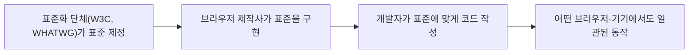

<Callout type="info">
  **이번 문서의 목표:** 이 파일을 다 읽으면 웹 표준이 무엇이고 왜 지켜야 하는지 설명할 수 있고, 시맨틱 태그가 접근성에 어떻게 기여하는지 04편의 내용과 연결해 설명할 수 있으며, 웹 접근성의 핵심 원칙에 비춰 "이 마크업이 접근성을 지켰는가"를 스스로 판별할 수 있다.
</Callout>

## 왜 웹 표준과 접근성을 한 편에 묶었는가

지금까지 배운 HTML·CSS·JavaScript는 "코드가 어떻게 동작하는가"에 초점을 맞췄습니다. 이 편은 시선을 조금 바꿔 "이 코드를 왜 이렇게 짜야 하는가"라는 질문을 다룹니다. **웹 표준**(web standards)은 모든 브라우저·기기에서 웹 페이지가 똑같이 동작하도록 만드는 공통 규칙이고, **웹 접근성**(web accessibility)은 장애가 있거나 특수한 환경에 있는 사용자도 웹 페이지를 문제없이 이용할 수 있게 만드는 원칙입니다. 이 둘은 서로 다른 개념이지만, 04편에서 다룬 **시맨틱 태그**(semantic tag, 의미를 가진 태그)를 정확히 쓰는 것이 두 가지 목표를 동시에 달성하는 핵심 수단이라는 점에서 밀접하게 연결됩니다. 독학사 2단계 시험은 이 두 개념의 정의를 암기했는지보다, 구체적인 마크업 사례를 보여 주고 "이것이 표준·접근성을 지켰는가"를 판별할 수 있는지를 주로 묻습니다.

> **쉽게 말하면:** 웹 표준이 "모두가 같은 규칙으로 건물을 지어야 어떤 사람이 와도 헤매지 않는다"는 약속이라면, 웹 접근성은 "휠체어를 탄 사람도, 시각장애인도 그 건물에 문제없이 들어올 수 있게 경사로와 점자 안내판을 만들어야 한다"는 원칙입니다.

## 1. 웹 표준 — 브라우저마다 다르게 동작하지 않도록

### 웹 표준이 필요했던 이유

웹 초창기에는 브라우저마다 HTML·CSS를 해석하는 방식이 조금씩 달랐습니다. 그 결과 같은 HTML 코드를 작성해도 어떤 브라우저에서는 정상적으로 보이고, 다른 브라우저에서는 레이아웃이 깨지는 일이 흔했습니다. 개발자는 이를 피하기 위해 브라우저마다 다른 코드를 따로 작성해야 했고, 이는 비효율적일 뿐 아니라 사용자 경험의 일관성도 해쳤습니다.

**웹 표준**(web standards)은 이 문제를 해결하기 위해 W3C(World Wide Web Consortium, 월드와이드웹 컨소시엄)나 WHATWG(Web Hypertext Application Technology Working Group, 웹 하이퍼텍스트 애플리케이션 기술 워킹 그룹) 같은 국제 표준화 단체가 정한, HTML·CSS·JavaScript 등이 따라야 할 공식 규칙입니다. 브라우저 제작사들이 이 표준을 준수해 브라우저를 만들면, 개발자는 표준에 맞게 작성한 코드 하나만으로 어떤 브라우저에서도 동일하게(또는 최대한 비슷하게) 동작하는 페이지를 만들 수 있습니다.



> **쉽게 말하면:** 웹 표준은 전 세계 콘센트 모양을 하나로 통일하는 것과 비슷합니다. 규격이 통일되어 있으면 어떤 나라에서 만든 전자제품이든 그 콘센트에 꽂아 쓸 수 있습니다.

### 웹 표준을 지키지 않았을 때의 문제

| 문제 | 구체적인 예 |
|------|-------------|
| 브라우저 호환성 저하 | 특정 브라우저 전용 CSS 속성만 사용해 다른 브라우저에서는 레이아웃이 깨짐 |
| 유지보수 비용 증가 | 브라우저마다 다른 코드를 따로 관리해야 함 |
| 검색 엔진 최적화(SEO) 저하 | 의미 없는 태그(`div` 남용)만 사용해 검색 엔진이 문서 구조를 파악하기 어려움 |
| 접근성 저하 | 표준을 따르지 않은 비표준 마크업은 보조 기술(스크린 리더 등)과 호환되지 않을 가능성이 큼 |

이 표에서 보듯 "검색 엔진 최적화 저하"와 "접근성 저하"는 서로 다른 문제처럼 보이지만, 뿌리는 같습니다. 웹 표준을 지키며 의미가 명확한 태그(시맨틱 태그)를 쓰면 검색 엔진도, 스크린 리더 같은 보조 기술도 문서의 구조를 정확히 파악할 수 있기 때문입니다. 이 연결 고리가 바로 다음 절에서 다룰 웹 접근성의 핵심입니다.

## 2. 웹 접근성 — 누구나 이용할 수 있는 웹

### 웹 접근성의 정의

**웹 접근성**(web accessibility)은 시각·청각·운동·인지 등에 장애가 있는 사용자나, 나이가 많거나, 일시적으로 신체 기능이 제한된 사용자(예: 손을 다쳐 마우스를 못 쓰는 상황), 또는 특수한 환경(예: 화면이 작은 기기, 느린 네트워크)에 있는 사용자도 웹 콘텐츠를 문제없이 인식하고 이용할 수 있도록 만드는 것을 말합니다. W3C 산하의 **WAI**(Web Accessibility Initiative, 웹 접근성 이니셔티브)가 이 분야의 국제 표준을 주도하고 있습니다.

**자주 틀리는 점**: 웹 접근성을 "시각장애인을 위한 기능"으로만 좁게 이해하는 경우가 많습니다. 실제로는 청각장애(자막 필요), 운동장애(키보드만으로 조작), 인지장애(단순하고 명확한 구조 필요), 그리고 일시적·상황적 제약(밝은 야외에서 화면이 잘 안 보이는 경우 등)까지 모두 포괄하는 개념입니다.

### 접근성의 네 가지 원칙 (POUR)

WAI가 정리한 웹 콘텐츠 접근성 지침(WCAG, Web Content Accessibility Guidelines)은 접근성을 네 가지 원칙으로 요약합니다. 각 원칙의 앞 글자를 따서 **POUR**(파우어처럼 읽으며, 원래 "붓다"라는 뜻의 단어에서 앞글자만 따온 약칭)라고 부릅니다.

| 원칙 | 영단어 | 뜻 | 마크업 예 |
|------|--------|-----|-----------|
| 인식의 용이성 | Perceivable | 사용자가 콘텐츠를 어떤 방식으로든 인식할 수 있어야 한다 | 이미지에 대체 텍스트(`alt`) 제공 |
| 운용의 용이성 | Operable | 사용자가 인터페이스를 조작할 수 있어야 한다 | 마우스 없이 키보드만으로 모든 기능 조작 가능 |
| 이해의 용이성 | Understandable | 콘텐츠와 조작 방법을 이해할 수 있어야 한다 | 명확한 레이블, 일관된 내비게이션 구조 |
| 견고성 | Robust | 다양한 보조 기술·브라우저에서 안정적으로 해석될 수 있어야 한다 | 표준을 지킨 정형식 마크업, 시맨틱 태그 사용 |

이 네 원칙 중 시험에서 가장 자주 구체적인 사례로 등장하는 것은 "인식의 용이성"과 "운용의 용이성"입니다. 예를 들어 이미지에 `alt` 속성이 없으면, 스크린 리더(시각장애인이 화면 내용을 음성으로 듣도록 돕는 보조 기술 프로그램)가 그 이미지를 사용자에게 전혀 설명해 줄 수 없어 "인식" 자체가 불가능해집니다.

```html
<!-- 접근성을 지키지 않은 예: 이미지의 의미를 스크린 리더가 전혀 알 수 없음 -->


<!-- 접근성을 지킨 예: alt 속성으로 이미지의 의미를 텍스트로 제공 -->

```

**자주 틀리는 점**: `alt` 속성에 이미지 파일명(`chart.png`)이나 의미 없는 문구("이미지")를 그대로 넣는 경우가 많습니다. `alt`의 목적은 그 이미지가 전달하는 **의미**를 텍스트로 대신 전달하는 것이므로, 파일명이 아니라 이미지의 실제 내용을 설명하는 문장을 넣어야 합니다. 단, 순수하게 장식용이라 의미 전달이 필요 없는 이미지는 `alt=""`(빈 문자열)로 두어, 스크린 리더가 그 이미지를 건너뛰게 하는 것도 올바른 접근성 처리입니다.

### 시맨틱 마크업과 접근성의 연결

04편에서 `header`, `nav`, `main`, `article`, `footer` 같은 시맨틱 태그(semantic tag)가 문서의 의미 있는 구조를 나타낸다고 배웠습니다. 이 시맨틱 태그는 접근성 관점에서도 결정적인 역할을 합니다. 스크린 리더는 시맨틱 태그를 인식해 "지금 내비게이션 영역입니다", "본문이 시작됩니다"처럼 사용자에게 구조를 안내할 수 있기 때문입니다. 반대로 문서 전체를 의미 없는 `div`로만 채우면, 스크린 리더 사용자는 지금 자신이 페이지의 어느 영역을 읽고 있는지 전혀 알 수 없습니다.

```html
<!-- 접근성이 떨어지는 예: 의미 없는 div만 사용 -->
<div class="상단">사이트 이름</div>
<div class="메뉴">
  <div>홈</div>
  <div>소개</div>
</div>
<div class="본문">여기부터 실제 내용입니다.</div>

<!-- 접근성을 고려한 예: 시맨틱 태그로 구조를 명확히 표시 -->
<header>사이트 이름</header>
<nav>
  <a href="/">홈</a>
  <a href="/about">소개</a>
</nav>
<main>여기부터 실제 내용입니다.</main>
```

두 코드는 화면에 보이는 모습(CSS를 적용하기 전이라면)이 비슷할 수 있지만, 스크린 리더가 읽어 주는 정보의 질은 완전히 다릅니다. `nav` 태그를 쓴 두 번째 예제에서는 스크린 리더 사용자가 "내비게이션 영역으로 건너뛰기" 같은 기능을 사용해 메뉴 부분만 곧바로 찾아갈 수 있지만, 첫 번째 예제의 `div`들은 스크린 리더 입장에서 아무 의미 없는 상자의 나열일 뿐입니다.

> **쉽게 말하면:** `div`로만 만든 페이지는 방 이름표가 하나도 없는 건물과 같습니다. 눈으로 보는 사람은 가구 배치를 보고 "여기가 거실이구나" 짐작할 수 있지만, 앞을 보지 못하는 사람에게는 안내판(시맨틱 태그) 없이는 그 방이 거실인지 화장실인지 알 방법이 없습니다.

### 키보드 접근성 — 운용의 용이성 사례

마우스를 사용할 수 없는 사용자(운동장애가 있거나, 스크린 리더를 쓰는 시각장애인 대부분 포함)를 위해서는 **키보드만으로** 페이지의 모든 기능을 사용할 수 있어야 합니다. 이때 핵심이 되는 것이 `tabindex`(탭 순서, Tab 키를 눌렀을 때 초점이 이동하는 순서를 지정하는 속성)와, 클릭 가능한 요소를 의미에 맞는 태그로 만드는 것입니다.

```html
<!-- 접근성이 떨어지는 예: div에 클릭 이벤트만 붙임 -->
<div onclick="제출하기()">제출</div>

<!-- 접근성을 고려한 예: button 태그 사용 -->
<button onclick="제출하기()">제출</button>
```

`div`는 원래 클릭이나 키보드 초점(포커스)과 아무 관련이 없는 태그이므로, `div`에 클릭 이벤트만 걸어 두면 마우스로는 눌러지지만 Tab 키로는 그 요소에 초점이 가지 않고, Enter 키를 눌러도 아무 반응이 없습니다. 반면 `button` 태그는 브라우저가 기본적으로 Tab 키로 초점을 받을 수 있게, Enter나 스페이스바로 클릭과 동일하게 동작하게 만들어 놓았습니다. "버튼처럼 보이게 CSS만 입힌 `div`"와 "실제 `button` 태그"의 차이를 판별하는 문제가 접근성 파트에서 자주 나오는 이유가 여기에 있습니다.

## 3. 웹 표준·접근성 판별 연습

다음은 시험에서 실제로 나올 수 있는 형태의 판별형 사례입니다. 각 사례가 웹 표준·접근성 관점에서 무엇이 문제인지 짚어 봅니다.

| 사례 | 문제점 | 개선 방향 |
|------|--------|-----------|
| 표를 레이아웃(칸 나누기) 목적으로만 사용 | `table`은 표 형식 데이터를 의미하는 태그인데 레이아웃용으로 쓰면 스크린 리더가 잘못된 의미로 안내함 | CSS의 레이아웃 속성(07편에서 다룬 display, position 등)으로 배치하고 `table`은 실제 표 데이터에만 사용 |
| 폼의 입력창에 `label` 없이 `placeholder`만 표시 | `placeholder`는 값을 입력하면 사라지고, 스크린 리더가 항상 읽어 주는 값이 아님 | `label` 태그로 입력창의 용도를 항상 표시되는 텍스트로 명확히 연결 |
| 색깔로만 오류를 표시(빨간 테두리만) | 색을 구분하지 못하는 사용자(색맹 등)는 오류 여부를 알 수 없음 | 색과 함께 텍스트·아이콘으로도 오류임을 표시 |
| 동영상에 자막이 전혀 없음 | 청각장애가 있는 사용자가 내용을 전혀 파악할 수 없음 | 자막 또는 스크립트 텍스트 제공 |

이 표의 공통점은 "시각적으로는 문제없어 보이지만, 특정 조건의 사용자에게는 정보가 아예 전달되지 않거나 조작이 불가능해진다"는 것입니다. 웹 표준과 접근성을 함께 고려한다는 것은, 화면을 눈으로 보고 마우스로 조작하는 사용자뿐 아니라 그렇지 않은 사용자까지 염두에 두고 마크업을 설계하는 태도를 뜻합니다.

## 핵심 정리

- 웹 표준은 W3C·WHATWG 같은 단체가 정한 규칙으로, 이를 지키면 브라우저·기기와 무관하게 일관된 동작을 보장할 수 있다.
- 웹 접근성은 장애·고령·일시적 제약이 있는 사용자도 웹 콘텐츠를 이용할 수 있게 하는 원칙이며, POUR(인식·운용·이해·견고성) 네 원칙으로 요약된다.
- 시맨틱 태그는 웹 표준과 접근성을 동시에 만족시키는 핵심 수단으로, 스크린 리더 등 보조 기술이 문서 구조를 정확히 파악하게 해 준다.
- 이미지에는 의미를 설명하는 `alt` 속성을, 클릭 가능한 요소에는 `div` 대신 `button` 같은 의미에 맞는 태그를 사용해야 키보드·스크린 리더 사용자도 조작할 수 있다.
- 색상만으로 정보를 전달하거나 `placeholder`만으로 입력창의 용도를 표시하는 것은 접근성을 해치는 대표적인 실수다.

## 마무리 복습

<Quiz
  questionNumber={1}
  question="웹 표준에 대한 설명으로 옳지 않은 것은?"
  options={['W3C, WHATWG 같은 단체가 웹 표준을 제정한다.', '웹 표준을 지키면 여러 브라우저에서 일관된 동작을 기대할 수 있다.', '웹 표준은 브라우저 제작사가 아니라 검색 엔진 회사만 준수하면 되는 규칙이다.', '웹 표준을 지키지 않으면 브라우저마다 다른 코드를 관리해야 하는 유지보수 부담이 커진다.']}
  correctAnswer={3}
  explanation="웹 표준은 브라우저 제작사가 구현해야 개발자가 작성한 코드가 여러 브라우저에서 일관되게 동작한다. 검색 엔진 회사만 준수하면 된다는 설명은 옳지 않다."
  optionExplanations={['옳은 설명이다. W3C, WHATWG는 대표적인 웹 표준화 단체다.', '옳은 설명이다. 표준을 지키면 브라우저 간 동작의 일관성을 기대할 수 있다.', '옳지 않은 설명이므로 정답이다. 웹 표준은 브라우저 제작사가 구현해야 실질적인 효과가 있다.', '옳은 설명이다. 표준을 지키지 않으면 브라우저별로 별도 코드를 관리해야 할 수 있다.']}
/>

<Quiz
  questionNumber={2}
  question="웹 접근성에 대한 설명으로 가장 적절한 것은?"
  options={['시각장애인만을 위한 기능을 가리키는 개념이다.', '장애, 고령, 일시적·상황적 제약이 있는 사용자도 콘텐츠를 이용할 수 있게 하는 원칙이다.', '웹 페이지의 로딩 속도를 빠르게 만드는 기술을 가리킨다.', '검색 엔진 최적화와는 전혀 관련이 없는 별개의 개념이다.']}
  correctAnswer={2}
  explanation="웹 접근성은 시각장애뿐 아니라 청각·운동·인지 장애, 고령, 일시적 제약이 있는 사용자까지 포괄해 콘텐츠를 문제없이 이용할 수 있도록 하는 원칙이다."
  optionExplanations={['시각장애인만을 위한 기능으로 좁게 이해하는 것은 흔한 오해다.', '정답. 접근성은 다양한 사용자와 상황을 포괄하는 원칙이다.', '로딩 속도는 성능 최적화의 영역으로, 접근성과 직접적으로 같은 개념은 아니다.', '시맨틱 마크업처럼 접근성을 높이는 요소는 검색 엔진이 문서 구조를 파악하는 데도 도움이 되어 서로 연관이 있다.']}
/>

<Quiz
  questionNumber={3}
  question="웹 접근성의 네 가지 원칙(POUR)에 대한 설명으로 옳지 않은 것은?"
  options={['Perceivable은 사용자가 콘텐츠를 인식할 수 있어야 한다는 원칙이다.', 'Operable은 사용자가 인터페이스를 조작할 수 있어야 한다는 원칙이다.', 'Understandable은 콘텐츠와 조작 방법을 이해할 수 있어야 한다는 원칙이다.', 'Robust는 화면의 색상을 최대한 화려하게 구성해야 한다는 원칙이다.']}
  correctAnswer={4}
  explanation="Robust(견고성)는 다양한 보조 기술과 브라우저에서 콘텐츠가 안정적으로 해석될 수 있어야 한다는 원칙이며, 색상을 화려하게 구성하라는 뜻이 아니다."
  optionExplanations={['옳은 설명이다. Perceivable은 인식의 용이성을 뜻한다.', '옳은 설명이다. Operable은 운용의 용이성을 뜻한다.', '옳은 설명이다. Understandable은 이해의 용이성을 뜻한다.', '옳지 않은 설명이므로 정답이다. Robust는 견고성, 즉 다양한 환경에서의 안정적인 해석을 뜻한다.']}
/>

<Quiz
  questionNumber={4}
  question="이미지에 대한 대체 텍스트 alt 속성 사용에 대한 설명으로 가장 적절한 것은?"
  options={['모든 이미지의 alt에는 이미지 파일명을 그대로 넣는 것이 가장 바람직하다.', 'alt 속성은 이미지가 전달하는 의미를 설명하는 텍스트를 담아야 한다.', '순수하게 장식용인 이미지도 반드시 긴 설명을 alt에 담아야 한다.', 'alt 속성은 검색 엔진과는 무관하며 오직 화면에 보이는 디자인에만 영향을 준다.']}
  correctAnswer={2}
  explanation="alt 속성의 목적은 이미지가 전달하는 실제 의미를 텍스트로 대신 전달하는 것이다. 파일명이 아니라 이미지 내용을 설명하는 문장을 넣어야 스크린 리더 사용자가 정확히 이해할 수 있다."
  optionExplanations={['파일명은 이미지의 의미를 전달하지 못하므로 바람직한 alt 값이 아니다.', '정답. alt는 이미지가 전달하는 의미를 설명하는 텍스트여야 한다.', '순수 장식용 이미지는 오히려 alt를 빈 문자열로 두어 스크린 리더가 건너뛰게 하는 것이 올바른 처리다.', 'alt 텍스트는 검색 엔진이 이미지의 내용을 파악하는 데도 활용되므로 무관하다고 볼 수 없다.']}
/>

<Quiz
  questionNumber={5}
  question="시맨틱 태그와 접근성의 관계에 대한 설명으로 옳지 않은 것은?"
  options={['시맨틱 태그는 스크린 리더가 문서의 구조를 파악하는 데 도움을 준다.', 'div만으로 작성한 문서도 시맨틱 태그로 작성한 문서와 접근성 측면에서 동일하다.', 'nav 태그를 사용하면 스크린 리더 사용자가 내비게이션 영역을 곧바로 찾아갈 수 있다.', '시맨틱 태그의 사용은 웹 표준 준수와 접근성 향상에 동시에 기여한다.']}
  correctAnswer={2}
  explanation="div만으로 작성한 문서는 시각적으로는 비슷해 보여도 스크린 리더에게는 의미 없는 상자의 나열로 인식되어, 시맨틱 태그로 작성한 문서와 접근성 측면에서 동일하지 않다."
  optionExplanations={['옳은 설명이다. 시맨틱 태그는 구조 정보를 보조 기술에 전달한다.', '옳지 않은 설명이므로 정답이다. div만으로는 스크린 리더가 구조를 파악할 수 없어 접근성이 떨어진다.', '옳은 설명이다. nav 태그는 내비게이션 영역임을 명시적으로 알려 준다.', '옳은 설명이다. 시맨틱 태그는 표준 준수와 접근성 향상에 함께 기여한다.']}
/>

<Quiz
  questionNumber={6}
  question="클릭 가능한 요소를 만들 때 div에 클릭 이벤트만 붙인 경우와 button 태그를 사용한 경우의 차이에 대한 설명으로 가장 적절한 것은?"
  options={['두 방식 모두 Tab 키로 초점을 받을 수 있어 접근성 차이가 없다.', 'div는 기본적으로 키보드 초점을 받지 않아 Tab이나 Enter로 조작할 수 없지만, button은 기본적으로 가능하다.', 'button 태그는 마우스 클릭만 지원하고 키보드 조작은 지원하지 않는다.', 'div에 onclick을 붙이면 자동으로 button과 동일한 키보드 접근성을 갖게 된다.']}
  correctAnswer={2}
  explanation="button 태그는 브라우저가 기본적으로 Tab 키로 초점을 받고 Enter나 스페이스바로 클릭과 동일하게 동작하도록 만들어 두었지만, div는 이런 기본 동작이 없어 클릭 이벤트만 붙여서는 키보드로 조작할 수 없다."
  optionExplanations={['div는 기본적으로 키보드 초점을 받지 않으므로 두 방식은 접근성 측면에서 다르다.', '정답. div는 키보드 접근성이 기본으로 없고 button은 기본으로 지원한다.', 'button은 마우스뿐 아니라 키보드 조작도 기본적으로 지원한다.', 'div에 onclick만 붙이는 것으로는 키보드 접근성이 자동으로 생기지 않는다.']}
/>

## 참고 자료

- [W3C WAI - Web Accessibility Initiative](https://www.w3.org/WAI/)
- [W3C WAI - Introduction to Web Accessibility](https://www.w3.org/WAI/fundamentals/accessibility-intro/)
