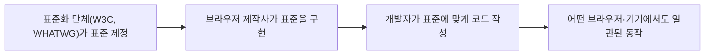

## 왜 웹 표준과 접근성을 한 편에 묶었는가

지금까지 배운 HTML·CSS·JavaScript는 "코드가 어떻게 동작하는가"에 초점을 맞췄습니다. **웹 표준**(web standards)은 모든 브라우저·기기에서 웹 페이지가 똑같이 동작하도록 만드는 공통 규칙이고, **웹 접근성**(web accessibility)은 장애가 있거나 특수한 환경에 있는 사용자도 웹 페이지를 문제없이 이용할 수 있게 만드는 원칙입니다.

## 1. 웹 표준 — 브라우저마다 다르게 동작하지 않도록

### 웹 표준이 필요했던 이유

웹 초창기에는 브라우저마다 HTML·CSS를 해석하는 방식이 조금씩 달랐습니다. 그 결과 같은 HTML 코드를 작성해도 어떤 브라우저에서는 정상적으로 보이고, 다른 브라우저에서는 레이아웃이 깨지는 일이 흔했습니다.

**웹 표준**(web standards)은 이 문제를 해결하기 위해 W3C(World Wide Web Consortium, 월드와이드웹 컨소시엄)나 WHATWG(Web Hypertext Application Technology Working Group, 웹 하이퍼텍스트 애플리케이션 기술 워킹 그룹) 같은 국제 표준화 단체가 정한, HTML·CSS·JavaScript 등이 따라야 할 공식 규칙입니다. 브라우저 제작사들이 이 표준을 준수해 브라우저를 만들면, 개발자는 표준에 맞게 작성한 코드 하나만으로 어떤 브라우저에서도 동일하게(또는 최대한 비슷하게) 동작하는 페이지를 만들 수 있습니다.


```mermaid
graph LR
  A["표준화 단체(W3C, WHATWG)가 표준 제정"] --> B["브라우저 제작사가 표준을 구현"]
  B --> C["개발자가 표준에 맞게 코드 작성"]
  C --> D["어떤 브라우저·기기에서도 일관된 동작"]
```

### 웹 표준을 지키지 않았을 때의 문제

| 문제 | 구체적인 예 |
|------|-------------|
| 브라우저 호환성 저하 | 특정 브라우저 전용 CSS 속성만 사용해 다른 브라우저에서는 레이아웃이 깨짐 |
| 유지보수 비용 증가 | 브라우저마다 다른 코드를 따로 관리해야 함 |
| 검색 엔진 최적화(SEO) 저하 | 의미 없는 태그(`div` 남용)만 사용해 검색 엔진이 문서 구조를 파악하기 어려움 |
| 접근성 저하 | 표준을 따르지 않은 비표준 마크업은 보조 기술(스크린 리더 등)과 호환되지 않을 가능성이 큼 |

이 표에서 보듯 "검색 엔진 최적화 저하"와 "접근성 저하"는 서로 다른 문제처럼 보이지만, 뿌리는 같습니다. 웹 표준을 지키며 의미가 명확한 태그(시맨틱 태그)를 쓰면 검색 엔진도, 스크린 리더 같은 보조 기술도 문서의 구조를 정확히 파악할 수 있기 때문입니다.

## 2. 웹 접근성 — 누구나 이용할 수 있는 웹

### 웹 접근성의 정의

**웹 접근성**(web accessibility)은 시각·청각·운동·인지 등에 장애가 있는 사용자나, 나이가 많거나, 일시적으로 신체 기능이 제한된 사용자(예: 손을 다쳐 마우스를 못 쓰는 상황), 또는 특수한 환경(예: 화면이 작은 기기, 느린 네트워크)에 있는 사용자도 웹 콘텐츠를 문제없이 인식하고 이용할 수 있도록 만드는 것을 말합니다. W3C 산하의 **WAI**(Web Accessibility Initiative, 웹 접근성 이니셔티브)가 이 분야의 국제 표준을 주도하고 있습니다.

**자주 틀리는 점**: 웹 접근성을 "시각장애인을 위한 기능"으로만 좁게 이해하는 경우가 많습니다. 실제로는 청각장애(자막 필요), 운동장애(키보드만으로 조작), 인지장애(단순하고 명확한 구조 필요), 그리고 일시적·상황적 제약(밝은 야외에서 화면이 잘 안 보이는 경우 등)까지 모두 포괄하는 개념입니다.

### 접근성의 네 가지 원칙 (POUR)

WAI가 정리한 웹 콘텐츠 접근성 지침(WCAG, Web Content Accessibility Guidelines)은 접근성을 네 가지 원칙으로 요약합니다. 각 원칙의 앞 글자를 따서 **POUR**(파우어처럼 읽으며, 원래 "붓다"라는 뜻의 단어에서 앞글자만 따온 약칭)라고 부릅니다.

| 원칙 | 영단어 | 뜻 | 마크업 예 |
|------|--------|-----|-----------|
| 인식의 용이성 | Perceivable | 사용자가 콘텐츠를 어떤 방식으로든 인식할 수 있어야 한다 | 이미지에 대체 텍스트(`alt`) 제공 |
| 운용의 용이성 | Operable | 사용자가 인터페이스를 조작할 수 있어야 한다 | 마우스 없이 키보드만으로 모든 기능 조작 가능 |
| 이해의 용이성 | Understandable | 콘텐츠와 조작 방법을 이해할 수 있어야 한다 | 명확한 레이블, 일관된 내비게이션 구조 |
| 견고성 | Robust | 다양한 보조 기술·브라우저에서 안정적으로 해석될 수 있어야 한다 | 표준을 지킨 정형식 마크업, 시맨틱 태그 사용 |

이 네 원칙 중 시험에서 가장 자주 구체적인 사례로 등장하는 것은 "인식의 용이성"과 "운용의 용이성"입니다. 예를 들어 이미지에 `alt` 속성이 없으면, 스크린 리더(시각장애인이 화면 내용을 음성으로 듣도록 돕는 보조 기술 프로그램)가 그 이미지를 사용자에게 전혀 설명해 줄 수 없어 "인식" 자체가 불가능해집니다.

```html
<!-- 접근성을 지키지 않은 예: 이미지의 의미를 스크린 리더가 전혀 알 수 없음 -->


<!-- 접근성을 지킨 예: alt 속성으로 이미지의 의미를 텍스트로 제공 -->

```

**자주 틀리는 점**: `alt` 속성에 이미지 파일명(`chart.png`)이나 의미 없는 문구("이미지")를 그대로 넣는 경우가 많습니다. `alt`의 목적은 그 이미지가 전달하는 **의미**를 텍스트로 대신 전달하는 것이므로, 파일명이 아니라 이미지의 실제 내용을 설명하는 문장을 넣어야 합니다.

### 시맨틱 마크업과 접근성의 연결

04편에서 `header`, `nav`, `main`, `article`, `footer` 같은 시맨틱 태그(semantic tag)가 문서의 의미 있는 구조를 나타낸다고 배웠습니다. 반대로 문서 전체를 의미 없는 `div`로만 채우면, 스크린 리더 사용자는 지금 자신이 페이지의 어느 영역을 읽고 있는지 전혀 알 수 없습니다.

```html
<!-- 접근성이 떨어지는 예: 의미 없는 div만 사용 -->
<div class="상단">사이트 이름</div>
<div class="메뉴">
  <div>홈</div>
  <div>소개</div>
</div>
<div class="본문">여기부터 실제 내용입니다.</div>

<!-- 접근성을 고려한 예: 시맨틱 태그로 구조를 명확히 표시 -->
<header>사이트 이름</header>
<nav>
  <a href="/">홈</a>
  <a href="/about">소개</a>
</nav>
<main>여기부터 실제 내용입니다.</main>
```

두 코드는 화면에 보이는 모습(CSS를 적용하기 전이라면)이 비슷할 수 있지만, 스크린 리더가 읽어 주는 정보의 질은 완전히 다릅니다. `nav` 태그를 쓴 두 번째 예제에서는 스크린 리더 사용자가 "내비게이션 영역으로 건너뛰기" 같은 기능을 사용해 메뉴 부분만 곧바로 찾아갈 수 있지만, 첫 번째 예제의 `div`들은 스크린 리더 입장에서 아무 의미 없는 상자의 나열일 뿐입니다.

### 키보드 접근성 — 운용의 용이성 사례

마우스를 사용할 수 없는 사용자(운동장애가 있거나, 스크린 리더를 쓰는 시각장애인 대부분 포함)를 위해서는 **키보드만으로** 페이지의 모든 기능을 사용할 수 있어야 합니다. 이때 핵심이 되는 것이 `tabindex`(탭 순서, Tab 키를 눌렀을 때 초점이 이동하는 순서를 지정하는 속성)와, 클릭 가능한 요소를 의미에 맞는 태그로 만드는 것입니다.

```html
<!-- 접근성이 떨어지는 예: div에 클릭 이벤트만 붙임 -->
<div onclick="제출하기()">제출</div>

<!-- 접근성을 고려한 예: button 태그 사용 -->
<button onclick="제출하기()">제출</button>
```

`div`는 원래 클릭이나 키보드 초점(포커스)과 아무 관련이 없는 태그이므로, `div`에 클릭 이벤트만 걸어 두면 마우스로는 눌러지지만 Tab 키로는 그 요소에 초점이 가지 않고, Enter 키를 눌러도 아무 반응이 없습니다. 반면 `button` 태그는 브라우저가 기본적으로 Tab 키로 초점을 받을 수 있게, Enter나 스페이스바로 클릭과 동일하게 동작하게 만들어 놓았습니다.

## 3. 웹 표준·접근성 판별 연습

다음은 시험에서 실제로 나올 수 있는 형태의 판별형 사례입니다. 각 사례가 웹 표준·접근성 관점에서 무엇이 문제인지 짚어 봅니다.

| 사례 | 문제점 | 개선 방향 |
|------|--------|-----------|
| 표를 레이아웃(칸 나누기) 목적으로만 사용 | `table`은 표 형식 데이터를 의미하는 태그인데 레이아웃용으로 쓰면 스크린 리더가 잘못된 의미로 안내함 | CSS의 레이아웃 속성(07편에서 다룬 display, position 등)으로 배치하고 `table`은 실제 표 데이터에만 사용 |
| 폼의 입력창에 `label` 없이 `placeholder`만 표시 | `placeholder`는 값을 입력하면 사라지고, 스크린 리더가 항상 읽어 주는 값이 아님 | `label` 태그로 입력창의 용도를 항상 표시되는 텍스트로 명확히 연결 |
| 색깔로만 오류를 표시(빨간 테두리만) | 색을 구분하지 못하는 사용자(색맹 등)는 오류 여부를 알 수 없음 | 색과 함께 텍스트·아이콘으로도 오류임을 표시 |
| 동영상에 자막이 전혀 없음 | 청각장애가 있는 사용자가 내용을 전혀 파악할 수 없음 | 자막 또는 스크립트 텍스트 제공 |

이 표의 공통점은 "시각적으로는 문제없어 보이지만, 특정 조건의 사용자에게는 정보가 아예 전달되지 않거나 조작이 불가능해진다"는 것입니다. 웹 표준과 접근성을 함께 고려한다는 것은, 화면을 눈으로 보고 마우스로 조작하는 사용자뿐 아니라 그렇지 않은 사용자까지 염두에 두고 마크업을 설계하는 태도를 뜻합니다.

## 핵심 정리

- 웹 표준은 W3C·WHATWG 같은 단체가 정한 규칙으로, 이를 지키면 브라우저·기기와 무관하게 일관된 동작을 보장할 수 있다.
- 웹 접근성은 장애·고령·일시적 제약이 있는 사용자도 웹 콘텐츠를 이용할 수 있게 하는 원칙이며, POUR(인식·운용·이해·견고성) 네 원칙으로 요약된다.
- 시맨틱 태그는 웹 표준과 접근성을 동시에 만족시키는 핵심 수단으로, 스크린 리더 등 보조 기술이 문서 구조를 정확히 파악하게 해 준다.
- 이미지에는 의미를 설명하는 `alt` 속성을, 클릭 가능한 요소에는 `div` 대신 `button` 같은 의미에 맞는 태그를 사용해야 키보드·스크린 리더 사용자도 조작할 수 있다.
- 색상만으로 정보를 전달하거나 `placeholder`만으로 입력창의 용도를 표시하는 것은 접근성을 해치는 대표적인 실수다.

## 마무리 복습

<Quiz
  questionNumber={1}
  question={"웹 표준에 대한 설명으로 옳지 않은 것은?"}
  options={["W3C, WHATWG 같은 단체가 웹 표준을 제정한다.","웹 표준을 지키면 여러 브라우저에서 일관된 동작을 기대할 수 있다.","웹 표준은 브라우저 제작사가 아니라 검색 엔진 회사만 준수하면 되는 규칙이다.","웹 표준을 지키지 않으면 브라우저마다 다른 코드를 관리해야 하는 유지보수 부담이 커진다."]}
  correctAnswer={3}
  explanation={"웹 표준은 브라우저 제작사가 구현해야 개발자가 작성한 코드가 여러 브라우저에서 일관되게 동작한다. 검색 엔진 회사만 준수하면 된다는 설명은 옳지 않다."}
/>

<Quiz
  questionNumber={2}
  question={"웹 접근성에 대한 설명으로 가장 적절한 것은?"}
  options={["시각장애인만을 위한 기능을 가리키는 개념이다.","장애, 고령, 일시적·상황적 제약이 있는 사용자도 콘텐츠를 이용할 수 있게 하는 원칙이다.","웹 페이지의 로딩 속도를 빠르게 만드는 기술을 가리킨다.","검색 엔진 최적화와는 전혀 관련이 없는 별개의 개념이다."]}
  correctAnswer={2}
  explanation={"웹 접근성은 시각장애뿐 아니라 청각·운동·인지 장애, 고령, 일시적 제약이 있는 사용자까지 포괄해 콘텐츠를 문제없이 이용할 수 있도록 하는 원칙이다."}
/>

<Quiz
  questionNumber={3}
  question={"웹 접근성의 네 가지 원칙(POUR)에 대한 설명으로 옳지 않은 것은?"}
  options={["Perceivable은 사용자가 콘텐츠를 인식할 수 있어야 한다는 원칙이다.","Operable은 사용자가 인터페이스를 조작할 수 있어야 한다는 원칙이다.","Understandable은 콘텐츠와 조작 방법을 이해할 수 있어야 한다는 원칙이다.","Robust는 화면의 색상을 최대한 화려하게 구성해야 한다는 원칙이다."]}
  correctAnswer={4}
  explanation={"Robust(견고성)는 다양한 보조 기술과 브라우저에서 콘텐츠가 안정적으로 해석될 수 있어야 한다는 원칙이며, 색상을 화려하게 구성하라는 뜻이 아니다."}
/>

## 참고 자료

- [W3C WAI - Web Accessibility Initiative](https://www.w3.org/WAI/)
- [W3C WAI - Introduction to Web Accessibility](https://www.w3.org/WAI/fundamentals/accessibility-intro/)
