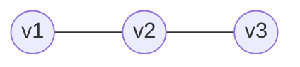

<Callout type="info">
  **이번 문서의 목표:** 이 문서를 다 읽으면 앞으로 나올 모든 편에서 등장하는 논리·집합·함수·그래프 기호를 막힘없이 읽고, 그 기호가 어떤 개념을 가리키는지 바로 떠올릴 수 있다.
</Callout>

## 왜 기호부터 정리해야 하는가

이산수학(discrete mathematics)은 "연속적으로 이어지지 않고 뚝뚝 끊어진(discrete, 이산적인) 대상"을 다루는 수학이다. 정수, 참·거짓, 집합의 원소, 그래프의 정점처럼 하나씩 셀 수 있는 대상이 주인공이다. 이 과목은 미적분처럼 계산 절차를 익히는 것보다 **정확한 논리 전개**가 중요한데, 그 논리 전개는 기호로 압축해서 표현된다. 03편(명제와 논리연산)부터는 $p \land q$, $\forall x$, $A \subseteq B$ 같은 기호가 문장 사이사이에 계속 등장하는데, 이 기호의 뜻을 매번 다시 찾아보면 정작 중요한 논리 흐름을 놓치게 된다.

> **쉽게 말하면:** 이 문서는 이 과목 전체에서 쓸 "단어장"이다. 여기서 기호 하나하나의 뜻을 확실히 익혀 두면, 뒤에 나오는 모든 편을 훨씬 편하게 읽을 수 있다.

이 문서에서는 개념 자체를 깊게 증명하지 않는다. 각 기호가 **무엇을 줄여 쓴 것인지, 어떻게 읽는지, 어느 편에서 자세히 다루는지**만 짚고 넘어간다. 자세한 정의와 계산은 해당 본론 편(03~19편)에서 다시 다룬다.

## 명제와 논리기호 표기

**명제**(proposition)란 참(true) 또는 거짓(false) 가운데 정확히 하나로 판정할 수 있는 문장이다. "3은 소수다"는 참인 명제이고, "3은 짝수다"는 거짓인 명제다. 반면 "오늘 날씨가 좋다"는 사람마다 판단이 달라질 수 있어 명제가 아니다. 이산수학에서는 명제를 매번 긴 문장으로 쓰지 않고 $p$, $q$, $r$ 같은 알파벳 소문자로 줄여 쓴다.

명제와 명제를 연결하는 연산을 **논리연산자**(logical connective, 논리 연결사)라고 하며, 다음 다섯 가지가 기본이다.

| 기호 | 읽는 법 | 이름 | 뜻 |
|------|---------|------|------|
| $\neg p$ | 낫(not) $p$ | 부정 | $p$가 참이면 거짓, 거짓이면 참 |
| $p \land q$ | $p$ 앤드(and) $q$ | 논리곱(conjunction) | $p$와 $q$가 모두 참일 때만 참 |
| $p \lor q$ | $p$ 오어(or) $q$ | 논리합(disjunction) | $p$, $q$ 중 하나라도 참이면 참 |
| $p \rightarrow q$ | $p$ 임플라이즈(implies) $q$ | 조건명제 | $p$가 참인데 $q$가 거짓인 경우만 거짓 |
| $p \leftrightarrow q$ | $p$ 이프앤온리이프(if and only if) $q$ | 쌍조건명제 | $p$와 $q$의 참·거짓이 서로 같을 때 참 |

$p \rightarrow q$는 "$p$이면 $q$이다"라고 읽으며, $p$를 **가정**(hypothesis), $q$를 **결론**(conclusion)이라 부른다. 이 다섯 연산자의 정확한 진리표(truth table, 모든 참·거짓 조합에 대한 결과표)와 법칙은 03편(명제와 논리연산)에서 자세히 다룬다.

명제에 대상을 일반화한 것이 **술어**(predicate)다. "$x$는 짝수다"처럼 변수 $x$가 포함된 문장은 $x$ 값이 정해지기 전까지는 참·거짓을 판정할 수 없으므로 명제가 아니지만, $x$의 범위(정의역, domain)를 정하고 그 범위 전체 혹은 일부에 대한 주장을 하면 다시 참·거짓을 매길 수 있다. 이때 쓰는 기호가 **정량자**(quantifier)다.

| 기호 | 읽는 법 | 이름 | 뜻 |
|------|---------|------|------|
| $\forall x$ | 포올(for all) $x$ | 전칭 정량자 | 정의역의 모든 $x$에 대해 |
| $\exists x$ | 데어 이그지스트(there exists) $x$ | 존재 정량자 | 정의역에 어떤 $x$가 적어도 하나 존재해서 |

예를 들어 $\forall x (x > 0 \rightarrow x^2 > 0)$은 "모든 $x$에 대해, $x$가 0보다 크면 $x$의 제곱도 0보다 크다"는 뜻이다. 술어·정량자의 정확한 사용법과 정량자의 부정(negation)은 04편(술어논리와 정량자)에서 이어서 다룬다.

## 집합 표기와 기본 연산 기호

**집합**(set)은 특정 조건을 만족하는 대상을 하나로 묶어 놓은 것이다. 집합은 보통 알파벳 대문자($A$, $B$, $S$ 등)로 쓰고, 집합에 속한 개별 대상은 **원소**(element)라 부른다. 원소를 일일이 나열하는 방식을 **원소나열법**, 조건을 적어 표현하는 방식을 **조건제시법**(set-builder notation)이라 한다.

$$
A = \{1, 2, 3, 4, 5\}
$$

위 식은 원소나열법으로 쓴 집합이다. 같은 집합을 조건제시법으로 쓰면 다음과 같다.

$$
A = \{x \mid 1 \le x \le 5,\ x \text{는 정수}\}
$$

여기서 $\mid$(수직선)는 "~를 만족하는"이라고 읽으며, 그 뒤에 원소가 지켜야 할 조건을 적는다. 집합과 원소, 집합끼리의 관계를 나타내는 기호는 다음과 같다.

| 기호 | 읽는 법 | 뜻 |
|------|---------|------|
| $x \in A$ | $x$는 $A$의 원소 | $x$가 집합 $A$에 속한다 |
| $x \notin A$ | $x$는 $A$의 원소가 아님 | $x$가 집합 $A$에 속하지 않는다 |
| $A \subseteq B$ | $A$는 $B$의 부분집합 | $A$의 모든 원소가 $B$에도 속한다 |
| $A \subset B$ | $A$는 $B$의 진부분집합 | $A \subseteq B$이면서 $A \ne B$ |
| $\emptyset$ | 공집합 | 원소가 하나도 없는 집합 |
| $\lvert A \rvert$ | $A$의 크기(cardinality, 농도) | 집합 $A$에 속한 원소의 개수 |

집합끼리 새로운 집합을 만드는 연산 기호도 자주 쓰인다.

| 기호 | 읽는 법 | 이름 | 뜻 |
|------|---------|------|------|
| $A \cup B$ | $A$ 유니언(union) $B$ | 합집합 | $A$ 또는 $B$에 속하는 원소 전체 |
| $A \cap B$ | $A$ 인터섹션(intersection) $B$ | 교집합 | $A$와 $B$ 모두에 속하는 원소 전체 |
| $A - B$ | $A$ 마이너스 $B$ | 차집합 | $A$에는 속하지만 $B$에는 속하지 않는 원소 전체 |
| $\overline{A}$ | $A$ 컴플리먼트(complement) | 여집합 | 전체집합 중 $A$에 속하지 않는 원소 전체 |
| $A \times B$ | $A$ 크로스(cross) $B$ | 곱집합(카티션곱) | $A$의 원소와 $B$의 원소를 순서쌍으로 묶은 전체 |

집합의 정의·연산·벤다이어그램은 06편(집합의 기본 개념과 연산)에서, 곱집합은 관계·함수의 기초가 되므로 07편(관계와 함수)에서 이어서 다룬다.

## 수열과 함수 표기

**수열**(sequence)은 순서가 있는 숫자들의 나열이다. $n$번째 항을 $a_n$처럼 아래첨자로 표기하고, 수열 전체는 $\{a_n\}$처럼 중괄호를 씌워 나타낸다. 예를 들어 $a_n = 2n$이면 이 수열은 $2, 4, 6, 8, \dots$처럼 이어진다. 여러 항을 한꺼번에 더할 때는 **시그마**(sigma) 기호 $\sum$을 쓴다.

$$
\sum_{i=1}^{n} a_i = a_1 + a_2 + \cdots + a_n
$$

$\sum_{i=1}^{n} a_i$는 "$i$가 1부터 $n$까지 변할 때 $a_i$를 모두 더하라"는 뜻이다. 곱을 나타낼 때는 같은 방식으로 **파이**(pi) 기호 $\prod$를 쓴다. 수열과 항 사이의 관계를 이전 항으로 정의하는 것이 **점화관계**(recurrence relation)이며, 이는 12~13편(수열과 점화관계, 선형 점화식 풀이)에서 깊게 다룬다.

**함수**(function)는 한 집합의 원소 각각을 다른 집합의 원소 정확히 하나에 대응시키는 규칙이다. $f: A \rightarrow B$는 "함수 $f$는 집합 $A$에서 집합 $B$로 가는 함수다"라고 읽으며, 이때 $A$를 **정의역**(domain), $B$를 **공역**(codomain)이라 부른다. $A$의 원소 $x$가 함수 $f$를 통해 대응되는 $B$의 원소는 $f(x)$로 쓰고 "$f$ 괄호 $x$" 또는 "$x$의 $f$값"이라 읽는다.

| 기호 | 읽는 법 | 뜻 |
|------|---------|------|
| $f: A \rightarrow B$ | $f$는 $A$에서 $B$로 가는 함수 | 정의역 $A$, 공역 $B$인 함수 $f$ |
| $f(x)$ | $f$ 괄호 $x$ | $x$에 대응되는 함숫값 |
| $f \circ g$ | $f$ 합성 $g$ | $g$를 먼저 적용한 뒤 $f$를 적용하는 합성함수 |
| $f^{-1}$ | $f$ 인버스(inverse) | $f$의 역함수 |

함수의 종류(일대일함수, 전사함수, 전단사함수)와 합성·역함수의 정확한 조건은 07편(관계와 함수)에서 다룬다.

## 그래프와 트리에서 쓰는 기본 기호

**그래프**(graph)는 점들과 그 점들을 잇는 선들의 모임이다. 점은 **정점**(vertex, 복수형 vertices), 선은 **간선**(edge)이라 부른다. 그래프 전체는 정점의 집합 $V$와 간선의 집합 $E$의 쌍으로 $G = (V, E)$처럼 표기한다.

| 기호 | 읽는 법 | 뜻 |
|------|---------|------|
| $G = (V, E)$ | 그래프 $G$는 $V$, $E$의 쌍 | 정점 집합 $V$와 간선 집합 $E$로 이루어진 그래프 |
| $(u, v)$ | $u$, $v$ 순서쌍 | 정점 $u$와 $v$를 잇는 간선(방향그래프에서는 $u$에서 $v$로 가는 방향) |
| $\deg(v)$ | 디그리(degree) $v$ | 정점 $v$에 연결된 간선의 개수(차수) |

예를 들어 정점 3개($v_1$, $v_2$, $v_3$)와 간선 2개($v_1$과 $v_2$를 잇는 간선, $v_2$와 $v_3$를 잇는 간선)로 이루어진 그래프는 $V = \{v_1, v_2, v_3\}$, $E = \{(v_1, v_2), (v_2, v_3)\}$로 쓰고, $G = (V, E)$라 나타낸다. 이 그래프에서 $v_2$는 두 간선과 연결되어 있으므로 $\deg(v_2) = 2$다.

**트리**(tree)는 그래프의 특수한 형태로, 사이클(순환로)이 없이 모든 정점이 연결된 그래프다. 나무를 거꾸로 세운 모양과 비슷해서 붙은 이름이며, 맨 위의 정점을 **루트**(root, 뿌리), 자식이 없는 맨 아래 정점을 **리프**(leaf, 잎)라 부른다. 그래프·트리의 정확한 정의, 차수의 성질, 경로·사이클·연결성은 14~15편(그래프의 정의와 기본 성질, Euler/Hamilton 경로와 트리)에서 본격적으로 다룬다.

## 기호 읽기 연습 — 왜 이 순서로 익혀야 하는가

지금까지 나온 기호는 크게 네 갈래(논리, 집합, 함수, 그래프)로 나뉘지만, 실제로는 서로 연결되어 있다. 예를 들어 조건제시법 $\{x \mid P(x)\}$의 $P(x)$ 자리에는 술어가 들어가므로 집합 표기는 논리 표기 위에 세워진다. 함수는 정의역과 공역이라는 두 집합 사이의 대응이므로 집합 표기 위에 세워진다. 그래프의 간선 집합 $E$ 역시 정점의 곱집합 $V \times V$의 부분집합으로 이해할 수 있다. 그러므로 "논리 → 집합 → 함수·관계 → 그래프" 순서로 기호를 익히는 것이 이 과목 전체의 학습 순서와도 일치한다.

> **쉽게 말하면:** 논리 기호가 가장 밑바탕이고, 그 위에 집합 기호, 그 위에 함수·관계 기호, 맨 위에 그래프 기호가 쌓이는 구조다.

## 자주 틀리는 점

- **$\subseteq$와 $\subset$을 같은 기호로 혼동하는 실수**: $A \subseteq B$는 $A$와 $B$가 같아도 성립하지만, $A \subset B$(진부분집합)는 $A$와 $B$가 달라야 성립한다.
- **$\rightarrow$(조건명제)를 "그래서"로 오해하는 실수**: $p \rightarrow q$는 인과관계를 뜻하는 것이 아니라, $p$가 참인데 $q$가 거짓인 경우만 전체가 거짓이 되는 논리적 정의다. 이는 05편(증명 기법)에서 다시 짚는다.
- **$\forall$과 $\exists$의 순서를 바꿔도 뜻이 같다고 오해하는 실수**: $\forall x \exists y\, P(x, y)$와 $\exists y \forall x\, P(x, y)$는 전혀 다른 명제다. 이 차이는 04편에서 예제로 확인한다.
- **차수 $\deg(v)$를 정점의 개수로 오해하는 실수**: $\deg(v)$는 정점 $v$ 하나에 "연결된 간선의 개수"이지, 그래프 전체의 정점 개수가 아니다.

## 핵심 정리

- 명제는 $\neg$, $\land$, $\lor$, $\rightarrow$, $\leftrightarrow$ 다섯 논리연산자로 조합하고, 술어에는 $\forall$(전칭), $\exists$(존재) 정량자를 붙인다.
- 집합은 $\in$, $\subseteq$, $\cup$, $\cap$, $-$, $\overline{\ \cdot\ }$, $\times$ 기호로 원소·부분집합 관계와 연산을 표현한다.
- 수열은 $a_n$, $\sum$으로, 함수는 $f: A \rightarrow B$, $f(x)$, $f \circ g$, $f^{-1}$로 표기한다.
- 그래프는 $G = (V, E)$, 간선 $(u, v)$, 차수 $\deg(v)$로 표기하며, 트리는 사이클이 없는 연결 그래프다.
- 이 네 갈래 기호는 "논리 위에 집합, 집합 위에 함수·관계, 그 위에 그래프"라는 순서로 쌓여 있어, 이 과목의 학습 순서와 일치한다.

## 마무리 복습

<Quiz
  questionNumber={1}
  question="논리연산자 기호와 뜻을 짝지은 것으로 옳지 않은 것은?"
  options={['neg p는 p의 부정을 나타낸다', 'p and q는 p와 q가 모두 참일 때만 참이다', 'p or q는 p, q가 모두 거짓일 때만 참이다', 'p if and only if q는 p와 q의 참·거짓이 서로 같을 때 참이다']}
  correctAnswer={3}
  explanation="논리합(p or q)은 p, q 중 하나라도 참이면 참이 되는 연산이다. 둘 다 거짓일 때만 참이라는 설명은 반대로 뒤바뀐 오답이다."
  optionExplanations={['neg p는 부정 연산이 맞다.', 'and는 논리곱으로, 둘 다 참일 때만 참이 맞다.', '옳지 않은 설명을 고르는 문제의 정답이다. or는 하나라도 참이면 참이지, 둘 다 거짓일 때만 참인 것이 아니다.', 'if and only if는 쌍조건명제로, 양쪽의 참·거짓이 일치할 때 참이 맞다.']}
/>

<Quiz
  questionNumber={2}
  question="집합 A가 집합 B의 진부분집합(A subset B)일 조건으로 옳은 것은?"
  options={['A의 모든 원소가 B에 속하기만 하면 된다', 'A와 B가 같은 집합이어야 한다', 'A의 모든 원소가 B에 속하면서 A와 B가 서로 다른 집합이어야 한다', 'A와 B에 공통 원소가 하나도 없어야 한다']}
  correctAnswer={3}
  explanation="진부분집합은 A의 모든 원소가 B에 속하는 부분집합 관계이면서, 동시에 A와 B가 서로 같지 않아야 성립한다. 조건 두 가지가 함께 필요하다."
  optionExplanations={['그 조건만으로는 A subseteq B(부분집합)까지만 성립하고, 진부분집합에는 A와 B가 달라야 한다는 조건이 하나 더 필요하다.', 'A와 B가 같으면 오히려 진부분집합이 아니게 된다.', '정답. 부분집합이면서 서로 다른 집합이어야 진부분집합이다.', '공통 원소가 없는 것은 서로소 관계이지 부분집합 관계와는 무관하다.']}
/>

<Quiz
  questionNumber={3}
  question="다음 중 함수 표기 f circ g (f 합성 g)에 대한 설명으로 옳은 것은?"
  options={['g를 먼저 적용한 뒤 그 결과에 f를 적용한다', 'f를 먼저 적용한 뒤 그 결과에 g를 적용한다', 'f와 g를 동시에 적용해 두 값을 더한다', 'f의 역함수를 구한 뒤 g를 적용한다']}
  correctAnswer={1}
  explanation="합성함수 f circ g는 오른쪽에 있는 g를 먼저 적용하고, 그 결과값에 왼쪽의 f를 적용하는 순서로 계산한다."
  optionExplanations={['정답. 오른쪽부터 왼쪽 순서로 적용하는 것이 합성함수의 정의다.', '적용 순서가 반대로 뒤바뀐 오답이다.', '합성함수는 더하기 연산이 아니라 함수를 이어서 적용하는 연산이다.', '역함수는 별도의 기호(f의 -1 제곱)로 표기하며 합성과는 다른 연산이다.']}
/>

<Quiz
  questionNumber={4}
  question="그래프 G = (V, E)에서 정점 v에 연결된 간선의 개수를 나타내는 기호는?"
  options={['V(v)', 'E(v)', 'deg(v)', 'v times v']}
  correctAnswer={3}
  explanation="정점에 연결된 간선의 개수는 차수(degree)라 부르며 deg(v)로 표기한다."
  optionExplanations={['V는 정점 집합 전체를 가리키는 기호로, 정점 하나의 차수를 나타내지 않는다.', 'E는 간선 집합 전체를 가리키는 기호로, 특정 정점의 차수를 나타내는 표기가 아니다.', '정답. deg(v)는 정점 v에 연결된 간선의 개수를 뜻한다.', 'v times v는 곱집합 표기의 일부로, 차수와는 관련이 없다.']}
/>

<Quiz
  questionNumber={5}
  question="정량자 forall x와 exists x에 대한 설명으로 옳은 것은?"
  options={['forall x는 정의역에 그런 x가 하나라도 존재한다는 뜻이다', 'exists x는 정의역의 모든 x에 대해 성립한다는 뜻이다', 'forall x와 exists x는 서로 바꿔 써도 뜻이 같다', 'forall x는 정의역의 모든 x에 대해, exists x는 그런 x가 적어도 하나 존재한다는 뜻이다']}
  correctAnswer={4}
  explanation="forall x(전칭 정량자)는 정의역의 모든 원소에 대해 성립함을, exists x(존재 정량자)는 그런 원소가 적어도 하나 존재함을 뜻한다. 두 정량자의 순서를 바꾸면 명제의 의미 자체가 달라질 수 있다."
  optionExplanations={['설명이 forall과 exists의 뜻이 서로 바뀌어 있다.', '설명이 forall과 exists의 뜻이 서로 바뀌어 있다.', '두 정량자를 나열하는 순서에 따라 명제의 뜻이 달라질 수 있으므로 항상 바꿔 써도 되는 것은 아니다.', '정답. forall은 전체, exists는 존재 하나 이상을 뜻하는 서로 다른 정량자다.']}
/>

<Quiz
  questionNumber={6}
  question="집합 연산 A union B와 A intersection B에 대한 설명으로 옳지 않은 것은?"
  options={['A union B는 A 또는 B에 속하는 원소 전체를 뜻한다.', 'A intersection B는 A와 B 모두에 속하는 원소 전체를 뜻한다.', 'A times B는 A의 원소와 B의 원소를 순서쌍으로 묶은 집합이다.', 'A와 B의 교집합은 항상 A와 B의 합집합보다 원소 개수가 많다.']}
  correctAnswer={4}
  explanation="교집합의 모든 원소는 합집합에도 속하므로 교집합의 원소 개수는 합집합의 원소 개수보다 많을 수 없다. 항상 더 많다는 설명은 옳지 않다."
  optionExplanations={['옳은 설명이다. 합집합은 A 또는 B에 속하는 원소 전체다.', '옳은 설명이다. 교집합은 A와 B 모두에 속하는 원소 전체다.', '옳은 설명이다. 곱집합은 두 집합의 원소를 순서쌍으로 묶은 것이다.', '정답. 교집합은 합집합의 부분집합이므로 교집합의 원소 개수가 합집합보다 항상 많을 수는 없다.']}
/>

<Quiz
  questionNumber={7}
  question="그래프의 특수한 형태인 트리에 대한 설명으로 옳지 않은 것은?"
  options={['트리는 사이클 없이 모든 정점이 연결된 그래프다.', '트리에서 맨 위의 정점을 루트라고 부른다.', '트리에서 자식이 없는 맨 아래 정점을 리프라고 부른다.', '트리는 반드시 사이클을 포함해야 성립하는 그래프다.']}
  correctAnswer={4}
  explanation="트리는 사이클(순환로)이 없이 모든 정점이 연결된 그래프로 정의되므로, 사이클을 반드시 포함해야 한다는 설명은 정의와 반대된다."
  optionExplanations={['옳은 설명이다. 트리는 사이클이 없는 연결 그래프로 정의된다.', '옳은 설명이다. 트리의 맨 위 정점을 루트라 부른다.', '옳은 설명이다. 자식이 없는 맨 아래 정점을 리프라 부른다.', '정답. 트리는 사이클이 없어야 성립하는 그래프이므로 이 설명은 정의와 반대다.']}
/>

## 참고 자료

- [국가평생교육진흥원 독학학위제 - 이산수학 출제기준](https://bdes.nile.or.kr) — 이 과목에서 다루는 논리·집합·함수·그래프 기호 체계가 어느 출제 항목에 대응하는지 확인할 수 있는 공식 자료.
