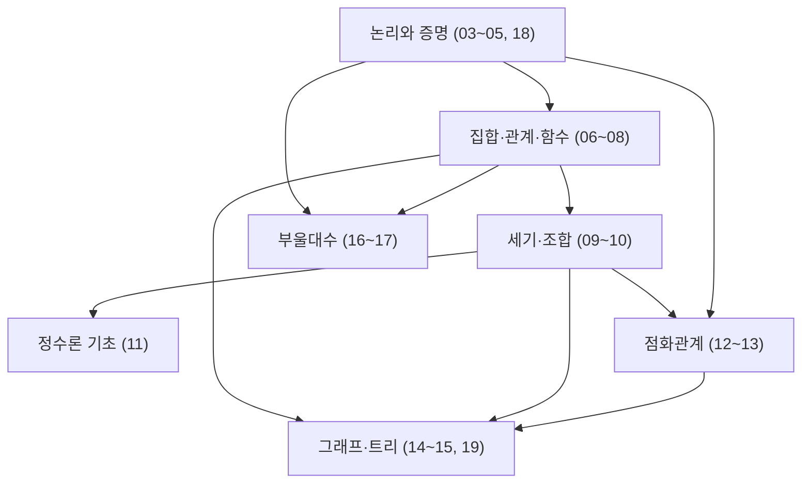

<Callout type="info">
  **이번 문서의 목표:** 이 문서를 다 읽으면 독학사 2단계 이산수학 시험의 형식을 설명하고, 출제기준 항목이 이 시리즈의 어느 편에 대응하는지 파악하며, 남은 24개 편을 어떤 순서·전략으로 공부할지 계획할 수 있다.
</Callout>

## 왜 공부를 시작하기 전에 시험 구조부터 봐야 하는가

01편에서 기호를 정리했으니 바로 03편(명제와 논리연산)으로 들어가고 싶겠지만, 그 전에 "이 시험이 정확히 어떤 형식이고, 어느 단원에 점수가 몰려 있는지"를 알아야 한다. 이걸 모르고 공부하면, 출제 비중이 낮은 단원에 시간을 지나치게 쓰거나, 반대로 자주 나오는 증명 유형을 소홀히 하는 실수를 할 수 있다. 독학사는 대학 학위를 인정하는 국가시험이라 매 회차 공고에 따라 세부 사항(문항 수, 배점, 시험 시간)이 달라질 수 있으므로, 이 문서에서 제시하는 숫자는 **일반적인 독학사 시험 형식을 기준으로 한 안내**이며, 실제 응시 전에는 반드시 국가평생교육진흥원의 최신 공고를 확인해야 한다.

> **쉽게 말하면:** 이 문서는 "무엇을, 얼마나, 어떤 순서로 공부해야 하는가"에 대한 답을 미리 정해 두는 지도(map)다.

## 독학사 2단계 시험의 형태와 문항 구성

독학사(독학에 의한 학위취득시험, 국가평생교육진흥원 주관)는 대학에 다니지 않아도 학사 학위를 취득할 수 있도록 단계별 시험을 거치는 제도다. 2단계는 전공 기초 과정에 해당하며, 이산수학은 정보·컴퓨터 계열 등에서 2단계 전공 과목으로 채택된다.

일반적으로 독학사 2단계 시험은 **객관식(사지선다형) 문항으로만 구성**되며, 한 과목당 **정해진 시험 시간 안에 일정 문항 수**를 풀어야 한다. 문항 수와 시험 시간, 합격 기준(과목별 60점 이상 등)은 회차 공고마다 세부 조정이 있을 수 있으므로 **공고 확인 필요**하다는 점을 다시 강조한다. 이 시리즈에서는 이런 공고 의존적인 숫자 대신, 변하지 않는 것 — **출제기준 항목의 구조와 상대적 비중**에 집중해서 학습 전략을 짠다.

> **쉽게 말하면:** "몇 문제인지, 몇 분인지"는 공고마다 조금씩 달라질 수 있지만, "논리·집합·조합·그래프 중 어디에 비중이 크게 실리는가"라는 구조는 크게 바뀌지 않는다.

## 출제기준 항목을 이 시리즈 편에 대응시키기

국가평생교육진흥원이 공개하는 이산수학 출제기준은 보통 다음과 같은 큰 항목으로 나뉜다. 각 항목이 이 시리즈의 몇 편에 대응하는지 표로 정리했다.

| 출제기준 항목 | 대응 편 | 핵심 내용 |
|---------------|---------|-----------|
| 논리와 증명 | 03–05, 18 | 명제·술어논리, 정량자, 직접·대우·모순·귀납법 증명 |
| 집합·관계·함수 | 06–08 | 집합 연산, 관계의 성질(동치·순서), 함수의 분류 |
| 세기·조합 | 09–10 | 순열·조합, 이항정리, 포함배제원리, 비둘기집 원리 |
| 정수론 기초 | 11 | 나눗셈 알고리즘, 최대공약수, 유클리드 알고리즘, 합동 |
| 점화관계 | 12–13 | 점화식 정의, 특성방정식을 이용한 선형 점화식 풀이 |
| 그래프·트리 | 14–15, 19 | 그래프 기본 성질, Euler/Hamilton 경로, 트리·스패닝 트리 |
| 부울대수 | 16–17 | 부울대수의 공리·법칙, 논리회로, 카르노 맵 |

이 대응표를 보면, 출제기준의 7개 큰 항목이 이 시리즈의 03~19편(본론 17개 편)에 고르게 흩어져 있는 것을 알 수 있다. 20~26편(기출·모의)은 이 7개 항목을 다시 종합해서 연습하는 자리다.

이 관계도가 보여주는 것은, **논리와 증명(03~05)이 사실상 모든 다른 항목의 기초**라는 점이다. 집합의 성질을 증명하거나, 조합 공식을 유도하거나, 그래프의 정리를 증명할 때 결국 03~05편에서 배우는 증명 기법을 그대로 쓰기 때문이다. 그래서 이 시리즈는 논리·증명을 본론 맨 앞에 집중 배치했다.

## 단원별 비중과 난이도 개괄

일반적인 이산수학 교과 과정과 독학사 유사 과목의 출제 경향을 참고하면, 단원별 체감 난이도와 변별력은 대략 다음과 같은 경향을 보인다. 이 역시 회차마다 달라질 수 있는 **상대적인 경향**으로 받아들여야 한다.

| 영역 | 개념 난이도 | 계산·증명 부담 | 자주 나오는 함정 |
|------|-------------|-----------------|-------------------|
| 논리·증명 | 중간 | 증명 서술 부담 큼 | 조건명제의 참·거짓 판정, 귀납법 단계 누락 |
| 집합·관계·함수 | 중간 | 성질 판정 계산 있음 | 동치관계 조건 중 하나만 확인하고 넘어감 |
| 세기·조합 | 중간–높음 | 공식 적용·중복 계산 부담 | 포함배제에서 교집합 항 누락, 순열·조합 혼동 |
| 정수론 | 낮음–중간 | 유클리드 알고리즘 반복 계산 | 최대공약수·최소공배수 공식 혼동 |
| 점화관계 | 높음 | 특성방정식 풀이 부담 큼 | 중근일 때 일반해 형태를 틀림 |
| 그래프·트리 | 높음 | 정리 적용·반례 확인 부담 | 차수 합 공식과 간선 수 관계를 혼동 |
| 부울대수 | 중간 | 대수적 변환 단계 부담 | 법칙 이름을 잘못 적용해 잘못 간소화 |

이 표에서 특히 눈여겨볼 것은 **점화관계와 그래프·트리가 "높음"으로 표시된 이유**다. 두 영역 모두 앞선 논리·조합·정수론 개념을 종합적으로 활용해야 풀리는 문제가 많아서, 단순 암기로는 대응이 안 되고 여러 번 손으로 풀어 보며 감을 쌓아야 한다. 이 시리즈가 19편(세기·그래프·점화가 얽힌 종합 증명·계산)을 별도로 마련한 이유이기도 하다.

## 학습·복습·기출 회독 전략

이 시리즈 26편을 다음과 같은 3단계 전략으로 회독할 것을 권장한다.

<Steps>
1. **1회독 — 본론 개념 정리(03~19편)**: 정의·정리를 눈으로만 읽지 말고, 각 편의 "작은 예시"와 "계산·적용" 부분을 손으로 직접 풀어 본다. 증명은 한 줄씩 따라 쓰면서 어느 단계에서 어떤 법칙을 썼는지 표시한다.
2. **2회독 — 단원별 연습(21~24편)**: 1회독에서 헷갈렸던 단원을 우선순위로 삼아 연습문제를 푼다. 틀린 문제는 정답만 확인하지 말고, 01편의 기호나 03~05편의 증명 기법 중 어느 것이 부족했는지 원인을 짚는다.
3. **3회독 — 출제 경향 점검과 모의고사(20, 25~26편)**: 20편에서 자주 나오는 함정을 다시 확인한 뒤, 25편(모의고사 1)을 실제 시험처럼 시간을 재고 풀고, 오답을 분석한 다음 26편(모의고사 2, 난이도를 조금 높인 버전)으로 마무리한다.
</Steps>

> **쉽게 말하면:** "개념 정리 → 단원별 약점 보완 → 실전 모의고사" 순서로 세 번 훑으면, 새 개념을 배우는 시간과 실수를 줄이는 시간이 균형 있게 배분된다.

이 전략에서 중요한 것은 **1회독을 서두르지 않는 것**이다. 01_학습방향에서 밝혔듯, 이 시리즈는 개념 정리에 40퍼센트(40%), 유형 문제 풀이에 35퍼센트(35%), 기출 해설·시험 전략에 25퍼센트(25%)의 비중을 두도록 설계되어 있다. 1회독에서 증명 기법과 관계의 성질을 확실히 잡아 두지 않으면, 뒤의 점화식·그래프 단원에서 같은 증명 기법을 다시 설명받아야 하는 비효율이 생긴다.

## 자주 틀리는 점

- **문항 수·시험 시간을 특정 숫자로 암기하고 안심하는 실수**: 회차 공고마다 달라질 수 있으므로, 응시 직전에는 반드시 국가평생교육진흥원의 최신 공고로 재확인해야 한다(공고 확인 필요).
- **출제기준 항목을 순서 없이 아무 편이나 골라 공부하는 실수**: 논리·증명(03~05)을 건너뛰고 그래프·점화식부터 공부하면, 정작 그 안에 있는 증명 단계를 이해하지 못해 다시 앞으로 돌아와야 한다.
- **1회독에서 모든 문제를 완벽히 풀려고 시간을 지나치게 쓰는 실수**: 1회독의 목적은 "개념과 증명 흐름을 익히는 것"이지 "모든 문제를 맞히는 것"이 아니다. 완성도는 2·3회독에서 끌어올린다.
- **모의고사를 채점만 하고 오답 분석을 생략하는 실수**: 25~26편은 점수 확인용이 아니라, 어떤 단원의 어떤 함정에 반복해서 걸리는지 확인하는 진단 도구로 써야 한다.

## 핵심 정리

- 독학사 2단계 이산수학은 객관식 중심의 국가시험이며, 문항 수·시험 시간·합격 기준은 회차 공고를 반드시 재확인해야 한다(공고 확인 필요).
- 출제기준의 7개 큰 항목(논리와 증명, 집합·관계·함수, 세기·조합, 정수론 기초, 점화관계, 그래프·트리, 부울대수)은 이 시리즈의 03~19편에 대응한다.
- 논리와 증명(03~05편)은 다른 모든 항목의 기초이므로, 본론 맨 앞에서 먼저 확실히 다진다.
- 점화관계와 그래프·트리는 여러 개념을 종합해야 하는 만큼 체감 난이도가 높아, 19편(종합 증명·계산)에서 다시 다룬다.
- 학습은 "개념 정리(1회독) → 단원별 연습(2회독) → 모의고사(3회독)" 순서로 진행하는 것을 권장한다.

## 마무리 복습

<Quiz
  questionNumber={1}
  question="독학사 2단계 이산수학 시험의 일반적인 형식에 대한 설명으로 옳은 것은?"
  options={['서술형 문항으로만 구성된다', '객관식(사지선다형) 문항으로 구성되며, 세부 문항 수·시험 시간은 회차 공고를 확인해야 한다', '문항 수와 시험 시간은 모든 회차에서 항상 동일하게 고정되어 있다', '합격 기준이 없어 응시만 하면 학점이 인정된다']}
  correctAnswer={2}
  explanation="독학사 2단계 시험은 일반적으로 객관식 문항으로 구성되며, 정확한 문항 수·시험 시간·합격 기준은 회차 공고마다 달라질 수 있어 응시 전 공고 확인이 필요하다."
  optionExplanations={['독학사 2단계는 서술형이 아니라 객관식 중심으로 구성된다.', '정답. 객관식 중심이며 세부 사항은 공고 확인이 필요하다.', '세부 문항 수·시간은 회차 공고에 따라 달라질 수 있어 항상 고정이라고 단정할 수 없다.', '독학사는 과목별로 정해진 합격 기준(예: 60점 이상)을 만족해야 학점이 인정되는 시험이다.']}
/>

<Quiz
  questionNumber={2}
  question="출제기준 항목 중 '논리와 증명'이 이 시리즈에서 본론 맨 앞에 배치된 이유로 가장 적절한 것은?"
  options={['논리와 증명은 시험 배점이 가장 낮아서 먼저 끝내 두기 위해서다', '논리와 증명에서 배우는 증명 기법이 집합·조합·그래프 등 다른 항목의 기초로 반복 사용되기 때문이다', '논리와 증명은 다른 항목과 전혀 연결되지 않는 독립적인 주제이기 때문이다', '논리와 증명은 계산이 전혀 없는 암기 과목이기 때문이다']}
  correctAnswer={2}
  explanation="집합의 성질을 증명하거나 조합 공식을 유도하거나 그래프 정리를 증명할 때 모두 논리·증명 단원에서 배우는 직접·대우·모순·귀납법 증명 기법을 그대로 활용하므로, 이를 먼저 다지는 것이 뒤 단원 학습을 효율적으로 만든다."
  optionExplanations={['배점의 높낮이가 아니라 다른 단원의 기초가 된다는 점이 배치 이유다.', '정답. 증명 기법이 다른 모든 항목에서 반복 사용되는 기초이기 때문이다.', '오히려 논리·증명은 다른 모든 항목과 강하게 연결되어 있다.', '논리와 증명 역시 조건명제 판정, 귀납법 단계 전개 등 계산·서술 부담이 있는 단원이다.']}
/>

<Quiz
  questionNumber={3}
  question="이 시리즈가 권장하는 3단계 회독 전략의 순서로 옳은 것은?"
  options={['모의고사 채점 -> 개념 정리 -> 단원별 연습', '개념 정리(1회독) -> 단원별 연습(2회독) -> 모의고사(3회독)', '단원별 연습 -> 모의고사 -> 개념 정리', '기출 경향 점검만 하고 나머지는 생략']}
  correctAnswer={2}
  explanation="이 시리즈는 본론 개념 정리를 먼저 다진 뒤, 단원별 연습으로 약점을 보완하고, 마지막으로 모의고사로 실전 감각을 점검하는 순서를 권장한다."
  optionExplanations={['모의고사를 개념 정리보다 먼저 채점하는 순서는 이 시리즈가 권장하는 흐름과 반대다.', '정답. 개념 정리 -> 단원별 연습 -> 모의고사 순서가 권장 전략이다.', '단원별 연습과 모의고사의 순서가 뒤바뀐 오답이다.', '기출 경향 점검(20편)은 3단계 전략의 일부일 뿐, 나머지 단계를 생략해도 된다는 뜻이 아니다.']}
/>

<Quiz
  questionNumber={4}
  question="이 문서에서 점화관계와 그래프·트리 영역의 체감 난이도가 높다고 설명한 이유는?"
  options={['해당 영역이 출제기준에서 아예 제외되어 있기 때문이다', '두 영역 모두 앞선 논리·조합·정수론 개념을 종합적으로 활용해야 풀리는 문제가 많기 때문이다', '두 영역은 계산이 전혀 없고 단순 암기만 요구하기 때문이다', '독학사 시험에는 두 영역 문제가 출제된 적이 한 번도 없기 때문이다']}
  correctAnswer={2}
  explanation="점화관계와 그래프·트리는 논리·증명, 조합, 정수론 등 앞선 개념을 종합적으로 사용해야 풀리는 문제가 많아 단순 암기로 대응하기 어렵고, 그만큼 체감 난이도가 높다."
  optionExplanations={['이 시리즈는 두 영역을 출제기준에 대응하는 본론 단원(12~13, 14~15, 19편)으로 명시하고 있다.', '정답. 여러 앞선 개념을 종합해야 풀리는 문제가 많아 난이도가 높게 느껴진다.', '점화식의 특성방정식 풀이나 그래프의 차수·경로 계산처럼 계산 부담이 오히려 큰 영역이다.', '이 시리즈는 두 영역을 독학사 출제기준 항목으로 명시하고 있어, 출제되지 않는다고 단정할 수 없다.']}
/>

<Quiz
  questionNumber={5}
  question="출제기준 항목 '세기·조합'이 이 시리즈에서 대응하는 편으로 옳은 것은?"
  options={['03–05, 18편', '06–08편', '09–10편', '14–15, 19편']}
  correctAnswer={3}
  explanation="출제기준 항목 세기·조합(순열·조합, 이항정리, 포함배제원리, 비둘기집 원리)은 이 시리즈의 09–10편에 대응한다."
  optionExplanations={['03–05, 18편은 논리와 증명 항목이 대응하는 편이다.', '06–08편은 집합·관계·함수 항목이 대응하는 편이다.', '정답. 세기·조합 항목은 09–10편에 대응한다.', '14–15, 19편은 그래프·트리 항목이 대응하는 편이다.']}
/>

<Quiz
  questionNumber={6}
  question="다음 중 정수론 기초 영역에 대한 설명으로 가장 적절한 것은?"
  options={['개념 난이도가 낮음–중간이며 유클리드 알고리즘 반복 계산이 부담이 될 수 있다.', '개념 난이도가 가장 높아 이 시리즈에서 가장 먼저 다뤄진다.', '자주 나오는 함정은 정량자의 순서를 바꾸는 것이다.', '정수론 기초는 출제기준에 포함되지 않는 영역이다.']}
  correctAnswer={1}
  explanation="정수론 기초는 개념 난이도가 낮음–중간이며, 유클리드 알고리즘의 반복 계산과 최대공약수·최소공배수 공식 혼동이 자주 나오는 함정으로 정리되어 있다."
  optionExplanations={['정답. 정수론 기초는 낮음–중간 난이도이며 유클리드 알고리즘 반복 계산이 부담이 될 수 있다.', '난이도가 가장 높은 영역은 점화관계와 그래프·트리이며, 정수론 기초는 11편에서 다뤄진다.', '정량자 순서 관련 함정은 논리와 증명 영역에서 다루는 내용이다.', '정수론 기초는 출제기준의 7개 큰 항목 중 하나로 명시되어 11편에 대응한다.']}
/>

<Quiz
  questionNumber={7}
  question="이 시리즈가 설계한 학습 비중 배분으로 옳은 것은?"
  options={['개념 정리 40퍼센트, 유형 문제 풀이 35퍼센트, 기출 해설·시험 전략 25퍼센트', '개념 정리 25퍼센트, 유형 문제 풀이 40퍼센트, 기출 해설·시험 전략 35퍼센트', '개념 정리와 유형 문제 풀이 비중이 각각 50퍼센트씩이며 기출 해설은 다루지 않는다', '세 영역의 비중이 모두 동일하게 33퍼센트씩이다']}
  correctAnswer={1}
  explanation="이 시리즈는 개념 정리에 40퍼센트, 유형 문제 풀이에 35퍼센트, 기출 해설·시험 전략에 25퍼센트의 비중을 두도록 설계되어 있다."
  optionExplanations={['정답. 개념 정리 40퍼센트, 유형 문제 풀이 35퍼센트, 기출 해설·시험 전략 25퍼센트가 이 시리즈의 설계 비중이다.', '비중 수치가 서로 뒤바뀐 오답이다.', '기출 해설·시험 전략도 25퍼센트의 비중으로 다루어지며 생략되지 않는다.', '세 영역은 동일한 비중이 아니라 40퍼센트, 35퍼센트, 25퍼센트로 차등 배분되어 있다.']}
/>

## 참고 자료

- [국가평생교육진흥원 독학학위제 - 과목별 평가영역](https://bdes.nile.or.kr) — 이산수학을 포함한 과목별 출제기준·평가영역을 확인하는 공식 페이지. 시험 형식·문항 수·시간은 이곳의 최신 공고로 재확인해야 한다.
- [국가평생교육진흥원 독학학위제 - 독학학위제 안내](https://bdes.nile.or.kr) — 응시 자격, 시험 단계 구성, 합격 기준 등 제도 전반을 안내하는 공식 자료.
