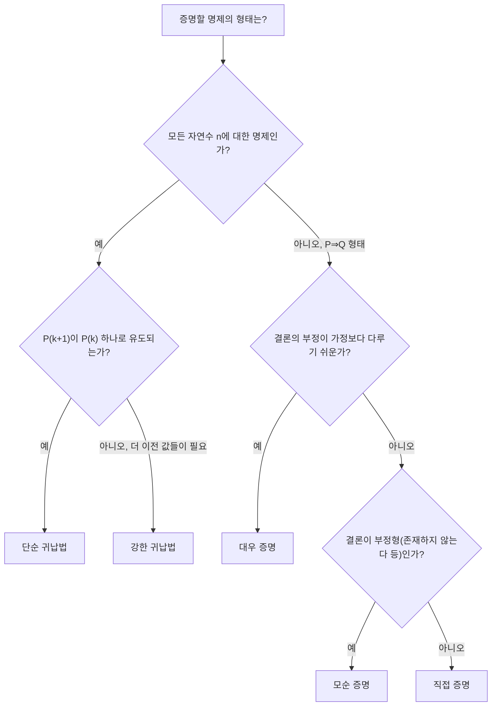

<Callout type="info">
  **이번 문서의 목표:** 이 문서를 다 읽으면 직접 증명, 대우 증명, 모순 증명, 수학적 귀납법(단순·강한 귀납)의 구조를 구분하고, 주어진 명제에 어떤 증명법이 적합한지 골라 실제로 서술형 답안을 작성할 수 있다.
</Callout>

## 왜 "증명 기법"을 따로 배우는가

03편에서 다룬 명제논리와 04편에서 다룬 술어논리·정량자는 명제가 참인지 거짓인지 **판별**하는 도구였다. 그런데 독학사 이산수학은 판별을 넘어, "이 명제가 참임을 논리적으로 보여라"라는 **증명**(proof) 문제를 반드시 낸다. 증명은 답만 맞히는 것이 아니라, 답에 이르는 **논리의 사슬**을 빠짐없이 서술해야 점수를 받는 서술형 유형이기 때문에, 정해진 틀(증명 기법)을 모르면 아무리 답이 맞아도 감점된다.

> **쉽게 말하면:** 증명 기법은 "왜 이 명제가 참인지"를 채점자가 납득할 수 있는 정해진 순서로 풀어내는 글쓰기 양식이다.

이 문서에서 다루는 네 가지 기법 — 직접 증명, 대우 증명, 모순 증명, 수학적 귀납법 — 은 모두 "$P \Rightarrow Q$" 꼴(조건문, $P$이면 $Q$이다) 또는 "모든 자연수 $n$에 대해 $P(n)$이다" 꼴의 명제를 다룬다. $\Rightarrow$(임플리케이션, implication)는 04편에서 다룬 조건문 기호이며, "왼쪽이 참이면 오른쪽도 참이다"를 뜻한다.

## 직접 증명 — 가정에서 결론까지 한 줄씩

**직접 증명**(direct proof)은 "$P$이면 $Q$이다"를 보이기 위해, **$P$가 참이라고 가정한 뒤** 이미 알려진 정의·정리·앞 단계의 결과를 순서대로 적용해 **$Q$가 참임을 끌어내는** 방법이다. 가장 기본적이고 가장 많이 쓰이는 증명법이다.

> **쉽게 말하면:** "출발점(가정)에서 목적지(결론)까지 다리를 하나씩 놓아 건너가는" 증명이다.

### 예제 — 정수의 합과 짝수

**명제:** 두 짝수의 합은 짝수다.

서술형 답안은 다음과 같이 한 줄씩 쓴다.

1. **가정**: $m$, $n$을 임의의 짝수라 하자.
2. **정의 적용**: 짝수의 정의에 따라, 어떤 정수 $k$에 대해 $m = 2k$로 쓸 수 있고, 어떤 정수 $j$에 대해 $n = 2j$로 쓸 수 있다.
3. **대입**: 두 식을 더하면 $m + n = 2k + 2j$이다.
4. **정리**: 우변을 묶으면 $m + n = 2(k + j)$이다.
5. **결론**: $k + j$는 정수이므로, $m + n$은 "2 곱하기 어떤 정수" 꼴이다. 짝수의 정의에 의해 $m + n$은 짝수다. 따라서 두 짝수의 합은 짝수다. $\blacksquare$($\blacksquare$는 증명 종료를 나타내는 기호로 "증명 끝"이라고 읽는다.)

$$
m + n = 2k + 2j = 2(k+j)
$$

- $m, n$: 짝수라고 가정한 두 정수
- $k, j$: $m = 2k$, $n = 2j$를 만족하는 정수(짝수의 정의에서 나온 매개변수)

> **자주 틀리는 점:** "짝수는 2로 나누어떨어지는 수"라고만 말하고 $m = 2k$ 형태로 **기호화하지 않은 채** 증명을 진행하면, 다음 줄에서 대수적으로 계산할 방법이 없다. 정의를 반드시 기호(변수)로 바꿔야 다음 단계로 넘어갈 수 있다.

### 예제 — 홀수의 제곱

**명제:** $n$이 홀수이면 $n^2$도 홀수다.

1. **가정**: $n$을 임의의 홀수라 하자.
2. **정의 적용**: 홀수의 정의에 따라, 어떤 정수 $k$에 대해 $n = 2k + 1$로 쓸 수 있다.
3. **대입**: $n^2 = (2k+1)^2$이다.
4. **전개**: $(2k+1)^2 = 4k^2 + 4k + 1$이다.
5. **정리**: $4k^2 + 4k + 1 = 2(2k^2 + 2k) + 1$이다.
6. **결론**: $2k^2 + 2k$는 정수이므로, $n^2$은 "2 곱하기 어떤 정수 더하기 1" 꼴이다. 홀수의 정의에 의해 $n^2$은 홀수다. $\blacksquare$

$$
n^2 = (2k+1)^2 = 4k^2 + 4k + 1 = 2(2k^2+2k)+1
$$

- $n$: 홀수라고 가정한 정수
- $k$: $n = 2k+1$을 만족하는 정수

## 대우 증명 — 뒤집어서 접근하기

**대우**(contrapositive)는 04편에서 다룬 조건문의 변형 중 하나로, "$P \Rightarrow Q$"의 대우는 "$\lnot Q \Rightarrow \lnot P$"(Q가 아니면 P가 아니다)이며, 원래 명제와 **항상 같은 참·거짓 값**을 가진다(논리적 동치, logically equivalent). **대우 증명**(proof by contrapositive)은 원래 명제 $P \Rightarrow Q$를 직접 증명하기 어려울 때, 그 대우 $\lnot Q \Rightarrow \lnot P$를 대신 직접 증명하는 방법이다.

> **쉽게 말하면:** "정면으로 뚫기 어려운 문제는 뒤집어서(결론의 반대에서 출발해서) 풀어라"는 전략이다.

대우 증명이 유리한 경우는 결론 $Q$를 부정한 형태($\lnot Q$)가 가정으로 쓰기에 훨씬 다루기 쉬운 형태로 바뀔 때다. 대표적으로 "~이 아니면"이라는 부정 표현을 가정으로 삼는 것보다, 그 부정의 부정(원래 형태)을 가정으로 삼는 편이 대수적으로 계산하기 쉬운 경우다.

### 예제 — 제곱이 짝수이면 원래 수도 짝수

**명제:** 정수 $n$에 대해 $n^2$이 짝수이면 $n$도 짝수다.

이 명제를 직접 증명하려 하면 "$n^2 = 2k$이다"라는 가정에서 $n$이 짝수라는 결론까지 끌어내기가 까다롭다($n = \sqrt{2k}$ 형태는 정수론적으로 다루기 어렵다). 대신 대우를 취한다.

**원래 명제**: $P$: $n^2$이 짝수다. $Q$: $n$이 짝수다. ($P \Rightarrow Q$)

**대우 명제**: $\lnot Q \Rightarrow \lnot P$, 즉 "$n$이 홀수이면 $n^2$도 홀수다."

이 대우 명제는 바로 앞 절에서 직접 증명으로 이미 보였다. 따라서 서술형 답안은 다음과 같이 정리한다.

1. **전략 명시**: 원래 명제의 대우인 "$n$이 홀수이면 $n^2$이 홀수다"를 증명하면 충분하다(원래 명제와 대우는 논리적으로 동치이기 때문이다).
2. **가정**: $n$을 임의의 홀수라 하자.
3. **정의 적용**: $n = 2k + 1$ (어떤 정수 $k$)로 쓸 수 있다.
4. **전개**: $n^2 = 4k^2 + 4k + 1 = 2(2k^2+2k) + 1$이다.
5. **결론**: $n^2$은 홀수다. 이는 대우 명제가 참임을 보인 것이므로, 원래 명제 "$n^2$이 짝수이면 $n$도 짝수다" 역시 참이다. $\blacksquare$

> **자주 틀리는 점:** 대우 증명과 이후에 배울 모순 증명을 혼동하는 경우가 많다. 대우 증명은 **결론을 부정해 새로운 명제($\lnot Q \Rightarrow \lnot P$)를 만들어 직접 증명**하는 것이고, 모순 증명은 **원래 명제 전체를 부정한 뒤 모순을 찾는 것**이다. 서술형 답안에서 "대우를 취하면" 이라고 썼는지 "모순을 가정하면"이라고 썼는지가 채점 기준에서 다르게 취급된다.

## 모순 증명 — 반대를 가정해서 무너뜨리기

**모순 증명**(proof by contradiction, 귀류법이라고도 한다)은 증명하려는 명제 $P$가 **거짓이라고 가정**한 뒤, 그 가정으로부터 논리적으로 옳게 추론을 이어가다 보면 **이미 참으로 알려진 사실과 모순되는 결과**($R \land \lnot R$ 꼴, 어떤 명제와 그 부정이 동시에 참인 상황)에 도달함을 보여, 애초의 가정("P가 거짓이다")이 틀렸으므로 $P$가 참이라고 결론짓는 방법이다.

> **쉽게 말하면:** "결론이 거짓이라고 우겨 보고, 그 우김이 말이 안 되는 지점까지 밀어붙여서 결국 처음부터 참이었음을 보이는" 방법이다.

### 예제 — 루트 2는 무리수다

**명제:** $\sqrt{2}$는 무리수다(정수의 비, 즉 분수로 나타낼 수 없는 수다).

1. **가정(모순을 위한 가정)**: $\sqrt{2}$가 무리수가 아니라고, 즉 유리수라고 가정하자.
2. **정의 적용**: 유리수의 정의에 따라, 서로 공약수가 없는(더 이상 약분되지 않는) 정수 $p$, $q$($q \ne 0$)에 대해 $\sqrt{2} = \dfrac{p}{q}$로 쓸 수 있다.
3. **양변 제곱**: $2 = \dfrac{p^2}{q^2}$이다.
4. **정리**: $p^2 = 2q^2$이다.
5. **짝수 판정**: $p^2$이 짝수이므로(2를 곱한 형태이므로), 앞서 대우 증명으로 보인 사실("제곱이 짝수이면 원래 수도 짝수")에 의해 $p$도 짝수다.
6. **대입**: $p$가 짝수이므로 $p = 2m$(어떤 정수 $m$)으로 쓸 수 있다. 이를 4번 식에 대입하면 $(2m)^2 = 2q^2$, 즉 $4m^2 = 2q^2$이다.
7. **정리**: 양변을 2로 나누면 $2m^2 = q^2$이다.
8. **짝수 판정**: $q^2$이 짝수이므로, 같은 정리에 의해 $q$도 짝수다.
9. **모순 발견**: $p$와 $q$가 모두 짝수라는 것은 2번에서 "$p$, $q$는 공약수가 없다(서로소다)"고 가정한 것과 모순이다($p$, $q$가 둘 다 짝수면 최소한 2라는 공약수를 가지기 때문이다).
10. **결론**: 1번의 가정("$\sqrt{2}$는 유리수다")이 모순을 낳았으므로 그 가정은 거짓이다. 따라서 $\sqrt{2}$는 무리수다. $\blacksquare$

$$
p^2 = 2q^2
$$

- $p, q$: $\sqrt{2}$가 유리수라고 가정했을 때 서로소라고 둔 정수
- $2q^2$: $p^2$이 짝수임을 보여주는 형태(2를 인수로 가짐)

> **자주 틀리는 점:** 모순 증명에서 "무엇과 무엇이 모순인지"를 명시하지 않고 "모순이 생긴다"라고만 얼버무리는 답안은 감점된다. 반드시 몇 번 단계의 어떤 진술과 몇 번 단계의 어떤 진술이 서로 부정 관계인지($p, q$가 서로소라는 가정 vs $p, q$가 모두 짝수라는 결과) 짚어야 한다.

## 수학적 귀납법 — 도미노 넘어뜨리기

**수학적 귀납법**(mathematical induction)은 "모든 자연수 $n \ge n_0$에 대해 $P(n)$이 참이다" 꼴의 명제를 증명할 때 쓰는 전용 기법이다. 직접·대우·모순 증명이 "하나의 명제"를 다뤘다면, 귀납법은 **무한히 많은 명제(각 자연수마다 하나씩**)를 한 번에 증명하는 방법이다.

> **쉽게 말하면:** 도미노를 일렬로 세워 놓고, "첫 번째 도미노가 넘어진다"와 "어떤 도미노가 넘어지면 바로 다음 도미노도 넘어진다"라는 두 가지만 확인하면, 결국 모든 도미노가 넘어진다는 것을 보장할 수 있다는 원리다.

### 단순 귀납법(약한 귀납법)의 구조

수학적 귀납법은 다음 두 단계로 이루어진다.

<Steps>

### 기저 단계(base case)

가장 작은 값 $n_0$(보통 $n_0 = 1$ 또는 $0$)에 대해 $P(n_0)$이 참임을 직접 확인한다.

### 귀납 단계(inductive step)

임의의 $k \ge n_0$에 대해 "$P(k)$가 참이다"라고 **가정**(귀납 가정, inductive hypothesis)한 뒤, 이 가정을 이용해 "$P(k+1)$도 참이다"를 논리적으로 보인다.

</Steps>

두 단계가 모두 성립하면, $n_0$부터 시작해 $n_0+1$, $n_0+2$, $\ldots$ 순서로 도미노가 계속 넘어지듯 모든 $n \ge n_0$에 대해 $P(n)$이 참이 된다.

### 예제 — 등차수열 합 공식

**명제:** 모든 자연수 $n \ge 1$에 대해 $1 + 2 + 3 + \cdots + n = \dfrac{n(n+1)}{2}$이다.

1. **기저 단계**: $n = 1$일 때, 좌변은 $1$이고 우변은 $\dfrac{1 \cdot 2}{2} = 1$이다. 좌변과 우변이 같으므로 $n=1$에서 성립한다.
2. **귀납 가정**: 어떤 자연수 $k \ge 1$에 대해 $1 + 2 + \cdots + k = \dfrac{k(k+1)}{2}$가 참이라고 가정하자.
3. **귀납 단계 목표**: 이 가정을 이용해 $n = k+1$일 때도 성립함, 즉 $1 + 2 + \cdots + k + (k+1) = \dfrac{(k+1)(k+2)}{2}$임을 보여야 한다.
4. **좌변 변형**: $1 + 2 + \cdots + k + (k+1)$에서 앞의 $k$개 항의 합에 귀납 가정을 그대로 대입할 수 있다.

$$
1 + 2 + \cdots + k + (k+1) = \frac{k(k+1)}{2} + (k+1)
$$

5. **정리**: 우변을 공통분모로 묶는다.

$$
\frac{k(k+1)}{2} + (k+1) = \frac{k(k+1) + 2(k+1)}{2} = \frac{(k+1)(k+2)}{2}
$$

6. **결론**: 이는 3번에서 목표로 삼은 식과 정확히 일치한다. 따라서 $n=k$에서 성립하면 $n=k+1$에서도 성립함을 보였다. 기저 단계와 귀납 단계가 모두 확인되었으므로, 수학적 귀납법에 의해 모든 자연수 $n \ge 1$에 대해 등식이 성립한다. $\blacksquare$

- $k$: 귀납 가정에서 등식이 성립한다고 놓은 임의의 자연수
- $k+1$: 귀납 단계에서 새로 보여야 하는 다음 차례의 자연수

> **자주 틀리는 점:** 귀납 단계에서 "$n=k+1$일 때 성립함을 보인다"면서 실제로는 귀납 가정을 전혀 사용하지 않고 처음부터 직접 계산해버리는 답안이 많다. 이는 귀납법의 핵심(이전 단계의 결과를 **재사용**한다는 것)을 놓친 것으로, 귀납 가정을 어느 줄에서 사용했는지 명시해야 한다.

### 강한 귀납법 — 가정의 범위를 넓히기

**강한 귀납법**(strong induction)은 귀납 단계에서 "$P(k)$만" 가정하는 대신, "$n_0$부터 $k$까지의 **모든** $P(n_0), P(n_0+1), \ldots, P(k)$가 참이다"라고 가정한 뒤 $P(k+1)$을 보이는 방식이다. 단순 귀납법의 가정보다 더 넓은 범위를 마음대로 쓸 수 있어 "강한"이라는 이름이 붙었지만, 실제로는 단순 귀납법과 **논리적으로 동등한 힘**을 가진다는 것이 알려져 있다(강한 귀납법으로 증명 가능한 것은 단순 귀납법으로도 증명 가능하다). 다만 특정 문제에서는 강한 귀납법을 쓰는 편이 서술이 훨씬 간결해진다.

> **쉽게 말하면:** 단순 귀납법이 "바로 전 도미노 하나"만 보고 다음 도미노를 넘어뜨리는 것이라면, 강한 귀납법은 "지금까지 넘어진 도미노 전부"를 근거로 다음 도미노를 넘어뜨리는 것이다.

강한 귀납법이 필요한 대표적인 상황은 $P(k+1)$을 보이는 데 $P(k)$ 하나만으로는 부족하고, $P(k)$보다 훨씬 앞선 값(예: $P(k-1)$이나 $P(1)$)이 함께 필요한 경우다. 대표적인 예가 다음 장(11편 정수론 기초)에서 다시 등장하는 "모든 2 이상의 자연수는 소수이거나 소수들의 곱으로 나타낼 수 있다"는 정리인데, $n=k+1$이 소수가 아닌 합성수라면 $k+1 = a \times b$($1 < a, b < k+1$)로 쪼개지고, 이때 $a$와 $b$는 $k$가 아니라 그보다 작은 임의의 값일 수 있으므로 "$k$까지의 모든 경우"를 가정해야 다음 단계를 증명할 수 있다.

1. **기저 단계**: $n=2$는 소수이므로 성립한다.
2. **강한 귀납 가정**: $2 \le n \le k$인 모든 $n$에 대해, $n$이 소수이거나 소수들의 곱으로 나타난다고 가정하자.
3. **경우 나누기**: $n = k+1$이 소수이면 그 자체로 성립한다. $k+1$이 합성수(소수가 아닌 2 이상의 정수)라면, 어떤 $1 < a, b < k+1$에 대해 $k+1 = a \times b$로 쓸 수 있다.
4. **가정 적용**: $a$와 $b$는 모두 $2$ 이상 $k$ 이하이므로, 강한 귀납 가정에 의해 $a$와 $b$ 각각은 소수이거나 소수들의 곱이다.
5. **결론**: $k+1 = a \times b$는 결국 소수들의 곱으로 나타난다. 두 경우 모두 성립하므로, 강한 귀납법에 의해 모든 2 이상의 자연수는 소수이거나 소수들의 곱으로 나타난다. $\blacksquare$

> **자주 틀리는 점:** 강한 귀납법을 쓸 자리에 단순 귀납법 서술("$P(k)$만 가정")을 그대로 적으면, 위 소인수분해 예제처럼 $a$, $b$가 $k$가 아닌 더 작은 값일 때 가정을 적용할 근거가 없어 논리가 끊긴다. 문제에서 "바로 이전 값만으로는 부족한지"를 먼저 판단하고 기법을 선택해야 한다.

## 어떤 기법을 언제 쓸까

<table>
<thead><tr><th>기법</th><th>적합한 명제 형태</th><th>선택 신호</th></tr></thead>
<tbody>
<tr><td>직접 증명</td><td>$P \Rightarrow Q$</td><td>가정에서 정의·대수 전개로 결론까지 자연스럽게 이어질 때</td></tr>
<tr><td>대우 증명</td><td>$P \Rightarrow Q$</td><td>결론의 부정($\lnot Q$)이 가정보다 다루기 쉬운 형태가 될 때</td></tr>
<tr><td>모순 증명</td><td>$P$ (단독 명제), 또는 $P \Rightarrow Q$</td><td>"~이 존재하지 않는다", "~할 수 없다"처럼 부정형 결론을 직접 다루기 어려울 때</td></tr>
<tr><td>수학적 귀납법(단순)</td><td>모든 자연수 $n$에 대한 $P(n)$</td><td>$P(k+1)$이 바로 앞 $P(k)$ 하나로부터 유도될 때</td></tr>
<tr><td>수학적 귀납법(강한)</td><td>모든 자연수 $n$에 대한 $P(n)$</td><td>$P(k+1)$을 보이는 데 $k$보다 더 이전의 여러 값이 함께 필요할 때</td></tr>
</tbody>
</table>

이 판단 흐름을 그림으로 정리하면 다음과 같다.

## 핵심 정리

- 직접 증명은 가정에서 정의·대수 전개를 통해 결론까지 한 줄씩 이어가는 가장 기본적인 방법이다.
- 대우 증명은 $P \Rightarrow Q$ 대신 논리적으로 동치인 $\lnot Q \Rightarrow \lnot P$를 직접 증명하는 방법으로, 결론을 부정한 형태가 다루기 쉬울 때 유리하다.
- 모순 증명은 명제가 거짓이라고 가정한 뒤 논리적으로 모순을 이끌어내, 애초의 가정이 틀렸음을 보이는 방법이다. 어떤 진술과 어떤 진술이 모순인지 명시해야 한다.
- 수학적 귀납법은 기저 단계와 귀납 단계 두 가지를 확인해 무한히 많은 자연수에 대한 명제를 한 번에 증명하는 방법이며, 강한 귀납법은 귀납 가정의 범위를 $n_0$부터 $k$까지 전부로 넓힌 변형이다.
- 서술형 답안은 결론만 적지 말고, 어떤 정의·가정을 어느 단계에서 사용했는지 한 줄씩 명시해야 한다.

## 마무리 복습

<Quiz
  questionNumber={1}
  question="다음 중 대우 증명의 논리 구조를 올바르게 설명한 것은?"
  options={['P가 거짓이라고 가정한 뒤 모순을 이끌어낸다', 'P이면 Q이다 대신 Q가 아니면 P가 아니다를 직접 증명한다', '기저 단계와 귀납 단계를 확인해 모든 자연수에 대해 증명한다', 'P와 Q를 모두 참이라고 가정하고 대수적으로 정리한다']}
  correctAnswer={2}
  explanation="대우 증명은 P⇒Q와 논리적으로 동치인 대우 명제 (Q가 아니면 P가 아니다)를 대신 직접 증명하는 방법이다. 원래 명제와 대우 명제는 항상 같은 참·거짓 값을 가지므로, 대우를 증명하면 원래 명제도 증명된 것이다."
  optionExplanations={['이는 모순 증명(귀류법)에 대한 설명이다.', '정답. 대우 증명은 원래 조건문 대신 그 대우를 직접 증명하는 방법이다.', '이는 수학적 귀납법에 대한 설명이다.', 'P와 Q를 모두 참이라고 가정하는 것은 어떤 표준 증명법에도 해당하지 않는다.']}
/>

<Quiz
  questionNumber={2}
  question="정수 n에 대해 3n+2가 홀수이면 n이 홀수라는 명제를 증명하려 한다. 이 명제의 대우로 옳은 것은?"
  options={['n이 홀수이면 3n+2는 홀수다', 'n이 짝수이면 3n+2는 짝수다', '3n+2가 짝수이면 n은 짝수다', 'n이 짝수이면 3n+2는 홀수다']}
  correctAnswer={2}
  explanation="원래 명제는 P: 3n+2가 홀수다, Q: n이 홀수다 일 때 P이면 Q이다 형태다. 대우는 Q가 아니면 P가 아니다, 즉 n이 짝수이면 3n+2는 짝수다이다."
  optionExplanations={['이는 원래 명제(P이면 Q)를 그대로 옮긴 것으로 대우가 아니다.', '정답. Q의 부정(n이 짝수다)에서 P의 부정(3n+2가 짝수다)으로 가는 것이 대우다.', 'P와 Q의 부정 방향이 뒤바뀌어 있어 대우가 아니라 역의 부정 형태다.', 'Q의 부정에서 시작했지만 결론이 P의 부정(3n+2가 짝수다)이 아니라 P 자체(홀수)로 되어 있어 오답이다.']}
/>

<Quiz
  questionNumber={3}
  question="루트 2가 무리수임을 모순 증명으로 보이는 과정에서, 최종적으로 발견되는 모순은 무엇인가?"
  options={['p와 q가 모두 홀수라는 결론이 처음 가정과 어긋난다', 'p와 q가 서로소라는 가정과 달리 p와 q가 모두 짝수라는 결론이 나온다', 'p 제곱이 홀수라는 결론이 짝수라는 가정과 어긋난다', 'q가 0이 되어 분수 정의에 어긋난다']}
  correctAnswer={2}
  explanation="증명 과정에서 처음에 p, q를 서로소(공약수가 없는 정수)로 두었는데, 전개 결과 p와 q가 모두 짝수임이 드러나 최소한 2라는 공약수를 가지게 된다. 이는 서로소라는 처음 가정과 정면으로 모순된다."
  optionExplanations={['증명 과정에서 나오는 결론은 짝수이지 홀수가 아니다.', '정답. 서로소 가정과 둘 다 짝수라는 결론이 서로 모순된다.', 'p 제곱이 짝수라는 결론은 가정과 일치하며 모순이 아니다.', '이 증명 과정에서 q가 0이 되는 단계는 등장하지 않는다.']}
/>

<Quiz
  questionNumber={4}
  question="수학적 귀납법으로 1+2+⋯+n = n(n+1)/2 를 증명할 때, 귀납 단계에서 반드시 사용해야 하는 것은?"
  options={['n=1일 때의 계산 결과만', '귀납 가정으로 세운 n=k일 때의 등식', '수열의 일반항 공식을 처음부터 다시 유도한 결과', '모순을 이끌어내기 위한 반대 가정']}
  correctAnswer={2}
  explanation="귀납 단계의 핵심은 귀납 가정(n=k일 때 등식이 성립한다는 가정)을 재사용해 n=k+1일 때의 등식을 유도하는 것이다. 이를 사용하지 않고 처음부터 직접 계산하면 귀납법의 논리 구조를 만족하지 못한다."
  optionExplanations={['n=1일 때의 계산은 기저 단계에서 이미 확인한 내용이며 귀납 단계의 핵심이 아니다.', '정답. 귀납 가정을 재사용해 다음 단계를 유도하는 것이 귀납 단계의 본질이다.', '처음부터 다시 유도하면 귀납 가정을 사용하지 않은 것이므로 귀납법의 구조를 만족하지 못한다.', '모순을 이끌어내는 것은 모순 증명의 절차이며 귀납법과 무관하다.']}
/>

<Quiz
  questionNumber={5}
  question="강한 귀납법이 단순 귀납법보다 서술이 간결해지는 전형적인 상황은?"
  options={['P(k+1)이 P(k) 하나만으로 바로 유도될 때', 'P(k+1)을 보이는 데 k보다 훨씬 이전의 여러 값이 함께 필요할 때', '기저 단계가 필요 없는 명제를 다룰 때', '명제가 자연수가 아니라 실수 전체에 대한 것일 때']}
  correctAnswer={2}
  explanation="강한 귀납법은 귀납 가정의 범위를 n0부터 k까지 전부로 넓힌 방식이므로, 다음 단계(k+1)를 보이는 데 바로 이전 값(k)뿐 아니라 그보다 더 앞선 값들이 필요한 경우(예: 소인수분해)에 특히 유용하다."
  optionExplanations={['이 경우는 단순 귀납법만으로 충분하며 강한 귀납법의 이점이 드러나지 않는다.', '정답. 더 이전의 여러 값이 필요할 때 강한 귀납법의 가정 범위가 유리하게 작용한다.', '수학적 귀납법은 기저 단계 없이 성립할 수 없다.', '수학적 귀납법은 자연수(또는 정수) 전체에 대한 명제에 적용되는 기법이다.']}
/>

<Quiz
  questionNumber={6}
  question="어떤 명제가 존재하지 않는다는 것, 예를 들어 가장 큰 소수는 존재하지 않는다를 증명할 때 가장 적합한 기법은?"
  options={['직접 증명', '수학적 귀납법(단순)', '모순 증명', '대우 증명']}
  correctAnswer={3}
  explanation="가장 큰 소수는 존재하지 않는다처럼 부정형 결론(존재하지 않는다, 불가능하다)은 직접 증명하기 어렵고, 존재한다고 가정한 뒤 모순을 이끌어내는 모순 증명이 표준적으로 적합하다."
  optionExplanations={['부정형 결론은 직접 가정에서 대수적으로 유도하기 어려운 경우가 많다.', '이 명제는 특정 자연수 n에 대한 반복 구조가 아니므로 귀납법의 대상이 아니다.', '정답. 존재한다고 가정한 뒤 모순을 이끌어내는 것이 표준적인 접근이다.', '결론을 부정한 형태(가장 큰 소수가 존재한다)를 가정으로 삼아 직접 증명을 시도하면 사실상 모순 증명과 같은 구조가 되어, 대우보다는 모순 증명으로 분류하는 것이 표준적이다.']}
/>

## 참고 자료

- [국가평생교육진흥원 독학학위제](https://bdes.nile.or.kr) — 독학사 시험 안내 및 이산수학 평가영역 공식 자료.
- [IEEE Standards Association](https://standards.ieee.org) — 수학적 논증·증명 표기 관례가 인용되는 공학 표준 문서 저장소.
