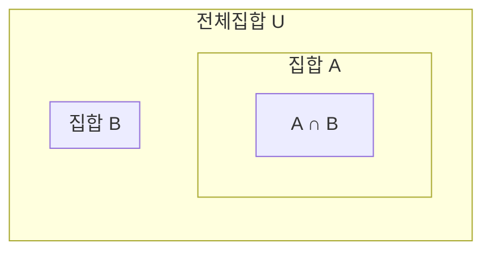

<Callout type="info">
  **이번 문서의 목표:** 이 문서를 다 읽으면 집합의 포함관계를 판별하고, 멱집합의 원소 개수를 계산하며, 교집합·합집합·차집합·여집합을 벤 다이어그램으로 그리고, 드모르간 법칙을 증명·적용할 수 있다.
</Callout>

## 왜 집합을 다시 다루는가

집합은 고등학교 수학에서 이미 배운 개념이지만, 독학사 이산수학에서는 07편의 관계·함수, 09~10편의 조합론, 14~15편의 그래프 이론까지 **거의 모든 단원의 언어**로 쓰인다. 관계는 "집합의 곱의 부분집합"으로, 함수는 "특별한 성질을 가진 관계"로, 그래프의 정점 집합·간선 집합도 결국 집합으로 정의되기 때문이다. 따라서 이 문서에서는 이후 단원에서 흔들림 없이 쓸 수 있도록 집합의 정의·연산·법칙을 **엄밀한 표기와 증명까지** 포함해 다시 잡는다.

> **쉽게 말하면:** 집합은 이산수학 전체를 구성하는 가장 기본적인 재료이므로, 여기서 정확히 다져 놓아야 뒤에서 무너지지 않는다.

## 집합의 정의와 포함관계

**집합**(set)은 명확하게 구분되는 대상들의 모임이다. 집합에 속한 개별 대상을 **원소**(element, member)라고 부르며, $a$가 집합 $A$의 원소라는 것은 $a \in A$(에이는 에이 집합에 속한다)로 쓰고, 속하지 않으면 $a \notin A$로 쓴다.

집합을 표기하는 방법은 두 가지다.

- **원소나열법**: 원소를 중괄호 안에 직접 나열한다. 예: $A = \{1, 2, 3, 4, 5\}$
- **조건제시법**: 원소가 만족하는 조건을 서술한다. 예: $A = \{x \mid x \text{는 1 이상 5 이하의 자연수}\}$ ($\mid$는 "~을 만족하는"이라고 읽는다.)

두 집합 $A$, $B$ 사이의 **포함관계**(subset relation)는 다음과 같이 정의한다.

$$
A \subseteq B \iff \forall x (x \in A \Rightarrow x \in B)
$$

- $A \subseteq B$: "$A$는 $B$의 부분집합이다"라고 읽으며, $A$의 모든 원소가 $B$에도 속한다는 뜻이다.
- $\forall x$: 04편에서 다룬 전칭 정량자로 "모든 $x$에 대해"라고 읽는다.
- $\iff$: "필요충분조건이다", 즉 왼쪽과 오른쪽이 서로 동치라는 뜻이다.

두 집합이 서로의 부분집합이면($A \subseteq B$이고 $B \subseteq A$) 두 집합은 **같다**고 하며 $A = B$로 쓴다. 이는 두 집합이 같음을 증명할 때 표준적으로 쓰는 방법이며, 05편에서 배운 **직접 증명**이 그대로 적용된다(양방향 포함을 각각 직접 증명한다).

$A \subseteq B$이면서 $A \ne B$이면 $A$를 $B$의 **진부분집합**(proper subset)이라 하고 $A \subsetneq B$로 쓴다. 원소가 하나도 없는 집합을 **공집합**(empty set)이라 하며 $\emptyset$ 또는 $\{\}$로 쓴다. 공집합은 어떤 집합의 부분집합도 될 수 있다는 성질이 있는데, 이는 05편의 직접 증명 방식으로 확인할 수 있다.

**명제:** 모든 집합 $A$에 대해 $\emptyset \subseteq A$이다.

1. **가정**: 정의에 따라 $\emptyset \subseteq A$를 보이려면 "$\emptyset$의 모든 원소가 $A$에 속한다"를 보여야 한다.
2. **핵심 관찰**: $\emptyset$에는 원소가 하나도 없으므로, "$x \in \emptyset$이면 $x \in A$이다"라는 조건문은 가정 부분($x \in \emptyset$)이 **항상 거짓**이다.
3. **논리 법칙 적용**: 03편에서 다룬 조건문의 진리표에 의해, 가정이 거짓인 조건문은 결론과 무관하게 **항상 참**이다.
4. **결론**: 따라서 "모든 $x$에 대해 $x \in \emptyset \Rightarrow x \in A$"는 참이며, 정의에 의해 $\emptyset \subseteq A$이다. $\blacksquare$

> **자주 틀리는 점:** $\emptyset \in A$(공집합이 A의 원소다)와 $\emptyset \subseteq A$(공집합이 A의 부분집합이다)를 혼동하는 경우가 매우 많다. 전자는 $A$가 실제로 원소로서 공집합을 포함하고 있을 때만 참이지만(예: $A = \{\emptyset, 1\}$), 후자는 **모든** 집합에 대해 항상 참이다.

## 부분집합과 멱집합

집합 $A$의 모든 부분집합을 원소로 하는 새로운 집합을 **멱집합**(power set)이라 하고 $\mathcal{P}(A)$ 또는 $2^A$로 쓴다.

$$
\mathcal{P}(A) = \{ S \mid S \subseteq A \}
$$

- $\mathcal{P}(A)$: 집합 $A$의 멱집합. "파워 셋"이라고 읽는다.
- $S \subseteq A$: 멱집합의 원소는 $A$의 부분집합이라는 뜻이며, $A$ 자기 자신과 $\emptyset$도 부분집합이므로 반드시 포함된다.

### 예제 — 3원소 집합의 멱집합

$A = \{1, 2, 3\}$이라 하자. $A$의 부분집합을 원소 개수별로 빠짐없이 나열하면 다음과 같다.

| 원소 개수 | 부분집합 |
|---|---|
| 0개 | $\emptyset$ |
| 1개 | $\{1\}$, $\{2\}$, $\{3\}$ |
| 2개 | $\{1,2\}$, $\{1,3\}$, $\{2,3\}$ |
| 3개 | $\{1,2,3\}$ |

따라서 $\mathcal{P}(A) = \{\emptyset, \{1\}, \{2\}, \{3\}, \{1,2\}, \{1,3\}, \{2,3\}, \{1,2,3\}\}$이며, 원소 개수는 총 8개다.

원소가 $n$개인 집합의 부분집합 개수는 다음 공식을 따른다. 이는 각 원소마다 "부분집합에 넣는다/넣지 않는다"의 **두 가지 독립적인 선택**이 있고, 이 선택이 $n$번 반복되므로 09편에서 배울 곱의 원리에 의해 $2$를 $n$번 곱한 값이 된다.

$$
|\mathcal{P}(A)| = 2^{|A|}
$$

- $|A|$: 집합 $A$의 **원소 개수**(cardinality, 기수). 세로 막대 두 개로 감싸 표기한다.
- $|\mathcal{P}(A)|$: 멱집합의 원소 개수. 위 예제에서는 $|A| = 3$이므로 $2^3 = 8$이며, 표에서 직접 센 값과 일치한다.

> **쉽게 말하면:** 멱집합은 "이 집합으로 만들 수 있는 모든 팀 구성 방법"을 전부 모아 놓은 것이다. 원소 하나하나를 팀에 넣을지 말지 결정하는 문제로 보면 왜 $2^n$인지 자연스럽게 이해된다.

> **자주 틀리는 점:** 멱집합의 원소는 $A$의 "원소"가 아니라 $A$의 "부분집합"이다. 위 예제에서 $1 \in \mathcal{P}(A)$가 아니라 $\{1\} \in \mathcal{P}(A)$가 옳다. 괄호(중괄호) 한 겹을 빠뜨리는 실수가 잦다.

## 집합의 네 가지 기본 연산

전체 집합(모든 논의의 대상을 포함하는 집합)을 $U$(전체집합, universal set)라 할 때, 두 집합 $A$, $B$에 대해 다음 네 연산을 정의한다.

<table>
<thead><tr><th>연산</th><th>기호</th><th>정의(조건제시법)</th><th>읽는 법</th></tr></thead>
<tbody>
<tr><td>합집합</td><td>$A \cup B$</td><td>$\{x \mid x \in A \lor x \in B\}$</td><td>A 합집합 B, A 또는 B에 속하는 원소 전체</td></tr>
<tr><td>교집합</td><td>$A \cap B$</td><td>$\{x \mid x \in A \land x \in B\}$</td><td>A 교집합 B, A와 B 모두에 속하는 원소</td></tr>
<tr><td>차집합</td><td>$A - B$</td><td>$\{x \mid x \in A \land x \notin B\}$</td><td>A 차집합 B, A에는 속하지만 B에는 속하지 않는 원소</td></tr>
<tr><td>여집합</td><td>$\overline{A}$</td><td>$\{x \mid x \in U \land x \notin A\}$</td><td>A의 여집합, 전체집합 중 A에 속하지 않는 원소</td></tr>
</tbody>
</table>

- $\lor$: 03편에서 다룬 논리합(OR) 기호. "또는"이라고 읽는다.
- $\land$: 03편에서 다룬 논리곱(AND) 기호. "그리고"라고 읽는다.
- $\overline{A}$: $A$ 위에 막대를 그어 여집합을 표기한다. $U - A$와 같은 뜻이다.

네 연산을 벤 다이어그램으로 나타내면 각 연산이 가리키는 영역이 명확해진다. 벤 다이어그램(Venn diagram)은 집합을 원(또는 타원)으로, 전체집합을 사각형으로 표현해 원소가 겹치는 영역을 시각화하는 도구다.

위 그림에서 $A \cap B$는 두 원이 겹치는 부분, $A \cup B$는 두 원을 합친 전체, $A - B$는 $A$ 원 중 겹치는 부분을 뺀 나머지, $\overline{A}$는 사각형($U$) 중 $A$ 원을 뺀 나머지다.

### 예제 — 실제 숫자로 검산

$U = \{1,2,3,4,5,6,7,8,9,10\}$, $A = \{1,2,3,4,5\}$, $B = \{4,5,6,7\}$이라 하자.

$$
A \cup B = \{1,2,3,4,5,6,7\}
$$

$$
A \cap B = \{4, 5\}
$$

$$
A - B = \{1,2,3\}
$$

$$
\overline{A} = \{6,7,8,9,10\}
$$

- $A \cup B$: $A$의 원소 5개와 $B$의 원소 4개를 합치되, 겹치는 $4, 5$는 한 번만 센 결과다.
- $A \cap B$: $A$와 $B$에 공통으로 들어 있는 $4, 5$만 남긴 결과다.
- $A - B$: $A$의 원소 중 $B$에도 속하는 $4, 5$를 뺀 결과다.
- $\overline{A}$: 전체집합 $U$의 10개 원소 중 $A$에 속하는 $1$~$5$를 뺀 나머지다.

> **쉽게 말하면:** 합집합은 "둘 중 하나라도 속하면 포함", 교집합은 "둘 다 속해야 포함", 차집합은 "앞에는 있고 뒤에는 없어야 포함", 여집합은 "전체에서 그것만 쏙 빼기"다.

## 드모르간 법칙

**드모르간 법칙**(De Morgan's laws)은 여집합이 합집합·교집합과 만났을 때 어떻게 바뀌는지를 설명하는 법칙으로, 03편에서 배운 논리연산의 드모르간 법칙($\lnot(P \lor Q) \equiv \lnot P \land \lnot Q$)을 집합 언어로 그대로 옮긴 것이다.

$$
\overline{A \cup B} = \overline{A} \cap \overline{B}
$$

$$
\overline{A \cap B} = \overline{A} \cup \overline{B}
$$

- 첫 번째 법칙: "$A$ 또는 $B$에 속하지 않는다"는 "$A$에도 속하지 않고 $B$에도 속하지 않는다"와 같다.
- 두 번째 법칙: "$A$와 $B$ 모두에 속하지는 않는다"는 "$A$에 속하지 않거나 $B$에 속하지 않는다"와 같다.

### 첫 번째 법칙의 직접 증명

**명제:** $\overline{A \cup B} = \overline{A} \cap \overline{B}$

집합이 같음을 보이려면 앞서 배운 대로 양방향 포함($\subseteq$)을 각각 보여야 한다.

**($\subseteq$ 방향) $\overline{A \cup B} \subseteq \overline{A} \cap \overline{B}$임을 보인다.**

1. **가정**: 임의의 원소 $x \in \overline{A \cup B}$를 취하자.
2. **정의 적용**: 여집합의 정의에 의해 $x \notin A \cup B$이다.
3. **논리 변형**: 합집합의 정의에 의해 $x \notin A \cup B$는 "$x \in A$ 또는 $x \in B$"가 거짓이라는 뜻이므로, 03편의 드모르간 법칙에 의해 "$x \notin A$이고 $x \notin B$"이다.
4. **정의 재적용**: $x \notin A$는 $x \in \overline{A}$와 같고, $x \notin B$는 $x \in \overline{B}$와 같다.
5. **결론**: $x \in \overline{A}$이고 $x \in \overline{B}$이므로 교집합의 정의에 의해 $x \in \overline{A} \cap \overline{B}$이다. $x$는 임의의 원소였으므로 $\overline{A \cup B} \subseteq \overline{A} \cap \overline{B}$이다.

**($\supseteq$ 방향) $\overline{A} \cap \overline{B} \subseteq \overline{A \cup B}$임을 보인다.**

6. **가정**: 임의의 원소 $x \in \overline{A} \cap \overline{B}$를 취하자.
7. **정의 적용**: 교집합의 정의에 의해 $x \in \overline{A}$이고 $x \in \overline{B}$, 즉 $x \notin A$이고 $x \notin B$이다.
8. **논리 변형**: 03편의 드모르간 법칙에 의해 이는 "$x \in A$ 또는 $x \in B$"가 거짓이라는 것과 같다.
9. **정의 재적용**: 즉 $x \notin A \cup B$이며, 이는 $x \in \overline{A \cup B}$와 같다.
10. **결론**: $\overline{A} \cap \overline{B} \subseteq \overline{A \cup B}$이다.

11. **최종 결론**: 두 방향의 포함관계가 모두 성립하므로 $\overline{A \cup B} = \overline{A} \cap \overline{B}$이다. $\blacksquare$

> **자주 틀리는 점:** 집합이 같음을 보이는 문제에서 한쪽 방향($\subseteq$)만 보이고 증명을 끝내는 경우가 매우 흔하다. 등식 증명은 반드시 **양방향**을 모두 서술해야 완전한 답안으로 인정된다.

> **자주 틀리는 점(2):** 드모르간 법칙을 적용할 때 여집합 기호를 씌우는 대상을 착각해 $\overline{A \cup B} = \overline{A} \cup \overline{B}$(연산 기호를 안 바꿈)로 잘못 쓰는 경우가 잦다. 여집합을 안으로 들여보낼 때 **합집합과 교집합이 서로 뒤바뀐다**는 것이 이 법칙의 핵심이다.

## 핵심 정리

- $A \subseteq B$는 "$A$의 모든 원소가 $B$에 속한다"는 뜻이며, 공집합은 모든 집합의 부분집합이다.
- 멱집합 $\mathcal{P}(A)$는 $A$의 모든 부분집합을 모은 집합이며, 원소 개수는 $2^{|A|}$다.
- 합집합·교집합·차집합·여집합은 각각 논리합·논리곱·부정과 대응되며, 벤 다이어그램으로 영역을 확인하면 직관적으로 이해할 수 있다.
- 드모르간 법칙은 여집합이 합집합·교집합 안으로 들어가면서 연산이 서로 뒤바뀐다는 법칙이며, 집합의 등식 증명은 반드시 양방향 포함관계를 모두 보여야 한다.

## 마무리 복습

<Quiz
  questionNumber={1}
  question="공집합과 임의의 집합 A 사이의 관계에 대한 설명으로 옳은 것은?"
  options={['공집합은 항상 A의 원소다', '공집합은 항상 A의 부분집합이다', '공집합은 A가 공집합일 때만 A의 부분집합이다', '공집합과 A의 관계는 A의 원소 개수에 따라 달라진다']}
  correctAnswer={2}
  explanation="공집합에는 원소가 하나도 없으므로 x가 공집합의 원소이면 x가 A에 속한다는 조건문은 가정이 항상 거짓이 되어 조건문 전체가 항상 참이다. 따라서 정의에 의해 공집합은 모든 집합의 부분집합이다."
  optionExplanations={['공집합이 A의 원소인지는 A가 실제로 원소로서 공집합을 포함하는지에 따라 달라지며 항상 참은 아니다.', '정답. 원소가 없다는 조건이 항상 조건문을 참으로 만들어 부분집합 관계가 항상 성립한다.', '이 관계는 A가 공집합인지와 무관하게 모든 집합에 대해 항상 성립한다.', '부분집합 관계는 A의 원소 개수와 무관하게 항상 성립하는 관계다.']}
/>

<Quiz
  questionNumber={2}
  question="집합 A = {a, b, c}의 멱집합 원소 개수는?"
  options={['3개', '6개', '8개', '9개']}
  correctAnswer={3}
  explanation="원소가 n개인 집합의 부분집합 개수는 2의 n제곱이다. A의 원소가 3개이므로 멱집합의 원소 개수는 2의 3제곱인 8개다."
  optionExplanations={['이는 A 자체의 원소 개수이며 부분집합의 개수가 아니다.', '2×3을 계산한 값으로, 부분집합 개수 공식(2의 n제곱)과 혼동한 오답이다.', '정답. 2의 3제곱은 8이며, 실제로 나열해도 공집합부터 전체집합까지 8개가 확인된다.', '3의 2제곱을 계산한 값으로 공식의 밑과 지수를 뒤바꾼 오답이다.']}
/>

<Quiz
  questionNumber={3}
  question="U = {1,2,3,4,5,6}, A = {1,2,3}, B = {3,4,5}일 때 A - B의 결과는?"
  options={['{3}', '{1,2}', '{4,5}', '{1,2,3,4,5}']}
  correctAnswer={2}
  explanation="A - B는 A에는 속하지만 B에는 속하지 않는 원소를 모은 집합이다. A의 원소 1,2,3 중 B에도 속하는 3을 제외하면 {1,2}가 남는다."
  optionExplanations={['이는 A와 B의 교집합에 해당하는 값으로, 차집합이 아니다.', '정답. A의 원소 중 B에 속하지 않는 1과 2만 남는다.', '이는 B - A를 계산한 결과이며 A - B가 아니다.', '이는 A와 B의 합집합이며 차집합이 아니다.']}
/>

<Quiz
  questionNumber={4}
  question="드모르간 법칙에 따라 A 교집합 B의 여집합을 올바르게 변형한 것은?"
  options={['A의 여집합 교집합 B의 여집합', 'A의 여집합 합집합 B의 여집합', 'A 합집합 B', 'A의 여집합']}
  correctAnswer={2}
  explanation="드모르간 법칙에 의해 A 교집합 B의 여집합은 A의 여집합과 B의 여집합의 합집합과 같다. 여집합이 교집합 안으로 들어가면서 연산이 합집합으로 바뀐다는 것이 이 법칙의 핵심이다."
  optionExplanations={['이는 A 합집합 B의 여집합에 대한 올바른 변형이며, 교집합의 여집합에 대한 것이 아니다.', '정답. 여집합이 교집합 안으로 들어가면서 연산이 합집합으로 바뀐다.', '여집합 기호가 완전히 사라져 있어 드모르간 법칙을 적용한 결과가 아니다.', 'B에 대한 정보가 사라져 있어 올바른 변형이 아니다.']}
/>

<Quiz
  questionNumber={5}
  question="집합 A와 B가 같음을 증명하는 표준적인 방법은?"
  options={['A의 원소 개수와 B의 원소 개수가 같음을 보인다', 'A가 B의 부분집합임과 B가 A의 부분집합임을 각각 보인다', 'A와 B의 벤 다이어그램을 그려 눈으로 비교한다', 'A와 B 중 하나가 공집합임을 보인다']}
  correctAnswer={2}
  explanation="두 집합이 같다는 것은 서로가 서로의 부분집합이라는 뜻이므로(A가 B의 부분집합이고 B가 A의 부분집합), 이 양방향 포함관계를 각각 직접 증명하는 것이 표준적인 방법이다."
  optionExplanations={['원소 개수가 같아도 서로 다른 원소로 이루어진 집합일 수 있으므로 집합이 같다는 것을 보장하지 않는다.', '정답. 양방향 포함관계를 각각 증명하는 것이 집합의 등식을 증명하는 표준 방법이다.', '벤 다이어그램은 직관을 돕는 도구일 뿐 엄밀한 증명 수단이 아니다.', '이는 특수한 경우에만 해당하며 일반적인 증명 방법이 아니다.']}
/>

<Quiz
  questionNumber={6}
  question="다음 중 A의 원소가 아니라 A의 부분집합에 해당하는 것은 무엇인가? (A = {1, 2, 3})"
  options={['1', '{1, 2}', '3', '전체집합 U']}
  correctAnswer={2}
  explanation="{1, 2}는 A의 원소 1과 2로 이루어진 집합이며, 이 집합 자체가 A의 부분집합에 해당한다. 1이나 3은 A의 원소이지 부분집합이 아니다(부분집합으로 취급하려면 중괄호로 감싸 {1}, {3}처럼 써야 한다)."
  optionExplanations={['1은 A의 원소이지 부분집합이 아니다. 부분집합이 되려면 {1}처럼 중괄호로 감싸야 한다.', '정답. {1,2}는 A의 부분집합이며, 멱집합의 원소가 될 수 있는 형태다.', '3도 1과 마찬가지로 A의 원소이지 부분집합이 아니다.', '전체집합 U는 이 문제의 맥락에서 A의 부분집합이 아니라 A를 포함하는 더 큰 집합일 수 있다.']}
/>

## 참고 자료

- [국가평생교육진흥원 독학학위제](https://bdes.nile.or.kr) — 독학사 시험 안내 및 이산수학 평가영역 공식 자료.
- [IEEE Standards Association](https://standards.ieee.org) — 집합 표기·논리 표기의 관례가 인용되는 공학 표준 문서 저장소.
