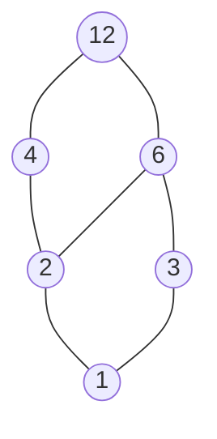

<Callout type="info">
  **이번 문서의 목표:** 이 문서를 다 읽으면 관계의 네 가지 성질(반사·대칭·추이·반대칭)을 직접 증명하거나 반례로 판별하고, 동치관계에서 동치류를 구성하며, 부분순서를 Hasse 도표로 그릴 수 있다.
</Callout>

## 왜 관계의 "성질"을 따로 보는가

07편에서 관계는 곱집합의 부분집합이라고 정의했다. 그런데 같은 "관계"라도 어떤 것은 "같음"처럼 행동하고, 어떤 것은 "작거나 같음"처럼 행동한다. 이 차이를 만드는 것이 관계가 가지는 **성질**이다. 05편에서 배운 증명 기법(특히 직접 증명과 반례)을 그대로 활용해, 주어진 관계가 어떤 성질을 만족하는지 만족하지 않는지 하나씩 판정하는 것이 이번 문서의 핵심이다.

> **쉽게 말하면:** 같은 "관계"라는 틀 안에서도, 규칙이 조금씩 다르면 완전히 다른 종류의 질서(동치관계는 "같음", 순서관계는 "크기 비교")를 만들어낼 수 있다.

이 문서 전체에서는 07편에서 다룬 "$A = \{1,2,3,4\}$ 위에서 $a$는 $b$의 약수다"라는 관계 $R$을 계속 재사용한다.

$$
R = \{(1,1),(1,2),(1,3),(1,4),(2,2),(2,4),(3,3),(4,4)\}
$$

## 네 가지 성질의 정의

집합 $A$ 위의 관계 $R$($R \subseteq A \times A$)에 대해 다음 네 성질을 정의한다.

<table>
<thead><tr><th>성질</th><th>정의</th><th>직관</th></tr></thead>
<tbody>
<tr><td>반사(reflexive)</td><td>$\forall a \in A,\ (a,a) \in R$</td><td>모든 원소가 자기 자신과 관계를 맺는다</td></tr>
<tr><td>대칭(symmetric)</td><td>$\forall a, b,\ (a,b)\in R \Rightarrow (b,a)\in R$</td><td>관계가 방향에 상관없이 양쪽으로 성립한다</td></tr>
<tr><td>추이(transitive)</td><td>$\forall a,b,c,\ (a,b)\in R \land (b,c)\in R \Rightarrow (a,c)\in R$</td><td>중간 다리를 건너 처음과 끝도 이어진다</td></tr>
<tr><td>반대칭(antisymmetric)</td><td>$\forall a,b,\ (a,b)\in R \land (b,a)\in R \Rightarrow a=b$</td><td>양쪽으로 성립하는 경우는 사실 같은 원소일 때뿐이다</td></tr>
</tbody>
</table>

> **자주 틀리는 점:** 대칭과 반대칭을 "서로 반대되는 성질"이라 여겨 하나면 다른 하나는 자동으로 아니라고 오해하기 쉽다. 실제로는 두 성질을 **동시에** 만족하는 관계도 있고(예: "같다" 관계), **둘 다** 만족하지 않는 관계도 있다(뒤에서 확인한다). 대칭은 "양방향이면 항상 성립", 반대칭은 "양방향이면 원소가 같아야만 성립"이라는 서로 다른 조건임을 정확히 구분해야 한다.

## 약수 관계로 네 성질 판별하기

$A = \{1,2,3,4\}$ 위의 약수 관계 $R$이 각 성질을 만족하는지 하나씩 서술형으로 확인한다.

### 반사성 확인 — 직접 증명

**명제:** $R$은 반사적이다.

1. **가정**: 임의의 $a \in A$를 취하자.
2. **정의 적용**: "$a$는 $a$의 약수다"는 모든 정수에 대해 항상 참이다($a = 1 \times a$이므로).
3. **결론**: 따라서 $(a,a) \in R$이다. $a$는 임의의 원소였으므로 $R$은 반사적이다. $\blacksquare$

실제로 $R$을 나열한 목록에도 $(1,1), (2,2), (3,3), (4,4)$가 모두 포함되어 있어 위 증명과 일치한다.

### 대칭성 확인 — 반례로 반증

**주장:** $R$은 대칭이 아니다.

성질이 **성립하지 않음**을 보일 때는 정의를 만족하지 않는 구체적인 예(반례, counterexample) 하나만 찾으면 충분하다(정의가 "모든 $a, b$에 대해"로 시작하는 전칭 명제이므로, 이를 부정하면 04편에서 배운 정량자 부정 규칙에 의해 "어떤 $a, b$가 존재해 성립하지 않는다"가 되기 때문이다).

1. **반례 제시**: $(1, 2) \in R$이다("1은 2의 약수다"가 참이므로).
2. **검증**: 그런데 $(2, 1) \notin R$이다("2는 1의 약수다"는 거짓이므로, $1 \div 2$는 정수가 아니다).
3. **결론**: $(1,2) \in R$이지만 $(2,1) \notin R$이므로, 대칭의 정의(양방향 모두 성립해야 함)를 만족하지 않는 사례가 존재한다. 따라서 $R$은 대칭이 아니다. $\blacksquare$

### 추이성 확인 — 직접 증명

**명제:** $R$은 추이적이다.

1. **가정**: $(a,b) \in R$이고 $(b,c) \in R$이라 하자.
2. **정의 적용**: $a$는 $b$의 약수이므로 어떤 정수 $k$에 대해 $b = ak$이고, $b$는 $c$의 약수이므로 어떤 정수 $m$에 대해 $c = bm$이다.
3. **대입**: $c = bm = (ak)m = a(km)$이다.
4. **결론**: $km$은 정수이므로 $a$는 $c$의 약수, 즉 $(a,c) \in R$이다. $\blacksquare$

$$
c = bm = (ak)m = a(km)
$$

- $k$: $b = ak$를 만족하는 정수(약수 관계의 정의에서 나온 매개변수)
- $m$: $c = bm$을 만족하는 정수

### 반대칭성 확인 — 직접 증명

**명제:** $R$은 반대칭이다.

1. **가정**: $(a,b) \in R$이고 $(b,a) \in R$이라 하자.
2. **정의 적용**: $a$는 $b$의 약수이고, 동시에 $b$는 $a$의 약수다.
3. **크기 비교**: 자연수의 범위에서 $a$가 $b$의 약수이면 $a \le b$이고, $b$가 $a$의 약수이면 $b \le a$이다.
4. **결론**: $a \le b$이고 $b \le a$이므로 $a = b$이다. $\blacksquare$

이 결과를 정리하면, 약수 관계 $R$은 **반사·추이·반대칭**을 만족하지만 **대칭은 만족하지 않는다.** 이런 조합(반사·반대칭·추이)을 가진 관계가 다음 절에서 다룰 순서관계의 대표적인 예다.

## 동치관계와 동치류

**동치관계**(equivalence relation)는 **반사·대칭·추이** 세 가지를 모두 만족하는 관계다. 세 성질을 모두 갖추면 이 관계는 수학적으로 "같다"라는 개념을 일반화한 것으로 취급할 수 있다.

동치관계 $R$이 집합 $A$ 위에 주어지면, 각 원소 $a \in A$에 대해 $a$와 관계를 맺는 원소를 모두 모은 집합을 그 원소의 **동치류**(equivalence class)라고 하고 $[a]$로 쓴다.

$$
[a] = \{ x \in A \mid (a, x) \in R \}
$$

동치류의 핵심 성질은, 서로 다른 동치류끼리는 **절대 겹치지 않으며**(교집합이 공집합), 모든 동치류를 합치면 원래 집합 $A$ 전체가 된다는 것이다. 이렇게 집합을 겹치지 않는 부분집합들로 완전히 나누는 것을 **분할**(partition)이라 하며, 동치관계는 항상 집합의 분할을 만들어낸다.

### 예제 — 모듈로 3 합동

정수 집합 $\mathbb{Z}$ 위에서, $a \equiv b \pmod 3$("$a$는 3을 법으로 $b$와 합동이다")을 $a - b$가 3으로 나누어떨어진다는 뜻으로 정의하자. 이는 11편에서 다룰 **합동**(congruence) 개념의 예고편이다.

**동치관계임을 확인:**

1. **반사성**: 모든 정수 $a$에 대해 $a - a = 0$이고 $0$은 3으로 나누어떨어지므로 $a \equiv a \pmod 3$이다.
2. **대칭성**: $a \equiv b \pmod 3$이면 $a - b = 3k$(어떤 정수 $k$)이고, 양변에 $-1$을 곱하면 $b - a = 3(-k)$이므로 $b \equiv a \pmod 3$이다.
3. **추이성**: $a \equiv b \pmod 3$이고 $b \equiv c \pmod 3$이면 $a - b = 3k$, $b - c = 3m$이고, 두 식을 더하면 $a - c = 3(k+m)$이므로 $a \equiv c \pmod 3$이다.

세 성질을 모두 만족하므로 이는 동치관계다. 이 관계가 만드는 동치류는 나머지에 따라 정확히 세 개로 나뉜다.

$$
[0] = \{\ldots, -3, 0, 3, 6, \ldots\}
$$

- $[0]$: 3으로 나눈 나머지가 0인 정수 전체
- 마찬가지로 $[1] = \{\ldots,-2,1,4,7,\ldots\}$(나머지 1), $[2] = \{\ldots,-1,2,5,8,\ldots\}$(나머지 2)이며, 이 세 동치류는 서로 겹치지 않고 합치면 정수 전체 $\mathbb{Z}$가 된다.

> **쉽게 말하면:** 동치관계는 "결국 같은 부류로 취급해도 되는 것들"을 하나로 묶어주는 도구이며, 동치류는 그렇게 묶인 한 부류를 가리킨다. 시계를 볼 때 13시와 1시를 "같은 시각(1시)"으로 취급하는 것이 모듈로 12(또는 24) 합동의 동치류 개념과 같은 원리다.

## 부분순서와 전순서

**부분순서**(partial order)는 **반사·반대칭·추이**를 모두 만족하는 관계다. 앞서 확인했듯 약수 관계 $R$이 정확히 이 조합을 만족하므로, 약수 관계는 부분순서의 대표 예다. 부분순서를 가진 집합을 **부분순서집합**(poset, partially ordered set)이라 한다.

"부분"이라는 이름이 붙은 이유는, 부분순서에서는 **모든 두 원소가 반드시 비교 가능하지는 않기 때문**이다. 예를 들어 약수 관계에서 2와 3은 어느 쪽도 다른 쪽의 약수가 아니므로(2는 3의 약수가 아니고, 3도 2의 약수가 아니다) 두 원소는 **비교 불가능**(incomparable)하다.

이와 달리, **전순서**(total order)는 부분순서이면서 **추가로** 집합의 모든 두 원소가 항상 비교 가능한 관계다.

$$
\forall a, b \in A,\ (a,b) \in R \lor (b,a) \in R
$$

정수나 실수에서의 "작거나 같다"($\le$) 관계가 전순서의 대표 예다. 임의의 두 정수는 항상 크기 비교가 가능하기 때문이다.

<table>
<thead><tr><th>구분</th><th>필요 성질</th><th>모든 원소 쌍이 비교 가능한가</th><th>예</th></tr></thead>
<tbody>
<tr><td>부분순서</td><td>반사·반대칭·추이</td><td>아니오(비교 불가능한 쌍이 있을 수 있음)</td><td>약수 관계, 집합의 포함관계($\subseteq$)</td></tr>
<tr><td>전순서</td><td>반사·반대칭·추이 + 모든 쌍 비교 가능</td><td>예</td><td>정수의 $\le$, 알파벳 사전순</td></tr>
</tbody>
</table>

## Hasse 도표

**Hasse 도표**(Hasse diagram)는 부분순서집합의 구조를 시각적으로 나타내는 그림으로, 다음 규칙을 따른다.

- 반사 관계(자기 자신과의 관계)는 이미 항상 성립하는 것이 자명하므로 그리지 않는다.
- 추이로 유도되는 관계(예: $a \le b$이고 $b \le c$이면 자동으로 $a \le c$)도 이미 함의되므로 선을 긋지 않는다.
- $a$가 $b$보다 "작고", 그 사이에 다른 원소가 끼어 있지 않을 때만 $a$를 아래에, $b$를 위에 놓고 두 점을 선으로 잇는다.

### 예제 — 약수 관계의 Hasse 도표

$A = \{1,2,3,4,6,12\}$ 위의 약수 관계에 대한 Hasse 도표를 그려 보자. 먼저 각 쌍이 약수 관계인지 확인해 "바로 위" 관계만 추린다.

- $1$은 $2, 3, 4, 6, 12$ 모두의 약수이지만, $2$와 $3$ 사이에 다른 원소가 끼지 않으므로 $1 \to 2$, $1 \to 3$만 직접 잇는다($1 \to 4$는 $1 \to 2 \to 4$로 이미 유도되므로 생략).
- $2$는 $4$와 $6$의 약수이므로 $2 \to 4$, $2 \to 6$을 잇는다.
- $3$은 $6$의 약수이므로 $3 \to 6$을 잇는다.
- $4$와 $6$은 모두 $12$의 약수이므로 $4 \to 12$, $6 \to 12$를 잇는다.

이 도표에서 아래쪽에 있을수록 "더 작은"(더 적은 원소를 약수로 가지는) 원소이고, 선으로 직접 연결되지 않은 두 원소(예: $2$와 $3$)는 비교 불가능하다는 뜻이다. $2$와 $3$을 예로 들면, 어느 쪽도 다른 쪽보다 위에 있지 않으며 직접 선으로 연결되지도 않았으므로 서로 비교 불가능하다.

> **자주 틀리는 점:** Hasse 도표를 그릴 때 추이로 이미 유도되는 선(예: $1$에서 $4$로 바로 가는 선)까지 전부 그리는 실수가 흔하다. Hasse 도표는 **바로 위 관계만** 남기고 나머지는 생략하는 것이 규칙이다.

### 순서관계에서의 최대·최소 원소

부분순서집합에서 자주 묻는 개념으로 다음이 있다.

- **최대원소**(maximum element): 집합의 모든 원소보다 크거나 같은 원소. 위 예에서는 $12$(다른 모든 원소가 $12$의 약수이므로).
- **극대원소**(maximal element): 그 원소보다 큰 원소가 없는 원소. 최대원소가 없더라도 여러 개의 극대원소가 존재할 수 있다.
- **최소원소**(minimum element): 위 예에서는 $1$.

전순서에서는 최대·최소가 존재하면 극대·극소와 항상 일치하지만, 부분순서에서는 비교 불가능한 원소들 때문에 극대원소가 여러 개일 수 있다는 점이 전순서와 다른 중요한 차이다. 예를 들어 $A = \{2,3,4,6\}$ 위의 약수 관계만 따로 보면, $4$와 $6$ 모두 자신보다 큰 원소(같은 집합 안에서)가 없으므로 둘 다 극대원소이며, 이 집합에는 단일한 최대원소가 존재하지 않는다.

## 핵심 정리

- 관계는 반사·대칭·추이·반대칭 네 성질을 각각 독립적으로 만족하거나 만족하지 않을 수 있으며, 대칭과 반대칭은 서로 반대말이 아니다.
- 성질이 성립함은 직접 증명(임의의 원소로 시작)으로, 성립하지 않음은 반례 하나로 보이면 충분하다.
- 동치관계(반사·대칭·추이)는 집합을 겹치지 않는 동치류들로 분할한다.
- 부분순서(반사·반대칭·추이)는 비교 불가능한 원소 쌍을 허용하며, 전순서는 모든 쌍이 비교 가능한 부분순서다.
- Hasse 도표는 반사·추이로 이미 유도되는 관계를 생략하고 "바로 위" 관계만 그린다.

## 마무리 복습

<Quiz
  questionNumber={1}
  question="관계 R이 대칭이 아니라는 것을 보이는 가장 표준적인 방법은?"
  options={['R의 모든 원소 쌍이 대칭 조건을 만족함을 직접 증명한다', '대칭 조건을 만족하지 않는 구체적인 반례 하나를 제시한다', '수학적 귀납법으로 모든 경우를 확인한다', '모순 증명으로 R이 공집합임을 보인다']}
  correctAnswer={2}
  explanation="대칭성은 모든 a, b에 대해 성립해야 하는 전칭 명제이므로, 이것이 성립하지 않음을 보이려면 조건을 만족하지 않는 구체적인 원소 쌍(반례) 하나만 찾으면 충분하다."
  optionExplanations={['이는 대칭성이 성립함을 보이는 방법이지, 성립하지 않음을 보이는 방법이 아니다.', '정답. 전칭 명제의 부정은 반례 하나로 충분히 보일 수 있다.', '귀납법은 자연수에 대한 무한한 명제를 다룰 때 쓰는 기법으로 이 상황에 적합하지 않다.', 'R이 대칭이 아니라는 것과 R이 공집합이라는 것은 서로 다른 주장이다.']}
/>

<Quiz
  questionNumber={2}
  question="집합 {1,2,3,4} 위에서 약수 관계에 대한 설명으로 옳은 것은?"
  options={['반사, 대칭, 추이를 모두 만족해 동치관계다', '반사, 반대칭, 추이를 만족해 부분순서다', '대칭만 만족하고 나머지는 만족하지 않는다', '어떤 성질도 만족하지 않는다']}
  correctAnswer={2}
  explanation="약수 관계는 반사성(모든 수는 자기 자신의 약수), 추이성(a가 b의 약수이고 b가 c의 약수이면 a는 c의 약수), 반대칭성(서로가 서로의 약수이면 두 수는 같다)을 만족하므로 부분순서에 해당한다. 대칭은 만족하지 않는다(1은 2의 약수이지만 2는 1의 약수가 아니다)."
  optionExplanations={['약수 관계는 대칭을 만족하지 않으므로 동치관계가 될 수 없다.', '정답. 반사·반대칭·추이를 모두 만족하는 부분순서의 대표 예다.', '약수 관계는 대칭을 만족하지 않으며, 오히려 반사·추이·반대칭을 만족한다.', '약수 관계는 반사·추이·반대칭 세 가지 성질을 만족한다.']}
/>

<Quiz
  questionNumber={3}
  question="정수 집합에서 a와 b가 3으로 나눈 나머지가 같다는 관계가 동치관계일 때, 이 관계가 만드는 동치류의 개수는?"
  options={['1개', '2개', '3개', '무한히 많다']}
  correctAnswer={3}
  explanation="3으로 나눈 나머지는 0, 1, 2 세 가지 경우만 가능하므로, 이 동치관계는 나머지가 0인 정수들의 모임, 나머지가 1인 정수들의 모임, 나머지가 2인 정수들의 모임이라는 정확히 3개의 동치류로 정수 전체를 분할한다."
  optionExplanations={['나머지가 가질 수 있는 값은 0, 1, 2로 여러 개이므로 동치류가 1개일 수 없다.', '나머지 값이 0, 1, 2 세 가지이므로 동치류도 2개가 아니라 3개다.', '정답. 나머지 0, 1, 2에 대응하는 정확히 3개의 동치류로 정수 전체가 분할된다.', '각 동치류에 속하는 정수의 개수는 무한하지만, 동치류 자체의 개수는 나머지의 가짓수인 3개로 유한하다.']}
/>

<Quiz
  questionNumber={4}
  question="부분순서와 전순서의 가장 핵심적인 차이는 무엇인가?"
  options={['부분순서는 반사성을 만족하지 않는다', '전순서는 모든 두 원소가 항상 비교 가능하지만 부분순서는 그렇지 않을 수 있다', '부분순서는 추이성을 만족하지 않는다', '전순서는 반대칭을 만족하지 않는다']}
  correctAnswer={2}
  explanation="부분순서와 전순서는 모두 반사·반대칭·추이를 만족한다. 차이는 전순서가 여기에 더해 모든 두 원소가 항상 비교 가능하다는 조건을 추가로 만족한다는 점이다. 부분순서에서는 비교 불가능한 원소 쌍이 존재할 수 있다."
  optionExplanations={['부분순서도 반사성을 만족해야 하는 조건에 포함된다.', '정답. 모든 원소 쌍의 비교 가능 여부가 부분순서와 전순서를 가르는 핵심 차이다.', '부분순서도 추이성을 만족해야 하는 조건에 포함된다.', '전순서도 반대칭을 만족해야 하는 조건에 포함된다.']}
/>

<Quiz
  questionNumber={5}
  question="Hasse 도표를 그릴 때 생략하는 선으로 옳지 않은 것은?"
  options={['반사 관계를 나타내는 선(자기 자신으로의 선)', '추이로 이미 유도되는 관계를 나타내는 선', '바로 위 원소로 직접 이어지는, 사이에 다른 원소가 없는 관계를 나타내는 선', '위 세 가지 중 반사와 추이로 유도되는 선만 생략 대상이다']}
  correctAnswer={3}
  explanation="Hasse 도표는 반사 관계(자명하므로 생략)와 추이로 이미 유도되는 관계(다른 선들로 함의되므로 생략)만 생략한다. 반면 사이에 다른 원소가 끼지 않은 바로 위 관계는 Hasse 도표의 핵심이므로 반드시 그려야 하며 생략 대상이 아니다."
  optionExplanations={['반사 관계는 자명하게 항상 성립하므로 Hasse 도표에서 생략하는 대상이 맞다.', '추이로 유도되는 관계는 다른 선들로 이미 표현되므로 생략하는 대상이 맞다.', '정답. 바로 위 관계는 Hasse 도표에서 반드시 그려야 하는 핵심 요소이며 생략 대상이 아니다.', '이 설명 자체가 옳은 내용이며, 문제는 생략 대상이 아닌 것을 찾는 것이므로 이 선택지가 정답이다.']}
/>

<Quiz
  questionNumber={6}
  question="집합 {2,3,4,6}에서 약수 관계만 따로 볼 때, 이 부분순서집합에 대한 설명으로 옳은 것은?"
  options={['최대원소가 존재하며 그 값은 12다', '4와 6이 모두 극대원소이며 단일한 최대원소는 존재하지 않는다', '2가 유일한 최대원소다', '이 집합은 전순서집합이다']}
  correctAnswer={2}
  explanation="이 집합 안에서 4와 6은 각각 자신보다 큰 원소(같은 집합 안에서 자신을 배수로 갖는 원소)가 없으므로 둘 다 극대원소다. 4와 6은 서로 비교 불가능하므로(어느 쪽도 다른 쪽의 약수가 아니다) 단일한 최대원소는 존재하지 않는다."
  optionExplanations={['12는 이 집합 {2,3,4,6}의 원소가 아니므로 최대원소가 될 수 없다.', '정답. 4와 6이 서로 비교 불가능해 둘 다 극대원소이며, 이 집합에는 최대원소가 존재하지 않는다.', '2는 3, 4, 6 중 4와 6의 약수이지만 3의 약수는 아니므로 최대원소가 아니며, 오히려 이 집합에서는 최소에 가까운 원소다.', '2와 3이 비교 불가능한 쌍이므로 이 집합은 전순서집합이 아니다.']}
/>

## 참고 자료

- [국가평생교육진흥원 독학학위제](https://bdes.nile.or.kr) — 독학사 시험 안내 및 이산수학 평가영역 공식 자료.
- [IEEE Standards Association](https://standards.ieee.org) — 순서관계·동치관계 표기의 관례가 인용되는 공학 표준 문서 저장소.
