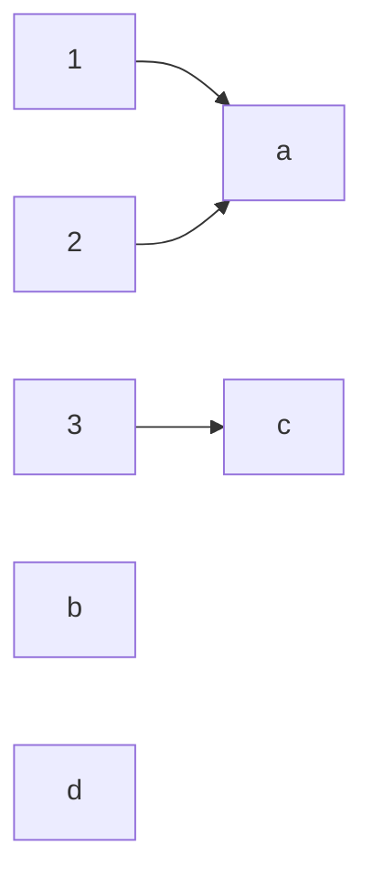
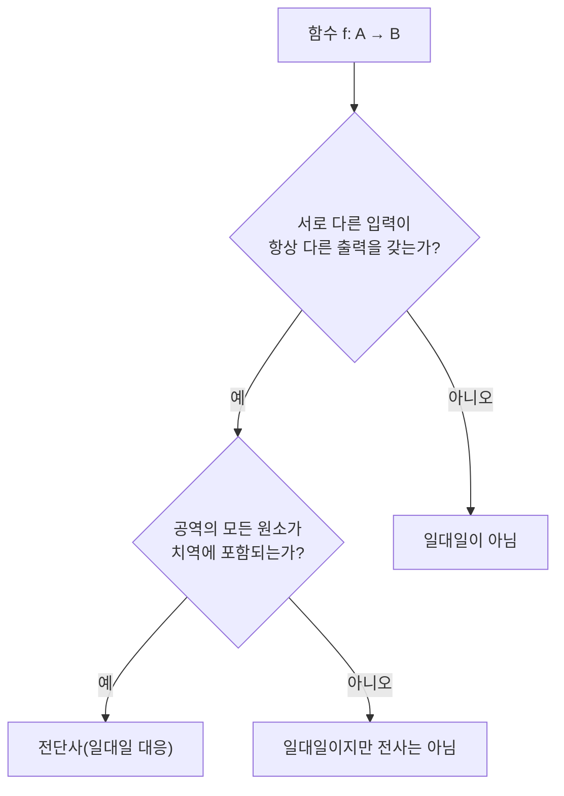

<Callout type="info">
  **이번 문서의 목표:** 이 문서를 다 읽으면 곱집합에서 관계를 정의하고, 함수가 되기 위한 조건을 판별하며, 일대일·전사·전단사를 구분하고, 합성함수와 역함수가 존재하는 조건을 설명할 수 있다.
</Callout>

## 왜 관계와 함수를 함께 배우는가

06편에서 집합의 연산을 다졌다면, 이번 문서에서는 그 집합 두 개를 **연결하는 방법**을 다룬다. **관계**(relation)와 **함수**(function)는 모두 "집합의 원소끼리 어떻게 짝지어지는가"를 다루는 개념이며, 사실 함수는 관계의 특별한 경우다. 이 둘의 정의를 정확히 구분해 두면 08편에서 배울 동치관계·순서관계, 그리고 이후 그래프 이론(그래프의 간선도 결국 정점 집합 위의 관계다)까지 자연스럽게 이어진다.

> **쉽게 말하면:** 관계는 "두 집합의 원소를 이렇게도 저렇게도 자유롭게 짝지어 놓은 것"이고, 함수는 그중에서 "각 입력에 대해 출력이 정확히 하나로 정해지는" 특별히 엄격한 규칙을 가진 관계다.

## 순서쌍과 곱집합

관계를 정의하려면 먼저 **순서쌍**(ordered pair)과 **곱집합**(Cartesian product, 카테시안 곱)을 알아야 한다.

순서쌍 $(a, b)$는 두 원소 $a$, $b$를 **순서를 구별해** 짝지은 것이다. 06편의 집합 $\{a, b\}$와 달리 순서쌍은 $(a, b) \ne (b, a)$(단, $a \ne b$일 때)이다. 두 순서쌍이 같으려면 첫 번째 성분과 두 번째 성분이 각각 같아야 한다: $(a,b) = (c,d) \iff a=c \text{ 이고 } b=d$.

두 집합 $A$, $B$의 **곱집합** $A \times B$는 $A$의 원소를 첫 번째로, $B$의 원소를 두 번째로 하는 모든 순서쌍을 모은 집합이다.

$$
A \times B = \{ (a, b) \mid a \in A \text{ 이고 } b \in B \}
$$

- $A \times B$: "에이 곱하기 비" 또는 "에이와 비의 곱집합"이라고 읽는다.
- 순서쌍의 순서가 중요하므로 일반적으로 $A \times B \ne B \times A$이다($A \ne B$일 때).

### 예제

$A = \{1, 2\}$, $B = \{x, y, z\}$라 하면,

$$
A \times B = \{(1,x), (1,y), (1,z), (2,x), (2,y), (2,z)\}
$$

$A$의 원소 2개 각각에 대해 $B$의 원소 3개를 하나씩 짝지을 수 있으므로, 09편에서 배울 곱의 원리에 의해 $|A \times B| = |A| \times |B| = 2 \times 3 = 6$개의 순서쌍이 나온다. 실제로 위에서 나열한 개수와 일치한다.

## 관계의 정의와 표현

두 집합 $A$, $B$에 대해, **$A$에서 $B$로의 관계** $R$은 곱집합 $A \times B$의 **부분집합**으로 정의한다.

$$
R \subseteq A \times B
$$

순서쌍 $(a, b)$가 $R$에 속하면 "$a$는 $b$와 $R$ 관계에 있다"고 하고 $a \mathrel{R} b$로 쓴다. $A = B$인 경우, 즉 같은 집합 안에서의 관계를 특별히 **$A$ 위의 관계**라고 부른다(08편에서 다루는 동치관계·순서관계가 모두 이 형태다).

> **쉽게 말하면:** 관계는 곱집합이라는 "가능한 모든 짝의 목록" 중에서, 실제로 성립하는 짝들만 골라 놓은 부분집합이다.

관계를 표현하는 방법은 세 가지가 대표적이다.

<table>
<thead><tr><th>표현 방법</th><th>설명</th></tr></thead>
<tbody>
<tr><td>순서쌍 목록</td><td>$R$에 속하는 순서쌍을 원소나열법으로 직접 나열한다.</td></tr>
<tr><td>화살표 다이어그램</td><td>두 집합의 원소를 각각 나열하고, 관계가 성립하는 원소끼리 화살표로 잇는다.</td></tr>
<tr><td>관계 행렬</td><td>행을 $A$의 원소, 열을 $B$의 원소로 하는 표를 만들고, $a \mathrel{R} b$이면 해당 칸에 1, 아니면 0을 적는다.</td></tr>
</tbody>
</table>

### 예제 — 약수 관계

$A = \{1, 2, 3, 4\}$ 위에서 "$a$는 $b$의 약수다"라는 관계 $R$을 생각하자. 순서쌍 목록으로 표현하면 다음과 같다.

$$
R = \{(1,1),(1,2),(1,3),(1,4),(2,2),(2,4),(3,3),(4,4)\}
$$

관계 행렬로는 다음과 같이 표현한다(행 $a$, 열 $b$: $a$가 $b$의 약수이면 1).

| R | 1 | 2 | 3 | 4 |
|---|---|---|---|---|
| 1 | 1 | 1 | 1 | 1 |
| 2 | 0 | 1 | 0 | 1 |
| 3 | 0 | 0 | 1 | 0 |
| 4 | 0 | 0 | 0 | 1 |

이 관계는 08편에서 다시 등장해, 반사·추이 등의 성질을 판별하는 대표 예제로 쓰인다.

## 함수의 정의와 표현

**함수**(function) $f: A \to B$는 관계 중에서도 다음 조건을 만족하는 특별한 관계다: $A$의 **모든** 원소가 정확히 **하나의** $B$의 원소와 짝지어져야 한다.

$$
\forall a \in A,\ \exists! b \in B \text{ such that } (a, b) \in f
$$

- $\exists!$: "정확히 하나 존재한다"는 뜻의 정량자로, 04편에서 다룬 존재 정량자 $\exists$에 유일성을 더한 표기다.
- 이 조건은 두 가지를 동시에 요구한다. 첫째, $A$의 어떤 원소도 빠짐없이 짝이 있어야 한다(존재성). 둘째, 한 원소가 두 개 이상의 출력을 가지면 안 된다(유일성).

함수와 관련된 용어를 정리하면 다음과 같다.

<table>
<thead><tr><th>용어</th><th>기호</th><th>정의</th></tr></thead>
<tbody>
<tr><td>정의역</td><td>$\operatorname{dom}(f) = A$</td><td>함수의 입력이 될 수 있는 원소 전체의 집합(domain)</td></tr>
<tr><td>공역</td><td>$\operatorname{codom}(f) = B$</td><td>함수의 출력이 속할 수 있다고 미리 정해 둔 집합(codomain)</td></tr>
<tr><td>치역</td><td>$\operatorname{ran}(f) = \{f(a) \mid a \in A\}$</td><td>실제로 함수값으로 나오는 원소만 모은 집합(range)</td></tr>
</tbody>
</table>

> **자주 틀리는 점:** 공역과 치역을 같은 것으로 착각하는 경우가 많다. 공역은 "출력이 속할 수 있는 후보 전체"이고, 치역은 "실제로 쓰인 출력만" 모은 것이므로 치역은 항상 공역의 부분집합이며($\operatorname{ran}(f) \subseteq \operatorname{codom}(f)$), 둘이 정확히 같을 필요는 없다.

### 예제 — 정의역·공역·치역 구분

$A = \{1, 2, 3\}$, $B = \{a, b, c, d\}$이고, $f(1) = a$, $f(2) = a$, $f(3) = c$라 하자.

- 정의역: $\{1, 2, 3\}$ (미리 정해진 입력 집합 $A$)
- 공역: $\{a, b, c, d\}$ (미리 정해진 출력 후보 집합 $B$)
- 치역: $\{a, c\}$ (실제로 함수값으로 나온 것만, $b$와 $d$는 어떤 입력의 출력으로도 쓰이지 않았다)

이 예에서 공역은 4개 원소를 가지지만 치역은 2개 원소만 가진다는 점에서 둘이 다름을 확인할 수 있다.

## 일대일·전사·전단사 — 함수의 세 가지 분류

함수는 입력과 출력이 짝지어지는 **양상**에 따라 다음과 같이 분류한다.

### 일대일 함수(injective, 단사함수)

**일대일 함수**(one-to-one function)는 서로 다른 입력이 항상 서로 다른 출력을 갖는 함수다. 즉, 두 입력의 출력이 같으면 그 두 입력 자체가 같았어야 한다.

$$
f(a_1) = f(a_2) \Rightarrow a_1 = a_2
$$

이 정의는 05편에서 배운 **대우** 형태로 바꾸면 더 직관적이다: "$a_1 \ne a_2$이면 $f(a_1) \ne f(a_2)$", 즉 다른 입력은 절대 같은 출력에 모이지 않는다는 뜻이다.

### 전사함수(surjective, 위로의 함수)

**전사함수**(onto function)는 공역의 모든 원소가 **적어도 한 번은** 어떤 입력의 출력으로 쓰이는 함수다. 즉, 치역이 공역과 정확히 같다.

$$
\forall b \in B,\ \exists a \in A \text{ such that } f(a) = b
$$

위 예제의 $f$는 $b$와 $d$가 어떤 입력의 출력도 되지 못했으므로 전사함수가 아니다.

### 전단사함수(bijective, 일대일 대응)

**전단사함수**(bijective function)는 일대일이면서 동시에 전사인 함수다. 정의역과 공역의 원소가 **완벽하게 하나씩 짝지어지는** 함수이며, 이 경우에만 다음 절의 역함수가 존재한다.

### 예제로 세 분류를 구분하기

$A = \{1,2,3\}$, $B = \{1,2,3,4\}$라 하고 세 함수를 비교하자.

| 함수 | 대응 | 일대일? | 전사? | 전단사? |
|---|---|---|---|---|
| $g_1$ | $1\to1, 2\to2, 3\to3$ | 예(입력마다 출력이 다름) | 아니오(4가 치역에 없음) | 아니오 |
| $g_2$ | $1\to1, 2\to1, 3\to2$ | 아니오(1과 2가 같은 출력 1) | 아니오(3, 4가 치역에 없음) | 아니오 |
| $g_3$ (단, $B=A$일 때) | $1\to2, 2\to3, 3\to1$ | 예 | 예(1, 2, 3이 모두 치역) | 예 |

$g_1$은 서로 다른 입력이 서로 다른 출력을 가지므로 일대일이지만, 공역 $B$의 원소 4는 어떤 입력의 출력도 아니므로 전사가 아니다. $g_2$는 $1$과 $2$가 모두 $1$로 대응되어 일대일이 아니다. $g_3$은 정의역과 공역이 같은 3원소 집합일 때, 세 입력이 세 출력에 완벽하게 하나씩 대응되어 전단사다.

> **자주 틀리는 점:** 정의역과 공역의 원소 개수가 다르면($|A| \ne |B|$) 애초에 전단사가 될 수 없다. 위 표에서 $A$와 $B$의 원소 개수가 각각 3개, 4개로 다르므로 $g_1$, $g_2$는 원소 개수만 봐도 전단사가 아님을 미리 알 수 있다.

## 합성함수와 역함수

**합성함수**(composite function)는 두 함수 $f: A \to B$와 $g: B \to C$가 있을 때, $A$의 원소를 먼저 $f$로 $B$의 원소로 보낸 뒤, 그 결과를 다시 $g$로 $C$의 원소로 보내는 새로운 함수다.

$$
(g \circ f)(a) = g(f(a))
$$

- $g \circ f$: "지에프" 또는 "지 콤포즈 에프"라고 읽으며, **오른쪽에 있는 $f$를 먼저 적용**한다는 순서에 유의해야 한다.
- 합성이 정의되려면 $f$의 공역과 $g$의 정의역이 일치해야 한다($f$의 출력이 $g$의 입력으로 그대로 들어갈 수 있어야 하기 때문이다).

### 예제

$f(x) = x + 1$ ($f: \mathbb{Z} \to \mathbb{Z}$, $\mathbb{Z}$는 정수 전체의 집합), $g(x) = x^2$ ($g: \mathbb{Z} \to \mathbb{Z}$)이라 하자. $(g \circ f)(3)$을 계산하면 다음과 같다.

$$
(g \circ f)(3) = g(f(3)) = g(4) = 16
$$

- $f(3) = 3+1 = 4$를 먼저 계산하고, 그 결과 $4$를 $g$에 대입해 $g(4) = 16$을 얻는다.
- 만약 순서를 바꿔 $(f \circ g)(3)$을 계산하면 $f(g(3)) = f(9) = 10$으로 전혀 다른 값이 나온다. 이는 함수의 합성이 일반적으로 **교환법칙이 성립하지 않는다**($g \circ f \ne f \circ g$)는 것을 보여준다.

**역함수**(inverse function) $f^{-1}: B \to A$는 함수 $f$가 만든 대응을 정확히 거꾸로 돌리는 함수이며, $f(a) = b$이면 $f^{-1}(b) = a$가 되도록 정의한다. 역함수가 함수로서 존재하려면(모든 $b \in B$에 대해 $f^{-1}(b)$가 정확히 하나로 정해지려면) $f$가 **전단사여야만** 한다.

- $f$가 일대일이 아니면, 어떤 $b$는 두 개 이상의 $a$로부터 왔을 수 있어 $f^{-1}(b)$가 하나로 정해지지 않는다(함수의 유일성 조건 위반).
- $f$가 전사가 아니면, 공역의 어떤 $b$는 대응되는 입력이 아예 없어 $f^{-1}(b)$가 정의되지 않는다(함수의 존재성 조건 위반).

$f$가 전단사이면 $f^{-1} \circ f$는 정의역의 모든 원소를 자기 자신으로 돌려보내는 함수(항등함수, identity function)가 되고, $f \circ f^{-1}$ 역시 공역에서의 항등함수가 된다.

$$
(f^{-1} \circ f)(a) = a \quad \text{(모든 } a \in A \text{에 대해)}
$$

> **쉽게 말하면:** 역함수는 "왔던 길을 그대로 되짚어 돌아가는" 함수이며, 되짚어 갈 때 갈림길(일대일 위반)이나 막다른 길(전사 위반)이 있으면 역함수를 만들 수 없다.

## 핵심 정리

- 곱집합 $A \times B$는 $A$와 $B$의 원소로 만들 수 있는 모든 순서쌍의 집합이며, 관계는 그 부분집합으로 정의된다.
- 함수는 정의역의 모든 원소가 정확히 하나의 출력을 갖는 특별한 관계이며, 정의역·공역·치역을 구분해야 한다(치역은 항상 공역의 부분집합).
- 일대일은 "다른 입력은 다른 출력", 전사는 "공역 전체가 치역과 같음", 전단사는 이 둘을 모두 만족하는 함수다.
- 합성함수는 오른쪽 함수를 먼저 적용하며 일반적으로 교환법칙이 성립하지 않고, 역함수는 오직 전단사함수에 대해서만 정의된다.

## 마무리 복습

<Quiz
  questionNumber={1}
  question="집합 A = {1, 2}, B = {x, y, z}일 때 곱집합 A×B의 원소 개수는?"
  options={['5개', '6개', '9개', '2개']}
  correctAnswer={2}
  explanation="곱집합 A×B의 원소 개수는 A의 원소 개수와 B의 원소 개수의 곱과 같다. |A|=2, |B|=3이므로 2×3=6개이며, 실제로 순서쌍을 나열해도 6개가 확인된다."
  optionExplanations={['|A|+|B|=2+3=5를 계산한 값으로, 곱집합의 원소 개수 공식과 혼동한 오답이다.', '정답. 2×3=6이며 이는 곱의 원리로 설명된다.', '3의 2제곱을 계산한 값으로 잘못 적용한 오답이다.', 'A의 원소 개수만 계산한 값으로, B를 고려하지 않은 오답이다.']}
/>

<Quiz
  questionNumber={2}
  question="함수 f: A→B에서 공역과 치역의 관계에 대한 설명으로 옳은 것은?"
  options={['공역과 치역은 항상 같은 집합이다', '치역은 항상 공역의 부분집합이며, 같을 수도 있고 진부분집합일 수도 있다', '공역이 치역의 부분집합이다', '공역과 치역은 서로 아무 관계가 없다']}
  correctAnswer={2}
  explanation="치역은 실제로 함수값으로 나온 원소만 모은 것이므로 미리 정해 둔 출력 후보 전체인 공역의 부분집합이다. 함수가 전사이면 둘이 같아지고, 그렇지 않으면 치역이 공역의 진부분집합이 된다."
  optionExplanations={['함수가 전사일 때만 공역과 치역이 같으며, 일반적으로는 다를 수 있다.', '정답. 치역은 항상 공역의 부분집합이며, 전사 여부에 따라 같을 수도 진부분집합일 수도 있다.', '이는 관계가 반대로 서술된 오답이다. 공역이 치역을 포함하는 관계다.', '치역은 정의상 공역 안에서 정해지므로 서로 무관하지 않다.']}
/>

<Quiz
  questionNumber={3}
  question="함수 f(a1)=f(a2)이면 항상 a1=a2가 성립하는 함수를 무엇이라 하는가?"
  options={['전사함수', '일대일 함수', '항등함수', '합성함수']}
  correctAnswer={2}
  explanation="이는 일대일 함수(단사함수)의 정의다. 서로 다른 입력이 결코 같은 출력을 내지 않는다는 성질이며, 대우로 표현하면 a1이 a2와 다르면 f(a1)과 f(a2)도 다르다는 뜻이다."
  optionExplanations={['전사함수는 공역의 모든 원소가 치역에 포함되는지를 다루는 성질로, 이 정의와는 다르다.', '정답. 이는 일대일 함수(단사함수)의 정의 그 자체다.', '항등함수는 입력을 그대로 출력하는 특정한 함수를 가리키는 용어로, 이 정의와는 다르다.', '합성함수는 두 함수를 이어 붙인 새로운 함수를 가리키는 용어로, 이 정의와는 무관하다.']}
/>

<Quiz
  questionNumber={4}
  question="정의역과 공역의 원소 개수가 각각 3개, 5개인 함수가 전단사함수일 수 있는가?"
  options={['항상 전단사일 수 있다', '원소 개수가 다르면 전단사가 될 수 없다', '일대일이기만 하면 전단사가 될 수 있다', '전사이기만 하면 전단사가 될 수 있다']}
  correctAnswer={2}
  explanation="전단사함수는 정의역과 공역의 원소가 하나씩 완벽하게 짝지어져야 하므로 두 집합의 원소 개수가 반드시 같아야 한다. 3개와 5개로 개수가 다르면 애초에 전단사가 될 수 없다."
  optionExplanations={['원소 개수가 다르면 하나씩 완벽하게 짝짓는 것이 불가능하므로 전단사일 수 없다.', '정답. 전단사가 되려면 정의역과 공역의 원소 개수가 같아야 하는데 3개와 5개로 다르다.', '일대일만으로는 전사를 보장하지 못하므로 전단사가 되기에 충분하지 않다.', '전사만으로는 일대일을 보장하지 못하므로 전단사가 되기에 충분하지 않다.']}
/>

<Quiz
  questionNumber={5}
  question="f(x)=x+1, g(x)=x제곱일 때 (g∘f)(2)의 값은?"
  options={['5', '9', '6', '4']}
  correctAnswer={2}
  explanation="합성함수 (g∘f)(2)는 g(f(2))와 같으며, 오른쪽 함수인 f를 먼저 적용한다. f(2)=2+1=3이고, 이를 g에 대입하면 g(3)=3의 제곱=9이다."
  optionExplanations={['f(2)=3을 g에 대입하지 않고 2+3처럼 잘못 더한 값으로 보인다.', '정답. f(2)=3이고 g(3)=9이므로 (g∘f)(2)=9이다.', '순서를 바꿔 (f∘g)(2)=f(4)=5를 계산하려다 잘못 더한 값과 혼동한 오답으로 보인다.', 'g(2)=4를 그대로 답으로 쓴 것으로, f를 먼저 적용해야 한다는 순서를 놓친 오답이다.']}
/>

<Quiz
  questionNumber={6}
  question="함수 f의 역함수가 존재하기 위한 필요충분조건은?"
  options={['f가 일대일이면 충분하다', 'f가 전사이면 충분하다', 'f가 전단사여야 한다', 'f의 정의역과 공역이 같기만 하면 된다']}
  correctAnswer={3}
  explanation="역함수가 함수로서 존재하려면 공역의 모든 원소에 대해 대응되는 입력이 정확히 하나씩 있어야 한다. 이는 일대일(유일성)과 전사(존재성) 조건을 모두 만족해야 함을 뜻하므로, f는 전단사여야 한다."
  optionExplanations={['일대일이어도 전사가 아니면 공역의 일부 원소는 역함수 값이 정의되지 않는다.', '전사이어도 일대일이 아니면 어떤 원소는 역함수 값이 두 개 이상으로 정해지지 않는 문제가 생긴다.', '정답. 일대일과 전사를 모두 만족하는 전단사함수여야 역함수가 함수로서 온전히 존재한다.', '정의역과 공역이 같은 것과 전단사 여부는 별개의 조건이다.']}
/>

## 참고 자료

- [국가평생교육진흥원 독학학위제](https://bdes.nile.or.kr) — 독학사 시험 안내 및 이산수학 평가영역 공식 자료.
- [IEEE Standards Association](https://standards.ieee.org) — 관계·함수 표기의 관례가 인용되는 공학 표준 문서 저장소.
