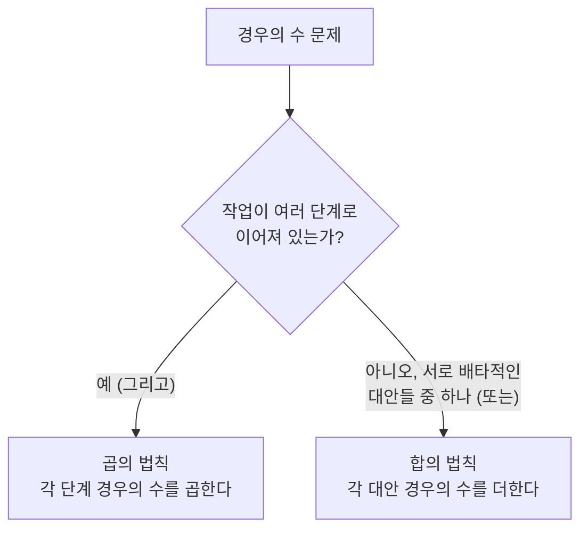

<Callout type="info">
  **이번 문서의 목표:** 이 파일을 다 읽으면 어떤 경우의 수 문제를 보았을 때 합의 법칙을 쓸지 곱의 법칙을 쓸지, 순서를 따질지 말지, 중복을 허용할지를 스스로 판단해서 순열·조합·이항정리 공식으로 정확히 계산할 수 있다.
</Callout>

## 왜 세는 방법을 따로 배우는가

이산수학(discrete mathematics, 연속량이 아니라 하나씩 셀 수 있는 대상을 다루는 수학)에서 "세기(counting)"는 확률·알고리즘 분석·정보량 계산 등 뒤에서 나오는 거의 모든 주제의 기초 도구다. 문제는 사람이 직관으로 세면 **중복해서 세거나(overcounting)** **빠뜨리고 세는(undercounting)** 실수를 저지르기 쉽다는 점이다. 예를 들어 "5개 메뉴 중 2개를 고르는 방법"과 "5개 메뉴 중 2개를 순서대로 고르는 방법"은 답이 다른데, 이 차이를 손으로 나열하지 않고도 정확히 계산하려면 체계적인 원리가 필요하다.

> **쉽게 말하면:** 세는 방법을 몇 가지 표준 도구(합·곱의 법칙, 순열, 조합)로 정리해 두면, 아무리 복잡한 경우의 수 문제도 "이 부분은 어떤 도구를 쓸 상황인가"만 판단하면 풀린다.

## 합의 법칙과 곱의 법칙

### 정의

**합의 법칙(rule of sum)**: 어떤 일을 하는 방법이 서로 겹치지 않는 $m$가지 경우와 $n$가지 경우로 나뉘고 두 경우가 동시에 일어날 수 없다면(상호 배타적, mutually exclusive), 전체 방법의 수는 $m + n$이다.

**곱의 법칙(rule of product)**: 어떤 일이 **연속된 여러 단계**로 이루어지고, 1단계를 하는 방법이 $m$가지, 그 각각에 대해 2단계를 하는 방법이 $n$가지라면, 전체 방법의 수는 $m \times n$이다.

두 법칙을 구분하는 핵심 질문은 "이 선택들이 **동시에(단계로 이어져)** 일어나는가, 아니면 **택일로(둘 중 하나만)** 일어나는가"이다. 곱의 법칙은 "그리고(and, 단계를 모두 거쳐야 함)"에 대응하고, 합의 법칙은 "또는(or, 둘 중 하나의 경로만 선택)"에 대응한다.

### 작은 예시로 검산

**곱의 법칙 예시**: 티셔츠 3벌, 바지 4벌이 있을 때 상하의를 한 벌씩 짝짓는 방법의 수를 구해 보자. 티셔츠를 고르는 방법이 3가지, 그 각각에 대해 바지를 고르는 방법이 4가지이므로 단계가 이어진다(티셔츠를 고른 **다음** 바지를 고른다).

$$
3 \times 4 = 12
$$

실제로 나열해 검산하면 (티셔츠1,바지1), (티셔츠1,바지2), …, (티셔츠3,바지4)까지 정확히 12개가 나온다.

**합의 법칙 예시**: 자판기에 커피 음료 5종, 차 음료 3종이 있고 "커피 한 잔 또는 차 한 잔"을 고르는 방법의 수를 구해 보자. 커피를 고르는 경우와 차를 고르는 경우는 동시에 일어날 수 없는(한 번에 음료 하나만 뽑는다) 배타적 대안이다.

$$
5 + 3 = 8
$$

**흔한 함정**: "5종 커피 중 1개, 3종 차 중 1개를 **함께** 산다"로 문제가 바뀌면 이제는 곱의 법칙이다($5 \times 3 = 15$). 문장에 "그리고"인지 "또는"인지가 명시되지 않는 경우가 많으므로, 실제 상황을 그려서 "동시에 일어나는 일인가"를 스스로 확인해야 한다.

## 순열: 순서가 있는 뽑기

### 정의

**순열**(permutation)은 서로 다른 $n$개의 대상 중에서 $r$개를 **순서를 구별해서** 뽑아 나열하는 경우의 수다. 기호는 $P(n, r)$ 또는 $_nP_r$로 쓰고, 다음과 같이 정의한다.

$$
P(n, r) = \frac{n!}{(n-r)!} = n \times (n-1) \times \cdots \times (n-r+1)
$$

- $n!$ (엔 팩토리얼, factorial): $n$부터 1까지 모든 자연수를 곱한 값. $0! = 1$로 약속한다.
- $n$: 전체 대상의 개수
- $r$: 뽑아서 나열할 개수 ($r \le n$)

순열은 곱의 법칙을 여러 번 적용한 것과 같다. 첫 번째 자리를 채우는 방법은 $n$가지, 두 번째 자리는 (하나를 이미 썼으므로) $n-1$가지, ..., $r$번째 자리는 $n-r+1$가지이므로 이들을 모두 곱하면 위 공식이 나온다.

### 작은 예시로 검산

5명(가, 나, 다, 라, 마) 중에서 회장 1명, 부회장 1명을 뽑는 방법의 수를 구해 보자. 회장과 부회장은 역할이 다르므로 (가→회장, 나→부회장)과 (나→회장, 가→부회장)은 서로 다른 결과다. 순서를 구별하므로 순열이다. $n=5$, $r=2$다.

$$
P(5, 2) = \frac{5!}{(5-2)!} = \frac{5!}{3!} = 5 \times 4 = 20
$$

직접 세어 검산하면 회장 후보 5명 중 1명(5가지), 그 각각에 대해 부회장 후보 4명 중 1명(4가지)이므로 $5 \times 4 = 20$으로 일치한다.

### 중복순열

**중복순열**(permutation with repetition)은 같은 대상을 여러 번 뽑을 수 있도록 허용한 순열이다. 서로 다른 $n$개 중에서 중복을 허용해 $r$개를 순서 있게 뽑으면 각 자리마다 독립적으로 $n$가지를 고를 수 있으므로 곱의 법칙에 의해

$$
{}_n\Pi_r = n^r
$$

이 된다. 예를 들어 숫자 0부터 9까지(10개) 중 중복을 허용해 4자리 비밀번호를 만드는 방법의 수는 $10^4 = 10{,}000$가지다(각 자리마다 0~9 중 아무거나 가능하므로 첫째 자리 10가지, 둘째 자리도 10가지 …).

## 조합: 순서를 따지지 않는 뽑기

### 정의

**조합**(combination)은 서로 다른 $n$개의 대상 중 $r$개를 **순서를 구별하지 않고** 뽑는 경우의 수다. 기호는 $C(n, r)$, $_nC_r$, 또는 $\binom{n}{r}$(엔 초크 알, 이항계수라고도 읽는다)로 쓴다.

$$
\binom{n}{r} = \frac{n!}{r! \, (n-r)!}
$$

이 공식이 순열 공식과 다른 이유를 직관적으로 보자. 순열 $P(n, r)$은 $r$개를 뽑아서 **나열까지** 한 경우의 수인데, 조합은 나열 순서를 구별하지 않으므로 뽑힌 $r$개를 나열하는 방법의 수 $r!$만큼 순열보다 적게 세어야 한다. 즉

$$
\binom{n}{r} = \frac{P(n, r)}{r!}
$$

이라는 관계가 성립하고, 이를 풀어 쓰면 위 공식이 된다.

### 작은 예시로 검산

5명(가, 나, 다, 라, 마) 중에서 대표 2명(역할 구분 없음, 동아리 대표단)을 뽑는 방법의 수를 구해 보자. 이번에는 (가, 나)와 (나, 가)가 같은 결과다.

$$
\binom{5}{2} = \frac{5!}{2! \, 3!} = \frac{5 \times 4}{2 \times 1} = 10
$$

앞의 순열 예시($P(5,2)=20$)와 비교하면, 조합은 순열을 $2! = 2$로 나눈 값과 같다($20 \div 2 = 10$). 실제로 (가,나)/(나,가) 두 순열이 조합에서는 \{가,나\} 하나로 합쳐지는 식으로 모든 쌍이 2개씩 묶이므로 정확히 절반이 된다.

**순열과 조합 비교표**

| 구분 | 순서 구별 | 기호 | 공식 | 예시 상황 |
|------|-----------|------|------|-----------|
| 순열 | 구별함 | $P(n,r)$ | $\dfrac{n!}{(n-r)!}$ | 회장·부회장처럼 역할이 다른 자리 배정 |
| 조합 | 구별 안 함 | $\binom{n}{r}$ | $\dfrac{n!}{r!(n-r)!}$ | 대표단처럼 역할이 같은 그룹 선택 |
| 중복순열 | 구별함, 중복 허용 | ${}_n\Pi_r$ | $n^r$ | 비밀번호처럼 같은 값 재사용 가능 |
| 중복조합 | 구별 안 함, 중복 허용 | $\binom{n+r-1}{r}$ | 아래 참고 | 같은 종류를 여러 개 담기 |

### 중복조합

**중복조합**(combination with repetition)은 서로 다른 $n$종류 중에서 중복을 허용해 $r$개를 순서 없이 뽑는 경우의 수다. 예를 들어 사과·바나나·귤 3종류 과일 중에서 (같은 과일을 여러 개 골라도 되게) 5개를 담는 방법의 수를 구하는 상황이다. 공식은

$$
\binom{n+r-1}{r}
$$

이다. 이 공식이 왜 이런 모양인지는 "칸막이 방법(stars and bars)"으로 이해할 수 있다. 뽑을 $r$개를 동그라미 $r$개로 나타내고, 종류를 구분하는 칸막이 $n-1$개를 그 사이에 배치한다고 생각하면, 전체 $r + (n-1)$개의 자리 중 동그라미가 들어갈 $r$개 자리(또는 칸막이가 들어갈 $n-1$개 자리)를 고르는 조합 문제로 바뀐다.

과일 예시로 검산하면 $n=3$, $r=5$이므로

$$
\binom{3+5-1}{5} = \binom{7}{5} = \binom{7}{2} = \frac{7 \times 6}{2 \times 1} = 21
$$

$\binom{7}{5} = \binom{7}{2}$인 이유는 $\binom{n}{r} = \binom{n}{n-r}$이라는 대칭성 때문이다($7$개 중 $5$개를 고르는 것은 나머지 $2$개를 고르지 **않는** 것을 정하는 것과 같다).

## 이항계수와 이항정리

### 정의

**이항정리**(binomial theorem)는 $(x+y)^n$을 전개했을 때 각 항의 계수가 정확히 조합 $\binom{n}{k}$가 된다는 정리다.

$$
(x+y)^n = \sum_{k=0}^{n} \binom{n}{k} x^{n-k} y^{k}
$$

- $\sum$ (시그마, summation): 아래첨자부터 위첨자까지 모두 더하라는 기호. 여기서는 $k=0$부터 $k=n$까지.
- $\binom{n}{k}$: $n$개 중 $k$개를 고르는 조합의 수이자 전개식의 계수 — 그래서 **이항계수**(binomial coefficient)라고 부른다.

이 정리가 성립하는 이유는 $(x+y)^n = (x+y)(x+y)\cdots(x+y)$($n$번 곱)을 전개할 때, $n$개의 괄호 각각에서 $x$ 또는 $y$ 중 하나를 선택해 곱하는 모든 경우를 더하는 것과 같기 때문이다. $y$를 정확히 $k$번 선택하는 경우의 수가 $\binom{n}{k}$가지이므로 $x^{n-k}y^k$ 항의 계수가 $\binom{n}{k}$가 된다.

### 작은 예시로 검산

$(x+y)^3$을 이항정리로 전개하고 직접 곱해서 검산해 보자. $n=3$이므로 $k=0,1,2,3$에 대해 계수를 구한다.

$$
\binom{3}{0}=1, \quad \binom{3}{1}=3, \quad \binom{3}{2}=3, \quad \binom{3}{3}=1
$$

(주의: 이 문서의 다른 계산 규칙과 달리, 여기서는 같은 $n=3$에 대한 이항계수 네 개를 한 번에 나열만 했을 뿐 서로 다른 계산을 이어 쓴 것은 아니다. 각 값의 유도는 아래에서 따로 보인다.)

$\binom{3}{1}$을 직접 계산하면

$$
\binom{3}{1} = \frac{3!}{1! \, 2!} = 3
$$

이므로 이항정리에 대입하면

$$
(x+y)^3 = x^3 + 3x^2y + 3xy^2 + y^3
$$

이 나온다. 실제로 $(x+y)^3 = (x+y)(x+y)(x+y)$를 직접 전개해도 같은 결과가 나오는지는 고등학교 과정에서 이미 확인했을 것이다 — 여기서는 "계수가 조합의 수와 같다"는 원리가 핵심이다.

**응용**: 이항정리에 $x=1, y=1$을 대입하면 $\binom{n}{0}+\binom{n}{1}+\cdots+\binom{n}{n} = 2^n$이라는 항등식을 얻는데, 이는 $n$개 원소를 가진 집합의 부분집합 개수가 $2^n$개라는 사실(06편 참고)과 정확히 일치한다. 이렇게 서로 다른 단원의 결과가 맞아떨어지는지 확인하는 것도 좋은 검산 습관이다.

## 자주 틀리는 점

1. **"뽑는다"는 말만 보고 조합으로 단정한다.** 문제 상황이 역할·순서를 구별하는지 반드시 확인해야 한다. "당첨자 1등·2등·3등을 뽑는다"는 순열, "동일한 상품 3개를 나눠줄 3명을 뽑는다"는 조합이다.
2. **곱의 법칙을 쓸 자리에 합의 법칙을 쓴다.** 단계가 이어지는 상황("그리고")인지 대안 중 택일("또는")인지 문장을 실제 상황으로 그려서 확인한다.
3. **중복 허용 여부를 놓친다.** "숫자를 두 번 이상 쓸 수 있다"는 표현이 없어도 실제 상황(자물쇠 비밀번호, 주사위를 여러 번 굴리기)이 중복을 허용하는지 따져야 한다.
4. **$0!=1$을 빠뜨린다.** $r=n$이거나 $r=0$인 경우 $\binom{n}{0}=\binom{n}{n}=1$이 되어야 하는데, $0!$을 0으로 착각하면 분모가 0이 되어 계산이 깨진다.

## 핵심 정리

- 합의 법칙은 배타적 대안("또는")을 더하고, 곱의 법칙은 이어지는 단계("그리고")를 곱한다.
- 순열 $P(n,r) = \dfrac{n!}{(n-r)!}$은 순서를 구별하고, 조합 $\binom{n}{r} = \dfrac{n!}{r!(n-r)!}$은 순서를 구별하지 않는다. 조합은 순열을 $r!$로 나눈 값이다.
- 중복순열은 $n^r$, 중복조합은 $\binom{n+r-1}{r}$이며 칸막이(stars and bars) 방법으로 유도된다.
- 이항정리는 $(x+y)^n$의 전개 계수가 이항계수 $\binom{n}{k}$와 같다는 정리이며, $x=y=1$을 대입하면 부분집합 개수 공식 $2^n$과 연결된다.

## 마무리 복습

<Quiz
  questionNumber={1}
  question="서로 다른 6개 중에서 2개를 순서 없이 뽑는 조합의 수는?"
  options={['15', '30', '12', '36']}
  correctAnswer={1}
  explanation="조합 공식 C(6,2) = 6! / (2! × 4!) = (6×5) / (2×1) = 15이다. 순열 P(6,2)=30을 2!=2로 나눈 값과 일치한다."
  optionExplanations={['정답. 6×5를 2로 나눈 값이다.', 'P(6,2)=30을 조합으로 착각한 오답(순서 구별한 값)이다.', '6×2를 계산한 것으로 조합 공식을 적용하지 않은 오답이다.', '6×6을 계산한 것으로 곱의 법칙을 잘못 적용한 오답이다.']}
/>

<Quiz
  questionNumber={2}
  question="4가지 종류의 아이스크림 중 중복을 허용해 3개를 담는(순서 없음) 방법의 수는?"
  options={['12', '20', '24', '64']}
  correctAnswer={2}
  explanation="중복조합 공식 C(n+r-1, r)에 n=4, r=3을 대입하면 C(6,3) = 6!/(3!×3!) = 20이다."
  optionExplanations={['4×3을 계산한 값으로 중복조합 공식을 쓰지 않은 오답이다.', '정답. C(4+3-1,3)=C(6,3)=20이다.', 'C(4,3)×2를 계산한 값으로 근거 없는 오답이다.', '중복순열 4^3=64와 혼동한 오답이다.']}
/>

<Quiz
  questionNumber={3}
  question="5명 중 반장 1명, 부반장 1명을 뽑는 방법의 수를 구하는 데 알맞은 도구는?"
  options={['조합 C(5,2)', '순열 P(5,2)', '합의 법칙 5+4', '중복순열 5^2']}
  correctAnswer={2}
  explanation="반장과 부반장은 역할이 다르므로 순서를 구별하는 순열 P(5,2)=20이 정답이다."
  optionExplanations={['조합은 역할 구분이 없는 대표단 선출에 쓰이므로 이 문제에는 부적합하다.', '정답. 역할이 다른 두 자리를 채우는 문제이므로 순열이다.', '두 역할을 동시에 정해야 하므로 곱의 법칙 계열이 맞고, 배타적 대안이 아니므로 합의 법칙은 틀린 접근이다.', '같은 사람이 반장과 부반장을 동시에 할 수 없으므로(중복 없음) 중복순열은 틀린 접근이다.']}
/>

<Quiz
  questionNumber={4}
  question="음료 자판기에서 커피 4종 또는 주스 2종 중 하나만 골라 마시는 방법의 수는?"
  options={['6', '8', '4', '2']}
  correctAnswer={1}
  explanation="커피를 고르는 경우와 주스를 고르는 경우는 동시에 일어날 수 없는 배타적 대안이므로 합의 법칙을 적용해 4+2=6이다."
  optionExplanations={['정답. 4+2=6이며 배타적 대안이므로 합의 법칙이다.', '4×2를 계산한 값으로, 곱의 법칙을 잘못 적용한 오답(동시에 두 개를 고르는 상황이 아니다)이다.', '커피 종류 수만 답한 오답이다.', '주스 종류 수만 답한 오답이다.']}
/>

<Quiz
  questionNumber={5}
  question="(x+y)^4을 이항정리로 전개할 때 x^2y^2 항의 계수는?"
  options={['4', '6', '8', '12']}
  correctAnswer={2}
  explanation="계수는 C(4,2) = 4!/(2!×2!) = (4×3)/(2×1) = 6이다."
  optionExplanations={['C(4,1)=4를 잘못 대입한 오답이다.', '정답. C(4,2)=6이다.', 'C(4,2)에 이항계수가 아닌 임의의 값을 곱한 오답이다.', 'C(4,2)를 2배로 잘못 계산한 오답이다.']}
/>

<Quiz
  questionNumber={6}
  question="자동차 번호판의 숫자 4자리(0~9, 중복 허용, 순서 구별)를 만드는 방법의 수는?"
  options={['5040', '10000', '210', '40']}
  correctAnswer={2}
  explanation="중복순열 공식 n^r에 n=10, r=4를 대입하면 10^4 = 10000이다."
  optionExplanations={['P(10,4)=10×9×8×7=5040으로, 중복을 허용하지 않는 순열 공식을 잘못 적용한 오답이다.', '정답. 10^4=10000이다.', 'C(10,4)=210으로 조합 공식을 잘못 적용한 오답이다.', '10×4를 계산한 값으로 곱의 법칙 적용 자체가 틀린 오답이다.']}
/>

<Quiz
  questionNumber={7}
  question="조합 C(n,r)과 순열 P(n,r)의 관계로 옳은 것은?"
  options={['C(n,r) = P(n,r) × r!', 'C(n,r) = P(n,r) / r!', 'C(n,r) = P(n,r) - r!', 'C(n,r)과 P(n,r)은 항상 같다']}
  correctAnswer={2}
  explanation="조합은 순열에서 뽑은 r개를 나열하는 방법의 수 r!만큼 순서를 구별하지 않으므로, C(n,r) = P(n,r) / r!이다."
  optionExplanations={['곱하면 오히려 순열보다 커지므로 방향이 반대인 오답이다.', '정답. 조합은 순열을 r!로 나눈 값이다.', '뺄셈 관계가 아니라 나눗셈 관계이므로 오답이다.', 'r=1이 아닌 이상 두 값은 일반적으로 다르므로 오답이다.']}
/>

## 참고 자료

- [국가평생교육진흥원 독학학위제](https://bdes.nile.or.kr) — 이산수학 출제기준 중 세기·조합론(합·곱 원리, 순열·조합, 이항정리) 항목 확인
