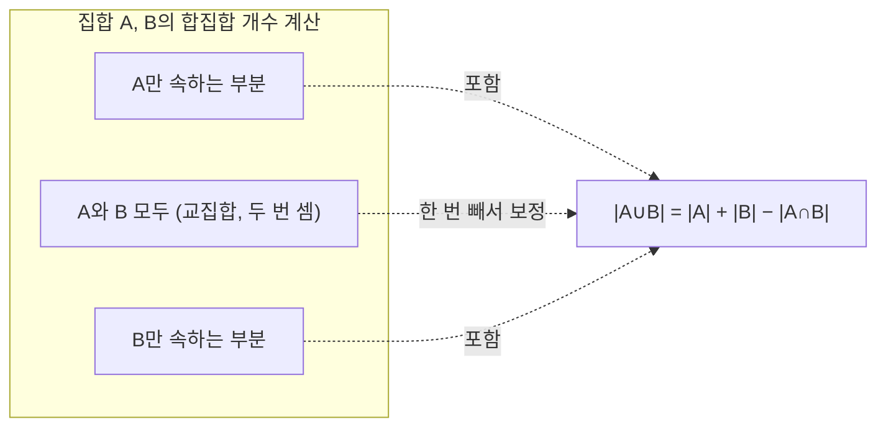

<Callout type="info">
  **이번 문서의 목표:** 이 파일을 다 읽으면 여러 조건을 동시에 만족하는 대상의 개수를 포함배제원리로 중복 없이 계산하고, "무언가는 반드시 겹친다"는 존재 증명을 비둘기집 원리로 할 수 있다.
</Callout>

## 왜 그냥 더하면 안 되는가

09편에서 배운 합의 법칙은 여러 경우가 **서로 겹치지 않을 때만** 성립한다. 그런데 실제 문제에서는 "1부터 100까지 정수 중 3의 배수이거나 5의 배수인 것의 개수"처럼, 두 조건을 만족하는 대상이 서로 겹칠 수 있다(15는 3의 배수이면서 동시에 5의 배수다). 이때 각 조건의 개수를 단순히 더하면 겹치는 부분을 두 번 세는 실수가 생긴다.

> **쉽게 말하면:** 겹치는 부분을 한 번 더했다면, 그만큼 다시 빼주면 정확한 개수가 나온다.

## 두 집합의 포함배제원리

### 정의

집합 $A$, $B$의 합집합의 원소 개수는 각 집합의 원소 개수를 더한 뒤, 겹치는 부분(교집합)을 한 번 빼서 구한다.

$$
|A \cup B| = |A| + |B| - |A \cap B|
$$

- $|A|$ (절댓값 기호를 집합에 쓸 때는 "원소 개수" 또는 기수(cardinality)를 뜻한다): 집합 $A$의 원소 개수
- $A \cup B$ (합집합, union): $A$ 또는 $B$에 속하는 원소 전체
- $A \cap B$ (교집합, intersection): $A$와 $B$ 모두에 속하는 원소

이 공식이 성립하는 이유는 벤 다이어그램으로 보면 직관적이다. $|A|$를 셀 때 교집합 부분이 한 번 포함되고, $|B|$를 셀 때 같은 교집합 부분이 또 한 번 포함되어 총 두 번 세어지므로, 한 번을 빼서 정확히 한 번만 센 것으로 되돌린다.

### 작은 예시로 검산

1부터 30까지 정수 중 3의 배수이거나 4의 배수인 것의 개수를 구해 보자. $A$를 3의 배수 집합, $B$를 4의 배수 집합이라 하면

$$
|A| = \left\lfloor \frac{30}{3} \right\rfloor = 10
$$

- $\lfloor \cdot \rfloor$ (바닥 함수, floor function): 소수점 이하를 버리고 정수 부분만 취하는 함수

$$
|B| = \left\lfloor \frac{30}{4} \right\rfloor = 7
$$

교집합 $A \cap B$는 3과 4의 공배수, 즉 12의 배수 집합이다.

$$
|A \cap B| = \left\lfloor \frac{30}{12} \right\rfloor = 2
$$

이제 포함배제원리를 적용한다.

$$
|A \cup B| = 10 + 7 - 2 = 15
$$

**직접 나열로 검산**: 3의 배수(3,6,9,12,15,18,21,24,27,30 — 10개), 4의 배수(4,8,12,16,20,24,28 — 7개)를 합치면 12와 24가 중복되므로 $10+7-2=15$개(3,4,6,8,9,12,15,16,18,20,21,24,27,28,30)가 실제로 맞는지 세어 보면 정확히 15개다.

## 세 집합의 포함배제원리

### 정의

세 집합 $A$, $B$, $C$의 합집합은 다음과 같이 계산한다.

$$
|A \cup B \cup C| = |A|+|B|+|C| - |A\cap B|-|A\cap C|-|B\cap C| + |A\cap B\cap C|
$$

**계산 순서를 말로 설명하면**: 각 집합을 한 번씩 더하고(1단계), 두 집합씩 겹치는 부분을 각각 한 번씩 빼고(2단계), 마지막으로 세 집합이 모두 겹치는 부분을 다시 한 번 더한다(3단계). 마지막에 다시 더하는 이유는, 세 집합이 모두 겹치는 부분이 1단계에서 세 번 더해졌다가 2단계에서 세 번(두 집합씩 세 쌍) 빠지면서 결국 0번 세어진 상태가 되기 때문에, 정확히 한 번만 세어지도록 다시 더해 주는 것이다.

### 작은 예시로 검산

한 학급 40명 중 국어 학원 다니는 학생 20명, 영어 학원 18명, 수학 학원 15명이 있다. 국어·영어를 함께 다니는 학생 8명, 국어·수학 함께 6명, 영어·수학 함께 5명, 세 과목 모두 다니는 학생 3명일 때, 적어도 한 과목 학원을 다니는 학생 수를 구해 보자.

$$
|A\cup B\cup C| = 20+18+15-8-6-5+3 = 37
$$

**결과 해석**: 40명 중 37명이 적어도 한 과목 학원을 다니므로, 아무 학원도 다니지 않는 학생은 $40-37=3$명이다. 만약 이 값이 40보다 크게 나왔다면 계산 어딘가(특히 부호)에서 실수했다는 신호이므로, 최종 답이 전체 인원 이하인지 확인하는 습관이 좋은 검산이 된다.

## 비둘기집 원리

### 정의 — 기본형

**비둘기집 원리(pigeonhole principle)**: $n$개의 물건을 $k$개의 상자에 나누어 넣을 때, $n > k$이면 적어도 한 상자에는 2개 이상의 물건이 들어간다.

이름의 유래는 "비둘기 $n$마리를 비둘기집 $k$개에 넣을 때 $n>k$이면 적어도 한 집에는 비둘기가 두 마리 이상 들어간다"는 비유에서 왔다. 이 원리는 계산이 아니라 **존재를 증명**하는 도구다. 정확히 어느 상자에 몇 개가 들어가는지는 알려주지 못하지만, "적어도 하나는 겹친다"는 사실만은 확실히 보장한다.

> **쉽게 말하면:** 상자보다 물건이 많으면, 어떻게 나눠 담아도 반드시 한 상자에는 물건이 몰린다.

**증명(귀류법, 모순에 의한 증명 — 05편 참고)**: 만약 모든 상자에 물건이 1개 이하씩만 들어간다고 가정하면, 전체 물건 수는 많아야 $k$개다. 그런데 실제 물건 수는 $n>k$이므로 모순이다. 따라서 적어도 한 상자에는 2개 이상 들어가야 한다.

### 작은 예시로 검산

한 방에 사람이 13명 있으면, 그중 적어도 2명은 태어난 달(month)이 같다는 것을 증명해 보자. 물건은 "사람"(13개), 상자는 "1월~12월"(12개)에 대응시킨다. $n=13 > k=12$이므로 비둘기집 원리에 의해 적어도 한 달에는 2명 이상이 배정된다. 즉 반드시 생일 달이 같은 두 사람이 존재한다.

**검산**: 만약 각 달에 1명씩만 배정하는 것이 가능하다면 최대 12명까지만 채울 수 있는데, 13번째 사람은 어느 달이든 이미 1명이 있는 달에 들어갈 수밖에 없다 — 직접 극단적인 경우를 상상해 봐도 원리가 성립함을 확인할 수 있다.

### 강화형(일반화된 비둘기집 원리)

**강화형**: $n$개의 물건을 $k$개의 상자에 나눌 때, 적어도 한 상자에는 다음 개수 이상이 들어간다.

$$
\left\lceil \frac{n}{k} \right\rceil
$$

- $\lceil \cdot \rceil$ (천장 함수, ceiling function): 소수점 이하를 올림해서 정수로 만드는 함수

**작은 예시**: 100명의 학생을 7개 반에 배정할 때, 적어도 한 반에는 몇 명 이상이 배정되는지 구해 보자.

$$
\left\lceil \frac{100}{7} \right\rceil = \lceil 14.28\ldots \rceil = 15
$$

**결과 해석**: 만약 모든 반에 14명씩만 배정한다면 $14 \times 7 = 98$명까지만 수용되는데, 남은 2명을 배정할 곳은 이미 14명이 있는 반뿐이므로 그 반은 최소 15명이 된다. 이렇게 "가능한 한 균등하게 나눴을 때 한계"를 계산해 보는 것이 강화형 공식을 이해하는 가장 좋은 방법이다.

## 자주 틀리는 점

1. **포함배제에서 부호를 헷갈린다.** 두 집합은 교집합을 **한 번** 빼고, 세 집합은 두 집합씩 교집합을 **모두 빼고** 세 집합 교집합을 **다시 더한다**. 집합 개수가 늘어날수록 더하기·빼기가 번갈아 나온다는 규칙을 기억한다.
2. **"적어도 하나"와 "정확히 하나"를 혼동한다.** 포함배제원리로 구하는 $|A\cup B|$는 "$A$ 또는 $B$에 속하는(적어도 하나의 조건을 만족하는)" 개수이지, "정확히 하나의 조건만 만족하는" 개수가 아니다. 후자를 구하려면 교집합 부분을 별도로 빼야 한다.
3. **비둘기집 원리에서 물건과 상자를 반대로 놓는다.** "더 많은 쪽"이 물건(비둘기), "더 적은 쪽"이 상자(비둘기집)여야 원리가 성립한다. 문제 상황에서 어느 쪽이 셀 대상이고 어느 쪽이 분류 기준인지 먼저 정해야 한다.
4. **강화형 공식에서 나눗셈 후 버림(바닥 함수)을 쓴다.** 강화형은 "적어도 이만큼은 몰린다"는 하한을 구하는 것이므로 올림(천장 함수)을 써야 한다. 버림을 쓰면 실제보다 작은 값이 나와 틀린다.

## 핵심 정리

- 두 집합 포함배제: $|A\cup B| = |A|+|B|-|A\cap B|$. 세 집합은 두 집합씩 뺀 뒤 세 집합 교집합을 다시 더한다.
- 포함배제원리는 중복해서 세어진 부분을 정확히 한 번만 세어지도록 보정하는 도구다.
- 비둘기집 원리 기본형: 물건 수 $n$이 상자 수 $k$보다 많으면($n>k$) 적어도 한 상자에 2개 이상이 들어간다.
- 강화형: 적어도 한 상자에는 $\lceil n/k \rceil$개 이상이 들어간다(천장 함수 사용, 계산의 근거는 균등 배분의 한계를 따지는 것).
- 비둘기집 원리는 정확한 개수가 아니라 "반드시 겹치는 것이 존재한다"는 존재성을 증명하는 도구다.

## 마무리 복습

<Quiz
  questionNumber={1}
  question="1부터 50까지 정수 중 2의 배수이거나 5의 배수인 수의 개수는?"
  options={['25', '30', '35', '20']}
  correctAnswer={2}
  explanation="2의 배수는 25개, 5의 배수는 10개, 10의 배수(교집합)는 5개이므로 포함배제원리로 25+10-5=30이다."
  optionExplanations={['2의 배수 개수만 답한 오답이다.', '정답. 25+10-5=30이다.', '25+10을 그대로 더해 교집합을 빼지 않은 오답이다.', '25-5를 계산한 것으로 근거 없는 오답이다.']}
/>

<Quiz
  questionNumber={2}
  question="포함배제원리에서 세 집합 A, B, C의 합집합 공식으로 옳은 것은?"
  options={['|A|+|B|+|C|', '|A|+|B|+|C|-|A∩B|-|A∩C|-|B∩C|', '|A|+|B|+|C|-|A∩B|-|A∩C|-|B∩C|+|A∩B∩C|', '|A|+|B|+|C|+|A∩B∩C|']}
  correctAnswer={3}
  explanation="두 집합씩 겹치는 부분을 모두 빼고, 세 집합이 동시에 겹치는 부분은 다시 한 번 더해야 정확히 한 번만 세어진다."
  optionExplanations={['겹치는 부분을 전혀 보정하지 않은 오답이다.', '두 집합 교집합만 빼고 세 집합 교집합을 다시 더하지 않아 과소 계산되는 오답이다.', '정답. 표준 포함배제원리 공식이다.', '두 집합 교집합 보정을 아예 빠뜨린 오답이다.']}
/>

<Quiz
  questionNumber={3}
  question="비둘기집 원리의 기본형이 성립하기 위한 조건은?"
  options={['물건 수가 상자 수보다 적을 때', '물건 수가 상자 수와 같을 때', '물건 수가 상자 수보다 많을 때', '상자가 1개뿐일 때만']}
  correctAnswer={3}
  explanation="물건 수 n이 상자 수 k보다 많아야(n이 k보다 큼) 적어도 한 상자에 2개 이상이 들어간다는 결론이 성립한다."
  optionExplanations={['이 경우 모든 물건을 서로 다른 상자에 하나씩 넣을 수 있어 원리가 성립하지 않는 오답이다.', '이 경우도 상자마다 정확히 하나씩 배정 가능해 겹침이 보장되지 않는 오답이다.', '정답. 물건 수가 상자 수보다 큰 것이 기본형의 필요 조건이다.', '상자가 1개인 것은 그 조건을 만족하는 여러 상황 중 하나일 뿐, 일반적인 조건이 아니므로 오답이다.']}
/>

<Quiz
  questionNumber={4}
  question="학생 90명을 8개 조로 나눌 때, 강화형 비둘기집 원리에 의해 적어도 한 조에는 몇 명 이상이 배정되는가?"
  options={['10', '11', '12', '9']}
  correctAnswer={3}
  explanation="천장 함수로 90/8=11.25를 올림하면 12명이다."
  optionExplanations={['90/8을 버림 계산한 오답으로, 강화형은 올림을 써야 한다.', '90을 9로 나눈 값과 혼동한 오답이다.', '정답. 올림(천장 함수)으로 12명이다.', '90/8을 반올림해 정수 부분만 취한 오답이다.']}
/>

<Quiz
  questionNumber={5}
  question="한 동아리 25명 중 축구를 좋아하는 사람 15명, 농구를 좋아하는 사람 12명, 둘 다 좋아하는 사람 6명일 때, 둘 다 좋아하지 않는 사람 수는?"
  options={['0', '2', '4', '6']}
  correctAnswer={3}
  explanation="포함배제원리로 |축구∪농구| = 15+12-6=21이므로, 둘 다 좋아하지 않는 사람은 25-21=4명이다."
  optionExplanations={['21명이 적어도 하나를 좋아하므로 0명은 계산 결과와 맞지 않는 오답이다.', '15+12를 그대로 빼는 등 잘못된 중간 계산에서 나올 수 있는 오답이다.', '정답. 25-(15+12-6)=25-21=4이다.', '15+12-21을 잘못 계산한 값과 혼동한 오답이다.']}
/>

<Quiz
  questionNumber={6}
  question="비둘기집 원리가 알려줄 수 있는 것은?"
  options={['어느 상자에 몇 개가 들어가는지 정확한 값', '적어도 하나의 상자에 물건이 몰린다는 존재성', '모든 상자에 물건이 균등하게 들어간다는 것', '물건 수와 상자 수가 항상 같아진다는 것']}
  correctAnswer={2}
  explanation="비둘기집 원리는 정확한 분배 결과가 아니라, 특정 조건에서 반드시 겹침이 발생한다는 존재성만 보장한다."
  optionExplanations={['원리는 존재성만 보장할 뿐 구체적으로 어느 상자인지는 알려주지 않으므로 오답이다.', '정답. 존재성 증명 도구라는 것이 핵심이다.', '오히려 균등 배분이 불가능함을 보이는 원리이므로 오답이다.', '물건 수가 상자 수보다 커야 한다는 조건일 뿐, 같아진다는 의미는 아니므로 오답이다.']}
/>

## 참고 자료

- [국가평생교육진흥원 독학학위제](https://bdes.nile.or.kr) — 이산수학 출제기준 중 포함배제원리·비둘기집 원리(세기·조합) 항목 확인
