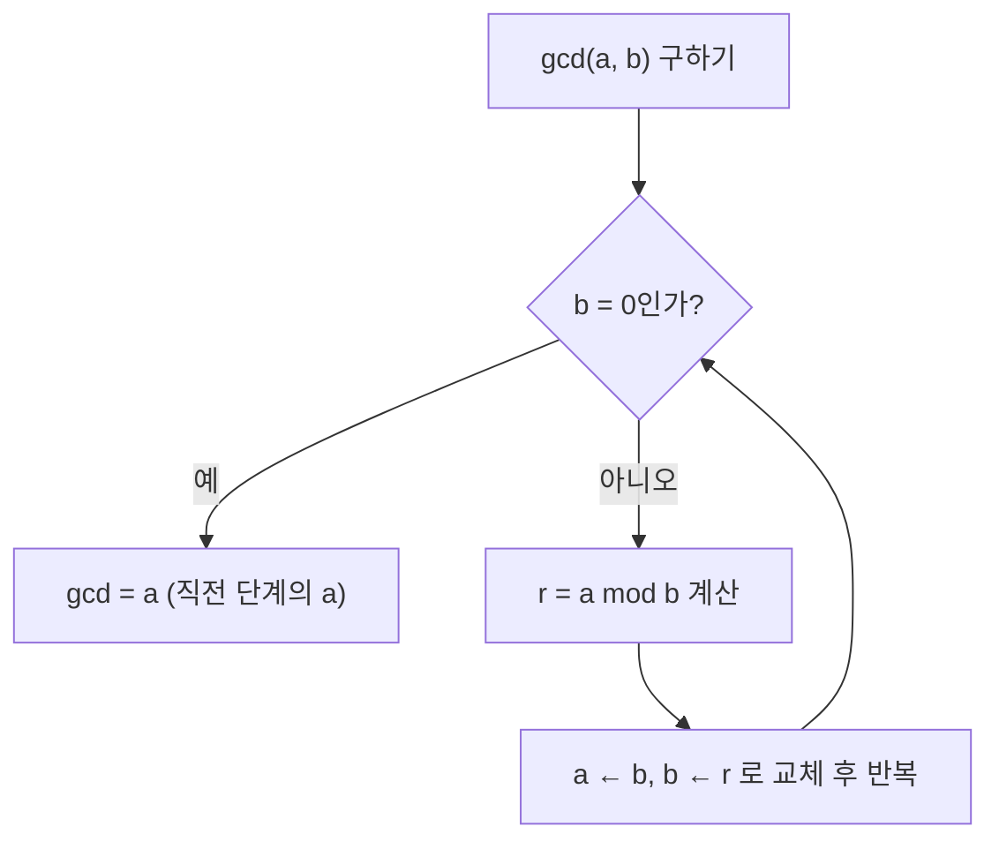

<Callout type="info">
  **이번 문서의 목표:** 이 파일을 다 읽으면 나눗셈 알고리즘의 몫과 나머지를 정의대로 계산하고, 유클리드 알고리즘으로 최대공약수를 빠르게 구하며, 합동식을 이용해 나머지 관련 문제를 풀 수 있다.
</Callout>

## 왜 정수론을 이산수학에서 다루는가

**정수론**(number theory)은 정수의 성질(나누어떨어짐, 소수, 나머지 등)을 다루는 수학 분야다. 이산수학에서는 이후 단원(점화식의 초기조건, 그래프의 색칠수 계산, 암호학의 기초)에서 정수의 나눗셈·합동 개념이 반복해서 등장하므로, 여기서 기본기를 확실히 다져야 한다. 특히 **수학적 귀납법**(05편)으로 정수의 성질을 증명하는 연습은 이후 단원의 증명 문제와 직결된다.

> **쉽게 말하면:** 정수론은 "나누어떨어진다", "나머지가 같다" 같은 관계를 정확한 언어로 다루는 도구 상자다.

## 나눗셈 알고리즘

### 정의

**나눗셈 알고리즘(division algorithm)**: 정수 $a$와 양의 정수 $d$가 주어지면, 다음을 만족하는 정수 $q$(몫, quotient)와 $r$(나머지, remainder)가 유일하게 존재한다.

$$
a = d \cdot q + r, \quad 0 \le r < d
$$

- $a$: 나뉘는 수(피제수, dividend)
- $d$: 나누는 수(제수, divisor)
- $q$: 몫 — $a$를 $d$로 나눌 때 몇 번 들어가는지
- $r$: 나머지 — 나누고 남은 값. 반드시 0 이상 $d$ 미만이어야 유일하게 정해진다.

**나누어떨어진다**(divides)는 개념도 여기서 정의한다. 정수 $a$가 정수 $b$를 나누어떨어지게 한다는 것은 $b = a \cdot k$를 만족하는 정수 $k$가 존재한다는 뜻이며, 기호로 $a \mid b$(에이 디바이즈 비, "a는 b를 나눈다")라고 쓴다. 나눗셈 알고리즘의 언어로 말하면 $a \mid b$는 $b$를 $a$로 나눈 나머지 $r$이 정확히 0이라는 것과 같다.

### 작은 예시로 검산

$a = 47$, $d = 6$일 때 몫과 나머지를 구해 보자. $6 \times 7 = 42$이고 $6 \times 8 = 48$이므로 $47$은 $6$으로 나눴을 때 몫이 7이다.

$$
47 = 6 \times 7 + 5
$$

나머지 $r=5$는 $0 \le 5 < 6$ 조건을 만족하므로 올바른 값이다. **흔한 함정**: 음수를 나눌 때 나머지가 음수가 되면 안 된다. 예를 들어 $a=-7$, $d=3$이면 $-7 = 3 \times (-3) + 2$로 써야 한다($q=-2$로 두면 $r=-1$이 되어 $0 \le r < d$ 조건을 어긴다).

$$
-7 = 3 \times (-3) + 2
$$

## 최대공약수와 최소공배수

### 정의

**최대공약수(greatest common divisor, GCD)**: 두 정수 $a$, $b$(둘 다 0은 아님)를 동시에 나누어떨어지게 하는 양의 정수 중 가장 큰 값. 기호는 $\gcd(a,b)$.

**최소공배수(least common multiple, LCM)**: 두 정수 $a$, $b$의 공통 배수 중 가장 작은 양의 정수. 기호는 $\operatorname{lcm}(a,b)$.

두 값 사이에는 다음 관계가 성립한다.

$$
\gcd(a,b) \times \operatorname{lcm}(a,b) = a \times b
$$

### 유클리드 알고리즘

작은 수라면 약수를 나열해서 최대공약수를 찾을 수 있지만, 큰 수에서는 비효율적이다. **유클리드 알고리즘**(Euclidean algorithm)은 다음 성질을 반복 적용해 최대공약수를 빠르게 구한다.

$$
\gcd(a,b) = \gcd(b, a \bmod b)
$$

- $a \bmod b$ (모듈로, modulo): $a$를 $b$로 나눈 나머지

이 성질이 성립하는 이유는, $a$와 $b$의 공약수는 $b$와 $a \bmod b$의 공약수와 정확히 같기 때문이다($a = bq + r$이면 $a$와 $b$를 모두 나누는 수는 $r = a - bq$도 나눈다). 이 과정을 나머지가 0이 될 때까지 반복하면, 마지막으로 나눈 수(나머지가 0이 되기 직전의 $b$ 값)가 바로 최대공약수다.

### 작은 예시로 검산

$\gcd(252, 105)$를 유클리드 알고리즘으로 구해 보자.

**1단계**

$$
252 = 105 \times 2 + 42
$$

**2단계**: 이제 $\gcd(105, 42)$를 구한다.

$$
105 = 42 \times 2 + 21
$$

**3단계**: 이제 $\gcd(42, 21)$을 구한다.

$$
42 = 21 \times 2 + 0
$$

나머지가 0이 되었으므로 직전에 나눈 수 $21$이 최대공약수다.

$$
\gcd(252, 105) = 21
$$

**검산**: $252 = 21 \times 12$, $105 = 21 \times 5$이고 $12$와 $5$는 공약수가 1뿐이므로(서로소) 21이 실제로 최대공약수임을 확인할 수 있다. 최소공배수도 앞의 관계식으로 검산하면

$$
\operatorname{lcm}(252,105) = \frac{252 \times 105}{21} = \frac{26460}{21} = 1260
$$

이 나오고, $1260 = 252 \times 5 = 105 \times 12$로 실제 공배수임이 확인된다.

## 정수의 합동

### 정의

정수 $a$, $b$가 양의 정수 $m$에 대해 **합동**(congruent)이라는 것은 $a-b$가 $m$으로 나누어떨어진다는 뜻이며, 다음과 같이 쓴다.

$$
a \equiv b \pmod{m}
$$

- $\equiv$ (합동 기호, congruent to): "왼쪽과 오른쪽이 $m$으로 나눈 나머지가 같다"는 뜻
- $\pmod{m}$: 이 관계가 법(modulus) $m$ 기준이라는 표시

$a \equiv b \pmod m$은 $a$와 $b$를 $m$으로 나눈 **나머지가 서로 같다**는 것과 동치다. 이 관계는 08편에서 배운 **동치 관계**(equivalence relation)의 대표 예시이기도 하다 — 반사성($a \equiv a$), 대칭성($a\equiv b \Rightarrow b \equiv a$), 추이성($a\equiv b, b\equiv c \Rightarrow a\equiv c$)을 모두 만족하며, 이 동치 관계로 정수 전체를 $m$개의 동치류(나머지 0, 1, ..., $m-1$인 그룹)로 나눌 수 있다.

### 작은 예시로 검산

$17 \equiv 5 \pmod{12}$가 성립하는지 확인해 보자. $17-5=12$이고 $12$는 $12$로 나누어떨어지므로 성립한다.

$$
17 \equiv 5 \pmod{12}
$$

**결과 해석**: 이 예는 시계 산술(clock arithmetic)과 같다. 시계에서 17시는 오후 5시와 같은 위치를 가리키는데(12시간마다 순환), 이것이 정확히 "12로 나눈 나머지가 같다"는 합동 관계다.

**합동식의 연산 성질**: $a \equiv b \pmod m$이고 $c \equiv d \pmod m$이면 $a+c \equiv b+d \pmod m$이고 $a \times c \equiv b \times d \pmod m$이다. 이 성질을 이용하면 큰 수의 나머지를 직접 나누지 않고도 구할 수 있다.

**응용 예시**: $2^{10}$을 7로 나눈 나머지를 구해 보자. 직접 $2^{10}=1024$를 계산해도 되지만, 합동식을 쓰면 더 빠르다. $2^3 = 8 \equiv 1 \pmod 7$이므로

$$
2^{10} = 2^{9} \times 2 = (2^3)^3 \times 2 \equiv 1^3 \times 2 \equiv 2 \pmod 7
$$

**검산**: $1024 = 7 \times 146 + 2$이므로 실제로 나머지가 2임이 확인된다.

$$
1024 = 7 \times 146 + 2
$$

## 간단한 정수 방정식(1차 디오판토스 방정식)

### 정의

$ax + by = c$ 꼴의 방정식에서 $x, y$의 **정수해**를 구하는 문제를 **1차 디오판토스 방정식**(linear Diophantine equation)이라 한다. 이 방정식이 정수해를 가지려면 $\gcd(a,b)$가 $c$를 나누어떨어지게 해야 한다는 것이 알려진 조건이다.

### 작은 예시로 검산

$6x + 9y = 15$가 정수해를 갖는지 확인해 보자. $\gcd(6,9)=3$이고 $3$은 $15$를 나누어떨어지게 하므로($15 = 3 \times 5$) 정수해가 존재한다.

$$
\gcd(6, 9) = 3, \quad 15 \div 3 = 5
$$

실제로 $x=1, y=1$을 대입하면 $6(1)+9(1)=15$로 성립함을 바로 확인할 수 있다. 반대로 $6x+9y=10$은 $\gcd(6,9)=3$이 $10$을 나누어떨어지게 하지 못하므로($10 \div 3$이 정수가 아님) 정수해가 존재하지 않는다.

## 자주 틀리는 점

1. **나머지를 음수로 남긴다.** 나눗셈 알고리즘의 나머지는 항상 $0 \le r < d$ 범위여야 한다. 음수를 나눌 때 특히 주의한다.
2. **유클리드 알고리즘에서 몫을 잘못 계산해 나머지가 틀어진다.** 각 단계마다 나머지가 나누는 수보다 작은지 확인하는 습관을 들인다.
3. **합동 기호($\equiv$)를 등호($=$)처럼 아무 데나 나눗셈에 쓴다.** 합동식은 나머지가 같다는 관계일 뿐, 양변을 함부로 나눌 수는 없다(나누려면 나누는 수가 법 $m$과 서로소여야 한다는 조건이 따로 필요하다).
4. **디오판토스 방정식의 정수해 존재 조건을 확인하지 않고 바로 대입만 시도한다.** $\gcd(a,b)$가 $c$를 나누지 못하면 아무리 대입해도 정수해를 찾을 수 없으므로, 먼저 조건을 확인하는 것이 시간을 아끼는 방법이다.

## 핵심 정리

- 나눗셈 알고리즘: $a = dq+r$, $0 \le r < d$를 만족하는 몫 $q$와 나머지 $r$이 유일하게 존재한다.
- 유클리드 알고리즘: $\gcd(a,b)=\gcd(b, a \bmod b)$를 나머지가 0이 될 때까지 반복하면 최대공약수를 구한다. $\gcd \times \operatorname{lcm} = a \times b$.
- 합동 $a \equiv b \pmod m$은 $a-b$가 $m$으로 나누어떨어진다는 뜻이며, $m$으로 나눈 나머지가 같다는 것과 동치인 동치 관계다.
- 1차 디오판토스 방정식 $ax+by=c$는 $\gcd(a,b)$가 $c$를 나누어떨어지게 할 때만 정수해를 갖는다.

## 마무리 복습

<Quiz
  questionNumber={1}
  question="a=-11, d=4일 때 나눗셈 알고리즘을 만족하는 몫 q와 나머지 r은?"
  options={['q=-2, r=-3', 'q=-3, r=1', 'q=-2, r=3', 'q=-3, r=-1']}
  correctAnswer={2}
  explanation="나머지는 0 이상 4 미만이어야 하므로 -11 = 4×(-3) + 1로 써야 하며, q=-3, r=1이다."
  optionExplanations={['나머지가 음수(-3)이므로 0≤r<d 조건을 어긴 오답이다.', '정답. -11=4×(-3)+1이며 0≤1<4를 만족한다.', 'q=-2로 두면 -11=4×(-2)+r에서 r=-3이 되어 조건을 어기므로 오답이다.', '나머지가 음수(-1)이므로 조건을 어긴 오답이다.']}
/>

<Quiz
  questionNumber={2}
  question="유클리드 알고리즘으로 gcd(180, 48)을 구한 값은?"
  options={['6', '12', '24', '36']}
  correctAnswer={2}
  explanation="180=48×3+36, 48=36×1+12, 36=12×3+0이므로 최대공약수는 12이다."
  optionExplanations={['나눗셈 과정 중간 계산 실수로 나올 수 있는 오답이다.', '정답. 180과 48을 반복 나눈 결과 최종 나머지 직전 값이 12이다.', '48을 그대로 답한 오답이다.', '180과 48의 최소공배수 관련 계산과 혼동한 오답이다.']}
/>

<Quiz
  questionNumber={3}
  question="gcd(a,b)×lcm(a,b) = a×b라는 관계를 이용해 gcd(14,21)=7일 때 lcm(14,21)의 값은?"
  options={['42', '14', '21', '294']}
  correctAnswer={1}
  explanation="lcm = (14×21)/7 = 294/7 = 42이다."
  optionExplanations={['정답. 294÷7=42이다.', '14를 그대로 답한 오답이다.', '21을 그대로 답한 오답이다.', '나눗셈을 하지 않고 곱셈 결과(14×21)만 답한 오답이다.']}
/>

<Quiz
  questionNumber={4}
  question="23 ≡ x (mod 6)을 만족하는 0 이상 6 미만의 x는?"
  options={['3', '5', '2', '4']}
  correctAnswer={2}
  explanation="23을 6으로 나누면 23=6×3+5이므로 나머지가 5이고, 따라서 x=5일 때 합동이 성립한다."
  optionExplanations={['23÷6의 몫(3)을 나머지로 착각한 오답이다.', '정답. 23=6×3+5이므로 나머지는 5이다.', '계산 실수로 나올 수 있는 오답이다.', '계산 실수로 나올 수 있는 오답이다.']}
/>

<Quiz
  questionNumber={5}
  question="1차 디오판토스 방정식 8x+12y=20이 정수해를 갖는 이유로 옳은 것은?"
  options={['x, y가 모두 양수이기 때문에', 'gcd(8,12)=4가 20을 나누어떨어지게 하기 때문에', '8과 12가 모두 짝수이기 때문에', '20이 8보다 크기 때문에']}
  correctAnswer={2}
  explanation="gcd(8,12)=4이고 20=4×5이므로 4가 20을 나누어떨어지게 하여 정수해 존재 조건을 만족한다."
  optionExplanations={['x, y의 부호는 정수해 존재 여부와 무관하므로 오답이다.', '정답. gcd(8,12)=4가 20을 나눈다는 조건이 핵심이다.', '짝수 여부 자체는 존재 조건의 직접적인 근거가 아니므로 오답이다.', '크기 비교는 정수해 존재와 무관하므로 오답이다.']}
/>

<Quiz
  questionNumber={6}
  question="합동식의 성질을 이용해 2^11을 5로 나눈 나머지를 구하면?"
  options={['1', '2', '3', '4']}
  correctAnswer={3}
  explanation="2^4=16≡1 (mod 5)이므로 2^11=2^8×2^3≡1^2×8≡8≡3 (mod 5)이다."
  optionExplanations={['2^4≡1을 잘못 적용한 오답이다.', '2^1의 나머지와 혼동한 오답이다.', '정답. 2^11 mod 5 = 3이다(2048=5×409+3으로 직접 검산 가능).', '2^2=4를 그대로 답한 오답이다.']}
/>

<Quiz
  questionNumber={7}
  question="정수 a, b에 대해 a∣b(a는 b를 나눈다)의 정의로 옳은 것은?"
  options={['a는 b보다 작은 정수이다', 'b=a×k를 만족하는 정수 k가 존재한다', 'a와 b의 최대공약수가 1이다', 'a를 b로 나누면 나머지가 0이다']}
  correctAnswer={2}
  explanation="a가 b를 나눈다는 것은 b=a×k인 정수 k가 존재한다는 뜻이며, 이는 b를 a로 나눈 나머지가 0이라는 것과 동치다."
  optionExplanations={['크기 비교는 나눔의 정의와 무관하므로 오답이다.', '정답. b=ak를 만족하는 정수 k의 존재가 정의다.', '최대공약수가 1인 것은 서로소의 정의이지 나눔의 정의가 아니므로 오답이다.', '나누는 방향이 반대(b를 a로 나눈 것이어야 함)로 서술되어 있어 정확한 정의 표현이 아니므로 오답이다.']}
/>

## 참고 자료

- [국가평생교육진흥원 독학학위제](https://bdes.nile.or.kr) — 이산수학 출제기준 중 정수론 기초(나눗셈 알고리즘, 유클리드 알고리즘, 합동) 항목 확인
