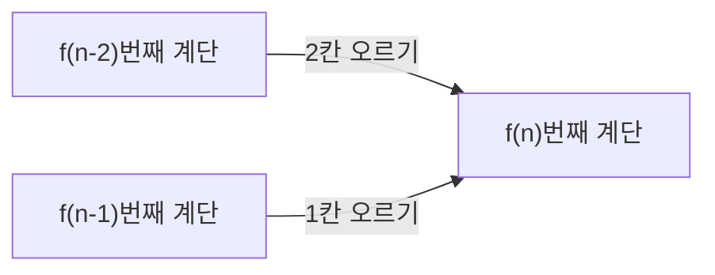

<Callout type="info">
  **이번 문서의 목표:** 이 파일을 다 읽으면 수열을 명시적 공식과 재귀적 정의(점화식) 두 가지 방식으로 표현할 수 있고, 간단한 점화식을 직접 대입해 계산하며, 수학적 귀납법으로 그 결과를 증명할 수 있다.
</Callout>

## 왜 재귀적으로 정의하는가

09~11편에서는 조합이나 정수처럼 "한 번에 계산되는" 값들을 다뤘다. 그런데 실제 문제 중에는 "이번 항이 바로 앞 항에 의해 결정되는" 구조가 많다. 예를 들어 계단을 한 칸 또는 두 칸씩 오를 때 $n$번째 계단까지 오르는 방법의 수는, $n-1$번째까지의 방법 수와 $n-2$번째까지의 방법 수를 알면 바로 계산할 수 있다(마지막 한 걸음이 한 칸이었는지 두 칸이었는지로 나뉘기 때문이다). 이렇게 **이전 항으로 다음 항을 정의하는 방식**이 점화관계이며, 명시적 공식을 찾기 어려운 문제도 점화식으로는 쉽게 표현되는 경우가 많다.

> **쉽게 말하면:** 점화식은 "다음 항 = 이전 항들로 만든 규칙"이라는 재귀적인 설계도다.

## 수열의 정의와 표현

### 정의

**수열**(sequence)은 자연수(또는 0 이상의 정수) 집합을 정의역으로 하는 함수로, 각 항을 $a_1, a_2, a_3, \ldots$ 또는 $a_0, a_1, a_2, \ldots$처럼 아래첨자(인덱스, index)로 나타낸다. 수열을 나타내는 방법은 크게 두 가지다.

**명시적 공식(closed-form formula)**: 항의 번호 $n$을 대입하면 바로 그 항의 값이 나오는 공식. 예: $a_n = 3n+1$.

**재귀적 정의(recursive definition, 점화관계)**: 처음 몇 항의 값(초기조건, initial condition)과 이전 항들로 다음 항을 구하는 규칙(점화식, recurrence relation)으로 수열을 정의하는 방식.

### 작은 예시로 검산

$a_1 = 2$, $a_n = a_{n-1} + 3$ ($n \ge 2$)로 정의된 수열의 처음 5개 항을 구해 보자.

$$
a_1 = 2
$$

$$
a_2 = a_1 + 3 = 2+3 = 5
$$

$$
a_3 = a_2 + 3 = 5+3 = 8
$$

$$
a_4 = a_3 + 3 = 8+3 = 11
$$

$$
a_5 = a_4 + 3 = 11+3 = 14
$$

**결과 해석**: 이 수열은 2, 5, 8, 11, 14로, 매번 3씩 커지는 등차수열이다. 명시적 공식으로 바꾸면 $a_n = 2 + 3(n-1) = 3n-1$이며, $n=5$를 대입하면 $3(5)-1=14$로 재귀적 정의 결과와 일치한다.

## 등차수열과 등비수열의 점화식

### 등차수열

**등차수열**(arithmetic sequence)은 이웃한 두 항의 차(공차, common difference)가 항상 일정한 수열이다. 점화식으로는 $a_n = a_{n-1} + d$ (단, $d$는 공차)로 쓰고, 명시적 공식은

$$
a_n = a_1 + (n-1)d
$$

이다. 이 공식이 성립하는 이유는 $a_1$에서 시작해 $a_n$까지 가려면 공차를 $(n-1)$번 더해야 하기 때문이다.

### 등비수열

**등비수열**(geometric sequence)은 이웃한 두 항의 비(공비, common ratio)가 항상 일정한 수열이다. 점화식은 $a_n = r \cdot a_{n-1}$(단, $r$은 공비)이고, 명시적 공식은

$$
a_n = a_1 \cdot r^{n-1}
$$

이다. $a_1$에 공비 $r$을 $(n-1)$번 곱해야 $a_n$에 도달하기 때문이다.

### 작은 예시로 검산

$a_1 = 3$, 공비 $r=2$인 등비수열의 6번째 항을 점화식과 명시적 공식 두 가지로 구해 검산해 보자.

**점화식으로 하나씩 계산**: $3, 6, 12, 24, 48, 96$이므로 $a_6 = 96$이다.

**명시적 공식으로 계산**:

$$
a_6 = 3 \times 2^{6-1} = 3 \times 32 = 96
$$

두 방법의 결과가 96으로 일치한다.

## 재귀적 정의(계단 오르기 예제)

### 정의

$n$번째 계단까지 한 번에 1칸 또는 2칸씩 오르는 방법의 수를 $f(n)$이라 하자. 마지막 한 걸음을 기준으로 나눠 생각하면, 마지막 걸음이 1칸이었다면 그 전까지는 $f(n-1)$가지 방법으로 $n-1$번째 계단에 있었을 것이고, 마지막 걸음이 2칸이었다면 $f(n-2)$가지 방법으로 $n-2$번째 계단에 있었을 것이다. 이 두 경우는 서로 배타적이므로(합의 법칙, 09편 참고) 다음 점화식이 성립한다.

$$
f(n) = f(n-1) + f(n-2), \quad n \ge 3
$$

초기조건은 $f(1)=1$(1칸짜리 계단은 1칸으로 오르는 방법 1가지), $f(2)=2$(2칸짜리 계단은 "1칸+1칸" 또는 "2칸"의 2가지)다.

### 작은 예시로 검산

$f(6)$을 구해 보자.

$$
f(3) = f(2)+f(1) = 2+1 = 3
$$

$$
f(4) = f(3)+f(2) = 3+2 = 5
$$

$$
f(5) = f(4)+f(3) = 5+3 = 8
$$

$$
f(6) = f(5)+f(4) = 8+5 = 13
$$

**결과 해석**: 1, 2, 3, 5, 8, 13으로 이어지는 이 수열은 **피보나치 수열**(Fibonacci sequence)과 정확히 같은 규칙이다. 계단 오르기 문제가 왜 피보나치 수열과 같은 답을 가지는지는, 두 문제 모두 "바로 앞 두 상태의 합으로 다음 상태가 정해진다"는 같은 재귀 구조를 가지기 때문이다. $n=6$일 때 직접 6칸을 1칸·2칸 조합으로 나열해 세어 보면(1+1+1+1+1+1, 2+1+1+1+1, 1+2+1+1+1, … 등) 실제로 13가지가 나오는 것을 확인할 수 있다(전부 나열하는 것은 번거롭지만 원리상 검증 가능하다는 뜻이다).

## 점화식과 수학적 귀납법의 연결

점화식으로 정의된 수열의 명시적 공식을 "추측"했다면, 그 추측이 **모든 $n$에 대해** 성립하는지는 **수학적 귀납법**(05편 참고)으로 증명해야 한다. 절차는 다음과 같다.

<Steps>
1. **기초 단계(base case)**: $n$이 초기값일 때 추측한 공식이 점화식의 초기조건과 일치하는지 확인한다.
2. **귀납 가정(induction hypothesis)**: $n=k$일 때 공식이 성립한다고 가정한다.
3. **귀납 단계(induction step)**: $n=k+1$일 때도 공식이 성립함을, 점화식과 귀납 가정을 이용해 유도한다.
4. **결론**: 1~3단계로 모든 $n \ge$ 초기값에 대해 공식이 성립함이 증명된다.
</Steps>

### 작은 예시로 검산

앞의 등차수열 $a_1=2$, $a_n=a_{n-1}+3$에 대해 명시적 공식 $a_n = 3n-1$이 모든 $n \ge 1$에서 성립함을 수학적 귀납법으로 증명해 보자.

**기초 단계**: $n=1$일 때 공식 값은 $3(1)-1=2$이고, 정의된 초기조건 $a_1=2$와 일치한다.

**귀납 가정**: $n=k$일 때 $a_k = 3k-1$이 성립한다고 가정한다.

**귀납 단계**: 점화식 $a_{k+1}=a_k+3$에 귀납 가정을 대입하면

$$
a_{k+1} = (3k-1)+3 = 3k+2 = 3(k+1)-1
$$

이므로 $n=k+1$일 때도 공식이 성립한다.

**결론**: 기초 단계와 귀납 단계가 모두 확인되었으므로, 수학적 귀납법에 의해 모든 $n\ge1$에 대해 $a_n=3n-1$이 성립한다.

## 자주 틀리는 점

1. **초기조건을 빠뜨리고 점화식만 쓴다.** 점화식만으로는 수열이 유일하게 정해지지 않는다. 반드시 시작 항의 값을 명시해야 한다.
2. **재귀적 정의와 명시적 공식을 혼동한다.** 점화식은 "이전 항을 알아야 계산 가능"하고, 명시적 공식은 "번호만 알면 바로 계산 가능"하다는 차이를 구분해야 한다.
3. **귀납법의 귀납 단계에서 점화식을 쓰지 않고 그냥 공식을 대입해 검산하듯 넘어간다.** 귀납 단계는 반드시 점화식(재귀 정의)과 귀납 가정을 명시적으로 사용해 $n=k+1$의 값을 유도해야 하며, 단순히 공식이 맞다고 확인하는 것으로는 증명이 되지 않는다.
4. **계단 오르기 같은 조합적 점화식을 세울 때 마지막 단계가 아니라 첫 단계를 기준으로 나눈다.** 첫 단계로 나누면 이후 상태들이 서로 겹치거나 세는 기준이 꼬이기 쉬우므로, 마지막 선택을 기준으로 나누는 습관이 점화식을 세우는 표준 방법이다.

## 핵심 정리

- 수열은 명시적 공식(번호로 즉시 계산)과 재귀적 정의(이전 항 + 초기조건)로 표현할 수 있다.
- 등차수열 점화식 $a_n=a_{n-1}+d$의 명시적 공식은 $a_n=a_1+(n-1)d$, 등비수열 점화식 $a_n=r a_{n-1}$의 명시적 공식은 $a_n=a_1 r^{n-1}$이다.
- 계단 오르기처럼 "마지막 선택"을 기준으로 경우를 나누면 $f(n)=f(n-1)+f(n-2)$ 같은 점화식을 세울 수 있으며, 이는 피보나치 수열과 같은 구조다.
- 점화식에서 얻은 명시적 공식의 정당성은 수학적 귀납법(기초 단계 + 귀납 단계)으로 증명한다.

## 마무리 복습

<Quiz
  questionNumber={1}
  question="a1=5, an=an-1+4 (n≥2)로 정의된 수열의 4번째 항은?"
  options={['13', '17', '9', '21']}
  correctAnswer={2}
  explanation="a2=9, a3=13, a4=17이므로 4번째 항은 17이다."
  optionExplanations={['3번째 항 값이므로 오답이다.', '정답. 5+4+4+4=17이다.', '2번째 항 값이므로 오답이다.', '한 단계 더 진행한 5번째 항 값이므로 오답이다.']}
/>

<Quiz
  questionNumber={2}
  question="점화식과 명시적 공식의 차이에 대한 설명으로 옳은 것은?"
  options={['점화식은 초기조건 없이도 수열을 유일하게 정한다', '명시적 공식은 이전 항의 값을 몰라도 번호만으로 항을 계산할 수 있다', '점화식과 명시적 공식은 항상 같은 형태로 쓰인다', '명시적 공식은 재귀적 정의라고도 부른다']}
  correctAnswer={2}
  explanation="명시적 공식은 an=f(n) 형태로 번호 n만 대입하면 항의 값이 바로 나온다는 것이 핵심 특징이다."
  optionExplanations={['점화식은 초기조건이 있어야 수열이 유일하게 정해지므로 오답이다.', '정답. 명시적 공식의 정의와 일치한다.', '두 표현 방식은 형태가 다르므로 오답이다.', '재귀적 정의는 점화식 쪽을 가리키는 용어이므로 오답이다.']}
/>

<Quiz
  questionNumber={3}
  question="계단 오르기 점화식 f(n)=f(n-1)+f(n-2), f(1)=1, f(2)=2에서 f(7)의 값은?"
  options={['13', '18', '21', '34']}
  correctAnswer={3}
  explanation="f(3)=3, f(4)=5, f(5)=8, f(6)=13, f(7)=21이므로 정답은 21이다."
  optionExplanations={['f(6)의 값이므로 오답이다.', '13과 5를 잘못 더한 계산 실수로 나올 수 있는 오답이다.', '정답. f(6)+f(5)=13+8=21이다.', 'f(8)의 값이므로 한 단계 더 진행한 오답이다.']}
/>

<Quiz
  questionNumber={4}
  question="첫째항이 4, 공비가 3인 등비수열의 5번째 항은?"
  options={['243', '324', '81', '108']}
  correctAnswer={2}
  explanation="an=4×3^(n-1)에 n=5를 대입하면 4×3^4=4×81=324이다."
  optionExplanations={['3^5=243을 그대로 답한 오답으로 첫째항 4를 곱하지 않았다.', '정답. 4×81=324이다.', '3^4=81을 그대로 답한 오답으로 첫째항을 곱하지 않았다.', '4×27을 계산한 값으로 지수를 잘못 적용한 오답이다.']}
/>

<Quiz
  questionNumber={5}
  question="an=3n-1이 점화식 a1=2, an=an-1+3의 명시적 공식임을 수학적 귀납법으로 증명할 때, 귀납 단계에서 반드시 사용해야 하는 것은?"
  options={['n=1일 때 공식 값 확인', '점화식 an=an-1+3과 귀납 가정 ak=3k-1', '수열의 모든 항을 직접 나열', '공비를 이용한 등비수열 공식']}
  correctAnswer={2}
  explanation="귀납 단계는 점화식과 귀납 가정(n=k일 때 성립한다는 가정)을 이용해 n=k+1일 때도 성립함을 유도하는 단계다."
  optionExplanations={['이는 기초 단계에서 확인하는 내용이므로 오답이다.', '정답. 귀납 단계의 핵심 도구는 점화식과 귀납 가정이다.', '모든 항을 나열하는 것은 유한한 경우만 확인하는 것이라 귀납 증명이 아니므로 오답이다.', '이 수열은 등차수열이므로 공비 개념은 해당하지 않는 오답이다.']}
/>

<Quiz
  questionNumber={6}
  question="수열을 재귀적으로 정의할 때 반드시 함께 제시해야 하는 것은?"
  options={['공비', '초기조건', '수렴 여부', '그래프']}
  correctAnswer={2}
  explanation="점화식만으로는 수열이 유일하게 정해지지 않으므로, 시작 항의 값(초기조건)을 반드시 함께 제시해야 한다."
  optionExplanations={['공비는 등비수열에서만 필요한 값이므로 일반적인 필수 요소가 아니다.', '정답. 초기조건이 없으면 점화식만으로는 수열이 정해지지 않는다.', '유한 수열이나 발산하는 수열도 재귀적으로 정의될 수 있으므로 필수 요소가 아니다.', '그래프는 시각화 도구일 뿐 정의에 필수적이지 않으므로 오답이다.']}
/>

## 참고 자료

- [국가평생교육진흥원 독학학위제](https://bdes.nile.or.kr) — 이산수학 출제기준 중 점화관계(수열의 재귀적 정의, 등차·등비 점화식) 항목 확인
