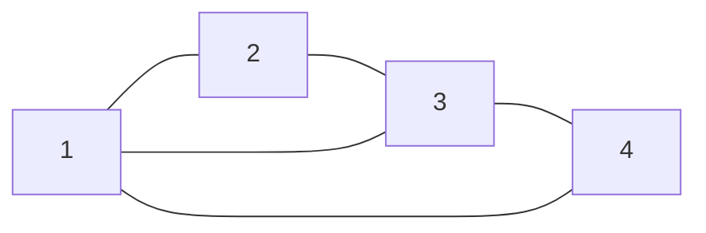
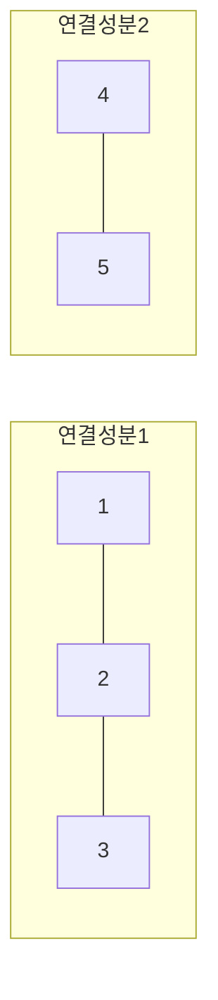

<Callout type="info">
  **이번 문서의 목표:** 이 파일을 다 읽으면 그래프를 정점·간선·차수로 정확히 정의하고, 인접행렬·인접리스트로 표현을 바꿔 쓰며, 두 그래프가 동형인지 손으로 판정할 수 있다.
</Callout>

## 왜 그래프인가 — 관계를 그림으로

7편에서 배운 관계(relation)는 집합의 원소들 사이의 연결을 순서쌍의 집합으로 표현했다. 그래프(graph)는 이 연결 관계를 **그림으로 시각화**한 것이다. SNS 친구 관계, 지하철 노선도, 인터넷 링크 구조, 도로망 모두 "무언가와 무언가가 연결되어 있다"는 정보이고, 이를 수학적으로 다루는 도구가 그래프다.

> **쉽게 말하면:** 그래프는 점 몇 개(정점)와 그 점들을 잇는 선 몇 개(간선)로 이루어진 구조다.

## 그래프의 정의: 정점과 간선

**그래프** $G = (V, E)$는 두 개의 집합으로 이루어진다.

- $V$ (Vertex set, 정점 집합): 점들의 집합. 원소 하나하나를 **정점**(vertex, 복수형 vertices) 또는 **노드**(node)라 부른다.
- $E$ (Edge set, 간선 집합): 정점 두 개를 잇는 선들의 집합. 원소 하나하나를 **간선**(edge)이라 부른다.

이 편에서는 가장 기본이 되는 **단순 무방향 그래프**(simple undirected graph)를 중심으로 다룬다. "무방향"은 간선에 방향이 없어서 $\{u, v\}$가 $u$에서 $v$로도, $v$에서 $u$로도 똑같이 해석된다는 뜻이고, "단순"은 자기 자신을 잇는 간선(자기루프, self-loop)이나 같은 두 정점을 잇는 간선이 두 개 이상(다중간선, multi-edge) 있는 경우를 제외한다는 뜻이다.

예를 들어 정점 집합 $V = \{1, 2, 3, 4\}$, 간선 집합 $E = \{\{1,2\}, \{2,3\}, \{3,4\}, \{4,1\}, \{1,3\}\}$인 그래프는 다음과 같이 그릴 수 있다.

## 인접과 차수

두 정점 $u$, $v$ 사이에 간선 $\{u,v\}$가 있으면, $u$와 $v$는 서로 **인접**(adjacent)한다고 말하고, 이 간선은 $u$와 $v$에 **부속**(incident)한다고 말한다.

**차수**(degree)는 한 정점에 붙어 있는 간선의 개수다. 정점 $v$의 차수는 $\deg(v)$로 쓴다.

위 그래프 예시에서 각 정점의 차수를 표로 세어 보자.

| 정점 | 부속한 간선 | 차수 |
|------|-------------|------|
| 1 | `{1,2}`, `{4,1}`, `{1,3}` | 3 |
| 2 | `{1,2}`, `{2,3}` | 2 |
| 3 | `{2,3}`, `{3,4}`, `{1,3}` | 3 |
| 4 | `{3,4}`, `{4,1}` | 2 |

### 악수 정리(핸드셰이킹 정리, Handshaking Lemma)

> **쉽게 말하면:** 모든 정점의 차수를 더하면 항상 간선 개수의 2배가 나온다. 간선 하나가 양쪽 정점에서 각각 한 번씩, 총 두 번 세어지기 때문이다.

$$
\sum_{v \in V} \deg(v) = 2|E|
$$

- $\sum_{v \in V} \deg(v)$: 모든 정점의 차수를 다 더한 값.
- $|E|$: 간선의 총 개수.

**검산.** 위 표에서 차수의 합은 $3+2+3+2=10$이고, 간선 개수는 $|E|=5$다. $2|E| = 10$으로 정확히 일치한다.

이 정리에서 바로 따라 나오는 중요한 따름정리(corollary)가 있다. $\sum \deg(v)$가 항상 짝수($2|E|$)이므로, **홀수 차수를 갖는 정점의 개수는 항상 짝수**다. 예를 들어 차수가 홀수인 정점이 정확히 1개나 3개인 그래프는 존재할 수 없다 — 이는 독학사에서 "다음 중 존재할 수 없는 그래프는?" 유형으로 자주 출제되는 포인트다.

## 경로, 사이클, 연결성

- **경로**(path)는 서로 다른 정점들을 간선으로 순서대로 이은 것이다. 예를 들어 $1 \to 2 \to 3$은 정점 1에서 시작해 정점 2를 거쳐 정점 3에 도착하는 경로다. 경로의 **길이**(length)는 지나간 간선의 개수로 센다(위 경로는 길이 2).
- **사이클**(cycle, 회로)은 시작 정점과 끝 정점이 같은 경로다. 예를 들어 $1 \to 2 \to 3 \to 1$은 길이 3짜리 사이클이다(위 예시 그래프에서 실제로 존재하는 사이클이다).
- **연결 그래프**(connected graph)는 어느 두 정점을 골라도 그 사이를 잇는 경로가 항상 존재하는 그래프다. 위 예시 그래프는 모든 정점 쌍 사이에 경로가 있으므로 연결 그래프다.
- 그래프가 연결되어 있지 않으면, 서로 연결된 정점들의 최대 묶음 하나하나를 **연결성분**(connected component)이라 부른다. 예를 들어 정점이 $\{1,2,3,4,5\}$이고 간선이 $\{1,2\}, \{2,3\}, \{4,5\}$뿐이라면, 이 그래프는 $\{1,2,3\}$과 $\{4,5\}$라는 두 개의 연결성분으로 나뉜다.

## 그래프의 두 가지 표현: 인접행렬과 인접리스트

컴퓨터나 계산 과정에서 그래프를 다루려면 그림이 아니라 숫자·표로 표현해야 한다. 대표적인 두 방법이 **인접행렬**(adjacency matrix)과 **인접리스트**(adjacency list)다.

### 인접행렬

정점이 $n$개면 $n \times n$ 크기의 표를 만들고, 정점 $i$와 $j$ 사이에 간선이 있으면 $(i,j)$ 칸에 1을, 없으면 0을 적는다. 무방향 그래프의 인접행렬은 항상 **대각선을 기준으로 대칭**이다($\{i,j\}$와 $\{j,i\}$가 같은 간선을 가리키기 때문이다).

위 예시 그래프($V=\{1,2,3,4\}$, $E=\{\{1,2\},\{2,3\},\{3,4\},\{4,1\},\{1,3\}\}$)의 인접행렬은 다음과 같다.

| | 1 | 2 | 3 | 4 |
|---|---|---|---|---|
| **1** | 0 | 1 | 1 | 1 |
| **2** | 1 | 0 | 1 | 0 |
| **3** | 1 | 1 | 0 | 1 |
| **4** | 1 | 0 | 1 | 0 |

**검산.** 정점 1이 있는 행(또는 열)에서 1의 개수를 세면 3개다 — 앞서 구한 $\deg(1)=3$과 정확히 일치한다. 이처럼 인접행렬에서 한 행(또는 열)의 1의 개수 합이 그 정점의 차수가 된다.

### 인접리스트

각 정점마다 "이 정점과 인접한 정점들의 목록"을 나열하는 방식이다. 같은 그래프를 인접리스트로 쓰면 다음과 같다.

| 정점 | 인접한 정점 목록 |
|------|------------------|
| 1 | 2, 3, 4 |
| 2 | 1, 3 |
| 3 | 1, 2, 4 |
| 4 | 1, 3 |

인접행렬은 두 정점이 인접한지 즉시 확인할 수 있지만 정점 수의 제곱만큼 칸이 필요하고, 인접리스트는 필요한 만큼만 적어서 간선이 적은(성긴, sparse) 그래프에 공간을 절약할 수 있지만 두 정점의 인접 여부를 확인하려면 목록을 순서대로 뒤져야 한다는 차이가 있다. 독학사에서는 "이 그림을 인접행렬로 바꿔라" 또는 "이 인접행렬을 그림으로 그려라"처럼 표현을 서로 변환하는 문제가 자주 나온다.

## 그래프 동형: "다르게 그렸지만 같은 그래프"

같은 그래프라도 정점을 어디에 배치하고 간선을 어떻게 곡선으로 그리느냐에 따라 겉모습이 완전히 달라 보일 수 있다. **그래프 동형**(graph isomorphism)은 겉모습이 달라도 연결 구조가 완전히 똑같은 두 그래프를 판별하는 개념이다.

> **쉽게 말하면:** 정점 이름표만 다시 붙이면 완전히 똑같아지는 두 그래프는 "동형"이다.

두 그래프 $G_1=(V_1,E_1)$과 $G_2=(V_2,E_2)$가 **동형**이려면, 다음 조건을 만족하는 일대일대응(bijection) $f: V_1 \to V_2$가 존재해야 한다.

$$
\{u, v\} \in E_1 \iff \{f(u), f(v)\} \in E_2
$$

즉 $f$로 정점 이름을 바꿔 붙였을 때, 원래 있던 간선은 전부 그대로 있고 없던 간선은 전부 그대로 없어야 한다.

**예제.** 다음 두 그래프가 동형인지 확인하라.

- $G_1$: $V_1=\{a,b,c,d\}$, $E_1=\{\{a,b\},\{b,c\},\{c,d\},\{d,a\}\}$ (사각형 모양)
- $G_2$: $V_2=\{1,2,3,4\}$, $E_2=\{\{1,3\},\{3,2\},\{2,4\},\{4,1\}\}$

1단계 — **차수 목록**(degree sequence, 차수를 크기순으로 나열한 목록)이 같은지 먼저 비교한다. 이는 동형이기 위한 **필요조건**이다(동형이면 반드시 차수 목록이 같아야 하지만, 차수 목록이 같다고 반드시 동형인 것은 아니다).

$G_1$의 차수: $\deg(a)=2, \deg(b)=2, \deg(c)=2, \deg(d)=2$ → 차수 목록 $(2,2,2,2)$

$G_2$의 차수: $\deg(1)=2, \deg(2)=2, \deg(3)=2, \deg(4)=2$ → 차수 목록 $(2,2,2,2)$

차수 목록이 같으므로 동형일 가능성이 있다. 필요조건만으로는 확정할 수 없으므로 실제 대응을 찾아야 한다.

2단계 — 대응 $f$를 직접 구성해 본다. $f(a)=1$, $f(b)=3$, $f(c)=2$, $f(d)=4$로 놓아 보자.

3단계 — $G_1$의 간선 4개가 $f$를 거쳐 $G_2$의 간선이 되는지 하나씩 확인한다.

- $\{a,b\} \to \{f(a),f(b)\} = \{1,3\}$ — $E_2$에 있다.
- $\{b,c\} \to \{f(b),f(c)\} = \{3,2\}$ — $E_2$에 있다.
- $\{c,d\} \to \{f(c),f(d)\} = \{2,4\}$ — $E_2$에 있다.
- $\{d,a\} \to \{f(d),f(a)\} = \{4,1\}$ — $E_2$에 있다.

4단계 — $G_1$의 간선 4개가 모두 $E_2$로 대응되었고, $E_2$의 간선 개수도 정확히 4개이므로 빠지거나 남는 간선 없이 완전히 일치한다. 따라서 $G_1$과 $G_2$는 **동형**이다.

**자주 틀리는 점.** 차수 목록만 같으면 바로 동형이라고 단정하는 경우가 많다. 차수 목록이 같아도 간선의 **연결 패턴**이 다르면 동형이 아닐 수 있다(예: 정점 4개, 차수 목록이 똑같이 $(2,2,2,2)$라도 하나는 사각형 하나짜리 사이클이고 다른 하나는 두 개의 분리된 삼각형 없는 다른 구조일 수 있다 — 이런 경우는 정점 개수가 맞지 않아 실제로는 나오기 어렵지만, 일반적으로 차수 목록 일치는 "가능성 확인" 단계일 뿐 "증명 완료"가 아님을 기억해야 한다). 동형이 아님을 보이려면 반례(두 그래프의 구조 차이를 보여주는 구체적 성질, 예를 들어 삼각형의 존재 여부나 최장 사이클 길이)를 하나 찾으면 충분하다.

## 핵심 정리

- 그래프는 정점 집합 $V$와 간선 집합 $E$의 쌍 $G=(V,E)$이며, 이 편에서는 단순 무방향 그래프를 다룬다.
- 핸드셰이킹 정리: $\sum \deg(v) = 2|E|$. 따라서 홀수 차수 정점의 개수는 항상 짝수다.
- 경로는 정점을 순서대로 이은 것, 사이클은 시작과 끝이 같은 경로, 연결 그래프는 모든 정점 쌍 사이에 경로가 있는 그래프다.
- 인접행렬은 대칭인 $n \times n$ 0/1 표, 인접리스트는 정점별 인접 정점 나열이다.
- 두 그래프가 동형이려면 간선 관계를 그대로 보존하는 일대일대응이 있어야 하며, 차수 목록 일치는 필요조건일 뿐 충분조건은 아니다.

## 마무리 복습

<Quiz
  questionNumber={1}
  question="정점이 5개인 그래프의 각 정점 차수가 2, 2, 3, 3, 4일 때, 이 그래프의 간선 개수는?"
  options={['5', '6', '7', '8']}
  correctAnswer={3}
  explanation="핸드셰이킹 정리에 따라 차수의 합은 간선 개수의 2배다. 2+2+3+3+4=14이므로 간선 개수는 14/2=7이다."
  optionExplanations={['차수 합을 14가 아닌 10으로 잘못 더한 오답이다', '차수 합을 12로 잘못 더한 오답이다', '정답이다', '차수 합 14를 2로 나누지 않고 그대로 절반을 더한 값에 가까운 계산 오류다']}
/>

<Quiz
  questionNumber={2}
  question="다음 중 어떤 단순 그래프에서도 나올 수 없는 차수 목록은?"
  options={['1, 1, 2, 2', '1, 2, 2, 3', '2, 2, 2, 2', '1, 1, 1, 2']}
  correctAnswer={4}
  explanation="핸드셰이킹 정리에 따라 모든 정점의 차수 합은 항상 짝수(2*|E|)여야 한다. 1+1+1+2=5는 홀수이므로 이 차수 합을 갖는 그래프는 애초에 존재할 수 없다. 나머지 셋은 차수 합이 각각 6, 8, 8로 모두 짝수이고 실제로 그려낼 수 있는 그래프가 존재한다."
  optionExplanations={['차수 합이 1+1+2+2=6으로 짝수이며, 정점 4개를 일렬로 이은 경로 그래프로 실제로 그릴 수 있다', '차수 합이 1+2+2+3=8로 짝수이며, 삼각형에 정점 하나를 매단 그래프로 실제로 그릴 수 있다', '차수 합이 2+2+2+2=8로 짝수이며, 정점 4개짜리 사이클 그래프로 실제로 그릴 수 있다', '정답이다']}
/>

<Quiz
  questionNumber={3}
  question="정점 4개짜리 단순 무방향 그래프의 인접행렬은 어떤 성질을 항상 만족하는가?"
  options={['대각선을 기준으로 대칭이다', '모든 칸의 값이 1이다', '행의 합이 모두 같다', '대각선 위 값이 항상 1이다']}
  correctAnswer={1}
  explanation="무방향 그래프에서 정점 i, j 사이의 간선은 방향이 없으므로 (i,j) 칸과 (j,i) 칸이 항상 같은 값을 가져, 인접행렬은 대각선을 기준으로 대칭이다."
  optionExplanations={['정답이다', '간선이 없는 정점 쌍은 0이므로 항상 성립하지는 않는다', '차수가 다른 정점이 있으면 행의 합도 달라지므로 항상 성립하지는 않는다', '단순 그래프는 자기루프를 허용하지 않으므로 대각선 값은 항상 0이다']}
/>

<Quiz
  questionNumber={4}
  question="연결 그래프의 정의로 가장 정확한 것은?"
  options={['모든 정점의 차수가 같은 그래프', '간선이 정점 개수보다 많은 그래프', '어느 두 정점을 골라도 그 사이를 잇는 경로가 존재하는 그래프', '사이클이 하나도 없는 그래프']}
  correctAnswer={3}
  explanation="연결 그래프는 임의의 두 정점 사이에 반드시 경로가 존재하는 그래프로 정의된다."
  optionExplanations={['정규 그래프에 대한 설명이며 연결성과는 무관하다', '간선 개수와 연결성 사이에 직접적인 정의 관계는 없다', '정답이다', '사이클이 없는 그래프는 트리 등 숲(forest) 구조를 가리키는 별개 개념이다']}
/>

<Quiz
  questionNumber={5}
  question="두 그래프의 차수 목록이 서로 같다는 사실만으로 확실하게 결론지을 수 있는 것은?"
  options={['두 그래프는 반드시 동형이다', '두 그래프의 간선 개수가 같다', '두 그래프는 반드시 연결 그래프다', '두 그래프의 정점에 같은 이름을 붙일 수 있다']}
  correctAnswer={2}
  explanation="차수 목록이 같으면 핸드셰이킹 정리에 의해 차수 합이 같고, 차수 합은 간선 개수의 2배이므로 간선 개수도 같다. 다만 이것이 동형을 보장하지는 않는다."
  optionExplanations={['차수 목록 일치는 동형의 필요조건일 뿐 충분조건이 아니다', '정답이다', '차수 목록이 같아도 그래프가 여러 연결성분으로 나뉜 비연결 그래프일 수 있다', '이름 붙이기는 동형 판정과 무관한 진술이다']}
/>

<Quiz
  questionNumber={6}
  question="인접리스트 표현이 인접행렬 표현보다 유리한 경우로 가장 적절한 것은?"
  options={['정점 수에 비해 간선 수가 매우 적은 성긴 그래프를 저장할 때', '두 정점의 인접 여부를 즉시 확인해야 할 때', '정점 수가 매우 적어 표 크기가 문제되지 않을 때', '그래프가 완전그래프에 가까울 때']}
  correctAnswer={1}
  explanation="인접리스트는 실제로 존재하는 간선만큼만 저장하므로, 간선이 적은 성긴 그래프에서 인접행렬보다 저장 공간을 절약할 수 있다."
  optionExplanations={['정답이다', '인접 여부를 즉시(상수 시간에) 확인하는 데는 인접행렬이 더 유리하다', '정점 수가 적으면 두 표현의 차이가 크지 않아 이 조건은 인접리스트의 강점을 드러내지 못한다', '간선이 많은 조밀한 그래프에서는 오히려 인접행렬이 더 간결할 수 있다']}
/>

## 참고 자료

- [국가평생교육진흥원 독학학위제](https://bdes.nile.or.kr) — 독학사 2단계 이산수학 출제기준과 그래프 단원 범위 확인
